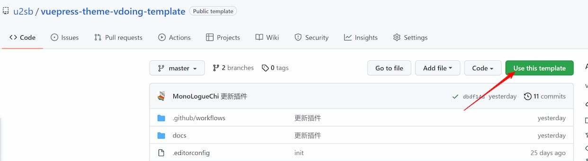

<!-- more -->

## 创建仓库

```js
let message: string = "Hello World";

message = "Hello TypeScript"; // 正确的做法
message = 20; // 错误的做法，因为message是一个string类型
```

使用 [vuepress-theme-vdoing-template](https://github.com/u2sb/vuepress-theme-vdoing-template) 作为模板创建仓库，详见 [从模板创建仓库](https://docs.github.com/cn/repositories/creating-and-managing-repositories/creating-a-repository-from-a-template)



## 拉取仓库

使用 `git clone` 命令拉取刚刚创建的仓库到本地。

## 视频教程

<!-- <Artplayer :src="{url:'https://user-images.githubusercontent.com/26868745/161530616-c301be93-4ae5-47ee-9959-e8b453428a4a.mp4'}" /> -->

<Artplayer :src="{url:'https://upos-sz-mirror08ct.bilivideo.com/upgcxcode/64/98/859679864/859679864-1-208.mp4?e=ig8euxZM2rNcNbRVhwdVhwdlhWdVhwdVhoNvNC8BqJIzNbfq9rVEuxTEnE8L5F6VnEsSTx0vkX8fqJeYTj_lta53NCM=&uipk=5&nbs=1&deadline=1670842048&gen=playurlv2&os=08ctbv&oi=3683394051&trid=e2057cb62cee46f4a6787e4bb1d75183T&mid=435001858&platform=html5&upsig=9133e91b2952ecf6df9d50cb8d906b57&uparams=e,uipk,nbs,deadline,gen,os,oi,trid,mid,platform&bvc=vod&nettype=0&bw=75971&orderid=0,1&logo=80000000'}" />
