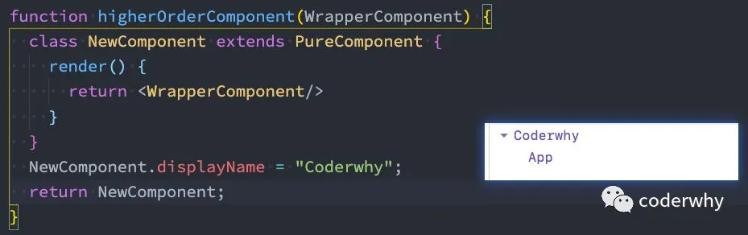
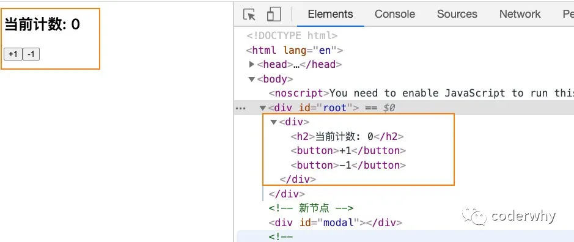
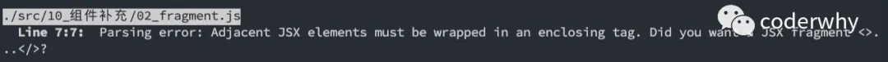
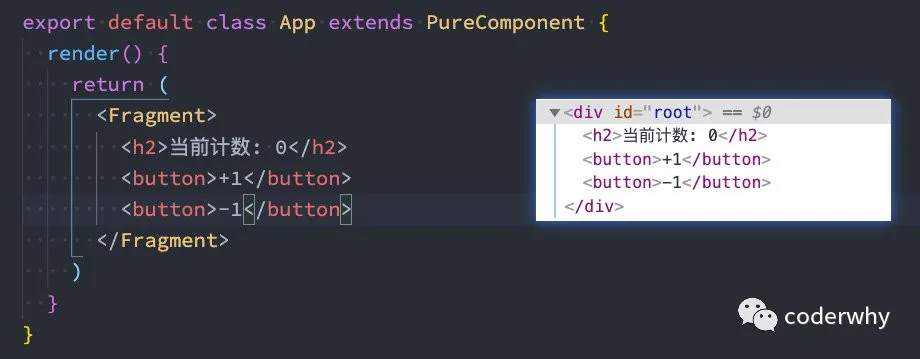
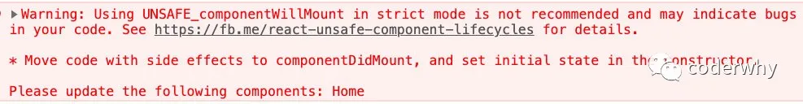
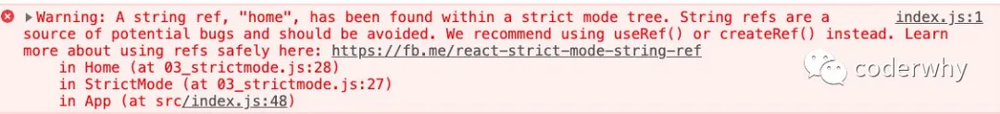

## 一. 高阶组件

### 1.1. 认识高阶组件

什么是高阶组件呢？相信很多同学都听说过，也用过 `高阶函数`，它们非常相似，所以我们可以先来回顾一下什么是 `高阶函数`。

高阶函数的维基百科定义：至少满足以下条件之一：

- 接受一个或多个函数作为输入；
- 输出一个函数；

JavaScript中比较常见的**filter、map、reduce**都是高阶函数。

那么说明是高阶组件呢？

- 高阶组件的英文是 **Higher-Order Components**，简称为 `HOC`；
- 官方的定义：**高阶组件是参数为组件，返回值为新组件的函数**；

我们可以进行如下的解析：

- 首先， `高阶组件` 本身不是一个组件，而是一个函数；
- 其次，这个函数的参数是一个组件，返回值也是一个组件；

高阶组件的调用过程类似于这样：

```javascript
const EnhancedComponent = higherOrderComponent(WrappedComponent);
```

高阶函数的编写过程类似于这样：

```javascript
function higherOrderComponent(WrapperComponent) {
  return class NewComponent extends PureComponent {
    render() {
      return <WrapperComponent/>
    }
  }
}
```

在ES6中，类表达式中类名是可以省略的，所以可以可以写成下面的写法：

```javascript
function higherOrderComponent(WrapperComponent) {
  return class extends PureComponent {
    render() {
      return <WrapperComponent/>
    }
  }
}
```

另外，组件的名称都可以通过displayName来修改：



完整的代码，我们可以这样来编写：

```javascript
import React, { PureComponent } from 'react';

function higherOrderComponent(WrapperComponent) {
  return class NewComponent extends PureComponent {
    render() {
      return <WrapperComponent/>
    }
  }
}

class App extends PureComponent {
  render() {
    return (
      <div>
        App
      </div>
    )
  }
}

export default higherOrderComponent(App);
```

高阶组件并不是React API的一部分，它是基于React的组合特性而形成的设计模式；

高阶组件在一些React第三方库中非常常见：

- 比如redux中的connect；（后续会讲到）
- 比如react-router中的withRouter；（后续会讲到）

在我们的开发中，高阶组件可以帮助我们做哪些事情呢？

### 1.2. 高阶组件的使用

#### 1.2.1. props的增强

**不修改原有代码的情况下，添加新的props**

加入我们有如下案例：

```javascript
class Header extends PureComponent {
  render() {
    const { name, age } = this.props;
    return <h2>Header {name + age}</h2>
  }
}

export default class App extends PureComponent {
  render() {
    return (
      <div>
        <Header name="aaa" age={18} />
      </div>
    )
  }
}
```

我们可以通过一个高阶组件，让使用者在不破坏原有结构的情况下对某个组件增强props：

```javascript
function enhanceProps(WrapperCpn, otherProps) {
 return props => <WrapperCpn {...props} {...otherProps} />
}

const EnhanceHeader = enhanceProps(Header, {height: 1.88})
```

**利用高阶组件来共享Context**

利用高阶组件来共享Context属性

```javascript
import React, { PureComponent, createContext } from 'react';

const UserContext = createContext({
  nickname: "默认",
  level: -1
})

function Header(props) {
  return (
    <UserContext.Consumer>
      {
        value => {
          const { nickname, level } = value;
          return <h2>Header {"昵称:" + nickname + "等级" + level}</h2>
        }
      }
    </UserContext.Consumer>
  )
}

function Footer(props) {
  return (
    <UserContext.Consumer>
      {
        value => {
          const { nickname, level } = value;
          return <h2>Footer {"昵称:" + nickname + "等级" + level}</h2>
        }
      }
    </UserContext.Consumer>
  )
}

const EnhanceHeader = enhanceProps(Header, { height: 1.88 })

export default class App extends PureComponent {
  render() {
    return (
      <div>
        <UserContext.Provider value={{ nickname: "why", level: 90 }}>
          <Header />
          <Footer />
        </UserContext.Provider>
      </div>
    )
  }
}
```

利用高阶组件`withUser`：

```javascript
import React, { PureComponent, createContext } from 'react';

const UserContext = createContext({
  nickname: "默认",
  level: -1
})

function withUser(WrapperCpn) {
  return props => {
    return (
      <UserContext.Consumer>
        {
          value => {
            return <WrapperCpn {...props} {...value}/>
          }
        }
      </UserContext.Consumer>
    )
  }
}

function Header(props) {
  const { nickname, level } = props;
  return <h2>Header {"昵称:" + nickname + "等级:" + level}</h2>
}


function Footer(props) {
  const { nickname, level } = props;
  return <h2>Footer {"昵称:" + nickname + "等级:" + level}</h2>
}

const UserHeader = withUser(Header);
const UserFooter = withUser(Footer);

export default class App extends PureComponent {
  render() {
    return (
      <div>
        <UserContext.Provider value={{ nickname: "why", level: 90 }}>
          <UserHeader />
          <UserFooter />
        </UserContext.Provider>
      </div>
    )
  }
}
```

#### 1.2.2. 渲染判断鉴权

在开发中，我们可能遇到这样的场景：

- 某些页面是必须用户登录成功才能进行进入；
- 如果用户没有登录成功，那么直接跳转到登录页面；

这个时候，我们就可以使用高阶组件来完成鉴权操作：

```javascript
function LoginPage() {
  return <h2>LoginPage</h2>
}

function CartPage() {
  return <h2>CartPage</h2>
}

export default class App extends PureComponent {
  render() {
    return (
      <div>
        <CartPage/>
      </div>
    )
  }
}
```

编写鉴权的高阶组件：

```javascript
function loginAuth(Page) {
  return props => {
    if (props.isLogin) {
      return <Page/>
    } else {
      return <LoginPage/>
    }
  }
}
```

完整的代码如下：

```javascript
import React, { PureComponent } from 'react';

function loginAuth(Page) {
  return props => {
    if (props.isLogin) {
      return <Page/>
    } else {
      return <LoginPage/>
    }
  }
}

function LoginPage() {
  return <h2>LoginPage</h2>
}

function CartPage() {
  return <h2>CartPage</h2>
}

const AuthCartPage = loginAuth(CartPage);

export default class App extends PureComponent {
  render() {
    return (
      <div>
        <AuthCartPage isLogin={true}/>
      </div>
    )
  }
}
```

#### 1.2.3. 生命周期劫持

```javascript
import React, { PureComponent } from 'react';

class Home extends PureComponent {

  UNSAFE_componentWillMount() {
    this.begin = Date.now();
  }

  componentDidMount() {
    this.end = Date.now();
    const interval = this.end - this.begin;
    console.log(`Home渲染使用时间:${interval}`)
  }

  render() {
    return (
      <div>
        <h2>Home</h2>
        <p>我是home的元素,哈哈哈</p>
      </div>
    )
  }
}

class Detail extends PureComponent {
  UNSAFE_componentWillMount() {
    this.begin = Date.now();
  }

  componentDidMount() {
    this.end = Date.now();
    const interval = this.end - this.begin;
    console.log(`Detail渲染使用时间:${interval}`)
  }

  render() {
    return (
      <div>
        <h2>Detail</h2>
        <p>我是detail的元素,哈哈哈</p>
      </div>
    )
  }
}

export default class App extends PureComponent {
  render() {
    return (
      <div>
        <Home/>
        <Detail/>
      </div>
    )
  }
}
```

我们可以定义如下高阶组件：

```javascript
function logRenderTime(WrapperCpn) {
  return class extends PureComponent {
    UNSAFE_componentWillMount() {
      this.begin = Date.now();
    }

    componentDidMount() {
      this.end = Date.now();
      const interval = this.end - this.begin;
      console.log(`Home渲染使用时间:${interval}`)
    }

    render() {
      return <WrapperCpn {...this.props}/>
    }
  }
}

const LogHome = logRenderTime(Home);
const LogDetail = logRenderTime(Detail);
```

完整代码如下：

```javascript
import React, { PureComponent } from 'react';

function logRenderTime(WrapperCpn) {
  return class extends PureComponent {
    UNSAFE_componentWillMount() {
      this.begin = Date.now();
    }

    componentDidMount() {
      this.end = Date.now();
      const interval = this.end - this.begin;
      console.log(`${WrapperCpn.name}渲染使用时间:${interval}`)
    }

    render() {
      return <WrapperCpn {...this.props}/>
    }
  }
}

class Home extends PureComponent {
  render() {
    return (
      <div>
        <h2>Home</h2>
        <p>我是home的元素,哈哈哈</p>
      </div>
    )
  }
}


class Detail extends PureComponent {
  render() {
    return (
      <div>
        <h2>Detail</h2>
        <p>我是detail的元素,哈哈哈</p>
      </div>
    )
  }
}

const LogHome = logRenderTime(Home);
const LogDetail = logRenderTime(Detail);

export default class App extends PureComponent {
  render() {
    return (
      <div>
        <LogHome />
        <LogDetail />
      </div>
    )
  }
}
```

### 1.3. 高阶函数的意义

我们会发现利用高阶组件可以针对某些React代码进行更加优雅的处理。

其实早期的React有提供组件之间的一种复用方式是mixin，目前已经不再建议使用：

- `Mixin` 可能会相互依赖，相互耦合，不利于代码维护
- 不同的`Mixin`中的方法可能会相互冲突
- `Mixin`非常多时，组件是可以感知到的，甚至还要为其做相关处理，这样会给代码造成滚雪球式的复杂性

当然，HOC也有自己的一些缺陷：

- `HOC`需要在原组件上进行包裹或者嵌套，如果大量使用`HOC`，将会产生非常多的嵌套，这让调试变得非常困难；
- `HOC`可以劫持`props`，在不遵守约定的情况下也可能造成冲突；

Hooks的出现，是开创性的，它解决了很多React之前的存在的问题，比如this指向问题、比如hoc的嵌套复杂度问题等等；

后续我们还会专门来学习hooks相关的知识，敬请期待；

## 二. 组件补充

### 2.1. ref转发

```javascript
import React, { PureComponent, createRef } from 'react';

function Home(props) {
  return (
    <div>
      <h2 ref={props.ref}>Home</h2>
      <button>按钮</button>
    </div>
  )
}

export default class App extends PureComponent {
  constructor(props) {
    super(props);

    this.homeTitleRef = createRef();
  }

  render() {
    return (
      <div>
        <Home ref={this.homeTitleRef}/>
        <button onClick={e => this.printInfo()}>打印ref</button>
      </div>
    )
  }

  printInfo() {
    console.log(this.homeTitleRef);
  }
}
```

使用forwardRef

```javascript
import React, { PureComponent, createRef, forwardRef } from 'react';

const Home = forwardRef(function(props, ref) {
  return (
    <div>
      <h2 ref={ref}>Home</h2>
      <button>按钮</button>
    </div>
  )
})

export default class App extends PureComponent {
  constructor(props) {
    super(props);

    this.homeTitleRef = createRef();
  }

  render() {
    return (
      <div>
        <Home ref={this.homeTitleRef}/>
        <button onClick={e => this.printInfo()}>打印ref</button>
      </div>
    )
  }

  printInfo() {
    console.log(this.homeTitleRef.current);
  }
}
```

### 2.2. Portals

某些情况下，我们希望渲染的内容独立于父组件，甚至是独立于当前挂载到的DOM元素中（默认都是挂载到id为root的DOM元素上的）。

Portal 提供了一种将子节点渲染到存在于父组件以外的 DOM 节点的优秀的方案：

- 第一个参数（`child`）是任何可渲染的 React 子元素，例如一个元素，字符串或 fragment；
- 第二个参数（`container`）是一个 DOM 元素；

```javascript
ReactDOM.createPortal(child, container)
```

通常来讲，当你从组件的 render 方法返回一个元素时，该元素将被挂载到 DOM 节点中离其最近的父节点：

```javascript
render() {
  // React 挂载了一个新的 div，并且把子元素渲染其中
  return (
    <div>      
      {this.props.children}
    </div>  
  );
}
```

然而，有时候将子元素插入到 DOM 节点中的不同位置也是有好处的：

```javascript
render() {
  // React 并*没有*创建一个新的 div。它只是把子元素渲染到 `domNode` 中。
  // `domNode` 是一个可以在任何位置的有效 DOM 节点。
  return ReactDOM.createPortal(
    this.props.children,
    domNode  
  );
}
```

**比如说，我们准备开发一个Modal组件，它可以将它的子组件渲染到屏幕的中间位置：**

步骤一：修改index.html添加新的节点

```javascript
<div id="root"></div>
<!-- 新节点 -->
<div id="modal"></div>
```

步骤二：编写这个节点的样式：

```javascript
#modal {
  position: fixed;
  left: 50%;
  top: 50%;
  transform: translate(-50%, -50%);
  background-color: red;
}
```

步骤三：编写组件代码

```javascript
import React, { PureComponent } from 'react';
import ReactDOM from 'react-dom';

class Modal extends PureComponent {
  constructor(props) {
    super(props);
  }

  render() {
    return ReactDOM.createPortal(
      this.props.children,
      document.getElementById("modal")
    )
  }
}

export default class App extends PureComponent {
  render() {
    return (
      <div>
        <Modal>
          <h2>我是标题</h2>
        </Modal>
      </div>
    )
  }
}
```

### 2.3. Fragment

在之前的开发中，我们总是在一个组件中返回内容时包裹一个div元素：

```javascript
export default class App extends PureComponent {
  render() {
    return (
      <div>
        <h2>当前计数: 0</h2>
        <button>+1</button>
        <button>-1</button>
      </div>
    )
  }
}
```



我们会发现多了一个div元素：

- 这个div元素对于某些场景是需要的（比如我们就希望放到一个div元素中，再针对性设置样式）
- 某些场景下这个div是没有必要的，比如当前这里我可能希望所有的内容直接渲染到root中即可；

我们可以删除这个div吗？



我们又希望可以不渲染这样一个div应该如何操作呢？

- 使用Fragment
- Fragment 允许你将子列表分组，而无需向 DOM 添加额外节点；



React还提供了Fragment的段语法：

- 它看起来像空标签 `<> </>`；

```javascript
export default class App extends PureComponent {
  render() {
    return (
      <>
        <h2>当前计数: 0</h2>
        <button>+1</button>
        <button>-1</button>
      </>
    )
  }
}
```

但是，如果我们需要在Fragment中添加key，那么就不能使用段语法：

```javascript
{
  this.state.friends.map((item, index) => {
    return (
      <Fragment key={item.name}>
        <div>{item.name}</div>
        <div>{item.age}</div>
      </Fragment>
    )
  })
}
```

这里是不支持如下写法的：

```javascript
<key={item.name}>
  <div>{item.name}</div>
  <div>{item.age}</div>
</>
```

### 2.4. StrictMode

`StrictMode` 是一个用来突出显示应用程序中潜在问题的工具。

- 与 `Fragment` 一样，`StrictMode` 不会渲染任何可见的 UI；
- 它为其后代元素触发额外的检查和警告；
- 严格模式检查仅在开发模式下运行；*它们不会影响生产构建*；

可以为应用程序的任何部分启用严格模式：

- *不*会对 `Header` 和 `Footer` 组件运行严格模式检查；
- 但是，`ComponentOne` 和 `ComponentTwo` 以及它们的所有后代元素都将进行检查；

```javascript
import React from 'react';

function ExampleApplication() {
  return (
    <div>
      <Header />
      <React.StrictMode>
        <div>
          <ComponentOne />
          <ComponentTwo />
        </div>
      </React.StrictMode>
      <Footer />
    </div>
  );
}
```

**但是检测，到底检测什么呢？**

1.识别不安全的生命周期：

```javascript
class Home extends PureComponent {
  UNSAFE_componentWillMount() {

  }

  render() {
    return <h2>Home</h2>
  }
}
```



2.使用过时的ref API

```javascript
class Home extends PureComponent {
  UNSAFE_componentWillMount() {

  }

  render() {
    return <h2 ref="home">Home</h2>
  }
}
```



3.使用废弃的findDOMNode方法

在之前的React API中，可以通过findDOMNode来获取DOM，不过已经不推荐使用了，可以自行学习演练一下

4.检查意外的副作用

- 这个组件的constructor会被调用两次；
- 这是严格模式下故意进行的操作，让你来查看在这里写的一些逻辑代码被调用多次时，是否会产生一些副作用；
- 在生产环境中，是不会被调用两次的；

```javascript
class Home extends PureComponent {
  constructor(props) {
    super(props);

    console.log("home constructor");
  }

  UNSAFE_componentWillMount() {

  }

  render() {
    return <h2 ref="home">Home</h2>
  }
}
```

5.检测过时的context API

早期的Context是通过static属性声明Context对象属性，通过getChildContext返回Context对象等方式来使用Context的；

目前这种方式已经不推荐使用，大家可以自行学习了解一下它的用法；