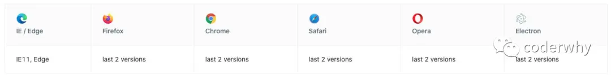
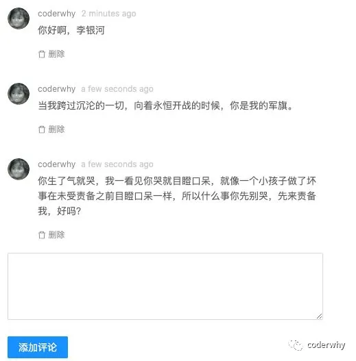

## 一. 认识AntDesign

### 1.1. AntDesign的介绍

`AntDesign` ，简称 `antd` 是基于 Ant Design 设计体系的 React UI 组件库，主要用于研发企业级中后台产品。

AntDesign的特点：

- 🌈 提炼自企业级中后台产品的交互语言和视觉风格。
- 📦 开箱即用的高质量 React 组件。
- 🛡 使用 TypeScript 开发，提供完整的类型定义文件。
- ⚙️ 全链路开发和设计工具体系。
- 🌍 数十个国际化语言支持。
- 🎨 深入每个细节的主题定制能力。

```
全链路开发和设计指的是什么？
```

- 全链路这个词我记得是16年左右阿里提出的；
- 从`业务战略—用户场景—设计目标—交互体验—用户流程—预期效率`全方面进行分析和考虑；
- 这个主要是产品经理会考虑的一个点；

AntDesign的兼容性：

- 现代浏览器和 IE11（需要 polyfills）。
- 支持服务端渲染。
- Electron

`antd@2.0` 之后不再支持 IE8，`antd@4.0` 之后不再支持 IE9/10。

目前稳定的版本：v4.4.0

### 1.2. AntDesign的安装

**使用 npm 或 yarn 安装**

npm安装：

```javascript
npm install antd --save
```

yarn安装：

```javascript
yarn add antd
```

我们需要在index.js中引入全局的Antd样式：

```javascript
import "antd/dist/antd.css";
```

在App.js中就可以使用一些组件了：


**考虑一个问题：Antd是否会将一些没有用的代码（组件或者逻辑代码）引入，造成包很大呢？**

`antd` 官网有提到：`antd` 的 JS 代码默认支持基于 ES modules 的 tree shaking，对于 js 部分，直接引入 `import { Button } from 'antd'` 就会有按需加载的效果。

### 1.3. 高级配置

#### 1.3.1. 认识craco

上面的使用过程是无法对主题进行配置的，好像对主题等相关的高级特性进行配置，需要修改create-react-app 的默认配置。

如何修改create-react-app 的默认配置呢？

- 前面我们讲过，可以通过`yarn run eject`来暴露出来对应的配置信息进行修改；
- 但是对于webpack并不熟悉的人来说，直接修改 CRA 的配置是否会给你的项目带来负担，甚至会增加项目的隐患和不稳定性呢？
- 所以，在项目开发中是不建议大家直接去修改 CRA 的配置信息的；

那么如何来进行修改默认配置呢？社区目前有两个比较常见的方案：

- react-app-rewired + customize-cra；（这个是antd早期推荐的方案）
- craco；（目前antd推荐的方案）

第一步：安装craco：

```javascript
yarn add @craco/craco
```

第二步：修改package.json文件

- 原本启动时，我们是通过react-scripts来管理的；
- 现在启动时，我们通过craco来管理；

```javascript
"scripts": {
-   "start": "react-scripts start",
-   "build": "react-scripts build",
-   "test": "react-scripts test",
+   "start": "craco start",
+   "build": "craco build",
+   "test": "craco test",
}
```

第三步：在根目录下创建craco.config.js文件用于修改默认配置

```javascript
module.exports = {
  // 配置文件
}
```

#### 1.3.2. 配置主题

按照 配置主题 的要求，自定义主题需要用到类似 less-loader 提供的 less 变量覆盖功能：

- 我们可以引入 craco-less 来帮助加载 less 样式和修改变量；

安装 `craco-less`：

```javascript
yarn add craco-less
```

修改craco.config.js中的plugins：

- 使用`modifyVars`可以在运行时修改LESS变量；

```javascript
const CracoLessPlugin = require('craco-less');

module.exports = {
  plugins: [
    {
      plugin: CracoLessPlugin,
      options: {
        lessLoaderOptions: {
          lessOptions: {
            modifyVars: { '@primary-color': '#1DA57A' },
            javascriptEnabled: true,
          },
        },
      },
    },
  ],
}
```

引入antd的样式时，引入antd.less文件：

```javascript
// import "antd/dist/antd.css";
import 'antd/dist/antd.less';
```

修改后重启 `yarn start`，如果看到一个绿色的按钮就说明配置成功了。

#### 1.3.3. 配置别名

在项目开发中，某些组件或者文件的层级会较深，

- 如果我们通过上层目录去引入就会出现这样的情况：`../../../../components/button`；
- 如果我们可以配置别名，就可以直接从根目录下面开始查找文件：`@/components/button`，甚至是：`components/button`；

配置别名也需要修改webpack的配置，当然我们也可以借助于 craco 来完成：

```javascript
...

const path = require("path");
const resolve = dir => path.resolve(__dirname, dir);

module.exports = {
  ...
  ,
  webpack: {
    alias: {
      '@': resolve("src"),
      'components': resolve("src/components"),
    }
  }
}
```

在导入时就可以按照下面的方式来使用了：

```javascript
import HYCommentInput from '@/components/comment-input';
import HYCommentItem from 'components/comment-item';
```

## 二. AntDesign案例

我们通过AntDesign来编写一个案例：



### 1.1. 案例-评论框

我们选来完成评论框，评论框有两部分组成：

- TextArea的输入框：Input.TextArea；
- 提交评论的按钮：Button；

```javascript
import React, { PureComponent } from 'react';

import moment from 'moment';
import {
  Form, Button, Input
} from 'antd';

export default class HYCommentInput extends PureComponent {
  constructor(props) {
    super(props);

    this.state = {
      value: ""
    }
  }

  render() {
    return (
      <div>
        <Input.TextArea rows={4} onChange={this.onChange.bind(this)} value={this.state.value} />
        <Button onClick={this.onSubmit.bind(this)} type="primary">
          添加评论
        </Button>
      </div>
    )
  }

  onChange(e) {
    this.setState({
      value: e.target.value
    })
  }

  onSubmit() {
    console.log(this.state.value, moment().fromNow());
    const commentInfo = {
      id: Date.now(),
      name: "coderwhy",
      avatar: "https://upload.jianshu.io/users/upload_avatars/1102036/c3628b478f06.jpeg?imageMogr2/auto-orient/strip|imageView2/1/w/240/h/240",
      content: <p>{this.state.value}</p>,
      datetime: moment()
    }

    this.props.submitComment(commentInfo);
    this.setState({
      value: ""
    });
  }
}
```

### 1.2. 案例-评论列表

评论列表主要是使用Comment组件，Comment组件有一些属性：

- author：展示作者的名称；

- avatar：展示作者的头像；

- - 可以使用Avatar的组件进行展示；

- content：展示评论的内容；

- datetime：展示评论的时间：

- - 这里我们可以使用Tooltip组件，当鼠标放在上面时，会显示对应的title内容；

- actions：评论下方的操作按钮；

- - 这里我们可以使用DeleteOutlined，但是它来自 `@ant-design/icons`，需要我们进行安装；

```javascript
import React, { PureComponent } from 'react';

import {
  Comment,
  Avatar,
  Tooltip
} from "antd";
import { DeleteOutlined } from "@ant-design/icons";

export default class HYCommentItem extends PureComponent {
  render() {
    const { comment } = this.props;

    return (
      <Comment
        author={<a href="/#">{comment.name}</a>}
        avatar={
          <Avatar
            src={comment.avatar}
            alt={comment.name}
          />
        }
        content={comment.content}
        datetime={
          <Tooltip title={comment.datetime.format('YYYY-MM-DD HH:mm:ss')}>
            <span>{comment.datetime.fromNow()}</span>
          </Tooltip>
        }
        actions={ this.getActions() }
      />
    )
  }

  getActions() {
    return [
      <span onClick={this.props.removeItem}><DeleteOutlined/> 删除</span>
    ]
  }
}
```

### 1.3. 案例-App组件

我们在App组件中，使用封装的两个组件：

```javascript
import React, { PureComponent } from 'react';

import HYCommentInput from './components/comment-input';
import HYCommentItem from './components/comment-item';

export default class App extends PureComponent {
  constructor(props) {
    super(props);

    this.state = {
      commentList: []
    }
  }

  render() {
    return (
      <div style={{width: "500px", padding: "20px"}}>
        {
          this.state.commentList.map((item, index) => {
            return <HYCommentItem key={item.id} 
                                  comment={item} 
                                  index={index} 
                                  removeItem={e => this.removeItem(index)}/>
          })
        }
        <HYCommentInput submitComment={this.submitComment.bind(this)}/>
      </div>
    )
  }

  submitComment(comment) {
    this.setState({
      commentList: [...this.state.commentList, comment]
    })
  }

  removeItem(index) {
    const newCommentList = [...this.state.commentList];
    newCommentList.splice(index, 1);
    this.setState({
      commentList: newCommentList
    })
  }
}
```