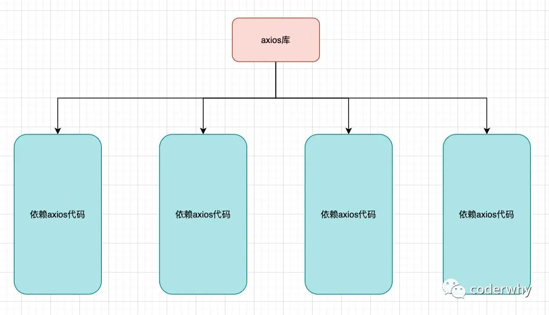
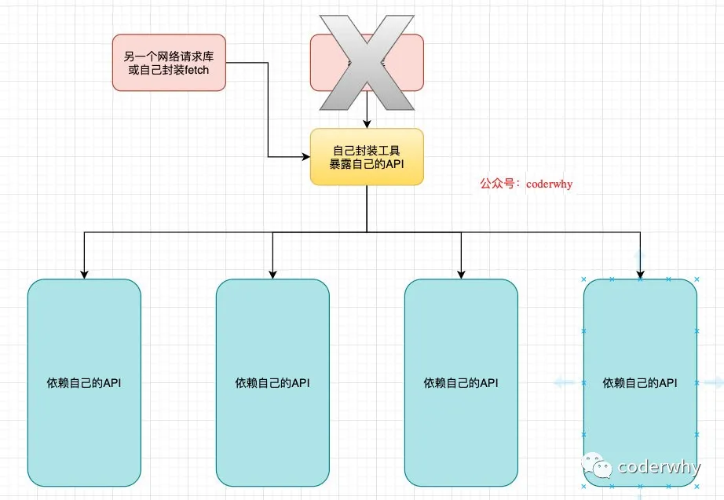

## 一. axios库的基本使用

### 1.1. 网络请求的选择

目前前端中发送网络请求的方式有很多种：

选择一:传统的Ajax是基于XMLHttpReques(XHR)

- 为什么不用它呢?

- - 非常好解释, 配置和调用方式等非常混乱.
  - 编码起来看起来就非常蛋疼.
  - 所以真实开发中很少直接使用, 而是使用jQuery-Ajax

选择二: 在前面的学习中, 我们经常会使用jQuery-Ajax

- 相对于传统的Ajax非常好用.

- 为什么不选择它呢？

- - jQuery整个项目太大，单纯使用ajax却要引入整个JQuery非常的不合理（采取个性化打包的方案又不能享受CDN服务）；
  - 基于原生的XHR开发，XHR本身的架构不清晰，已经有了fetch的替代方案；
  - 尽管JQuery对我们前端的开发工作曾有着深远的影响，但是的确正在退出历史舞台；

选择三: Fetch API

- 选择或者不选择它?

- - Fetch是AJAX的替换方案，基于Promise设计，很好的进行了关注分离，有很大一批人喜欢使用fetch进行项目开发；
  - 但是Fetch的缺点也很明显，首先需要明确的是Fetch是一个 low-level（底层）的API，没有帮助你封装好各种各样的功能和实现；
  - 比如发送网络请求需要自己来配置Header的Content-Type，不会默认携带cookie等；
  - 比如错误处理相对麻烦（只有网络错误才会reject，HTTP状态码404或者500不会被标记为reject）；
  - 比如不支持取消一个请求，不能查看一个请求的进度等等；
  - MDN Fetch学习地址：https://developer.mozilla.org/zh-CN/docs/Web/API/Fetch_API/Using_Fetch

选择四：axios

- axios: ajax i/o system.

- axios是目前前端使用非常广泛的网络请求库，包括Vue作者也是推荐在vue中使用axios；

- 主要特点包括：

- - 在浏览器中发送 XMLHttpRequests 请求；
  - 在 node.js 中发送 http请求；
  - 支持 Promise API；
  - 拦截请求和响应；
  - 转换请求和响应数据；
  - 等等；

### 1.2. axios的基本使用

支持多种请求方式:

- paxios(config)
- axios.request(config)
- axios.get(url[, config])
- axios.delete(url[, config])
- axios.head(url[, config])
- axios.post(url[, data[, config]])
- axios.put(url[, data[, config]])
- axios.patch(url[, data[, config]])

**注意：下面的测试我都会使用httpbin.org这个网站来测试，是我个人非常喜欢的一个网站；**

我们来发送一个get请求：

```javascript
   // 1.发送一个get请求
    axios({
      method: "get",
      url: "https:httpbin.org/get",
      params: {
        name: "coderwhy",
        age: 18
      }
    }).then(res => {
      console.log("请求结果:", res);
    }).catch(err => {
      console.log("错误信息:", err);
    });
```

你也可以直接发送get，那么就不需要传入method（当然不传入默认也是get请求）

```javascript
 axios.get("https://httpbin.org/get", {
      params: {
        name: "kobe",
        age: 40
      }
    }).then(res => {
      console.log("请求结果:", res);
    }).catch(err => {
      console.log("错误信息:", err);
    });
```

当然，你也可以使用await、async在componentDidMount中发送网络请求：

```javascript
  async componentDidMount() {
    const result = await axios.get("https://httpbin.org/get", {
      params: {
        name: "kobe",
        age: 40
      }
    })
    console.log(result);
  }
```

那么，有错误的时候，await中如何处理呢？使用try-catch来处理错误信息

```javascript
  async componentDidMount() {
    try {
      const result = await axios.get("https://httpbin.org/get", {
        params: {
          name: "kobe",
          age: 40
        }
      })
      console.log(result);
    } catch(err) {
      console.log(err);
    }
  }
```

发送多个并发的请求：

```javascript
 const request1 = axios.get("https://httpbin.org/get", {
      params: {name: "why", age: 18}
    });
    const request2 = axios.post("https://httpbin.org/post", {
      name: "kobe",
      age: 40
    })
    axios.all([request1, request2]).then(([res1, res2]) => {
      console.log(res1, res2);
    }).catch(err => {
      console.log(err);
    })
```

### 1.3. axios的配置信息

#### 1.3.1. 请求配置选项

下面是创建请求时可以用的配置选项：

- 只有URL是必传的；
- 如果没有指定method，请求将默认使用`get`请求；

```javascript
{
   // `url` 是用于请求的服务器 URL
  url: '/user',

  // `method` 是创建请求时使用的方法
  method: 'get', // default

  // `baseURL` 将自动加在 `url` 前面，除非 `url` 是一个绝对 URL。
  // 它可以通过设置一个 `baseURL` 便于为 axios 实例的方法传递相对 URL
  baseURL: 'https://some-domain.com/api/',

  // `transformRequest` 允许在向服务器发送前，修改请求数据
  // 只能用在 'PUT', 'POST' 和 'PATCH' 这几个请求方法
  // 后面数组中的函数必须返回一个字符串，或 ArrayBuffer，或 Stream
  transformRequest: [function (data, headers) {
    // 对 data 进行任意转换处理
    return data;
  }],

  // `transformResponse` 在传递给 then/catch 前，允许修改响应数据
  transformResponse: [function (data) {
    // 对 data 进行任意转换处理
    return data;
  }],

  // `headers` 是即将被发送的自定义请求头
  headers: {'X-Requested-With': 'XMLHttpRequest'},

  // `params` 是即将与请求一起发送的 URL 参数
  // 必须是一个无格式对象(plain object)或 URLSearchParams 对象
  params: {
    ID: 12345
  },

   // `paramsSerializer` 是一个负责 `params` 序列化的函数
  // (e.g. https://www.npmjs.com/package/qs, http://api.jquery.com/jquery.param/)
  paramsSerializer: function(params) {
    return Qs.stringify(params, {arrayFormat: 'brackets'})
  },

  // `data` 是作为请求主体被发送的数据
  // 只适用于这些请求方法 'PUT', 'POST', 和 'PATCH'
  // 在没有设置 `transformRequest` 时，必须是以下类型之一：
  // - string, plain object, ArrayBuffer, ArrayBufferView, URLSearchParams
  // - 浏览器专属：FormData, File, Blob
  // - Node 专属：Stream
  data: {
    firstName: 'Fred'
  },

  // `timeout` 指定请求超时的毫秒数(0 表示无超时时间)
  // 如果请求话费了超过 `timeout` 的时间，请求将被中断
  timeout: 1000,

   // `withCredentials` 表示跨域请求时是否需要使用凭证
  withCredentials: false, // default

  // `adapter` 允许自定义处理请求，以使测试更轻松
  // 返回一个 promise 并应用一个有效的响应 (查阅 [response docs](#response-api)).
  adapter: function (config) {
    /* ... */
  },

 // `auth` 表示应该使用 HTTP 基础验证，并提供凭据
  // 这将设置一个 `Authorization` 头，覆写掉现有的任意使用 `headers` 设置的自定义 `Authorization`头
  auth: {
    username: 'janedoe',
    password: 's00pers3cret'
  },

   // `responseType` 表示服务器响应的数据类型，可以是 'arraybuffer', 'blob', 'document', 'json', 'text', 'stream'
  responseType: 'json', // default

  // `responseEncoding` indicates encoding to use for decoding responses
  // Note: Ignored for `responseType` of 'stream' or client-side requests
  responseEncoding: 'utf8', // default

   // `xsrfCookieName` 是用作 xsrf token 的值的cookie的名称
  xsrfCookieName: 'XSRF-TOKEN', // default

  // `xsrfHeaderName` is the name of the http header that carries the xsrf token value
  xsrfHeaderName: 'X-XSRF-TOKEN', // default

   // `onUploadProgress` 允许为上传处理进度事件
  onUploadProgress: function (progressEvent) {
    // Do whatever you want with the native progress event
  },

  // `onDownloadProgress` 允许为下载处理进度事件
  onDownloadProgress: function (progressEvent) {
    // 对原生进度事件的处理
  },

   // `maxContentLength` 定义允许的响应内容的最大尺寸
  maxContentLength: 2000,

  // `validateStatus` 定义对于给定的HTTP 响应状态码是 resolve 或 reject  promise 。如果 `validateStatus` 返回 `true` (或者设置为 `null` 或 `undefined`)，promise 将被 resolve; 否则，promise 将被 rejecte
  validateStatus: function (status) {
    return status >= 200 && status < 300; // default
  },

  // `maxRedirects` 定义在 node.js 中 follow 的最大重定向数目
  // 如果设置为0，将不会 follow 任何重定向
  maxRedirects: 5, // default

  // `socketPath` defines a UNIX Socket to be used in node.js.
  // e.g. '/var/run/docker.sock' to send requests to the docker daemon.
  // Only either `socketPath` or `proxy` can be specified.
  // If both are specified, `socketPath` is used.
  socketPath: null, // default

  // `httpAgent` 和 `httpsAgent` 分别在 node.js 中用于定义在执行 http 和 https 时使用的自定义代理。允许像这样配置选项：
  // `keepAlive` 默认没有启用
  httpAgent: new http.Agent({ keepAlive: true }),
  httpsAgent: new https.Agent({ keepAlive: true }),

  // 'proxy' 定义代理服务器的主机名称和端口
  // `auth` 表示 HTTP 基础验证应当用于连接代理，并提供凭据
  // 这将会设置一个 `Proxy-Authorization` 头，覆写掉已有的通过使用 `header` 设置的自定义 `Proxy-Authorization` 头。
  proxy: {
    host: '127.0.0.1',
    port: 9000,
    auth: {
      username: 'mikeymike',
      password: 'rapunz3l'
    }
  },

  // `cancelToken` 指定用于取消请求的 cancel token
  // （查看后面的 Cancellation 这节了解更多）
  cancelToken: new CancelToken(function (cancel) {
  })
}
```

#### 1.3.2. 响应结构信息

某个请求的响应包含以下信息：

```javascript
{
  // `data` 由服务器提供的响应
  data: {},

  // `status` 来自服务器响应的 HTTP 状态码
  status: 200,

  // `statusText` 来自服务器响应的 HTTP 状态信息
  statusText: 'OK',

  // `headers` 服务器响应的头
  headers: {},

   // `config` 是为请求提供的配置信息
  config: {},
 // 'request'
  // `request` is the request that generated this response
  // It is the last ClientRequest instance in node.js (in redirects)
  // and an XMLHttpRequest instance the browser
  request: {}
}
```

#### 1.3.3. 默认配置信息

你可以指定将被用在各个请求的配置默认值：

**全局的axios默认配置：**

```javascript
axios.defaults.baseURL = 'https://api.example.com';
axios.defaults.headers.common['Authorization'] = AUTH_TOKEN;
axios.defaults.headers.post['Content-Type'] = 'application/x-www-form-urlencoded';
```

**自定义实例默认配置：**

```javascript
const instance = axios.create({
  baseURL: 'https://api.example.com'
});

// Alter defaults after instance has been created
instance.defaults.headers.common['Authorization'] = AUTH_TOKEN;
```

配置信息的查找顺序如下：

- 优先是请求的config参数配置；
- 其次是实例的default中的配置；
- 最后是创建实例时的配置；

### 1.4. axios的拦截器

axios库有一个非常好用的特性是可以添加拦截器：

- 请求拦截器：在发送请求时，请求被拦截；

- - 发送网络请求时，在页面中添加一个loading组件作为动画；
  - 某些网络请求要求用户必须登录，可以在请求中判断是否携带了token，没有携带token直接跳转到login页面；
  - 对某些请求参数进行序列化；

- 响应拦截器：在响应结果中，结果被拦截；

- - 响应拦截中可以对结果进行二次处理（比如服务器真正返回的数据其实是在response的data中）；
  - 对于错误信息进行判断，根据不同的状态进行不同的处理；

```javascript
axios.interceptors.request.use(config => {
  // 1.发送网络请求时，在页面中添加一个loading组件作为动画；

  // 2.某些网络请求要求用户必须登录，可以在请求中判断是否携带了token，没有携带token直接跳转到login页面；

  // 3.对某些请求参数进行序列化；
  return config;
}, err => {
  return err;
})

axios.interceptors.response.use(response => {
  return response.data;
}, err => {
  if (err && err.response) {
    switch (err.response.status) {
      case 400:
        err.message = "请求错误";
        break;
      case 401:
        err.message = "未授权访问";
        break;
    }
  }
  return err;
})
```

## 二. axios库的二次封装

### 2.1. 为什么要封装

为什么我们要对axios进行二次封装呢？

- 默认情况下我们是可以直接使用axios来进行开发的；
- 但是我们考虑一个问题，假如有100多处中都直接依赖axios，突然间有一天axios出现了重大bug，并且该库已经不再维护，这个时候你如何处理呢？
- 大多数情况下我们会寻找一个新的网络请求库或者自己进行二次封装；
- 但是有100多处都依赖了axios，方便我们进行修改吗？我们所有依赖axios库的地方都需要进行修改；



如果是自己进行了二次封装，并且暴露一套自己的API：



### 2.2. axios二次封装

创建一个service文件夹（其他名字都可以），用于存放所有的网络请求相关的内容。

创建文件config.js，用于存放一些配置信息：

```javascript
export const TIMEOUT = 5000;

const devBaseURL = "https://httpbin.org";
const proBaseURL = "https://production.org";
console.log(process.env.NODE_ENV);
export const baseURL = process.env.NODE_ENV === 'development' ? devBaseURL: proBaseURL;
```

创建request.js，用于封装请求对象：

```javascript
import axios from 'axios';

import {
  TIMEOUT,
  baseURL
 } from "./config";

const instance = axios.create({
  timeout: TIMEOUT,
  baseURL: baseURL
})

axios.interceptors.request.use(config => {
  // 1.发送网络请求时，在页面中添加一个loading组件作为动画；

  // 2.某些网络请求要求用户必须登录，可以在请求中判断是否携带了token，没有携带token直接跳转到login页面；

  // 3.对某些请求参数进行序列化；
  return config;
}, err => {
  return err;
})

instance.interceptors.response.use(response => {
  return response.data;
}, err => {
  if (err && err.response) {
    switch (err.response.status) {
      case 400:
        err.message = "请求错误";
        break;
      case 401:
        err.message = "未授权访问";
        break;
    }
  }
  return err;
})

export default instance;

```

使用测试：

```javascript
request({
  url: "/get",
  params: {
    name: "why",
    age: 18
  }
}).then(console.log).catch(console.error);

request({
  url: "/post",
  method: "post",
  data: {
    name: "kobe",
    age: 40
  }
}).then(console.log).catch(console.error);
```