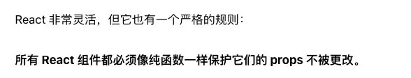
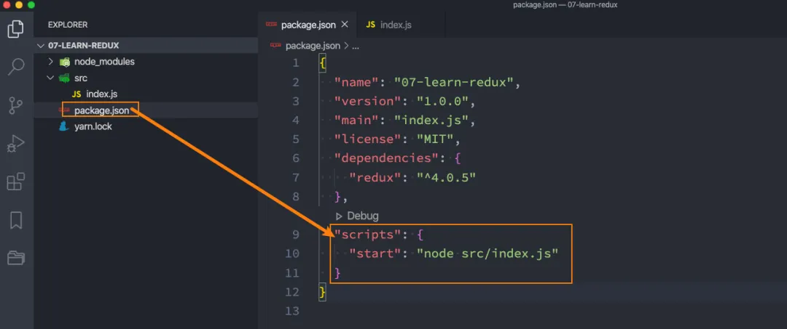
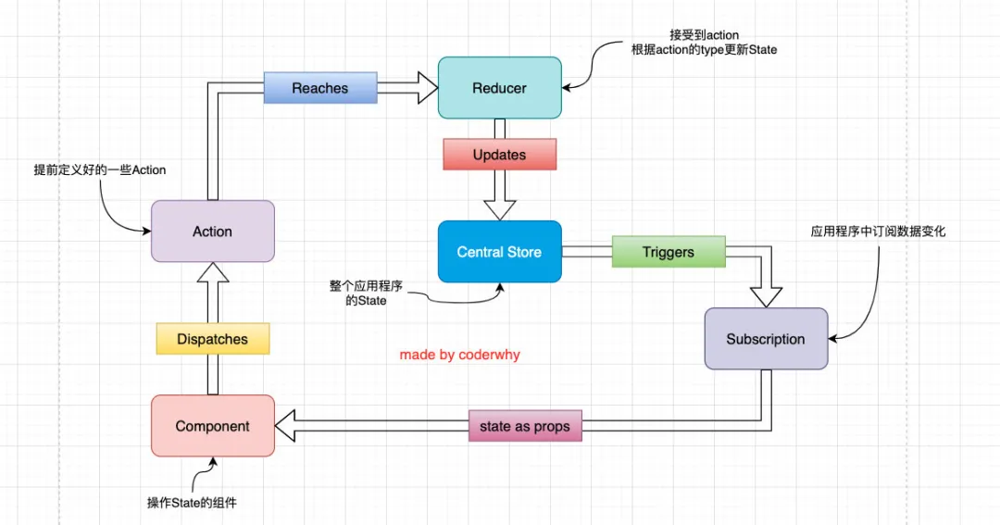

> 在React的开发过程中，Redux对于我们是非常重要的。
>
> 但是对于很多人来说，初次接触redux会感觉redux的学习坡度非常陡峭，难度比较大。
>
> 在接下来，我会通过一个系列的方式循循渐进、层层深入的方式来讲解Redux：从redux的独立使用过程、到redux的结构划分、到redux结合react的过程、到redux中异步操作、到复杂数据的结构处理、到结合immutable的使用。
>
> 整个过程，都是在现有知识的基础之上层层递增、一步步掌握redux的使用！

## 一. 认识Redux

### 1.1. JavaScript纯函数

函数式编程中有一个概念叫==纯函数==，JavaScript符合函数式编程的范式，所以也有纯函数的概念；

在React中，纯函数的概念非常重要，在接下来我们学习的Redux中也非常重要，所以我们有必须来回顾（如果你之前没有学过，那么你就是学习）一下纯函数。

**纯函数的维基百科定义：**

在程序设计中，若一个函数符合以下条件，那么这个函数被称为纯函数：

- 此函数在相同的输入值时，需产生相同的输出。函数的输出和输入值以外的其他隐藏信息或状态无关，也和由I/O设备产生的外部输出无关。
- 该函数不能有语义上可观察的函数副作用，诸如“触发事件”，使输出设备输出，或更改输出值以外物件的内容等。

当然上面的定义会过于的晦涩，所以我简单总结一下：

- **确定的输入，一定会产生确定的输出；**
- **函数在执行过程中，不能产生副作用；**

那么我们来看几个函数是否是纯函数：

案例一：

- 很明显，下面的函数是一个纯函数；
- 它的输出是依赖我们的输入内容，并且中间没有产生任何副作用；

```jsx
function sum(num1, num2) {  
    return num1 + num2;
}
```

案例二：

- add函数不是一个纯函数；
- 函数依赖一个外部的变量，变量发生改变时，会影响：确定的输入，产生确定的输出；
- 能否改进成纯函数呢？const foo = 5; 即可

```jsx
let foo = 5; //这个函数不是纯函数,因为foo可以被更改,所以 const定义的foo 就可以使他转变为纯函数

function add(num) {
  return foo + num;
}

console.log(add(5));
foo = 10;
console.log(add(5));
```

案例三：

- printInfo不是一个纯函数；
- 虽然无论输入什么，最终输出都是undefined，但是它产生了副作用，修改了传入的对象；

```jsx
function printInfo(info) {
  console.log(info.name, info.age);
  info.name = "哈哈哈";
}
```

当然纯函数还有很多的变种，但是我们只需要理解它的核心就可以了。

为什么纯函数在函数式编程中非常重要呢？

- 因为你可以`安心的写`和`安心的用`；
- 你在写的时候保证了函数的纯度，只是但是实现自己的业务逻辑即可，不需要关心传入的内容或者依赖其他的外部变量；
- 你在用的时候，你确定你的输入内容不会被任意篡改，并且自己确定的输入，一定会有确定的输出；

React中就要求我们无论是函数还是class声明一个组件，这个==组件都必须像纯函数一样，保护它们的props不被修改==：



在之后学习redux中，reducer也被要求是一个纯函数。

### 1.2. 认识Redux

#### 1.2.1. 为什么需要redux？

JavaScript开发的应用程序，已经变得越来越复杂了：

- JavaScript需要管理的状态越来越多，越来越复杂；
- 这些状态包括服务器返回的数据、缓存数据、用户操作产生的数据等等，也包括一些UI的状态，比如某些元素是否被选中，是否显示加载动效，当前分页；

管理不断变化的state是非常困难的：

- 状态之间相互会存在依赖，一个状态的变化会引起另一个状态的变化，View页面也有可能会引起状态的变化；
- 当应用程序复杂时，state在什么时候，因为什么原因而发生了变化，发生了怎么样的变化，会变得非常难以控制和追踪；

React是在视图层帮助我们解决了DOM的渲染过程，但是State依然是留给我们自己来管理：

- 无论是组件定义自己的state，还是组件之间的通信通过props进行传递；也包括通过Context进行数据之间的共享；
- React主要负责帮助我们管理视图，state如何维护最终还是我们自己来决定；


Redux就是一个帮助我们管理State的容器：Redux是JavaScript的状态容器，提供了可预测的状态管理；

Redux除了和React一起使用之外，它也可以和其他界面库一起来使用（比如Vue），并且它非常小（包括依赖在内，只有2kb）

#### 1.2.2. redux的核心理念

Redux的核心理念非常简单。

比如我们有一个朋友列表需要管理：

- 如果我们没有定义统一的规范来操作这段数据，那么整个数据的变化就是无法跟踪的；
- 比如页面的某处通过`products.push`的方式增加了一条数据；
- 比如另一个页面通过`products[0].age = 25`修改了一条数据；
- 整个应用程序错综复杂，当出现bug时，很难跟踪到底哪里发生的变化；

```jsx
const initialState = {
  friends: [
    { name: "why", age: 18 },
    { name: "kobe", age: 40 },
    { name: "lilei", age: 30 },
  ]
};
```

Redux要求我们通过action来更新数据：

- 所有数据的变化，必须通过派发（dispatch）action来更新；
- action是一个普通的JavaScript对象，用来描述这次更新的type和content；

比如下面就是几个更新friends的action：

- 强制使用action的好处是可以清晰的知道数据到底发生了什么样的变化，所有的数据变化都是可跟追、可预测的；
- 当然，目前我们的action是固定的对象，真实应用中，我们会通过函数来定义，返回一个action；

```jsx
const action1 = { type: "ADD_FRIEND", info: { name: "lucy", age: 20 } }
const action2 = { type: "INC_AGE", index: 0 }
const action3 = { type: "CHANGE_NAME", playload: { index: 0, newName: "coderwhy" } }
```

但是如何将state和action联系在一起呢？答案就是reducer

- reducer是一个纯函数；
- ==reducer做的事情就是将传入的state和action结合起来生成一个新的state；==

```jsx
function reducer(state = initialState, action) {
  switch (action.type) {
    case "ADD_FRIEND":
      return { ...state, friends: [...state.friends, action.info] }
    case "INC_AGE":
      return {
        ...state, friends: state.friends.map((item, index) => {
          if (index === action.index) {
            return { ...item, age: item.age + 1 }
          }
          return item;
        })
      }
    case "CHANGE_NAME":
      return {
        ...state, friends: state.friends.map((item, index) => {
          if (index === action.index) {
            return { ...item, name: action.newName }
          }
          return item;
        })
      }
    default:
      return state;
  }
}
```

#### 1.2.3. redux的三大原则

**单一数据源**

整个应用程序的state被存储在一颗object tree中，并且这个object tree只存储在一个 store 中：

- Redux并没有强制让我们不能创建多个Store，但是那样做并不利于数据的维护；
- 单一的数据源可以让整个应用程序的state变得方便维护、追踪、修改；

**State是只读的**

==唯一修改State的方法一定是触发action==，不要试图在其他地方通过任何的方式来修改State：

- 这样就确保了View或网络请求都不能直接修改state，它们只能通过action来描述自己想要如何修改state；
- 这样可以保证所有的修改都被集中化处理，并且按照严格的顺序来执行，所以不需要担心race condition（竟态）的问题；

**使用纯函数来执行修改**

通过reducer将 `旧state`和 `actions`联系在一起，并且返回一个新的State：

- 随着应用程序的复杂度增加，我们可以将reducer拆分成多个小的reducers，分别操作不同state tree的一部分；
- 但是所有的reducer都应该是纯函数，不能产生任何的副作用；

## 二. redux的基本使用

### 2.1. redux使用过程

安装redux：

```jsx
npm install redux --save
# 或
yarn add redux
```

这里，我通过创建一个简单的js文件，我们先来简单学习一下redux：

**搭建项目结构**

1.创建一个新的项目文件夹：learn-redux

```jsx
# 执行初始化操作
yarn init

# 安装redux
yarn add redux
```

2.创建src目录，并且创建index.js文件

- 暂时没有任何内容

3.修改package.json可以执行index.js

```js
"scripts": {
  "start": "node src/index.js"
}
```



**开始在index.js中编写代码**

1.创建一个对象，作为我们要保存的状态：

```jsx
const redux = require('redux');

const initialState = {
  counter: 0
}
```

2.创建Store来存储这个state

- 创建store时必须创建reducer；
- 我们可以通过 `store.getState` 来获取当前的state

````js
// 创建reducer
const reducer = (state = initialState, action) => {
  return state;
}

// 根据reducer创建store
const store = redux.createStore(reducer);

console.log(store.getState());
````

3.通过action来修改state

- 通过dispatch来派发action；
- 通常action中都会有type属性，也可以携带其他的数据；

```jsx
store.dispatch({
  type: "INCREMENT"
})

store.dispath({
  type: "DECREMENT"
})

store.dispatch({
  type: "ADD_NUMBER",
  number: 5
})
```

4.修改reducer中的处理代码

- 这里一定要记住，reducer是一个纯函数，不需要直接修改state；
- 后面我会讲到直接修改state带来的问题；

```jsx
const reducer = (state = initialState, action) => {
  switch (action.type) {
    case "INCREMENT":
      return {...state, counter: state.counter + 1};
    case "DECREMENT":
      return {...state, counter: state.counter - 1};
    case "ADD_NUMBER":
      return {...state, counter: state.counter + action.number}
    default: 
      return state;
  }
}
```

5.可以在派发action之前，监听store的变化：

```jsx
store.subscribe(() => {
  console.log(store.getState());
})
```

完成的案例代码如下：

```jsx
const redux = require('redux');

const initialState = {
  counter: 0
}

// 创建reducer 
const reducer = (state = initialState, action) => {
  switch (action.type) {
    case "INCREMENT":
      return {...state, counter: state.counter + 1};
    case "DECREMENT":
      return {...state, counter: state.counter - 1};
    case "ADD_NUMBER":
      return {...state, counter: state.counter + action.number}
    default: 
      return state;
  }
}

// 根据reducer创建store
const store = redux.createStore(reducer);

//订阅store
store.subscribe(() => {
  console.log(store.getState());
})

// 修改store中的state
store.dispatch({
  type: "INCREMENT"
})
// console.log(store.getState());

store.dispatch({
  type: "DECREMENT"
})
// console.log(store.getState());

store.dispatch({
  type: "ADD_NUMBER",
  number: 5
})
// console.log(store.getState());
```

### 2.2. redux结构划分

如果我们将所有的逻辑代码写到一起，那么当redux变得复杂时代码就难以维护。

接下来，我会对代码进行拆分，将**store、reducer、action、constants**拆分成一个个文件。

**注意：node中对ES6模块化的支持**

目前我使用的node版本是v12.16.1，从node v13.2.0开始，node才对ES6模块化提供了支持：

- node v13.2.0之前，需要进行如下操作：

- - 在package.json中添加属性：`"type": "module"`；
  - 在执行命令中添加如下选项：`node --experimental-modules src/index.js`;

- node v13.2.0之后，只需要进行如下操作：

- - 在package.json中添加属性：`"type": "module"`；

==注意：导入文件时，需要跟上.js后缀名==；

**对redux结构进行划分**

创建store/index.js文件：

```jsx
import redux from 'redux';
import reducer from './reducer.js';

const store = redux.createStore(reducer);

export default store;
```

创建store/reducer.js文件：

```jsx
import {
  ADD_NUMBER,
  SUB_NUMBER
} from './constants.js';

const initialState = {
  counter: 0
}

function reducer(state = initialState, action) {
  switch(action.type) {
    case ADD_NUMBER:
      return {...state, counter: state.counter + action.num};
    case SUB_NUMBER:
      return {...state, counter: state.counter - action.num};
    default:
      return state;
  } 
}

export default reducer;
```

创建store/actionCreators.js文件：

```jsx
import {
  ADD_NUMBER,
  SUB_NUMBER
} from './constants.js'

const addAction = (count) => ({
  type: ADD_NUMBER,
  num: count
});

const subAction = (count) => ({
  type: SUB_NUMBER,
  num: count
})

export {
  addAction,
  subAction
}
```

创建store/constants.js文件：

```jsx
const ADD_NUMBER = "ADD_NUMBER";
const SUB_NUMBER = "SUB_NUMER";

export {
  ADD_NUMBER,
  SUB_NUMBER
}
```

### 2.3. Redux流程图

我们已经知道了redux的基本使用过程，那么我们就更加清晰来认识一下redux在实际开发中的流程：

- 1.全局通常只有一个Store，存储我们的State；
- 2.Component中在某些情况会派发Action（这些Action是我们提前定义好的）；
- 3.Reducer会接收到这些Action，并且在Reducer中会返回一个新的State，作为Store的State；
- 4.State发生更新之后会触发通知，告知订阅者数据发生了改变；
- 5.订阅者拿到最新的数据（在props中），更新到jsx中，界面发生改变；


