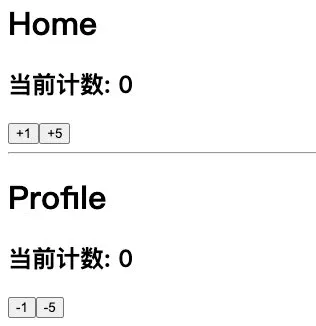

> 上一个章节主要是学习redux本身的基本使用过程，这个章节我们来学习一下如何将redux结合到React中来使用。
>
> 我会先按照简单的方式，自己来将redux结合到react中，并且结合高阶函数、Context一步步来实现connect和Provider的功能。
>
> 紧接着会讲解react-redux库的使用，帮助我们实现react-redux的连接。

## 一. react结合redux

### 1.1. redux融入react代码

目前redux在react中使用是最大的，所以我们需要将之前编写的redux代码，融入到react当中去。

这里我创建了两个组件：

- Home组件：其中会展示当前的counter值，并且有一个+1和+5的按钮；
- Profile组件：其中会展示当前的counter值，并且有一个-1和-5的按钮；



home.js代码实现：

```jsx
import React, { PureComponent } from 'react';

import store from '../store';
import {
  addAction
} from '../store/actionCreators';

export default class Home extends PureComponent {
  constructor(props) {
    super(props);

    this.state = {
      counter: store.getState().counter
    }
  }

  componentDidMount() {
    store.subscribe(() => {
      this.setState({
        counter: store.getState().counter
      })
    })
  }

  render() {
    return (
      <div>
        <h1>Home</h1>
        <h2>当前计数: {this.state.counter}</h2>
        <button onClick={e => this.increment()}>+1</button>
        <button onClick={e => this.addCounter()}>+5</button>
      </div>
    )
  }

  increment() {
    store.dispatch(addAction(1));
  }

  addCounter() {
    store.dispatch(addAction(5));
  }
}
```

Profile.js代码实现：

```jsx
import React, { PureComponent } from 'react';

import store from '../store';
import {
  subAction
} from '../store/actionCreators';

export default class Profile extends PureComponent {
  constructor(props) {
    super(props);

    this.state = {
      counter: store.getState().counter
    }
  }

  componentDidMount() {
    store.subscribe(() => {
      this.setState({
        counter: store.getState().counter
      })
    })
  }

  render() {
    return (
      <div>
        <hr/>
        <h1>Profile</h1>
        <div>
          <h2>当前计数: {this.state.counter}</h2>
          <button onClick={e => this.decrement()}>-1</button>
          <button onClick={e => this.subCounter()}>-5</button>
        </div>
      </div>
    )
  }

  decrement() {
    store.dispatch(subAction(1));
  }

  subCounter() {
    store.dispatch(subAction(5));
  }
}
```

上面的代码其实非常简单，核心代码主要是两个：

- 在 `componentDidMount` 中定义数据的变化，当数据发生变化时重新设置 `counter`;
- 在发生点击事件时，调用store的`dispatch`来派发对应的`action`；

### 1.2. 自定义connect函数

上面的代码是否可以实现`react组件`和`redux`结合起来呢？

- 当然是可以的，但是我们会发现每个使用的地方其实会有一些重复的代码：
- 比如监听store数据改变的代码，都需要在 `componentDidMount`中完成；
- 比如派发事件，我们都需要去先拿到 `store`， 在调用其 `dispatch` 等；

能否将这些公共的内容提取出来呢？

我们来定义一个connect函数：

- 这个connect函数本身接受两个参数：

- - 参数一：里面存放 `component` 希望使用到的 `State` 属性；
  - 参数二：里面存放 `component` 希望使用到的 `dispatch`动作；

- 这个connect函数有一个返回值，是一个高阶组件：

- - 在`constructor`中的state中保存一下我们需要获取的状态；
  - 在`componentDidMount`中订阅store中数据的变化，并且执行 `setState`操作；
  - 在`componentWillUnmount`中需要取消订阅；
  - 在`render`函数中返回传入的`WrappedComponent`，并且将所有的状态映射到其`props`中；
  - 这个高阶组件接受一个组件作为参数，返回一个class组件；
  - 在这个class组件中，我们进行如下操作：

```jsx
import React, { PureComponent } from "react";

import store from '../store';

export default function connect(mapStateToProps, mapDispatchToProps) {
  return function handleMapCpn(WrappedComponent) {
    return class extends PureComponent {
      constructor(props) {
        super(props);

        this.state = {
          storeState: mapStateToProps(store.getState())
        }
      }

      componentDidMount() {
        this.unsubscribe = store.subscribe(() => {
          this.setState({
            storeState: mapStateToProps(store.getState())
          })
        })
      }

      componentWillUnmount() {
        this.unsubscribe();
      }

      render() {
        return <WrappedComponent {...this.props} 
                                 {...mapStateToProps(store.getState())}
                                 {...mapDispatchToProps(store.dispatch)}/>
      }
    }
  }
}
```

在home和props文件中，我们按照自己需要的state、dispatch来进行映射：

比如home.js中进行如下修改：

- mapStateToProps：用于将state映射到一个对象中，对象中包含我们需要的属性；

- mapDispatchToProps：用于将dispatch映射到对象中，对象中包含在组件中可能操作的函数；

- - 当调用该函数时，本质上其实是调用dispatch(对应的Action)；

```jsx
const mapStateToProps = state => {
  return {
    counter: state.counter
  }
}

const mapDispatchToProps = dispatch => {
  return {
    addNumber: function(number) {
      dispatch(addAction(number));
    }
  }
}

export default connect(mapStateToProps, mapDispatchToProps)(Home);
```

在Profile中也是类似的操作。

有了connect函数，我们之后只需要关心从state和dispatch中映射自己需要的状态和行为即可；

### 1.3. store的context处理

但是上面的connect函数有一个很大的缺陷：依赖导入的store

- 如果我们将其封装成一个独立的库，需要依赖用于创建的store，我们应该如何去获取呢？
- 难道让用户来修改我们的源码吗？不太现实；

正确的做法是我们提供一个Provider，Provider来自于我们创建的Context，让用户将store传入到value中即可；

创建一个context.js文件：

```jsx
import { createContext } from 'react';

export const StoreContext = createContext();
```

修改connect函数中class组件部分的代码：

- 注意下面我们将class组件的名称明确的定义出来，并且给它的`contextType`进行了赋值；
- 在组件内部用到store的地方，统一使用this.context代替（注意：constructor中直接使用第二个参数即可）

```jsx
import React, { PureComponent } from "react";

import { StoreContext } from './context';

export default function connect(mapStateToProps, mapDispatchToProps) {
  return function handleMapCpn(WrappedComponent) {
    class ConnectCpn extends PureComponent {
      constructor(props, context) {
        super(props);

        this.state = {
          storeState: mapStateToProps(context.getState())
        }
      }

      componentDidMount() {
        this.unsubscribe = this.context.subscribe(() => {
          this.setState({
            storeState: mapStateToProps(this.context.getState())
          })
        })
      }

      componentWillUnmount() {
        this.unsubscribe();
      }

      render() {
        return <WrappedComponent {...this.props}
          {...mapStateToProps(this.context.getState())}
          {...mapDispatchToProps(this.context.dispatch)} />
      }
    }

    ConnectCpn.contextType = StoreContext;

    return ConnectCpn;
  }
}
```

在入口的index.js中，使用Provider并且提供store即可：

```jsx
import { StoreContext } from './utils/context';
import store from './store';

ReactDOM.render(
  <StoreContext.Provider value={store}>
    <App />
  </StoreContext.Provider>,
  document.getElementById('root')
);
```

测试代码，依然可以正常运行。

## 二. react-redux使用

### 2.1. react-redux的使用

开始之前需要强调一下，redux和react没有直接的关系，你完全可以在React, Angular, Ember, jQuery, or vanilla JavaScript中使用Redux。

尽管这样说，redux依然是和React或者Deku的库结合的更好，因为他们是通过state函数来描述界面的状态，Redux可以发射状态的更新，让他们作出相应。

虽然我们之前已经实现了connect、Provider这些帮助我们完成连接redux、react的辅助工具，但是实际上redux官方帮助我们提供了 react-redux 的库，可以直接在项目中使用，并且实现的逻辑会更加的严谨和高效。


