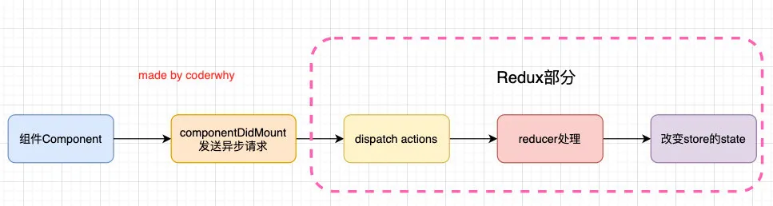
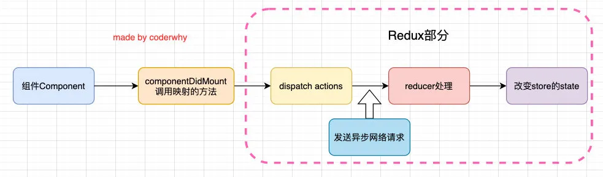
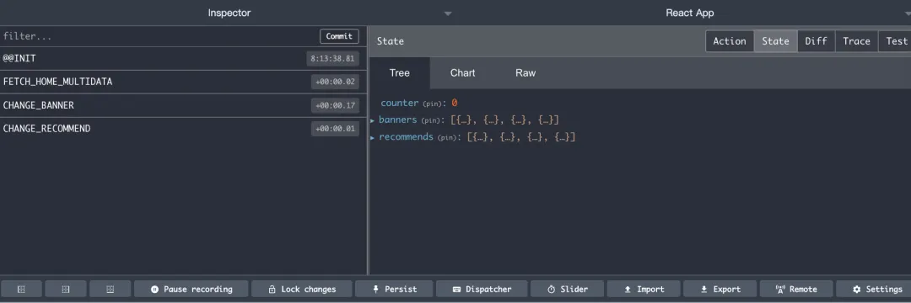
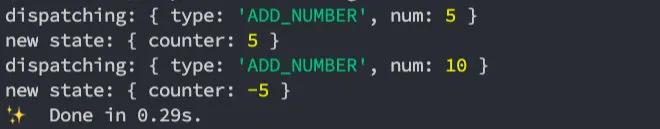
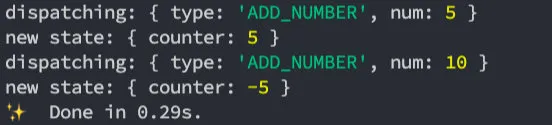
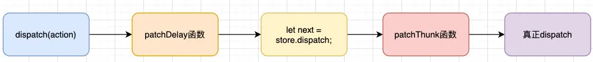

## 一. 中间件的使用

### 1.1. 组件中异步请求

在之前简单的案例中，redux中保存的counter是一个本地定义的数据，我们可以直接通过同步的操作来dispatch action，state就会被立即更新。

但是真实开发中，redux中保存的很多数据可能来自服务器，我们需要进行异步的请求，再将数据保存到redux中。

在之前学习网络请求的时候我们讲过，网络请求可以在class组件的`componentDidMount`中发送，所以我们可以有这样的结构：



我现在完成如下案例操作：

- 在Home组件中请求banners和recommends的数据；
- 在Profile组件中展示banners和recommends的数据；

**redux代码进行如下修改：**

在reducer.js中添加state初始化数据和reducer函数中处理代码：

```javascript
const initialState = {
  counter: 0,
  banners: [],
  recommends: []
}

function reducer(state = initialState, action) {
  switch (action.type) {
    case ADD_NUMBER:
      return { ...state, counter: state.counter + action.num };
    case SUB_NUMBER:
      return { ...state, counter: state.counter - action.num };
    case CHANGE_BANNER:
      return { ...state, banners: action.banners };
    case CHANGE_RECOMMEND:
      return { ...state, recommends: action.recommends };
    default:
      return state;
  }
}
```

constants中增加常量：

```javascript
const CHANGE_BANNER = "CHANGE_BANNER";
const CHANGE_RECOMMEND = "CHANGE_RECOMMEND";
```

actionCreators.js中添加actions：

```javascript
const changeBannersAction = (banners) => ({
  type: CHANGE_BANNER,
  banners
}) 

const changeRecommendsAction = (recommends) => ({
  type: CHANGE_RECOMMEND,
  recommends
})
```

**组件中代码代码修改：**

Home组件：

```javascript
import React, { PureComponent } from 'react';
import { connect } from "react-redux";

import axios from 'axios';

import {
  addAction,
  changeBannersAction,
  changeRecommendsAction
} from '../store/actionCreators';

class Home extends PureComponent {
  componentDidMount() {
    axios.get("http://123.207.32.32:8000/home/multidata").then(res => {
      const data = res.data.data;
      this.props.changeBanners(data.banner.list);
      this.props.changeRecommends(data.recommend.list);
    })
  }

  ...其他业务代码
}

const mapStateToProps = state => {
  return {
    counter: state.counter
  }
}

const mapDispatchToProps = dispatch => {
  return {
    addNumber: function(number) {
      dispatch(addAction(number));
    },
    changeBanners(banners) {
      dispatch(changeBannersAction(banners));
    },
    changeRecommends(recommends) {
      dispatch(changeRecommendsAction(recommends));
    }
  }
}

export default connect(mapStateToProps, mapDispatchToProps)(Home);
```

Profile组件：

```javascript
import React, { PureComponent } from 'react';
import { connect } from "react-redux";

import {
  subAction
} from '../store/actionCreators';

class Profile extends PureComponent {
  render() {
    return (
      <div>
        Profile
        <div>
          <h2>当前计数: {this.props.counter}</h2>
          <button onClick={e => this.decrement()}>-1</button>
          <button onClick={e => this.subCounter()}>-5</button>
        </div>
        <h1>Banners</h1>
        <ul>
          {
            this.props.banners.map((item, index) => {
              return <li key={item.acm}>{item.title}</li>
            })
          }
        </ul>
        <h1>Recommends</h1>
        <ul>
          {
            this.props.recommends.map((item, index) => {
              return <li key={item.acm}>{item.title}</li>
            })
          }
        </ul>
      </div>
    )
  }

  ...其他逻辑代码
}

const mapStateToProps = state => {
  return {
    counter: state.counter,
    banners: state.banners,
    recommends: state.recommends
  }
}

const mapDispatchToProps = dispatch => {
  return {
    subNumber: function (number) {
      dispatch(subAction(number));
    }
  }
}

export default connect(mapStateToProps, mapDispatchToProps)(Profile);
```

### 1.2. redux中异步请求

上面的代码有一个缺陷：

- 我们必须将网络请求的异步代码放到组件的生命周期中来完成；
- 事实上，网络请求到的数据也属于我们状态管理的一部分，更好的一种方式应该是将其也交给redux来管理；



但是在redux中如何可以进行异步的操作呢？

- 答案就是使用**中间件（Middleware）**；
- 学习过Express或Koa框架的童鞋对中间件的概念一定不陌生；
- 在这类框架中，Middleware可以帮助我们在请求和响应之间嵌入一些操作的代码，比如cookie解析、日志记录、文件压缩等操作；

redux也引入了中间件（Middleware）的概念：

- 这个中间件的目的是在`dispatch的action`和`最终达到的reducer`之间，扩展一些自己的代码；
- 比如日志记录、调用异步接口、添加代码调试功能等等；

我们现在要做的事情就是发送异步的网络请求，所以我们可以添加对应的中间件：

- 这里官网推荐的、包括演示的网络请求的中间件是使用 `redux-thunk`；

redux-thunk是如何做到让我们可以发送异步的请求呢？

- 我们知道，默认情况下的dispatch(action)，action需要是一个JavaScript的对象；

- `redux-thunk`可以让dispatch(action函数)，`action可以是一个函数`；

- 该函数会被调用，并且会传给这个函数一个dispatch函数和getState函数；

- - dispatch函数用于我们之后再次派发action；
  - getState函数考虑到我们之后的一些操作需要依赖原来的状态，用于让我们可以获取之前的一些状态；

**如何使用redux-thunk呢？**

1.安装redux-thunk

```javascript
yarn add redux-thunk
```

2.在创建store时传入应用了middleware的enhance函数

- 通过applyMiddleware来结合多个Middleware, 返回一个enhancer；
- 将enhancer作为第二个参数传入到createStore中；

```javascript
// 通过applyMiddleware来结合多个Middleware, 返回一个enhancer
const enhancer = applyMiddleware(thunkMiddleware);
// 将enhancer作为第二个参数传入到createStore中
const store = createStore(reducer, enhancer);
```

3.定义返回一个函数的action：

- 注意：这里不是返回一个对象了，而是一个函数；
- 该函数在dispatch之后会被执行；

```javascript
const getHomeMultidataAction = () => {
  return (dispatch) => {
    axios.get("http://123.207.32.32:8000/home/multidata").then(res => {
      const data = res.data.data;
      dispatch(changeBannersAction(data.banner.list));
      dispatch(changeRecommendsAction(data.recommend.list));
    })
  }
}
```

4.修改home.js中的代码：

```javascript
import React, { PureComponent } from 'react';
import { connect } from "react-redux";

import {
  addAction,
  getHomeMultidataAction
} from '../store/actionCreators';

class Home extends PureComponent {
  componentDidMount() {
    this.props.getHomeMultidata();
  }

  ...其他逻辑代码
}

...mapStatetoProps

const mapDispatchToProps = dispatch => {
  return {
    addNumber: function(number) {
      dispatch(addAction(number));
    },
    getHomeMultidata() {
      dispatch(getHomeMultidataAction());
    }
  }
}

export default connect(mapStateToProps, mapDispatchToProps)(Home);
```

### 1.3. redux-devtools

我们之前讲过，redux可以方便的让我们对状态进行跟踪和调试，那么如何做到呢？

- redux官网为我们提供了redux-devtools的工具；
- 利用这个工具，我们可以知道每次状态是如何被修改的，修改前后的状态变化等等；

安装该工具需要两步：

- 第一步：在对应的浏览器中安装相关的插件（比如Chrome浏览器扩展商店中搜索Redux DevTools即可，其他方法可以参考GitHub）；
- 第二步：在redux中继承devtools

```javascript
import { createStore, applyMiddleware, compose } from 'redux';
import thunkMiddleware from 'redux-thunk';
import reducer from './reducer.js';

const composeEnhancers = window.__REDUX_DEVTOOLS_EXTENSION_COMPOSE__ || compose;

// 通过applyMiddleware来结合多个Middleware, 返回一个enhancer
const enhancer = composeEnhancers(applyMiddleware(thunkMiddleware));
// 将enhancer作为第二个参数传入到createStore中
const store = createStore(reducer, enhancer);

export default store;
```

trace打开：

```javascript
const composeEnhancers = window.__REDUX_DEVTOOLS_EXTENSION_COMPOSE__({trace: true}) || compose;
```



### 1.4. redux-saga

#### 1.4.1. ES6的generator

saga中间件使用了ES6的generator语法，所以我们有必须简单讲解一下：

- 注意：我这里并没有列出generator的所有用法，事实上它的用法非常的灵活，大家可以自行去学习一下。

在JavaScript中编写一个普通的函数，进行调用会立即拿到这个函数的返回结果：

```javascript
function foo() {
  return "Hello World";
}

foo() // Hello World
```

如果我们将这个函数编写成一个生成器函数：

```javascript
function *foo() {
  yield "Hello";
  yield "World";
}

const iterator = foo();
console.log(iterator, typeof iterator); // 一个object类型的iterator对象
```

调用iterator的next函数，会销毁一次迭代器，并且返回一个yield的结果：

```javascript
// 调用一次next()是消耗一次迭代器
iterator.next(); // {value: "Hello", done: false}
iterator.next(); // {value: "World", done: false}
iterator.next(); // {value: undefined, done: true}
```

研究一下foo生成器函数代码的执行顺序：

```javascript
function *foo() {
  console.log("111111");
  yield "Hello";
  console.log("222222");
  yield "World";
  console.log("333333");
}

// 调用一次next()是消耗一次迭代器
iterator.next(); // {value: "Hello", done: false}
// 打印111111
iterator.next(); // {value: "World", done: false}
// 打印222222
iterator.next(); // {value: undefined, done: true}
// 打印333333
```

generator和promise一起使用：

```javascript
function *bar() {
  const result = yield new Promise((resolve, reject) => {
    setTimeout(() => {
      resolve("Hello Generator");
      return "Hello";
    }, 2000);
  });
  console.log(result);
}

const bIterator = bar();
bIterator.next().value.then(res => {
  bIterator.next(res);
});
```

#### 1.4.2. redux-saga的使用

1.安装redux-saga

```javascript
yarn add redux-saga
```

2.集成redux-saga中间件

```javascript
import { createStore, applyMiddleware, compose } from 'redux';
import thunkMiddleware from 'redux-thunk';
import createSagaMiddleware from 'redux-saga';
import reducer from './reducer.js';
import mySaga from './saga';

// 通过createSagaMiddleware函数来创建saga中间件
const sagaMiddleware = createSagaMiddleware();

const composeEnhancers = window.__REDUX_DEVTOOLS_EXTENSION_COMPOSE__({trace: true}) || compose;

// 通过applyMiddleware来结合多个Middleware, 返回一个enhancer
const enhancer = composeEnhancers(applyMiddleware(thunkMiddleware, sagaMiddleware));
// 将enhancer作为第二个参数传入到createStore中
const store = createStore(reducer, enhancer);

// 必须启动saga中间件，并且传入其要监听的generator
sagaMiddleware.run(mySaga);

export default store;
```

3.saga.js文件的编写：

- takeEvery：可以传入多个监听的actionType，每一个都可以被执行（对应有一个takeLastest，会取消前面的）
- put：在saga中派发action不再是通过dispatch，而是通过put；
- all：可以在yield的时候put多个action；

```javascript
import { takeEvery, put, all } from 'redux-saga/effects';
import axios from 'axios';

import {
  FETCH_HOME_MULTIDATA
} from "./constants";
import {
  changeBannersAction,
  changeRecommendsAction,
} from './actionCreators';

function* fetchHomeMultidata(action) {
  const res = yield axios.get("http://123.207.32.32:8000/home/multidata");
  console.log(res);
  const data = res.data.data;
  yield all([
    put(changeBannersAction(data.banner.list)),
    put(changeRecommendsAction(data.recommend.list))
  ])
}

function* mySaga() {
  yield takeEvery(FETCH_HOME_MULTIDATA, fetchHomeMultidata)
}

export default mySaga;
```

## 二. 中间件的原理

### 2.1. 打印日志需求

前面我们已经提过，中间件的目的是在redux中插入一些自己的操作：

- 比如我们现在有一个需求，在dispatch之前，打印一下本次的action对象，dispatch完成之后可以打印一下最新的store state；
- 也就是我们需要将对应的代码插入到redux的某部分，让之后所有的dispatch都可以包含这样的操作；

如果没有中间件，我们是否可以实现类似的代码呢？

当然可以，类似下面的方式即可：

```javascript
console.log("dispatching:", addAction(5));
store.dispatch(addAction(5));
console.log("new state:", store.getState());

console.log("dispatching:", addAction(10));
store.dispatch(subAction(10));
console.log("new state:", store.getState());
```



但是这种方式缺陷非常明显：

- 首先，每一次的dispatch操作，我们都需要在前面加上这样的逻辑代码；
- 其次，存在大量重复的代码，会非常麻烦和臃肿；

是否有一种更优雅的方式来处理这样的相同逻辑呢？

- 我们可以将代码封装到一个独立的函数中

```javascript
function dispatchAndLog(action) {
  console.log("dispatching:", action);
  store.dispatch(addAction(5));
  console.log("新的state:", store.getState());
}

dispatchAndLog(addAction(10));
```

但是这样的代码有一个非常大的缺陷：

- 调用者（使用者）在使用我的dispatch时，必须使用我另外封装的一个函数dispatchAndLog；
- 显然，对于调用者来说，很难记住这样的API，更加习惯的方式是直接调用dispatch；

我们来进一步对代码进行优化；

### 2.2. 修改dispatch

事实上，我们可以利用一个hack一点的技术：Monkey Patching，利用它可以修改原有的程序逻辑；

我们对代码进行如下的修改：

- 这样就意味着我们已经直接修改了dispatch的调用过程；
- 在调用dispatch的过程中，真正调用的函数其实是dispatchAndLog；

```javascript
let next = store.dispatch;

function dispatchAndLog(action) {
  console.log("dispatching:", addAction(10));
  next(addAction(5));
  console.log("新的state:", store.getState());
}

store.dispatch = dispatchAndLog;
```



当然，我们可以将它封装到一个模块中，只要调用这个模块中的函数，就可以对store进行这样的处理：

```javascript
function patchLogging(store) {
  let next = store.dispatch;

  function dispatchAndLog(action) {
    console.log("dispatching:", action);
    next(addAction(5));
    console.log("新的state:", store.getState());
  }

  store.dispatch = dispatchAndLog;
}
```

### 2.3. thunk需求

redux-thunk的作用：

- 我们知道redux中利用一个中间件redux-thunk可以让我们的dispatch不再只是处理对象，并且可以处理函数；
- 那么redux-thunk中的基本实现过程是怎么样的呢？事实上非常的简单。

我们来看下面的代码：

- 我们又对dispatch进行转换，这个dispatch会判断传入的

```javascript
function patchThunk(store) {
  let next = store.dispatch;

  function dispatchAndThunk(action) {
    if (typeof action === "function") {
      action(store.dispatch, store.getState);
    } else {
      next(action);
    }
  }

  store.dispatch = dispatchAndThunk;
}
```

将两个patch应用起来，进行测试：

```javascript
patchLogging(store);
patchThunk(store);

store.dispatch(addAction(10));

function getData(dispatch) {
  setTimeout(() => {
    dispatch(subAction(10));
  }, 1000)
}

// 传入函数
store.dispatch(getData);
```

### 2.4. 合并中间件

单个调用某个函数来合并中间件并不是特别的方便，我们可以封装一个函数来实现所有的中间件合并：

```javascript
function applyMiddleware(store, middlewares) {
  middlewares = middlewares.slice();

  middlewares.forEach(middleware => {
    store.dispatch = middleware(store);
  })
}

applyMiddleware(store, [patchLogging, patchThunk]);
```

我们来理解一下上面操作之后，代码的流程：



当然，真实的中间件实现起来会更加的灵活，这里我们仅仅做一个抛砖引玉，有兴趣可以参考redux合并中间件的源码流程。