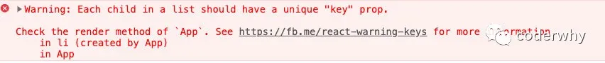
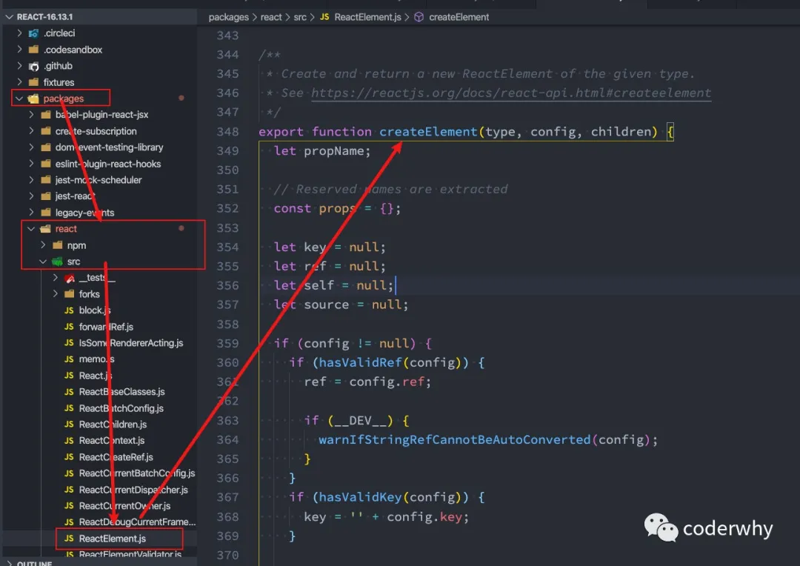
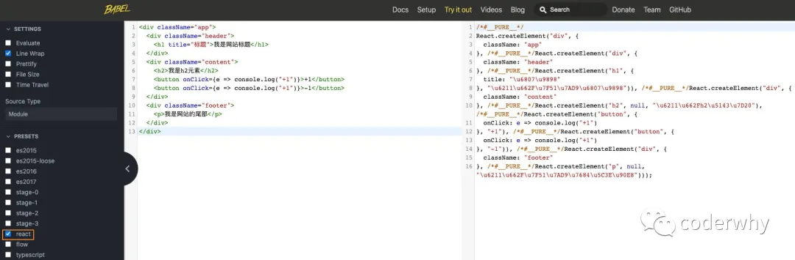
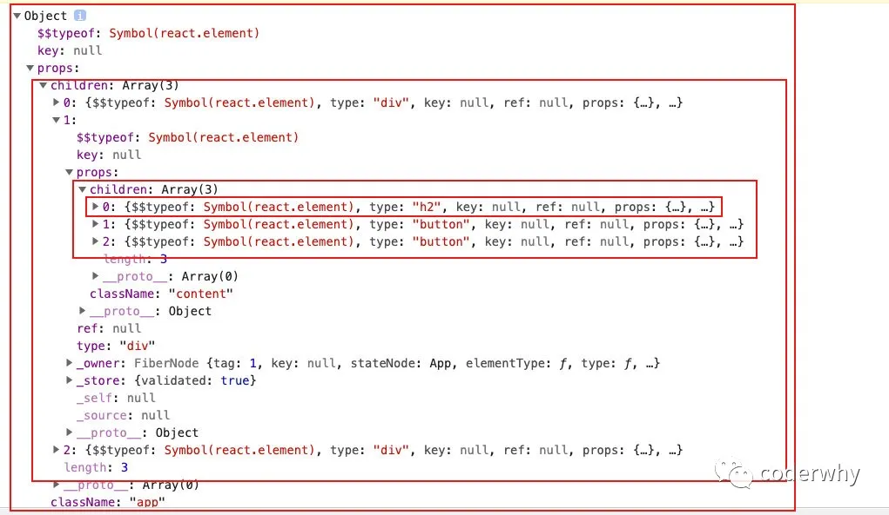
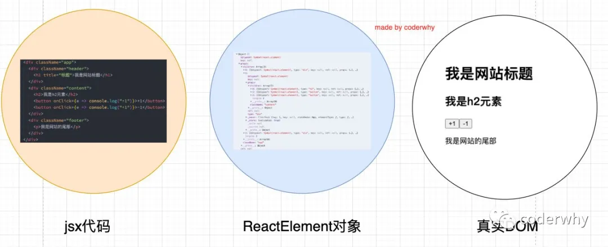

## 一. 条件渲染

某些情况下，界面的内容会根据不同的情况显示不同的内容，或者决定是否渲染某部分内容：

- 在vue中，我们会通过指令来控制：比如 `v-if`、`v-show` ；
- 在React中，所有的条件判断都和普通的 JavaScript 代码一致；

常见的条件渲染的方式有哪些呢？

### 1.1. 条件判断语句

一种方式是当逻辑较多时，通过条件判断：

```javascript
class App extends React.Component {
  constructor(props) {
    super(props);

    this.state = {
      isLogin: true
    }
  }

  render() {
    let titleJsx = null;
    // 条件判断 的基本语法方式
    if (this.state.isLogin) {
      titleJsx = <h2>欢迎回来~</h2>
    } else {
      titleJsx = <h2>请先登录~</h2>
    }

    return (
      <div>
        {titleJsx}
      </div>
    )
  }
}
```

当然，我们也可以将其封装到一个独立的函数中：

```javascript
class App extends React.Component {
  constructor(props) {
    super(props);

    this.state = {
      isLogin: true
    }
  }

  render() {
    return (
      <div>
        { this.getTitleJsx() }
      </div>
    )
  }

  getTitleJsx() {
    let titleJsx = null;
    if (this.state.isLogin) {
      titleJsx = <h2>欢迎回来~</h2>
    } else {
      titleJsx = <h2>请先登录~</h2>
    }
    return titleJsx;
  }
}
```

### 1.2. 三元运算符

另外一种实现条件渲染的方法就是三元运算符：`condition ? true : false;`

三元运算符适用于没有太多逻辑的代码：只是根据不同的条件直接返回不同的结果

```javascript
class App extends React.Component {
  constructor(props) {
    super(props);

    this.state = {
      isLogin: true
    }
  }

  render() {
    return (
      <div>
        <h2>{this.state.isLogin ? "欢迎回来~": "请先登录~"}</h2>
        <button onClick={e => this.loginBtnClick()}>{this.state.isLogin ? "退出": "登录"}</button>
      </div>
    )
  }

  loginBtnClick() {
    this.setState({
      isLogin: !this.state.isLogin
    })
  }
}
```

### 1.3. 与运算符&&

在某些情况下，我们会遇到这样的场景：

- 如果条件成立，渲染某一个组件；
- 如果条件不成立，什么内容也不渲染；

如果我们使用三元运算符，是如何做呢？

```javascript
{ this.state.isLogin ? <h2>{this.state.username}</h2>: null }
```

其实我们可以通过`逻辑与&&`来简化操作：

```js
{ this.state.isLogin && <h2>{this.state.username}</h2> }
```

### 1.4. v-show效果

针对一个HTML原生，渲染和不渲染之间，如果切换的非常频繁，那么会相对比较损耗性能：

- 在开发中，其实我们可以通过 `display` 的属性来控制它的显示和隐藏；
- 在控制方式在vue中有一个专门的指令：`v-show`；
- React没有指令，但是React会更加灵活（灵活带来的代价就是需要自己去实现）；

我来看一下如何实现：

```javascript
import React from "react";

class App extends React.Component {
constructor(props) {
    super(props);

    this.state = {
      isLogin: true,
      username:"肖攀,你好,欢迎光临!"  
    }
  }

render() {
    const { isLogin, username } = this.state;
    const nameDisplay = isLogin ? "block": "none";

    return (
      <div>
        <h2 style={{display: nameDisplay}}>{username}</h2>
        <button onClick={e => this.loginBtnClick()}>{isLogin ? "退出": "登录"}</button>
      </div>
    )
 }
  loginBtnClick() {
    this.setState({
      isLogin: !this.state.isLogin 
    })
  }
}
```

## 二. jsx列表渲染

### 2.1. 列表渲染

真实开发中我们会从服务器请求到大量的数据，数据会以列表的形式存储：

- 比如歌曲、歌手、排行榜列表的数据；
- 比如商品、购物车、评论列表的数据；
- 比如好友消息、动态、联系人列表的数据；

在React中并没有像Vue模块语法中的`v-for`指令，而且需要我们通过JavaScript代码的方式组织数据，转成JSX：

- 很多从Vue转型到React的同学非常不习惯，认为Vue的方式更加的简洁明了；
- 但是React中的JSX正是因为和JavaScript无缝的衔接，让它可以更加的灵活；
- 另外我经常会提到React是真正可以提高我们编写代码能力的一种方式；

如何展示列表呢？

- 在React中，展示列表最多的方式就是使用**数组的map高阶函数**；

数组的map函数语法如下：

- callback：生成新数组元素的函数，使用三个参数：

- - `currentValue` : 数组中正在处理的当前元素。

  - `index`可选 :  数组中正在处理的当前元素的索引。

  - `array`可选 : 方法调用的数组。

- `thisArg`可选：执行 `callback` 函数时值被用作`this`。

```javascript
var new_array = arr.map(function callback(currentValue[, index[, array]]) {
 // Return element for new_array 
}[, thisArg])
```

我们来演练一下之前的案例：

```javascript
class App extends React.Component {
  constructor(props) {
    super(props);

    this.state = {
      movies: ["盗梦空间", "大话西游", "流浪地球", "少年派", "食神", "美人鱼", "海王"]
    }
  }

  render() {
    return (
      <div>
        <h2>电影列表</h2>
        <ul>
          {
            //数组高阶函数的使用 
            this.state.movies.map(item => {
              return <li>{item}</li>
            })
          }
        </ul>
      </div>
    )
  }
}

ReactDOM.render(<App/>, document.getElementById("app"));
```

### 2.2. 数组处理

很多时候我们在展示一个数组中的数据之前，需要先对它进行一些处理：

- 比如过滤掉一些内容：==filter函数==
- 比如截取数组中的一部分内容：==slice函数==

比如我当前有一个数组中存放了一系列的数字：`[10, 30, 120, 453, 55, 78, 111, 222]`

案例需求：获取所有`大于50`的数字，并且展示`前3个数`

```javascript
class App extends React.Component {
  constructor(props) {
    super(props);

    this.state = {
      numbers: [10, 30, 120, 453, 55, 78, 111, 222]
    }
  }

  render() {
    return (
      <div>
        <h2>数字列表</h2>
        <ul>
          {
            //这里的方法可以嵌套使用
            this.state.numbers
              .filter((item) => item >= 50)
              .slice(0, 3)
              .map((item) => {
                return <li>{item}</li>;
              })
          }
        </ul>
      </div>
    )
  }
}

ReactDOM.render(<App/>, document.getElementById("app"));
```

### 2.3. 列表的key

我们会发现在前面的代码中只要展示列表都会报一个警告：



这个警告是告诉我们需要在列表展示的`jsx`中添加一个`key。`

至于如何添加一个key，为什么要添加一个key，这个我们放到后面讲解setState时再来讨论；

## 三. JSX原理解析

### 3.1. JSX转换本质

实际上，`jsx `仅仅只是 **React.createElement(component, props, ...children)** 函数的语法糖。

- 所有的jsx最终都会被转换成`React.createElement`的函数调用。

React.createElement在源码的什么位置呢？



createElement需要传递三个参数：

- 参数一：`type`

- - 当前ReactElement的类型；
  - 如果是标签元素，那么就使用字符串表示 “div”；
  - 如果是组件元素，那么就直接使用组件的名称；

- 参数二：`config`

- - 所有`jsx`中的属性都在config中以对象的属性和值的形式存储

- 参数三：`children`

- - 存放在标签中的内容，以children数组的方式进行存储；
  - 当然，如果是多个元素呢？React内部有对它们进行处理，处理的源码在下方；

对children进行的处理：

- 从第二个参数开始，将其他所有的参数，放到props对象的children中

```javascript
const childrenLength = arguments.length - 2;
if (childrenLength === 1) {
  props.children = children;
} else if (childrenLength > 1) {
  const childArray = Array(childrenLength);
  for (let i = 0; i < childrenLength; i++) {
    childArray[i] = arguments[i + 2];
  }
  if (__DEV__) {
    if (Object.freeze) {
      Object.freeze(childArray);
    }
  }
  props.children = childArray;
}
```

真实的转换过程到底长什么样子呢？我们可以从多个角度来查看。

#### 3.1.1. Babel官网查看

我们知道默认jsx是通过babel帮我们进行语法转换的，所以我们之前写的jsx代码都需要依赖babel。

- 可以在babel的官网中快速查看转换的过程：https://babeljs.io/repl/#?presets=react

在这里我们编写一些jsx代码，来查看运行后的结果：

```javascript
<div className="app">
  <div className="header">
    <h1 title="标题">我是网站标题</h1>
  </div>
  <div className="content">
    <h2>我是h2元素</h2>
    <button onClick={ e => console.log("+1") }>+1</button>
    <button onClick={ e => console.log("+1") }>-1</button>
  </div>
  <div className="footer">
    <p>我是网站的尾部</p>
  </div>
</div>
```



#### 3.1.2. 编写createElement

还有一种办法是我们自己来编写React.createElement代码：

```javascript
class App extends React.Component {
  constructor(props) {
  render() {
    /*#__PURE__*/
    const result = React.createElement("div", {
      className: "app"
    }, /*#__PURE__*/React.createElement("div", {
      className: "header"
    }, /*#__PURE__*/React.createElement("h1", {
      title: "\u6807\u9898"
    }, "\u6211\u662F\u7F51\u7AD9\u6807\u9898")), /*#__PURE__*/React.createElement("div", {
      className: "content"
    }, /*#__PURE__*/React.createElement("h2", null, "\u6211\u662Fh2\u5143\u7D20"), /*#__PURE__*/React.createElement("button", {
      onClick: e => console.log("+1")
    }, "+1"), /*#__PURE__*/React.createElement("button", {
      onClick: e => console.log("+1")
    }, "-1")), /*#__PURE__*/React.createElement("div", {
      className: "footer"
    }, /*#__PURE__*/React.createElement("p", null, "\u6211\u662F\u7F51\u7AD9\u7684\u5C3E\u90E8")));
    return result;
  }
}

ReactDOM.render(React.createElement(App, null) , document.getElementById("app"));
```

整理之后的代码:

```javascript
class App extends React.Component {
  constructor(props) {}
  render() {
    const result = React.createElement(
      "div",
      { className: "app" },
      React.createElement("div", { className: "header" }, React.createElement("h1",{title:"\u6807\u9898" }, "\u6211\u662F\u7F51\u7AD9\u6807\u9898")),
      React.createElement(
        "div",
        { className: "content" },
        React.createElement("h2", null, "\u6211\u662Fh2\u5143\u7D20"),
        React.createElement("button", { onClick: (e) => console.log("+1") }, "+1"),
        React.createElement("button", { onClick: (e) => console.log("+1") }, "-1")
      ),
      React.createElement("div", { className: "footer" }, React.createElement("p", null, "\u6211\u662F\u7F51\u7AD9\u7684\u5C3E\u90E8"))
    );
    return result;
  }
}

//类似于这种格式
React.createElement(div,className:"app",头部header-createElement,中间content-createElement,尾部footer-createElement)
```


上面的整个代码，我们就没有通过jsx来书写了，界面依然是可以正常的渲染。

另外，在这样的情况下，你还需要babel相关的内容吗？不需要了

- 所以，`type="text/babel"`可以被我们删除掉了；
- 所以，`<script src="../react/babel.min.js"></script>`可以被我们删除掉了；

### 3.2. 虚拟DOM

#### 3.2.1. 虚拟DOM的创建过程

我们通过 `React.createElement` 最终创建出来一个 ReactElement对象：

```javascript
return ReactElement(
  type,
  key,
  ref,
  self,
  source,
  ReactCurrentOwner.current,
  props,
);
```

这个ReactElement对象是什么作用呢？React为什么要创建它呢？

- 原因是React利用ReactElement对象组成了一个JavaScript的对象树；
- JavaScript的对象树就是大名鼎鼎的虚拟DOM（Virtual DOM）；

如何查看ReactElement的树结构呢？

- 我们可以将之前的`jsx`返回结果进行打印；
- 注意下面代码中我打`jsx`的打印；

```javascript
render() {
  const jsx = (
    <div className="app">
      <div className="header">
        <h1 title="标题">我是网站标题</h1>
      </div>
      <div className="content">
        <h2>我是h2元素</h2>
        <button onClick={e => console.log("+1")}>+1</button>
        <button onClick={e => console.log("+1")}>-1</button>
      </div>
      <div className="footer">
        <p>我是网站的尾部</p>
      </div>
    </div>
  )
  console.log(jsx);
  return jsx;
}
```

打印结果，在浏览器中查看：



而ReactElement最终形成的树结构就是Virtual DOM；

整体的转换过程如下：



#### 3.2.2. 为什么采用虚拟DOM

为什么要采用虚拟DOM，而不是直接修改真实的DOM呢？

- 很难跟踪状态发生的改变：原有的开发模式，我们很难跟踪到状态发生的改变，不方便针对我们应用程序进行调试；
- 操作真实DOM性能较低：传统的开发模式会进行频繁的DOM操作，而这一的做法性能非常的低；

**DOM操作性能非常低：**

首先，document.createElement本身创建出来的就是一个非常复杂的对象；

- https://developer.mozilla.org/zh-CN/docs/Web/API/Document/createElement

其次，DOM操作会引起浏览器的回流和重绘，所以在开发中应该避免频繁的DOM操作；

**这里我们举一个例子：**

比如我们有一组数组需要渲染：[0, 1, 2, 3, 4]，我们会怎么做呢？

```js
<ul>  
    <li>0</li>  
	<li>1</li>  
	<li>2</li>  
	<li>3</li>  
	<li>4</li>
</ul>
```

后来，我们又增加了5条数据：[0, 1, 2, 3, 4, 5, 6, 7, 8, 9]

```javascript
for (var i=5; i<10; i++) {
  var li = document.createElement("li");
  li.innerHTML = arr[i];
  ul.appendChild(li);
}
```

上面这段代码的性能怎么样呢？非常低效

- 因为我们通过 `document.createElement` 创建元素，再通过 `ul.appendChild(li)` 渲染到DOM上，进行了多次DOM操作；
- 对于批量操作的，最好的办法不是一次次修改DOM，而是对批量的操作进行合并；（比如可以通过DocumentFragment进行合并）；

**虚拟DOM帮助我们从命令式编程转到了声明式编程的模式**

React官方的说法：Virtual DOM 是一种编程理念。

在这个理念中，UI 以一种理想化或者说虚拟化的方式保存在内存中，并且它是一个相对简单的JavaScript对象，我们可以通过ReactDOM.render让 `虚拟DOM` 和 `真实DOM`同步起来，这个过程中叫做协调（Reconciliation）；

这种编程的方式赋予了React声明式的API：你只需要告诉React希望让UI是什么状态，React来确保DOM和这些状态是匹配的。

你不需要直接进行DOM操作，只可以从手动更改DOM、属性操作、事件处理中解放出来；
