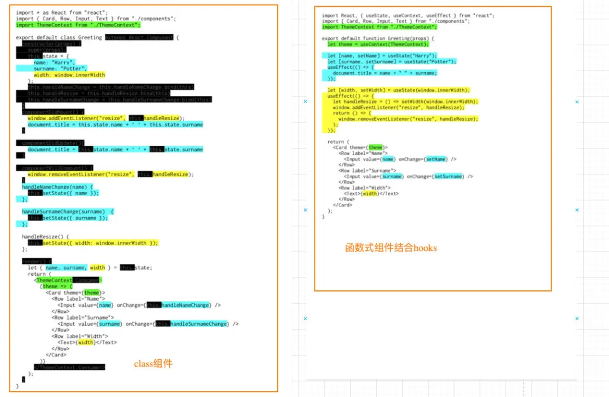

## 一. 认识hook

### 1.1. 为什么需要hook

*Hook* 是 React 16.8 的新增特性，它可以让我们在不编写class的情况下使用state以及其他的React特性（比如生命周期）。

我们先来思考一下`class组件`相对于`函数式组件`有什么优势？比较常见的是下面的优势：

- class组件可以定义自己的state，用来保存组件自己内部的状态；

- - 函数式组件不可以，因为函数每次调用都会产生新的临时变量；

- class组件有自己的生命周期，我们可以在对应的生命周期中完成自己的逻辑；

- - 比如在`componentDidMount`中发送网络请求，并且该生命周期函数只会执行一次；
  - 函数式组件在学习hooks之前，如果在函数中发送网络请求，意味着每次重新渲染都会重新发送一次网络请求；

- class组件可以在状态改变时只会重新执行render函数以及我们希望重新调用的生命周期函数componentDidUpdate等；

- - 函数式组件在重新渲染时，整个函数都会被执行，似乎没有什么地方可以只让它们调用一次；

所以，在Hook出现之前，对于上面这些情况我们通常都会编写class组件。

**但是class组件依然存在很多的问题：**

**复杂组件变得难以理解：**

- 我们在最初编写一个class组件时，往往逻辑比较简单，并不会非常复杂。
- 但是随着业务的增多，我们的class组件会变得越来越复杂；
- 比如componentDidMount中，可能就会包含大量的逻辑代码：包括网络请求、一些事件的监听（还需要在componentWillUnmount中移除）；
- 而对于这样的class实际上非常难以拆分：因为它们的逻辑往往混在一起，强行拆分反而会造成过度设计，增加代码的复杂度；

**难以理解的class：**

- 很多人发现学习ES6的class是学习React的一个障碍。
- 比如在class中，我们必须搞清楚this的指向到底是谁，所以需要花很多的精力去学习this；
- 虽然我认为前端开发人员必须掌握this，但是依然处理起来非常麻烦；

**组件复用状态很难**：

- 在前面为了一些状态的复用我们需要通过高阶组件或render props；
- 像我们之前学习的redux中connect或者react-router中的withRouter，这些高阶组件设计的目的就是为了状态的复用；
- 或者类似于Provider、Consumer来共享一些状态，但是多次使用Consumer时，我们的代码就会存在很多嵌套；
- 这些代码让我们不管是编写和设计上来说，都变得非常困难；

Hook的出现，可以解决上面提到的这些问题；

**简单总结一下hooks：**

- **它可以让我们在不编写class的情况下使用state以及其他的React特性**；
- 但是我们可以由此延伸出非常多的用法，来让我们前面所提到的问题得到解决；

Hook的使用场景：

- Hook的出现基本可以代替我们之前所有使用class组件的地方（除了一些非常不常用的场景）；
- 但是如果是一个旧的项目，你并不需要直接将所有的代码重构为Hooks，因为它完全向下兼容，你可以渐进式的来使用它；
- Hook只能在函数组件中使用，不能在类组件，或者函数组件之外的地方使用；

这里有一个Dan Abramov文章中提到的class组件和函数式组件的对比图：



### 1.2. hooks的基本演练

我们通过一个**计数器案例**，来对比一下class组件和函数式组件结合hooks的对比：

class组件实现：

```javascript
import React, { PureComponent } from 'react'

export default class Counter01 extends PureComponent {
  constructor(props) {
    super(props);

    this.state = {
      counter: 0
    }
  }

  render() {
    return (
      <div>
        <h2>当前计数: {this.state.counter}</h2>
        <button onClick={e => this.increment()}>+1</button>
        <button onClick={e => this.decrement()}>-1</button>
      </div>
    )
  }

  increment() {
    this.setState({counter: this.state.counter + 1});
  }

  decrement() {
    this.setState({counter: this.state.counter - 1});
  }
}
```

函数式组件实现：

```javascript
import React, { useState } from 'react';

export default function Counter2() {
  const [count, setCount] = useState(0);

  return (
    <div>
      <h2>当前计数: {count}</h2>
      <button onClick={e => setCount(count + 1)}>+1</button>
      <button onClick={e => setCount(count - 1)}>-1</button>
    </div>
  )
}
```

你会发现上面的代码差异非常大：函数式组件结合hooks让整个代码变得非常简洁，并且再也不用考虑this相关的问题；

那么我们来研究一下核心的一段代码代表什么意思：

- useState来自react，需要从react中导入，它是一个hook；

- - 元素一：当前状态的值（第一调用为初始化值）；
  - 元素二：设置状态值的函数；
  - 参数：初始化值，如果不设置为undefined；
  - 返回值：数组，包含两个元素；

- 点击button按钮后，会完成两件事情：

- - 调用setCount，设置一个新的值；
  - 组件重新渲染，并且根据新的值返回DOM结构；

- React在重新渲染时，会保留这个state状态，并不会每次都使用初始化值；

```javascript
const [count, setCount] = useState(0);
// 等价于
const counter = useState(0);
const count = counter[0];
const setCount = counter[1];
```

**相信通过上面的一个简单案例，你已经会喜欢上Hook的使用了。**

Hook 就是 JavaScript 函数，这个函数可以帮助你 `钩入（hook into）` React State以及生命周期等特性；

但是使用它们会有两个额外的规则：

- 只能在**函数最外层**调用 Hook。不要在循环、条件判断或者子函数中调用。
- 只能在 **React 的函数组件**中调用 Hook。不要在其他 JavaScript 函数中调用。（还有一个地方可以调用 Hook —— 就是自定义的 Hook 中，后面学习）。

Tip：Hook指的类似于useState、useEffect这样的函数，Hooks是对这类函数的统称；

## 二. hooks基础

### 2.1. State Hook

State Hook的API就是 `useState`，我们在前面已经进行了学习：

- **`useState`**会帮助我们定义一个 `state变量`，`useState` 是一种新方法，它与 class 里面的 `this.state` 提供的功能完全相同。一般来说，在函数退出后变量就会”消失”，而 state 中的变量会被 React 保留。

- **`useState`**接受唯一一个参数，在第一次组件被调用时使用来作为初始化值。（如果没有传递参数，那么初始化值为undefined）。

- **`useState`**是一个数组，我们可以通过数组的解构，来完成赋值会非常方便。

- - https://developer.mozilla.org/zh-CN/docs/Web/JavaScript/Reference/Operators/Destructuring_assignment

FAQ：为什么叫 `useState` 而不叫 `createState`?

- “Create” 可能不是很准确，因为 state 只在组件首次渲染的时候被创建。
- 在下一次重新渲染时，`useState` 返回给我们当前的 state。
- 如果每次都创建新的变量，它就不是 “state”了。
- 这也是 Hook 的名字*总是*以 `use` 开头的一个原因。

当然，我们也可以在一个组件中定义多个变量和复杂变量（数组、对象）：

```javascript
import React, { useState } from 'react';

export default function Home() {
  const [age, setAge] = useState(0);
  const [names, setNames] = useState(["abc", "cba"]);
  const [info, setInfo] = useState({name: "why", age: 18});

  function addFriend() {
    names.push("nba");
    console.log(names);
    setNames(names);
  }

  return (
    <div>
      <h2>当前年龄: {age}</h2>
      <button onClick={e => setAge(age + 1)}>age+1</button>
      <h2>朋友列表</h2>
      <ul>
        {
          names.map((item, index) => {
            return <li key={index}>{item}</li>
          })
        }
      </ul>
      <button onClick={e => setNames([...names, "nba"])}>添加好友</button>
      {/* 思考: 这样的方式是否可以实现 */}
      <button onClick={addFriend}>添加好友</button>
      <h2>我的信息:</h2>
      <div>我的名字: {info.name}</div>
      <button onClick={e => setInfo({...info, name: "lilei"})}>修改名字</button>
    </div>
  )
}
```

### 2.2. Effect Hook

目前我们已经通过hook在函数式组件中定义state，那么类似于生命周期这些呢？

- Effect Hook 可以让你来完成一些类似于class中生命周期的功能；
- 事实上，类似于网络请求、手动更新DOM、一些事件的监听，都是React更新DOM的一些副作用（Side Effects）；
- 所以对于完成这些功能的Hook被称之为 Effect Hook；

#### 2.2.1. Effect基本使用

假如我们现在有一个需求：**页面的title总是显示counter的数字**

使用class组件如何实现呢？

- 我们会发现 `document.title` 的设置必须在两个生命周期中完成；
- 这是因为React的class组件并没有给我们提供一个统一的生命周期函数，可以让无论是否是第一次渲染都会执行的生命周期函数；

```javascript
import React, { PureComponent } from 'react'

export default class CounterTitle01 extends PureComponent {
  constructor(props) {
    super(props);

    this.state = {
      counter: 0
    }
  }

  componentDidMount() {
    document.title = `当前计数: ${this.state.counter}`
  }

  componentDidUpdate() {
    document.title = `当前计数: ${this.state.counter}`
  }

  render() {
    console.log("111");
    return (
      <div>
        <h2>当前计数: {this.state.counter}</h2>
        <button onClick={e => this.increment()}>+1</button>
        <button onClick={e => this.decrement()}>-1</button>
      </div>
    )
  }

  increment() {
    this.setState({counter: this.state.counter + 1});
  }

  decrement() {
    this.setState({counter: this.state.counter - 1});
  }
}
```

这个时候，我们可以使用useEffect的Hook来完成：

```javascript
import React, { useState, useEffect } from 'react';

export default function CounterTitle02() {
  const [count, setCount] = useState(0);

  useEffect(() => {
    document.title = `当前计数: ${count}`;
  })

  return (
    <div>
      <h2>当前计数: {count}</h2>
      <button onClick={e => setCount(count + 1)}>+1</button>
      <button onClick={e => setCount(count - 1)}>-1</button>
    </div>
  )
}
```

**useEffect的解析：**

- 通过useEffect的Hook，可以告诉React需要在渲染后执行某些操作；
- useEffect要求我们传入一个`回调函数`，在React执行完更新DOM操作之后，就`会回调这个函数`；
- 默认情况下，无论是第一次渲染之后，还是每次更新之后，都会执行这个 `回调函数`；

#### 2.2.2. 需要清除Effect

在class组件的编写过程中，某些副作用的代码，我们需要在componentWillUnmount中进行清除：

- 比如我们之前的事件总线或Redux中手动调用subscribe；
- 都需要在componentWillUnmount有对应的取消订阅；
- Effect Hook通过什么方式来模拟componentWillUnmount呢？

useEffect传入的`回调函数A本身`可以有一个返回值，这个返回值是`另外一个回调函数B`：

```javascript
type EffectCallback = () => (void | (() => void | undefined));
```

我们可以这样来编写Effect Hook：

```javascript
import React, { useState, useEffect } from 'react';

export default function EffectHookClear() {
  const [count, setCount] = useState(0);

  useEffect(() => {
    document.title = `当前计数: ${count}`;
    console.log("每次DOM更新时会回调");

    return () => {
      console.log("DOM被移除时会回调");
    }
  })

  return (
    <div>
      <h2>当前计数: {count}</h2>
      <button onClick={e => setCount(count + 1)}>+1</button>
      <button onClick={e => setCount(count - 1)}>-1</button>
    </div>
  )
}
```

**为什么要在 effect 中返回一个函数？**

- 这是 effect 可选的清除机制。每个 effect 都可以返回一个清除函数；
- 如此可以将添加和移除订阅的逻辑放在一起；
- 它们都属于 effect 的一部分；

**React 何时清除 effect？**

- React 会在组件更新和卸载的时候执行清除操作；
- 正如之前学到的，effect 在每次渲染的时候都会执行；

#### 2.2.3. 使用多个Effect

使用Hook的其中一个目的就是解决class中生命周期经常将很多的逻辑放在一起的问题：

- 比如网络请求、事件监听、手动修改DOM，这些往往都会放在componentDidMount中；

使用Effect Hook，我们可以将它们分离到不同的useEffect中：

```javascript
import React, { useEffect } from 'react';

export default function MultiUseEffect() {
  useEffect(() => {
    console.log("网络请求");
  });

  useEffect(() => {
    console.log("修改DOM");
  })

  useEffect(() => {
    console.log("事件监听");

    return () => {
      console.log("取消监听");
    }
  })

  return (
    <div>
      <h2>MultiUseEffect</h2>
    </div>
  )
}
```

**Hook 允许我们按照代码的用途分离它们，** 而不是像生命周期函数那样：

- React 将按照 effect 声明的顺序依次调用组件中的*每一个* effect；

#### 2.2.4. Effect性能优化

默认情况下，==useEffect的回调函数会在每次渲染时都重新执行==，但是这会导致两个问题：

- 某些代码我们只是希望执行一次即可，类似于componentDidMount和componentWillUnmount中完成的事情；（比如网络请求、订阅和取消订阅）；
- 另外，多次执行也会导致一定的性能问题；

我们如何决定useEffect在什么时候应该执行和什么时候不应该执行呢？

- useEffect实际上有两个参数：
- 参数一：执行的回调函数；
- 参数二：该useEffect在哪些state发生变化时，才重新执行；（受谁的影响）

我们来看下面的一个案例：

- 在这个案例中，我们修改show的值，是不会让useEffect重新被执行的；

```javascript
import React, { useState, useEffect } from 'react';

export default function EffectPerformance() {
  const [count, setCount] = useState(0);
  const [show, setShow] = useState(true);

  useEffect(() => {
    console.log("修改DOM");
  }, [count])

  return (
    <div>
      <h2>当前计数: {count}</h2>
      <button onClick={e => setCount(count + 1)}>+1</button>
      <button onClick={e => setShow(!show)}>切换</button>
    </div>
  )
}
```

但是，如果一个函数我们不希望依赖任何的内容时，也可以传入一个空的数组 []：

那么这里的两个回调函数分别对应的就是componentDidMount和componentWillUnmount生命周期函数了；

```javascript
useEffect(() => {
  console.log("监听事件");

  return () => {
    console.log("取消监听");
  }
}, [])
```

### 2.3. Context Hook

在之前的开发中，我们要在组件中使用共享的Context有两种方式：

- 类组件可以通过 `类名.contextType = MyContext`方式，在类中获取context；
- 多个Context或者在函数式组件中通过 `MyContext.Consumer` 方式共享context；

但是多个Context共享时的方式会存在大量的嵌套：

- Context Hook允许我们通过Hook来直接获取某个Context的值；

```javascript
const value = useContext(MyContext);
```

在App.js中使用Context

```javascript
import React, { createContext } from 'react';

import ContextHook from './04_useContext使用/01_ContextHook';

export const UserContext = createContext();
export const ThemeContext = createContext();

export default function App() {
  return (
    <div>
      <UserContext.Provider value={{name: "why", age: 18}}>
        <ThemeContext.Provider value={{color: "red", fontSize: "20px"}}>
          <ContextHook/>
        </ThemeContext.Provider>
      </UserContext.Provider>
    </div>
  )
}
```

在对应的函数式组件中使用Context Hook：

```javascript
import React, { useContext } from 'react'
import { UserContext, ThemeContext } from '../App'

export default function ContextHook() {
  const user = useContext(UserContext);
  const theme = useContext(ThemeContext);
  console.log(user);
  console.log(theme);

  return (
    <div>
      ContextHook
    </div>
  )
}
```

注意事项：当组件上层最近的 `<MyContext.Provider>` 更新时，该 Hook 会触发重新渲染，并使用最新传递给 `MyContext` provider 的 context `value` 值。