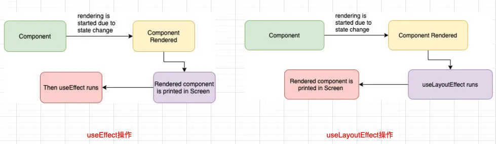
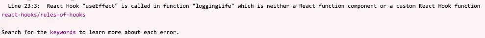

## 一. Hook高级使用

### 1.1. useReducer

很多人看到useReducer的第一反应应该是redux的某个替代品，其实并不是。

useReducer仅仅是useState的一种替代方案：

- 在某些场景下，如果state的处理逻辑比较复杂，我们可以通过useReducer来对其进行拆分；
- 或者这次修改的state需要依赖之前的state时，也可以使用；

单独创建一个`reducer/counter.js`文件：

```javascript
export function counterReducer(state, action) {
  switch(action.type) {
    case "increment":
      return {...state, counter: state.counter + 1}
    case "decrement":
      return {...state, counter: state.counter - 1}
    default:
      return state;
  }
}
```

`home.js`

```javascript
import React, { useReducer } from 'react'
import { counterReducer } from '../reducer/counter'

export default function Home() {
  const [state, dispatch] = useReducer(counterReducer, {counter: 100});

  return (
    <div>
      <h2>当前计数: {state.counter}</h2>
      <button onClick={e => dispatch({type: "increment"})}>+1</button>
      <button onClick={e => dispatch({type: "decrement"})}>-1</button>
    </div>
  )
}
```

我们来看一下，如果我们创建另外一个`profile.js`也使用这个reducer函数，是否会进行数据的共享：

```javascript
import React, { useReducer } from 'react'
import { counterReducer } from '../reducer/counter'

export default function Profile() {
  const [state, dispatch] = useReducer(counterReducer, {counter: 0});

  return (
    <div>
      <h2>当前计数: {state.counter}</h2>
      <button onClick={e => dispatch({type: "increment"})}>+1</button>
      <button onClick={e => dispatch({type: "decrement"})}>-1</button>
    </div>
  )
}
```

==数据是不会共享的，它们只是使用了相同的counterReducer的函数而已。==

**所以，useReducer只是useState的一种替代品，并不能替代Redux。**

### 1.2. useCallback

useCallback实际的目的是==为了进行性能的优化。==

如何进行性能的优化呢？

- useCallback会返回一个函数的 memoized（记忆的） 值；
- 在依赖不变的情况下，多次定义的时候，返回的值是相同的；

```javascript
const memoizedCallback = useCallback(
  () => {
    doSomething(a, b);
  },
  [a, b]
);
```

我们来看下面一段很有趣的代码：

- increment1在每次函数组件重新渲染时，会返回相同的值；

- increment2每次定义的都是不同的值；

- 问题：是否increment1会比increment2更加节省性能呢？

- - 事实上，经过一些测试，并没有更加节省内存，因为useCallback中还是会传入一个函数作为参数；
  - 所以并不存在increment2每次创建新的函数，而increment1不需要创建新的函数这种性能优化；

- 那么，为什么说**useCallback**是为了进行性能优化呢？

```javascript
import React, { memo, useState, useCallback } from 'react'

export default function CallbackHookDemo() {
  const [count, setCount] = useState(0);

  const increment1 = useCallback(function increment() {
    setCount(count + 1);
  }, []);

  const increment2 = function() {
    setCount(count + 1);
  }

  return (
    <div>
      <h2>当前计数: {count}</h2>
      <button onClick={increment1}>+1</button>
      <button onClick={increment2}>+1</button>
    </div>
  )
}
```

我们来对上面的代码进行改进：

- 在下面的代码中，我们将回调函数传递给了子组件，在子组件中会进行调用；
- 在发生点击时，我们会发现接受increment1的子组件不会重新渲染，但是接受increment2的子组件会重新渲染；
- 所以useCallback最主要用于性能渲染的地方应该是和memo结合起来，决定子组件是否需要重新渲染；

```javascript
import React, { memo, useState, useCallback } from 'react';

const CounterIncrement = memo((props) => {
  console.log("CounterIncrment被渲染:", props.name);
  return <button onClick={props.increment}>+1</button>
})

export default function CallbackHookDemo() {
  const [count, setCount] = useState(0);

  const increment1 = useCallback(function increment() {
    setCount(count + 1);
  }, []);

  const increment2 = function() {
    setCount(count + 1);
  }

  return (
    <div>
      <h2>当前计数: {count}</h2>
      {/* <button onClick={increment1}>+1</button>
      <button onClick={increment2}>+1</button> */}
      <CounterIncrement increment={increment1} name="increment1"/>
      <CounterIncrement increment={increment2} name="increment2"/>
    </div>
  )
}
```

### 1.3. useMemo

**useMemo**实际的目的也是为了进行性能的优化。

如何进行性能的优化呢？

- useMemo返回的也是一个 memoized（记忆的） 值；
- 在依赖不变的情况下，多次定义的时候，返回的值是相同的；

```javascript
const memoizedValue = useMemo(() => computeExpensiveValue(a, b), [a, b]);
```

我们来看一个案例：

- 无论我们点击了是 `+1`还是 `切换` 案例都会重新计算一次；
- 事实上，我们只是希望在**count**发生变化时重新计算；

```javascript
import React, { useState, useMemo } from 'react';

function calcNum(count) {
  let total = 0;
  for (let i = 0; i < count; i++) {
    total += i;
  }
  console.log("计算一遍");
  return total
}

export default function MemoHookDemo() {
  const [count, setCount] = useState(10);
  const [isLogin, setIsLogin] = useState(true);

  const total = calcNum(count);

  return (
    <div>
      <h2>数字和: {total}</h2>
      <button onClick={e => setCount(count + 1)}>+1</button>
      {isLogin && <h2>Coderwhy</h2>}
      <button onClick={e => setIsLogin(!isLogin)}>切换</button>
    </div>
  )
}
```

这个时候，我们可以使用useMemo来进行性能的优化：

```javascript
import React, { useState, useMemo } from 'react';

function calcNum(count) {
  let total = 0;
  for (let i = 0; i < count; i++) {
    total += i;
  }
  console.log("计算一遍");
  return total
}

export default function MemoHookDemo() {
  const [count, setCount] = useState(10);
  const [isLogin, setIsLogin] = useState(true);

  //进行性能优化
  const total = useMemo(() => {
    return calcNum(count);
  }, [count]);

  return (
    <div>
      <h2>数字和: {total}</h2>
      <button onClick={e => setCount(count + 1)}>+1</button>
      {isLogin && <h2>Coderwhy</h2>}
      <button onClick={e => setIsLogin(!isLogin)}>切换</button>
    </div>
  )
}
```

当然，useMemo也可以用于子组件的性能优化：

- ShowCounter子组件依赖的是一个基本数据类型，所以在比较的时候只要值不变，那么就不会重新渲染；
- ShowInfo接收的是一个对象，每次都会定义一个新的对象，所以我们需要通过useMemo来对其进行优化；

```javascript
import React, { useState, useMemo, memo } from 'react';

function calcNum(count) {
  let total = 0;
  for (let i = 0; i < count; i++) {
    total += i;
  }
  console.log("计算一遍");
  return total
}

const ShowCounter = memo((props) => {
  console.log("重新渲染");
  return <h1>Counter: {props.total}</h1>
})

const ShowInfo = memo((props) => {
  console.log("ShowInfo重新渲染");
  return <h1>信息: {props.info.name}</h1>
})

export default function MemoHookDemo() {
  const [count, setCount] = useState(10);
  const [isLogin, setIsLogin] = useState(true);

  const total = useMemo(() => {
    return calcNum(count);
  }, [count]);

  const info = useMemo(() => {
    return {name: "why"}
  }, [])

  return (
    <div>
      <h2>数字和: {total}</h2>
      <ShowCounter total={total} />
      <ShowInfo info={info}/>
      <button onClick={e => setCount(count + 1)}>+1</button>
      {isLogin && <h2>Coderwhy</h2>}
      <button onClick={e => setIsLogin(!isLogin)}>切换</button>
    </div>
  )
}
```

### 1.4. useRef

useRef返回一个ref对象，返回的ref对象在组件的整个生命周期保持不变。

最常用的**ref**是两种用法：

- 用法一：引入DOM（或者组件，但是需要是class组件）元素；
- 用法二：保存一个数据，这个对象在整个生命周期中可以保存不变；

用法一：引用DOM

```javascript
import React, { useRef } from 'react';

export default function RefHookDemo() {
  const inputRef = useRef();
  const titleRef = useRef();

  const handleOperating = () => {
    titleRef.current.innerHTML = "我是coderwhy";
    inputRef.current.focus();
  }

  return (
    <div>
      <input type="text" ref={inputRef}/>
      <h2 ref={titleRef}>默认内容</h2>

      <button onClick={e => handleOperating()}>操作</button>
    </div>
  )
}
```

用法二：使用ref保存上一次的某一个值

- useRef可以想象成在ref对象中保存了一个**.current**的可变盒子；
- useRef在组件重新渲染时，返回的依然是之前的ref对象，但是current是可以修改的；

```javascript
import React, { useState, useEffect, useRef } from 'react';

let preValue = 0;

export default function RefHookDemo02() {
  const [count, setCount] = useState(0);
  const countRef = useRef(count);

  useEffect(() => {
    countRef.current = count;
  }, [count]);

  return (
    <div>
      <h2>前一次的值: {countRef.current}</h2>
      <h2>这一次的值: {count}</h2>
      <button onClick={e => setCount(count + 1)}>+1</button>
    </div>
  )
}
```

### 1.5. useImperativeHandle

useImperativeHandle并不是特别好理解，我们一点点来学习。

我们先来回顾一下`ref`和`forwardRef`结合使用：

- 通过forwardRef可以将ref转发到子组件；
- 子组件拿到父组件中创建的ref，绑定到自己的某一个元素中；

```javascript
import React, { useRef, forwardRef } from 'react';

const HYInput = forwardRef(function (props, ref) {
  return <input type="text" ref={ref}/>
})

export default function ForwardDemo() {
  const inputRef = useRef();

  return (
    <div>
      <HYInput ref={inputRef}/>
      <button onClick={e => inputRef.current.focus()}>聚焦</button>
    </div>
  )
}
```

上面的做法本身没有什么问题，但是我们是将子组件的DOM直接暴露给了父组件：

- 直接暴露给父组件带来的问题是某些情况的不可控；
- 父组件可以拿到DOM后进行任意的操作；
- 但是，事实上在上面的案例中，我们只是希望父组件可以操作的focus，其他并不希望它随意操作；

通过**useImperativeHandle**可以只暴露固定的操作：

- 通过useImperativeHandle的Hook，将`传入的ref`和`useImperativeHandle第二个参数返回的对象`绑定到了一起；
- 所以在父组件中，使用 `inputRef.current`时，实际上使用的是`返回的对象`；
- 比如我调用了 `focus函数`，甚至可以调用 `printHello函数`；

```javascript
import React, { useRef, forwardRef, useImperativeHandle } from 'react';

const HYInput = forwardRef(function (props, ref) {
  // 创建组件内部的ref
  const inputRef = useRef();

  useImperativeHandle(ref, () => ({
    focus: () => {
      inputRef.current.focus();
    },
    printHello: () => {
      console.log("Hello World")
    }
  }))

  // 这里绑定的是组件内部的inputRef
  return <input type="text" ref={inputRef}/>
})

export default function ImperativeHandleHookForwardDemo() {
  const inputRef = useRef();

  return (
    <div>
      <HYInput ref={inputRef}/>
      <button onClick={e => inputRef.current.focus()}>聚焦</button>
      <button onClick={e => inputRef.current.printHello()}>Hello World</button>
    </div>
  )
}
```

### 1.6. useLayoutEffect

**useLayoutEffect**看起来和**useEffect**非常的相似，事实上他们也只有一点区别而已：

- useEffect会在渲染的内容更新到DOM上后执行，不会阻塞DOM的更新；
- useLayoutEffect会在渲染的内容更新到DOM上之前执行，会阻塞DOM的更新；

如果我们希望在某些操作发生之后再更新DOM，那么应该将这个操作放到useLayoutEffect。

我们来看下面的一段代码：

- 这段代码在开发中会发生闪烁的现象；
- 因为我们先将count设置为了0，那么DOM会被更新，并且会执行一次useEffect中的回调函数；
- 在useEffect中我们发现count为0，又执行一次setCount操作，那么DOM会再次被更新，并且useEffect又会被执行一次；

```javascript
import React, { useEffect, useState, useLayoutEffect } from 'react';

export default function EffectHookDemo() {
  const [count, setCount] = useState(0);

  useEffect(() => {
    if (count === 0) {
      setCount(Math.random()*200)
    }
  }, [count]);

  return (
    <div>
      <h2>当前数字: {count}</h2>
      <button onClick={e => setCount(0)}>随机数</button>
    </div>
  )
}
```

事实上，我们上面的操作的目的是在count被设置为0时，随机另外一个数字：

- 如果我们使用useLayoutEffect，那么会等到useLayoutEffect代码执行完毕后，再进行DOM的更新；

```javascript
import React, { useEffect, useState, useLayoutEffect } from 'react';

export default function EffectHookDemo() {
  const [count, setCount] = useState(0);

  useLayoutEffect(() => {
    if (count === 0) {
      setCount(Math.random()*200)
    }
  }, [count]);

  return (
    <div>
      <h2>当前数字: {count}</h2>
      <button onClick={e => setCount(0)}>随机数</button>
    </div>
  )
}
```



## 二. 自定义Hook

### 2.1. 认识自定义hook

**自定义Hook本质上只是一种函数代码逻辑的抽取，严格意义上来说，它本身并不算React的特性。**

需求：所有的组件在创建和销毁时都进行打印

- 组件被创建：打印 `组件被创建了`；
- 组件被销毁：打印 `组件被销毁了`；

```javascript
export default function CustomHookDemo() {
  useEffect(() => {
    console.log("组件被创建了");
    return () => {
      console.log("组件被销毁了");
    }
  }, [])

  return (
    <div>
      <h2>CustomHookDemo</h2>
    </div>
  )
}
```

但是这样来做意味着所有的组件都需要有对应的逻辑：

```javascript
function Home(props) {
  useEffect(() => {
    console.log("组件被创建了");
    return () => {
      console.log("组件被销毁了");
    }
  }, [])
  return <h2>Home</h2>
}

function Profile(props) {
  useEffect(() => {
    console.log("组件被创建了");
    return () => {
      console.log("组件被销毁了");
    }
  }, [])
  return <h2>Profile</h2>
}
```

如何可以对它们的逻辑进行抽取呢？

- 我们可能希望抽取到一个函数中；

```javascript
function loggingLife() {
  useEffect(() => {
    console.log("组件被创建了");
    return () => {
      console.log("组件被销毁了");
    }
  }, [])
}
```

但是，抽取到这里调用之后，代码是报错的：

- 原因是普通的函数中不能使用hook



那么，我们应该如何操作呢？

- 非常简单，函数以特殊的方式命名，以 `use` 开头即可；

```javascript
function useLoggingLife() {
  useEffect(() => {
    console.log("组件被创建了");
    return () => {
      console.log("组件被销毁了");
    }
  }, [])
}
```

当然，自定义Hook可以有参数，也可以有返回值：

```javascript
function useLoggingLife(name) {
  useEffect(() => {
    console.log(`${name}组件被创建了`);
    return () => {
      console.log(`${name}组件被销毁了`);
    }
  }, [])
}
```

### 2.2. 自定义Hook练习

我们通过一些案例来练习一下自定义Hook。

**使用User、Token的Context**

比如多个组件都需要使用User和Token的Context：

- 这段代码我们在每次使用`user`和`token`时都需要导入对应的Context，并且需要使用两次useContext；

```javascript
import React, { useContext } from 'react'
import { UserContext, TokenContext } from '../App'

export default function CustomHookContextDemo() {
  const user = useContext(UserContext);
  const token = useContext(TokenContext);

  console.log(user, token);

  return (
    <div>
      <h2>CustomHookContextDemo</h2>
    </div>
  )
}
```

我们可以抽取到一个自定义Hook中：

```javascript
function useUserToken() {
  const user = useContext(UserContext);
  const token = useContext(TokenContext);

  return [user, token];
}
```

**获取窗口滚动的位置**

在开发中，某些场景我们可能总是希望获取创建滚动的位置：

```javascript
import React, { useEffect, useState } from 'react'

export default function CustomScrollPositionHook() {

  const [scrollPosition, setScrollPosition] = useState(0);

  useEffect(() => {
    const handleScroll = () => {
      setScrollPosition(window.scrollY);
    }
    document.addEventListener("scroll", handleScroll);

    return () => {
      document.removeEventListener("scroll", handleScroll);
    }
  }, [])

  return (
    <div style={{padding: "1000px 0"}}>
      <h2 style={{position: "fixed", top: 0, left: 0}}>CustomScrollPositionHook: {scrollPosition}</h2>
    </div>
  )
}
```

但是如果每一个组件都有对应这样的一个逻辑，那么就会存在很多的冗余代码：

```javascript
function useScrollPosition() {
  const [scrollPosition, setScrollPosition] = useState(0);

  useEffect(() => {
    const handleScroll = () => {
      setScrollPosition(window.scrollY);
    }
    document.addEventListener("scroll", handleScroll);

    return () => {
      document.removeEventListener("scroll", handleScroll);
    }
  }, [])

  return scrollPosition;
}
```

**数据存储的localStorage**

在开发中，我们会有一些数据希望通过localStorage进行存储（当然，你可以根据自己的情况选择**sessionStorage**）

```javascript
import React, { useState, useEffect } from 'react'

export default function CustomDataStoreHook() {
  const [name, setName] = useState(() => {
    return JSON.parse(window.localStorage.getItem("name"))
  });

  useEffect(() => {
    window.localStorage.setItem("name", JSON.stringify(name));
  }, [name])

  return (
    <div>
      <h2>CustomDataStoreHook: {name}</h2>
      <button onClick={e => setName("coderwhy")}>设置name</button>
    </div>
  )
}
```

如果每一个里面都有这样的逻辑，那么代码就会变得非常冗余：

```javascript
function useLocalStorange(key) {
  const [data, setData] = useState(() => {
    return JSON.parse(window.localStorage.getItem(key))
  });

  useEffect(() => {
    window.localStorage.setItem(key, JSON.stringify(data));
  }, [data]);

  return [data, setData];
}
```

## 三. Redux Hooks

在之前的redux开发中，为了让组件和redux结合起来，我们使用了react-redux中的connect：

- 但是这种方式必须使用`高阶函数`结合返回的`高阶组件`；
- 并且必须编写：`mapStateToProps`和 `mapDispatchToProps`映射的函数；

在Redux7.1开始，提供了Hook的方式，我们再也不需要编写connect以及对应的映射函数了

### 3.1. useSelector使用

useSelector的作用是将state映射到组件中：

- 参数一：将state映射到需要的数据中；
- 参数二：可以进行比较来决定是否组件重新渲染；（后续讲解）

```javascript
const result: any = useSelector(selector: Function, equalityFn?: Function)
```

现在，我可以改进一下之前的Profile中使用redux的代码：

```javascript
function Profile(props) {
  const {banners, recommends, counter} = useSelector(state => ({
    banners: state.homeInfo.banners,
    recommends: state.homeInfo.recommends
  }));

  console.log("Profile重新渲染");

  return (
    <div>
      <h2>数字: {counter}</h2>
      <h1>Banners</h1>
      <ul>
        {
          banners.map((item, index) => {
            return <li key={item.acm}>{item.title}</li>
          })
        }
      </ul>
      <h1>Recommends</h1>
      <ul>
        {
          recommends.map((item, index) => {
            return <li key={item.acm}>{item.title}</li>
          })
        }
      </ul>
    </div>
  )
}
```

但是这段代码会有一个问题：

- 当前我们的组件并不依赖counter，但是counter发生改变时，依然会引起Profile的重新渲染；

原因是什么呢？

- useSelector默认会比较我们返回的两个对象是否相等；
- 如何比较呢？`const refEquality = (a, b) => a === b`；
- 也就是我们必须返回两个完全相等的对象才可以不引起重新渲染；

这个时候，我们可以使用react-redux中给我们提供的 shallowEqual：

- 这段代码的作用是避免不必要的重新渲染；

```javascript
  const {banners, recommends, counter} = useSelector(state => ({
    banners: state.homeInfo.banners,
    recommends: state.homeInfo.recommends
  }), shallowEqual);
```

当然，你也可以编写自己的比较函数，来决定是否重新渲染。

### 3.2. useDispatch

useDispatch非常简单，就是直接获取dispatch函数，之后在组件中直接使用即可：

```javascript
const dispatch = useDispatch()
```

直接使用dispatch：

```javascript
<button onClick={e => dispatch(subAction(1))}>-1</button>
<button onClick={e => dispatch(subAction(5))}>-5</button>
```

我们还可以通过useStore来获取当前的store对象：

```javascript
const store = useStore()
```

在组件中可以使用store：

```javascript
const store = useStore();
console.log(store.getState());
```