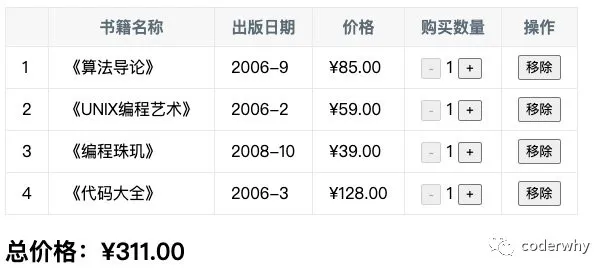

## 一. 书籍购物车说明

### 1.1. 案例介绍

现在我们来做一个相对综合一点的练习：书籍购物车；

案例效果如下：



案例说明：

- 1.在界面上以表格的形式，显示一些书籍的数据；
- 2.在底部显示书籍的总价格；
- 3.点击`+`或者`-`可以增加或减少书籍数量（如果为1，那么不能继续-）；
- 4.点击移除按钮，可以将书籍移除（当所有的书籍移除完毕时，显示：购物车为空~）；

### 1.2. 项目的搭建

这里，我们使用React将默认的数据先展示出来：

```javascript
<!DOCTYPE html>
<html lang="en">
<head>
  <meta charset="UTF-8">
  <meta name="viewport" content="width=device-width, initial-scale=1.0">
  <title>Document</title>

  <style>
    table {
      border: 1px solid #e9e9e9;
      border-collapse: collapse;
    }

    td, th {
      border: 1px solid #e9e9e9;
      padding: 8px 16px;
    }

    th {
      background-color: #f7f7f7;
      color: #5c6b77;
    }

    .counter {
      margin: 0 5px;
    }
  </style>
</head>
<body>
    
  <div id="app"></div>

  <script src="../react/react.development.js"></script>
  <script src="../react/react-dom.development.js"></script>
  <script src="../react/babel.min.js"></script>

  <script type="text/babel">
    class App extends React.Component {
      constructor(props) {
        super(props);
        this.state = {
          books: [
            {
              id: 1,
              name: '《算法导论》',
              date: '2006-9',
              price: 85.00,
              count: 1
            },
            {
              id: 2,
              name: '《UNIX编程艺术》',
              date: '2006-2',
              price: 59.00,
              count: 1
            },
            {
              id: 3,
              name: '《编程珠玑》',
              date: '2008-10',
              price: 39.00,
              count: 1
            },
            {
              id: 4,
              name: '《代码大全》',
              date: '2006-3',
              price: 128.00,
              count: 1
            },
          ]
        }
      }

      render() {
        const { books } = this.state;

        return (
          <div>
            <table>
              <thead>
                <tr>
                  <th></th>
                  <th>书籍名称</th>
                  <th>出版日期</th>
                  <th>价格</th>
                  <th>购买数量</th>
                  <th>操作</th>
                </tr>
              </thead>
              <tbody>
                {
                  books.map((item, index) => {
                    return (
                      <tr>
                        <td>{index + 1}</td>
                        <td>{item.name}</td>
                        <td>{item.date}</td>
                        <td>{"¥" + item.price}</td>
                        <td>
                          <button>-</button>
                          <span className="counter">{item.count}</span>
                          <button>+</button>
                        </td>
                        <td><button>移除</button></td>
                      </tr>
                    )
                  })
                }
              </tbody>
            </table>
          </div>
        )
      }
    }

    ReactDOM.render(<App/>, document.getElementById("app"));
  </script>

</body>
</html>
```

## 二. 书籍购物车功能

### 1.1. 价格的显示

我们可以封装一个工具函数，用于格式化价格：

```javascript
function formatPrice(price) {
  if (typeof price !== "number") {
    price = Number(price) || 0;
  }
  return "¥" + price.toFixed(2);
}
```

对之前显示的价格进行格式化：

```js
<td>{formatPrice(item.price)}</td>
```

封装一个App中的方法，用于获取商品总价格显示的内容：

```javascript
getTotalPrice() {
  let totalPrice = 0;
  for (let book of this.state.books) {
    totalPrice += book.count * book.price
  }
  return "总价格：" + formatPrice(totalPrice);
}
```

使用一个h2元素显示总价格：

```javascript
<h2>
  {this.getTotalPrice()}
</h2>
```

### 1.2. 数量的变化

封装一个方法，用于改变书籍的数量：

- 注意：在React中，要保证数据的不可变性；
- 所以，我们是先复制一份books，对其进行修改，再通过setState更新到最新的状态；

```javascript
changeItem(index, counter) {
  const books = [...this.state.books]; //拷贝一份数据,要确保setState里面的数据不可变性
  this.setState({
    books: books.map((item, indey) => {
      if (indey == index) {
        item.count += counter;
      }
      return item;
    })
  })
}
```

修改`jsx`对应位置的代码：

```javascript
<td>
  <button disabled={item.count <= 1} onClick={e => this.changeItem(index, -1)}> - </button>
  <span className="counter">{item.count}</span>
  <button onClick={e => this.changeItem(index, 1)}> + </button>
</td>
```

### 1.3. 移除的操作

封装一个方法，用于移除对应的书籍：

```javascript
removeItem(index) {
  const books = [...this.state.books];
  this.setState({
    books: books.filter((item, indey) => index !== indey)
  })
}
```

修改对应的移除jsx代码：

```javascript
<td><button onClick={e => this.removeItem(index)}>移除</button></td>
```

如果所有的书籍移除完毕，那么要显示购物车为空：

- 封装两个方法，一个用于获取显示购物车的`jsx`代码（后期会封装成一个组件），一个用于获取显示购物车为空的`jsx`代码（后期也可以封装为一个组件）

```javascript
renderBooks() {
  const { books } = this.state;
  return (
    <div>
      <table>
        <thead>
          <tr>
            <th></th>
            <th>书籍名称</th>
            <th>出版日期</th>
            <th>价格</th>
            <th>购买数量</th>
            <th>操作</th>
          </tr>
        </thead>
        <tbody>
          {
            books.map((item, index) => {
              return (
                <tr>
                  <td>{index + 1}</td>
                  <td>{item.name}</td>
                  <td>{item.date}</td>
                  <td>{formatPrice(item.price)}</td>
                  <td>
                    <button>-</button>
                    <span className="counter">{item.count}</span>
                    <button>+</button>
                  </td>
                  <td><button onClick={e => this.removeItem(index)}>移除</button></td>
                </tr>
              )
            })
          }
        </tbody>
      </table>
      <h2>
        {this.getTotalPrice()}
      </h2>
    </div>
  )
}

renderEmpty() {
  return <h2>购物车为空~</h2>
}
```

重新编写render方法代码：

```javascript
render() {
  const { books } = this.state;
  return books.length ? this.renderBooks() : this.renderEmpty();
}
```

