## 一. 认识脚手架

### 1.1. 前端工程的复杂化

如果我们只是开发几个小的demo程序，那么永远不需要考虑一些复杂的问题：

- 比如目录结构如何组织划分；
- 比如如何管理文件之间的相互依赖；
- 比如如何管理第三方模块的依赖；
- 比如项目发布前如何压缩、打包项目；
- 等等...

现代的前端项目已经越来越复杂了：

- 不会再是在HTML中引入几个css文件，引入几个编写的js文件或者第三方的js文件这么简单；
- 比如css可能是使用less、sass等预处理器进行编写，我们需要将它们转成普通的css才能被浏览器解析；
- 比如JavaScript代码不再只是编写在几个文件中，而是通过模块化的方式，被组成在**成百上千**个文件中，我们需要通过模块化的技术来管理它们之间的相互依赖；
- 比如项目需要依赖很多的第三方库，如何更好的管理它们（比如管理它们的依赖、版本升级等）；

为了解决上面这些问题，我们需要再去学习一些工具：

- 比如babel、webpack、gulp。配置它们转换规则、打包依赖、热更新等等一些的内容；
- 你会发现，你还没有开始做项目，你就面临一系列的工程化问题；

**脚手架的出现，就是帮助我们解决这一系列问题的；**

### 1.2. 脚手架是什么呢？

传统的脚手架指的是建筑学的一种结构：在搭建楼房、建筑物时，临时搭建出来的一个框架；


编程中提到的脚手架（Scaffold），其实是一种工具，帮我们可以快速生成项目的工程化结构；

- 每个项目作出完成的效果不同，但是它们的基本工程化结构是相似的；
- 既然相似，就没有必要每次都从零开始搭建，完全可以使用一些工具，帮助我们生产基本的工程化模板；
- 不同的项目，在这个模板的基础之上进行项目开发或者进行一些配置的简单修改即可；
- 这样也可以间接保证项目的基本机构一致性，方便后期的维护；

总结：**脚手架让项目从搭建到开发，再到部署，整个流程变得快速和便捷；**

对于现在比较流行的三大框架都有属于自己的脚手架：

- Vue的脚手架：`vue-cli`
- Angular的脚手架：`angular-cli`
- React的脚手架：`create-react-app`

它们的作用都是帮助我们生成一个通用的目录结构，并且已经将我们所需的工程环境配置好。

使用这些脚手架需要依赖什么呢？

- 目前这些脚手架都是使用`node`编写的，并且都是基于webpack的；
- 所以我们必须在自己的电脑上安装node环境；

这里我们主要是学习React，所以我们还是以React的脚手架工具：create-react-app作为讲解；

## 二. create-react-app

### 2.1. 安装相关的依赖

#### 2.1.1. 安装node

React脚手架本身需要依赖node，所以我们需要安装node环境：

- 无论是windows还是Mac OS，都可以通过node官网直接下载；
- 官网地址：https://nodejs.org/en/download/
- 注意：这里推荐大家下载LTS（*Long-term support* ）版本，是长期支持版本，会比较稳定；

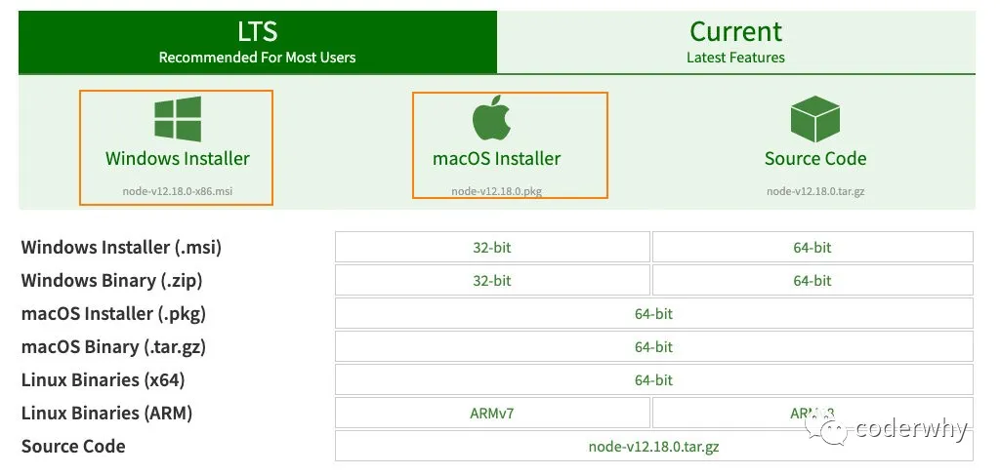

下载后，双击安装即可：

- 1.安装过程中，会自动配置环境变量；
- 2.安装时，会同时帮助我们安装npm管理工具；

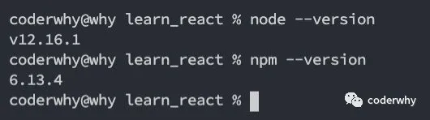

#### 2.1.2. 包管理工具

**什么是npm？**

- 全称 Node Package Manager，即“node包管理器”；
- 作用肯定是帮助我们管理一下依赖的工具包（比如react、react-dom、axios、babel、webpack等等）；
- 作者开发的目的就是为了解决“模块管理很糟糕”的问题；

**另外，还有一个大名鼎鼎的node包管理工具yarn：**

- Yarn是由Facebook、Google、Exponent 和 Tilde 联合推出了一个新的 JS 包管理工具；
- Yarn 是为了弥补 npm 的一些缺陷而出现的；
- 早期的npm存在很多的缺陷，比如安装依赖速度很慢、版本依赖混乱等等一系列的问题；
- 虽然从npm5版本开始，进行了很多的升级和改进，但是依然很多人喜欢使用yarn；
- React脚手架默认也是使用yarn；

安装yarn：

```js
npm install -g yarn
```

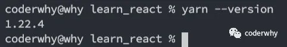

**yarn和npm的命令对比**

| Npm                                     | Yarn                          |
| :-------------------------------------- | :---------------------------- |
| npm install                             | yarn install                  |
| npm install [package]                   | yarn add [package]            |
| npm install --save [package]            | yarn add [package]            |
| npm install --save-dev [package]        | yarn add [package] [--dev/-D] |
| npm rebuild                             | yarn install --force          |
| npm uninstall [package]                 | yarn remove [package]         |
| npm uninstall --save [package]          | yarn remove [package]         |
| npm uninstall --save-dev [package]      | yarn remove [package]         |
| npm uninstall --save-optional [package] | yarn remove [package]         |
| npm cache clean                         | yarn cache clean              |
| rm -rf node_modules && npm install      | yarn upgrade                  |

**cnpm的使用**

在国内，某些情况使用npm和yarn可能无法正常安装一个库，这个时候我们可以选择使用cnpm

```
npm install -g cnpm --registry=https://registry.npm.taobao.org
```

#### 2.1.3. 安装脚手架

最后一个需要安装的是创建React项目的脚手架：

```
npm install -g create-react-app
```

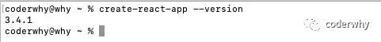

### 2.2. 创建React项目

#### 2.2.1. 创建React项目

现在，我们就可以通过脚手架来创建React项目了。

创建React项目的命令如下：

- 注意：==项目名称不能包含大写字母==

```
create-react-app 项目名称
```

另外还有更多创建项目的方式，可以参考GitHub的readme

- https://github.com/facebook/create-react-app；
- 上面的创建方式，默认使用的yarn来管理整个项目包相关的依赖的；
- ==如果希望使用npm，也可以在参数后面加上 --use-npm==；

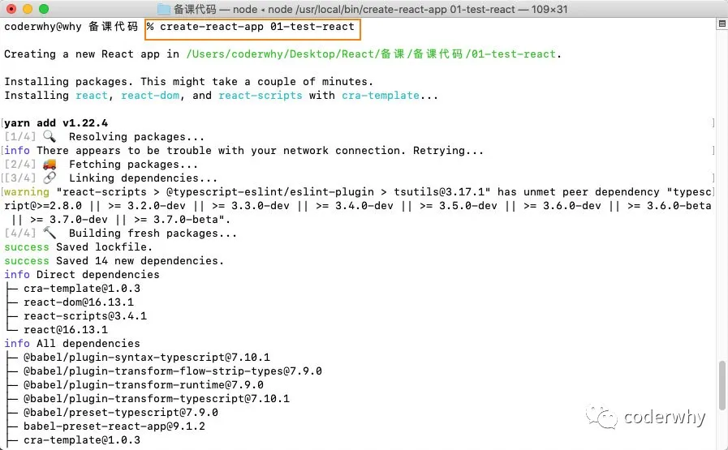

创建完成后，进入对应的目录，就可以将项目跑起来：

```javascript
cd 01-test-react
yarn start
```

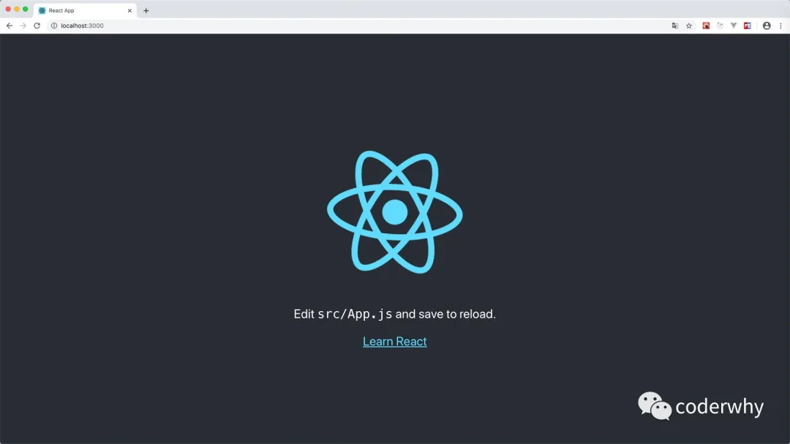

#### 2.2.2. 目录结构分析

我们可以通过VSCode打开项目：

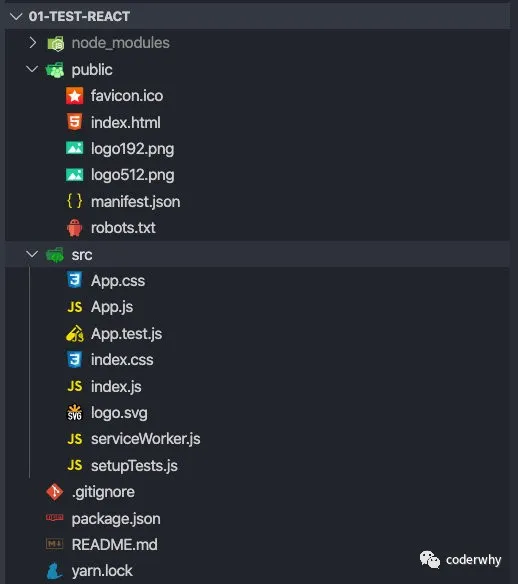

目录结构分析：

```javascript
test-react
├─ README.md // readme说明文档
├─ package.json // 对整个应用程序的描述：包括应用名称、版本号、一些依赖包、以及项目的启动、打包等等（node管理项目必备文件）
├─ public
│    ├─ favicon.ico // 应用程序顶部的icon图标
│    ├─ index.html // 应用的index.html入口文件
│    ├─ logo192.png // 被在manifest.json中使用
│    ├─ logo512.png // 被在manifest.json中使用
│    ├─ manifest.json // 和Web app配置相关
│    └─ robots.txt // 指定搜索引擎可以或者无法爬取哪些文件
├─ src
│    ├─ App.css // App组件相关的样式
│    ├─ App.js // App组件的代码文件
│    ├─ App.test.js // App组件的测试代码文件
│    ├─ index.css // 全局的样式文件
│    ├─ index.js // 整个应用程序的入口文件
│    ├─ logo.svg // 刚才启动项目，所看到的React图标
│    ├─ serviceWorker.js // 默认帮助我们写好的注册PWA相关的代码
│    └─ setupTests.js // 测试初始化文件
└─ yarn.lock
```

整个目录结构都非常好理解，只是有一个PWA相关的概念：

- PWA全称Progressive Web App，即渐进式WEB应用；
- 一个 PWA 应用首先是一个网页, 可以通过 Web 技术编写出一个网页应用. 随后添加上 App Manifest 和 Service Worker 来实现 PWA 的安装和离线等功能；
- 这种Web存在的形式，我们也称之为是 Web App；

PWA解决了哪些问题呢？

- 可以添加至主屏幕，点击主屏幕图标可以实现启动动画以及隐藏地址栏；
- 实现离线缓存功能，即使用户手机没有网络，依然可以使用一些离线功能；
- 实现了消息推送；
- 等等一系列类似于Native App相关的功能；

更多PWA相关的知识，可以自行去学习更多；

#### 2.2.3. webpack配置

我们说过React的脚手架是基于Webpack来配置的：

- *webpack* 是一个现代 JavaScript 应用程序的*静态模块打包器(module bundler)*；
- 当 webpack 处理应用程序时，它会递归地构建一个*依赖关系图(dependency graph)*，其中包含应用程序需要的每个模块，然后将所有这些模块打包成一个或多个 *bundle*；

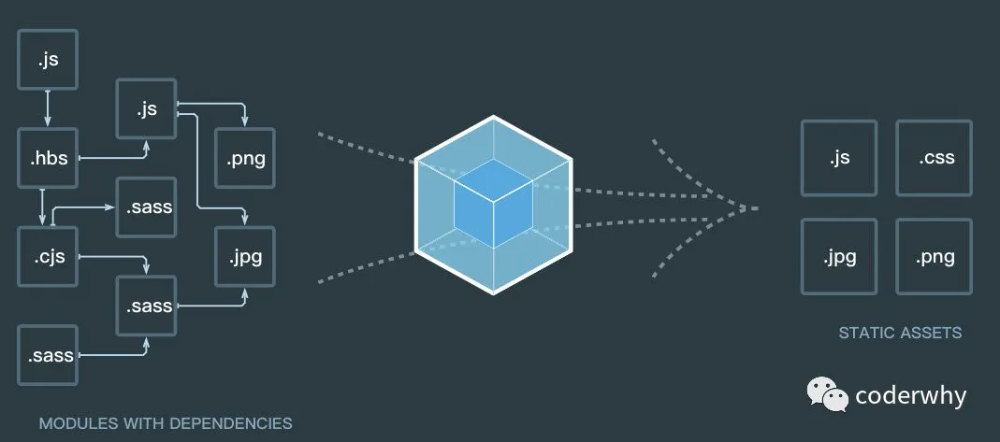

在这里我们暂时不展开来讲webpack，因为里面的内容是非常多的（后续会有专门讲webpack的专题）；

但是，很奇怪：我们并没有在目录结构中看到任何webpack相关的内容？

- 原因是React脚手架讲webpack相关的配置隐藏起来了（其实从Vue CLI3开始，也是进行了隐藏）；

如果我们希望看到webpack的配置信息，应该怎么来做呢？

- 我们可以执行一个package.json文件中的一个脚本：`"eject": "react-scripts eject"`
- 这个操作是不可逆的，所以在执行过程中会给与我们提示；

```javascript
yarn eject
```

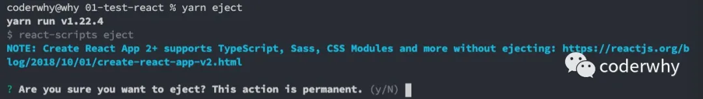

查看和学习webpack相关的配置信息：

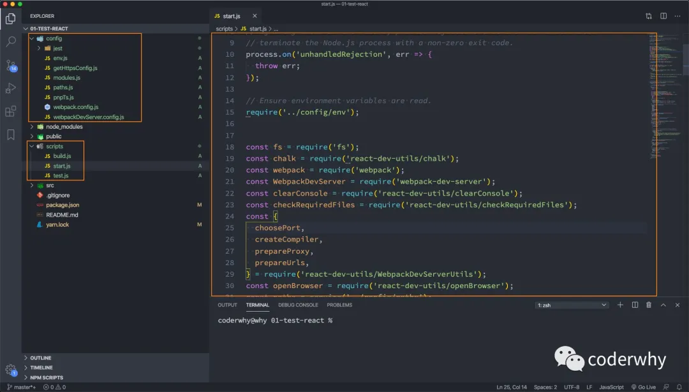

### 2.3. 从零编写项目

#### 2.3.1. 文件的删减

通过脚手架创建完项目，很多同学还是会感觉目录结构过于复杂，所以我打算从零带着大家来编写代码。

我们先将不需要的文件统统删掉：

- 1.将src下的所有文件都删除
- 2.将public文件下出列favicon.ico和index.html之外的文件都删除掉

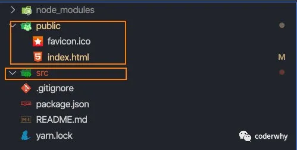

修改index.html文件：

- 我们需要删除选中的内容；
- 这两行内容是我们之前引入的一个图标和manifest文件

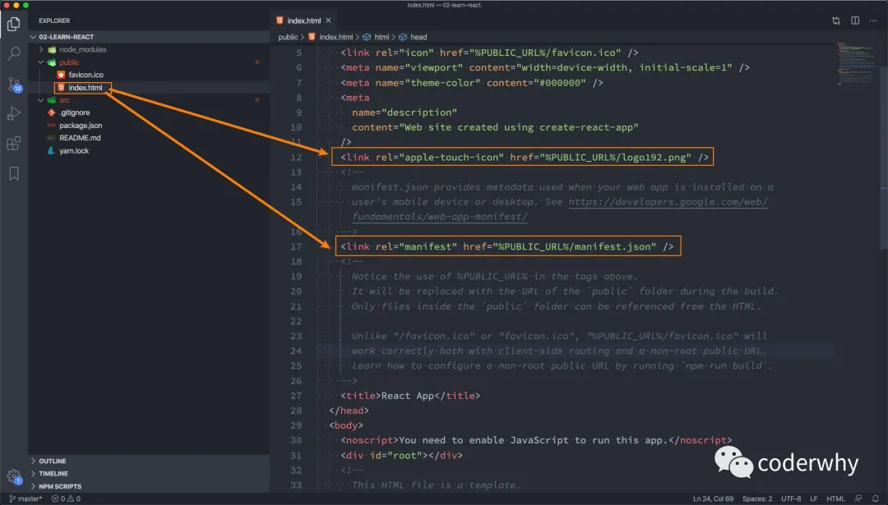

#### 2.3.2. 开始编写代码

在src目录下，创建一个`index.js文件`，因为这是webpack打包的入口。

在index.js中开始编写React代码：

- 我们会发现和写的代码是逻辑是一致的；
- 只是在模块化开发中，我们需要手动的来导入React、ReactDOM，因为它们都是在我们安装的模块中；

```javascript
import React from "react";
import ReactDOM from 'react-dom';

ReactDOM.render(<h2>Hello React</h2>, document.getElementById("root"));
```

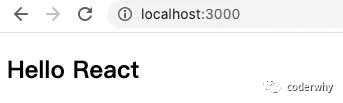

如果我们不希望直接在 `ReactDOM.render` 中编写过多的代码，就可以单独抽取一个组件`App.js`：

```javascript
import React, { Component } from 'react';

export default class App extends Component {
  render() {
    return <h2>Hello App</h2>
  }
}
```

在index.js中引入App，并且使用它：

```javascript
import React from "react";
import ReactDOM from 'react-dom';

import App from './App';

ReactDOM.render(<App/>, document.getElementById("root"));
```

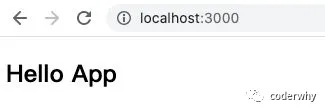
