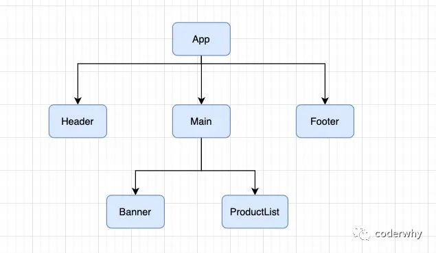
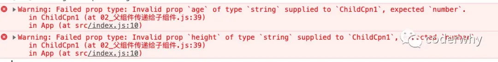
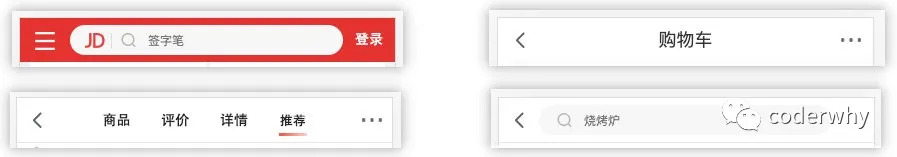

## 一. 认识组件的嵌套

组件之间存在嵌套关系：

- 在之前的案例中，我们只是创建了一个组件App；
- 如果我们一个应用程序将所有的逻辑都放在一个组件中，那么这个组件就会变成非常的臃肿和难以维护；
- 所以组件化的核心思想应该是对组件进行拆分，拆分成一个个小的组件；
- 再将这些组件组合嵌套在一起，最终形成我们的应用程序；

我们来分析一下下面代码的嵌套逻辑：

```javascript
import React, { Component } from 'react';

function Header() {
  return <h2>Header</h2>
}

function Main() {
  return (
    <div>
      <Banner/>
      <ProductList/>
    </div>
  )
}

function Banner() {
  return <div>Banner</div>
}

function ProductList() {
  return (
    <ul>
      <li>商品1</li>
      <li>商品2</li>
      <li>商品3</li>
      <li>商品4</li>
      <li>商品5</li>
    </ul>
  )
}

function Footer() {
  return <h2>Footer</h2>
}

export default class App extends Component {
  render() {
    return (
      <div>
        <Header/>
        <Main/>
        <Footer/>
      </div>
    )
  }
}

```

上面的嵌套逻辑如下，它们存在如下关系：

- App组件是Header、Main、Footer组件的父组件；
- Main组件是Banner、ProductList组件的父组件；



在开发过程中，我们会经常遇到需要组件之间相互进行通信：

- 比如App可能使用了多个Header，每个地方的Header展示的内容不同，那么我们就需要使用者传递给Header一些数据，让其进行展示；
- 又比如我们在Main中一次性请求了Banner数据和ProductList数据，那么就需要传递给他们来进行展示；
- 也可能是子组件中发生了事件，需要由父组件来完成某些操作，那就需要子组件向父组件传递事件；

总之，在一个React项目中，组件之间的通信是非常重要的环节；

父组件在展示子组件，可能会传递一些数据给子组件：

- 父组件通过 **属性=值** 的形式来传递给子组件数据；
- 子组件通过 **props** 参数获取父组件传递过来的数据；

## 二. 父组件传递子组件

### 2.1. 子组件是class组件

我们这里先演示子组件是class组件：

```javascript
import React, { Component } from 'react';

// 1.类子组件
class ChildCpn1 extends Component {
  constructor(props) {
    super();
    this.props = props;
  }
    
  render() {
    const { name, age, height } = this.props;
    return (
      <div>
        <h2>我是class的组件</h2>
        <p>展示父组件传递过来的数据: {name + " " + age + " " + height}</p>
      </div>
    )
  }
}

export default class App extends Component {
  render() {
    return (
      <div>
        <ChildCpn1 name="why" age="18" height="1.88" />
      </div>
    )
  }
}
```

按照上面的结构，我们每一个子组件都需要写构造器来完成：`this.props = props;`

其实呢，大可不必，因为我们可以调用`super(props)`，我们来看一下Component的源码：

- 这里我们先不关心context、updater；
- 我们发现传入的props会被Component设置到this中（父类的对象），那么子类就可以继承过来；
- 补充一个思考题：为什么子类可以继承过来呢？

```javascript
function Component(props, context, updater) {
  this.props = props;
  this.context = context;
  // If a component has string refs, we will assign a different object later.
  this.refs = emptyObject;
  // We initialize the default updater but the real one gets injected by the
  // renderer.
  this.updater = updater || ReactNoopUpdateQueue;
}
```

所以我们的构造方法可以换成下面的写法：

```javascript
  constructor(props) {
    super(props);
  }
```

甚至我们可以省略，为什么可以省略呢？

如果不指定构造方法，则使用默认构造函数。对于基类，默认构造函数是

```javascript
constructor() {}
```

对于派生类，默认构造函数是：

```javascript
constructor(...args) {
  super(...args);
}
```

### 2.2. 子组件是function组件

我们再来演练一下，如果子组件是一个function组件：

```javascript
function ChildCpn2(props) {
  const {name, age, height} = props;
  return (
    <div>
      <h2>我是function的组件</h2>
      <p>展示父组件传递过来的数据: {name + " " + age + " " + height}</p>
    </div>
  )
}

export default class App extends Component {
  render() {
    return (
      <div>
        <ChildCpn1 name="why" age="18" height="1.88"/>
        <ChildCpn2 name="kobe" age="30" height="1.98"/>
      </div>
    )
  }
}
```

functional组件相对来说比较简单，因为不需要有构造方法，也不需要有this的问题。

### 2.3. 参数验证propTypes

对于传递给子组件的数据，有时候我们可能希望进行验证，特别是对于大型项目来说：

- 当然，如果你项目中默认继承了Flow或者TypeScript，那么直接就可以进行类型验证；
- 但是，即使我们没有使用Flow或者TypeScript，也可以通过 `prop-types` 库来进行参数验证；

从 React v15.5 开始，`React.PropTypes` 已移入另一个包中：`prop-types` 库

我们对之前的class组件进行验证：

```javascript
ChildCpn1.propTypes = {
  name: PropTypes.string,
  age: PropTypes.number,
  height: PropTypes.number
}
```

这个时候，控制台就会报警告：



```javascript
<ChildCpn1 name="why" age={18} height={1.88}/>
```

更多的验证方式，可以参考官网：https://zh-hans.reactjs.org/docs/typechecking-with-proptypes.html

- 比如验证数组，并且数组中包含哪些元素；
- 比如验证对象，并且对象中包含哪些key以及value是什么类型；
- 比如某个原生是必须的，使用 `requiredFunc: PropTypes.func.isRequired`

**如果没有传递，我们希望有默认值呢？**

- 我们使用`defaultProps`就可以了

```javascript
ChildCpn1.defaultProps = {
  name: "王小波",
  age: 40,
  height: 1.92
}
```

## 三. 子组件传递父组件

某些情况，我们也需要子组件向父组件传递消息：

- 在vue中是通过自定义事件来完成的；
- 在React中同样是通过props传递消息，只是让`父组件`给`子组件`传递一个`回调函数`，在子组件中调用这个函数即可；

我们这里来完成一个案例：

- 将计数器案例进行拆解；

- 将按钮封装到子组件中：`CounterButton`；
- CounterButton发生点击事件，将内容传递到父组件中，修改counter的值；


案例代码如下：

```javascript
import React, { Component } from 'react';

function CounterButton(props) {
  const { operator, btnClick } = props;
  //子组件,触发父组件的函数
  return <button onClick={ btnClick }>{operator}</button>
}

export default class App extends Component {
  constructor(props) {
    super(props);
    this.state = {
      counter: 0
    }
  }
  //父组件执行的子组件触发的回调函数
  changeCounter(count) {
    this.setState({
      counter: this.state.counter + count
    })
  }

  render() {
    return (
      <div>
        <h2>当前计数: {this.state.counter}</h2>
        <CounterButton operator="+1" btnClick={e => this.changeCounter(1)} />
        <CounterButton operator="-1" btnClick={e => this.changeCounter(-1)} />
      </div>
    )
  }
}
```

## 四. 组件通信案例练习

我们来做一个相对综合的练习：


index.js代码：

```javascript
import React from "react";
import ReactDOM from 'react-dom';
import "./style.css";

import App from './App';

ReactDOM.render(<App/>, document.getElementById("root"));
```

App.js

```javascript
import React, { Component } from 'react';
import TabControl from './TabControl';

export default class App extends Component {
  constructor(props) {
    super(props);
    this.titles = ["流行", "新款", "精选"];
    this.state = {
      currentTitle: "流行"
    }
  }

  itemClick(index) {
    this.setState({
      currentTitle: this.titles[index]
    })
  }

  render() {
    return (
      <div>
        <TabControl titles={this.titles} itemClick={index => this.itemClick(index)} />
        <h2>{this.state.currentTitle}</h2>
      </div>
    )
  }
}

```

TabControl.js

```javascript
import React, { Component } from 'react'

export default class TabControl extends Component {
  constructor(props) {
    super(props);
    this.state = {
      currentIndex: 0
    }
  }

  render() {
    const {titles} = this.props;
    const {currentIndex} = this.state;

    return (
      <div className="tab-control">
        {
          titles.map((item, index) => {
            return (
              <div className="tab-item" onClick={e => this.itemClick(index)}>
                <span className={"title " + (index === currentIndex ? "active": "")}>{item}</span>
              </div>
            )
          })
        }
      </div>
    )
  }

  itemClick(index) {
    this.setState({
      currentIndex: index
    });
    //触发父组件里面的回调函数
    this.props.itemClick(index);
  }
}
```

style.css

```css
.tab-control {
  height: 40px;
  line-height: 40px;
  display: flex;
}

.tab-control .tab-item {
  flex: 1;
  text-align: center;
}

.tab-control .title {
  padding: 3px 5px;
}

.tab-control .title.active {
  color: red;
  border-bottom: 3px solid red;
}
```

## 五. React插槽实现

### 5.1. 为什么使用插槽？

在开发中，我们抽取了一个组件，但是为了让这个组件具备更强的通用性，我们不能将组件中的内容限制为固定的div、span等等这些元素。

我们应该让使用者可以决定某一块区域到底存放什么内容。

举个栗子：假如我们定制一个通用的导航组件 - NavBar

- 这个组件分成三块区域：左边-中间-右边，每块区域的内容是不固定；
- 左边区域可能显示一个菜单图标，也可能显示一个返回按钮，可能什么都不显示；
- 中间区域可能显示一个搜索框，也可能是一个列表，也可能是一个标题，等等；
- 右边可能是一个文字，也可能是一个图标，也可能什么都不显示；



这种需求在Vue当中有一个固定的做法是通过`slot`来完成的，React呢？

- React对于这种需要插槽的情况非常灵活；
- 有两种方案可以实现：children和props；

我这里先提前给出NavBar的样式：

```css
.nav-bar {
  display: flex;
  height: 44px;
  line-height: 44px;
  text-align: center;
}

.nav-bar .left, .nav-bar .right {
  width: 80px;
  background: red;
}

.nav-bar .center {
  flex: 1;
  background: blue;
}
```

### 5.2. children实现

每个组件都可以获取到 `props.children`：它包含组件的开始标签和结束标签之间的内容。

比如：

```js
<Welcome>Hello world!</Welcome>
```

在 `Welcome` 组件中获取 `props.children`，就可以得到字符串 `Hello world!`：

```javascript
function Welcome(props) {
  return <p>{props.children}</p>;
}
```

当然，我们之前看过props.children的源码：

- 如果只有一个元素，那么children指向该元素；
- **如果有多个元素，那么children指向的是数组，数组中包含多个元素；**

那么，我们的NavBar可以进行如下的实现：

```javascript
import React, { Component } from 'react';

class NavBar extends Component {
  render() {
    return (
      <div className="nav-bar">
        <div className="item left">{this.props.children[0]}</div>
        <div className="item center">{this.props.children[1]}</div>
        <div className="item right">{this.props.children[2]}</div>
      </div>
    )
  }
}

//这种方式类似于 vue 里面的匿名插槽
export default class App extends Component {
  render() {
    return (
      <div>
        <NavBar>
          <div>返回</div>
          <div>购物街</div>
          <div>更多</div>
        </NavBar>
      </div>
    )
  }
}
```

### 5.3. props实现

通过children实现的方案虽然可行，但是有一个弊端：通过索引值获取传入的元素很容易出错，不能精准的获取传入的原生；

另外一个种方案就是使用 props 实现：

- 通过具体的属性名，可以让我们在传入和获取时更加的精准；

```javascript
import React, { Component } from 'react';

class NavBar extends Component {
  render() {
    const { leftSlot, centerSlot, rightSlot } = this.props;

    return (
      <div className="nav-bar">
        <div className="item left">{leftSlot}</div>
        <div className="item center">{centerSlot}</div>
        <div className="item right">{rightSlot}</div>
      </div>
    )
  }
}

export default class App extends Component {
  render() {
    //定义三组jsx的元素,通过父传子的方式传递给 NavBar 的这一个子组件
    const navLeft = <div>返回</div>;
    const navCenter = <div>购物街</div>;
    const navRight = <div>更多</div>;

    return (
      <div>
        <NavBar leftSlot={navLeft} centerSlot={navCenter} rightSlot={navRight} />
      </div>
    )
  }
}
```

