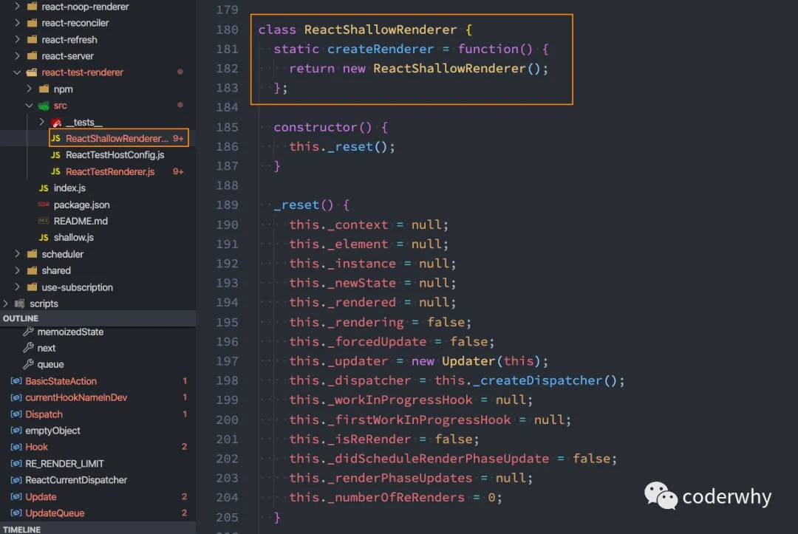
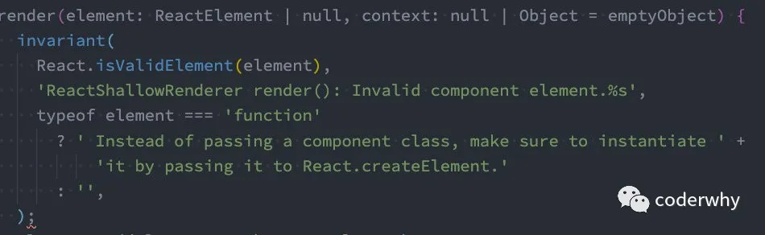
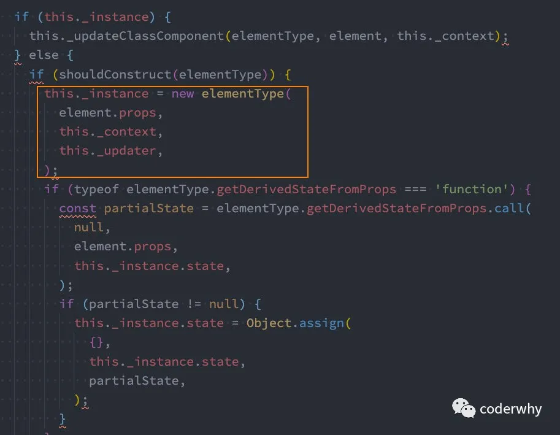
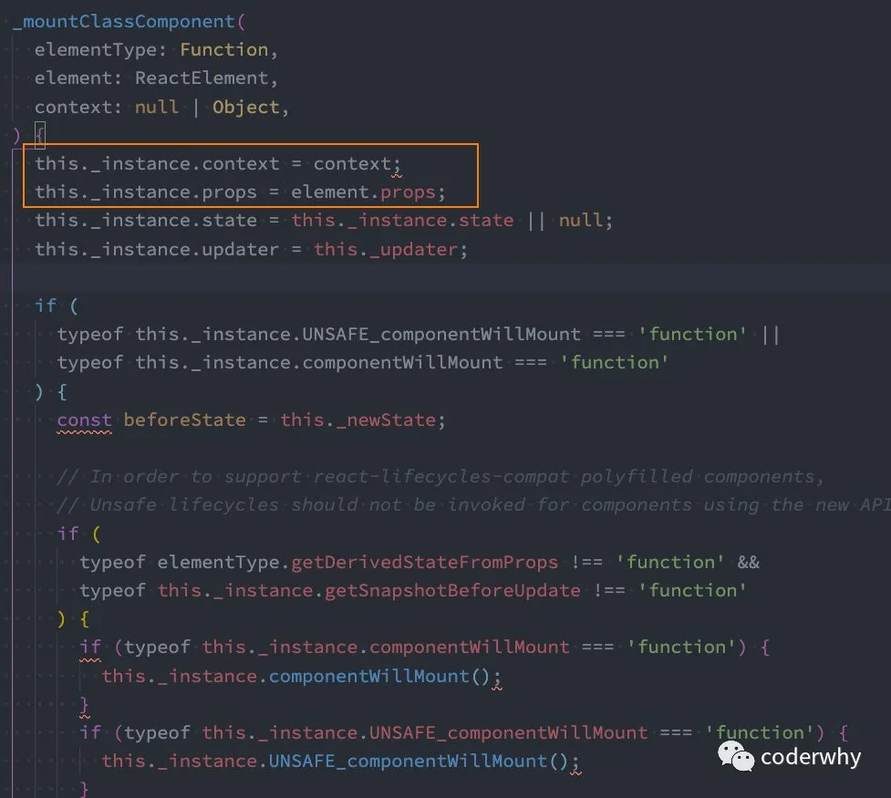

## 一. Context使用

### 1.1. Context应用场景

非父子组件数据的共享：

- 在开发中，比较常见的数据传递方式是通过props属性自上而下（由父到子）进行传递。
- 但是对于有一些场景：比如一些数据需要在多个组件中进行共享（地区偏好、UI主题、用户登录状态、用户信息等）。
- 如果我们在顶层的App中定义这些信息，之后一层层传递下去，那么对于一些中间层不需要数据的组件来说，是一种冗余的操作。

我们来看一个例子：

```javascript
import React, { Component } from 'react';

function ProfileHeader(props) {
  return (
    <div>
      <h2>用户昵称: {props.nickname}</h2>
      <h2>用户等级: {props.level}</h2>
    </div>
  )
}

class Profile extends Component {
  render() {
    return (
      <div>
        //这两种方式等价的写法
        {/* <ProfileHeader nickname={this.props.nickname} level={this.props.level} /> */}
        <ProfileHeader {...this.props}/>
        <ul>
          <li>设置1</li>
          <li>设置2</li>
          <li>设置3</li>
          <li>设置4</li>
          <li>设置5</li>
        </ul>
      </div>
    )
  }
}

export default class App extends Component {
  constructor() {
    super();

    this.state = {
      nickname: "coderwhy",
      level: 99
    }
  }

  render() {
    const { nickname, level } = this.state;

    return (
      <div>
        <Profile nickname={nickname} level={level} />
        <h2>其他内容</h2>
      </div>
    )
  }
}
```

我这边顺便补充一个小的知识点：Spread Attributes

- https://zh-hans.reactjs.org/docs/jsx-in-depth.html

下面两种写法是等价的：

```javascript
function App1() {
  return <Greeting firstName="Ben" lastName="Hector" />;
}

function App2() {
  //对象的解构语法, ...运算符
  const props = {firstName: 'Ben', lastName: 'Hector'};
  return <Greeting {...props} />;
}
```

那么我们上面的Profile的传递代码可以修改为如下代码：

```js
<ProfileHeader {...this.props}/>
```

但是，如果层级更多的话，一层层传递是非常麻烦，并且代码是非常冗余的：

- React提供了一个API：Context；
- Context 提供了一种在组件之间共享此类值的方式，而不必显式地通过组件树的逐层传递 props；
- Context 设计目的是为了共享那些对于一个组件树而言是“全局”的数据，例如当前认证的用户、主题或首选语言；

### 1.2. Context相关的API

**React.createContext**

```js
const MyContext = React.createContext(defaultValue);
```

创建一个需要共享的Context对象：

- 如果一个组件订阅了Context，那么这个组件会从**离自身最近的那个匹配的 `Provider` 中读取到当前的context值；**
- `defaultValue`是组件在顶层查找过程中没有找到对应的`Provider`，那么就使用默认值

**Context.Provider**

```js
<MyContext.Provider value={/* 某个值 */}>
```

每个 Context 对象都会返回一个 Provider React 组件，它允许消费组件订阅 context 的变化：

- Provider 接收一个 `value` 属性，传递给消费组件；
- 一个 Provider 可以和多个消费组件有对应关系；
- 多个 Provider 也可以嵌套使用，里层的会覆盖外层的数据；

当 Provider 的 `value` 值发生变化时，它内部的所有消费组件都会重新渲染；

**Class.contextType**

```javascript
class MyClass extends React.Component {
  componentDidMount() {
    let value = this.context;
    /* 在组件挂载完成后，使用 MyContext 组件的值来执行一些有副作用的操作 */
  }
  componentDidUpdate() {
    let value = this.context;
    /* ... */
  }
  componentWillUnmount() {
    let value = this.context;
    /* ... */
  }
  render() {
    let value = this.context;
    /* 基于 MyContext 组件的值进行渲染 */
  }
}
MyClass.contextType = MyContext;
```

挂载在 class 上的 `contextType` 属性会被重赋值为一个由 `React.createContext()` 创建的 Context 对象：

- 这能让你使用 `this.context` 来消费最近 Context 上的那个值；
- 你可以在任何生命周期中访问到它，包括 render 函数中；

**Context.Consumer**

```javascript
<MyContext.Consumer>
  {value => /* 基于 context 值进行渲染*/}
</MyContext.Consumer>
```

这里，React 组件也可以订阅到 context 变更。这能让你在 `函数式组件` 中完成订阅 context。

- 这里需要 函数作为子元素（function as child）这种做法；
- 这个函数接收当前的 context 值，返回一个 React 节点；

### 1.3. Context使用过程

我们先按照前面三个步骤来使用一个Context：

- 我们就会发现，这个过程中Profile是不需要有任何的数据传递的

```javascript
import React, { Component } from 'react';
//第一步: 创建一个需要共享的Context对象：UserContext
const UserContext = React.createContext({ nickname: "默认", level: -1 })

//孙子组件
class ProfileHeader extends Component {
  render() {
    return (
      <div>
        <h2>用户昵称: { this.context.nickname }</h2>
        <h2>用户等级: { this.context.level }</h2>
      </div>
    )
  }
}

//挂载context对象,取到里面的属性值
ProfileHeader.contextType = UserContext;

class Profile extends Component {
  render() {
    return (
      <div>
        <ProfileHeader />
        <ul>
          <li>设置1</li>
          <li>设置2</li>
          <li>设置3</li>
          <li>设置4</li>
          <li>设置5</li>
        </ul>
      </div>
    )
  }
}

export default class App extends Component {
  render() {
    return (
      <div>
        //生产者 提供value数据 
        <UserContext.Provider value={{ nickname: "why", level: 99 }}>
          <Profile />
        </UserContext.Provider>
        <h2>其他内容</h2>
      </div>
    )
  }
}
```

**什么时候使用默认值defaultValue呢？**如果出现了如下代码：

- `<Profile />`并没有作为 `UserContext.Provider` 的子组件；

```javascript
<Profile />
<UserContext.Provider value={{ nickname: "why", level: 99 }}>
</UserContext.Provider>
```

**什么时候使用Context.Consumer呢？**

- 1.当使用value的组件是一个**函数式组件**时；
- 2.当组件中需要使用**多个Context**时；

演练一：当使用value的组件是一个函数式组件时

```javascript
function ProfileHeader(props) {
  return (
    <div>
      <UserContext.Consumer>
        {value => {
          return (
            <div>
              <h2>用户昵称: {value.nickname}</h2>
              <h2>用户等级: {value.level}</h2>
            </div>
          )
        }}
      </UserContext.Consumer>
    </div>
  )
}
```

演练二：当组件中需要使用多个Context时

1.创建一个新的Context

```javascript
const ThemeContext = React.createContext({ color: "black" });
```

2.Provider的嵌套

```javascript
<UserContext.Provider value={{ nickname: "why", level: 99 }}>
  <ThemeContext.Provider value={{color: "red"}}>
    <Profile />
  </ThemeContext.Provider>
</UserContext.Provider>
```

3.使用Consumer的嵌套

```javascript
<UserContext.Consumer>
  {value => {
    return (
      <ThemeContext.Consumer>
        {
          theme => (
            <div>
              <h2 style={theme}>用户昵称: {value.nickname}</h2>
              <h2 style={theme}>用户等级: {value.level}</h2>
            </div>
          )
        }
      </ThemeContext.Consumer>
    )
  }}
</UserContext.Consumer>
```

更多用法可以参考官网：https://zh-hans.reactjs.org/docs/context.html

后续我们会学习Redux来进行全局的状态管理。

## 二. 事件总线

### 2.1. 事件总线的概述

前面通过Context主要实现的是数据的共享，但是在开发中如果有**跨组件之间的事件传递**，应该如何操作呢？

- 在Vue中我们可以通过Vue的实例，快速实现一个事件总线（EventBus），来完成操作；
- 在React中，我们可以依赖一个使用较多的库 `events` 来完成对应的操作；

我们可以通过npm或者yarn来安装events：

```javascript
yarn add events;
```

events常用的API：

- 创建EventEmitter对象：eventBus对象；
- 发出事件：`eventBus.emit("事件名称", 参数列表);`
- 监听事件：`eventBus.addListener("事件名称", 监听函数)`；
- 移除事件：`eventBus.removeListener("事件名称", 监听函数)`；

### 2.2. 案例演练

我们通过一个案例来进行演练：

```javascript
import React, { Component } from 'react';
import { EventEmitter } from "events";

//创建一个中央事件总线
const eventBus = new EventEmitter();

class ProfileHeader extends Component {
  render() {
    return (
      <div>
        <button onClick={e => this.btnClick()}>按钮</button>
      </div>
    )
  }

  btnClick() {
    eventBus.emit("headerClick", "why", 18);
  }
}

class Profile extends Component {
  render() {
    return (
      <div>
        <ProfileHeader />
        <ul>
          <li>设置1</li>
          <li>设置2</li>
          <li>设置3</li>
          <li>设置4</li>
          <li>设置5</li>
        </ul>
      </div>
    )
  }
}

export default class App extends Component {
  //初次渲染DOM完成
  componentDidMount() {
    eventBus.addListener("headerClick", this.headerClick)
  }

  headerClick(name, age) {
    console.log(name, age);
  }
  //组件卸载的时候
  componentWillUnmount() {
    eventBus.removeListener("headerClick", this.headerClick);
  }

  render() {
    return (
      <div>
        <Profile/>
        <h2>其他内容</h2>
      </div>
    )
  }
}
```

## 三. 临时知识补充

### 为什么constructor中不是必须传入props也能使用

在进行React开发中，有一个很奇怪的现象：

- 在调用super()的时候，我没有传入props，但是在下面的render函数中我依然可以使用；
- 如果你自己编写一个基础的类，可以尝试一下：这种情况props应该是undefined的；

```javascript
class ChildCpn extends Component {
  constructor(props) {
    super();
  }

  render() {
    const {name, age, height} = this.props;
    return (
      <h2>子组件展示数据: {name + " " + age + " " + height}</h2>
    )
  }
}
```

为什么这么神奇呢？

- 我一直喜欢说：计算机中没有黑魔法；
- 之所以可以，恰恰是因为React担心你的代码会出现上面这种写法而进行了一些 `骚操作`；
- React不管你有没有通过super将props设置到当前的对象中，它都会重新给你设置一遍；

如何验证呢？

- 这就需要通过源码来验证了；
- React的源码packages中有提供一个Test Renderer的package；
- 这个 package 提供了一个 React 渲染器，用于将 React 组件渲染成纯 JavaScript 对象，不需要依赖 DOM 或原生移动环境；

查看源码：



我们来看一下这个组件是怎么被创建出来的：

- 我们找到其中的render函数；



- render函数中有这样的一段代码；

- - 这个_instance实例就是组件对象；



- 我们再看一下，它在哪里重新赋值的：

- - 这里还包括通过this._instance的方式回调生命周期函数；



**结论：你无论是否手动的将props保存到组件的实例上，React内部都会帮你保存的，我只能说：骚操作；**

