## 一. setState的使用

### 1.1. 为什么使用setState

回到最早的案例，当点击一个 `改变文本` 的按钮时，修改界面显示的内容：


案例的基础代码如下：

```javascript
import React, { Component } from 'react'

export default class App extends Component {
  constructor(props) {
    super(props);

    this.state = {
      message: "Hello World"
    }
  }

  render() {
    return (
      <div>
        <h2>{this.state.message}</h2>
        <button onClick={e => this.changeText()}>改变文本</button>
      </div>
    )
  }

  changeText() {
  }
}
```

**关键是changeText中应该如何实现：**

我们是否可以通过直接修改state中的message来修改界面呢？

- 点击不会有任何反应，为什么呢？
- 因为我们修改了state之后，希望React根据最新的State来重新渲染界面，但是这种方式的修改React并不知道数据发生了变化；
- React并没有实现类似于Vue2中的Object.defineProperty或者Vue3中的Proxy的方式来监听数据的变化；
- 我们必须通过setState来告知React数据已经发生了变化；

```javascript
 changeText() {
    this.state.message = "你好啊,李银河";
  }
```

我们必须通过setState来更新数据：

- 疑惑：在组件中并没有实现setState的方法，为什么可以调用呢？
- 原因很简单，setState方法是从Component中继承过来的。

```javascript
Component.prototype.setState = function(partialState, callback) {
  invariant(
    typeof partialState === 'object' ||
      typeof partialState === 'function' ||
      partialState == null,
    'setState(...): takes an object of state variables to update or a ' +
      'function which returns an object of state variables.',
  );
  this.updater.enqueueSetState(this, partialState, callback, 'setState');
};
```

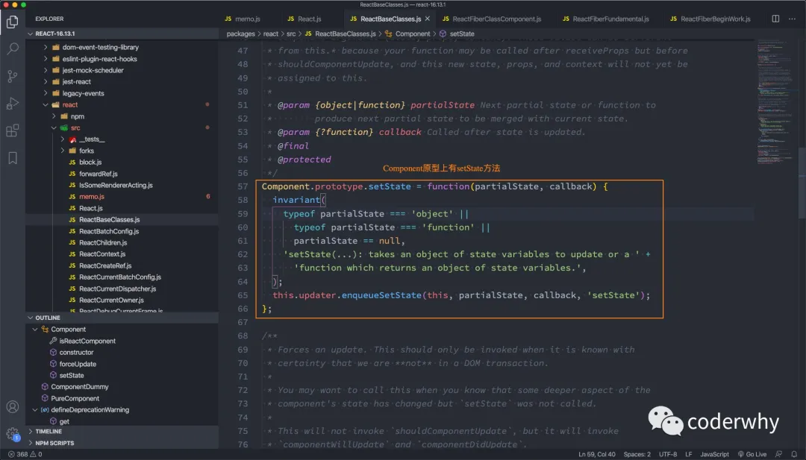

所以，我们可以通过调用setState来修改数据：

- 当我们调用setState时，会重新执行render函数，根据最新的State来创建ReactElement对象；
- 再根据最新的ReactElement对象，对DOM进行修改；

```javascript
changeText() {
  this.setState({
    message: "你好啊,李银河"
  })
}
```

### 1.2. setState异步更新

我们来看下面的代码：

- 最终打印结果是Hello World；
- 可见setState是异步的操作，我们并不能在执行完setState之后立马拿到最新的state的结果

```javascript
changeText() {
  this.setState({
    message: "你好啊,李银河"
  })
  console.log(this.state.message); // Hello World
}
```

为什么setState设计为异步呢？

- setState设计为异步其实之前在GitHub上也有很多的讨论；
- React核心成员（Redux的作者）Dan Abramov也有对应的回复，有兴趣的同学可以参考一下；
- https://github.com/facebook/react/issues/11527#issuecomment-360199710；

我对其回答做一个简单的总结：

- `setState`设计为异步，**可以显著的提升性能**；

- - 如果每次调用 setState都进行一次更新，那么意味着render函数会被频繁调用，界面重新渲染，这样效率是很低的；
  - 最好的办法应该是获取到多个更新，之后进行批量更新；

- 如果同步更新了state，但是还没有执行render函数，那么state和props不能保持同步；

- - state和props不能保持一致性，会在开发中产生很多的问题；

那么如何可以获取到更新后的值呢？

- setState接受两个参数：第二个参数是一个回调函数，这个回调函数会在更新后会执行；
- 格式如下：`setState(partialState, callback)`

```javascript
changeText() {
  this.setState({
    message: "你好啊,李银河"
  }, () => {
    console.log(this.state.message); // 你好啊,李银河
  });
}
```

当然，我们也可以在生命周期函数：

```javascript
componentDidUpdate(prevProps, provState, snapshot) {
  console.log(this.state.message);
}
```

### 1.3. setState一定是异步？

疑惑：setState一定是异步更新的吗？

验证一：在setTimeout中的更新：

```javascript
changeText() {
  setTimeout(() => {
    this.setState({
      message: "你好啊,李银河"
    });
    console.log(this.state.message); // 你好啊,李银河
  }, 0);
}
```

验证二：原生DOM事件：

```javascript
componentDidMount() {
  const btnEl = document.getElementById("btn");
  btnEl.addEventListener('click', () => {
    this.setState({
      message: "你好啊,李银河"
    });
    console.log(this.state.message); // 你好啊,李银河
  })
}
```

其实分成两种情况：

- 在组件生命周期或React合成事件中，setState是异步；
- 在setTimeout或者原生dom事件中，setState是同步；

React中其实是通过一个函数来确定的：enqueueSetState部分实现（react-reconciler/ReactFiberClassComponent.js）

```javascript
enqueueSetState(inst, payload, callback) {
  const fiber = getInstance(inst);
  // 会根据React上下文计算一个当前时间
  const currentTime = requestCurrentTimeForUpdate();
  const suspenseConfig = requestCurrentSuspenseConfig();
  // 这个函数会返回当前是同步还是异步更新（准确的说是优先级）
  const expirationTime = computeExpirationForFiber(
    currentTime,
    fiber,
    suspenseConfig,
  );

  const update = createUpdate(expirationTime, suspenseConfig);
  
  ...
}
```

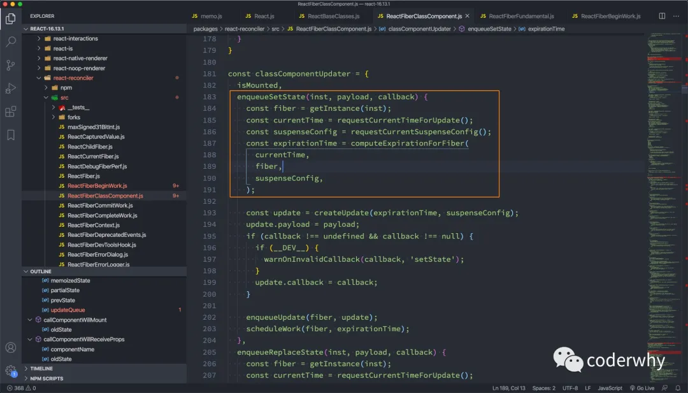

computeExpirationForFiber函数的部分实现：

- Sync是优先级最高的，即创建就更新；

```javascript
  currentTime: ExpirationTime,
  fiber: Fiber,
  suspenseConfig: null | SuspenseConfig,
): ExpirationTime {
  const mode = fiber.mode;
  if ((mode & BlockingMode) === NoMode) {
    return Sync;
  }

  const priorityLevel = getCurrentPriorityLevel();
  if ((mode & ConcurrentMode) === NoMode) {
    return priorityLevel === ImmediatePriority ? Sync : Batched;
  }
```

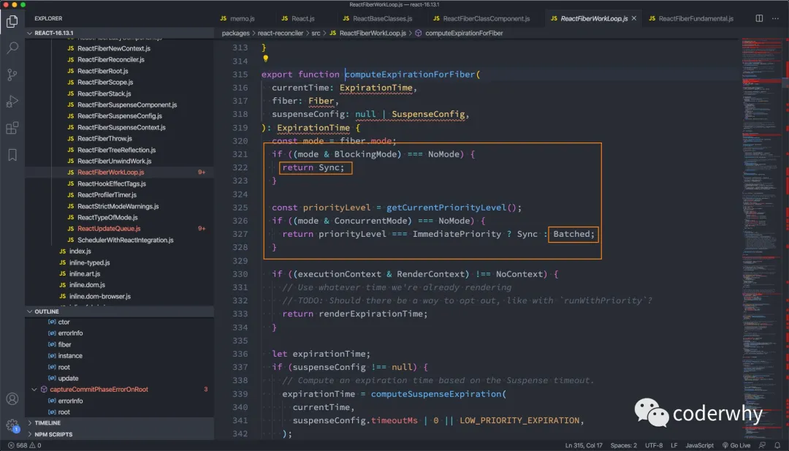

### 1.4. setState的合并

#### 1.4.1. 数据的合并

假如我们有这样的数据：

```javascript
this.state = {
  name: "coderwhy",
  message: "Hello World"
}
```

我们需要更新message：

- 我通过setState去修改message，是不会对name产生影响的；

```javascript
changeText() {
  this.setState({
    message: "你好啊,李银河"
  });
}
```

为什么不会产生影响呢？源码中其实是有对 `原对象` 和 `新对象进行合并的：`

- 事实上就是使用 `Object.assign(target, ...sources)` 来完成的；

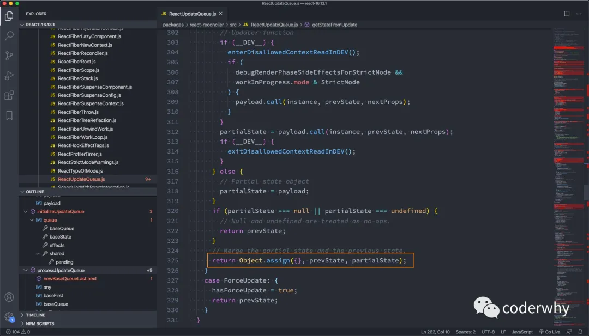

#### 1.4.2. 多个setState合并

比如我们还是有一个counter属性，记录当前的数字：

- 如果进行如下操作，那么counter会变成几呢？**答案是1；**
- 为什么呢？因为它会对多个state进行合并；

```javascript
increment() {
    this.setState({
      counter: this.state.counter + 1
    });

    this.setState({
      counter: this.state.counter + 1
    });

    this.setState({
      counter: this.state.counter + 1
    });
  }
```

其实在源码的processUpdateQueue中有一个do...while循环，就是从队列中取出多个state进行合并的；

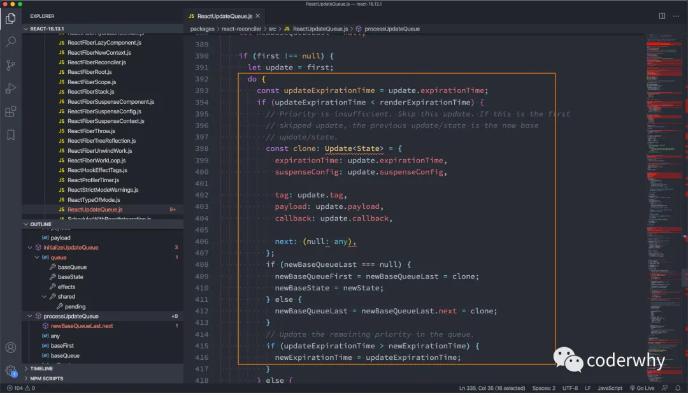

如何可以做到，**让counter最终变成3呢？**

```javascript
increment() {
  this.setState((state, props) => {
    return {
      counter: state.counter + 1
    }
  })

  this.setState((state, props) => {
    return {
      counter: state.counter + 1
    }
  })

  this.setState((state, props) => {
    return {
      counter: state.counter + 1
    }
  })
  }
```

为什么传入一个函数就可以变出3呢？

- 原因是多个state进行合并时，每次遍历，都会执行一次函数：

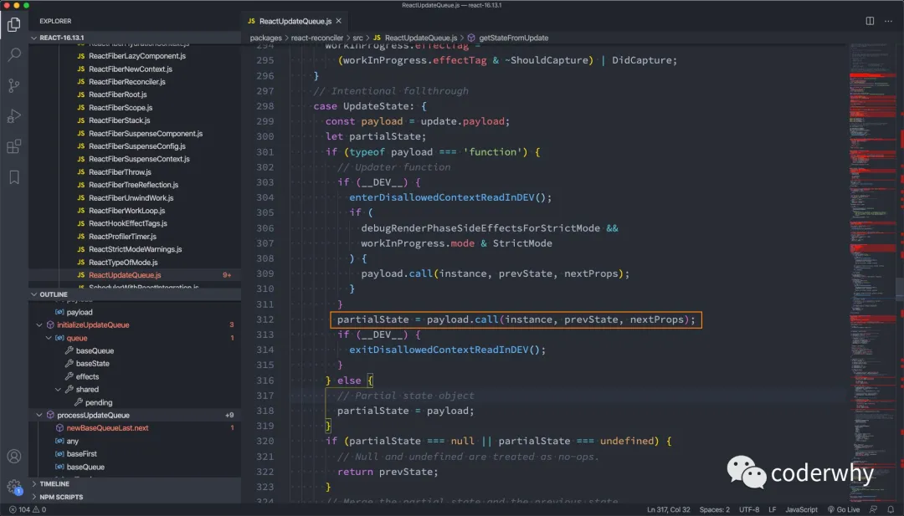

## 二. setState性能优化

### 2.1. React更新机制

我们在前面已经学习React的渲染流程：


那么React的更新流程呢？

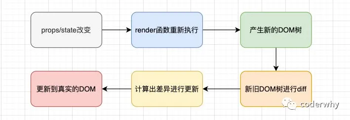

React在props或state发生改变时，会调用React的render方法，会创建一颗不同的树。

React需要基于这两颗不同的树之间的差别来判断如何有效的更新UI：

- 如果一棵树参考另外一棵树进行完全比较更新，那么即使是最先进的算法，该算法的复杂程度为 O(n 3 )，其中 n 是树中元素的数量；
- https://grfia.dlsi.ua.es/ml/algorithms/references/editsurvey_bille.pdf；
- 如果在 React 中使用了该算法，那么展示 1000 个元素所需要执行的计算量将在十亿的量级范围；
- 这个开销太过昂贵了，React的更新性能会变得非常低效；

于是，React对这个算法进行了优化，将其优化成了O(n)，如何优化的呢？

- 同层节点之间相互比较，不会垮节点比较；
- 不同类型的节点，产生不同的树结构；
- 开发中，可以通过key来指定哪些节点在不同的渲染下保持稳定；

### 2.2. Diffing算法

#### 2.2.1. 对比不同类型的元素

当节点为不同的元素，React会拆卸原有的树，并且建立起新的树：

- 当一个元素从 `<a>` 变成 ``，从 `<Article>` 变成 `<Comment>`，或从 `<Button>` 变成 `<div>` 都会触发一个完整的重建流程；
- 当卸载一棵树时，对应的DOM节点也会被销毁，组件实例将执行 `componentWillUnmount()` 方法；
- 当建立一棵新的树时，对应的 DOM 节点会被创建以及插入到 DOM 中，组件实例将执行 `componentWillMount()` 方法，紧接着 `componentDidMount()` 方法；

比如下面的代码更改：

- React 会销毁 `Counter` 组件并且重新装载一个新的组件，而不会对Counter进行复用；

```html
<div>
  <Counter />
</div>

<span>
  <Counter />
</span>
```

#### 2.2.2. 对比同一类型的元素

当比对两个相同类型的 React 元素时，React 会保留 DOM 节点，仅比对及更新有改变的属性。

比如下面的代码更改：

- 通过比对这两个元素，React 知道只需要修改 DOM 元素上的 `className` 属性；

```javascript
<div className="before" title="stuff" />

<div className="after" title="stuff" />
```

比如下面的代码更改：

- 当更新 `style` 属性时，React 仅更新有所更变的属性。
- 通过比对这两个元素，React 知道只需要修改 DOM 元素上的 `color` 样式，无需修改 `fontWeight`。

```react
<div style={{color: 'red', fontWeight: 'bold'}} />

<div style={{color: 'green', fontWeight: 'bold'}} />
```

如果是同类型的组件元素：

- 组件会保持不变，React会更新该组件的props，并且调用`componentWillReceiveProps()` 和 `componentWillUpdate()` 方法；
- 下一步，调用 `render()` 方法，diff 算法将在之前的结果以及新的结果中进行递归；

#### 2.2.3. 对子节点进行递归

在默认条件下，当递归 DOM 节点的子元素时，React 会同时遍历两个子元素的列表；当产生差异时，生成一个 mutation。

我们来看一下在最后插入一条数据的情况：

- 前面两个比较是完全相同的，所以不会产生mutation；
- 最后一个比较，产生一个mutation，将其插入到新的DOM树中即可；

```react
<ul>
  <li>first</li>
  <li>second</li>
</ul>

<ul>
  <li>first</li>
  <li>second</li>
  <li>third</li>
</ul>
```

但是如果我们是在中间插入一条数据：

- React会对每一个子元素产生一个mutation，而不是保持 `<li>星际穿越</li>`和`<li>盗梦空间</li>`的不变；
- 这种低效的比较方式会带来一定的性能问题；

```react
<ul>
  <li>星际穿越</li>
  <li>盗梦空间</li>
</ul>

<ul>
  <li>大话西游</li>
  <li>星际穿越</li>
  <li>盗梦空间</li>
</ul>
```

### 2.3. keys的优化

我们在前面遍历列表时，总是会提示一个警告，让我们加入一个key属性：


我们来看一个案例：

```react
import React, { Component } from 'react'

export default class App extends Component {
  constructor(props) {
    super(props);

    this.state = {
      movies: ["星际穿越", "盗梦空间"]
    }
  }

  render() {
    return (
      <div>
        <h2>电影列表</h2>
        <ul>
          {
            this.state.movies.map((item, index) => {
              return <li>{item}</li>
            })
          }
        </ul>
        <button onClick={e => this.insertMovie()}>插入数据</button>
      </div>
    )
  }

  insertMovie() {
  }
}
```

方式一：在最后位置插入数据

- 这种情况，有无key意义并不大

```react
insertMovie() {
  const newMovies = [...this.state.movies, "大话西游"];
  this.setState({
    movies: newMovies
  })
}
```

方式二：在前面插入数据

- 这种做法，在没有key的情况下，所有的li都需要进行修改；

```react
insertMovie() {
  const newMovies = ["大话西游", ...this.state.movies];
  this.setState({
    movies: newMovies
  })
}
```

当子元素(这里的li)拥有 key 时，React 使用 key 来匹配原有树上的子元素以及最新树上的子元素：

- 在下面这种场景下，key为111和222的元素仅仅进行位移，不需要进行任何的修改；
- 将key为333的元素插入到最前面的位置即可；

```react
<ul>
  <li key="111">星际穿越</li>
  <li key="222">盗梦空间</li>
</ul>

<ul>
  <li key="333">Connecticut</li>
  <li key="111">星际穿越</li>
  <li key="222">盗梦空间</li>
</ul>
```

key的注意事项：

- key应该是唯一的；
- key不要使用随机数（随机数在下一次render时，会重新生成一个数字）；
- 使用index作为key，对性能是没有优化的；

### 2.4. SCU的优化

#### 2.4.1. render函数被调用

我们使用之前的一个嵌套案例：

- 在App中，我们增加了一个计数器的代码；
- 当点击+1时，会重新调用App的render函数；
- 而当App的render函数被调用时，所有的子组件的render函数都会被重新调用；

```react
import React, { Component } from 'react';

function Header() {
  console.log("Header Render 被调用");
  return <h2>Header</h2>
}

class Main extends Component {
  render() {
    console.log("Main Render 被调用");
    return (
      <div>
        <Banner/>
        <ProductList/>
      </div>
    )
  }
}

function Banner() {
  console.log("Banner Render 被调用");
  return <div>Banner</div>
}

function ProductList() {
  console.log("ProductList Render 被调用");
  return (
    <ul>
      <li>商品1</li>
      <li>商品2</li>
      <li>商品3</li>
      <li>商品4</li>
      <li>商品5</li>
    </ul>
  )
}

function Footer() {
  console.log("Footer Render 被调用");
  return <h2>Footer</h2>
}

export default class App extends Component {
  constructor(props) {
    super(props);

    this.state = {
      counter: 0
    }
  }

  render() {
    console.log("App Render 被调用");

    return (
      <div>
        <h2>当前计数: {this.state.counter}</h2>
        <button onClick={e => this.increment()}>+1</button>
        <Header/>
        <Main/>
        <Footer/>
      </div>
    )
  }

  increment() {
    this.setState({
      counter: this.state.counter + 1
    })
  }
}
```

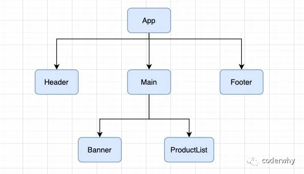

那么，我们可以思考一下，在以后的开发中，我们只要是修改了App中的数据，所有的组件都需要重新render，进行diff算法，性能必然是很低的：

- 事实上，很多的组件没有必须要重新render；
- 它们调用render应该有一个前提，就是依赖的数据（state、props）发生改变时，再调用自己的render方法；

如何来控制render方法是否被调用呢？

- 通过`shouldComponentUpdate`方法即可；

#### 2.4.2. shouldComponentUpdate

React给我们提供了一个生命周期方法 `shouldComponentUpdate`（很多时候，我们简称为SCU），这个方法接受参数，并且需要有返回值：

- 该方法有两个参数：

- - 参数一：==nextProps==修改之后，最新的props属性
  - 参数二：==nextState== 修改之后，最新的state属性

- 该方法返回值是一个boolean类型

- - 返回值为true，那么就需要调用render方法；
  - 返回值为false，那么久不需要调用render方法；
  - 默认返回的是true，也就是只要state发生改变，就会调用render方法；

```react
shouldComponentUpdate(nextProps, nextState) {
  return true; //返回true 就会调用render方法进行渲染
}
```

我们可以控制它返回的内容，来决定是否需要重新渲染。

比如我们在App中增加一个message属性：

- jsx中并没有依赖这个message，那么它的改变不应该引起重新渲染；
- 但是因为render监听到state的改变，就会重新render，所以最后render方法还是被重新调用了；

```javascript
export default class App extends Component {
  constructor(props) {
    super(props);

    this.state = {
      counter: 0,
      message: "Hello World"
    }
  }

  render() {
    console.log("App Render 被调用");

    return (
      <div>
        <h2>当前计数: {this.state.counter}</h2>
        <button onClick={e => this.increment()}>+1</button>
        <button onClick={e => this.changeText()}>改变文本</button>
        <Header/>
        <Main/>
        <Footer/>
      </div>
    )
  }

  increment() {
    this.setState({
      counter: this.state.counter + 1
    })
  }

  changeText() {
    this.setState({
      message: "你好啊,李银河"
    })
  }
}
```

这个时候，我们可以通过实现`shouldComponentUpdate`来决定要不要重新调用render方法：

- 这个时候，我们改变counter时，会重新渲染；
- 如果，我们改变的是message，那么默认返回的是false，那么就不会重新渲染；

```javascript
shouldComponentUpdate(nextProps, nextState) {
  if (nextState.counter !== this.state.counter) {
    return true;
  }

  return false;
}
```

但是我们的代码依然没有优化到最好，因为当counter改变时，所有的子组件依然重新渲染了：

- 所以，事实上，我们应该实现所有的子组件的shouldComponentUpdate；

比如Main组件，可以进行如下实现：

- `shouldComponentUpdate`默认返回一个false；
- 在特定情况下，需要更新时，我们在上面添加对应的条件即可；

```javascript
class Main extends Component {

  shouldComponentUpdate(nextProps, nextState) {
    return false;
  }

  render() {
    console.log("Main Render 被调用");
    return (
      <div>
        <Banner/>
        <ProductList/>
      </div>
    )
  }
}
```

#### 2.4.3. PureComponent和memo

如果所有的类，我们都需要手动来实现 shouldComponentUpdate，那么会给我们开发者增加非常多的工作量。

我们来设想一下shouldComponentUpdate中的各种判断的目的是什么？

- props或者state中的数据是否发生了改变，来决定shouldComponentUpdate返回true或者false；

事实上React已经考虑到了这一点，所以React已经默认帮我们实现好了，如何实现呢？

- 将class基础自PureComponent。

比如我们修改Main组件的代码：

```javascript
class Main extends PureComponent {
  render() {
    console.log("Main Render 被调用");
    return (
      <div>
        <Banner/>
        <ProductList/>
      </div>
    )
  }
}
```

PureComponent的原理是什么呢？

- 对props和state进行浅层比较；

**查看PureComponent相关的源码：**

react/ReactBaseClasses.js中：

- 在PureComponent的原型上增加一个isPureReactComponent为true的属性

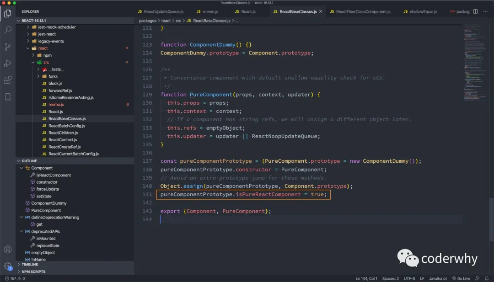

React-reconcilier/ReactFiberClassComponent.js：

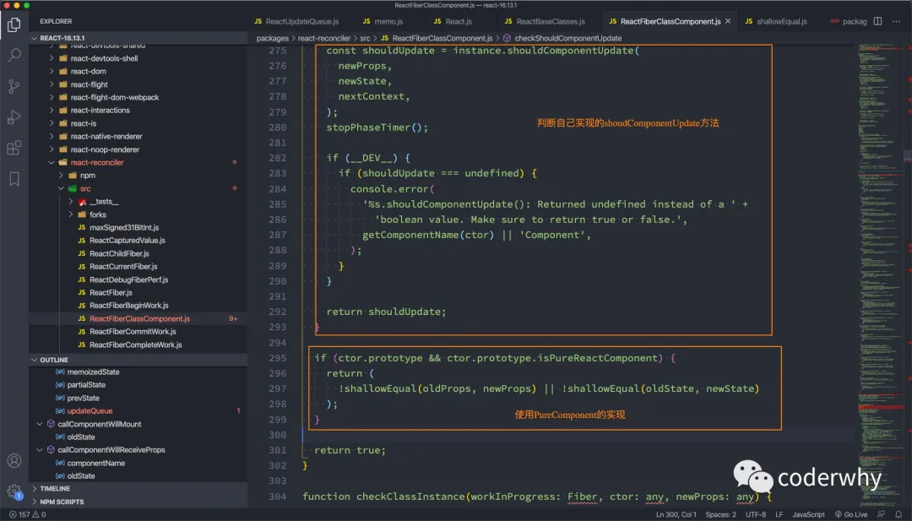

这个方法中，调用 `!shallowEqual(oldProps, newProps) || !shallowEqual(oldState, newState)`，这个shallowEqual就是进行浅层比较：

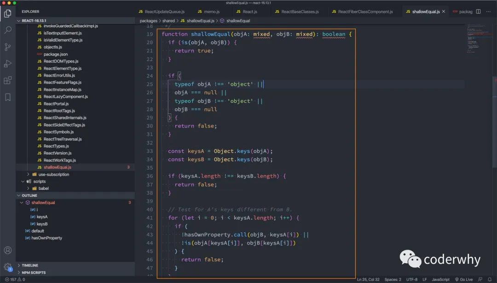

**那么，如果是一个函数式组件呢？**

我们需要使用一个高阶组件==memo==：

- 我们将之前的Header、Banner、ProductList都通过memo函数进行一层包裹；
- Footer没有使用memo函数进行包裹；
- 最终的效果是，当counter发生改变时，Header、Banner、ProductList的函数不会重新执行，而Footer的函数会被重新执行；

```javascript
import React, { Component, PureComponent, memo } from 'react';

const MemoHeader = memo(function() {
  console.log("Header Render 被调用");
  return <h2>Header</h2>
})

class Main extends PureComponent {
  render() {
    console.log("Main Render 被调用");
    return (
      <div>
        <MemoBanner/>
        <MemoProductList/>
      </div>
    )
  }
}

const MemoBanner = memo(function() {
  console.log("Banner Render 被调用");
  return <div>Banner</div>
})

const MemoProductList = memo(function() {
  console.log("ProductList Render 被调用");
  return (
    <ul>
      <li>商品1</li>
      <li>商品2</li>
      <li>商品3</li>
      <li>商品4</li>
      <li>商品5</li>
    </ul>
  )
})

function Footer() {
  console.log("Footer Render 被调用");
  return <h2>Footer</h2>
}

export default class App extends Component {
  constructor(props) {
    super(props);

    this.state = {
      counter: 0,
      message: "Hello World"
    }
  }

  render() {
    console.log("App Render 被调用");

    return (
      <div>
        <h2>当前计数: {this.state.counter}</h2>
        <button onClick={e => this.increment()}>+1</button>
        <button onClick={e => this.changeText()}>改变文本</button>
        <MemoHeader/>
        <Main/>
        <Footer/>
      </div>
    )
  }

  increment() {
    this.setState({
      counter: this.state.counter + 1
    })
  }

  shouldComponentUpdate(nextProps, nextState) {
    if (nextState.counter !== this.state.counter) {
      return true;
    }

    return false;
  }

  changeText() {
    this.setState({
      message: "你好啊,李银河"
    })
  }
}
```

**memo的原理是什么呢？**

react/memo.js：

- 最终返回一个对象，这个对象中有一个compare函数

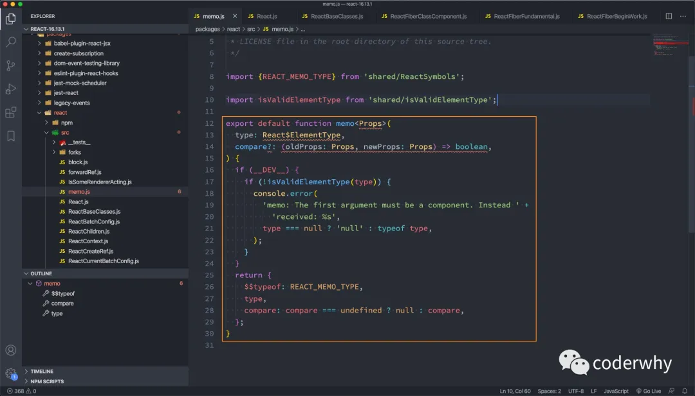

#### 2.4.4. 不可变数据的力量

我们通过一个案例来演练我们之前说的不可变数据的重要性：

```javascript
import React, { PureComponent } from 'react'

export default class App extends PureComponent {
  constructor(props) {
    super(props);

    this.state = {
      friends: [
        { name: "lilei", age: 20, height: 1.76 },
        { name: "lucy", age: 18, height: 1.65 },
        { name: "tom", age: 30, height: 1.78 }
      ]
    }
  }

  render() {
    return (
      <div>
        <h2>朋友列表</h2>
        <ul>
          {
            this.state.friends.map((item, index) => {
              return (
                <li key={item.name}>
                  <span>{`姓名:${item.name} 年龄: ${item.age}`}</span>
                  <button onClick={e => this.incrementAge(index)}>年龄+1</button>
                </li>
              )
            })
          }
        </ul>
        <button onClick={e => this.insertFriend()}>添加新数据</button>
      </div>
    )
  }

  insertFriend() {
     
  }

  incrementAge(index) {
    
  }
}
```

**我们来思考一下inertFriend应该如何实现？**

实现方式一：

- 这种方式会造成界面不会发生刷新，添加新的数据；
- 原因是继承自PureComponent，会进行浅层比较，浅层比较过程中两个friends是相同的对象；

```javascript
insertFriend() {
  this.state.friends.push({name: "why", age: 18, height: 1.88});
  this.setState({
    friends: this.state.friends
  })
}
```

实现方式二：

- `[...this.state.friends, {name: "why", age: 18, height: 1.88}]`会生成一个新的数组引用；
- 在进行浅层比较时，两个引用的是不同的数组，所以它们是不相同的；

```javascript
insertFriend() {
  this.setState({
    friends: [...this.state.friends, {name: "why", age: 18, height: 1.88}]
  })
}
```

**我们再来思考一下incrementAge应该如何实现？**

实现方式一：

- 和上面方式一类似

```javascript
incrementAge(index) {
  this.state.friends[index].age += 1;
  this.setState({
    friends: this.state.friends
  })
}
```

实现方式二：

- 和上面方式二类似

```javascript
incrementAge(index) {
  const newFriends = [...this.state.friends];
  newFriends[index].age += 1;
  this.setState({
    friends: newFriends
  })
}
```

所以，在真实开发中，我们要尽量保证state、props中的数据不可变性，这样我们才能合理和安全的使用PureComponent和memo。

当然，后面项目中我会结合immutable.js来保证数据的不可变性。