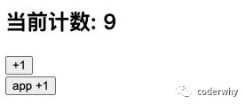
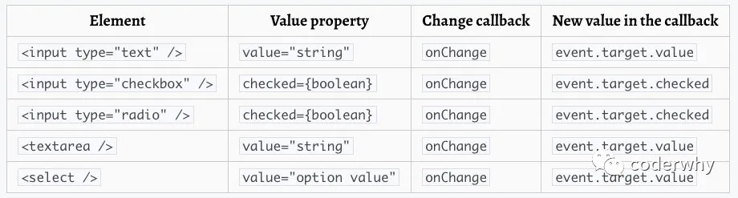

## 一. refs的使用

在React的开发模式中，通常情况下不需要、也不建议直接操作DOM原生，但是某些特殊的情况，确实需要获取到DOM进行某些操作：

- 管理焦点，文本选择或媒体播放。
- 触发强制动画。
- 集成第三方 DOM 库。

### 1.1. 创建ref的方式

如何创建refs来获取对应的DOM呢？目前有三种方式：

- 方式一：传入字符串

- - 使用时通过 `this.refs.传入的字符串`格式获取对应的元素；

- 方式二：传入一个对象 ==( 最常用 )==

- - 对象是通过 `React.createRef()` 方式创建出来的；
  - 使用时获取到创建的对象其中有一个`current`属性就是对应的元素；

- 方式三：传入一个函数

- - 该函数会在DOM被挂载时进行回调，这个函数会传入一个 元素对象，我们可以自己保存；
  - 使用时，直接拿到之前保存的元素对象即可；

代码演练：

```react
import React, { PureComponent, createRef } from 'react' //导入createRef 创建ref

export default class App extends PureComponent {
  constructor(props) {
    super(props);

    this.titleRef = createRef(); //通过createRef 创建ref
    this.titleEl = null;
  }

  render() {
    return (
      <div>
        <h2 ref="title">String Ref</h2>
        <h2 ref={this.titleRef}>Hello Create Ref</h2>
        <h2 ref={element => this.titleEl = element}>Callback Ref</h2>

        <button onClick={e => this.changeText()}>改变文本</button>
      </div>
    )
  }

  changeText() {
    this.refs.title.innerHTML = "你好啊,李银河";
    this.titleRef.current.innerHTML = "你好啊,李银河";  //注意current才可以获取到值
    this.titleEl.innerHTML = "你好啊,李银河";
  }
}
```

### 1.2. ref节点的类型

ref 的值根据节点的类型而有所不同：

- 当 `ref` 属性用于 HTML 元素时，构造函数中使用 `React.createRef()` 创建的 `ref` 接收底层 DOM 元素作为其 `current` 属性；
- 当 `ref` 属性用于自定义 class **组件**时，`ref` 对象接收组件的**挂载实例**作为其 `current` 属性；
- **你不能在函数组件上使用 ref 属性**，因为他们没有实例；

这里我们演示一下ref引用一个class组件对象：



```react
import React, { PureComponent, createRef } from 'react';

class Counter extends PureComponent {
  constructor(props) {
    super(props);

    this.state = {
      counter: 0
    }
  }

  render() {
    return (
      <div>
        <h2>当前计数: { this.state.counter }</h2>
        <button onClick={ e => this.increment() }>+1</button>
      </div>
    )
  }

  increment() {
    this.setState({
      counter: this.state.counter + 1
    })
  }
}


export default class App extends PureComponent {
  constructor(props) {
    super(props);

    this.counterRef = createRef();
  }

  render() {
    return (
      <div>
        <Counter ref={this.counterRef}/>  {/*接受组件的 挂载实例*/}
        <button onClick={e => this.increment()}>app +1</button>
      </div>
    )
  }

  increment() {
    this.counterRef.current.increment();
  }
}
```

函数式组件是没有实例的，所以无法通过ref获取他们的实例：

- 但是某些时候，我们可能想要获取函数式组件中的某个DOM元素；
- 这个时候我们可以通过 `React.forwardRef` ，后面我们也会学习 hooks 中如何使用ref；

## 二. 受控组件

### 2.1. 认识受控组件

#### 2.1.1. 默认提交表单方式

在React中，HTML表单的处理方式和普通的DOM元素不太一样：表单元素通常会保存在一些内部的state。

比如下面的HTML表单元素：

- 这个处理方式是DOM默认处理HTML表单的行为，在用户点击提交时会提交到某个服务器中，并且刷新页面；
- 在React中，并没有禁止这个行为，它依然是有效的；
- 但是通常情况下会使用JavaScript函数来方便的处理表单提交，同时还可以访问用户填写的表单数据；
- 实现这种效果的标准方式是使用“受控组件”；

```react
<form>
  <label>
    名字:
    <input type="text" name="name" />
  </label>
  <input type="submit" value="提交" />
</form>
```

#### 2.1.2. 受控组件提交表单

在 HTML 中，表单元素（如`<input>`、 `<textarea>` 和 `<select>`）之类的表单元素通常自己维护 state，并根据用户输入进行更新。

而在 React 中，可变状态（mutable state）通常保存在组件的 state 属性中，并且只能通过使用 `setState()`来更新。

- 我们将两者结合起来，使React的state成为“唯一数据源”；
- 渲染表单的 React 组件还控制着用户输入过程中表单发生的操作；
- 被 React 以这种方式控制取值的表单输入元素就叫做“受控组件”；

例如，如果我们想让前一个示例在提交时打印出名称，我们可以将表单写为受控组件：

```react
import React, { PureComponent } from 'react'

export default class App extends PureComponent {
  constructor(props) {
    super(props);

    this.state = {
      username: ""
    }
  }

  render() {
    const {username} = this.state;

    return (
      <div>
        <form onSubmit={e => this.handleSubmit(e)}>
          <label htmlFor="username">
            用户名: 
            <input type="text" 
                   id="username" 
                   onChange={e => this.handleUsernameChange(e)} 
                   value={username}/>
          </label>
          <input type="submit" value="提交"/>
        </form>
      </div>
    )
  }

  handleUsernameChange(event) {
    this.setState({
      username: event.target.value
    })
  }

  handleSubmit(event) {
    console.log(this.state.username);
    event.preventDefault();
  }
}
```

由于在表单元素上设置了 `value` 属性，因此显示的值将始终为 `this.state.value`，这使得 React 的 state 成为唯一数据源。

由于 `handleUsernameChange` 在每次按键时都会执行并更新 React 的 state，因此显示的值将随着用户输入而更新。

### 2.2. 常见表单的处理

刚才我们演示的是一个input表单的处理，这里我们再演示一下其他的情况。



#### 2.2.1. textarea标签

texteare标签和input比较相似：

```react
import React, { PureComponent } from 'react'

export default class App extends PureComponent {
  constructor(props) {
    super(props);

    this.state = {
      article: "请编写你喜欢的文章"
    }
  }

  render() {
    return (
      <div>
        <form onSubmit={e => this.handleSubmit(e)}>
          <label htmlFor="article">
            <textarea id="article" cols="30" rows="10"
                      value={this.state.article}
                      onChange={e => this.handleArticelChange(e)}/>
          </label>
          <div>
            <input type="submit" value="发布文章"/>
          </div>
        </form>
      </div>
    )
  }

  handleArticelChange(event) {
    this.setState({
      article: event.target.value
    })
  }

  handleSubmit(event) {
    console.log(this.state.article);
    event.preventDefault();
  }
}
```

#### 2.2.2. select标签

select标签的使用也非常简单，只是它不需要通过selected属性来控制哪一个被选中，它可以匹配state的value来选中。

我们来进行一个简单的演示：

```react
import React, { PureComponent } from 'react'

export default class App extends PureComponent {
  constructor(props) {
    super(props);

    this.state = {
      fruits: "orange"
    }
  }

  render() {
    return (
      <div>
        <form onSubmit={e => this.handleSubmit(e)}>
          <label htmlFor="fruits">
            <select id="fruits" 
                    value={this.state.fruits}
                    onChange={e => this.handleFruitsChange(e)}>
              <option value="apple">苹果</option>
              <option value="orange">橘子</option>
              <option value="banana">香蕉</option>
            </select>
          </label>
          <div>
            <input type="submit" value="提交"/>
          </div>
        </form>
      </div>
    )
  }

  handleFruitsChange(event) {
    this.setState({
      fruits: event.target.value
    })
  }

  handleSubmit(event) {
    console.log(this.state.article);
    event.preventDefault();
  }
}
```

#### 2.2.3. 处理多个输入

多处理方式可以像单处理方式那样进行操作，但是需要多个监听方法：

- 这里我们可以使用ES6的一个语法：计算属性名（Computed property names）

```react
let i = 0
let a = {
  ['foo' + ++i]: i,
  ['foo' + ++i]: i,
  ['foo' + ++i]: i
}

console.log(a.foo1) // 1
console.log(a.foo2) // 2
console.log(a.foo3) // 3

//-------------------------- 变化的key 拿到不同的value值

let param = 'size'
let config = {
  [param]: 12,
  ['mobile' + param.charAt(0).toUpperCase() + param.slice(1)]: 4
}

console.log(config) // {size: 12, mobileSize: 4}
```

我们进行对应的代码演练:

```react
import React, { PureComponent } from 'react'

export default class App extends PureComponent {
  constructor(props) {
    super(props);

    this.state = {
      username: "",
      password: ""
    }
  }

  render() {
    const {username, password} = this.state;

    return (
      <div>
        <form onSubmit={ e => this.handleSubmit(e) }>
          <label htmlFor="username">
            用户: 
            <input type="text" 
                   id="username" 
                   name="username"
                   onChange={e => this.handleChange(e)} 
                   value={username}/>
          </label>
          <label htmlFor="password">
            密码: 
            <input type="text" 
                   id="password" 
                   name="password"
                   onChange={e => this.handleChange(e)} 
                   value={password}/>
          </label>
          <input type="submit" value="提交"/>
        </form>
      </div>
    )
  }

  handleChange(event) {
    this.setState({
      //这里的key是变化的key , 可以拿到不同的value
      [event.target.name]: event.target.value
    })
  }

  handleSubmit(event) {
    console.log(this.state.username, this.state.password);
    event.preventDefault();
  }
}
```

## 三. 非受控组件

React推荐大多数情况下使用 `受控组件` 来处理表单数据：

- 一个受控组件中，表单数据是由 React 组件来管理的；
- 另一种替代方案是使用**非受控组件，这时表单数据将交由 DOM 节点来处理**；

如果要使用非受控组件中的数据，那么我们需要使用 `ref` 来从DOM节点中获取表单数据。

我们来进行一个简单的演练：

- 使用ref来获取input元素；
- 在非受控组件中通常使用defaultValue来设置默认值；

```react
import React, { PureComponent, createRef } from 'react'

export default class App extends PureComponent {
  constructor(props) {
    super(props);

    this.usernameRef = createRef(); //创建ref对象
  }

  render() {
    return (
      <div>
        <form onSubmit={e => this.handleSubmit(e)}>
          <label htmlFor="">
            用户:<input defaultValue="username" type="text" name="username" ref={this.usernameRef}/>
          </label>
          <input type="submit" value="提交"/>
        </form>
      </div>
    )
  }

  handleSubmit(event) {
    event.preventDefault();
    console.log(this.usernameRef.current.value);
  }
}
```

同样，`<input type="checkbox">` 和 `<input type="radio">` 支持 `defaultChecked`，`<select>` 和 `<textarea>` 支持 `defaultValue`。

