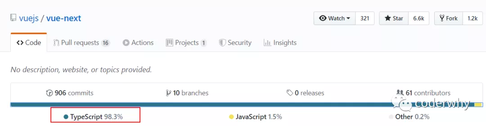

# TypeScript 培养类型思维

## **一. JavaScript 的痛点**

> 我始终坚信：任何新技术的出现都是为了解决之前某个技术的痛点。

### 1.1. 优秀的 JavaScript

JavaScript 是一门优秀的编程语言吗？

- 每个人可能观点并不完全一致，但是从很多角度来看，JavaScript 是一门非常优秀的编程语言。
- 而且，可以说在很长一段时间内这个语言不会被代替，并且会在更多的领域被大家广泛使用。

著名的 Atwood 定律：

- Stack Overflow 的创立者之一的 **Jeff Atwood** 在 2007 年提出了著名的 **Atwood 定律**。
- any application that can be written in JavaScript, will eventually be written in JavaScript.
- 任何可以使用 JavaScript 来实现的应用都最终都会使用 JavaScript 实现。
- 其实我们已经看到了，至少目前 JavaScript 在浏览器端依然无可替代，并且在服务端（node.js）也在备广泛的应用。

优秀的 JavaScript 没有缺点吗？

- 其实上由于各种历史因素，JavaScript 语言本身存在很多的缺点；
- 比如 ES5 以及之前的使用的 var 关键字关于作用域的问题；
- 比如最初 JavaScript 设计的数组类型并不是连续的内存空间；
- 比如直到今天 JavaScript 也没有加入类型检测这一机制；

JavaScript 正在慢慢变好

- 不可否认的是，JavaScript 正在慢慢变得越来越好，无论是从底层设计还是应用层面。
- ES6、7、8 等的推出，每次都会让这门语言更加现代、更加安全、更加方便。
- 但是知道今天，JavaScript 在类型检测上依然是毫无进展（为什么类型检测如此重要，我后面会聊到）。

### 1.2. 类型引发的问题

首先你需要知道，编程开发中我们有一个共识：**错误出现的越早越好**

- 能在**写代码的时候**发现错误，就不要在**代码编译时**再发现（IDE 的优势就是在代码编写过程中帮助我们发现错误）。
- 能在**代码编译期间**发现错误，就不要在**代码运行期间**再发现（类型检测就可以很好的帮助我们做到这一点）。
- 能在开发阶段发现错误，就不要在测试期间发现错误。
- 能在测试期间发现错误，就不要在上线后发现错误。

现在我们想探究的就是如何在 **代码编译期间** 发现代码的错误：

- JavaScript 可以做到吗？不可以，我们来看下面这段经常可能出现的代码问题。

```javascript
function getLength(str) {
  return str.length;
}

console.log("1.正在的代码执行");
console.log("2.开始函数");
getLength("abc"); // 正确的调用
getLength(); // 错误的调用(IDE并不会报错)

// 当上面的代码报错后, 后续所有的代码都无法继续正常执行了
console.log("3.调用结束");
```


在浏览器下的运行结果如下：


这是我们一个非常常见的错误：

- 这个错误很大的原因就是因为 JavaScript 没有对我们传入的参数进行任何的限制，只能等到运行期间才发现这个错误；
- 并且当这个错误产生时，会影响后续代码的继续执行，也就是整个项目都因为一个小小的错误而深入崩溃；

```javascript
Uncaught TypeError: Cannot read property 'length' of undefined
```

当然，你可能会想：我怎么可能犯这样低级的错误呢？

- 当我们写像我们上面这样的简单的 demo 时，这样的错误很容易避免，并且当出现错误时，也很容易检查出来；
- 但是当我们开发一个大型项目时呢？你能保证自己一定不会出现这样的问题吗？而且如果我们是调用别人的类库，又如何知道让我们传入的到底是什么样的参数呢？

但是，如果我们可以给 JavaScript 加上很多限制，在开发中就可以很好的避免这样的问题了：

- 比如我们的 getLength 函数中 str 是一个必传的类型，如果调用者没有传，编译期间就会报错；
- 比如我们要求它的必须是一个 String 类型，传入其他类型就直接报错；
- 那么就可以知道很多的错误问题在编译期间就被发现，而不是等到运行时再去发现和修改；

### 1.3. 类型思维的缺失

我们已经简单体会到没有类型检查带来的一些问题，JavaScript 因为从设计之初就没有考虑类型的约束问题，所以造成了前端开发人员关于**类型思维的缺失**：

- **前端开发人员**通常不关心变量或者参数是什么类型的，如果在必须确定类型时，我们往往需要使用各种判断验证；
- 从其他方向转到前端的人员，也会因为没有类型约束，而总是担心自己的代码不安全，不够健壮；

所以我们经常会说 JavaScript**不适合开发大型项目**，因为当项目一旦庞大起来，这种宽松的类型约束会带来非常多的安全隐患，多人员开发它们之间也没有**良好的类型契约**。

比如当我们去实现一个核心类库时，如果没有类型约束，那么需要对别人传入的参数进行各种验证来保证我们代码的健壮性；

比如我们去调用别人的函数，对方没有对函数进行任何的注释，我们只能去看里面的逻辑来理解这个函数需要传入什么参数，返回值是什么类型。

**为了弥补 JavaScript 类型约束上的缺陷，增加类型约束，很多公司推出了自己的方案：**

- 2014 年，Facebook 推出了 flow 来对 JavaScript 进行类型检查；
- 同年，Microsoft 微软也推出了 TypeScript1.0 版本；
- 他们都致力于为 JavaScript 提供类型检查；

而现在，无疑**TypeScript 已经完全胜出**：

- Vue2.x 的时候采用的就是 flow 来做类型检查；
- Vue3.x 已经全线转向 TypeScript，98.3%使用 TypeScript 进行了重构；
- 而 Angular 在很早期就使用 TypeScript 进行了项目重构并且需要使用 TypeScript 来进行开发；
- 而甚至 Facebook 公司一些自己的产品也在使用 TypeScript；

学习 TypeScript 不仅仅可以为我们的代码增加类型约束，而且可以培养我们前端程序员具备类型思维。

下面就让我们今天的主角 TypeScript 隆重登场吧！

## **二. 邂逅 TypeScript**

### 2.1. 什么是 TypeScript

虽然我们已经知道 TypeScript 是干什么的了，也知道它解决了什么样的问题，但是我们还是需要全面的来认识一下 TypeScript 到底是什么？

我们来看一下 TypeScript 在 GitHub 和官方上对自己的定义：

```javascript
GitHub说法：TypeScript is a superset of JavaScript that compiles to clean JavaScript output.
TypeScript官网：TypeScript is a typed superset of JavaScript that compiles to plain JavaScript.
翻译一下：TypeScript是拥有类型的JavaScript超集，它可以编译成普通、干净、完整的JavaScript代码。
```

怎么理解上面的话呢？

- 我们可以将 TypeScript 理解成**加强版**的 JavaScript。
- JavaScript 所拥有的特性，TypeScript 全部都是支持的，并且它紧随 ECMAScript 的标准，所以 ES6、ES7、ES8 等新语法标准，它都是支持的；
- 并且在语言层面上，不仅仅增加了类型约束，而且包括一些语法的扩展，比如枚举类型（Enum）、元组类型（Tuple）等；
- TypeScript 在实现新特性的同时，总是保持和 ES 标准的同步甚至是领先；
- 并且 TypeScript 最终会被**编译**成 JavaScript 代码，所以你并不需要担心它的兼容性问题，在编译时也不需要借助于 Babel 这样的工具；

所以，我们可以把 TypeScript 理解成一身神装的 JavaScript，不仅让 JavaScript 更加安全，而且给它带来了诸多好用的装备特效；

### 2.2. TypeScript 的特点

官方对 TypeScript 有几段特点的描述，我觉得非常到位（虽然有些官方，了解一下），我们一起来分享一下：

**始于 JavaScript，归于 JavaScript**。

- TypeScript 从今天数以百万计的 JavaScript 开发者所熟悉的语法和语义开始。使用现有的 JavaScript 代码，包括流行的 JavaScript 库，并从 JavaScript 代码中调用 TypeScript 代码。
- TypeScript 可以编译出纯净、 简洁的 JavaScript 代码，并且可以运行在任何浏览器上、Node.js 环境中和任何支持 ECMAScript 3（或更高版本）的 JavaScript 引擎中。

**TypeScript 是一个强大的工具，用于构建大型项目**

- 类型允许 JavaScript 开发者在开发 JavaScript 应用程序时使用高效的开发工具和常用操作比如静态检查和代码重构。
- 类型是可选的，类型推断让一些类型的注释使你的代码的静态验证有很大的不同。类型让你定义软件组件之间的接口和洞察现有 JavaScript 库的行为。

**拥有先进的 JavaScript**

- TypeScript 提供最新的和不断发展的 JavaScript 特性，包括那些来自 2015 年的 ECMAScript 和未来的提案中的特性，比如异步功能和 Decorators，以帮助建立健壮的组件。
- 这些特性为高可信应用程序开发时是可用的，但是会被编译成简洁的 ECMAScript3（或更新版本）的 JavaScript。

正是因为有这些特性，TypeScript 目前已经在很多地方被应用：

- 包括我们前面提到的 Vue3 和 Angular 已经使用 TypeScript 进行重构；




- 包括 Vue3 以后的开发模式必然会和 TypeScript 更加切合，大家也更多的需要使用 TypeScript 来编写代码；
- 包括目前已经变成最流行的编辑器 VSCode 也是使用 TypeScript 来完成的


- 包括在 React 中已经使用的 ant-design 的 UI 库，也大量使用 TypeScript 来编写：


- 包括小程序开发，也是支持 TypeScript 的


### 2.3. 体验 TypeScript

本来想在这个位置放上一个体验 TypeScript 的程序，但是涉及到过多 TypeScript 的安装流程和 vscode 的配置信息。

所以，我打算在下一篇中专门讲解这部分的内容，包括使用 webpack 搭建一个可以自动测试 TypeScript 代码的环境。

So，稍安勿躁，这一个章节我们就和 TypeScript 有一个简单的邂逅就好，后面再进行深入了解。

## **三. 前端学不动系列**

### 3.1. 前端开发者的难

在之前的 Flutter 文章中，我说到一个话题，大前端是一群最能或者说最需要折腾的开发者：

- `客户端开发者`：从 Android 到 iOS，或者从 iOS 到 Android，到 RN，甚至现在越来越多的客户端开发者接触前端相关知识（Vue、React、Angular、小程序）；
- `前端开发者`：从 jQuery 到 AngularJS，到三大框架并行：Vue、React、Angular，还有小程序，甚至现在也要接触客户端开发（比如 RN、Flutter）；
- 目前又面临着不仅仅学习 ES 的特性，还要学习 TypeScript；
- Vue3 马上也会到来，又必须学习 Vue3 新特性；

大前端开发就是，不像服务器一样可能几年甚至几十年还是那一套的东西。前端新技术会层出不穷。


**但是每一样技术的出现都会让惊喜，因为他必然是解决了之前技术的某一个痛点的，而 TypeScript 真是解决了 JavaScript 存在的很多设计缺陷，尤其是关于类型检测的。**

并且从开发者长远的角度来看，学习 TypeScript 有助于我们前端程序员培养 **类型思维**，这种思维方式对于完成大型项目尤为重要。

我也会更新一个 TypeScript 的系列文章，带着大家一起来学习 TypeScript，并且培养大家可以形成**类型思维**。

### 3.2. 解除心中的疑惑

回到我们开篇提出的一些疑惑：

> TypeScript 到底是什么？为什么每个人都在说 TypeScript 怎么怎么好，到底好在哪里？Angular、Vue3 接连使用 TypeScript 进行了重构是否意味着我们必须掌握 TypeScript，它们又为什么要选择 TypeScript？我需要什么样的基础才能学会或者说学好 TypeScript 呢？

我们相信上面的问题大部分你都已经有了答案。

我们来回答一下学习这个系列文章你需要掌握什么？

- 首先，我们需要熟练掌握 JavaScript，所以不需要问学习 TypeScript 还需不需要学习 JavaScript 这样的问题了
- 其次，我们需要掌握常见的 ES6 语法，某些语法我会在后续的更新中再次提起，但是希望你可以掌握一些基础的 ES6 特性。

从下一篇开始，就让我们把 TypeScript 环境搭建好，开始正式学习它吧！
