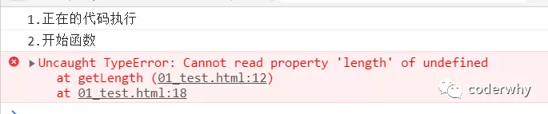

:::pre

# TypeScript 培养类型思维

## **一. JavaScript 的痛点**

> 我始终坚信：任何新技术的出现都是为了解决之前某个技术的痛点。



### 1.1. 优秀的 JavaScript

JavaScript 是一门优秀的编程语言吗？<mark>re112</mark>

- 每个人可能观点并不完全一致，但是从很多角度来看，JavaScript 是一门非常优秀的编程语言。
- 而且，可以说在很长一段时间内这个语言不会被代替，并且会在更多的领域被大家广泛使用。

著名的 Atwood 定律：

- Stack Overflow 的创立者之一的 **Jeff Atwood** 在 2007 年提出了著名的 **Atwood 定律**。
- any application that can be written in JavaScript, will eventually be written in JavaScript.
- 任何可以使用 JavaScript 来实现的应用都最终都会使用 JavaScript 实现。
- 其实我们已经看到了，至少目前 JavaScript 在浏览器端依然无可替代，并且在服务端（node.js）也在备广泛的应用。

优秀的 JavaScript 没有缺点吗？

- 其实上由于各种历史因素，JavaScript 语言本身存在很多的缺点；
- 比如 ES5 以及之前的使用的 var 关键字关于作用域的问题；
- 比如最初 JavaScript 设计的数组类型并不是连续的内存空间；
- 比如直到今天 JavaScript 也没有加入类型检测这一机制；

JavaScript 正在慢慢变好

- 不可否认的是，JavaScript 正在慢慢变得越来越好，无论是从底层设计还是应用层面。
- ES6、7、8 等的推出，每次都会让这门语言更加现代、更加安全、更加方便。
- 但是知道今天，JavaScript 在类型检测上依然是毫无进展（为什么类型检测如此重要，我后面会聊到）。

### 1.2. 类型引发的问题

首先你需要知道，编程开发中我们有一个共识：**错误出现的越早越好**

- 能在**写代码的时候**发现错误，就不要在**代码编译时**再发现（IDE 的优势就是在代码编写过程中帮助我们发现错误）。
- 能在**代码编译期间**发现错误，就不要在**代码运行期间**再发现（类型检测就可以很好的帮助我们做到这一点）。
- 能在开发阶段发现错误，就不要在测试期间发现错误。
- 能在测试期间发现错误，就不要在上线后发现错误。

现在我们想探究的就是如何在 **代码编译期间** 发现代码的错误：

- JavaScript 可以做到吗？不可以，我们来看下面这段经常可能出现的代码问题。

```javascript
function getLength(str) {
  return str.length;
}

console.log("1.正在的代码执行");
console.log("2.开始函数");
getLength("abc"); // 正确的调用
getLength(); // 错误的调用(IDE并不会报错)

// 当上面的代码报错后, 后续所有的代码都无法继续正常执行了
console.log("3.调用结束");
```

常见的 ES6 语法，某些语法我会在后续的更新中再次提起，但是希望你可以掌握一些基础的 ES6 特性。

从下一篇开始，就让我们把 TypeScript 环境搭建好，开始正式学习它吧！

:::

哈哈哈,我是新增的字段~
