# TypeScript 环境搭建

## **一. 环境搭建**

### 1.1. TypeScript 环境安装

**已经配置好的环境，大家可以直接下载：https://github.com/coderwhy/HYLearnTS.git**

在上一个章节中我们说过，TypeScript 最终会被编译成 JavaScript 代码：

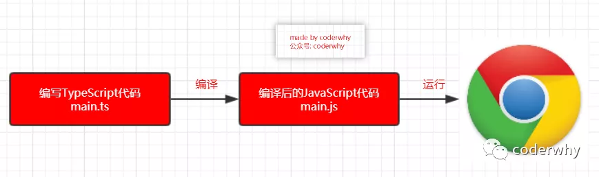

那么我们必然需要对应的编译环境：

- 首先，TypeScript 的环境安装依赖 Node，所以需要先保证电脑上有 Node 和 NPM 环境；
- 其次，可以通过 NPM 来安装 TypeScript，之后就可以通过 `tsc` 来编译 TypeScript 的代码；

首先来进行全局安装：

```javascript
# 安装命令
npm install typescript -g

# 查看版本
tsc --version
```

注意：这里我使用了 git bash 的终端，你可以直接使用 windows 的命令行工具

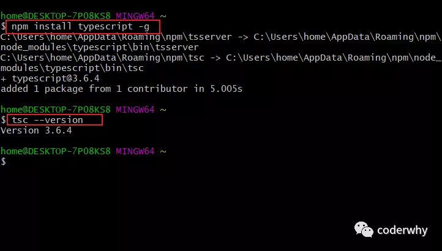

### 1.2. VSCode 环境搭建

学习或者使用 TypeScript 有很多编辑器可以供我们选择，目前前端开发比较常用的是两个：

- WebStorm：JetBrains 公司的产品，用法和 PHPStorm、PyCharm、IDEA 用法基本一致；
- VSCode：Microsoft 公司的产品，目前可以说已经成为最流行的前端工具，并且本身就是 TypeScript 编写的；

在之前的 Flutter 文章中我有对比过 VSCode 和 Android Studio 的优缺点，其实和 VSCode 和 WebStorm 的优缺点对比是相似的，这里不再详细对比。

而以后学习和使用 TypeScript，我都会优先选择 VSCode，所以这里我们主要介绍 VSCode 的环境搭建。

**1. 下载安装 VSCode**

- 下载地址：https://code.visualstudio.com/
- 下载后直接安装即可

**2. 安装对应的插件**

- VSCode 的另外一个强大的地方就是已经有很多好用的插件了；
- 我个人针对于前端安装过的插件有：open in browser、 Vetur 、 TSLint 、 Bracket Pair Colorizer 等；
- 这里我不再给出截图，因为我还针对 Python、Java、Flutter 装过很多的插件，会干扰大家；

### 1.3. tsc 简单代码测试

上面步骤完成后，我们就可以在 VSCode 中编写我们的 TypeScript 代码，并且通过一些方法来进行测试。

**1. 打开 VSCode，并且新建两个文件：index.ts**

index.ts 代码如下：

```typescript
// 定义一个变量
let message: string = "abc";
message = 123;

// 定义一个函数
function sum(num1: number, num2: number): number {
  return num1 + num2;
}

sum("abc", "cba");
```

我们会发现有两个地方都会报错：

错误一：不能将类型“123”分配给类型“string”

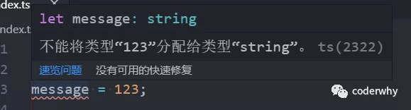

错误二：类型“"abc"”的参数不能赋给类型“number”的参数

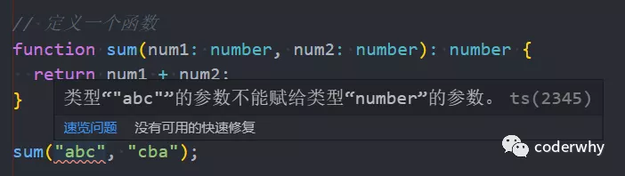

上面两个错误都是因为我们的代码已经增加了类型约束，不能随便赋值其他类型给我们的变量。

将代码修改正确如下：

```javascript
// 定义一个变量
let message: string = "abc";
message = "Hello World";

// 定义一个函数
function sum(num1: number, num2: number): number {
  return num1 + num2;
}

sum(20, 30);
```

**2. 将代码编译为 JavaScript 的代码**

因为我们说过，代码最终运行在浏览器上，而浏览器是不识别 TypeScript 代码的，我们需要对他们进行编译：

打开 VSCode 的终端，在其中输入如下命令来编译我们的 TypeScript：

```javascript
tsc index.ts
```

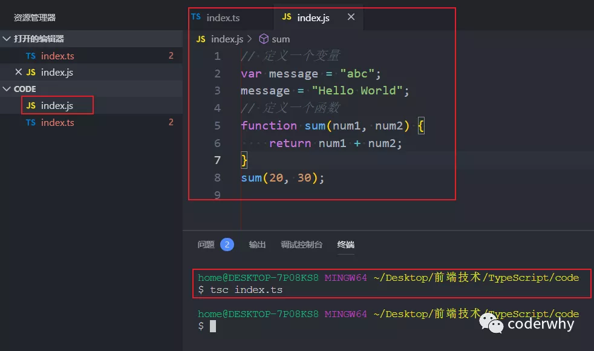

我们会发现，生成了一个 index.js 文件，并且其中的代码就是普通的 JavaScript 代码。

**3. JavaScript 代码的测试**

如果我们希望测试这段 JavaScript 代码就非常简单了，两种方式都可以：

- 方式一：使用 node 直接执行 JavaScript 代码；
- 方式二：创建一个 html 文件，在其中引入 index.js 文件，并且在浏览器中进行测试；

这里不再给出具体的步骤，大家可以自行去测试

**问题：每次都这样测试会不会太麻烦了呢？**

如果每次我们写完一个 TypeScript 代码都需要像上面的步骤一样，一点点去完成测试就会过于麻烦，我们可以怎么做呢？

- 直接配置 webpack，让 webpack 对我们编写的代码进行一个编译，并且自动引入编译后的 js 文件；
- 而且 webpack 可以在代码修改后重新帮助我们进行编译，并且自动刷新浏览器，不需要手动操作；

## **二. 项目环境**

### 2.1. 项目环境的基础配置

为了我们之后的学习和使用方便，我们来配置一个 webpack 的环境：

- 在环境中我们编写对应的 TypeScript 代码，让 webpack 自动帮助我们编译，并且在浏览器中查看结果

注意：这里可能需要大家对 npm 和 webpack 有一些简单的了解，不会非常复杂（如果完全不懂，按照我给出的步骤来做即可，后续自己进行一些知识的补充）

**1. 创建一个简单的项目目录结构**

新建一个新的目录：LearnTypeScript，并且创建如下的目录结构

```javascript
│ index.html
├─build
│   webpack.config.js
└─src
    main.ts
```

目录和文件夹结构分析:

- index.html 是跑在浏览器上的模块文件
- build 文件夹中用于存放 webpack 的配置信息
- src 用于存放我们之后编写的所有 TypeScript 代码

**2. 使用 npm 管理项目的依赖**

webpack 本身需要有很多的依赖，并且之后我们也需要启动 node 服务来快速浏览 index.html 模板以及编译后的 JavaScript 代码。

我们要使用 npm 来初始化 package.json 文件：

```javascript
npm init -y
```

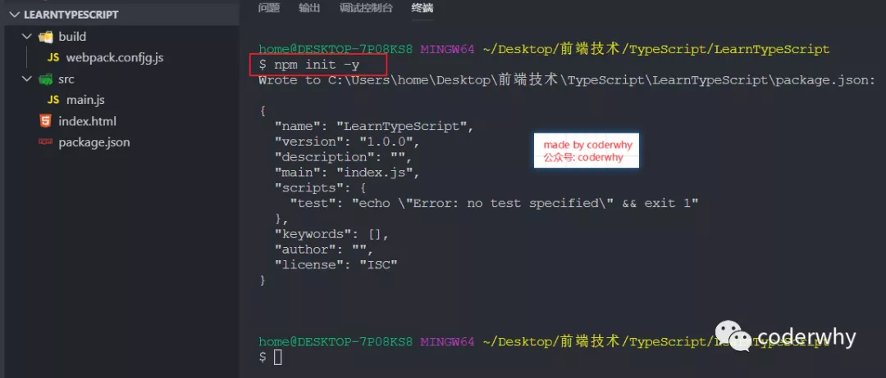

**3. 本地依赖 TypeScript**

为什么需要本地依赖 TypeScript：

- 因为我们之后是通过 webpack 进行编译我们的 TypeScript 代码的，并不是通过 tsc 来完成的。（tsc 使用的是全局安装的 TypeScript 依赖）
- 那么 webpack 会在本地去查找 TypeScript 的依赖，所以我们是需要本地依赖 TypeScript 的；

安装本地 TypeScript 依赖

```javascript
npm install typescript
```

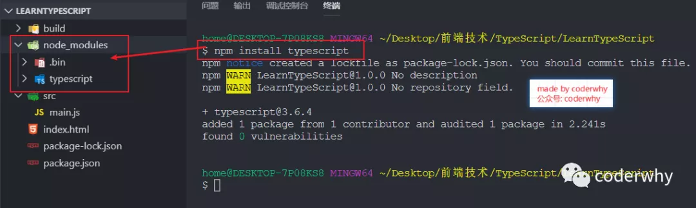

**4. 初始化 tsconfig.json 文件**

在进行 TypeScript 开发时，我们会针对 TypeScript 进行相关的配置，而这些配置信息是存放在一个 tsconfig.json 文件中的

我们并不需要手动去创建它，可以通过命令行直接来生成这样的一个文件：

```javascript
tsc --init
```

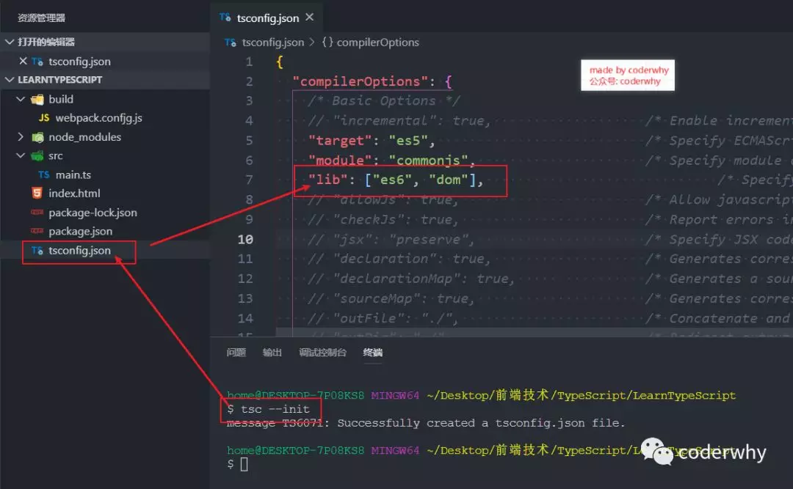

**5. 配置 tslint 来约束代码**

为了让大家按照严格的 TypeScript 风格学习代码，这里我希望大家可以加入 tslint

全局安装 tslint：

```
npm install tslint -g
```

在项目中初始化 tslint 的配置文件：tslint.json

```
tslint -i
```

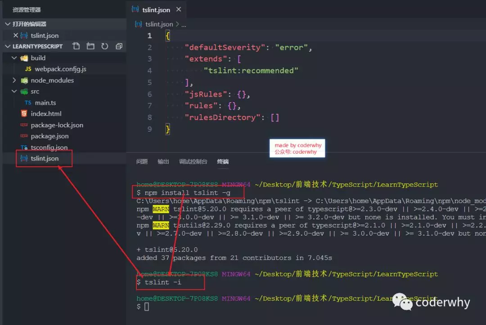

### 2.2. 项目环境的 Webpack

下面我们开始配置 webpack 相关的内容

**1. 安装 webpack 相关的依赖**

使用 webpack 开发和打开，需要依赖 webpack、webpack-cli、webpack-dev-server

```
npm install webpack webpack-cli webpack-dev-server -D
```

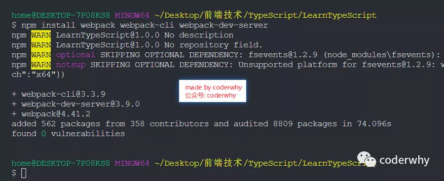

**2. 在 package.json 中添加启动命令**

为了方便启动 webpack，我们在 package.json 中添加如下启动命令

```javascript
"scripts": {
  "test": "echo \"Error: no test specified\" && exit 1",
  "serve": "cross-env NODE_ENV=development webpack-dev-server --mode=development --config build/webpack.config.js"
},
```

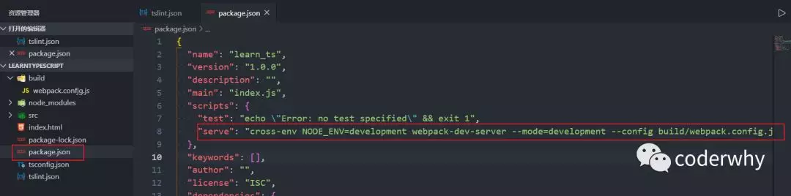

**3. 添加 webpack 的其他相关依赖**

依赖一：cross-env

这里我们用到一个插件 "cross-env" ，这个插件的作用是可以在 webpack.config.js 中通过 process.env.NODE_ENV 来获取当前是开发还是生产环境，我们需要这个插件：

```
npm install cross-env -D
```

依赖二：ts-loader

因为我们需要解析.ts 文件，所以需要依赖对应的 loader：ts-loader

```
npm install ts-loader -D
```

依赖三：html-webpack-plugin

编译后的代码需要对应的 html 模块作为它的运行环境，所以我们需要使用 html-webpack-plugin 来将它插入到对应的模板中：

```
npm install html-webpack-plugin -D
```

**4. 配置 webpack.config.js 文件**

将如下配置到 webpack.config.js 文件中：

- 这里不再给出详细的说明信息，webpack 后面我可能会再开一个专栏来讲解

```javascript
const HtmlWebpackPlugin = require("html-webpack-plugin");

module.exports = {
  entry: "./src/main.ts",
  output: {
    filename: "build.js",
  },
  resolve: {
    extensions: [".tsx", ".ts", ".js"],
  },
  module: {
    rules: [
      {
        test: /\.tsx?$/,
        use: "ts-loader",
        exclude: /node_modules/,
      },
    ],
  },
  devtool: process.env.NODE_ENV === "production" ? false : "inline-source-map",
  devServer: {
    contentBase: "./dist",
    stats: "errors-only",
    compress: false,
    host: "localhost",
    port: 8080,
  },
  plugins: [
    new HtmlWebpackPlugin({
      template: "./index.html",
    }),
  ],
};
```

### 2.3. 项目环境下代码测试

下面我们就可以愉快的在 main.ts 中编写代码，之后只需要启动服务即可：

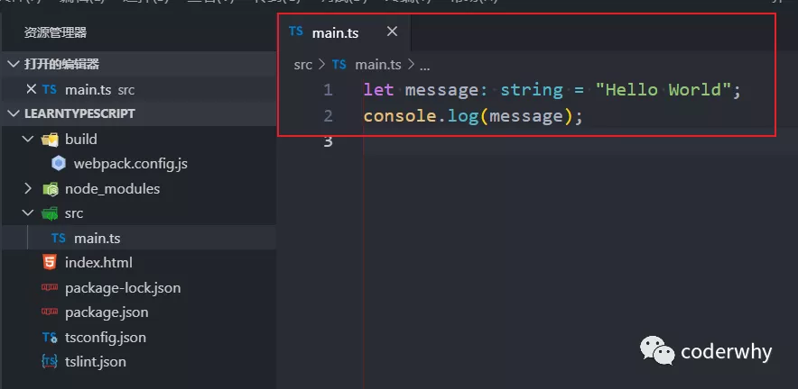

在终端中启动服务：

```
npm run serve
```

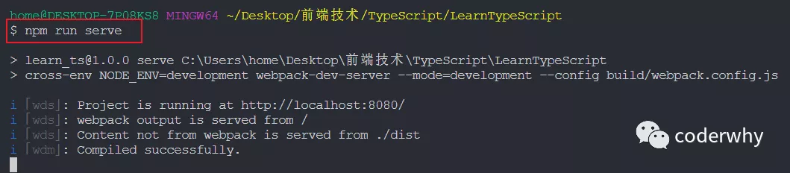

在浏览器中打开：`http://localhost:8080/`

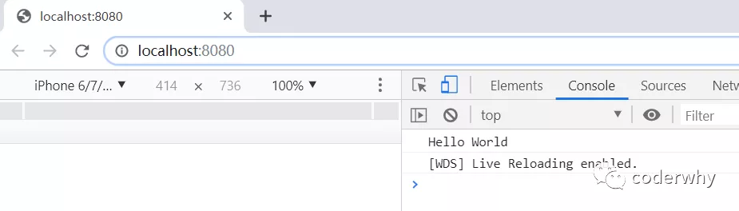

修改代码，直接可以看到修改后的效果：不需要手动进行任何刷新

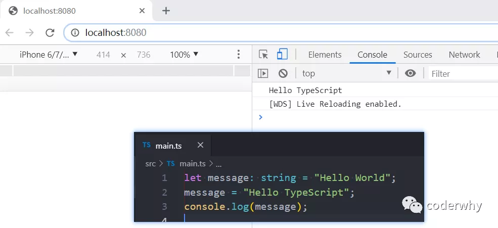
