# 变量和数据类型

## **一. 变量声明方式**

### 1.1. 声明变量的格式

我们已经强调过很多次，在 TypeScript 中定义变量需要指定 **标识符** 的类型。

所以完整的声明格式如下：

```typescript
var/let/const 标识符: 数据类型 = 赋值;
```

比如我们声明一个 message，完整的写法如下：

- 注意：这里的 string 是小写的，和 String 是有区别的
- string 是 TypeScript 中定义的字符串类型，String 是 ECMAScript 中定义的一个类

```javascript
let message: string = "Hello World";

message = "Hello TypeScript"; // 正确的做法
message = 20; // 错误的做法，因为message是一个string类型
```

### 1.2. 声明变量的关键字

在 TypeScript 定义变量（标识符）和 ES6 之后一致，可以使用 var、let、const 来定义：

```javascript
var myname: string = "abc";
let myage: number = 20;
const myheight: number = 1.88;
```

但是，我们会发现使用 var 关键字会有一个警告：

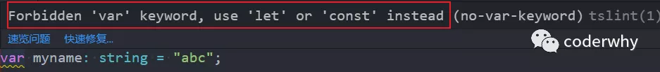

可见，在 TypeScript 中并**不建议再使用 var 关键字**了，主要原因和 ES6 升级后 let 和 var 的区别是一样的，var 是没有块级作用域的，会引起很多的问题，这里不再展开探讨。

所以，在之后的开发中，我们定义变量主要使用 `let` 和 `const`

### 1.3. 变量的类型推断

在开发中，有时候为了方便起见我们并不会在声明每一个变量时都写上对应的数据类型，我们更希望可以通过 TypeScript 本身的特性帮助我们推断出对应的变量类型：

```javascript
let message = "Hello World";
```

上面的代码我们并没有指定类型，但是 message 实际上依然是一个字符串类型：


这是因为在一个变量第一次赋值时，会根据后面的赋值内容的类型，来**推断**出变量的类型：

- 上面的 message 就是因为后面赋值的是一个 string 类型，所以 message 虽然没有明确的说明，但是依然是一个 string 类型

```javascript
let message = "Hello World"; // string类型
let age = 20; // number类型
let isFlag = true; // boolean类型
```

### 1.4. 声明 name 报错

我们在 TypeScript 的文件中声明一个 name（很多其他的名字也会）时，会报错：

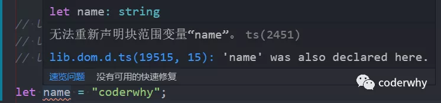

主要错误信息：

```
无法重新声明块范围变量“name”
```

我们前面明明（明明说管我什么事）没有声明 name，但是却说我们重复声明了

- 这次是因为我们的`typescript` 将 `DOM typings` 作为全局的运行环境；
- 所以当我们声明 `name`时， 与 `DOM` 中的全局 `name` 属性出现了重名；

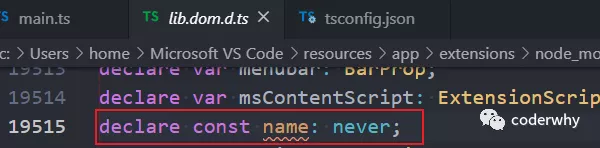

如何解决这个问题呢？

- 有两种方案：去掉 DOM typings 的环境和声明模块

**方式一：删除 DOM typings 的环境**

但是这种办法对于我们来说并不合适，因为我们依然希望在 DOM 下编译我们的 TypeScript 代码

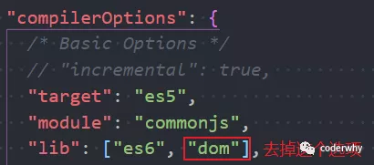

**方式二：声明我们的 ts 文件为一个模块**

既然与全局的变量出现重名，那我们将脚本封装到模块（module）中，因为模块有属于自己的作用域，就不会和全局的产生冲突：

- 在 Typescript 中，我们可以使用 ES6 的 export 来导出一个对象，并且该文件被视为 module

```javascript
let name = "coderwhy";

export {};
```

### 1.5. console.log 报错

另外为了测试方便我们经常使用 console.log 来进行测试，但是使用时会报一个警告：

`console.log`警告

这个时候，我们可以配置

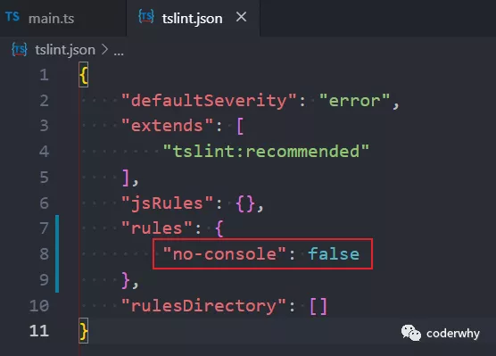

```javascript
"no-console": false
```

## **二. JavaScript 数据类型**

### 2.1. number 类型

数字类型是我们开发中经常使用的类型，TypeScript 和 JavaScript 一样，不区分整数类型（int）和浮点型（double），统一为 number 类型。

```javascript
// 1.数字类型基本定义
let num: number = 123;
num = 222;
num = 6.66;
```

如果你学习过 ES6 应该知道，ES6 新增了二进制和八进制的表示方法，而 TypeScript 也是支持二进制、八进制、十六进制的表示：

```javascript
// 2.其他进制表示
let num1: number = 100; // 十进制
let num2: number = 0b100; // 二进制
let num3: number = 0o100; // 八进制
let num4: number = 0x100; // 十六进制
```

### 2.2. boolean 类型

boolean 类型只有两个取值：true 和 false，非常简单

```javascript
// boolean类型的表示
let flag: boolean = true;
flag = false;
flag = 20 > 30; //返回一个结果(true或者false)
```

### 2.3. string 类型

string 类型是字符串类型，可以使用单引号或者双引号表示：

- 注意：如果打开了 TSLint，默认情况下推荐使用使用**双引号**

```javascript
let message1: string = "hello world";
let message2: string = "Hello World";

// 个人习惯: 默认情况下, 如果可以 推导 出对应的 标识符的类型 时, 一般情况下是不加标识符类型的.
const name = "why";
const age = 18;
const height = 1.88;

let message3 = `name:${name} age:${age} height:${height}`;
console.log(message3);

export {};
```

同时也支持 ES6 的模板字符串来拼接变量和字符串：

```javascript
const name = "why";
const age = 18;
const height = 1.88;

let message3 = `name:${name} age:${age} height:${height}`;
console.log(message3);
```

### 2.4. array 类型

数组类型的定义也非常简单，有两种方式：

- 但是 TSLint 会推荐我们使用上面这种方式

```javascript
// 确定一个事实: names是一个数组类型, 但是数组中存放的是什么类型的元素呢?
// 好的习惯: 一个数组中在TypeScript开发中, 最好存放的数据类型是固定的(string)
// 类型注解: type annotation
const names1: Array<string> = []; // 不推荐(react jsx中是有冲突   <div></div>)
const names2: string[] = []; // 推荐写法

// 在数组中存放不同的类型是不好的习惯
// names.push("abc")
// names.push(123)
```

### 2.5. object 类型

object 对象类型可以用于描述一个对象：

```javascript
// object类型表示
const myinfo: object = {
  name: "why",
  age: 20,
  height: 1.88,
};
```

但是上面的代码会报一个警告：

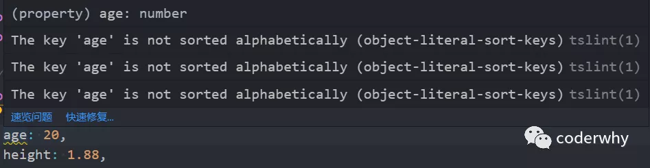

这是因为 TSLint 建议我们所有的 key 按照字母进行排序，但是这个并不是特别有必要，我们还是可以关闭掉：

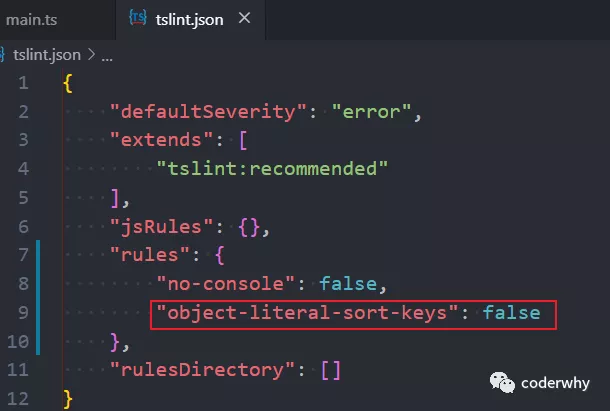

```javascript
"object-literal-sort-keys": false
```

**属性是不可以访问的**

如果我们访问 myinfo 中的属性，会发现报错：

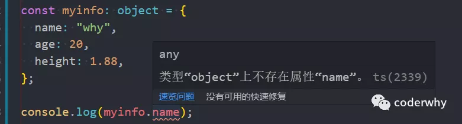

这是因为 TypeScript 并不知道某一个 object 类型上面就有一个 name 的属性。

但是如果我们让它是类型推断的，就可以正常的访问：

- 这是因为推导出来的类型，是如下的类型

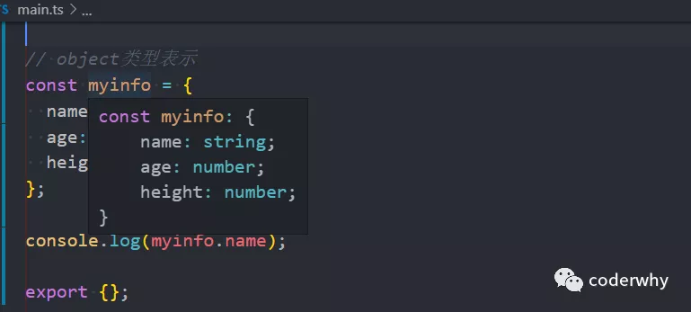

还有一种方法是定义后面会学到的接口，TypeScript 一个非常好用的特性就是接口 interface，后续我们会进行非常详细的学习

### 2.6. symbol 类型

在 ES5 中，如果我们是 不可以 在对象中添加相同的属性名称的，比如下面的做法：

```javascript
const person = {
  identity: "程序员",
  identity: "老师",
};
```

通常我们的做法是定义两个不同的属性名字：比如 identity1 和 identity2。

但是我们也可以通过 symbol 来定义相同的名称，因为 Symbol 函数返回的是不同的值：

```javascript
const title1 = Symbol("title");
const title2 = Symbol("title");

const info = {
  [title1]: "程序员",
  [title2]: "老师",
};
console.log(info[title1]); //程序员
console.log(info[title2]); //老师

export {};
```

这是 Symbol 的一个用法，更多其他用法大家可以自行学习，或者等到后续确实需要用到时，我们再详细讲解。

### 2.7. null 和 undefined

在 JavaScript 中，undefined 和 null 是两个基本数据类型。

`null` 和 `undefined` 都有各自的类型名称。这些类型本身没有用处，因为我们只能将 `null` 和 `undefined` 赋值给定义为 `null` 或 `undefined` 类型的变量。

在 TypeScript 中，它们各自的类型也是 undefined 和 null，也就意味着它们既是实际的值，也是自己的类型：

```javascript
let u: undefined = undefined;
u = "string"; // compile error

let n: null = null;
n = 43; //compile error
```

默认情况下，`null` 和 `undefined` 是所有类型的**子类型**。 就是说可以把 `null` 和 `undefined` 赋值给 `number` 类型的变量。

```ts
let value: string | undefined | null = null;
value = "hello";
value = undefined;
```

## 三. TypeScript 数据类型

> TypeScript 在原有的 JavaScript 基础上引入了很多好用的类型：enum 枚举类型、tuple 元组类型、any 类型、void 类型、never 类型、unknown 类型 等。

### 3.1. enum 类型

枚举类型是为数不多的 TypeScript 特性有的特性之一：

- 枚举其实就是将一组可能出现的值，一个个列举出来，定义在一个类型中，这个类型就是枚举类型；
- 枚举允许开发者定义一组命名常量，常量可以是数字、字符串类型；

```ts
// type Direction = "left" | "Right" | "Top" | "Bottom" //以前可以通过联合类型定义一组值

enum Direction {
  LEFT,
  RIGHT,
  TOP = 100,
  BOTTOM,
}

function turnDirection(direction: Direction) {
  console.log(direction); //在这里打印的left 0, right 1, top 100, bottom 101
  switch (direction) {
    case Direction.LEFT:
      console.log("改变角色的方向向左");
      break;
    case Direction.RIGHT:
      console.log("改变角色的方向向右");
      break;
    case Direction.TOP:
      console.log("改变角色的方向向上");
      break;
    case Direction.BOTTOM:
      console.log("改变角色的方向向下");
      break;
    default:
      const foo: never = direction;
      break;
  }
}

turnDirection(Direction.LEFT);
turnDirection(Direction.RIGHT);
turnDirection(Direction.TOP);
turnDirection(Direction.BOTTOM);
```

enum 还可以对每一个值进行赋值

```ts
// type Direction = "left" | "Right" | "Top" | "Bottom"

enum Direction {
  LEFT = "LEFT",
  RIGHT = "RIGHT",
  TOP = "TOP",
  BOTTOM = "BOTTOM",
}

//Direction 可以打印类型
let d: Direction = Direction.BOTTOM;
console.log(d); //BOTTOM

function turnDirection(direction: Direction) {
  console.log(direction);
  switch (direction) {
    case Direction.LEFT:
      console.log("改变角色的方向向左");
      break;
    case Direction.RIGHT:
      console.log("改变角色的方向向右");
      break;
    case Direction.TOP:
      console.log("改变角色的方向向上");
      break;
    case Direction.BOTTOM:
      console.log("改变角色的方向向下");
      break;
    default:
      const foo: never = direction;
      break;
  }
}

turnDirection(Direction.LEFT);
turnDirection(Direction.RIGHT);
turnDirection(Direction.TOP);
turnDirection(Direction.BOTTOM);

export {};
```

### 3.2. tuple 类型

`tuple元组:` 多种元素类型的组合,比如说: `"why"` ,`18` , `1.88` 等

```ts
// 1.数组的弊端: 没有办法确定拿到的元素是一个什么样的类型
const info: any[] = ["why", 18, 1.88];
const infoObj = {
  name: "why",
  age: 18,
  height: 1.88,
};

const name = info[0];
console.log(name.length); //当前这里的name是any类型

// 2.元组的特点: 元组必须赋初始值
const info: [string, number, number] = ["why", 18, 1.88];
const name = info[0];
console.log(name.length);
const age = info[1];
console.log(age.length); //编译错误

export {};
```

**应用场景:**

```ts
// hook: useState 的封装

function useState<T>(state: T) {
  let currentState = state;
  const changeState = (newState: T) => {
    currentState = newState;
  };

  const tuple: [T, (newState: T) => void] = [currentState, changeState];
  return tuple;
}

const [counter, setCounter] = useState(10);
setCounter(1000);
const [title, setTitle] = useState("abc");
const [flag, setFlag] = useState(true);
```

### 3.3. any 类型

在某些情况下，我们确实无法确定一个变量的类型，并且可能它会发生一些变化，这个时候我们可以使用 any 类型（类似于 Dart 语言中的 dynamic 类型）

```javascript
// 当进行一些类型断言 as any
// 在不想给某些JavaScript添加具体的数据类型时(原生的JavaScript代码是一样)
let message: any = "Hello World";

//我们可以给一个any类型的变量赋值任何的值，比如数字、字符串的值；
message = 123;
message = true;
message = {};

//我们可以对any类型的变量进行任何的操作，包括获取不存在的属性、方法,也是可以通过编译阶段的.
// message()
// message.split(" ")

console.log(message);
const arr: any[] = [];
```

### 3.4. void 类型

void 类型通常用于**函数没有返回值时**来使用：

- 首先我们需要说明的是，在 TypeScript 中函数也是有类型的

下面的函数，虽然我们没有指定它的类型，但是它会通过类型推导出来：

```typescript
const sum = (num1: number, num2: number) => {
  return num1 + num2;
};

// 相当于下面的写法 (num1: number, num2: number) =>number  函数类型
const sum: (num1: number, num2: number) => number = (
  num1: number,
  num2: number
) => {
  return num1 + num2;
};
```

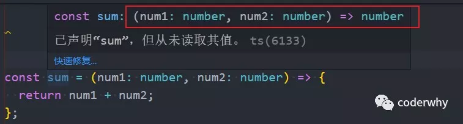

如果一个函数没有返回值，那么它的返回值类型就是 void

- 我们可以将`null`和`undefined`赋值给`void`类型，也就是函数可以返回 null 或者 undefined

```javascript
const sayHello: (name: string) => void = (name: string) => {
  console.log("hello " + name);
};
```

### 3.5. never 类型

never 类型表示**一种从来不会存在的值**的类型，有点绕，我们来这样理解：

- 如果一个函数中是一个死循环，那么这个函数会返回东西吗？不会，那么写 void 类型或者其他类型作为返回值类型都不合适，我们就可以使用 never 类型。
- 如果一个函数是抛出一个异常，那么这个函数是不是也没有返回值呢？这个时候我们也可以使用 never 类型。

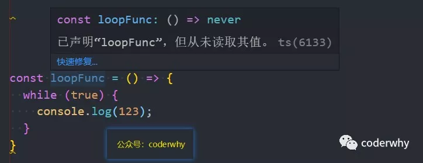

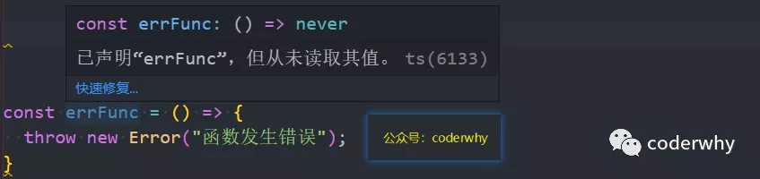

**具体的使用场景:**

```tsx
// 封装一个核心函数
function handleMessage(message: string | number | boolean) {
  switch (typeof message) {
    case "string":
      console.log("string处理方式处理message");
      break;
    case "number":
      console.log("number处理方式处理message");
      break;
    case "boolean":
      console.log("boolean处理方式处理message");
      break;
    default:
      const check: never = message;
  }
}

handleMessage("abc");
handleMessage(123);

//注意
handleMessage(true);
```

这段代码的意思是: 如果用户直接传入 boolean 值而程序有没有对 Boolean 值做处理,那么就会来到 default 进行赋值会报错,因为 check 是 never 类型,所有 message 可能是 Boolean 类型就不可以进行赋值。

### 3.6. unknown 类型

**1.**任何类型都可以赋值给 `unknown` 类型：

```tsx
let value: unknown;
value = 123;
value = "abc";
value = false;
```

如果没有==类型断言==或基于控制流的==类型细化==, 那么不能将 unknown 类型赋值给其它类型。

```tsx
// 错误实例
let value1: unknown = 123;
let value2: number;
value2 = value1;
```

应该使用类型断言

```tsx
//正确实例
//类型断言
let value1: unknown = 123;
let value2: number;
value2 = value1 as number;

//或者类型细化
let value1: unknown = 123;
let value2: number;
if (typeof value1 === "number") {
  value2 = value1;
}
```

**2.**如果没有类型断言或基于控制流的类型细化, 那么不能在 unknown 类型上进行任何操作。

```tsx
//错误实例
let value1: unknown = 123;
value1++;
```

```tsx
//正确实例
let value1: unknown = 123;
(value1 as number)++;

//或者
let value1: unknown = 123;
if (typeof value1 === "number") {
  value1++;
}
```

**3.**只能对 unknown 类型进行 `相等` 或 `不等` 操作, 不能进行其它操作(因为其他操作没有意义)。

```tsx
//正确实例
let value1: unknown = 123;
let value2: unknown = 123;
console.log(value1 === value2); //true
console.log(value1 !== value2); //false
```

不能进行其它操作(因为其他操作没有意义), 虽然没有报错, 但是不推荐, 如果想报错提示, 可以打开严格模式(`"strict": true`)：

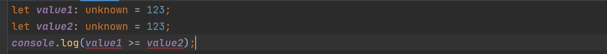

**4.**unknown 与其它任何类型组成的**交叉类型**最后都是其它类型：

```tsx
type MyType1 = number & unknown; //number类型

type MyType2 = unknown & string; //string类型
```

**5.**unknown 除了与 any 以外, 与其它任何类型组成的**联合类型**最后都是 `unknown` 类型：

```tsx
type MyType1 = unknown | any; //any类型

type MyType2 = unknown | number; //unknown类型

type MyType3 = unknown | string | boolean; //unknown类型
```

**6.**never 类型是 unknown 类型的子类型：

```tsx
type MyType = never extends unknown ? true : false; //true
```

**7.**`keyof unknown` 等于 never：

```tsx
type MyType = keyof unknown; //never类型
```

**8.**unknown 类型的值不能访问创建实例的属性, 方法：

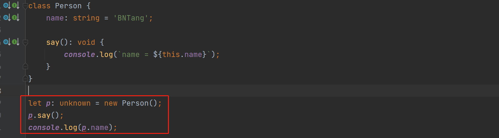

```tsx
class Person {
  name: string = "BNTang";

  say(): void {
    console.log(`name = ${this.name}`);
  }
}

let p: unknown = new Person();
p.say();
console.log(p.name);
```

## 四. TypeScript 类型补充

### **4.1. **函数的参数和返回值类型

给参数加上类型注解: num1: number, num2: number
给返回值加上类型注释: (): number
在开发中,通常情况下可以不写返回值的类型(自动推导)

```tsx
// 给参数加上类型注解: num1: number, num2: number
// 给返回值加上类型注解: function sum(num1: number, num2: number): number
// 在开发中,通常情况下可以不写 返回值的类型 (自动推导)

function sum(num1: number, num2: number) {
  return num1 + num2;
}

sum(123, 321);
```

### **4.2. **匿名函数的参数类型

```tsx
// 通常情况下, 在定义一个函数时, 都会给参数加上类型注解的
function foo(message: string) {}

const names = ["abc", "cba", "nba"];
// item根据上下文的环境推导出来的, 这个时候可以不添加的类型注解
// 上下文中的函数: 可以不添加类型注解

//这里的item可以自动推导出类型,所以可以不用加类型注解
names.forEach(function (item) {
  console.log(item.split(""));
});

export {};
```

### **4.3. **对象类型

```tsx
// Point: x/y -> 对象类型
// {x: number, y: number}
function printPoint(point: { x: number; y: number }) {
  console.log(point.x);
  console.log(point.y);
}

printPoint({ x: 123, y: 321 });

export {};
```

### 4.4. 可选类型

```tsx
// Point: x/y/z -> 对象类型
// {x: number, y: number, z?: number}
function printPoint(point: { x: number; y: number; z?: number }) {
  console.log(point.x);
  console.log(point.y);
  console.log(point.z);
}

printPoint({ x: 123, y: 321 });
printPoint({ x: 123, y: 321, z: 111 });

export {};

/*输出:
  123
  321
  undefined
  123
  321
  111
*/
```

### **4.5. **联合类型

TypeScript 的类型系统允许我们使用多种运算符，从现有类型中构建新类型。

我们来使用第一种组合类型的方法：联合类型（Union Type）

- 联合类型是由两个或者多个其他类型组成的类型；
- 表示可以是这些类型中的任何一个值；
- 联合类型中的每一个类型被称之为联合成员（union's members）；

```tsx
// number|string 联合类型
function printID(id: number | string | boolean) {
  // 使用联合类型的值时, 需要特别的小心
  // narrow: 缩小
  if (typeof id === "string") {
    // TypeScript帮助确定id一定是string类型
    console.log(id.toUpperCase());
  } else {
    console.log(id);
  }
}

printID(123);
printID("abc");
printID(true);
```

### **4.6. **可选类型与联合类型的关系

```tsx
// 让一个参数本身是可选的
// 一个参数一个可选类型的时候, 它其实类似于是这个参数是 类型|undefined 的联合类型

function foo(message?: string) {
  console.log(message);
}

foo(); //这里可以不传值,也可以传undefined

//与下面这种方式等价
// function foo(message: string | undefined) {
//   console.log(message);
// }

// foo(undefined);
```

### **4.7. **类型别名

```tsx
// type用于定义类型别名(type alias)
type IDType = string | number | boolean;
type PointType = {
  x: number;
  y: number;
  z?: number;
};

function printId(id: IDType) {}

function printPoint(point: PointType) {}
```

### **4.8. **类型断言

有时候 TypeScript 无法获取具体的类型信息，这个我们需要使用类型断言（Type Assertions）。

- 比如我们通过 `document.getElementByld`，TypeScript 只知道该函数会返回 HTMLElement，但并不知道它具体的类型：

```tsx
// 

// 1.类型断言 as
const el = document.getElementById("why") as HTMLImageElement;
el.src = "url地址";

// 2.另外案例: Person是Student的父类
class Person {}

class Student extends Person {
  studying() {}
}

function sayHello(p: Person) {
  (p as Student).studying(); //这里做了类型断言
}

const stu = new Student();
sayHello(stu);

// 3.熟悉: as any/unknown
const message = "Hello World";
const num: number = message as unknown as number;

export {};
```

### **4.9. **非空类型断言

非空类型断言: message 后面的这一个 `!` 代表 message 不能是一个空的值

```tsx
// message? -> undefined | string
function printMessageLength(message?: string) {
  // if (message) {
  //   console.log(message.length)
  // }
  // 非空类型断言
  console.log(message!.length);
}

printMessageLength("aaaa");
printMessageLength("hello world");
```

### 4.10. 可选链的使用

可选链事实上并不是 TypeScript 独有的特性，它是 ES11（ES2020）中增加的特性：

- 可选链使用可选链操作符`?.`；
- 它的作用是当对象的属性不存在时，会短路，直接返回 undefined，如果存在，那么才会继续执行；
- 虽然可选链操作是 ECMAScript 提出的特性，但是和 TypeScript 一起使用最新版本；

```tsx
//定义的数据类型
type Person = {
  name: string;
  friend?: {
    name: string;
    age?: number;
    girlFriend?: {
      //可选类型
      name: string;
    };
  };
};

const info: Person = {
  name: "why",
  friend: {
    name: "kobe",
    girlFriend: {
      name: "lily",
    },
  },
};

//测试用例
// console.log(info.friend!.name) //直接断定friend有name属性值
console.log(info.name);
console.log(info.friend?.name); //name是可选属性,可能有值也可能没有值
console.log(info.friend?.age); //age是可选属性,可能有值也可能没有值
console.log(info.friend?.girlFriend?.name); //friend与girlFriend都是可选类型

//等价的写法
// if (info.friend) {
//   console.log(info.friend.name)

//   if (info.friend.age) {
//     console.log(info.friend.age)
//   }
// }
```

### 4.11. js 新增运算符

`!!`操作符。

- 将一个其他类型转换成 boolean 类型
- 类似于 Boolean（变量）的方式

```ts
const message = "Hello World";

const flag = !!message; //!代表取反,本质是js的基础语法,获取当前元素的布尔值类型
console.log(flag);

//等价的写法
// const flag = Boolean(message)
// console.log(flag)
```

`??` 操作符 (空值合并操作符) 。

- 它是 ES11 增加的新特性；
- 空值合并操作符（??）是一个逻辑操作符，当操作符的左侧是 null 或者 undefined 时，返回其右侧操作数，否则返回左侧操作数；

```tsx
let message: string | null = "Hello World";

const content = message ?? "你好啊, 李银河";

//等价的写法(三目运算符)
// const content = message ? message: "你好啊, 李银河"
//逻辑或的写法
//const content = message || "你好啊, 李银河";

console.log(content);

export {};
```

### 4.12. 字面量类型

```tsx
// "Hello World"也是可以作为类型的, 叫做字面量类型,必须和他的值保持一致
const message: "Hello World" = "Hello World";

// let num: 123 = 123
// num = 321 //不可以赋其他值,只可以赋值123

// 字面量类型的意义, 就是必须结合联合类型(有点像枚举类型)
type Alignment = "left" | "right" | "center";

let align: Alignment = "left";
align = "right";
align = "center";

// align = 'hehehehe' //编译错误
export {};
```

### 4.13. 字面量推理

```tsx
type Method = "GET" | "POST";

function request(url: string, method: Method) {
  console.log(url, method);
}
const options = {
  url: "https://www.coderwhy.org/abc",
  method: "POST",
};
//这个地方options推导出来的method类型是string,所以会出来string类型不可以赋值Method类型

//调用的时候 报错(Argument of type 'string' is not assignable to parameter of type 'Method'.)
request(options.url, options.method);
```

解决方案(使用 type 声明类型):

```ts
type Method = "GET" | "POST";

function request(url: string, method: Method) {
  console.log(url, method);
}
//在这里声明一下对象的类型
type Request = {
  url: string;
  method: Method;
};
const options: Request = {
  url: "https://www.coderwhy.org/abc",
  method: "POST",
};

request(options.url, options.method);
```

解决方案(使用类型断言):

```ts
type Method = "GET" | "POST";

function request(url: string, method: Method) {
  console.log(url, method);
}

const options = {
  url: "https://www.coderwhy.org/abc",
  method: "POST",
};

request(options.url, options.method as Method);
```

解决方案(使用字面量类型):

```ts
type Method = "GET" | "POST";

function request(url: string, method: Method) {
  console.log(url, method);
}

const options = {
  url: "https://www.coderwhy.org/abc",
  method: "POST",
} as const;
//这里的options里面的url和method就变成了字面量类型

request(options.url, options.method);
```

### 4.14. 类型缩小

什么是类型缩小?

- 类型缩小的英文是 Type Narrowing；
- 我们可以通过类似于 typeof padding ==="number"的判断语句，来改变 TypeScript 的执行路径；
- 在给定的执行路径中，我们可以缩小比声明时更小的类型，这个过程称之为缩小；
- 而我们编写的 typeof padding ==="number" 可以称之为 类型保护（type guards）；

常见的类型保护有如下几种:

- typeof
- 平等缩小（比如=\==、!==)
- instanceof
- in
- 等等…

  1.在 TypeScript 中，检查返回的值 typeof 是一种类型保护：因为 TypeScript 对如何 typeof 操作不同的值进行编码。

```tsx
// 1.typeof的类型缩小
type IDType = number | string;
function printID(id: IDType) {
  if (typeof id === "string") {
    console.log(id.toUpperCase());
  } else {
    console.log(id);
  }
}
```

2.平等的类型缩小(`===` `==` `!==` `!=` `switch`)

```ts
// 2.平等的类型缩小(=== == !== !=/switch)
type Direction = "left" | "right" | "top" | "bottom";
function printDirection(direction: Direction) {
  // 1.if判断
  // if (direction === 'left') {
  //   console.log(direction)
  // } else if (...){}
  // 2.switch判断
  // switch (direction) {
  //   case 'left':
  //     console.log(direction)
  //     break;
  //   case ...
  // }
}
```

3.`instanceof`类型缩小

```ts
// 3.instanceof
function printTime(time: string | Date) {
  if (time instanceof Date) {
    console.log(time.toUTCString());
  } else {
    console.log(time);
  }
}
```

4.`in`操作符类型缩小

```ts
// 4. in
type Fish = {
  swimming: () => void;
};

type Dog = {
  running: () => void;
};

function walk(animal: Fish | Dog) {
  if ("swimming" in animal) {
    animal.swimming();
  } else {
    animal.running();
  }
}

const fish: Fish = {
  swimming() {
    console.log("swimming");
  },
};

walk(fish);
```

## 五. TypeScript 函数类型

在 JavaScript 开发中，函数是重要的组成部分，并且函数可以作为一等公民（可以作为参数，也可以作为返回值进行传递）。

### 5.1. 函数基本类型

```tsx
// 1.函数作为参数时, 在参数中如何编写类型
function foo() {}

type FooFnType = () => void;

function bar(fn: FooFnType) {
  fn();
}

bar(foo);

// 2.定义常量时, 编写函数的类型
type AddFnType = (num1: number, num2: number) => number;

const add: AddFnType = (a1: number, a2: number) => {
  return a1 + a2;
};
```

**函数类型的案例**

```tsx
function calc(
  n1: number,
  n2: number,
  fn: (num1: number, num2: number) => number
) {
  return fn(n1, n2);
}

const result1 = calc(20, 30, function (a1, a2) {
  return a1 + a2;
});
console.log(result1);

const result2 = calc(20, 30, function (a1, a2) {
  return a1 * a2;
});
console.log(result2);
```

### 5.2. 函数的可选类型

可选类型是必须写在必选类型的后面的

```tsx
// y 可选参数 -> undefined | number
function foo(x: number, y?: number) {}

foo(20, 30);
foo(20);

export {};
```

### 5.3. 参数的默认值

有默认值的参数 ==> 可选参数

```tsx
// y是必传参数 x是可选参数
function foo(y: number, x: number = 20) {
  console.log(x, y);
}

foo(30);
export {};
```

### 5.4. 函数的剩余参数

```tsx
//...nums 数字数组
function sum(initalNum: number, ...nums: number[]) {
  let total = initalNum;
  for (const num of nums) {
    total += num;
  }
  return total;
}

//数字求和函数
console.log(sum(20));
console.log(sum(20, 30));
console.log(sum(20, 30, 40));
console.log(sum(20, 30, 40, 50));
```

### 5.5. this 的默认推导

```tsx
// this是可以被推导出来 info对象(TypeScript推导出来)
const info = {
  name: "why",
  eating() {
    console.log(this.name + " eating");
  },
};

info.eating();

export {};
```

### 5.6. this 的不明确类型

```ts
type ThisType = { name: string };

function eating(this: ThisType, message: string) {
  console.log(this.name + " eating", message);
}

const info = {
  name: "why",
  eating: eating,
};

// 隐式绑定
info.eating("哈哈哈");

// 显示绑定
eating.call({ name: "kobe" }, "呵呵呵");
eating.apply({ name: "james" }, ["嘿嘿嘿"]);

export {};
```

### 5.7. 函数重载

**1.通过联合类型实现函数重载**

```ts
/**
 * 通过联合类型有两个缺点:
 *  1.进行很多的逻辑判断(类型缩小)
 *  2.返回值的类型依然是不能确定
 */
function add(a1: number | string, a2: number | string) {
  if (typeof a1 === "number" && typeof a2 === "number") {
    return a1 + a2;
  } else if (typeof a1 === "string" && typeof a2 === "string") {
    return a1 + a2;
  }

  // return a1 + a2;
}

add(10, 20);
```

**2.通过函数重载来实现**

```ts
// 函数的重载: 函数的名称相同, 但是参数不同的几个函数, 就是函数的重载
function add(num1: number, num2: number): number; // 没函数体
function add(num1: string, num2: string): string;

function add(num1: any, num2: any): any {
  //在实现函数里面做类型缩小
  if (typeof num1 === "string" && typeof num2 === "string") {
    return num1.length + num2.length;
  }
  return num1 + num2;
}

const result = add(20, 30);
const result2 = add("abc", "cba");
console.log(result);
console.log(result2);

// 在函数的重载中, 实现函数是不能直接被调用的
// add({name: "why"}, {age: 18}) //这里直接编译错误

export {};
```

我们现在有一个需求：定义一个函数，可以传入字符串或者数组，获取它们的长度。

这里有两种实现方案：

- 方案一：使用联合类型来实现；
- 方案二：实现函数重载来实现；

```ts
// 实现方式一: 联合类型
function getLength(args: string | any[]) {
  return args.length;
}

console.log(getLength("abc"));
console.log(getLength([123, 321, 123]));
```

```ts
// 实现方式二: 函数的重载
function getLength(args: string): number;
function getLength(args: any[]): number;

function getLength(args: any): number {
  return args.length;
}

console.log(getLength("abc"));
console.log(getLength([123, 321, 123]));
```

## 六. TypeScript 函数类型

在早期的 JavaScript 开发中（ES5）我们需要通过函数和原型链来实现类和继承，从 ES6 开始，引入了 class 关键字，可以更加方便的定义和使用类。

TypeScript 作为 JavaScript 的超集，也是支持使用 class 关键字的，并且还可以对类的**属性和方法**等进行静态类型检测。

实际上在 JavaScript 的开发过程中，我们更加习惯于函数式编程：

- 比如 React 开发中，目前更多使用的函数组件以及结合 Hook 的开发模式；
- 比如在 Vue3 开发中，目前也更加推崇使用 Composition API；

但是在封装某些业务的时候，类具有更强大封装性，所以我们也需要掌握它们。

类的定义我们通常会使用 class 关键字：

- 在面向对象的世界里，任何事物都可以使用类的结构来描述；
- 类中包含特有的属性和方法；

### 6.1. 类的定义

最基本的类的定义方式

```ts
class Person {
  name: string; //属性
  age: number;
  //构造函数
  constructor(name: string, age: number) {
    this.name = name;
    this.age = age;
  }
  //方法
  eating() {
    console.log(this.name + " eating");
  }
}

const p = new Person("why", 18);
console.log(p.name);
console.log(p.age);
p.eating();

export {};
```

### 6.2. 类的继承

面向对象的其中一大特性就是继承，继承不仅仅可以减少我们的代码量，也是多态的使用前提。
我们使用`extends`关键字来实现继承，子类中使用`super`来访问父类。
我们来看一下 Student 类继承自 Person：

- Student 类可以有自己的属性和方法，并且会继承 Person 的属性和方法；
- 在构造函数中，我们可以通过`super`来调用父类的构造方法，对父类中的属性进行初始化；

```ts
class Person {
  name: string = "";
  age: number = 0;

  eating() {
    console.log("eating");
  }
}

class Student extends Person {
  sno: number = 0;

  studying() {
    console.log("studying");
  }
}

class Teacher extends Person {
  title: string = "";

  teaching() {
    console.log("teaching");
  }
}

const stu = new Student();
stu.name = "coderwhy";
stu.age = 10;
console.log(stu.name);
console.log(stu.age);
stu.eating();
```

类的继承(调用父类构造函数)

```ts
class Person {
  name: string;
  age: number;

  constructor(name: string, age: number) {
    this.name = name;
    this.age = age;
  }

  eating() {
    console.log("eating 100行");
  }
}

//学生继承人类
class Student extends Person {
  sno: number;

  constructor(name: string, age: number, sno: number) {
    // super调用父类的构造器
    super(name, age);
    this.sno = sno;
  }

  eating() {
    console.log("student eating");
    //调用父类中的eating方法
    super.eating();
  }

  studying() {
    console.log("student studying");
  }
}

const stu = new Student("why", 18, 111);
console.log(stu.name);
console.log(stu.age);
console.log(stu.sno);

stu.eating();

export {};
```

### 6.3. 类的多态

```ts
class Animal {
  action() {
    console.log("animal action!!!");
  }
}

class Dog extends Animal {
  action() {
    console.log("dog running!!!");
  }
}

class Fish extends Animal {
  action() {
    console.log("fish swimming!!!");
  }
}

// animal: dog/fish
// 多态的目的是为了写出更加具备通用性的代码
function makeActions(animals: Animal[]) {
  animals.forEach((animal) => {
    animal.action();
  });
}

//父类引用(类型)指向子类对象 const animal:Animal=new Dog()
makeActions([new Dog(), new Fish()]);

//输出:
//dog running!!!
//fish swimming!!!
```

### 6.3. 成员修饰符

在 TypeScript 中，类的属性和方法支持三种修饰符：public、private、protected

- public 修饰的是在任何地方可见、公有的属性或方法，默认编写的属性就是 public 的；
- private 修饰的是仅在同一类中可见、私有的属性或方法；
- protected 修饰的是仅在类自身及子类中可见、受保护的属性或方法；

**1.private**

```ts
class Person {
  private name: string = "";

  // 封装了两个方法, 通过方法来访问name
  //获取name属性值
  getName() {
    return this.name;
  }

  //给name设置属性值
  setName(newName) {
    this.name = newName;
  }
}

const p = new Person();
console.log(p.getName());
p.setName("why");

export {};
```

**2.protected** 受保护的: 在类内部和子类中可以访问

```ts
// protected: 在类内部和子类中可以访问

class Person {
  protected name: string = "123";
}

class Student extends Person {
  getName() {
    return this.name;
  }
}

const stu = new Student();
console.log(stu.getName());

export {};
```

### 6.4. 属性的只读-readonly

1.只读属性是可以在构造器中赋值, 赋值之后就不可以修改 2.属性本身不能进行修改, 但是如果它是对象类型, 对象中的属性是可以修改

```ts
class Person {
  // 1.只读属性是可以在构造器中赋值, 赋值之后就不可以修改
  // 2.属性本身不能进行修改, 但是如果它是对象类型, 对象中的属性是可以修改
  readonly name: string;
  age?: number;
  readonly friend?: Person;
  constructor(name: string, friend?: Person, age?: number) {
    this.name = name;
    this.age = age;
    this.friend = friend;
  }
}

const p = new Person("why", new Person("kobe"));
console.log(p.name); //why
console.log(p.friend); //Person { name: 'kobe', age: undefined, friend: undefined }

// p.friend = new Person("james") // 不可以直接修改friend因为是只读属性
if (p.friend) {
  p.friend.age = 30;
}
console.log(p.friend?.age); //30

// p.name = "123" //name是只读属性,无法进行修改
```

### 6.5. getters 与 setters 的使用

访问器 setter/getter, 使用的方式是直接当做类的属性直接使用不需要加( ) ,与调用类的方法不一样。

```ts
class Person {
  private _name: string; //私有属性,规范一般用 下划线 开头
  constructor(name: string) {
    this._name = name;
  }

  // 访问器setter/getter
  // setter
  set name(newName) {
    this._name = newName;
  }
  // getter
  get name() {
    return this._name;
  }
}

const p = new Person("why");
p.name = "coderwhy"; //这是执行的是setter方法,与类的属性使用方式一致
console.log(p.name); //这里执行的是getter方法

export {};
```

### 6.6. 类的静态属性

```ts
// class Person {
//   name: string = "" //类的基本属性
//   age: number = 12
// }

// const p = new Person()
// p.name = "123"

class Student {
  static time: string = "20:00"; //前面加上 static 修饰就是类的静态属性

  static attendClass() {
    //前面加上 static 修饰就是类的静态方法
    console.log("去学习~");
  }
}

console.log(Student.time); //类的静态属性与方法只有类可以调用,类的实例 不可以 调用
Student.attendClass();
```

### 6.7. 抽象类 abstract

我们知道，继承是多态使用的前提。

- 所以在定义很多通用的调用接口时，我们通常会让调用者传入父类，通过**多态**来实现更加灵活的调用方式。
- 但是，父类本身可能并不需要对某些方法进行具体的实现，所以父类中定义的方法，我们可以定义为抽象方法。
- 抽象类不可以被实例化

```ts
function makeArea(shape: Shape) {
  return shape.getArea();
}

abstract class Shape {
  //方法做一个类的继承
  abstract getArea();
}

//矩形
class Rectangle extends Shape {
  private width: number;
  private height: number;
  constructor(width: number, height: number) {
    super();
    this.width = width;
    this.height = height;
  }
  //返回面积
  getArea() {
    return this.width * this.height;
  }
}
const rectangle = new Rectangle(20, 30);

//圆形
class Circle extends Shape {
  private r: number;
  constructor(r: number) {
    super();
    this.r = r;
  }

  //面积
  getArea() {
    return this.r * this.r * 3.14;
  }
}
const circle = new Circle(10);

console.log(makeArea(rectangle));
console.log(makeArea(circle));

//使用抽象类 就可以解决 传参用户直接传入Shape的实例化对象作为参数
// 因为抽象类不可以实例化
// console.log(makeArea(new Shape()));
```

### 6.8. 类的类型

```ts
class Person {
  name: string = "123";
  eating() {}
}

const p = new Person();
//类 也可以作为一种类型
const p1: Person = {
  name: "xp",
  eating() {},
};

//使用场景
function printPerson(p: Person) {
  console.log(p.name);
}

// 传参方式 可以是普通的实例化
printPerson(new Person());
// 传参方式 也可以是传入一个对象
printPerson({ name: "kobe", eating: function () {} });

export {};
```
