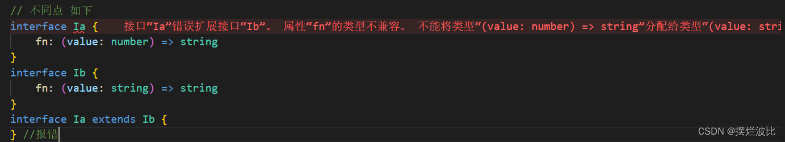

# TypeScript 定义接口

## **一、接口的基本使用**

### 1.1. 接口的定义方式

在之前，如果我们想定义对象类型，使用的关键字是`type`来定义。

```ts
type InfoType = { name: string; age: number };

const info: InfoType = {
  name: "why",
  age: 18,
};
```

现在接口也可以定义对象类型，和其他很多的语言类似，TypeScript 中定义接口也是使用`interface`关键字来定义：

```ts
interface IInfoType {
  readonly name: string; //可以定义只读属性
  age: number;
  friend?: {
    //可以定义可选类型
    name: string;
  };
}

const info: IInfoType = {
  name: "why",
  age: 18,
  friend: {
    name: "kobe",
  },
};
```

你会发现我都在接口的前面加了一个`I`，这是`tslint`要求的，否则会报一个警告

- 要不要加前缀是根据公司规范和个人习惯

```javascript
interface name must start with a capitalized I
```

当然我们可以在 tslint 中关闭掉它：在 rules 中添加如下规则

```javascript
"interface-name" : [true, "never-prefix"]
```

### 2.2. 接口中定义方法

定义接口中不仅仅可以有属性，也可以有方法：

```ts
interface Person {
  name: string;
  run(): void;
  eat(): void;
}
```

如果我们有一个对象是该接口类型，那么必须包含对应的属性和方法：

```javascript
const p: Person = {
  name: "why",
  run() {
    console.log("running");
  },
  eat() {
    console.log("eating");
  },
};
```

### 2.3. 可选属性的定义

默认情况下一个变量（对象）是对应的接口类型，那么这个变量（对象）必须实现接口中所有的属性和方法。

但是，开发中为了让接口更加的灵活，某些属性我们可能希望设计成可选的（想实现可以实现，不想实现也没有关系），这个时候就可以使用可选属性（后面详细讲解函数时，也会讲到函数中有可选参数）：

```javascript
interface Person {
  name: string;
  age?: number;
  run(): void;
  eat(): void;
  study?(): void;
}
```

上面的代码中，我们增加了 age 属性和 study 方法，这两个都是可选的：

- 可选属性如果没有赋值，那么获取到的值是 undefined；
- 对于可选方法，必须先进行判断，再调用，否则会报错；

```javascript
const p: Person = {
  name: "why",
  run() {
    console.log("running");
  },
  eat() {
    console.log("eating");
  },
};

console.log(p.age); // undefined
p.study(); // 不能调用可能是“未定义”的对象。
```

正确的调用方式如下：

```javascript
if (p.study) {
  p.study();
}
```

### 2.4. 只读属性的定义

默认情况下，接口中定义的属性可读可写：

```javascript
console.log(p.name);
p.name = "流川枫";
```

如果一个属性，我们只是希望在定义的时候就定义值，之后不可以修改，那么可以在属性的前面加上一个关键字：readonly

```javascript
interface Person {
  readonly name: string;
  age?: number;
  run(): void;
  eat(): void;
  study?(): void;
}
```

当我在 name 前面加上 readonly 时，赋值语句就会报错：

```javascript
console.log(p.name);
p.name = "流川枫"; // Cannot assign to 'name' because it is a read-only property.
```

## **二、接口的高级使用**

### 3.1. 函数类型的定义

接口不仅仅可以定义普通的对象类型，也可以定义**函数的类型**

```ts
// type CalcFn = (n1: number, n2: number) => number
// 可调用的接口
interface CalcFn {
  (n1: number, n2: number): number; // 这里接口定义的是函数类型
}

function calc(num1: number, num2: number, calcFn: CalcFn) {
  return calcFn(num1, num2);
}

const add: CalcFn = (num1, num2) => {
  return num1 + num2;
};

calc(20, 30, add);
```

不过上面的接口中只有一个函数，TypeScript 会给我们一个建议，可以使用 type 来定义一个函数的类型。

### 3.2. 可索引类型的定义

和使用接口描述函数的类型差不多，我们也可以使用接口来描述 **可索引类型**

- 比如一个变量可以这样访问：a[3]，a["Java"]

可索引类型具有一个 **索引签名**，它描述了对象索引的类型，还有相应的索引返回值类型。

```javascript
// 通过interface来定义索引类型
interface IndexLanguage {
  [index: number]: string;
}

const frontLanguage: IndexLanguage = {
  0: "HTML",
  1: "CSS",
  2: "JavaScript",
  3: "Vue",
};

console.log(frontLanguage[1]); //CSS

interface ILanguageYear {
  [name: string]: number;
}

const languageYear: ILanguageYear = {
  C: 1972,
  Java: 1995,
  JavaScript: 1996,
  TypeScript: 2014,
};
console.log(languageYear.Java); //1995
```

上面的案例中，我们的索引签名是数字类型， TypeScript 支持两种索引签名：**字符串和数字**。

### 3.3. 接口的继承

和类相似（后面我们再详细学习类的知识），接口也是可以继承接口来提供复用性：

- 注意：继承使用`extends`关键字

```ts
interface ISwim {
  swimming: () => void;
}

interface IFly {
  flying: () => void;
}

interface IAction extends ISwim, IFly {}

const action: IAction = {
  swimming() {},
  flying() {},
};
```

接口 IAction 继承自 ISwim 和 IFly，另外我们发现一个接口可以同时继承自多个接口

如果现在有一个类实现了 Petable 接口，那么不仅仅需要实现 Petable 的方法，也需要实现 Petable 继承自的接口中的方法：

- 注意：实现接口使用`implements`关键字

```javascript
class Dog implements IAction {
  swimming(): void {
    console.log("游泳");
  }

  flying(): void {
    console.log("飞飞飞~");
  }
}
```

### 3.4. 交叉类型

交叉类型的功能类似于接口继承，用于组合多个类型为一个类型（常用于对象类型）

```ts
interface Person {
  name: string;
}
interface People {
  sex: string;
}
type PersonMan = Person & People;
```

这里就相当于

```typescript
type PersonMan = { name: string; sex: string };
```

实例对象：

```typescript
let obj: PersonMan = {
  name: "小丑",
  sex: "男",
};
```

**交叉类型**和**接口继承**之间的区别

相同 => 都可以实现对象类型的组合
不同 =>

```ts
interface Ia {
  fn: (value: number) => string;
}
interface Ib {
  fn: (value: string) => string;
}
```

如上 我们写两个接口都有相同的方法，但是方法的参数不同，这时候 如果我们用`extends`继承则会出现下面的效果



但是如果我们用交叉类型

```typescript
type Ic = Ia & Ib;
```

相当于

```typescript
let c: Ic = {
  fn(value: number | string) {
    return "";
  },
};
```

### 3.5. 字面量赋值

```ts
interface IPerson {
  name: string;
  age: number;
  height: number;
}

const info = {
  name: "Person",
  age: 18,
  height: 1.88,
  address: "广州市",
};

// freshness 擦除操作,主要是为了把对象能够传递进来
const p: IPerson = info;
console.log(p); // { name: 'Person', age: 18, height: 1.88, address: '广州市' }
console.log(info); // { name: 'Person', age: 18, height: 1.88, address: '广州市' }
```

### 3.5. 枚举类型

```ts
// type Direction = "left" | "Right" | "Top" | "Bottom"

enum Direction {
  LEFT,
  RIGHT,
  TOP,
  BOTTOM,
}

function turnDirection(direction: Direction) {
  // console.log(direction); //标识常量

  switch (direction) {
    case Direction.LEFT:
      console.log("改变角色的方向向左");
      break;
    case Direction.RIGHT:
      console.log("改变角色的方向向右");
      break;
    case Direction.TOP:
      console.log("改变角色的方向向上");
      break;
    case Direction.BOTTOM:
      console.log("改变角色的方向向下");
      break;
    default:
      const foo: never = direction;
      break;
  }
}

turnDirection(Direction.LEFT);
turnDirection(Direction.RIGHT);
turnDirection(Direction.TOP);
turnDirection(Direction.BOTTOM);
```

枚举类型的值

```ts
// type Direction = "left" | "Right" | "Top" | "Bottom"

enum Direction {
  LEFT = "LEFT",
  RIGHT = "RIGHT",
  TOP = "TOP",
  BOTTOM = "BOTTOM",
}

let d: Direction = Direction.BOTTOM;
console.log(d);

function turnDirection(direction: Direction) {
  console.log(direction);
  switch (direction) {
    case Direction.LEFT:
      console.log("改变角色的方向向左");
      break;
    case Direction.RIGHT:
      console.log("改变角色的方向向右");
      break;
    case Direction.TOP:
      console.log("改变角色的方向向上");
      break;
    case Direction.BOTTOM:
      console.log("改变角色的方向向下");
      break;
    default:
      const foo: never = direction;
      break;
  }
}

turnDirection(Direction.LEFT);
turnDirection(Direction.RIGHT);
turnDirection(Direction.TOP);
turnDirection(Direction.BOTTOM);

export {};
```

### 3.3. 接口的实现

接口除了定义某种类型规范之后，也可以和其他编程语言一样，让**一个类去实现某个接口**，那么这个类就必须明确去拥有这个接口中的属性和实现其方法：

```ts
//这是最常用的方式,通过类来实现接口
interface ISwim {
  swimming: () => void;
}

class Person implements ISwim {
  swimming() {
    console.log("Person Swimming");
  }
}
```

那么我们现在可以编写一些公共的 API，面向接口编程

```ts
interface ISwim {
  swimming: () => void;
}

// 编写一些公共的API: 面向接口编程
function swimAction(swimable: ISwim) {
  swimable.swimming();
}

// 所有实现了接口的类对应的对象, 都是可以传入
swimAction(new Fish());
swimAction(new Person());
// 这里对象也是可以传入的,里面有swimming的方法
swimAction({ swimming: function () {} });

export {};
```

### 3.4. interface 和 type 区别

我们会发现`interface`和`type`都可以用来**定义对象类型**，那么在开发中定义对象类型时，到底选择哪一个呢？

如果是定义非对象类型，通常推荐使用 type，比如 Direction，Alignment，一些 Function；

```ts
//两个接口做了一个合并操作
interface IFoo {
  name: string;
}

interface IFoo {
  age: number;
}

const foo: IFoo = {
  name: "why",
  age: 18,
};
```

但是如果使用`type`定义两个相同名称的对象类型，则会报错。

```ts
// 标识符"IBar"重复
type IBar = {
  name: string;
  age: number;
};

type IBar = {};
```
