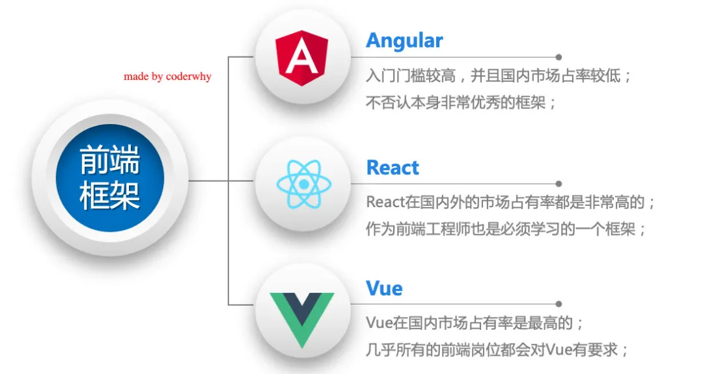
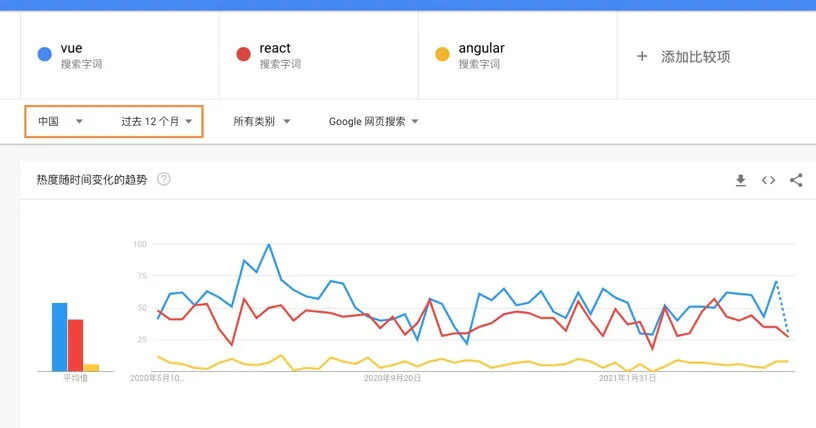
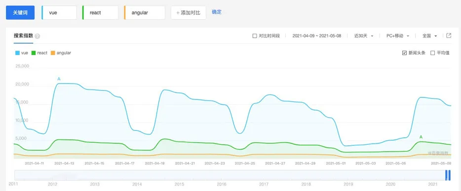
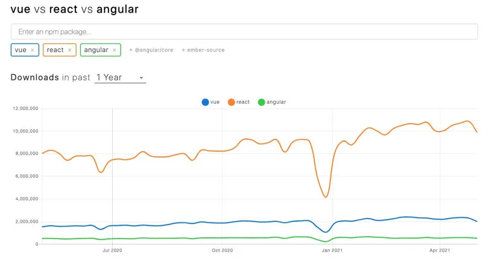
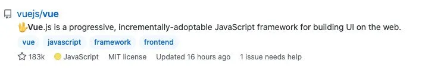
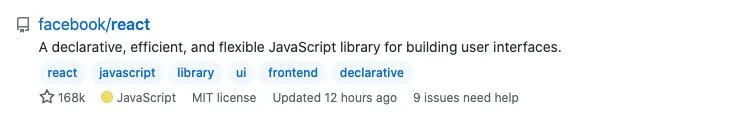
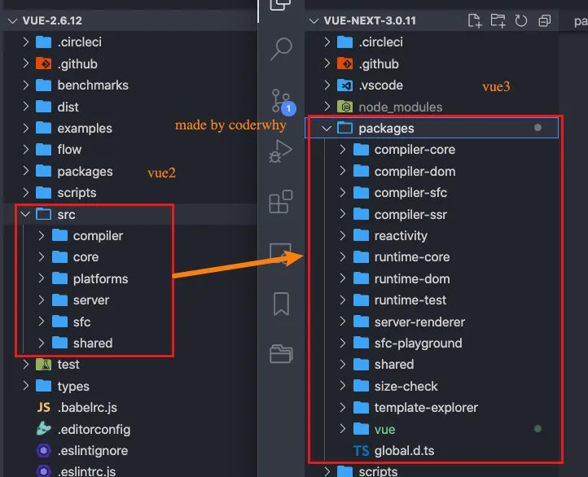
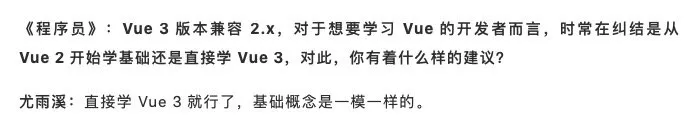
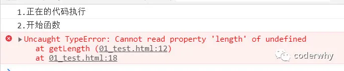
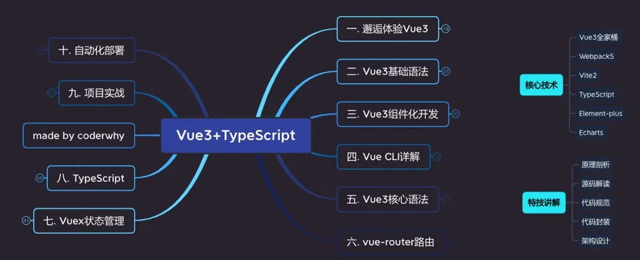

# Vue 框架基本认识与学习

## 1. 为什么要学习 Vue

### 1.1. 为什么要学习 Vue

#### 1.1.1. 三个框架的对比

当你学习到这里的，我就默认你已经知道了前端现在流行的三大框架：Vue、React、Angular。

- Angular：入门门槛相对会比较高，所以在国内无论是开发者还是使用的公司都是较少的，当然它本身是一个非常优秀的框架；
- React：在国内外市场占有率都非常高（尤其在国外，待会儿我们会看到数据对比），也是前端开发者必须要掌握的一个框架；
- Vue：在国内的市场占有率是最高的，是国内前端开发者必须要学习的一个框架，几乎所有的前端岗位都对 Vue 有要求；



#### 1.1.2. 框架的数据对比

**Google 指数**

我们通过 Google 指数（中国）可以看出：使用 Vue 的人数依然是最高的，其次是 React，Angular 人数是最少的。

当然国内的程序员使用的 Google 是较少数的，更多使用的是百度，所以我们再来看一下百度指数。



**百度指数**

从百度指数我们可以看出：Vue 是遥遥领先的，其次是 React，再次是 Angular。

当然这些指数只能反映开发者搜索这些关键字的频率，从侧面反映对应框架的热门程度。



**npm 下载量**

如果我们从 npm 下载量来观察，会发现 React 是遥遥领先的：

- 这是因为 npm 下载量反映的是全球框架的使用频率；
- 我们刚才有提到，React 事实上在国外是更加的流行，所以 React 从世界的角度来看，下载量也是最高的；



**GitHub Star**

如果我们来看 GitHub 上的 Star：Vue 的 star 是排第一的，当然这也是和国内使用 Vue 的人数非常多有关系，React 排在第二，Angular 排在第三。






#### 1.1.3. 谁是最好的前端框架？

那么在对比完之后，三个框架中到底谁才是最好的框架呢？

- 当然，这个问题很难有一个结论，我也不会给出结论；
- 因为这是一个仁者见仁智者见智的问题，也在很多地方会被争论不休；
- 就像很多人喜欢争论谁才是世界上最好的语言一样；
- 另外，争论这个话题是没有意义的，争论不休的话题；

但是，我们可以从现实的角度分析一下一些问题，比如：学习哪一门语言更容易找到工作？

- 找后端的工作：优先推荐 Java、其次推荐 Go、再次推荐 Node（JavaScript），可能不推荐 PHP、C#；

- - 目前在国内后端开发必然是首推 Java 的，所以也有很多的大公司慢慢将技术栈转向了 Go；
  - 而类似于 PHP、C#已经在慢慢的退出历史舞台；

- 找前端的工作：优先推荐 JavaScript（TypeScript）、其次 Flutter、再次 Android（Java、Kotlin）、iOS（OC、Swift）；

- - 如果找前端工作，必须要学好 JavaScript，其次是一些矿平台的方案；
  - 而原生的 Android 和 iOS 开发的市场确确实实在慢慢的变小；

- 也有很多的其他方向：游戏开发、人工智能、算法工程师等等；

那么，就前端来说，学习了 HTML、CSS、JavaScript，哪一个框架更容易找到工作？

- 如果去国外找工作，优先推荐 React、其次是 Vue 和 Angular，不推荐 jQuery 了；
- 如果在国内找工作，优先推荐、必须学习 Vue，其次是 React，其次是 Angular，不推荐 jQuery 了；

在国内，绝大多数的前端岗位都对 Vue 是有要求的，所以我这里得出一个可能会有点绝对的结论：


### 1.2. 是时候学习 Vue3 了吗？

在 2020 年的 9 月 19 日，万众期待的 Vue3 终于发布了正式版，命名为**One Piece**。

- 它也带来了很多新的特性：更好的性能、更小的包体积、更好的 TypeScript 集成、更优秀的 API 设计。

#### 1.2.1. Vue3 的新变化

**更现代化的源码管理方式**

Vue3 对项目管理的管理进行了重大的重构，采用了 monorepo 的方式来进行管理：

- mono 是单个的意思，repo 是 repository 仓库的简写；
- 主要的含义是将许多项目的代码存储在同一个 repository 中；

我们来看下面的图片，对比 vue2 和 vue3 源码的不同管理方式：

- Vue2.x 是将所有的源代码编写到了 src 的目录下，并且依照不同的功能划分成了多个文件夹，比如 compiler 是和模板编译相关的，core 是通用的核心运行时代码等；

- Vue3.x 是将不同的模块拆分到不同 packages 下的子目录中，并且每一个模块都可以看成是一个独立的项目；

- - 这个独立的项目可以有自己的类型定义、自己的 API、自己的测试用例；
  - 这样每一个模块的划分更加清晰，开发者更容易阅读、理解、修改模块的代码，也提供了代码的可维护性、可扩展性；
  - 并且每一个模块可以单独的进行编译，而无需从大量的 src 代码中抽离出一部分代码；



目前很多的开源项目都是采用 monorepo 的方式来开发的：

- 比如 Vue3、React、Babel、Element-Plus 等等；
- 当然也有很多的框架并不是，比如 WebPack；

**代码使用 TypeScript 进行了重构**

待会儿我们也会讲到为什么需要使用 TypeScript，但是我先知道一下 Vue3 已经全部使用 TypeScript 对源代码进行重写。

- 在 Vue2.x 的时候，它是使用 Flow 来进行类型的检测，但是 Flow 有很多的复杂场景是类型的支持并不是非常友好。
- 所以在 Vue3.x 开始，整个项目全部使用了 TypeScript 进行重构，并且 Vue3.x 本身对 TypeScript 的支持也变得更加友好了。

**使用 Proxy 进行数据劫持**

在 Vue2.x 的时候，Vue3 是使用`Object.defineProperty`来劫持数据的`getter`和`setter`方法的；

- 这种方式一直存在一个缺陷就是当==给对象添加或者删除属性时，是无法劫持和监听的；==
- 所以在 Vue2.x 的时候，不得不提供一些特殊的 API，比如或 delete，事实上都是一些 hack 方法，也增加了开发者学习新的 API 的成本；

而在 Vue3.x 开始，Vue 使用 Proxy 来实现数据的劫持，这个 API 的用法和相关的原理我也会在后续讲到：

- 后续我会专门有文章讲解 Vue3 响应式的原理以及 Proxy 的用法；

**编译阶段的优化**

Vue3 在编译阶段进行了很多的优化：

- 生成 Block Tree：在编译阶段对静态模板进行分析，生成 Block Tree（具体是干嘛的，后面讲原理再讲）；
- slot 编译优化：Vue3 优化了 slot 的生成，对于非动态 slot 中属性的更新只会触发子组件的更新；
- diff 算法优化：Vue3 相对于 vue2 在 diff 算法上也进行了优化（后续会讲解）；

**composition api**

由 Options API 到 Composition API（了解，后续课程会讲解）：

- 在 Vue2.x 的时候，我们会通过 Options API 来描述组件对象；
- Options API 包括 data、props、methods、computed、生命周期等等这些选项；
- 存在比较大的问题是多个逻辑可能是在不同的地方：
- 比如 created 中会使用某一个 method 来修改 data 的数据，代码的内聚性非常差；
- Composition API 可以将 相关联的代码 放到同一处 进行处理，而不需要在多个 Options 之间寻找；

Hooks 函数增加代码的复用性：

- 在 Vue2.x 的时候，我们通常通过 mixins 在多个组件之间共享逻辑；
- 但是有一个很大的缺陷就是 mixins 也是由一大堆的 Options 组成的，并且多个 mixins 会存在命名冲突的问题；
- 在 Vue3.x 中，我们可以通过 Hook 函数，来将一部分独立的逻辑抽取出去，并且它们还可以做到是响应式的；
- 具体的好处，会在后续的课程中演练和讲解（包括原理）；

**移除一些非必要的 api**

Vue3 移除了实例上的 off 和 $once；

Vue3 移除了一些特性：如 filter、内联模板等；

- 当然后面我们会有对应的替代的方案；

#### 1.2.2. 现在开始学习 Vue3 吗？

是时候学习 Vue3 了吗？

- 在 vue3 刚刚发布时，很多人也是跃跃欲试，想要尝试 vue3 的各种新特性；
- 但是事实上在刚刚发布的时候我们使用 vue3 来写 demo 练习是没有问题的，真正在实际业务项目中使用 vue3 还需要一个相对的过程；
- 包括 vue3 的进一步稳定、包括社区更多 vue3 相关的插件、组件库的支持和完善；

**那么现在是否是学习 vue3 的时间呢？**

- 答案是肯定的
- 首先 vue3 在经过一系列的更新和维护后，已经是趋于稳定，并且在之前尤雨溪也宣布在今年（2021 年）第二季度会将 vue3 作为 Vue CLI 的默认版本了；
- 目前社区也经过一定时间的沉淀，更加的完善了，包括 AntDesignVue、Element-Plus 都提供了对 Vue3 的支持，所以很多公司目前新的项目都已经在使用 Vue3 来进行开发了；
- 并且在面试的时候，几乎都会问到各种各样 Vue3、Vite2 工具相关的问题；

并且尤雨溪也是推荐大家直接学习 Vue3 的知识内容：



## 2. 为什么学习 TypeScript

### 2.1. 优秀的 JavaScript

JavaScript 是一门优秀的编程语言吗？

- 每个人可能观点并不完全一致，但是从很多角度来看，JavaScript 是一门非常优秀的编程语言；
- 而且，可以说在很长一段时间内这个语言不会被代替，并且会在更多的领域被大家广泛使用；

著名的 Atwood 定律：

- Stack Overflow 的创立者之一的 **Jeff Atwood** 在 2007 年提出了著名的 **Atwood 定律**；
- any application that can be written in JavaScript, will eventually be written in JavaScript；
- 任何可以使用 JavaScript 来实现的应用都最终都会使用 JavaScript 实现；
- 其实我们已经看到了，至少目前 JavaScript 在浏览器端依然无可替代，并且在服务端（Nodejs）也在被广泛的应用；

优秀的 JavaScript 没有缺点吗？

- 其实上由于各种历史因素，JavaScript 语言本身存在很多的缺点；
- 比如 ES5 以及之前的使用的 var 关键字关于作用域的问题；
- 比如最初 JavaScript 设计的数组类型并不是连续的内存空间；
- 比如直到今天 JavaScript 也没有加入类型检测这一机制；

JavaScript 正在慢慢变好

- 不可否认的是，JavaScript 正在慢慢变得越来越好，无论是从底层设计还是应用层面；
- ES6、7、8 等的推出，每次都会让这门语言更加现代、更加安全、更加方便；
- 但是知道今天，JavaScript 在类型检测上依然是毫无进展（为什么类型检测如此重要，我后面会聊到）；

### 2.2. 类型引发的问题

首先你需要知道，编程开发中我们有一个共识：**错误出现的越早越好**

- 能在**写代码的时候**发现错误，就不要在**代码编译时**再发现（IDE 的优势就是在代码编写过程中帮助我们发现错误）；
- 能在**代码编译期间**发现错误，就不要在**代码运行期间**再发现（类型检测就可以很好的帮助我们做到这一点）；
- 能在**开发阶段**发现错误，就不要在**测试期间**发现错误；
- 能在**测试期间**发现错误，就不要在**上线后**发现错误；

现在我们想探究的就是如何在 **代码编译期间** 发现代码的错误：

- JavaScript 可以做到吗？不可以，我们来看下面这段经常可能出现的代码问题。

```javascript
function getLength(str) {
  return str.length;
}

console.log("1.正在的代码执行");
console.log("2.开始函数");
getLength("abc"); // 正确的调用
getLength(); // 错误的调用(IDE并不会报错)

// 当上面的代码报错后, 后续所有的代码都无法继续正常执行了
console.log("3.调用结束");
```



这是我们一个非常常见的错误：

- 这个错误很大的原因就是因为 JavaScript 没有对我们传入的参数进行任何的限制，只能等到运行期间才发现这个错误；
- 并且当这个错误产生时，会影响后续代码的继续执行，也就是整个项目都因为一个小小的错误而深入崩溃；

当然，你可能会想：我怎么可能犯这样低级的错误呢？

- 当我们写像我们上面这样的简单的 demo 时，这样的错误很容易避免，并且当出现错误时，也很容易检查出来；
- 但是当我们开发一个大型项目时呢？你能保证自己一定不会出现这样的问题吗？而且如果我们是调用别人的类库，又如何知道让我们传入的到底是什么样的参数呢？

但是，如果我们可以给 JavaScript 加上很多限制，在开发中就可以很好的避免这样的问题了：

- 比如我们的 getLength 函数中 str 是一个必传的类型，没有调用者没有传编译期间就会报错；
- 比如我们要求它的必须是一个 String 类型，传入其他类型就直接报错；
- 那么就可以知道很多的错误问题在编译期间就被发现，而不是等到运行时再去发现和修改；

### 2.3. TypeScript 类型检测

我们已经简单体会到没有类型检查带来的一些问题，JavaScript 因为从设计之初就没有考虑类型的约束问题，所以造成了前端开发人员关于**类型思维的缺失**：

- **前端开发人员**通常不关心变量或者参数是什么类型的，如果在必须确定类型时，我们往往需要使用各种判断验证；
- 从其他方向转到前端的人员，也会因为没有类型约束，而总是担心自己的代码不安全，不够健壮；

所以我们经常会说 JavaScript**不适合开发大型项目**，因为当项目一旦庞大起来，这种宽松的类型约束会带来非常多的安全隐患，多人员开发往往也增加很大的沟通成本。

- 比如当我们去实现一个核心类库时，如果没有类型约束，那么需要对别人传入的参数进行各种验证来保证我们代码的健壮性；
- 比如我们去调用别人的函数，对方没有对函数进行任何的注释，我们只能去看里面的逻辑来理解这个函数需要传入什么参数，返回值是什么类型。

**为了弥补 JavaScript 类型约束上的缺陷，增加类型约束，很多公司推出了自己的方案：**

- 2014 年，Facebook 推出了 flow 来对 JavaScript 进行类型检查；
- 同年，Microsoft 微软也推出了 TypeScript1.0 版本；
- 他们都致力于为 JavaScript 提供类型检查；

而在所有的方案中，无疑 TypeScript 是最优秀的，也是目前使用最广泛的：

- Vue3.x 已经全线转向 TypeScript，几乎所有的代码都使用 TypeScript 进行了重构；
- 而 Angular 在很早期就使用 TypeScript 进行了项目重构，并且项目也需要使用 TypeScript 来进行开发；
- 包括 React 使用最多的组件库 Ant Design 也是全面使用的 TypeScript；
- 目前很多的公司项目都是使用 Vue+TypeScript、React+TypeScript、Angular+TypeScript；
- 包括最新的 Vue3 中也提供了更好的对 TypeScript 的支持；

所以对于前端工程师来说，TypeScript 也是必须要掌握的技能。

## 3. 系统学习 Vue3+TypeScript

当然，在这个系列中，我还会讲到更多、更丰富的内容：



整个课程里面我会包含三个核心内容：

- 第一：**基础知识**，通过这个课程你会打下非常扎实的基础知识，我会比在 Vue2 中更加详细的讲解基础知识内容并且全部使用的是 Vue3 最新的语法；
- 第二：**项目实战**，本次课程的项目实战是 Vue3+Vue-Router+Vuex+TypeScript+Element-Plus+Echarts+Less 等等技术栈，开发一个可复用的后台管理系统，并且在开发过程中会封装很多可复用的高阶组件；
- 第三：**源码阅读**，本次课程会带着大家编写一个 Mini-Vue 的 Vue3 框架，并且在编写后会带着大家阅读 Vue3 的核心源码，从底层掌握 Vue3 所有内容和知识；
