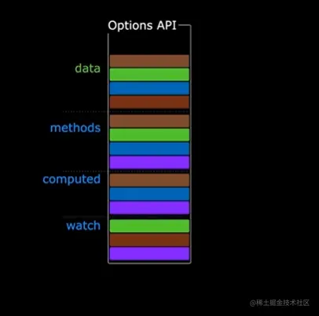
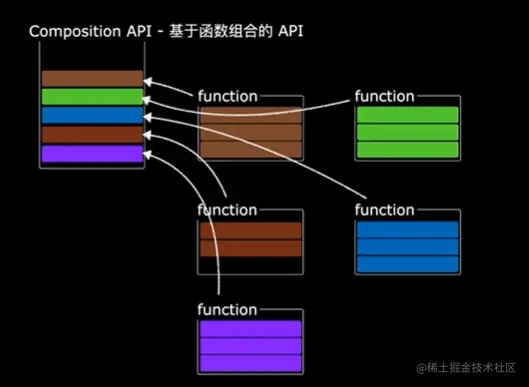
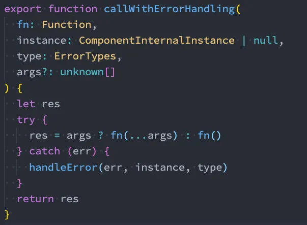
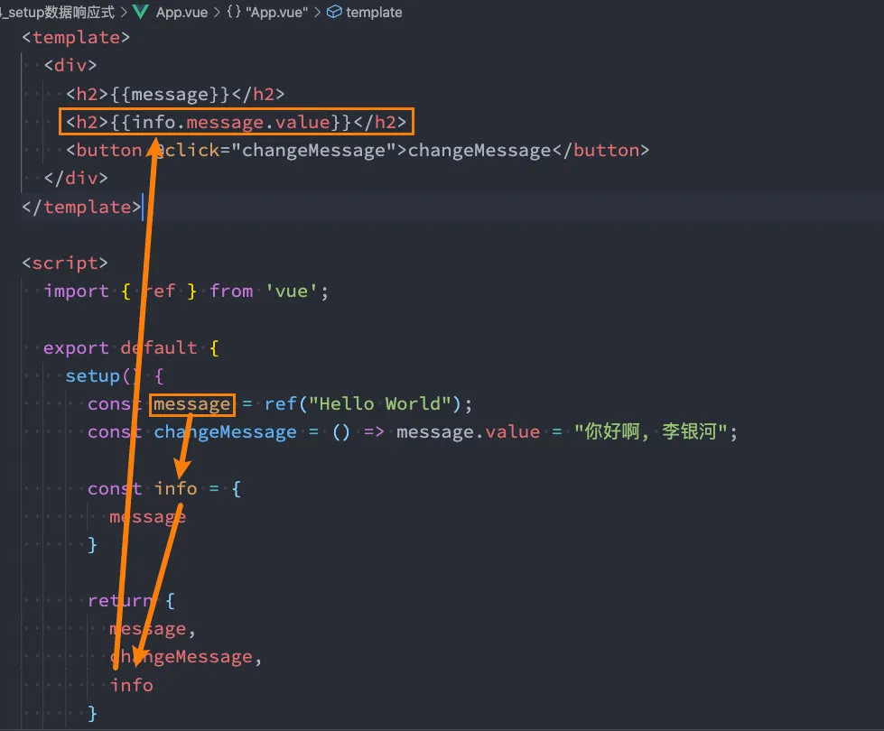
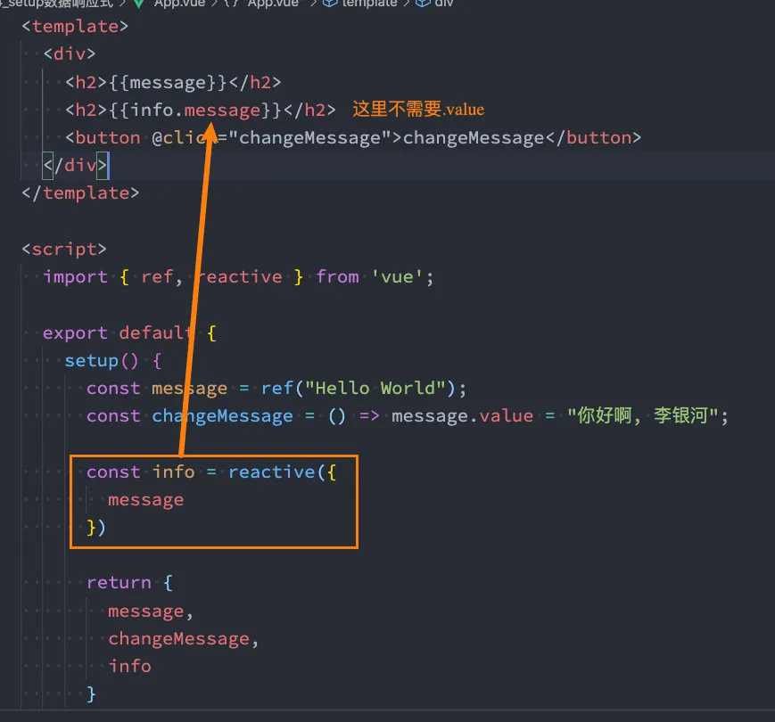
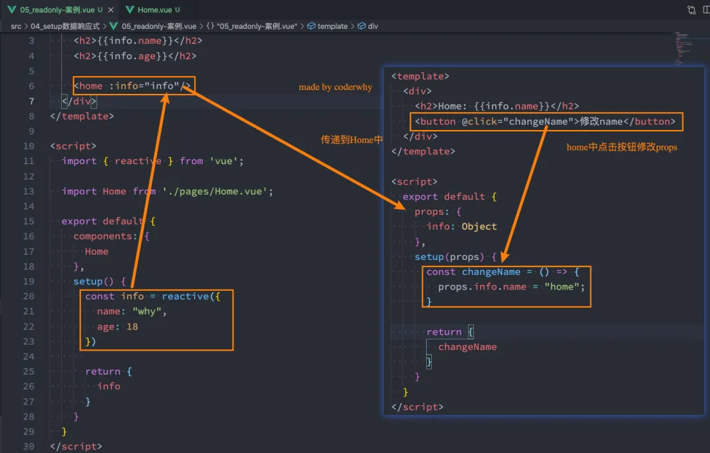
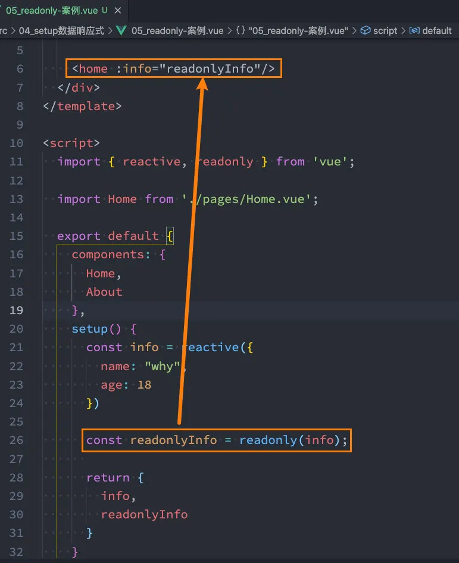

# Composition API 学习（一）

## 1. Options API 代码复用

代码逻辑复用（logic reuse）一直是开发中（任何开发）一个非常重要的功能。

对于当前组件化盛行的前端开发来说，如何可以更多的对组件中的代码逻辑进行复用是一致在探索的一个话题，无论是在 React、Vue，还是在 Angular 中。

那么接下来，我们就一起来看一下目前比较常见的在 Vue 中可以实现组件代码复用的方式，并且会详细、深入的学习一下 Vue3 最新的 Composition API。

其实在 Vue2 当中的 Options API 中已经有了一些代码复用的方式，当然这些 API 在 Vue3 中依然是保留的，所以我们一起来学习一下。

### 1.1. Mixin 混入

#### 1.1.1. 认识 Mixin

目前我们是使用组件化的方式在开发整个 Vue 的应用程序，但是 组件和组件 之间有时候会存在相同的代码逻辑，我们希望对相同的代码逻辑进行抽取。

在 Vue2 和 Vue3 中都支持的一种方式就是使用 Mixin 来完成。

- Mixin 提供了一种非常灵活的方式，来**分发 Vue 组件中的可复用功能**；
- 一个 Mixin 对象可以包含**任何组件选项**；
- 当组件使用 Mixin 对象时，所有 Mixin 对象的选项将被 混合 进入**该组件本身的选项**中；

比如我们封装一个 mixin 的对象在 sayHelloMixin.js 文件中：

```javascript
const sayHelloMixin = {
  created() {
    this.sayHello();
  },
  methods: {
    sayHello() {
      console.log("Hello Page Component");
    },
  },
};

export default sayHelloMixin;
```

之后，在 Home.vue 中通过 mixins 的选项进行混入：

```vue
<template>
  <div></div>
</template>

<script>
import sayHelloMixin from "../mixins/sayHello";

export default {
  mixins: [sayHelloMixin],
};
</script>

<style scoped></style>
```

#### 1.1.2. Mixin 合并

如果 Mixin 对象中的**选项**和**组件对象中的选项**发生了冲突，那么 Vue 会如何操作呢？

- 这里分成不同的情况来进行处理；

**情况一：如果是 data 函数的返回值对象**

- 返回值对象默认情况下会进行合并；
- 如果 data 返回值对象的属性发生了冲突，那么会**保留组件自身**的数据；

mixin 中的代码：

```javascript
const sayHelloMixin = {
  data() {
    return {
      name: "mixin",
      age: 18,
    };
  },
};

export default sayHelloMixin;
```

Home.vue 中的代码：

```vue
<script>
import sayHelloMixin from "../mixins/sayHello";

export default {
  mixins: [sayHelloMixin],
  data() {
    return {
      message: "Hello World",
      // 冲突时会保留组件中的name
      name: "home",
    };
  },
};
</script>
```

**情况二：如果是生命周期钩子函数**

- 生命周期的钩子函数会被合并到数组中，**都会被调用**；

mixin 中的代码：

```javascript
const sayHelloMixin = {
  created() {
    console.log("mixin created");
  },
};

export default sayHelloMixin;
```

`Home.vue`中的代码：

```vue
<script>
import sayHelloMixin from "../mixins/sayHello";

export default {
  mixins: [sayHelloMixin],
  created() {
    console.log("home created");
  },
};
</script>
```

**情况三：值为对象的选项，例如 methods、components 和 directives，将被合并为同一个对象。**

- 比如都有 methods 选项，并且都定义了方法，那么它们都会生效；
- 但是如果对象的**key 相同**，那么会**取组件对象的键值对**；
- 比如下面的代码中，最终 methods 对象会被合并成一个对象；

mixin 中的代码：

```javascript
const sayHelloMixin = {
  methods: {
    sayHello() {
      console.log("Hello Page Component");
    },
    foo() {
      console.log("mixin foo function");
    },
  },
};

export default sayHelloMixin;
```

`Home.vue`中的代码：

```js
<script>
  import sayHelloMixin from '../mixins/sayHello';

  export default {
    mixins: [sayHelloMixin],
    methods: {
      //那么这里会取组件对象中的方法,因为方法名发生了冲突
      foo() {
        console.log("mixin foo function");
      },
      bar() {
        console.log("bar function");
      }
    }
  }
</script>
```

#### 1.1.3. 全局 Mixin

如果组件中的某些选项，是所有的组件都需要拥有的，那么这个时候我们可以使用全局的 mixin：

- 全局的 Mixin 可以使用 应用 app 的方法 `mixin` 来完成注册；
- 一旦注册，那么全局混入的选项将会影响每一个组件；

```javascript
import { createApp } from "vue";
import App from "./14_Mixin混入/App.vue";

const app = createApp(App);
app.mixin({
  data() {
    return {
      name: "萧兮",
    };
  },
  created() {
    console.log("global mixin created");
  },
});
app.mount("#app");
```

### 1.2. extends

另外一个类似于 Mixin 的方式是通过 extends 属性：

- 允许声明扩展另外一个组件，类似于 Mixins；

我们开发一个 HomePage.vue 的组件对象：

```vue
<script>
export default {
  data() {
    return {
      message: "我是homepage组件里面的数据",
    };
  },
};
</script>
```

在 Home.vue 中我们可以继承自 HomePage.vue：

- ==注意：只可以继承自对象中的属性，不可以继承模板和样式等；==

```vue
<template>
  <div class="">{{ message }}</div>
</template>

<script>
import HomePage from "./HomePage.vue";

export default {
  extends: HomePage,
};
</script>
```

在开发中 extends 用的非常少，在 Vue2 中比较推荐大家使用 Mixin，而在 Vue3 中推荐使用 Composition API。

## 2. Composition API

### 2.1. 认识 Composition API

在 Vue2 中，我们编写组件的方式是 Options API：

- Options API 的一大特点就是在对应的 属性 中编写对应的功能模块；
- 比如 data 定义数据、methods 中定义方法、computed 中定义计算属性、watch 中监听属性改变，也包括生命周期钩子；

但是这种代码有一个很大的弊端：

- 当我们实现某一个功能时，这个功能对应的代码逻辑会被拆分到各个属性中；
- 当我们组件变得更大、更复杂时，逻辑关注点的列表就会增长，那么同一个功能的逻辑就会被拆分的很分散；
- 尤其对于那些一开始没有编写这些组件的人来说，这个组件的代码是难以阅读和理解的（阅读组件的其他人）；





下面我们来看一个非常大的组件，其中的逻辑功能按照颜色进行了划分：

- 这种碎片化的代码使用理解和维护这个复杂的组件变得异常困难，并且隐藏了潜在的逻辑问题；
- 并且当我们处理单个逻辑关注点时，需要不断的 `跳转` 到响应的代码块中；

如果我们能将同一个逻辑关注点相关的代码收集在一起会更好，这就是 Composition API 想要做的事情，以及可以帮助我们完成的事情。

那么既然知道 Composition API 想要帮助我们做什么事情，接下来看一下到底是怎么做呢？

- 为了开始使用 Composition API，我们需要有一个可以实际使用它（编写代码）的地方；
- 在 Vue 组件中，这个位置就是 `setup` 函数；

### 2.2. setup 函数基本使用

setup 其实就是组件的另外一个选项：

- 只不过这个选项强大到我们可以用它来替代之前所编写的大部分其他选项；
- 比如 methods、computed、watch、data、生命周期等等；

#### 2.2.1. setup 函数的参数

我们先来研究一个 setup 函数的参数，它主要有两个参数：

- 第一个参数：props
- 第二个参数：context

props 非常好理解，它其实就是父组件传递过来的属性会被放到 props 对象中，我们在 setup 中如果需要使用，那么就可以直接通过 props 参数获取。

我们来看一个`ShowMessage.vue`的组件：

- 这个组件接受一个 message 的 props ；
- 对于定义 props 的类型，我们还是和之前的规则是一样的，在 props 选项中定义；
- 并且在 template 中依然是可以正常去使用 props 中的 message 的；
- 如果我们在 setup 函数中想要使用 props，那么不可以通过 `this` 去获取（后面我会讲到为什么）；
- 因为 props 有直接作为参数传递到 setup 函数中，所以我们可以直接通过参数来使用即可；

```vue
<template>
  <div>
    <h2>{{ message }}</h2>
  </div>
</template>

<script>
export default {
  props: {
    message: String,
  },
  setup(props) {
    console.log(props.message);
  },
};
</script>
```

另外一个参数是**context**，我们也称之为是一个**SetupContext**，它里面包含三个属性：

- attrs：所有的非 prop 的 attribute；(就是在组件中传入了值,但是在使用的组件中没有接受值.)
- slots：父组件传递过来的插槽（这个在以渲染函数返回时会有作用，后面会讲到）；
- emit：当我们组件内部需要发出事件时会用到 emit（因为我们不能访问 this，所以不可以通过 `this.$emit`发出事件）；

在 App.vue 中按照如下方式使用 ShowMessage.vue 组件：

```vue
<template>
  <div>
    <show-message message="Hello World" id="why" class="kobe">
      <!-- 这里是一个默认插槽 -->
      <template #default>
        <span>哈哈哈</span>
      </template>
      <template #content>
        <span>呵呵呵</span>
      </template>
    </show-message>
  </div>
</template>
```

我们在 ShowMessage.vue 中获取传递过来的内容：

```vue
<script>
export default {
  props: {
    message: String,
  },
  setup(props, context) {
    // setup(props, {attrs,slots,emit}) //可以直接通过这种方式进行结构,直接使用就可以了

    console.log(props.message);
    // 获取属性值
    console.log(context.attrs.id, context.attrs.class);
    console.log(context.slots.default);
    console.log(context.slots.content);
    // 获取发出事件
    console.log(context.emit);
  },
};
</script>
```

当然，目前我们并没有具体演示 slots 和 emit 的用法：

- slots 我会在后续讲解**render**函数时使用；
- emit 我会在待会儿讲到组件内发出事件时使用；

#### 2.2.2. setup 函数的返回值

setup 既然是一个函数，那么它也可以有返回值，它的返回值用来做什么呢？

- **setup 的返回值可以在模板 template 中被使用**；
- 也就是说我们可以通过 setup 的返回值来替代 data 选项；

```vue
<template>
  <div>
    <h2>{{ name }}</h2>
    <h2>当前计数: {{ counter }}</h2>
  </div>
</template>

<script>
export default {
  setup(props, context) {
    const name = "coderwhy";
    let counter = 100;

    return {
      name,
      counter,
    };
  },
};
</script>
```

甚至是我们可以返回一个执行函数来代替在 methods 中定义的方法：

```vue
<template>
  <div>
    <h2>{{ name }}</h2>
    <h2>当前计数: {{ counter }}</h2>
    <button @click="increment">+1</button>
    <button @click="decrement">-1</button>
  </div>
</template>

<script>
export default {
  setup(props, context) {
    const name = "coderwhy";
    let counter = 100;

    const increment = () => {
      console.log("increment");
    };
    const decrement = () => {
      console.log("decrement");
    };

    return {
      name,
      counter,
      increment,
      decrement,
    };
  },
};
</script>
```

但是，如果我们将 `counter` 在 `increment` 或者 `decrement`进行操作时，是否可以实现界面的响应式呢？

- 答案是不可以；
- 这是因为对于一个定义的变量来说，默认情况下，Vue 并不会跟踪它的变化，来引擎界面的响应式操作；

那么我们应该怎么做呢？接下来我们就学习一下 setup 中数据的响应式。

#### 2.2.3. setup 函数的 this

在阅读源码的过程中，代码是按照如下顺序执行的：

- 调用 `createComponentInstance` 创建组件实例；
- 调用 `setupComponent` 初始化 component 内部的操作；
- 调用 `setupStatefulComponent` 初始化有状态的组件；
- 在 `setupStatefulComponent` 取出了 `setup` 函数；
- 通过`callWithErrorHandling` 的函数执行 `setup`；



从上面的代码我们可以看出， `组件的instance` 肯定是在执行 `setup` 函数之前就创建出来的。

因为`setup`位于组件实例创建成功后但是并没有解析`data`、`computed`、`methods`之间，所以他们无法从`setup`中调用`this`去获得。

### 2.3. setup 数据的响应式

#### 2.3.1. reactive

如果想为在==setup 中定义的数据提供响应式==的特性，那么我们可以使用 reactive 的函数：

```vue
<template>
  <div>
    <h2>{{ state.name }}</h2>
    <h2>当前计数: {{ state.counter }}</h2>
    <button @click="increment">+1</button>
    <button @click="decrement">-1</button>
  </div>
</template>

<script>
import { reactive } from "vue";

export default {
  setup() {
    const state = reactive({
      name: "coderwhy",
      counter: 100,
    });

    const increment = () => state.counter++;
    const decrement = () => state.counter--;

    return {
      state,
      increment,
      decrement,
    };
  },
};
</script>
```

也就是我们按照如下的方式在 setup 中使用数据，就可以让数据变成响应式的了：

```javascript
import { reactive } from "vue";

// 响应式状态
const state = reactive({
  count: 0,
});
```

那么这是什么原因呢？为什么就可以变成响应式的呢？

- 这是因为当我们使用 reactive 函数处理我们的数据之后，数据再次被使用时就会进行依赖收集；
- 当数据发生改变时，所有收集到的依赖都是进行对应的响应式操作（比如更新界面）；
- 事实上，我们编写的 data 选项，也是在内部交给了 reactive 函数将其编程响应式对象的；

#### 2.3.2. ref

reactive API 对传入的类型是有限制的，它要求我们必须传入的是**一个对象或者数组**类型：

- 如果我们传入一个基本数据类型（String、Number、Boolean）会报一个警告；


这个时候 Vue3 给我们提供了另外一个 API：**ref** API

- ref 会返回一个**可变的响应式对象**，该对象作为一个 **响应式的引用** 维护着它内部的值，这就是 ref 名称的来源；
- 它内部的值是在 ref 的 **value** 的属性中被维护的；

接下来我们看一下 ref 的 API 是如何使用的：

```vue
<template>
  <div>
    <!-- 当我们在templete模板中使用ref对象，它会自动进行解包 -->
    <h2>{{ message }}</h2>
    <button @click="changeMessage">changeMessage</button>
  </div>
</template>

<script>
import { ref } from "vue";

export default {
  setup() {
    const message = ref("Hello World");
    const changeMessage = () => (message.value = "你好啊, 李银河");

    return {
      message,
      changeMessage,
    };
  },
};
</script>
```

这里有两个注意事项：

- 在模板中引入 ref 的值时，Vue 会自动帮助我们进行解包操作，所以==我们并不需要在模板中通过 ref.value 的方式来使用；==
- 但是在 `setup` 函数内部，它依然是一个 `ref引用`， 所以对其进行操作时，我们依然需要使用 ref.value 的方式；

但是，**模板中的解包是浅层的解包**，如果我们的代码是下面的方式：



但是，如果我们**将 ref 放到一个 reactive 的属性当中，那么它会自动解包**：



### 2.4. reactive 知识点补充

#### 2.4.1. readonly

我们通过 reactive 或者 ref 可以获取到一个响应式的对象，但是某些情况下，我们传入给其他地方的这个响应式对象希望在另外一个地方被使用，但是不能被修改，这个时候如何防止这种情况的出现呢？

- Vue3 为我们提供了 readonly 的方法；
- readonly 会返回原生对象的**只读代理**（也就是它依然是一个 proxy，这是一个 proxy 的 set 方法被劫持，并且不需要对其进行修改）；

在开发中常见的 readonly 方法会传入三个类型的参数：

- 类型一：普通对象；
- 类型二：reactive 返回的对象；
- 类型三：ref 的对象；

在 readonly 的使用过程中，有如下规则：

- readonly 返回的对象都是不允许修改的；

- 但是经过 readonly 处理的**原来的对象**是允许被修改的；

- - 比如 `const info = readonly(obj)`，info 对象是不允许被修改的；
  - 当 obj 被修改时，readonly 返回的对象也会被修改；
  - 但是我们不能去修改 readonly 返回的对象；

- 其实本质上就是 readonly 返回的对象的 setter 方法被劫持了而已；

```javascript
<script>
  export default {
    setup() {
      // readonly通常会传入三个类型的数据
      // 1.传入一个普通对象
      const info = {
        name: "why",
        age: 18
      }
      const state1 = readonly(info)
      console.log(state1);

      // 2.传入reactive对象
      const state = reactive({
        name: "why",
        age: 18
      })
      const state2 = readonly(state);

      // 3.传入ref对象
      const nameRef = ref("why");
      const state3 = readonly(nameRef);

      return {
        state1,
        state2,
        state3
      }
    }
  }
</script>
```

那么这个 readonly 有什么用呢？

- 在我们传递给其他组件数据时，往往希望其他组件使用我们传递的内容，但是不允许它们修改时，就可以使用 readonly 了；



这个时候我们可以传递给子组件时，使用一个 readonly 数据：

- 子组件在修改 readonly 数据的时候就无法进行修改了；



#### 2.4.2. isProxy

检查对象是否是由 `reactive` 或 `readonly`创建的 proxy，返回 true 或者 false。

```vue
<template>
  <div>数字: {{ num }}--{{ result_num }}</div>
  <div>
    reactive对象: {{ obj }}--{{ result_obj }}--{{ result_num_readonly }}
  </div>
</template>

<script>
import { ref, isProxy, reactive, readonly } from "vue";
export default {
  setup() {
    let num = ref(10);
    let obj = reactive({
      name: "萧兮",
      age: 18,
    });
    let num_readonly = readonly(num); //创建只读的num

    let result_num = isProxy(num); //false
    let result_obj = isProxy(obj); //true
    let result_num_readonly = isProxy(num_readonly); //true
    return {
      num,
      result_num,
      result_obj,
      obj,
      result_num_readonly,
    };
  },
};
</script>
```

#### 2.4.3. isReactive

检查对象是否是由 `reactive`创建的响应式代理：返回 true 或者 false

```javascript
import { reactive, isReactive } from "vue";
export default {
  setup() {
    const state = reactive({
      name: "John",
    });
    console.log(isReactive(state)); // -> true
  },
};
```

如果该代理是 `readonly` 创建的，但包裹了由 `reactive` 创建的另一个代理，它也会返回 true：

```javascript
import { reactive, isReactive, readonly } from "vue";
export default {
  setup() {
    const state = reactive({
      name: "John",
    });
    // 从普通对象创建的只读 proxy
    const plain = readonly({
      name: "Mary",
    });
    console.log(isReactive(plain)); // -> false

    // 从响应式 proxy 创建的只读 proxy
    const stateCopy = readonly(state);
    console.log(isReactive(stateCopy)); // -> true
  },
};
```

#### 2.4.4. isReadonly

检查对象是否是由 `readonly` 创建的只读代理。

#### 2.4.5. toRaw

返回 `reactive` 或 `readonly` 代理的原始对象。

- **不**建议保留对原始对象的持久引用。请谨慎使用。

```javascript
const info = { name: "why" };
const reactiveInfo = reactive(info);

console.log(toRaw(reactiveInfo) === info); // true
```

#### 2.4.6. shallowReactive

创建一个响应式代理，它跟踪其自身 property 的响应性，但不执行嵌套对象的深层响应式转换 (深层还是原生对象)。

```javascript
const state = shallowReactive({
  foo: 1,
  nested: {
    bar: 2,
  },
});

// 改变 state 本身的性质是响应式的
state.foo++;
// ...但是不转换嵌套对象
isReactive(state.nested); // false
state.nested.bar++; // 非响应式
```

#### 2.4.7. shallowReadonly

创建一个 proxy，使其自身的 property 为只读，但不执行嵌套对象的深度只读转换（深层还是可读、可写的）。

```javascript
const state = shallowReadonly({
  foo: 1,
  nested: {
    bar: 2,
  },
});

// 改变 state 本身的 property 将失败
state.foo++;
// ...但适用于嵌套对象
isReadonly(state.nested); // false
state.nested.bar++; // 可用
```

### 2.5. ref 知识点补充

#### 2.5.1. toRefs

如果我们使用 ES6 的解构语法，对 reactive 返回的对象进行解构获取值，那么之后无论是修改解构后的变量，还是修改 reactive 返回的 state 对象，数据都不再是响应式的：

```vue
<script>
import { ref, reactive } from "vue";

export default {
  setup() {
    const state = reactive({
      name: "why",
      age: 18,
    });

    //通过结构的方式获取的数据不是响应式的.
    const { name, age } = state;
    const changeName = () => (state.name = "coderwhy");

    return {
      name,
      age,
      changeName,
    };
  },
};
</script>
```

那么有没有办法让我们解构出来的属性是响应式的呢？

- Vue 为我们提供了一个 toRefs 的函数，可以将 reactive 返回的对象中的属性都转成 ref；
- 那么我们再次进行解构出来的 `name` 和 `age` 本身都是 ref 的；

```javascript
const state = reactive({
  name: "why",
  age: 18,
});

// 当我们这样来做的时候, 会返回两个ref对象, 它们是响应式的
const { name, age } = toRefs(state);

// 下面两种方式来修改name都是可以的
const changeName = () => (name.value = "coderwhy");
const changeName = () => (state.name = "coderwhy");
```

这种做法相当于已经在 state.name 和 ref.value 之间建立了 `链接`，任何一个修改都会引起另外一个变化；

#### 2.5.2. toRef

如果我们只希望**转换一个 **reactive 对象中的属性为 ref, 那么可以使用 toRef 的方法：

```javascript
const state = reactive({
  name: "why",
  age: 18,
});

const name = toRef(state, "name");
const { age } = state; //当前这个name不是响应式的.

const changeName = () => (name.value = "coderwhy");
const changeName = () => (state.name = "coderwhy");
```

#### 2.5.3. unref

如果我们想要获取一个 ref 引用中的 value，那么也可以通过 unref 方法：

- 如果参数是一个 `ref`，则返回内部值，否则返回参数本身；
- 这是 `val = isRef(val) ? val.value : val` 的语法糖函数；

```javascript
import { ref, unref } from "vue"; //这里不需要再做结构操作

const name = ref("why");
console.log(unref(name)); // why
```

#### 2.5.4. isRef

判断值是否是一个 ref 对象。

#### 2.5.4. customRef

创建一个**自定义的 ref**，并对其 **依赖项跟踪 **和 **更新触发 **进行显示控制：

- 它需要一个工厂函数，该函数接受 `track` 和 `trigger` 函数作为参数；
- 并且应该返回一个带有 `get` 和 `set` 的对象；

这里我们使用一个官方的案例：

- 对双向绑定的属性进行 debounce(节流) 的操作；

封装 useDebouncedRef 的工具 Hook：

```javascript
import { customRef } from "vue";

export function useDebouncedRef(value, delay = 300) {
  let timeout;
  return customRef((track, trigger) => {
    return {
      get() {
        track(); //收集依赖
        return value;
      },
      set(newValue) {
        clearTimeout(timeout);
        timeout = setTimeout(() => {
          value = newValue;
          trigger(); //触发依赖更新
        }, delay);
      },
    };
  });
}
```

在组件界面中使用：

```vue
<template>
  <div>
    <input v-model="message" />
    <h2>{{ message }}</h2>
  </div>
</template>

<script>
import { useDebouncedRef } from "../hooks/useDebounceRef";

export default {
  setup() {
    const message = useDebouncedRef("Hello World");
    return {
      message,
    };
  },
};
</script>
```

#### 2.5.4. shallowRef

创建一个浅层的 ref 对象：

```javascript
const info = shallowRef({ name: "why" });

// 下面的修改不是响应式的
const changeInfo = () => (info.value.name = "coderwhy");
```

#### 2.5.5. triggerRef

手动触发和 `shallowRef` 相关联的副作用：

```javascript
const info = shallowRef({ name: "why" }); //这里的数据默认也是响应式的

// 下面的修改不是响应式的
const changeInfo = () => {
  info.value.name = "coderwhy";
  // 手动触发
  triggerRef(info);
};
```
