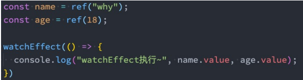

# Composition API 学习（二）

## 1.computed 属性

在前面我们讲解过计算属性 computed：当我们的某些属性是依赖其他状态时，我们可以使用计算属性来处理 ;

- 在前面的 Options API 中，我们是使用 computed 选项来完成的；
- 在 Composition API 中，我们可以在 setup 函数中使用 computed 方法来编写一个计算属性；

如何使用 computed 呢？

- 方式一：接收一个 getter 函数，并为 getter 函数返回的值，返回一个不变的 **ref 对象**；
- 方式二：接收一个具有 get 和 set 的对象，返回一个可变的（可读写）**ref 对象**；


```vue
<template>
  <div>
    <h2>{{ fullName }}</h2>
    <button @click="changeName">修改firstName</button>
  </div>
</template>

<script>
import { ref, computed } from "vue";

export default {
  setup() {
    const firstName = ref("Kobe");
    const lastName = ref("Bryant");

    // 1.用法一: 传入一个getter函数
    // computed的返回值是一个ref对象
    // const fullName = computed(() => firstName.value + " " + lastName.value);

    // 2.用法二: 传入一个对象, 对象包含getter/setter
    const fullName = computed({
      get: () => firstName.value + " " + lastName.value,
      set(newValue) {
        const names = newValue.split(" ");
        firstName.value = names[0];
        lastName.value = names[1];
      },
    });

    const changeName = () => {
      // firstName.value = "James"
      fullName.value = "coder why"; //这个地方的值修改不了, computed value is readonly
    };

    return {
      fullName,
      changeName,
    };
  },
};
</script>

<style scoped></style>
```

## 2.侦听数据的变化

在前面的 Options API 中，我们可以通过 watch 选项 来侦听 data 或者 props 的数据变化，当数据变化时执行某一些操作。

在 Composition API 中，我们可以使用 **watchEffect** 和 **watch** 来完成响应式数据的侦听；

- watchEffect 用于自动收集响应式数据的依赖；
- watch 需要手动指定侦听的数据源；

### 2.1 watchEffect

当侦听到某些响应式数据变化时，我们希望执行某些操作，这个时候可以使用 watchEffect。

我们来看一个案例：

- 首先，watchEffect 传入的函数会被立即执行一次，并且在执行的过程中会自动收集依赖；
- 其次，只有收集的依赖发生变化时，watchEffect 传入的函数才会再次执行；



```vue
<template>
  <div>
    <h2>{{ name }}-{{ age }}</h2>
    <button @click="changeName">修改name</button>
    <button @click="changeAge">修改age</button>
  </div>
</template>

<script>
import { ref, watchEffect } from "vue";

export default {
  setup() {
    // watchEffect: 自动收集响应式的依赖
    const name = ref("why");
    const age = ref(18);

    const changeName = () => (name.value = "kobe");
    const changeAge = () => age.value++;

    watchEffect(() => {
      console.log("name:", name.value, "age:", age.value);
    });

    return {
      name,
      age,
      changeName,
      changeAge,
    };
  },
};
</script>

<style scoped></style>
```

#### watchEffect 的停止侦听

- 如果在发生某些情况下，我们希望停止侦听，这个时候我们可以获取 watchEffect 的返回值函数，调用该函数即可。
- 比如在上面的案例中，我们 age 达到 20 的时候就停止侦听。


```vue
<template>
  <div>
    <h2>{{ name }}-{{ age }}</h2>
    <button @click="changeName">修改name</button>
    <button @click="changeAge">修改age</button>
  </div>
</template>

<script>
import { ref, watchEffect } from "vue";

export default {
  setup() {
    // watchEffect: 自动收集响应式的依赖
    const name = ref("why");
    const age = ref(18);

    const stop = watchEffect(() => {
      console.log("name:", name.value, "age:", age.value);
    });

    const changeName = () => (name.value = "kobe");
    const changeAge = () => {
      age.value++;
      if (age.value > 25) {
        stop(); //注意这里的watchEffect的返回值stop调用,停止监听
      }
    };

    return {
      name,
      age,
      changeName,
      changeAge,
    };
  },
};
</script>

<style scoped></style>
```

#### watchEffect 清除副作用

什么是清除副作用呢？

- 比如在开发中我们需要在侦听函数中执行网络请求，但是在网络请求还没有达到的时候，我们停止了侦听器， 或者侦听器 侦听函数 被再次执行了。
- 那么上一次的网络请求应该被取消掉，这个时候我们就可以清除上一次的副作用。

在我们给 watchEffect 传入的函数被回调时，其实可以获取到一个参数：onInvalidate

当**副作用即将重新执行** 或者 **侦听器被停止** 时会执行该函数传入的回调函数；

我们可以在传入的回调函数中，执行一些清楚工作；


```vue
<template>
  <div>
    <h2>{{ name }}-{{ age }}</h2>
    <button @click="changeName">修改name</button>
    <button @click="changeAge">修改age</button>
  </div>
</template>

<script>
import { ref, watchEffect } from "vue";

export default {
  setup() {
    // watchEffect: 自动收集响应式的依赖
    const name = ref("why");
    const age = ref(18);

    const stop = watchEffect((onInvalidate) => {
      const timer = setTimeout(() => {
        console.log("网络请求成功~");
      }, 2000);

      // 根据name和age两个变量发送网络请求
      onInvalidate(() => {
        // 在这个函数中清除额外的副作用
        // request.cancel()
        clearTimeout(timer);
        console.log("onInvalidate");
      });
      console.log("name:", name.value, "age:", age.value);
    });

    const changeName = () => (name.value = "kobe");
    const changeAge = () => {
      age.value++;
      if (age.value > 25) {
        stop();
      }
    };

    return {
      name,
      age,
      changeName,
      changeAge,
    };
  },
};
</script>
```

#### setup 中使用 ref

在讲解 watchEffect 执行时机之前，我们先补充一个知识：在 setup 中如何 使用 ref 或者元素或者组件？

其实非常简单，我们只需要定义一个 ref 对象，绑定到元素或者组件的 ref 属性上即可；


默认情况下，组件的更新会在副作用函数执行之前：

如果我们希望在副作用函数中获取到元素，是否可行呢？


我们会发现打印结果打印了两次：

- 这是因为 setup 函数在执行时就会立即执行传入的副作用函数，这个时候 DOM 并没有挂载，所以打印为 null；
- 而当 DOM 挂载时，会给 title 的 ref 对象赋值新的值，副作用函数会再次执行，打印出来对应的元素；

```vue
<template>
  <div>
    <h2 ref="title">萧兮,你好!</h2>
  </div>
</template>

<script>
import { ref, watchEffect } from "vue";

export default {
  setup() {
    const title = ref(null);

    watchEffect(() => {
      console.log(title.value);
    });

    return {
      title,
    };
  },
};
</script>

<style scoped></style>
```

#### 调整 watchEffect 的执行时机

如果我们希望在第一次的时候就打印出来对应的元素呢？

- 这个时候我们需要改变副作用函数的执行时机；
- 它的默认值是 pre，它会在**元素挂载** 或者**更新之前**执行；
- 所以我们会先打印出来一个空的，当依赖的 title 发生改变时，就会再次执行一次，打印出元素；

我们可以设置副作用函数的执行时机：


flush 选项还接受 sync，这将强制效果始终同步触发。然而，这是低效的，应该很少需要。

```vue
<template>
  <div>
    <h2 ref="title">萧兮,你好!</h2>
  </div>
</template>

<script>
import { ref, watchEffect } from "vue";

export default {
  setup() {
    const title = ref(null);

    watchEffect(
      () => {
        console.log(title.value);
      },
      {
        flush: "post",
      }
    );

    return {
      title,
    };
  },
};
</script>

<style scoped></style>
```

### 2.2 Watch 的使用

watch 的 API 完全等同于组件 watch 选项的 Property：

- watch 需要侦听特定的数据源，并在回调函数中执行副作用；
- 默认情况下它是**惰性**的，只有当被侦听的源发生变化时才会执行回调；

与 watchEffect 的比较，watch 允许我们：

- 懒执行副作用（第一次不会直接执行）；
- 更具体的说明当哪些状态发生变化时，触发侦听器的执行；
- 访问侦听状态变化前后的值；

#### 侦听单个数据源

watch 侦听函数的数据源有两种类型：

- 一个 getter 函数：但是该 getter 函数 **必须引用可响应式的对象**（比如 reactive 或者 ref）；
- 直接写入一个可响应式的对象，reactive 或者 ref（比较常用的是 ref）如果是一个 reactive 的对象的侦听，需要进行某些转换；


```vue
<template>
  <div>
    <h2 ref="title">{{ info.name }}</h2>
    <button @click="changeData">修改数据</button>
  </div>
</template>

<script>
import { ref, reactive, watch } from "vue";

export default {
  setup() {
    const info = reactive({ name: "why", age: 18 });

    // 1.侦听watch时,传入一个getter函数
    watch(
      () => info.name,
      (newValue, oldValue) => {
        console.log("newValue:", newValue, "oldValue:", oldValue);
      }
    );

    //------------------------------------------

    // 2.传入一个可响应式对象: reactive对象/ref对象

    // 情况一: reactive对象获取到的 newValue 和 oldValue 本身都是reactive对象

    // watch(info, (newValue, oldValue) => {
    //   console.log("newValue:", newValue, "oldValue:", oldValue); //这种情况,newValue与oldValue都是修改之后的值
    // })

    // 如果希望newValue和oldValue是一个普通的对象
    watch(
      () => ({ ...info }),
      (newValue, oldValue) => {
        console.log("newValue:", newValue, "oldValue:", oldValue); //这种情况,newValue与oldValue分别是修改前后的值
      }
    );

    // 情况二: ref对象获取到的 newValue 和 oldValue 是value值的本身

    const name = ref("why");
    watch(name, (newValue, oldValue) => {
      console.log("newValue:", newValue, "oldValue:", oldValue); //这里 不用.vlue 取到里面的值
    });

    const changeData = () => {
      info.name = "kobe";
    };

    return {
      changeData,
      info,
    };
  },
};
</script>

<style scoped></style>
```

#### 侦听多个数据源

侦听器还可以使用**数组**同时侦听多个源：


```vue
<template>
  <div>
    <h2 ref="title">{{ info.name }}</h2>
    <button @click="changeData">修改数据</button>
  </div>
</template>

<script>
import { ref, reactive, watch } from "vue";

export default {
  setup() {
    // 1.定义可响应式的对象
    const info = reactive({ name: "why", age: 18 });
    const name = ref("why");

    // 2.侦听器watch 这里...info 把reactive对象变为普通的对象
    watch(
      [() => ({ ...info }), name],
      ([newInfo, newName], [oldInfo, oldName]) => {
        console.log(newInfo, newName, oldInfo, oldName);
      }
    );

    const changeData = () => {
      info.name = "kobe";
      name.value = "gogogo";
    };

    return {
      changeData,
      info,
    };
  },
};
</script>

<style scoped></style>
```

#### watch 的选项

如果我们希望侦听一个深层的侦听，默认情况下可以深度监听,返回一个 reactive 对象。

如果对于解构出来的对象,是一个普通的对象,如果需要深度监听，那么依然需要 设置 deep 为 true;

```vue
<template>
  <div class="">{{ info.name }}</div>
  <button @click="changeData">修改数据</button>
</template>

<script>
import { reactive, watch, ref } from "vue";
export default {
  setup() {
    const info = reactive({
      name: "why",
      age: 18,
      friend: {
        nums: 99,
      },
    });
    const name = ref("萧兮");
    // watch 监听
    watch(
      () => ({ ...info }), //这个地方 无法监听到 nums的变化
      (newInfo, oldInfo) => {
        console.log("监听的数据: ", newInfo, oldInfo);
      },
      {} //传入的配置选项 deep 或者 immediate
    );
    const changeData = () => {
      info.friend.nums = 111;
    };
    return {
      info,
      changeData,
      name,
    };
  },
};
</script>
```

也可以传入 immediate 立即执行；


```vue
<template>
  <div>
    <h2 ref="title">{{ info.name }}</h2>
    <button @click="changeData">修改数据</button>
  </div>
</template>

<script>
import { ref, reactive, watch } from "vue";

export default {
  setup() {
    // 1.定义可响应式的对象
    const info = reactive({
      name: "why",
      age: 18,
      friend: {
        name: "kobe",
      },
    });

    // 2.侦听器watch
    watch(
      () => ({ ...info }),
      (newInfo, oldInfo) => {
        console.log(newInfo, oldInfo);
      },
      {
        deep: true,
        immediate: true,
      }
    );

    const changeData = () => {
      info.friend.name = "james";
    };

    return {
      changeData,
      info,
    };
  },
};
</script>

<style scoped></style>
```
