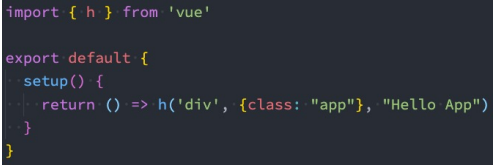

# Composition API 学习（三）

## 1.生命周期钩子

我们前面说过 setup 可以用来替代 data 、 methods 、 computed 、watch 等等这些选项，也可以替代生命周期钩子。

那么 setup 中如何使用生命周期函数呢？

- 可以使用直接导入的 onXXX 函数注册生命周期钩子；


因为 setup 是在 beforeCreate 和 created 生命周期钩子**之前**运行的，所以不需要显式地定义它们。换句话说，在这些钩子中编写的任何代码都应该直接在 setup 函数中编写。

```vue
<template>
  <div>
    <button @click="increment">{{ counter }}</button>
  </div>
</template>

<script>
import { onBeforeMount, onMounted, onUpdated, onUnmounted, ref } from "vue";

export default {
  setup() {
    const counter = ref(0);
    const increment = () => counter.value++;
    //生命周期函数在setup里面的写法
    onBeforeMount(() => {
      console.log("App BeforeMount");
    });
    //注意在这里,生命周期可以使用多次.(主要是为了方便我们把生命周期里面的逻辑抽取到hook里面)
    onMounted(() => {
      console.log("App Mounted1");
    });
    onMounted(() => {
      console.log("App Mounted2");
    });
    onUpdated(() => {
      console.log("App onUpdated");
    });
    onUnmounted(() => {
      console.log("App onUnmounted");
    });

    return {
      counter,
      increment,
    };
  },
};
</script>

<style scoped></style>
```

## 2.Provide 函数

事实上我们之前还学习过 Provide 和 Inject，CompositioAPI 也可以替代之前的 Provide 和 Inject 的选项。

我们可以通过 provide 来提供数据：

- 可以通过 provide 方法来定义每个 Property；

- provide 可以传入两个参数：

  - name：提供的属性名称；

  - value：提供的属性值；


为了增加 provide 值和 inject 值之间的响应性，我们可以在 provide 值时使用 ref 和 reactive。


如果我们需要修改可响应的数据，那么最好是在数据提供的位置来修改：

我们可以将修改方法进行共享，在后代组件中进行调用；


## 3.Inject 函数

在 后代组件 中可以通过 inject 来注入需要的属性和对应的值：

- 可以通过 inject 来注入需要的内容；
- inject 可以传入两个参数：
  - 要 inject 的 property 的 name；
  - 默认值；


`App.vue`

```vue
<template>
  <div class="">App组件: 展示counter :{{ counter }}</div>
  <button @click="increment">按钮值+1</button>
  <hr />
  <Home></Home>
</template>

<script>
import { provide, ref, readonly } from "vue";
import Home from "./Home.vue";
export default {
  components: {
    Home,
  },
  setup() {
    const name = ref("codewhy");
    let counter = ref(100);
    provide("name", readonly(name));
    provide("counter", readonly(counter));

    const increment = () => {
      return counter.value++;
    };

    //共享修改数据的方法
    const changeInfo = (val) => {
      counter.value += val;
    };
    provide("changeInfo", changeInfo);

    return {
      counter,
      name,
      increment,
    };
  },
};
</script>

<style lang="" scope></style>
```

`Home.vue`

```vue
<template>
  <div class="">Home组件</div>
  <h2>{{ name }}--{{ counter }}</h2>
  <button @click="homeIncrement">Home按钮+1</button>
  <button @click="changeInfo(66)">使用父组件提供的方法修改</button>
</template>

<script>
import { inject } from "vue";
export default {
  setup() {
    const name = inject("name", "默认值");
    const counter = inject("counter", "默认值");

    const changeInfo = inject("changeInfo");

    const homeIncrement = () => counter.value++;

    return { name, counter, homeIncrement, changeInfo };
  },
};
</script>

<style lang="" scope></style>
```

## 4.自定义 hook 函数

### 4.1 userCounter

案例: 计数器案例。


`App.vue`

```vue
<template>
  <h2>当前计数: {{ counter }}</h2>
  <h2>计数*2: {{ doubleCounter }}</h2>
  <button @click="increment">+1</button>
  <button @click="decrement">-1</button>
</template>

<script>
import useCounter from "./hook/useCounter";
export default {
  setup() {
    const { counter, doubleCounter, increment, decrement } = useCounter();

    return { counter, doubleCounter, increment, decrement };
  },
};
</script>

<style lang="" scope></style>
```

`hook/useCounter.js`

```js
import { ref, computed } from "vue";

export default function () {
  let counter = ref(0);
  let doubleCounter = computed(() => counter.value * 2);

  const increment = () => counter.value++;
  const decrement = () => counter.value--;

  return {
    counter,
    doubleCounter,
    increment,
    decrement,
  };
}
```

### 4.2 useTitle

案例: 修改网页标题 title 。

`App.vue`

```vue
<template>
  <div class="">组件</div>
</template>

<script>
import useTitle from "./hook/useTitle";
export default {
  setup() {
    const { titleRef } = useTitle("哈哈哈");
    setTimeout(() => {
      titleRef.value = "萧兮";
    }, 3000);
    return { titleRef };
  },
};
</script>

<style lang="" scope></style>
```

`useTitle.js`

```js
import { ref, watch } from "vue";
export default function (title = "默认值标题") {
  const titleRef = ref(title); //ref对象

  watch(
    titleRef,
    (newVal) => {
      document.title = newVal;
    },
    { immediate: true }
  );
  return {
    titleRef,
  };
}
```

### 4.3 useScrollPosition

案例: 鼠标滚动距离监听

`App.vue`

```vue
<template>
  <div class="">App3组件</div>
  <div class="box">
    <h3>scroll-X: {{ scrollX }}</h3>
    <h3>scroll-y: {{ scrollY }}</h3>
  </div>
</template>

<script>
import useScrollPosition from "./hook/useScrollPosition";
export default {
  setup() {
    const { scrollX, scrollY } = useScrollPosition();

    return { scrollX, scrollY };
  },
};
</script>

<style lang="css" scope>
body {
  width: 3000px;
  height: 5000px;
}
.box {
  position: fixed;
  bottom: 30px;
  right: 30px;
}
</style>
```

`useScrollPosition.js`

```js
import { ref } from "vue";
export default function () {
  // 滑动位置
  const scrollX = ref(0);
  const scrollY = ref(0);

  // 监听文档滚动
  document.addEventListener("scroll", () => {
    scrollX.value = window.scrollX.toFixed(2);
    scrollY.value = window.scrollY.toFixed(2);
  });
  return { scrollX, scrollY };
}
```

### 4.4 useMousePosition

案例: 鼠标位置移动

`App.vue`

```vue
<template>
  <div class="">App3组件</div>
  <div class="mouse">
    <div class="mouse-x">mouseX: {{ mouseX }}</div>
    <div class="mouse-y">mouseY: {{ mouseY }}</div>
  </div>
</template>

<script>
import useMousePosition from "./hook/useMousePosition";
export default {
  setup() {
    const { mouseX, mouseY } = useMousePosition();
    return { mouseX, mouseY };
  },
};
</script>

<style lang="css" scope>
body {
  width: 3000px;
  height: 5000px;
}
.mouse {
  position: fixed;
  bottom: 30px;
  right: 30px;
}
</style>
```

`useMousePosition.js`

```js
import { ref } from "vue";
export default function () {
  let mouseX = ref(0);
  let mouseY = ref(0);

  window.addEventListener("mousemove", (event) => {
    mouseX.value = event.pageX;
    mouseY.value = event.pageY;
  });
  return { mouseX, mouseY };
}
```


### 4.5 useLocalStorage

案例: 本地存储

`App.vue`

```vue
<template>
  <div class="">组件</div>
  <h2>{{ name }}</h2>
  <button @click="changeName">修改name</button>
</template>

<script>
import useLocalStorage from "./hook/useLocalStorage";
export default {
  setup() {
    let name = useLocalStorage("name", "萧兮");
    let changeName = () => (name.value = "哈哈哈");
    return { name, changeName };
  },
};
</script>
```

`useLocalStorage.js`

```js
// 一个参数：取值
//二个参数：保存值
import { ref, watch } from "vue";
export default function (key, value) {
  let data = ref(value); //响应式data

  if (value) {
    window.localStorage.setItem(key, JSON.stringify(value));
  } else {
    data.value = JSON.parse(window.localStorage.getItem(key));
  }

  //   监听data改变
  watch(data, (newVal) => {
    window.localStorage.setItem(key, JSON.stringify(newVal));
  });
  return data;
}
```

## 5.setup 顶层编写方式

```vue
<script setup>
//组件直接导入就行，不需要注册
import Home from "./Home.vue";
import { ref } from "vue";

//变量和方法不需要使用return 返回
const counter = ref(100);

const getCounter = (val) => {
  counter.value = val;
};
</script>
```

案例: 父子组件传值

`App.vue父组件`

```vue
<template>
  <div class="">
    <h2>当前计数: {{ counter }}</h2>
    <button @click="increment">+1</button>
    <hr />
    <Home message="萧兮大大" @increment="getCounter"></Home>
  </div>
</template>

<script setup>
import { ref } from "vue";
// 加载组件
import Home from "./Home.vue";

const counter = ref(0);
const increment = () => counter.value++;

const getCounter = (payload) => {
  counter.value += payload;
};
</script>
```

`Home.vue子组件`

```vue
<template>
  <div class="">Home组件--{{ message }}</div>
  <button @click="sendEvent">发射事件</button>
</template>

<script setup>
import { defineProps, defineEmits } from "vue";

const props = defineProps({
  message: {
    type: String,
    default: "默认值",
  },
});

const emit = defineEmits(["increment"]);

const sendEvent = () => {
  emit("increment", 66);
};
</script>
```

## 6.认识 h 函数

Vue 推荐在绝大数情况下**使用模板**来创建你的 HTML，然后一些特殊的场景，你真的需要**JavaScript 的完全编程的能力**，这个时候你可以使用**渲染函数** ，它**比模板更接近编译器**；

- 前面我们讲解过 VNode 和 VDOM 的改变：
- Vue 在生成真实的 DOM 之前，会将我们的节点转换成 VNode，而 VNode 组合在一起形成一颗树结构，就是虚拟 DOM（VDOM）；
- 事实上，我们之前编写的 template 中的 HTML 最终也是使用渲染函数生成对应的 VNode；
- 那么，如果你想充分的利用 JavaScript 的编程能力，我们可以自己来编写 createVNode 函数，生成对应的 VNode；

那么我们应该怎么来做呢？**使用 h()函数**：

- h() 函数是一个用于创建 vnode 的一个函数；
- 其实准备的命名是 createVNode() 函数，但是为了简便，在 Vue 中将之简化为 h() 函数；

### 6.1.h()函数 如何使用呢？

h() 函数 如何使用呢？它接受三个参数：


**注意事项：**

- 如果没有 props，那么通常可以将 children 作为第二个参数传入；
- 如果会产生歧义，可以将 null 作为第二个参数传入，将 children 作为第三个参数传入；

```vue
<script>
import { h } from "vue";
export default {
  render() {
    return h("h2", { class: "title" }, "hello render");
  },
};
</script>
```

### 6.2.h 函数可以在两个地方使用:

- render 函数选项中；
- setup 函数选项中（setup 本身需要是一个函数类型，函数再返回 h 函数 创建的 VNode）；




### 6.3.h 函数计数器案例


或者直接使用 setup 函数 里面返回 h 函数 的方式也是可以实现的。


### 6.4.h 函数组件和插槽的使用


`app.vue 父组件`

```vue
<script>
import { h } from "vue";
import HelloWorld from "./HelloWorld.vue";

export default {
  render() {
    returh("div", null, [
      h(HelloWorld, null, {
        default: (props) =>
          h("span", null, `app传入到HelloWorld中的内容: ${props.name}`),
      }),
    ]);
  },
};
</script>

<style scoped></style>
```

`HelloWorld.vue 子组件`

```vue
<script>
import { h } from "vue";

export default {
  render() {
    returh("div", null, [
      h("h2", null, "Hello World"),
      this.$slots.default
        ? this.$slots.default({ name: "coderwhy" })
        : h("span", null, "我是HelloWorld的插槽默认值"),
    ]);
  },
};
</script>

<style lang="scss" scoped></style>
```

## 7.vue 使用 jsx 语法

如果我们希望**在项目中使用 jsx**，直接在 render 函数中书写 jsx 语法 就可以了。

- jsx 我们通常会通过 Babel 来进行转换（React 编写的 jsx 就是通过 babel 转换的）；
- 对于 Vue 来说，里面已经集成了对 jsx 的支持；

`app.vue 父组件`

```react
<script>
import HelloWorld from "./HelloWorld.vue";
import { ref } from "vue";
export default {
  //   data() {
  //     return {
  //       counter: 0,
  //     };
  //   },
  setup() {
    let counter = ref(0);

    const increment = () => counter.value++;
    const decrement = () => counter.value--;
    return {
      counter,
      increment,
      decrement,
    };
  },
  render() {
    return (
      <div>
        <div>
          <h2>当前计数: {this.counter}</h2>
          <button onClick={this.increment}>+1</button>
          <button onClick={this.decrement}>-1</button>
        </div>
        <hr />
        <HelloWorld>
          <button>我是按钮</button>
        </HelloWorld>
      </div>
    );
  },
};
</script>
```

`HelloWorld.vue 子组件`

```react
<script>
export default {
  render() {
    return (
      <div>
        <h2>HelloWorld组件</h2>
        {this.$slots.default ? this.$slots.default({ name: "helloworld的属性值" }) : <span>默认值</span>}
      </div>
    );
  },
};
</script>
```

## 8.认识自定义指令

在 Vue 的模板语法中我们学习过各种各样的指令：v-show、v-for、v-model 等等，除了使用这些指令之外，**Vue 也允许我们来自定义自己的指令**。

- 注意：在 Vue 中，代码的复用和抽象主要还是通过组件；
- 通常在某些情况下，你需要对 DOM 元素进行底层操作，这个时候就会用到自定义指令；

自定义指令分为两种：

- **自定义局部指令**：组件中通过 directives 选项，只能在当前组件中使用；
- **自定义全局指令**：app 的 directive 方法，可以在任意组件中被使用；

比如我们来做一个非常简单的案例：当某个元素挂载完成后可以自动获取焦点 。

- 实现方式一：如果我们使用默认的实现方式；
- 实现方式二：自定义一个 v-focus 的局部指令；
- 实现方式三：自定义一个 v-focus 的全局指令；

### 8.1 方式一：聚焦的默认实现

```vue
<template>
  <div>
    <input type="text" ref="input" />
  </div>
</template>

<script>
import { ref, onMounted } from "vue";

export default {
  setup() {
    const input = ref(null);

    onMounted(() => {
      console.log(input.value);
      input.value.focus();
    });

    return {
      input,
    };
  },
};
</script>

<style scoped></style>
```

### 8.2 方式二：局部自定义指令

实现方式二：自定义一个 **v-focus** 的局部指令

- 这个自定义指令实现非常简单，我们只需要在组件选项中使用 directives 即可；
- 它是一个对象，在对象中编写我们自定义指令的名称（注意：这里不需要加 v- ）；
- 自定义指令有一个生命周期，是在组件挂载后调用的 mounted，我们可以在其中完成操作；

```vue
<template>
  <div>
    <input type="text" v-focus />
  </div>
</template>

<script>
export default {
  // 局部自定义指令
  directives: {
    focus: {
      mounted(el, bindings, vnode, preVnode) {
        console.log("挂载钩子函数");
        el.focus();
      },
    },
  },
};
</script>
```

### 8.3 方式三：自定义全局指令

自定义一个**全局的 v-focus 指令**可以让我们在任何地方直接使用，在`main.js`里面

```js
import { createApp } from "vue";
import App from "./11-自定义指令/App.vue";

const app = createApp(App);

app.directive("focus", {
  mounted(el, bindings, vnode, preVnode) {
    console.log("App挂载钩子函数");
    el.focus();
  },
});

app.mount("#app");
```

### 8.4 指令的生命周期

一个指令定义的对象，Vue 提供了 如下 的几个钩子函数：

- created：在绑定元素的 attribute 或事件监听器被应用之前调用；
- beforeMount：当指令第一次绑定到元素并且在挂载父组件之前调用；
- mounted：在绑定元素的父组件被挂载后调用；
- beforeUpdate：在更新包含组件的 VNode 之前调用；
- updated：在包含组件的 VNode 及其子组件的 VNode 更新后调用；
- beforeUnmount：在卸载绑定元素的父组件之前调用；
- unmounted：当指令与元素解除绑定且父组件已卸载时，只调用一次；

案例:


### 8.5 指令的参数和修饰符

如果我们指令需要接受 一些参数 或者 修饰符 应该如何操作呢？

- info 是参数的名称；
- aaa-bbb 是修饰符的名称；
- 后面是传入的具体的值；

在我们的生命周期中，我们可以通过 bindings 获取到对应的内容：


```vue
<template>
  <div>
    <input type="text" v-why:info.aaa.bbb="{ name: '萧兮', age: 18 }" />
  </div>
</template>

<script>
export default {
  // 局部自定义指令
  directives: {
    why: {
      mounted(el, bindings, vnode, preVnode) {
        console.log("挂载钩子函数");
        console.log(bindings.arg);
        console.log(bindings.value);
        console.log(bindings.modifiers);
      },
    },
  },
};
</script>

<style scoped></style>
```

### 8.6 自定义指令练习

自定义指令案例：时间戳的显示需求：

- 在开发中，大多数情况下从服务器获取到的都是时间戳；
- 我们需要将时间戳转换成具体格式化的时间来展示；
- 在 Vue2 中我们可以通过过滤器来完成；
- 在 Vue3 中我们可以通过 计算属性（computed） 或者 自定义一个方法（methods） 来完成；
- 其实我们还可以通过一个自定义的指令来完成；

我们来实现一个可以自动对时间格式化的指令 v-format-time。

- 这里我封装了一个函数，在首页中我们只需要调用这个函数并且传入 app 即可；


`index.js`

```js
import registerFormatTime from "./format-time";

// 默认出口
export default function registerDirectives(app) {
  registerFormatTime(app);
}
```

`format-time.js`

```js
import dayjs from "dayjs"; //第三方dayjs格式化时间库

export default function (app) {
  app.directive("format-time", {
    mounted(el, bindings, vnode, preVnode) {
      let formatString = bindings.value; //获取用户传入的格式化时间格式
      if (!formatString) {
        formatString = "YYYY/MM/DD HH:mm:ss";
      }
      const textContent = el.textContent;
      let timestamp = parseInt(textContent); //转成int类型
      if (textContent.length === 10) {
        //10位是秒钟,13位是毫秒
        timestamp *= 1000;
      }
      el.textContent = dayjs(timestamp).format(formatString);
    },
  });
}
```

`App1.vue`

```vue
<template>
  <div v-format-time="'YYYY-MM-DD'">{{ timestamp }}</div>
</template>

<script>
export default {
  setup() {
    const timestamp = "1665153303";
    return { timestamp };
  },
};
</script>

<style lang="" scope></style>
```

## 9.认识 Teleport

在组件化开发中，我们封装一个组件 A，在另外一个组件 B 中使用：

- 那么组件 A 中 template 的元素，会被挂载到组件 B 中 template 的某个位置；
- 最终我们的应用程序会形成一颗 DOM 树结构；

但是某些情况下，我们希望组件不是挂载在这个组件树上的，可能是移动到 Vue app 之外的其他位置：

- 比如移动到 body 元素上，或者我们有其他的 div#app 之外的元素上；
- 这个时候我们就可以通过 teleport 来完成；

Teleport 是什么呢？

- 它是一个 Vue 提供的内置组件，类似于 react 的 Portals；
- teleport 翻译过来是心灵传输、远距离运输的意思；

它有两个属性：

- to：指定将其中的内容移动到的目标元素，可以使用选择器；
- disabled：是否禁用 teleport 的功能；


这样他就会挂载到 public.html， #why 的这一个 div 上,原来的组件 app 里面的数据就没有了。


### 9.1 多个 teleport

如果我们将多个 teleport 应用到同一个目标上（to 的值相同），那么这些目标会进行合并：


`App.vue`

```vue
<template>
  <div class="box">
    <teleport to="#why">
      <div class="">teleport组件</div>
      <h2>当前计数: {{ counter }}</h2>
      <button @click="increment">+1</button>
      <Home></Home>
    </teleport>

    <teleport to="#why">
      <span>哈哈哈哈</span>
    </teleport>
  </div>
</template>

<script>
import { ref } from "vue";
import Home from "./Home.vue"; //子组件
export default {
  components: {
    Home,
  },
  setup() {
    const counter = ref(0);
    const increment = () => {
      counter.value++;
    };
    return { counter, increment };
  },
};
</script>
```

`Home.vue`

```vue
<template>
  <div class="">Home组件</div>
</template>

<script>
import {} from "vue";
export default {
  setup() {
    return {};
  },
};
</script>

<style lang="" scope></style>
```


### 9.2 认识 Vue 插件

通常我们向 Vue 全局添加一些功能时，会采用插件的模式，它有两种编写方式：

- 对象类型：一个对象，但是必须包含一个 install 的函数，该函数会在安装插件时执行；
- 函数类型：一个 function，这个函数会在安装插件时自动执行；

插件可以**完成的功能没有限制**，比如下面的几种都是可以的：

- 添加全局方法 或者 属性`(约定俗称的是属性名称前面加上$，区分其他组件属性名称)`，通过把它们添加到 config.globalProperties 上实现；
- 添加全局资源：指令/过滤器/过渡 等；
- 通过全局 mixin 来添加一些组件选项；
- 一个库，提供自己的 API，同时 提供上面提到的一个或多个功能；

**插件的编写方式**


在`main.js`里面挂载插件:

```js
import { createApp } from "vue";
import App from "./11-自定义指令/App1.vue";

import pluginsObject from "./13-vue插件的使用/plugins.object"; //导入插件

const app = createApp(App);

app.use(pluginsObject); //自动安装插件(内部帮我们执行install函数)

app.mount("#app");
```

然后在要使用的`app.vue`组件里面:

导入组件实例: `import { getCurrentInstance } from "vue";`


