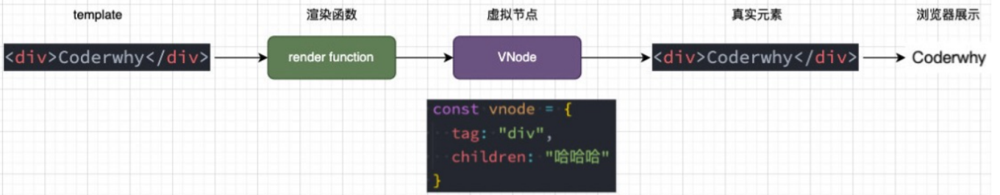

# Vue3 源码学习

## 1.真实的 DOM 渲染

我们传统的前端开发中，我们是编写自己的 HTML，最终被渲染到浏览器上的，那么它是什么样的过程呢？


## 2.虚拟 DOM 的优势

- 目前框架都会引入虚拟 DOM 来对真实的 DOM 进行抽象，这样做有很多的好处：

- 首先是可以对真实的元素节点进行抽象，抽象成 VNode（虚拟节点），这样方便后续对其进行各种操作：
  - 因为对于直接操作 DOM 来说是有很多的限制的，比如 diff、clone 等等，但是使用 JavaScript 编程语言来操作这 些，就变得非常的简单；
  - 我们可以使用 JavaScript 来表达非常多的逻辑，而对于 DOM 本身来说是非常不方便的；
- 其次是方便实现跨平台，包括你可以将 VNode 节点渲染成任意你想要的节点 ；
  - 如渲染在 canvas、WebGL、SSR、Native（iOS、Android）上；
  - 并且 Vue 允许你开发属于自己的渲染器（renderer），在其他的平台上渲染；

### 2.1.虚拟 DOM 的渲染过程




### 2.2.三大核心系统

事实上 Vue 的源码包含三大核心：

- Compiler 模块：编译模板系统；
- Runtime 模块：也可以称之为 Renderer 模块，真正渲染的模块；
- Reactivity 模块：响应式系统；


### 2.3.三大系统协同工作


## 3.实现 Mini-Vue

这里我们实现一个简洁版的 Mini-Vue 框架，该 Vue 包括三个模块：

- 渲染系统模块；
- 可响应式系统模块；
- 应用程序入口模块；

### 3.1.渲染系统实现

渲染系统，该模块主要包含三个功能：

- 功能一：h 函数，用于返回一个 VNode 对象；
- 功能二：mount 函数，用于将 VNode 挂载到 DOM 上；
- 功能三：patch 函数，用于对两个 VNode 进行对比，决定如何处理新的 VNode；

### 3.2.h 函数 – 生成 VNode

```js
// 1.通过h函数来创建一个vnode
const vnode = h("div", { class: "why", id: "aaa" }, [
  h("h2", null, "当前计数: 100"),
  h("button", { onClick: function () {} }, "+1"),
]); // vdom
```


### 3.3.Mount 函数 – 挂载 VNode

mount 函数的实现：

- 第一步：根据 tag，创建 HTML 元素，并且存储到 vnode 的 el 中；
- 第二步：处理 props 属性；
  - 如果以 on 开头，那么监听事件；
  - 普通属性直接通过 setAttribute 添加即可；
- 第三步：处理子节点 ；
  - 如果是字符串节点，那么直接设置 textContent；
  - 如果是数组节点，那么遍历调用 mount 函数；

```js
// 2.通过mount函数, 将vnode挂载到div#app上
mount(vnode, document.querySelector("#app"));
```

```js
const mount = (vnode, container) => {
  // vnode -> element
  // 1.创建出真实的原生, 并且在vnode上保留el
  const el = (vnode.el = document.createElement(vnode.tag));

  // 2.处理props
  if (vnode.props) {
    for (const key in vnode.props) {
      const value = vnode.props[key];

      if (key.startsWith("on")) {
        // 对事件监听的判断
        el.addEventListener(key.slice(2).toLowerCase(), value);
      } else {
        el.setAttribute(key, value);
      }
    }
  }

  // 3.处理children
  if (vnode.children) {
    if (typeof vnode.children === "string") {
      el.textContent = vnode.children;
    } else {
      vnode.children.forEach((item) => {
        mount(item, el);
      });
    }
  }

  // 4.将el挂载到container上
  container.appendChild(el);
};
```

### 3.4.Patch 函数 – 对比两个 VNode

patch 函数的实现，分为两种情况

(1) n1 和 n2 是不同类型的节点：

- 找到 n1 的 el 父节点，删除原来的 n1 节点的 el；
- 挂载 n2 节点到 n1 的 el 父节点上；

(2) n1 和 n2 节点是相同的节点：

**1.处理 props 的情况**

- 先将新节点的 props 全部挂载到 el 上；
- 判断旧节点的 props 是否不需要在新节点上，如果不需要，那么删除对应的属性；

**2.处理 children 的情况**

- 如果新节点是一个字符串类型，那么直接调用 el.textContent = newChildren；
- 如果新节点不是一个字符串类型：

​ 旧节点是一个字符串类型。

​ 将 el 的 textContent 设置为空字符串；

​ 旧节点是一个字符串类型，那么直接遍历新节点，挂载到 el 上；

​ 旧节点也是一个数组类型 。

​ 取出数组的最小长度；

​ 遍历所有的节点，新节点和旧节点进行 path 操作；

​ 如果新节点的 length 更长，那么剩余的新节点进行挂载操作；

​ 如果旧节点的 length 更长，那么剩余的旧节点进行卸载操作；

### 3.5.Patch 的实现


### 3.6.依赖收集系统


