# VueRouter 路由使用

## 1.认识前端路由

路由其实是网络工程中的一个术语：

- 在架构一个网络时，非常重要的两个设备就是 路由器 和 交换机。
- 当然，目前在我们生活中路由器也是越来越被大家所熟知，因为我们生活中都会用到路由器：
- 事实上，路由器主要维护的是一个映射表；
- 映射表会决定数据的流向；

路由的概念在软件工程中出现，最早是在后端路由中实现的，原因是 web 的发展主要经历了这样一些阶段：

- 后端路由阶段；
- 前后端分离阶段；
- 单页面富应用（SPA）；

### 1.1 后端路由阶段

早期的网站开发整个 HTML 页面是由服务器来渲染的。

- 服务器直接生产渲染好对应的 HTML 页面, 返回给客户端进行展示。

但是, 一个网站, 这么多页面，服务器如何处理呢 ?

- 一个页面有自己对应的网址, 也就是 URL；
- URL 会发送到服务器, 服务器会通过**正则对该 URL 进行匹配**, 并且最后交给一个 Controller 进行处理；
- Controller 进行各种处理, 最终生成 HTML 或者数据, 返回给前端.

上面的这种操作, 就是**后端路由**：

- 当我们页面中需要请求不同的路径内容时, 交给服务器来进行处理, 服务器渲染好整个页面, 并且将页面返回给客户端.
- 这种情况下渲染好的页面, 不需要单独加载任何的 js 和 css, 可以直接交给浏览器展示, 这样也有利于 SEO 的优化.

后端路由的缺点:

- 一种情况是整个页面的模块由后端人员来编写和维护的,要做的事情非常多；
- 另一种情况是前端开发人员如果要开发页面, 需要通过 PHP 和 Java 等语言来编写页面代码；
- 而且通常情况下 HTML 代码和数据以及对应的逻辑会混在一起, 编写和维护都是非常糟糕的事情；

### 1.2 前后端分离阶段

前端渲染的理解：

- 每次请求涉及到的静态资源都会从静态资源服务器获取，这些资源包括 HTML+CSS+JS，然后在前端对这些请 求回来的资源进行渲染；
- 需要注意的是，客户端的每一次请求，都会从静态资源服务器请求文件；
- 同时可以看到，和之前的后端路由不同，这时后端只是负责提供 API 了；

前后端分离阶段：

- 随着 Ajax 的出现, 有了前后端分离的开发模式；
- 后端只提供 API 来返回数据，前端通过 Ajax 获取数据，并且可以通过 JavaScript 将数据渲染到页面中；
- 这样做最大的优点就是前后端责任的清晰，后端专注于数据上，前端专注于交互和可视化上；
- 并且当移动端(iOS/Android)出现后，后端不需要进行任何处理，依然使用之前的一套 API 即可；

## 2.URL 的 hash

先看一下在原生 HTML 网页上，如何使用 hash 模式。

```html
<!DOCTYPE html>
<html lang="en">
  <head>
    <meta charset="UTF-8" />
    <meta http-equiv="X-UA-Compatible" content="IE=edge" />
    <meta name="viewport" content="width=device-width, initial-scale=1.0" />
    <title>hash模式页面</title>
  </head>
  <body>
    <div id="app">
      <a href="#/home">home</a>
      <a href="#/about">about</a>
      <hr />
      <div class="content">Default</div>
    </div>
    <script>
      const contentEl = document.querySelector(".content");
      window.addEventListener("hashchange", () => {
        console.log(location.hash);
        switch (location.hash) {
          case "#/home":
            contentEl.textContent = "home页面";
            break;
          case "#/about":
            contentEl.textContent = "about页面";
            break;
          default:
            contentEl.textContent = "default";
            break;
        }
      });
    </script>
  </body>
</html>
```

前端路由是如何做到 URL 和内容进行映射呢？监听 URL 的改变。

- URL 的 hash 也就是 锚点(#), 本质上是改变 window.location 的 href 属性值；
- 我们可以通过直接赋值 location.hash 来改变 href , 并且页面不发生刷新；

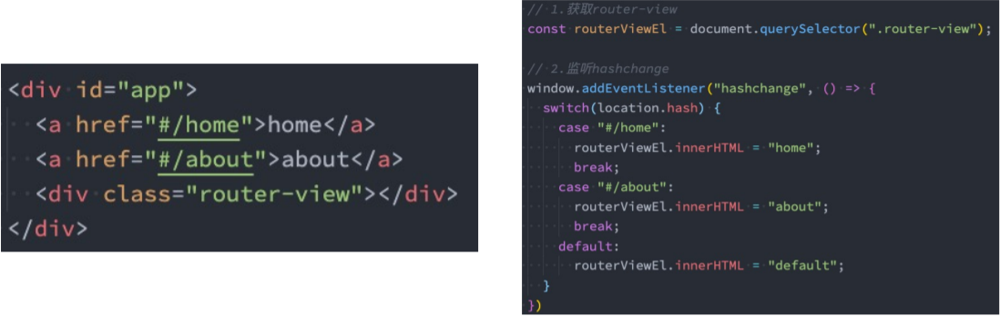

hash 的优势就是兼容性更好，在老版 IE 中都可以运行，但是缺陷是有一个 #，显得不像一个真实的路径。

## 3.HTML5 的 history

history 接口 是 HTML5 新增的, 它有六种模式 改变 URL 而不刷新页面：

- replaceState：替换原来的路径； ( 替换当前路径，不会记录浏览器历史记录 )
- pushState：使用新的路径； （浏览器历史记录入栈，会记录历史记录）
- popState：路径的回退； （点击浏览器的回退按钮,触发的事件）
- go：向前或向后改变路径；
- forward：向前改变路径；
- back：向后改变路径；

HTML5 的 History 在 HTML 网页上的演练:

```html
<!DOCTYPE html>
<html lang="en">
  <head>
    <meta charset="UTF-8" />
    <meta http-equiv="X-UA-Compatible" content="IE=edge" />
    <meta name="viewport" content="width=device-width, initial-scale=1.0" />
    <title>history页面</title>
  </head>
  <body>
    <div id="app">
      <a href="/home">home</a>
      <a href="/about">about</a>
      <div class="content">Default</div>
    </div>

    <script>
      const contentEl = document.querySelector(".content");
      const aEls = document.getElementsByTagName("a");

      //路由页面切换函数
      const changeContent = () => {
        switch (location.pathname) {
          case "/home":
            contentEl.innerHTML = "Home";
            break;
          case "/about":
            contentEl.innerHTML = "About";
            break;
          default:
            contentEl.innerHTML = "Default";
        }
      };

      for (let aEl of aEls) {
        aEl.addEventListener("click", (e) => {
          e.preventDefault();
          const href = aEl.getAttribute("href");
          history.pushState({}, "", href);
          // history.replaceState({}, "", href);

          changeContent();
        });
      }

      window.addEventListener("popstate", changeContent); //点击浏览器的回退按钮,触发的事件
    </script>
  </body>
</html>
```

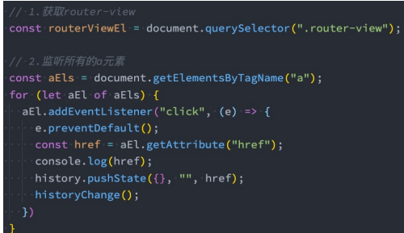

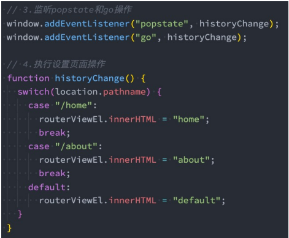

## 4.认识 vue-router

目前 前端流行的三大框架, 都有自己的路由实现:

- Angular 的 ngRouter
- React 的 ReactRouter
- Vue 的 vue-router

Vue Router 是 Vue.js 的官方路由。它与 Vue.js 核心深度集成，让用 Vue.js 构建单页应用变得非常容易。

- 目前 Vue 路由最新的版本是 4.x 版本，我们上课会基于最新的版本讲解。

vue-router 是基于路由和组件的 。

- 路由用于设定访问路径, 将路径和组件映射起来.
- 在 vue-router 的单页面应用中, **页面的路径的改变就是组件的切换。**

安装 Vue Router：

```js
npm install vue-router
```

### 4.1 路由的使用步骤

使用 vue-router 的步骤：

- 第一步：创建路由组件的组件；
- 第二步：配置路由映射：组件和路径映射关系的 routes 数组；
- 第三步：通过 createRouter 创建路由对象，并且传入 routes 和 history 模式；
- 第四步：使用路由：通过\<router-link> 和 \<router-view>；

目录结构:


`router/index.js`

```js
import Home from "../pages/Home.vue";
import About from "../pages/About.vue";
import {
  createRouter,
  createWebHashHistory,
  createWebHistory,
} from "vue-router";
// 路由映射关系
const routes = [
  { path: "/home", component: Home },
  { path: "/about", component: About },
];

// 创建一个路由对象router
const router = createRouter({
  routes,
  history: createWebHashHistory(),
});

export default router;
```

`main.js`

```js
//注册vue-router 插件
import { createApp } from "vue";
import router from "./router";
import App from "./App.vue";

const app = createApp(App);

// 安装插件
app.use(router);

app.mount("#app");
```

`App.vue`

```vue
<template>
  <h2>App首页</h2>

  <!-- 页面切换按钮(内部实际转成了a标签) -->
  <button>
    <router-link to="/home">首页</router-link>
  </button>
  <button>
    <router-link to="/about">关于</router-link>
  </button>

  <div>
    <div>哈哈哈</div>
    <hr />
    <!-- 路由占位符 -->
    <router-view></router-view>
    <hr />
    <div>呵呵呵</div>
  </div>
</template>

<script>
export default {
  name: "App",
};
</script>
```

路由的基本使用流程

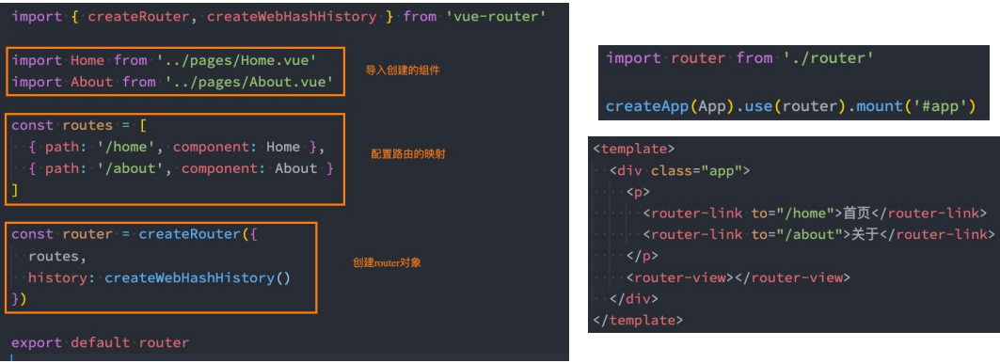

### 4.2 路由的默认路径

我们这里还有一个不太好的实现:

- 默认情况下, 进入网站的首页, 我们希望渲染首页的内容；
- 但是我们的实现中, 默认没有显示首页组件, 必须让用户点击才可以；

如何可以让路径默认跳到到首页, 并且渲染首页组件呢?

```js
const routes = [
  { path: "/", redirect: "/home" }, //重定向操作
  { path: "/home", component: Home },
  { path: "/about", component: About },
];
```

我们在 routes 中又配置了一个映射：

- path 配置的是根路径: /
- redirect 是重定向, 也就是我们将根路径重定向到 /home 的路径下, 这样就可以得到我们想要的结果了；

### 4.3 history 模式

另外一种选择的模式是 history 模式：

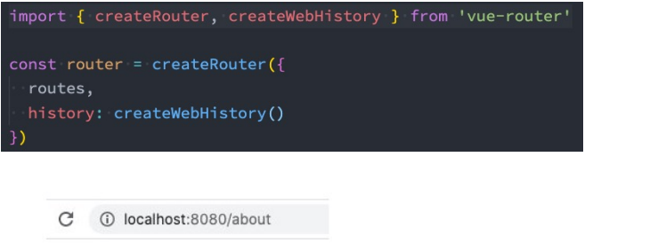

### 4.4 router-link

router-link 事实上有很多属性可以配置：

**to 属性：**

- 是一个字符串，或者是一个对象

- ```vue
  <router-link to="home">Home</router-link>

  <router-link :to="{ path: '/home' }">Home</router-link>

  <!-- 这个路径就是路由中配置的路径 -->
  <router-link :to="{ name: 'User' }">User</router-link>

  <!-- 在路由的配置的时候，添加一个name属性，例如： -->
  <!-- router/index.js -->
  routes: [ { path:'/home', name:'User', component:home } ]
  ```

**replace 属性：**

- 类型: boolean

- 默认值: false

- 设置 replace 属性的话，当点击时，会调用 `router.replace()` 而不是 默认值`router.push()`，于是导航后不会留下 history 记录。

  ```vue
  <button><router-link to="/home" replace>首页</router-link></button>
  <button><router-link to="/about" replace>关于</router-link></button>
  ```

  

**active-class 属性：**

router-link 激活时，自动给 a 标签 添加的 class 属性值。


- 类型: string

- 默认值: “router-link-active”

- 设置 链接激活时使用的 CSS 类名。

- ```vue
  <style>
  .router-link-active {
    color: red;
  }
  </style>
  ```

- 也可以 自定义 链接激活时使用的 CSS 类名。

```vue
<!-- 页面切换按钮 -->
<button><router-link to="/home" replace active-class="xp-active">首页</router-link></button>
<button><router-link to="/about" replace active-class="xp-active">关于</router-link></button>

<style>
.xp-active {
  color: red;
}
</style>
```

默认值通过路由的构造选项 linkActiveClass 来全局配置,如下示例：

```js
export default new Router({
  mode: "history",
  linkActiveClass: "is-active",
  routes: [
    {
      path: "/about",
      component: about,
    },
  ],
});
```

**exact-active-class 属性：**

- 类型: string
- 默认值: 链接精准激活时，应用于渲染的 class，默认是 router-link-exact-active；
- 配置当链接被精确匹配的时候应该激活的 class。注意默认值也是可以通过路由构造函数选项 linkExactActiveClass 进行全局配置的。

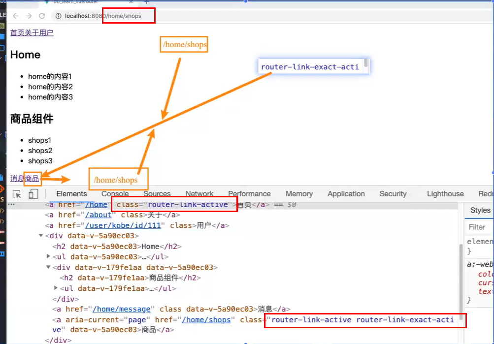

**exact 属性**

- 类型: boolean
- 默认值: false
- “是否激活” 默认类名的依据是 inclusive match (全包含匹配)。
- 举个例子，如果当前的路径是 /a 开头的，那么 `<router-link to="/a">` 也会被设置 CSS 类名。

按照这个规则，每个路由都会激活！想要链接使用 “exact 匹配模式”，则使用 exact 属性：

```vue
<li><router-link to="/">全局匹配</router-link></li>
<li><router-link to="/" exact>严格匹配</router-link></li>
```

简单点说，第一个的话，如果地址是/aa,或/aa/bb，……都会匹配成功，但加上 exact，只有当地址是/时被匹配，其他都不会匹配成功

**event 属性**

- 类型: string | Array
- 默认值: ‘click’
- 声明可以用来触发导航的事件。可以是一个字符串。

```vue
<router-link to="/document" event="mouseover">document</router-link>
```

如果我们不加 event，那么默认情况下是当我们点击 document 的时候，跳转到相应的页面，但当我们加上 event 的时候，就可以改变触发导航的事件，比如鼠标移入事件。

### 4.5 路由懒加载

当打包构建应用时，JavaScript 包会变得非常大，影响页面加载：

- 如果我们能把不同路由对应的组件分割成不同的代码块，然后当路由被访问的时候才加载对应组件，这样就会 更加高效；
- 也可以提高首屏的渲染效率；

其实这里还是我们前面讲到过的 webpack 的分包知识，而 Vue Router 默认就支持动态来导入组件：

- 这是因为 component 可以传入一个组件，也可以接收一个函数，该函数 需要放入一个 Promise；
- 而 import 函数就是返回一个 Promise；


我们看一下打包后的效果：

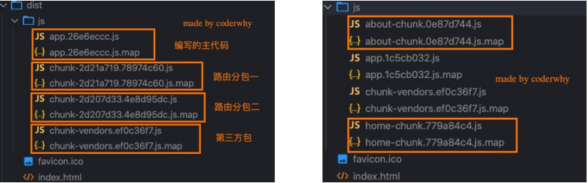

我们会发现分包是没有一个很明确的名称的，其实 webpack 从 3.x 开始支持对分包进行命名（chunk name）：


```js
{ path: "/about", component: () => import(/*webpackChunkName:"about-chunk"*/ "../pages/About.vue") },
{ path: "/home", component: () => import(/*webpackChunkName:"home-chunk"*/ "../pages/Home.vue") },
```

通过 webpack 魔法注释,可以对分包进行命名。

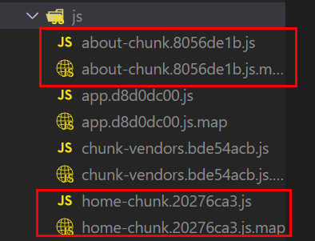

### 4.6 路由的其他属性

name 属性：路由记录独一无二的名称；

meta 属性：自定义的数据；

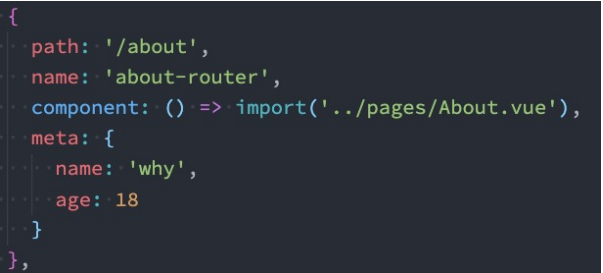

### 4.7 动态路由基本匹配

很多时候我们需要将给定匹配模式的路由映射到同一个组件：

- 例如，我们可能有一个 User 组件，它应该对所有用户进行渲染，但是用户的 ID 是不同的；
- 在 Vue Router 中，我们可以在路径中使用一个动态字段来实现，我们称之为 路径参数；

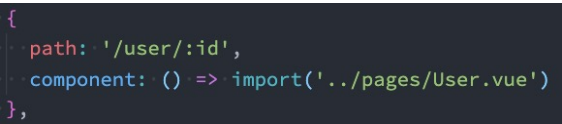

在 router-link 中进行如下跳转：

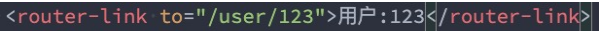

**获取动态路由的值**

那么在 User 中如何获取到对应的值呢？

vue2 中:

- 在 template 中，直接通过 \$route.params 获取值；

- 在 created 中，通过 this.$route.params 获取值；

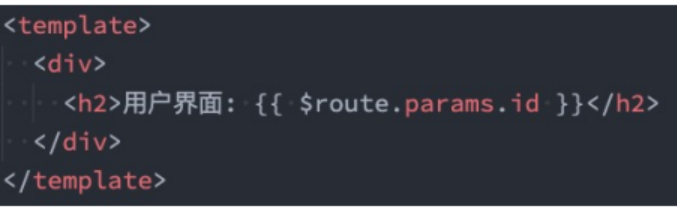

vue3 中:

- 在 setup 中，我们要使用 vue-router 库给我们提供的一个 hook 函数: useRoute；
- 该 Hook 会返回一个 Route 对象，对象中保存着当前路由相关的值；

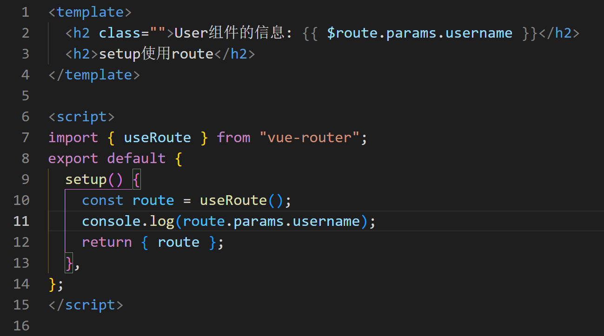

**匹配多个参数**

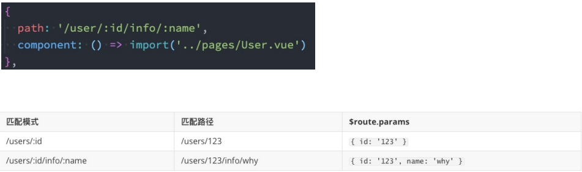

### 4.8 NotFound

对于哪些没有匹配到的路由，我们通常会匹配到固定的某个页面

- 比如 NotFound 的错误页面中，这个时候我们可编写一个动态路由用于匹配所有的页面；

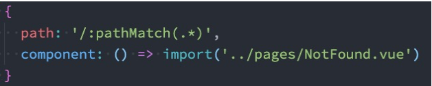

我们可以通过 $route.params.pathMatch 获取到传入的参数：

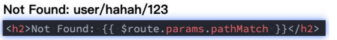

这里还有另外一种写法，匹配规则加 **\*** ：

- 注意：我在 /:pathMatch(._) 后面又加了一个 _；

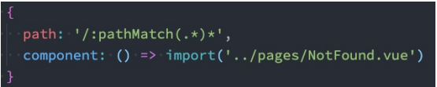

它们的区别在于解析的时候，是否解析 /：

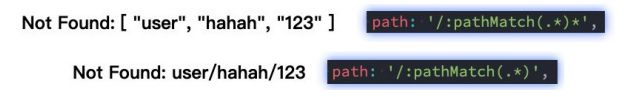

### 4.9 路由的嵌套

什么是路由的嵌套呢？

- 目前我们匹配的 Home、About、User 等都属于底层路由，我们在它们之间可以来回进行切换；
- 但是呢，我们 Home 页面本身，也可能会在多个组件之间来回切换：
  - 比如 Home 中包括 Product、Message，它们可以在 Home 内部来回切换；
- 这个时候我们就需要使用嵌套路由，在 Home 中也使用 router-view 来占位之后需要渲染的组件；

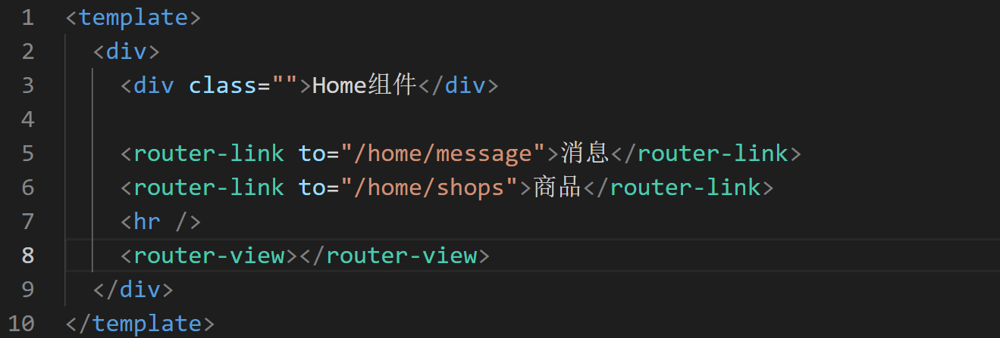

路由的嵌套配置

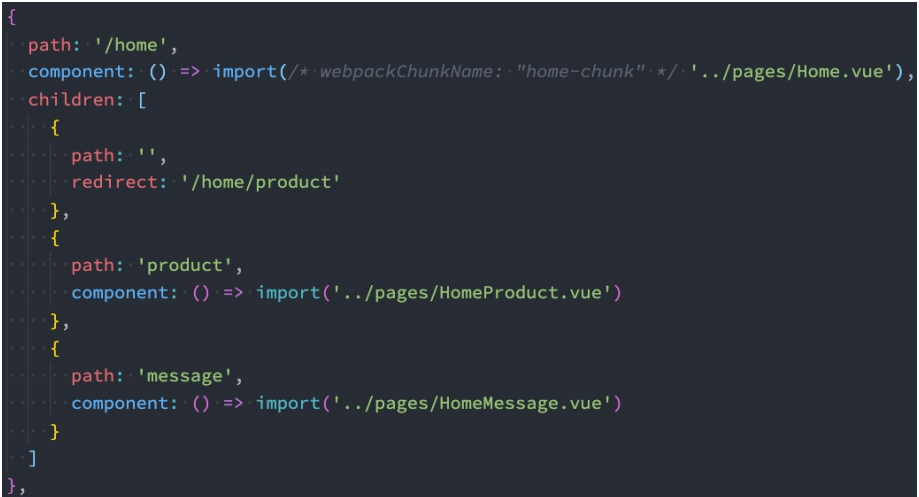

### 4.10 编程式导航

**代码的页面跳转**

有时候我们希望通过代码来完成页面的跳转，比如点击的是一个按钮：

在 vue2 中:

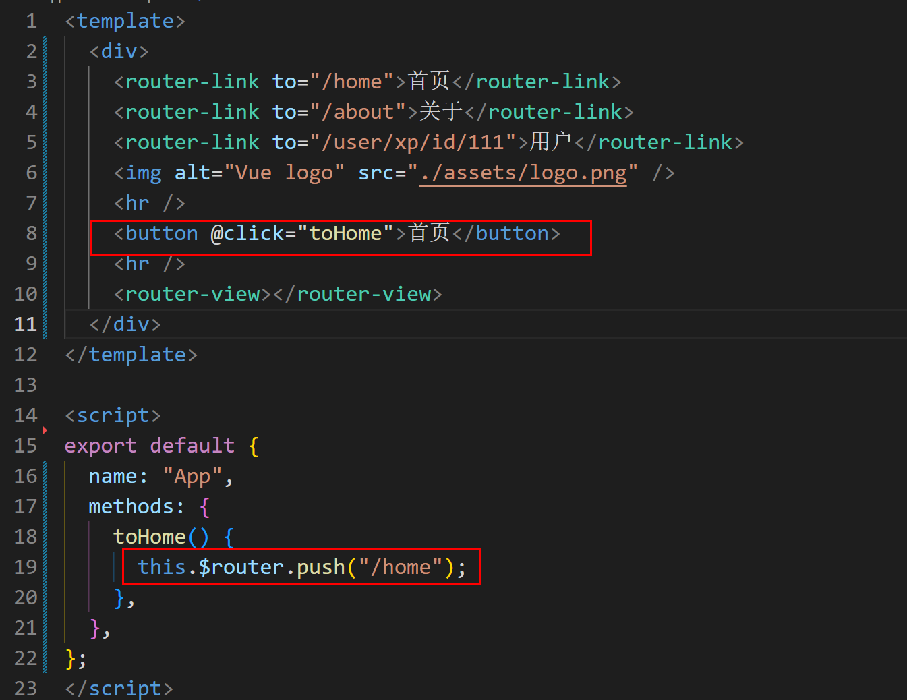

在 vue3 中:

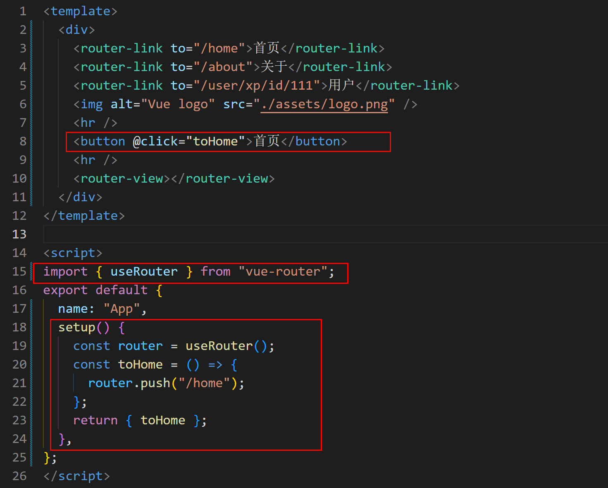

当然，我们也可以传入一个对象：

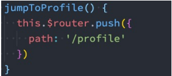

如果是在 setup 中编写的代码，那么我们可以通过 useRouter 来获取：

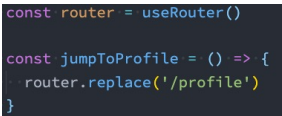

query 方式 的参数，我们也可以通过 query 的方式来传递参数：

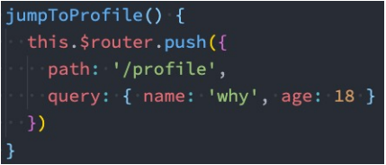

在界面中通过 $route.query 来获取参数:

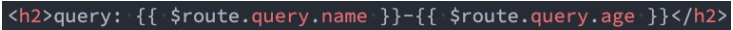

**替换当前的位置**

使用 push 的特点是压入一个新的页面，那么在用户点击返回时，上一个页面还可以回退。

但是如果我们希望当前 页面是一个替换操作，那么可以使用 replace：

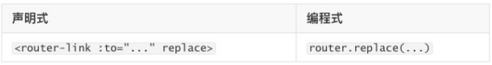

**页面的前进后退**

router 的 go 方法：

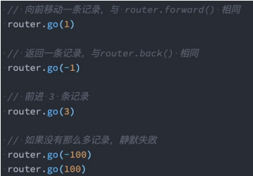

router 也有 back 方法：

- 通过调用 history.back() 回溯历史。相当于 router.go(-1)；

router 也有 forward 方法：

- 通过调用 history.forward() 在历史中前进。相当于 router.go(1)；

### 4.11 router-link 的 v-slot

在 vue-router3.x 的时候，router-link 有一个 tag 属性，可以决定 router-link 到底渲染成什么元素：

但是在 vue-router4.x 开始，该属性被移除了；

而给我们提供了更加具有灵活性的 v-slot 的方式来定制渲染的内容；

**v-slot 如何使用呢？**

首先，我们需要使用 custom 表示我们整个元素要自定义。

- 如果不写，那么自定义的内容会被包裹在一个 **a** 元素中；

其次，我们使用 v-slot 来获取 作用域插槽内部传给我们的值：

- href：解析后的 URL；
- route：解析后的规范化的 route 对象；
- navigate：触发导航的函数；
- isActive：是否匹配的状态；
- isExactActive：是否是精准匹配的状态

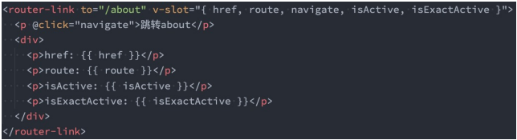

```vue
<!-- props: href 跳转的链接 -->
<!-- props: route对象 -->
<!-- props: navigate导航函数 -->
<!-- props: isActive 是否当前处于活跃的状态 -->
<!-- props: isExactActive 是否当前处于精确的活跃状态 -->

<router-link to="/home" v-slot="props" custom>
      <button @click="props.navigate">{{props.href}}</button>
      <button @click="props.navigate">哈哈哈</button>
      <span :class="{'active': props.isActive}">是否当前处于活跃的状态: {{props.isActive}}</span>
      <span :class="{'active': props.isActive}">是否当前处于精确的活跃状态: {{props.isExactActive}}</span>
      <!-- <p>{{props.route}}</p> -->
    </router-link>
```

### 4.12 router-view 的 v-slot

router-view 也提供给我们一个插槽，可以用于 \<transition> 和 \<keep-alive> 组件来包裹你的路由组件：

- Component：要渲染的组件；
- route：解析出的标准化路由对象；

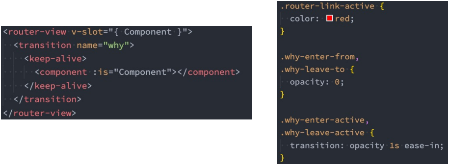

```vue
<router-view v-slot="props">
   <transition name="why">
     <keep-alive>
        <component :is="props.Component"></component>
     </keep-alive>   
   </transition>   
</router-view>

//...
<style>
.why-enter-from,
.why-leave-to {
  opacity: 0;
}
.why-enter-active,
.why-leave-active {
  transition: opacity 1s ease;
}
</style>
```

### 4.12 动态添加路由

某些情况下我们可能需要动态的来添加路由：

- 比如根据用户不同的权限，注册不同的路由；
- 这个时候我们可以使用一个方法 addRoute；

如果我们是为 route 添加一个 children 路由，那么可以传入对应的 name：

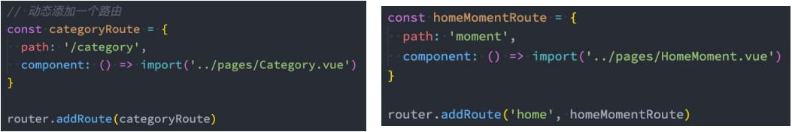

`router/index.js`

```js
import { createRouter, createWebHashHistory } from "vue-router";
// 路由映射关系
const routes = [
  { path: "/", redirect: "/home" },
  {
    path: "/about",
    name: "about",
    component: () =>
      import(/*webpackChunkName:"about-chunk"*/ "../pages/About.vue"),
  },
  {
    path: "/home",
    name: "home",
    meta: {
      name: "xp",
      age: 18,
      height: 1.88,
    },
    component: () =>
      import(/*webpackChunkName:"home-chunk"*/ "../pages/Home.vue"),
    children: [
      {
        path: "",
        redirect: "/home/message",
      },
      {
        path: "message",
        component: () => import("../pages/HomeMessage.vue"),
      },
      {
        path: "shops",
        component: () => import("../pages/HomeShops.vue"),
      },
    ],
  },
  {
    path: "/user/:username/id/:id",
    name: "user",
    component: () => import("../pages/User.vue"),
  },
  {
    path: "/:pathMatch(.*)*",
    name: "notFound",
    component: () => import("../pages/notFound.vue"),
  },
];

// 创建一个路由对象router
const router = createRouter({
  routes,
  history: createWebHashHistory(),
});

// 动态添加路由
const categoryRoute = {
  path: "/category",
  component: () => import("../pages/Category.vue"),
};

// 添加顶级路由对象
router.addRoute(categoryRoute);

// 添加二级路由对象, 这里的home是路由的name属性值
router.addRoute("home", {
  path: "moment",
  component: () => import("../pages/HomeMoment.vue"),
});

export default router;
```

### 4.13 动态删除路由

删除路由有以下三种方式：

- 方式一：添加一个 name 相同的路由，把原来的动态路由替换掉；
- 方式二：通过 removeRoute 方法，传入路由的名称；
- 方式三：通过 addRoute 方法的返回值回调；

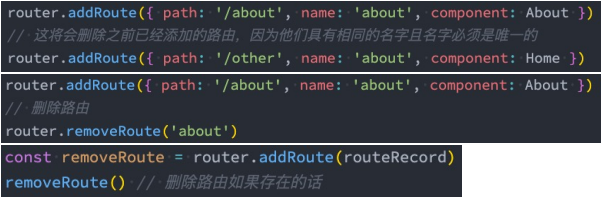

路由的其他方法补充：

- router.hasRoute()：检查路由是否存在。
- router.getRoutes()：获取一个包含所有路由记录的数组。

### 4.14 路由导航守卫

vue-router 提供的导航守卫主要用来通过跳转或取消的方式守卫导航。

全局的前置守卫 beforeEach 是在导航触发时会被回调的：

它有两个参数：

- to：即将进入的路由 Route 对象；
- from：即将离开的路由 Route 对象；

它有返回值：

- false：取消当前导航；

- 不返回或者 undefined：进行默认导航；

- 返回一个路由地址：

  - 可以是一个 string 类型的路径；

  - 可以是一个对象，对象中包含 path、query、params 等信息；

可选的第三个参数：next

- 在 Vue2 中我们是通过 next 函数来决定如何进行跳转的；
- 但是在 Vue3 中我们是通过 返回值 来控制的，不再推荐使用 next 函数，这是因为开发中很容易调用多次 next；

**登录守卫功能**

比如我们完成一个功能，只有登录后才能看到其他页面：

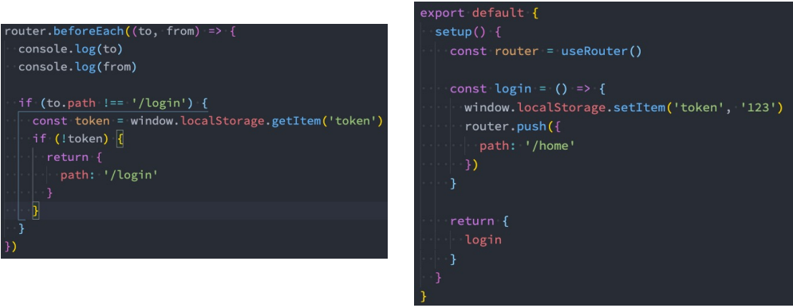

其他导航守卫

Vue 还提供了很多的其他守卫函数，目的都是在某一个时刻给予我们回调，让我们可以更好的控制程序的流程或者功能：

- https://router.vuejs.org/zh/guide/advanced/navigation-guards.html

我们一起来看一下完整的导航解析流程：

- 导航被触发。
- 在失活的组件里调用 beforeRouteLeave 守卫。
- 调用全局的 beforeEach 守卫。
- 在重用的组件里调用 beforeRouteUpdate 守卫(2.2+)。
- 在路由配置里调用 beforeEnter。
- 解析异步路由组件。
- 在被激活的组件里调用 beforeRouteEnter。
- 调用全局的 beforeResolve 守卫(2.5+)。
- 导航被确认。
- 调用全局的 afterEach 钩子。
- 触发 DOM 更新。
- 调用 beforeRouteEnter 守卫中传给 next 的回调函数，创建好的组件实例会作为回调函数的参数传入。
