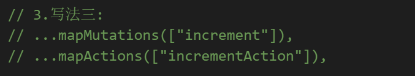

# Vuex 的状态管理

## 1.什么是状态管理

在开发中，我们的应用程序需要处理各种各样的数据，这些 数据需要保存在我们应用程序中的某一个位置，对于这些数据 的管理我们就称之为是 **状态管理**。

在前面我们是如何管理自己的状态呢？

- 在 Vue 开发中，我们使用组件化的开发方式；
- 而在组件中我们定义 data 或者在 setup 中返回使用的数据， 这些数据我们称之为 state；
- 在模块 template 中我们可以使用这些数据，模块最终会被 渲染成 DOM，我们称之为 View；
- 在模块中我们会产生一些行为事件，处理这些行为事件时， 有可能会修改 state，这些行为事件我们称之为 actions；


### 1.1 复杂的状态管理

JavaScript 开发的应用程序，已经变得越来越复杂了：

- JavaScript 需要管理的状态越来越多，越来越复杂；
- 这些状态包括服务器返回的数据、缓存数据、用户操作产生的数据等等；
- 也包括一些 UI 的状态，比如某些元素是否被选中，是否显示加载动效，当前分页；

当我们的应用遇到**多个组件共享状态**时，单向数据流的简洁性很容易被破坏：

- 多个视图依赖于同一状态；
- 来自不同视图的行为需要变更同一状态；

我们是否可以通过组件数据的传递来完成呢？

- 对于一些简单的状态，确实可以通过 props 传递或者 Provide 的方式来共享状态；
- 但是对于复杂的状态管理来说，显然单纯通过传递和共享的方式是不足以解决问题的，比如兄弟组件如何共享数据呢？

管理不断变化的 state 本身是非常困难的：

- 状态之间相互会存在依赖，一个状态的变化会引起另一个状态的变化，View 页面也有可能会引起状态的变化；
- 当应用程序复杂时，state 在什么时候，因为什么原因而发生了变化，发生了怎么样的变化，会变得非常难以控制和追踪；

因此，我们是否可以考虑将组件的内部状态抽离出来，以一个全局单例的方式来管理呢？

- 在这种模式下，我们的组件树构成了一个巨大的 “视图 View”；
- 不管在树的哪个位置，任何组件都能获取状态或者触发行为；
- 通过定义和隔离状态管理中的各个概念，并通过强制性的规则来维护视图和状态间的独立性，我们的代码边会变得更加结构化和易于维护、跟踪；

这就是 Vuex 背后的基本思想，它借鉴了 Flux、Redux、Elm（纯函数语言，redux 有借鉴它的思想）：

### 1.2 Vuex 的状态管理


### 1.3 Vuex 的安装

依然我们要使用 vuex，首先第一步需要安装 vuex：

我们这里使用的是 vuex4.x ；

```js
npm install vuex
```

## 2.创建 store 仓库

每一个 Vuex 应用的核心就是 store（仓库）：

- store 本质上是一个容器，它包含着你的应用中大部分的状态（state）；

Vuex 和单纯的全局对象有什么区别呢？

第一：Vuex 的状态存储是**响应式**的 。

- 当 Vue 组件从 store 中读取状态的时候，若 store 中的状态发生变化，那么相应的组件也会被更新；

第二：你不能直接改变 store 中的状态 。

- 改变 store 中的状态的唯一途径就显示提交 commit 到 mutation 中,然后进行数据的修改；
- 这样使得我们可以方便的跟踪每一个状态的变化，从而让我们能够通过一些工具帮助我们更好的管理应用的状态；

使用步骤：

- 创建 Store 对象；
- 在 app 中通过插件安装；

在组件中使用 store，我们按照如下的方式：

- 在模板中使用；
- 在 options api 中使用，比如 computed；
- 在 setup 中使用；

`store/index.js`

```js
import { createStore } from "vuex";

const store = createStore();

export default store;
```

## 3.单一状态树

Vuex 使用单一状态树：

- 用一个对象就包含了全部的应用层级状；

- 采用的是 SSOT，Single Source of Truth，也可以翻译成单一数据源；
- 这也意味着，每个应用将仅仅包含一个 store 实例；
- 单状态树和模块化并不冲突，后面我们会讲到 module 的概念；

单一状态树的优势：

- 如果你的状态信息是保存到多个 Store 对象中的，那么之后的管理和维护等等都会变得特别困难；
- 所以 Vuex 也使用了单一状态树来管理应用层级的全部状态；
- 单一状态树能够让我们最直接的方式找到某个状态的片段，而且在之后的维护和调试过程中，也可以非常方便 的管理和维护；

## 4.组件获取状态

### 4.1 state 的基本使用

在前面我们已经学习过如何在组件中获取状态了。

当然，如果觉得那种方式有点繁琐（表达式过长），我们可以使用计算属性：


但是，如果我们有很多个状态都需要获取话，可以使用 mapState 的辅助函数：

- mapState 的方式一：对象类型；
- mapState 的方式二：数组类型；
- 也可以使用展开运算符来与原有的 computed 混合在一起；
- mapState 返回的是一个对象；

```vue
<template>
  <div>
    <h2>Home:{{ $store.state.counter }}</h2>
    <h2>Home:{{ sCounter }}</h2>
    <h2>Home:{{ sName }}</h2>
  </div>
</template>

<script>
import { mapState } from "vuex";

export default {
  computed: {
    fullName() {
      return "Kobe Bryant";
    },
    // 其他的计算属性, 从state获取
    // ...mapState(["counter", "name", "age", "height"])
    ...mapState({
      sCounter: (state) => state.counter,
      sName: (state) => state.name,
    }),
  },
};
</script>

<style scoped></style>
```

**在 setup 中使用 mapState**

在 setup 中如果我们单个获取数据状态是非常简单的：

- 通过 useStore 拿到 store 后去获取某个状态即可；
- 但是如果我们需要使用 mapState 的功能呢？

默认情况下，Vuex 并没有提供非常方便的使用 mapState 的方式，这里我们进行了一个函数的封装：


```vue
<template>
  <div>
    <h2>Home:{{ $store.state.counter }}</h2>
    <hr />
    <h2>{{ sCounter }}</h2>
    <h2>{{ counter }}</h2>
    <h2>{{ name }}</h2>
    <h2>{{ age }}</h2>
    <h2>{{ height }}</h2>
    <hr />
  </div>
</template>

<script>
import { mapState, useStore } from "vuex";
import { computed } from "vue";

export default {
  computed: {
    fullName: function () {
      return "1fdasfdasfad";
    },
    ...mapState(["name", "age"]),
  },

  setup() {
    const store = useStore();
    const sCounter = computed(() => store.state.counter);

    const storeStateFns = mapState(["counter", "name", "age", "height"]);

    // {name: function, age: function, height: function}
    // {name: ref, age: ref, height: ref}

    const storeState = {}; //实际上的数据在这里

    Object.keys(storeStateFns).forEach((fnKey) => {
      const fn = storeStateFns[fnKey].bind({ $store: store });
      storeState[fnKey] = computed(fn);
    });

    return {
      sCounter,
      ...storeState,
    };
  },
};
</script>

<style scoped></style>
```

### 4.2 getters 的基本使用

某些属性我们可能需要变化后来使用，这个时候可以使用 getters ：


getters 的第二个参数：

getters 可以接收第二个参数：(第二个参数的主要作用是: 在一个 getters 中可以调用其他的 getters 函数)


getters 的返回函数

getters 中的函数本身，可以返回一个函数，那么在使用的地方相当于可以调用这个函数：


**mapGetters 的辅助函数**

这里我们也可以使用 mapGetters 的辅助函数。


在 setup 中使用


```vue
<template>
  <div>
    <h2>总价值: {{ $store.getters.totalPrice }}</h2>
    <h2>总价值: {{ $store.getters.totalPriceCountGreaterN(1) }}</h2>
    <hr />
    <h2>{{ nameInfo }}</h2>
    <h2>{{ ageInfo }}</h2>
    <h2>{{ heightInfo }}</h2>
    <hr />
  </div>
</template>

<script>
//自己封装的hook,用户处理getters数据
import { useGetters } from "../hooks/useGetters";

export default {
  setup() {
    const storeGetters = useGetters(["nameInfo", "ageInfo", "heightInfo"]);
    return {
      ...storeGetters,
    };
  },
};
</script>
```

`useGetters.js`

```js
import { mapGetters, createNamespacedHelpers } from "vuex";
import { useMapper } from "./useMapper";

export function useGetters(moduleName, mapper) {
  let mapperFn = mapGetters;
  if (typeof moduleName === "string" && moduleName.length > 0) {
    mapperFn = createNamespacedHelpers(moduleName).mapGetters;
  } else {
    mapper = moduleName;
  }

  return useMapper(mapper, mapperFn);
}
```

`useMapper.js`

```js
import { computed } from "vue";
import { useStore } from "vuex";

export function useMapper(mapper, mapFn) {
  // 拿到store独享
  const store = useStore();

  // 获取到对应的对象的functions: {name: function, age: function}
  const storeStateFns = mapFn(mapper);

  // 对数据进行转换
  const storeState = {};
  Object.keys(storeStateFns).forEach((fnKey) => {
    const fn = storeStateFns[fnKey].bind({ $store: store });
    storeState[fnKey] = computed(fn);
  });

  return storeState;
}
```

### 4.3 mutations 基本使用

更改 Vuex 的 store 中的状态的唯一方法是提交 mutations：


```js
// store/index.js

import { createStore } from "vuex";

const store = createStore({
  state() {
    return {
      counter: 99,
    };
  },
  mutations: {
    increment(state) {
      state.counter++;
    },
    decrement(state) {
      state.counter--;
    },
  },
});

export default store;
```

mutations 携带数据：

很多时候我们在提交 mutations 的时候，会携带一些数据，这个时候我们可以使用参数：


payload 为对象类型:


对象风格的提交方式


mutation 常量类型

定义常量：mutation-type.js


定义 mutation


提交 mutation


```vue
<script>
import { INCREMENT_N } from "../store/mutation-types";

export default {
  methods: {
    addTen() {
      // this.$store.commit('incrementN', 10)
      // this.$store.commit('incrementN', {n: 10, name: "why", age: 18})
      // 另外一种提交风格
      this.$store.commit({
        type: INCREMENT_N,
        n: 10,
        name: "why",
        age: 18,
      });
    },
  },
};
</script>
```

**mapMutations 辅助函数**

我们也可以借助于辅助函数，帮助我们快速映射到对应的方法中：


在 setup 中使用也是一样的：


mutations 重要原则

一条重要的原则就是要记住 **mutations 必须是同步函数**

- 这是因为 devtool 工具会记录 mutations 的日记；
- 每一条 mutations 被记录，devtools 都需要捕捉到前一状态和后一状态的快照；
- 但是在 mutations 中执行异步操作，就无法追踪到数据的变化；
- 所以 Vuex 的重要原则中要求 mutations 必须是同步函数；

### 4.4 actions 的基本使用

actions 类似于 mutations，不同在于：

- actions 提交的是 mutations，而不是直接变更状态；
- actions 可以**包含任意异步操作**


这里有一个非常重要的参数 context：

- context 是一个和 store 实例均有相同方法和属性的 context 对象；
- 所以我们可以从其中获取到 commit 方法来提交一个 mutations，或者通过 context.state 和 context.getters 来 获取 state 和 getters；
- 但是为什么它不是 store 对象呢？这个等到我们讲 Modules 时再具体来说；

actions 的分发操作

如何使用 action 呢？进行 action 的分发：

- 分发使用的是 store 上的 dispatch 函数；


同样的，它也可以携带我们的参数：


在 vuex 的 actions 中:


也可以以对象的形式进行分发：


**actions 的辅助函数**

actions 也有对应的辅助函数：

- 对象类型的写法；
- 数组类型的写法；


actions 的异步操作

actions 通常是异步的，==那么如何知道 actions 什么时候结束呢？==

- 我们可以通过让 actions 返回 Promise，在 Promise 的 then 中来处理完成后的操作；


### 4.5 module 的基本使用

什么是 Module？

- 由于使用单一状态树，应用的所有状态会集中到一个比较大的对象，当应用变得非常复杂时，store 对象就有可 能变得相当臃肿；
- 为了解决以上问题，Vuex 允许我们将 store 分割成模块（module）；
- 每个模块拥有自己的 state、mutation、action、getter、甚至是嵌套子模块；


```js
import { createStore } from "vuex";
import home from "./modules/home";
import user from "./modules/user";

const store = createStore({
  state() {
    return {
      rootCounter: 100,
    };
  },
  getters: {
    doubleRootCounter(state) {
      return state.rootCounter * 2;
    },
  },
  mutations: {
    increment(state) {
      state.rootCounter++;
    },
  },
  modules: {
    home, //这里导出home页面的状态
    user, //这里是user页面的状态
  },
});

export default store;
```

```vue
<template>
  <div>
    <h2>{{ $store.state.rootCounter }}</h2>
    <h2>{{ $store.state.home.homeCounter }}</h2>
    <h2>{{ $store.state.user.userCounter }}</h2>
  </div>
</template>

<script>
export default {
  setup() {},
};
</script>

<style scoped></style>
```

#### 4.5.1 module 的局部状态

对于模块内部的 mutation 和 getter，接收的第一个参数是模块的局部状态对象：


如何使用 user 模块下面的 getters

```vue
<template>
  <div>
    <h2>{{ $store.state.rootCounter }}</h2>
    <h2>{{ $store.state.home.homeCounter }}</h2>
    <h2>{{ $store.state.user.userCounter }}</h2>

    <!-- 相当于把子模块的getters与父模块的getters做了一个合并 -->
    <h2>{{ $store.getters.userCounter }}</h2>
  </div>
</template>

<script>
//这种情况下 无法区分 getters ,mutations, actions到底来自哪个模块
export default {
  setup() {},
};
</script>

<style scoped></style>
```

module 的命名空间

默认情况下，模块内部的 action 和 mutation 仍然是注册在全局的命名空间中的：

- 这样使得多个模块能够对同一个 action 或 mutation 作出响应；
- Getter 同样也默认注册在全局命名空间；

如果我们希望模块具有更高的封装度和复用性，可以添加 namespaced: true 的方式使其成为带命名空间的模块：

- 当模块被注册后，它的所有 getter、action 及 mutation 都会自动根据模块注册的路径调整命名；


module 修改或派发根组件

如果我们希望在 action 中修改 root 中的 state，那么有如下的方式:


module 的辅助函数

如果辅助函数有三种使用方法：

- 方式一：通过完整的模块空间名称来查找；
- 
- 
- 方式二：第一个参数传入模块空间名称，后面写上要使用的属性；
- 
- 
- 方式三：通过 createNamespacedHelpers 生成一个模块的辅助函数；





在 setup 中的 module 的辅助函数


需要自己封装的 hooks

```js
//userState.js
import { mapState, createNamespacedHelpers } from "vuex";
import { useMapper } from "./useMapper";

export function useState(moduleName, mapper) {
  let mapperFn = mapState;
  if (typeof moduleName === "string" && moduleName.length > 0) {
    mapperFn = createNamespacedHelpers(moduleName).mapState;
  } else {
    mapper = moduleName;
  }

  return useMapper(mapper, mapperFn);
}
```

```js
//useMapper.js
import { computed } from "vue";
import { useStore } from "vuex";

export function useMapper(mapper, mapFn) {
  // 拿到store独享
  const store = useStore();

  // 获取到对应的对象的functions: {name: function, age: function}
  const storeStateFns = mapFn(mapper);

  // 对数据进行转换
  const storeState = {};
  Object.keys(storeStateFns).forEach((fnKey) => {
    const fn = storeStateFns[fnKey].bind({ $store: store });
    storeState[fnKey] = computed(fn);
  });

  return storeState;
}
```

## 5.nexttick 基本使用

官方解释：将回调推迟到下一个 DOM 更新周期之后执行。在更改了一些数据以等待 DOM 更新后立即使用它。

比如我们有下面的需求：

- 点击一个按钮，我们会修改在 h2 中显示的 message；
- message 被修改后，获取 h2 的高度；

实现上面的案例我们有三种方式：

- 方式一：在点击按钮后立即获取到 h2 的高度（错误的做法）
- 方式二：在 updated 生命周期函数中获取 h2 的高度（但是其他数据更新，也会执行该操作）

- 方式三：使用 nexttick 函数；

nexttick 是如何做到的呢？

```vue
<template>
  <div>
    <h2 class="title" ref="titleRef">{{ message }}</h2>
    <button @click="addMessageContent">添加内容</button>
  </div>
</template>

<script>
//nextTick 是内置函数,直接导入进来就可以使用
import { ref, onUpdated, nextTick } from "vue";

export default {
  setup() {
    const message = ref("");
    const titleRef = ref(null);

    const addMessageContent = () => {
      message.value += "哈哈哈哈哈哈哈哈哈哈";

      // 更新DOM
      nextTick(() => {
        console.log(titleRef.value.offsetHeight);
      });
    };

    return {
      message,
      titleRef,
      addMessageContent,
    };
  },
};
</script>

<style scoped>
.title {
  width: 120px;
}
</style>
```

## 6.historyApiFallback

historyApiFallback 是开发中一个非常常见的属性，它主要的作用是解决 SPA 页面在路由跳转之后，进行页面刷新时，返回 404 的错误。 boolean 值：默认是 false

- 如果设置为 true，那么在刷新时，返回 404 错误时，会自动返回 index.html 的内容；

object 类型的值，可以配置 rewrites 属性：

- 可以配置 from 来匹配路径，决定要跳转到哪一个页面；

事实上 devServer 中实现 historyApiFallback 功能是通过 connect-history-api-fallback 库的：

- 可以查看https://github.com/bripkens/connect-history-api-fallback文档


