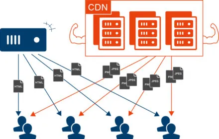
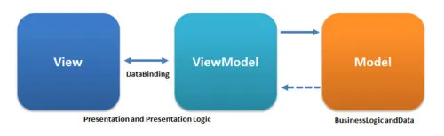
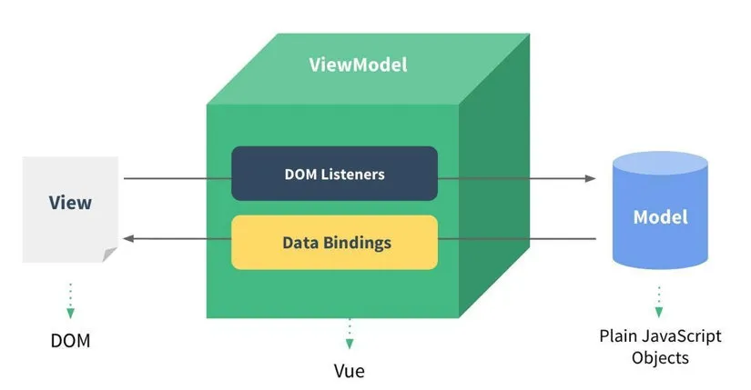
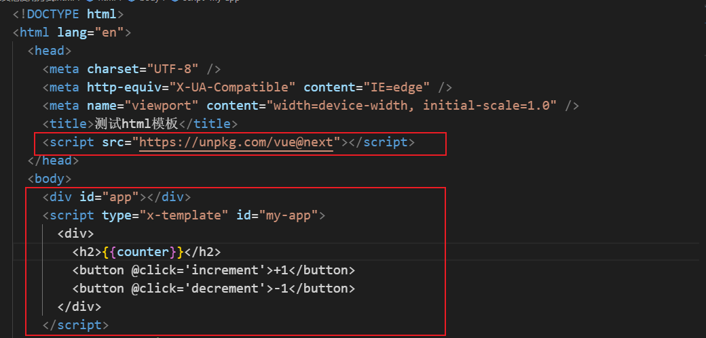
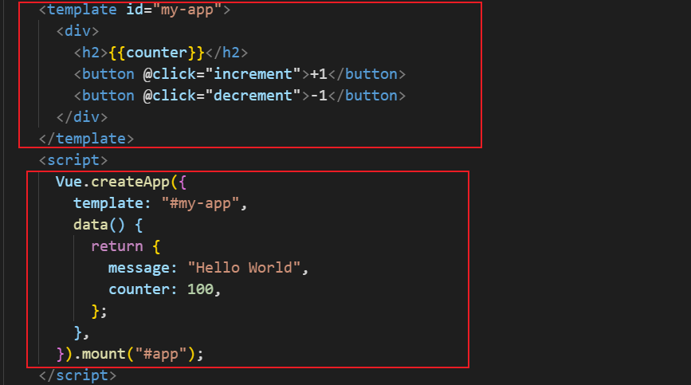
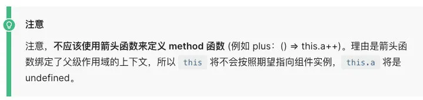

# 邂逅 Vue3 开发

## 1. 认识 Vue.js

### 1.1. 认识 Vue

Vue (读音 /vjuː/，类似于 **view**) 是一套用于构建用户界面的**渐进式框架**。

- 全称是 Vue.js 或者 Vuejs；
- 什么是渐进式框架呢？表示我们可以在项目中==一点点来引入和使用 Vue==，而不一定需要全部使用 Vue 来开发整个项目；

### 1.2. Vue 的安装

Vue 是一个 JavaScript 的库，刚开始我们不需要把它想象的非常复杂，我们就把它理解成一个已经帮助我们封装好的库，在项目中可以引入并且使用它即可。

那么安装和使用 Vue 这个 JavaScript 库有哪些方式呢？

- 方式一：在页面中通过 CDN 的方式来引入；
- 方式二：下载 Vue 的 JavaScript 文件，并且自己手动引入；
- 方式三：通过 npm 包管理工具安装使用它（webpack 再讲）；
- 方式四：直接通过 Vue CLI 创建项目，并且使用它；

#### 1.2.1. CDN 方式引入

什么是 CDN 呢？CDN 称之为内容分发网络（**C**ontent **D**elivery **N**etwork 或**C**ontent **D**istribution**N**etwork，缩写：**CDN**）

- 它是指通过相互连接的网络系统，利用**最靠近每个用户**的服务器；

- 更快、更可靠地将音乐、图片、视频、应用程序及其他文件发送给用户；

- 来提供高性能、可扩展性及低成本的网络内容传递给用户；

  

常用的 CDN 服务器可以大致分为两种：

- 自己的 CDN 服务器：需要购买自己的 CDN 服务器，目前阿里、腾讯、亚马逊、Google 等都可以购买 CDN 服务器；
- 开源的 CDN 服务器：国际上使用比较多的是 unpkg、JSDelivr、cdnjs；

Vue 的 CDN 引入：

```html
<script src="https://unpkg.com/vue@next"></script>
```

Hello Vue 案例的实现：

```vue
<body>
  <div id="app"></div>

  <script src="https://unpkg.com/vue@next"></script>
  <script>
    // Vue相关的代码
    const app = Vue.createApp({
      template: '<h2>Hello Vue3</h2>'
    });

    // 将app挂载到id为app的div上
    app.mount("#app");
  </script>
</body>
```

#### 1.2.2. 下载并且引入

下载 Vue 的源码，可以直接打开 CDN 的链接：

- 打开链接，复制其中所有的代码；
- 创建一个新的文件，比如 vue.js，将代码复制到其中；

通过 script 标签，引入刚才的文件：

```html
<script src="../js/vue.js"></script>
```

你好啊，Vuejs 案例的实现：

```vue
<body>
  <div id="app"></div>
  
  <script src="../js/vue.js"></script>
  <script>
    const app = Vue.createApp({
      template: `<h2>你好啊, Vue3</h2>`
    });

    app.mount('#app');
  </script>
</body>
```

### 1.3. 计数器案例

如果我们希望实现一个计数器的案例：

- 点击`+1`，那么内容会显示数字`+1`；
- 点击`-1`，那么内容会显示数字`-1`；

我们可以选择很多种方式来实现，在这里我们就对比原生和 Vue 的实现方式的不同。

#### 1.3.1. 原生实现计数器

原生 js 的实现代码如下：

```vue
<body>
  
  <h2 class="title"></h2>
  <button class="increment">+1</button>
  <button class="decrement">-1</button>

  <script>
    // 1.获取DOM原生
    const titleEl = document.querySelector(".title");
    const btnInEl = document.querySelector('.increment');
    const btnDeEl = document.querySelector('.decrement');

    // 2.默认设置的是Hello World
    let counter = 0

    // 3.设置titleEl的内容
    titleEl.innerHTML = counter;

    // 4.监听按钮的点击
    btnInEl.addEventListener('click', () => {
      counter += 1;
      titleEl.innerHTML = counter;
    })
    btnDeEl.addEventListener('click', () => {
      counter -= 1;
      titleEl.innerHTML = counter;
    })

  </script>
</body>
```

#### 1.3.2. Vue 实现计数器

Vue 的实现代码如下：

```vue
<body>
  <div id="app"></div>

  <script src="../js/vue.js"></script>
  <script>
    const App = {
      template: `
        <div>
          <h2>{{counter}}</h2>
          <button @click='increment'>+1</button>
          <button @click='decrement'>-1</button>
        </div>
      `,
      data() {
        return {
          counter: 0
        }
      },
      methods: {
        increment() {
          this.counter++;
        },
        decrement() {
          this.counter--;
        }
      }
    }

    Vue.createApp(App).mount('#app');
  </script>
</body>
```

#### 1.3.3. 声明式和命令式

在原生的实现过程中，我们是如何操作的呢？

- 我们每完成一个操作，都需要通过 JavaScript 编写一条代码，来给浏览器一个指令：
- 这样的编写代码的过程，我们称之为命令式编程；
- 在早期的原生 JavaScript 和 jQuery 开发的过程中，我们都是通过这种命令式的方式在编写代码的；

在 Vue 的实现过程中，我们是如何操作的呢？

- 我们会在 createApp 传入的对象中 声明 需要的内容，模板 template、数据 data、方法 methods；
- 这样的编写代码的过程，我们称之为是声明式编程；
- 目前 Vue、React、Angular 的编程模式，我们称之为声明式编程；

#### 1.3.4. MVVM 开发模式

通常情况下，我们也经常称 Vue 是一个 MVVM 的框架。

什么是 MVVM 吗？

- MVVM 是一种软件的体系结构，是 Model-View-ViewModel 的简称；



Vue 官方其实有说明，Vue 虽然并没有完全遵守 MVVM 的模型，但是整个设计是受到它的启发的。



## 2. createApp 对象参数

在使用 createApp 的时候，我们传入了一个对象，接下来我们详细解析一下之前传入的属性分别代表什么含义。

### 2.1. template 属性

template 表示的是 Vue 需要帮助我们渲染的模板信息：

- 目前我们看到它里面有很多的 HTML 标签，这些标签会替换掉我们挂载到的元素（比如 id 为 app 的 div）的 innerHTML；
- 模板中有一些奇怪的语法，比如 `{{}}`，比如 `@click`，这些都是模板特有的语法，我们会在后面讲到；

但是这个模板的写法有点过于`别扭`了，并且 IDE 很有可能没有任何提示，阻碍我们变成的效率。

Vue 提供了两种方式：

- 方式一：使用 script 标签，并且标记它的类型为 `x-template`；

- 方式二：使用任意标签（通常使用 template 标签，因为不会被浏览器渲染），设置 id；

- template 元素是一种用于保存客户端内容的机制，该内容在加载页面时不会被呈现，但随后可以在运行时使用 JavaScript 实例化；

方式一：使用 script 标签

```vue
<script type="x-template" id="my-app">
<div>
  <h2>{{counter}}</h2>
  <button @click='increment'>+1</button>
  <button @click='decrement'>-1</button>
</div>
</script>
```

方式二：使用 template

```vue
<template id="my-app">
  <div>
    <h2>{{ counter }}</h2>
    <button @click="increment">+1</button>
    <button @click="decrement">-1</button>
  </div>
</template>
```

这个时候，在 createApp 的对象中，我们需要传入的 template 以 `#` 开头：

```js
Vue.createApp({
  template: "#my-app",
  data() {
    return {
      message: "Hello World",
      counter: 100,
    };
  },
}).mount("#app");
```

- 如果字符串是以 `#` 开始，那么它将被用作 `querySelector`，并且使用匹配元素的 `innerHTML` 作为模板字符串；

  



### 2.2. data 属性

data 属性是传入一个函数，并且该函数需要返回一个对象：

​ 组件是一个可复用的实例，当你引用一个组件的时候，组件里的 data 是一个普通的对象，**所有用到这个组件的都引用的同一个 data，就会造成数据污染**。将 data 封装成函数后，在实例化组件的时候，我们只是调用了 data 函数生成的数据副本，避免了数据污染。

- 在 Vue2.x 的时候，也可以传入一个对象（虽然官方推荐是一个函数）；
- 在 Vue3.x 的时候，要传入一个函数，否则就会直接在浏览器中报错；

data 中返回的对象会被 Vue 的响应式系统劫持，之后对该对象的修改或者访问都会在劫持中被处理：

- 所以我们在 template 中通过 `{{counter}}` 访问 counter，可以从对象中获取到数据；
- 所以我们修改 counter 的值时，template 中的 `{{counter}}`也会发生改变；

具体这种响应式的原理，我们后面会有专门的篇幅来讲解。

### 2.3. methods 属性

methods 属性是一个对象，通常我们会在这个对象中定义很多的方法：

- 这些方法可以被绑定到 template 模板中；
- 在该方法中，我们可以使用 `this关键字` 来直接访问到 `data中返回的对象的属性`；

对于有经验的同学，在这里我提一个问题，官方文档有这么一段描述：

- 问题一：为什么不能使用箭头函数（官方文档有给出解释）？
- 问题二：不使用箭头函数的情况下，this 到底指向的是什么？（可以作为一道面试题）



### 2.4. 其他属性

当然，这里还可以定义很多其他的属性，我们会在后续进行讲解：

- 比如 props、computed、watch、emits、setup 等等；
- 也包括很多的**生命周期函数**；

不用着急，我们会一个个学习它们的。
