# Vue 基础语法(一)

## 1. 知识补充

### 1.1. methods 中的 this

#### 1.1.1. 不能使用箭头函数

我们在 methods 中要使用 data 返回对象中的数据，那么这个 this 是必须有值的，并且应该可以通过 this 获取到 data 返回对象中的数据。

那么我们这个 this 能不能是 window 呢？

- 不可以是 window，因为 window 中我们无法获取到 data 返回对象中的数据；
- 但是如果我们使用箭头函数，那么这个 this 就会是 window 了；

我们来看下面的代码：

- 我将 increment 换成了箭头函数，那么它其中的 this 进行打印时就是 window；

```javascript
const App = {
  template: "#my-app",
  data() {
    return {
      counter: 0,
    };
  },
  methods: {
    increment: () => {
      // this.counter++;
      console.log(this); //当前这里的this就是指向window
    },
    decrement() {
      this.counter--;
    },
  },
};
```

为什么是 window 呢？

- 这里涉及到箭头函数使用 this 的查找规则，它会在自己的上层作用域中来查找 this；
- 最终刚好找到的是 script 作用域中的 this，所以就是 window；

#### 1.1.2. this 到底指向什么

事实上 Vue 的源码当中就是对 methods 中的所有函数进行了遍历，并且通过 bind 绑定了 this ：

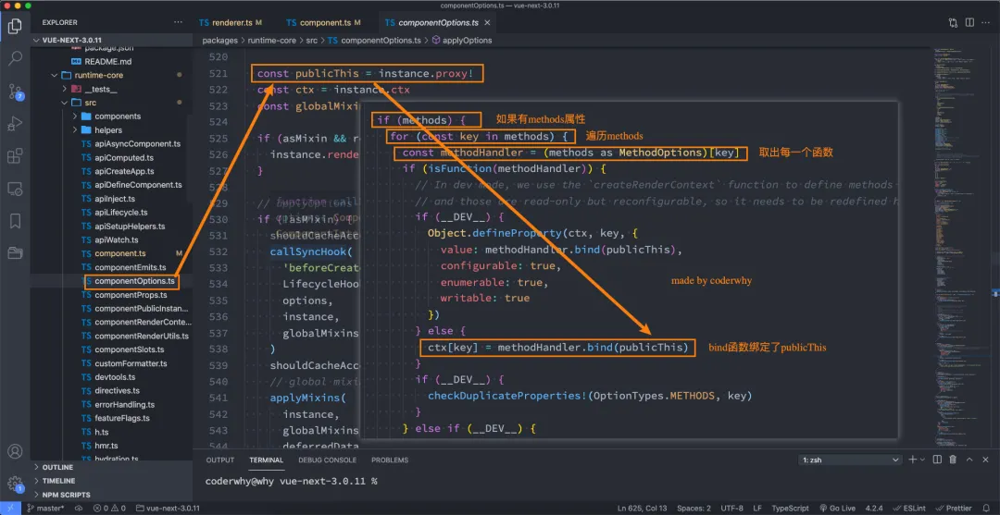

### 1.2. VSCode 增加代码片段

我们在前面练习 Vue 的过程中，有些代码片段是需要经常写的，我们在 VSCode 中我们可以生成一个代码片段，方便我们快速生成。

VSCode 中的代码片段有固定的格式，所以我们一般会借助于一个在线工具来完成。

具体的步骤如下：

- 第一步，复制自己需要生成代码片段的代码；
- 第二步，https://snippet-generator.app/在该网站中生成代码片段；

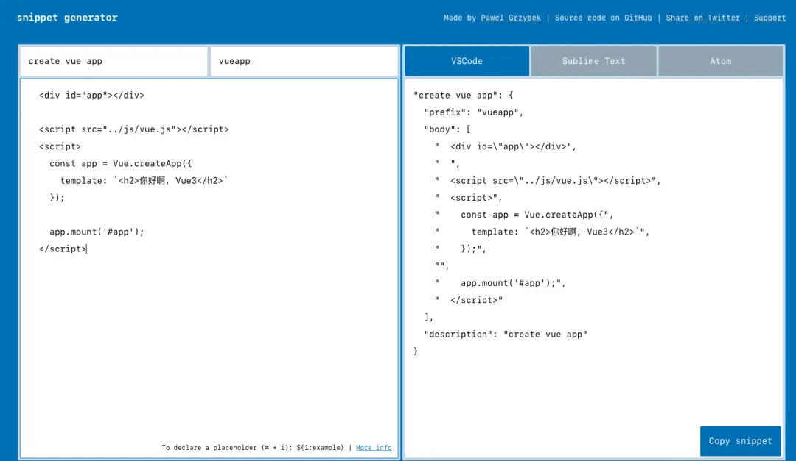

- 第三步，在 VSCode 中生成代码片段；

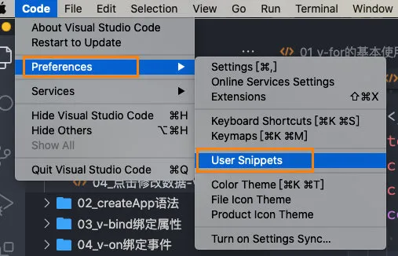

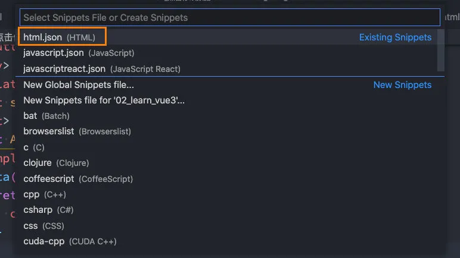

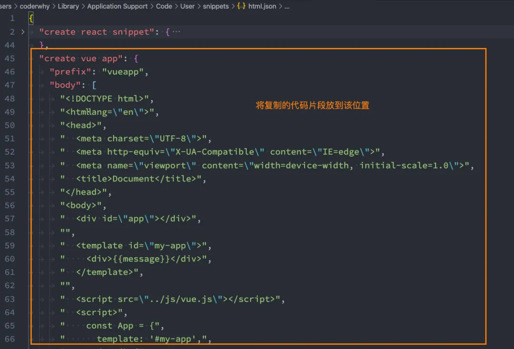

## 2. 模板语法

React 的开发模式：

- React 使用的`jsx`，所以对应的代码都是编写的类似于 js 的一种语法；
- 之后通过 Babel 将`jsx`编译成 `React.createElement` 函数调用；

==Vue 也支持 jsx 的开发模式==（后续有时间也会讲到）：

- 但是大多数情况下，使用基于 HTML 的模板语法；
- 在模板中，允许开发者以声明式的方式将 DOM 绑定到底层组件实例的数据；
- 在底层的实现中，Vue 将模板编译成虚拟 DOM 渲染函数，这个我会在后续给大家讲到；

所以，对于学习 Vue 来说，学习模板语法是非常重要的。

### 2.1. 插值语法

#### 2.1.1. mustache 语法

如果我们希望把数据显示到模板 `template` 中，使用最多的语法是 “Mustache”语法 (双大括号) 的文本插值：

```vue
<div>{{message}}</div>
```

并且我们前面提到过，data 返回的对象是有添加到 Vue 的响应式系统中，当 data 中的数据发生改变时，对应的内容也会发生更新。

当然，Mustache 中不仅仅可以是 data 中的属性，也可以是一个 JavaScript 的表达式：

```vue
<body>
  <div id="app"></div>

  <template id="my-app">
    <div>
      <!-- mustache基本使用 -->
      <h2>{{message}}</h2>
      
      <!-- JavaScript表达式 -->
      <h2>{{ counter * 2 }}</h2>
      <h2>{{ message.split(" ").reverse().join(" ") }}</h2>
      
      <!-- 调用一个methods中的函数 -->
      <h2>{{ reverse(message) }}</h2>
    </div>
  </template>

  <script src="../js/vue.js"></script>
  <script>
    // 创建App组件
    const App = {
      template: '#my-app',
      data() {
        return {
          message: "Hello World",
          counter: 10,
        }
      },
      methods: {
        reverse(msg) {
          return msg.split(" ").reverse().join(" ")
        }
      }
    }

    // 创建应用程序, 并且挂载
    Vue.createApp(App).mount('#app');
  </script>
</body>
```

但是下面的代码是错误的：

```javascript
<!-- 错误的写法 -->
<!-- 这是一个赋值语句, 不是表达式 -->
<h2>{{var name = "Hello"}}</h2>

<!-- 控制流的if语句也是不支持的, 可以使用三元运算符 -->
<h2>{{ if (true) { return message } }}</h2>
```

三元运算符是可以的：

```javascript
<!-- 三元运算符 -->
<h2>{{ true ? message: counter }}</h2>
```

#### 2.1.2. v-once

用于指定元素或者组件==只渲染一次==：

- 当数据发生变化时，元素或者组件以及其所有的更新数据将视为静态内容并且跳过；
- 该指令可以用于性能优化；

```vue
<h2 v-once>当前计数: {{counter}}</h2>
<button @click="increment">+1</button>
<!--点击按钮,当前计数的值不会发生改变-->
```

如果是子节点，也是只会渲染一次：

```vue
<div v-once>
  <h2>当前计数: {{counter}}</h2>
  <button @click="increment">+1</button> <!--点击按钮,当前计数的值不会发生改变-->
</div>
```

#### 2.1.3. v-text

用于更新元素的 textContent：

```vue
<span v-text="msg"></span>

<!-- 等价于 -->
<span>{{msg}}</span>
```

#### 2.1.4. v-html

默认情况下，如果我们展示的内容本身是 html 的，那么 vue 并不会对其进行特殊的解析。

如果我们希望这个内容被 Vue 可以解析出来，那么可以使用 v-html 来展示：

```vue
<body>
  <div id="app"></div>

  <template id="my-app">
    <div v-html='info'></div>
  </template>

  <script src="../js/vue.js"></script>
  <script>
    const App = {
      template: '#my-app',
      data() {
        return {
          info: `<span style='color: red; font-size: 30px'>哈哈哈</span>`
        }
      }
    }

    Vue.createApp(App).mount('#app');
  </script>
</body>
```

#### 2.1.5. v-pre

v-pre 用于跳过元素和它的子元素的编译过程，==显示原始的 Mustache 标签==：

- 跳过不需要编译的节点，加快编译的速度；

```vue
<div v-pre>{{message}}</div>
```

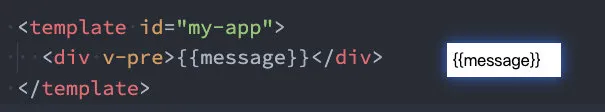

#### 2.1.6. v-cloak

这个指令保持在元素上直到关联组件实例结束编译。(在页面没有渲染完成的时候,页面上不要显示 Mustache 语法,而是**以空白展示**)

和 CSS 规则如 `[v-cloak] { display: none }` 一起用时，这个指令可以**隐藏**未编译的 Mustache 标签 直到组件实例准备完毕。

```vue
<style>
[v-cloak] {
  display: none;
}
</style>
```

```vue
<div v-cloak>
  {{ message }}
</div>
```

\<div> 不会显示，直到编译结束。

### 2.2. v-bind

前端讲的一系列指令，主要是和内容相关的，元素除了内容之外还会有各种各样的属性。

绑定属性我们使用 v-bind：

- **缩写**：`:`
- **预期**：`any (with argument) | Object (without argument)`
- **参数**：`attrOrProp (optional)`
- **用法**：动态地绑定一个或多个 attribute，或一个组件 prop 到表达式。

#### 2.2.1. 绑定基本属性

前面我们讲的 Mustache 等语法主要是将内容插入到 `innerHTML` 中。

很多时候，**元素的属性也是动态的**：

- 比如 a 元素的 href 属性、img 元素的 src 属性；

```vue
<div id="app"></div>

<template id="my-app">
  <div>{{ message }}</div>

  
  <!-- 语法糖写法 -->
  

  <!-- 注意这两种写法的不同 -->
  

  <!-- 绑定a元素 -->
  <a :href="href"></a>
</template>

<script src="../js/vue.js"></script>
<script>
const App = {
  template: "#my-app",
  data() {
    return {
      message: "Hello World",
      src: "https://avatars.githubusercontent.com/u/10335230?v=4",
      href: "http://www.baidu.com",
    };
  },
};

Vue.createApp(App).mount("#app");
</script>
```

#### 2.2.2. 绑定 class 属性

##### **对象语法**:

- 我们可以传给 `:class` (`v-bind:class` 的简写) 一个对象，以动态地切换 class。

```vue
<div id="app"></div>

<template id="my-app">
  <!-- 1.普通的绑定方式 -->
  <div :class="className">{{ message }}</div>

  <!-- 2.对象绑定 -->
  <!-- 动态切换class是否加入: {类(变量): boolean(true/false)} -->
  <div class="why" :class="{ nba: true, james: true }">对象绑定</div>

  <!-- 3.对象绑定的变形 -->
  <div :class="classObj">对象绑定的变形</div>

  <!-- 案例练习 -->
  <div :class="{ active: isActive }">哈哈哈</div>
  <button @click="toggle">切换</button>

  <!-- 4.从methods函数中获取 -->
  <div :class="getClassObj()">呵呵呵</div>
</template>

<script src="../js/vue.js"></script>
<script>
const App = {
  template: "#my-app",
  data() {
    return {
      message: "Hello World",
      className: "why",
      nba: "kobe",
      isActive: false,
      classObj: {
        why: true,
        kobe: true,
        james: false,
      },
    };
  },
  methods: {
    toggle() {
      this.isActive = !this.isActive;
    },
    getClassObj() {
      return {
        why: true,
        kobe: true,
        james: false,
      };
    },
  },
};

Vue.createApp(App).mount("#app");
</script>
```

##### 数组语法：

- 我们可以把一个数组传给 `:class`，以应用一个 class 列表；

```vue
<div id="app"></div>

<template id="my-app">
  <div :class="['why', nba]">哈哈哈</div>
  <div :class="['why', nba, isActive ? 'active' : '']">呵呵呵</div>
  <div :class="['why', nba, { actvie: isActive }]">嘻嘻嘻</div>
</template>

<script src="../js/vue.js"></script>
<script>
const App = {
  template: "#my-app",
  data() {
    return {
      message: "Hello World",
      nba: "kobe",
      isActive: true,
    };
  },
};

Vue.createApp(App).mount("#app");
</script>
```

#### 2.2.3. 绑定 style 属性

对象语法：

- `:style` 的对象语法十分直观——看着非常像 CSS，但其实是一个 JavaScript 对象。
- CSS property 名可以用驼峰式 (camelCase) 或短横线分隔 (kebab-case，记得用引号括起来) 来命名

```vue
<div id="app"></div>

<template id="my-app">
  <div :style="{ color: 'red', fontSize: '30px', 'background-color': 'blue' }">
    {{ message }}
  </div>
  <div
    :style="{ color: 'red', fontSize: size + 'px', 'background-color': 'blue' }"
  >
    {{ message }}
  </div>
  <div :style="{ background: `url('/logo.jpg')` }">绑定背景图片</div>
  <div :style="styleObj">{{ message }}</div>
</template>

<script src="../js/vue.js"></script>
<script>
const App = {
  template: "#my-app",
  data() {
    return {
      message: "Hello World",
      size: 50,
      styleObj: {
        color: "red",
        fontSize: "50px",
        "background-color": "blue",
      },
    };
  },
};

Vue.createApp(App).mount("#app");
</script>
```

数组语法：

- `:style` 的数组语法可以将多个样式对象应用到同一个元素上；

```vue
<div id="app"></div>

<template id="my-app">
  <div :style="[styleObj1, styleObj2]">{{ message }}</div>
</template>

<script src="../js/vue.js"></script>
<script>
const App = {
  template: "#my-app",
  data() {
    return {
      message: "Hello World",
      size: 50,
      styleObj1: {
        color: "red",
        fontSize: "50px",
        "background-color": "blue",
      },
      styleObj2: {
        textDecoration: "underline",
        fontWeight: 700,
      },
    };
  },
};

Vue.createApp(App).mount("#app");
</script>
```

#### 2.2.4. 动态绑定属性

属性的名称和值都是动态的

```vue
<template id="my-app">
  <!-- 属性的名称是动态的 -->
  <div :[name]="value">{{ message }}</div>
</template>

<script>
const App = {
  template: "#my-app",
  data() {
    return {
      name: "cba",
      value: "kobe",
    };
  },
};
Vue.createApp(App).mount("#app");
</script>
```

#### 2.2.5. 绑定一个对象

- info 对象会被拆解成 div 的各个属性；

```vue
<template id="my-app">
  <div v-bind="info">{{ message }}</div>
  <!--上面写法的语法糖-->
  <div :="info">{{ message }}</div>
</template>

//类似于这种属性绑定
<div name="萧兮" age="18">我是div</div>

<script>
const App = {
  template: "#my-app",
  data() {
    return {
      info: {
        name: "萧兮",
        age: 18,
      },
    };
  },
};
Vue.createApp(App).mount("#app");
</script>
```

### 2.3. v-on

前面我们绑定了元素的内容和属性，在前端开发中另外一个非常重要的特性就是**交互**。

在前端开发中，我们需要经常和用户进行各种各样的交互：

- 这个时候，我们就必须监听用户发生的时间，比如 点击、拖拽、键盘事件 等等
- 在 Vue 中如何监听事件呢？使用 v-on 指令

v-on 的使用：

- **缩写**：`@`

- **预期**：`Function | Inline Statement | Object`

- **参数**：`event`

- **修饰符**：

- - `.stop` - 调用 `event.stopPropagation()`。(阻止事件冒泡)
  - `.prevent` - 调用 `event.preventDefault()`。(阻止默认事件行为)
  - `.capture` - 添加事件侦听器时使用 capture 模式。
  - `.self` - 只当事件是从 侦听器 绑定的元素本身触发时才触发回调。
  - `.{keyAlias}` - 仅当事件是从特定键触发时才触发回调。
  - `.once` - 只触发一次回调。
  - `.left` - 只当点击鼠标左键时触发。
  - `.right` - 只当点击鼠标右键时触发。
  - `.middle` - 只当点击鼠标中键时触发。
  - `.passive` - `{ passive: true }` 模式添加侦听器

- **用法**：绑定事件监听

案例演练：

```vue
<div id="app"></div>

<template id="my-app">
  <div>{{ message }}</div>
  <!-- 基本使用 -->
  <!-- 1.绑定函数 -->
  <button v-on:click="btnClick">按钮1</button>
  <button @click="btnClick">按钮2</button>
  <div v-on:mousemove="mouseMove">div的区域</div>

  <!-- 2.绑定对象 -->
  <button v-on="{ click: btnClick, mousemove: mouseMove }">特殊按钮3</button>
  <br />

  <!-- 3.内联语句 -->
  <!-- 默认会把event对象传入 -->
  <button @click="btn4Click">按钮4</button>
  <!-- 内联语句传入其他属性 -->
  <button @click="btn4Click($event, 'why')">按钮5</button>

  <!-- 4.修饰符 -->
  <div @click="divClick">
    <button @click.stop="btnClick">按钮6</button>
  </div>

  <!-- 5.输入框回车事件 -->
  <input type="text" @keyup.enter="onEnter" />
</template>

<script src="../js/vue.js"></script>
<script>
const App = {
  template: "#my-app",
  data() {
    return {
      message: "Hello World",
    };
  },
  methods: {
    btnClick() {
      console.log("按钮被点击了");
    },
    btn4Click(event) {
      console.log(event);
    },
    btn4Click(event, message) {
      console.log(event, message);
    },
    mouseMove() {
      console.log("鼠标移动");
    },
    divClick() {
      console.log("divClick");
    },
    onEnter(event) {
      console.log(event.target.value);
    },
  },
};

Vue.createApp(App).mount("#app");
</script>
```

### 2.4. 条件渲染(v-if,v-show)

在某些情况下，我们需要根据当前的条件决定某些元素或组件是否渲染，这个时候我们就需要进行条件判断了。

Vue 提供了下面的指令来进行条件判断：

- v-if
- v-else
- v-else-if
- v-show

下面我们来对它们进行学习。

#### 2.4.1. v-if、v-else、v-else-if

v-if、v-else、v-else-if 用于根据条件来渲染某一块的内容：

- 这些内容只有在条件为 true 时，才会被渲染出来；
- 这三个指令与 JavaScript 的条件语句 if、else、else if 类似；

```vue
<!-- vue3中, template不再要求必须只有一个根元素 -->
<template id="my-app">
  <input type="text" v-model.number="score" />
  <h2 v-if="score > 90">优秀</h2>
  <h2 v-else-if="score > 80">良好</h2>
  <h2 v-else-if="score > 60">普通</h2>
  <h2 v-else>不及格</h2>
</template>
```

v-if 的渲染原理：

- v-if 是惰性的；
- 当条件为 false 时，其判断的内容完全不会被渲染或者会被销毁掉；
- 当条件为 true 时，才会真正渲染条件块中的内容；

#### 2.4.2. template 元素

因为 v-if 是一个指令，所以必须将其添加到一个元素上：

- 但是如果我们希望切换的是多个元素呢？
- 此时我们渲染 div，但是我们并不希望 div 这种元素被渲染；
- 这个时候，我们可以选择使用 template；

template 元素可以当做不可见的包裹元素，并且在 v-if 上使用，但是最终 template 不会被渲染出来：

- 有点类似于小程序中的 block

```vue
<template id="my-app">
  <template v-if="showHa">
    <h2>哈哈哈哈</h2>
    <h2>哈哈哈哈</h2>
    <h2>哈哈哈哈</h2>
  </template>
  <template v-else>
    <h2>呵呵呵呵</h2>
    <h2>呵呵呵呵</h2>
    <h2>呵呵呵呵</h2>
  </template>
  <button @click="toggle">切换</button>
</template>
```

#### 2.4.3. v-show

`v-show`和`v-if`的用法看起来是一致的：

```vue
<template id="my-app">
  <h2 v-show="isShow">哈哈哈哈</h2>
</template>
```

#### 2.4.4. v-show 和 v-if 区别

首先，在用法上的区别：

- v-show 是不支持 template；
- v-show 不可以和 v-else 一起使用；

其次，本质的区别：

- v-show 元素无论是否需要显示到浏览器上，它的 DOM 实际都是有渲染的，只是通过 CSS 的 display 属性来进行切换；
- v-if 当条件为 false 时，其对应的原生压根不会被渲染到 DOM 中；
- v-show 当条件为 false 时，其对应的元素会渲染,只不过他的 css 属性变成了 display: none ；

开发中如何进行选择呢？

- 如果我们的原生元素需要在显示和隐藏之间频繁的切换，那么使用 v-show ；
- 如果不会频繁的发生切换，那么使用 v-if ；

### 2.5. 列表渲染(v-for)

在真实开发中，我们往往会从服务器拿到一组数据，并且需要对其进行渲染。

- 这个时候我们可以使用 v-for 来完成；
- v-for 类似于 JavaScript 的 for 循环，可以用于遍历一组数据；

==注意: 当 v-for 和 v-if 出现在同一级时==

在 vue 2.x 语法中

- **v-for 的优先级更高**，如果同时出现在同级每次渲染都会先执行循环再判断条件，由此可见对性能损耗比较大，可使用计算属性先筛选需要的数据。

在 vue 3.x 语法中

- **v-if 的优先级更高**，因为 v-if 优先级高了，这意味着 v-if 将没有权限访问 v-for 里的变量，抛出错误。

强烈建议不要在同一级上使用 v-for 和 v-if。

#### 1.5.1. v-for 基本使用

v-for 的基本格式是 `"item in 数组"`：

- 数组通常是来自 data 或者 prop，也可以是其他方式；
- item 是我们给每项元素起的一个别名，这个别名可以自定来定义；

```vue
<template id="my-app">
  <h2>电影列表</h2>
  <ul>
    <li v-for="item in movies">{{ item }}</li>
  </ul>
</template>
```

我们知道，在遍历一个数组的时候会经常需要拿到数组的索引：

- 如果我们需要索引，可以使用格式：`"(item, index) in 数组"`；
- 注意上面的顺序：数组元素项 item 是在前面的，索引项 index 是在后面的；

```vue
<template id="my-app">
  <h2>电影列表</h2>
  <ul>
    <li v-for="(item, index) in movies">{{ index }}-{{ item }}</li>
  </ul>
</template>
```

#### 1.5.2. v-for 支持类型

v-for 也支持遍历对象，并且支持有一二三个参数：

- 一个参数：`"value in object"` ;
- 二个参数：`"(value, key) in object"`;
- 三个参数：`"(value, key, index) in object"`;

```vue
<template id="my-app">
  <h2>遍历对象</h2>
  <ul>
    <li v-for="(value, key, index) in info">
      {{ index }} - {{ key }} - {{ value }}
    </li>
  </ul>
</template>
```

v-for 同时也支持数字的遍历：

#### 1.5.3. template 元素

类似于 v-if ，你可以使用 `template` 元素来循环渲染一段包含多个元素的内容：

- 我们使用 template 来对多个元素进行包裹，而不是使用 div 来完成；

```vue
<div id="app"></div>

<template id="my-app">
  <ul>
    <template v-for="(value, key) in info">
      <li>{{ key }}</li>
      <li>{{ value }}</li>
      <hr />
    </template>
  </ul>
</template>

<script src="../js/vue.js"></script>
<script>
const App = {
  template: "#my-app",
  data() {
    return {
      info: {
        name: "why",
        age: 18,
        height: 1.88,
      },
    };
  },
};

Vue.createApp(App).mount("#app");
</script>
```

#### 1.5.4. 数组更新检测

Vue 将被侦听的数组的变更方法进行了包裹，所以它们也将会触发视图更新。这些被包裹过的方法包括：

- `push()`
- `pop()`
- `shift()`
- `unshift()`
- `splice()`
- `sort()`
- `reverse()`

**替换数组的方法**

上面的方法会直接修改原来的数组，但是某些方法不会替换原来的数组，而是会生成新的数组，比如 `filter()`、`concat()` 和 `slice()`。

```javascript
const nums = [10, 21, 34, 6];
const newNums = nums.filter((num) => num % 2 === 0);
console.log(newNums);
```

### 2.6. key 和 diff 算法

#### 2.6.1. 认识 VNode 和 VDOM

在使用 v-for 进行列表渲染时，我们通常会给元素或者组件绑定一个 key 属性。

这个 key 属性有什么作用呢？我们先来看一下官方的解释：

- key 属性主要用在 Vue 的虚拟 DOM 算法，在新旧 nodes 对比时辨识 VNodes(虚拟节点)；
- 如果不使用 key，Vue 会使用一种最大限度减少动态元素并且尽可能的尝试就地修改/复用相同类型元素的算法；
- 而使用 key 时，它会基于 key 的变化重新排列元素顺序，并且会移除/销毁 key 不存在的元素；

官方的解释对于初学者来说并不好理解，比如下面的问题：

- 什么是新旧 nodes，什么是 VNode？
- 没有 key 的时候，如何尝试修改和复用的？
- 有 key 的时候，如何基于 key 重新排列的？

我们先来解释一下 VNode 的概念：

- 因为目前我们还没有比较完整的学习组件的概念，所以目前我们先理解 HTML 元素创建出来的 VNode；
- VNode 的全称是 Virtual Node，也就是虚拟节点；
- 事实上，无论是组件还是元素，它们最终在 Vue 中表示出来的都是一个个 VNode；
- VNode 的本质是一个 JavaScript 的对象；

```html
<div class="title" style="font-size: 30px; color: red;">哈哈哈</div>
```

在我们的 Vue 中会被转化创建出一个 VNode 对象：

```javascript
const vnode = {
  type: "div",
  props: {
    class: "title",
    style: {
      "font-size": "30px",
      color: "red",
    },
  },
  children: "哈哈哈",
};
```

Vue 内部在拿到 vnode 对象后，会对 vnode 进行处理，渲染成真实的 DOM。

- 这一部分我会在后面专门和大家阅读 createApp 函数中讲到；

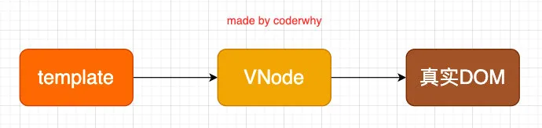

如果我们不只是一个简单的 div，而是有一大堆的元素，那么它们应该会形成一个 VNode

Tree：

```vue
<div>
  <p>
    <i>哈哈哈哈</i>
    <i>哈哈哈哈</i>
  </p>
  <span>嘻嘻嘻嘻</span>
  <strong>呵呵呵呵</strong>
</div>
```

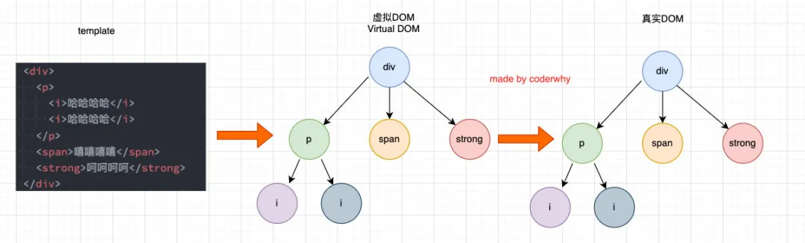

这个和我们的 key 有什么关系呢？

- 接下来我们就进行具体的分析；

#### 2.6.2. key 作用和 diff 算法

我们先来看一个例子：

- 这个例子是当我点击按钮时会在中间插入一个`f`；

```vue
<div id="app"></div>

<template id="my-app">
  <ul>
    <li v-for="item in letters">{{ item }}</li>
  </ul>
  <button @click="insertF">insert f</button>
</template>

<script src="../js/vue.js"></script>
<script>
const App = {
  template: "#my-app",
  data() {
    return {
      letters: ["a", "b", "c", "d"],
    };
  },
  methods: {
    insertF() {
      this.letters.splice(2, 0, "f"); //a b f c d
    },
  },
};

Vue.createApp(App).mount("#app");
</script>
```

我们可以确定的是，这次更新对于`ul`和`button`是不需要进行更新，需要更新的是我们`li`的列表：

- 在 Vue 中，对于相同父元素的子元素节点并不会重新渲染整个列表；
- 因为对于列表中 a、b、c、d 它们都是没有变化的；
- 在操作真实 DOM 的时候，我们只需要在中间插入一个`f` 的 li 即可；

那么 Vue 中对于列表的更新究竟是如何操作的呢？

- Vue 事实上会对于 有 key 和 没有 key 会调用两个不同的方法；
- 有 key，那么就使用 `patchKeyedChildren` 方法；
- 没有 key，那么就使用 `patchUnkeyedChildren` 方法；

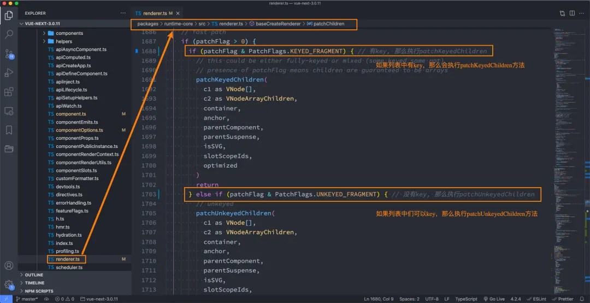

#### 2.6.3. 没有 key 执行操作

没有 key 对应的源代码如下：

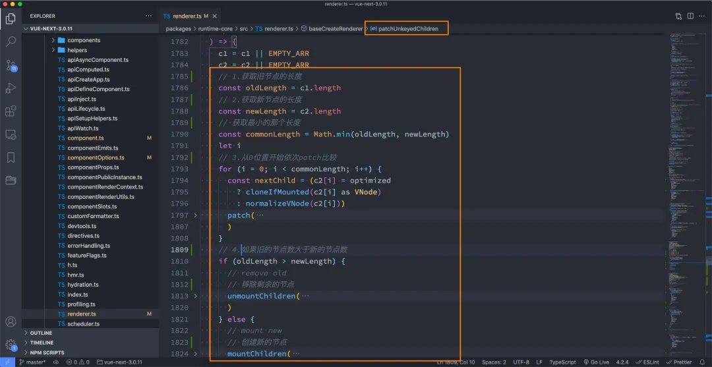

它的过程画图就是如下的操作：

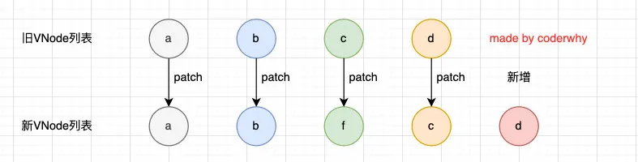

我们会发现上面的 diff 算法效率并不高：

- `c`和`d`来说它们事实上并不需要有任何的改动；
- 但是因为我们的`c`被`f`所使用了，所有后续所有的内容都要一次进行改动，并且最后进行新增；

#### 2.6.4. 有 key 执行操作

如果有 key，那么会执行什么样的操作呢？

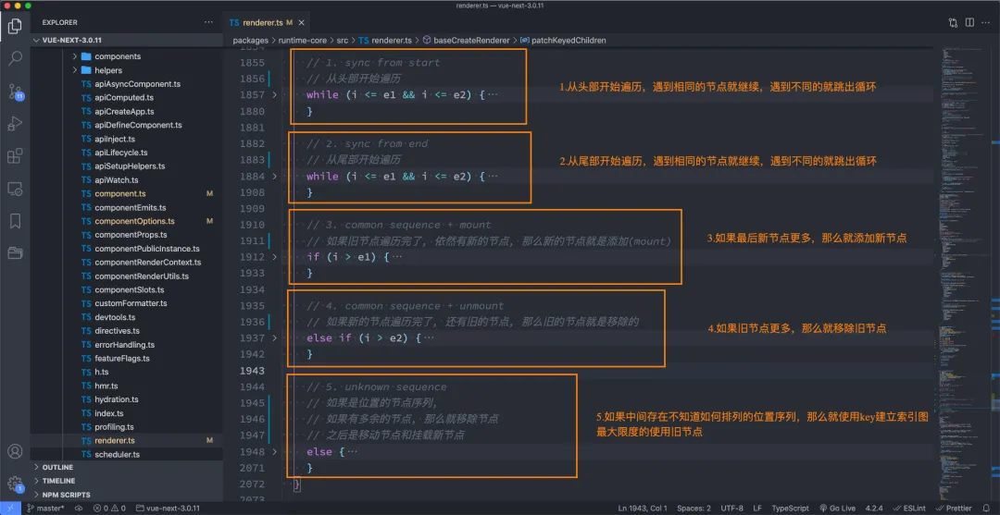

**第一步**的操作是从头开始进行遍历、比较：

- `a`和`b`是一致的会继续进行比较；
- `c`和`f`因为 key 不一致，所以就会 break 跳出循环；

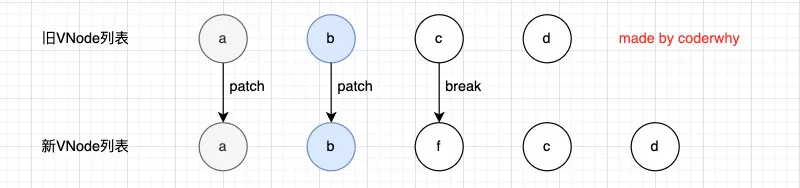

**第二步**的操作是从尾部开始进行遍历、比较：

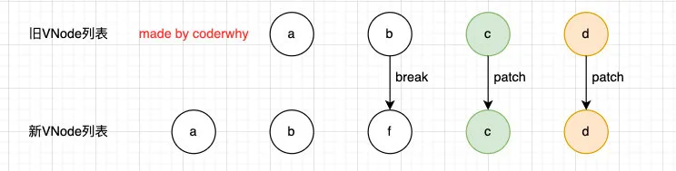

**第三步**是如果旧节点遍历完毕，但是依然有新的节点，那么就新增节点：

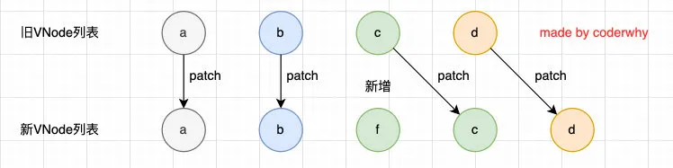

**第四步**是如果新的节点遍历完毕，但是依然有旧的节点，那么就移除旧节点：

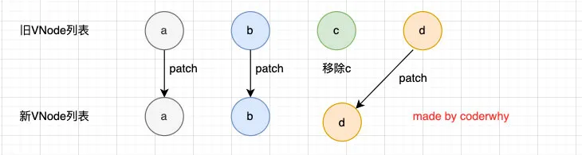

**第五步**是最特殊的情况，中间还有很多未知的或者乱序的节点：

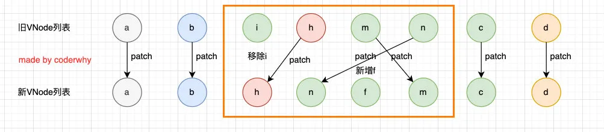

所以我们可以发现，Vue 在进行 diff 算法的时候，会尽量利用我们的 key 来进行优化操作：

- 在没有 key 的时候我们的效率是非常低效的；
- 在进行插入或者重置顺序的时候，保持相同的 key 可以让 diff 算法更加的高效；
