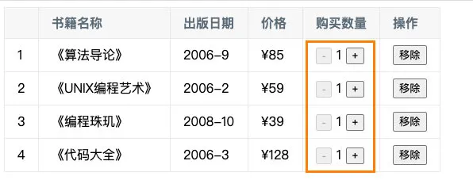

# Vue 基础语法(二)

## 1. Options API

### 1.1. 计算属性 computed

#### 1.1.1. 认识计算属性 computed

我们知道，在模板中可以直接通过插值语法显示一些 data 中的数据。

但是在某些情况，我们可能需要对数据进行一些转化后再显示，或者需要将多个数据结合起来进行显示；

- 比如我们需要对多个 data 数据进行 运算、三元运算符来决定结果、数据进行某种转化后显示；
- 在模板中使用表达式，可以非常方便的实现，但是设计它们的初衷是用于简单的运算；
- 在模板中放入太多的逻辑会让模板过重和难以维护；
- 并且如果多个地方都使用到，那么会有大量重复的代码；

我们有没有什么方法可以将逻辑抽离出去呢？

- 可以，其中一种方式就是将逻辑抽取到一个函数中，放到 methods 选项中；
- 但是，这种做法有一个直观的弊端，就是所有的 data 使用过程都会变成了一个方法的调用；
- 另外一种方式就是使用计算属性 computed；

什么是计算属性呢？

- 官方并没有给出直接的概念解释；
- 而是说：对于任何包含响应式数据的复杂逻辑，你都应该使用 **计算属性**；
- 计算属性将被混入到组件实例中。所有 getter 和 setter 的 `this` 上下文自动地绑定为组件实例；

那接下来我们通过案例来理解一下这个计算属性。

#### 1.1.2. 计算属性的基本使用

计算属性的用法：

- **选项：**computed

- **类型：**`{ [key: string]: Function | { get: Function, set: Function } }`

我们来看三个案例：

- 我们有两个变量：firstName 和 lastName，希望它们拼接之后在界面上显示；

- 我们有一个分数：score

- - 当 score 大于 60 的时候，在界面上显示及格；
  - 当 score 小于 60 的时候，在界面上显示不及格；

- 我们有一个变量 message，记录一段文字：比如 Hello World

- - 某些情况下我们是直接显示这段文字；
  - 某些情况下我们需要对这段文字进行反转；

我们可以有三种实现思路：

- 思路一：在模板语法中直接使用表达式；
- 思路二：使用 method 对逻辑进行抽取；
- 思路三：使用计算属性 computed；

思路一的实现：模板语法

- 缺点一：模板中存在大量的复杂逻辑，不便于维护（模板中表达式的初衷是用于简单的计算）；
- 缺点二：当有多次一样的逻辑时，存在重复的代码；
- 缺点三：多次使用的时候，很多运算也需要多次执行，没有缓存；

```vue
<template id="my-app">
  <!-- 1.实现思路一: -->
  <h2>{{ firstName + lastName }}</h2>
  <h2>{{ score >= 60 ? "及格" : "不及格" }}</h2>
  <h2>{{ message.split("").reverse().join(" ") }}</h2>
</template>
```

思路二的实现：method 实现

- 缺点一：我们事实上先显示的是一个结果，但是都变成了一种方法的调用；
- 缺点二：多次使用方法的时候，没有缓存，也需要多次计算；

```vue
<!-- 2.实现思路二: -->
<template id="my-app">
  <h2>{{ getFullName() }}</h2>
  <h2>{{ getResult() }}</h2>
  <h2>{{ getReverseMessage() }}</h2>
</template>

<script src="../js/vue.js"></script>
<script>
const App = {
  template: "#my-app",
  data() {
    return {
      firstName: "Kobe",
      lastName: "Bryant",
      score: 80,
      message: "Hello World",
    };
  },
  methods: {
    getFullName() {
      return this.firstName + " " + this.lastName;
    },
    getResult() {
      return this.score >= 60 ? "及格" : "不及格";
    },
    getReverseMessage() {
      return this.message.split(" ").reverse().join(" ");
    },
  },
};

Vue.createApp(App).mount("#app");
</script>
```

思路三的实现：computed 实现

- 注意：计算属性看起来像是一个函数，但是我们在使用的时候不需要加( )，这个后面讲 setter 和 getter 时会讲到；
- 我们会发现无论是直观上，还是效果上计算属性都是更好的选择；
- 并且计算属性是有缓存的；

```vue
<!-- 3.实现思路三: -->
<template id="my-app">
  <h2>{{ fullName }}</h2>
  <h2>{{ result }}</h2>
  <h2>{{ reverseMessage }}</h2>
</template>

<script src="../js/vue.js"></script>
<script>
const App = {
  template: "#my-app",
  data() {
    return {
      firstName: "Kobe",
      lastName: "Bryant",
      score: 80,
      message: "Hello World",
    };
  },
  computed: {
    fullName() {
      return this.firstName + this.lastName;
    },
    result() {
      return this.score >= 60 ? "及格" : "不及格";
    },
    reverseMessage() {
      return this.message.split(" ").reverse().join(" ");
    },
  },
};

Vue.createApp(App).mount("#app");
</script>
```

#### 1.1.3. 计算属性 vs methods

在上面的实现思路中，我们会发现 计算属性 和 methods 的实现看起来是差别是不大的，而且我们多次提到**计算属性有缓存**。

接下来我们来看一下同一个计算多次使用，计算属性和 methods 的差异：

```vue
<div id="app"></div>

<template id="my-app">
  <!-- 1.使用methods -->
  <h2>{{ getResult() }}</h2>
  <h2>{{ getResult() }}</h2>
  <h2>{{ getResult() }}</h2>

  <!-- 2.使用computed -->
  <h2>{{ result }}</h2>
  <h2>{{ result }}</h2>
  <h2>{{ result }}</h2>
</template>

<script src="../js/vue.js"></script>
<script>
const App = {
  template: "#my-app",
  data() {
    return {
      score: 90,
    };
  },
  computed: {
    result() {
      console.log("调用了计算属性result的getter");
      return this.score >= 60 ? "及格" : "不及格";
    },
  },
  methods: {
    getResult() {
      console.log("调用了getResult方法");
      return this.score >= 60 ? "及格" : "不及格";
    },
  },
};

Vue.createApp(App).mount("#app");
</script>
```

打印结果如下：

- 我们会发现 methods 在多次使用时，会调用多次；
- 而计算属性虽然使用了三次，但是计算的过程只调用了一次；


这是什么原因呢？

- 这是因为计算属性会基于它们的依赖关系进行**缓存**；
- 在数据不发生变化时，计算属性是不需要重新计算的；
- 但是如果依赖的数据发生变化，在使用时，计算属性依然会重新进行计算；

```vue
<template id="my-app">
  <input type="text" v-model="score" />

  <!-- 省略代码 -->
</template>

<script src="../js/vue.js"></script>
<script>
const App = {
  template: "#my-app",
  data() {
    return {
      score: 90,
    };
  },
  // 省略代码
};

Vue.createApp(App).mount("#app");
</script>
```

我们来看一下当分数变化时，方法和计算属性的反应：


#### 1.1.4. 计算属性的 setter 和 getter

计算属性在大多数情况下，只需要一个 getter 方法即可，所以我们会将计算属性直接写成一个函数。

但是，如果我们确实想设置计算属性的值呢？

- 这个时候我们也可以给计算属性设置一个 setter 的方法；

```vue
<template id="my-app">
  <h2>{{ fullName }}</h2>
  <button @click="setNewName">设置新名字</button>
</template>

<script src="../js/vue.js"></script>
<script>
const App = {
  template: "#my-app",
  data() {
    return {
      firstName: "Kobe",
      lastName: "Bryant",
    };
  },
  computed: {
    fullName: {
      get() {
        return this.firstName + " " + this.lastName;
      },
      set(value) {
        const names = value.split(" ");
        this.firstName = names[0];
        this.lastName = names[1];
      },
    },
  },
  methods: {
    setNewName() {
      this.fullName = "coder why";
    },
  },
};

Vue.createApp(App).mount("#app");
</script>
```

你可能觉得很奇怪，Vue 内部是如何对我们传入的是一个 getter，还是说是一个包含 setter 和 getter 的对象进行处理的呢？

- 事实上非常的简单，Vue 源码内部只是做了一个逻辑判断而已；


### 1.2. 侦听器 watch

#### 1.2.1. watch 的基本使用

侦听器的用法如下：

- **选项：**watch
- **类型：**`{ [key: string]: string | Function | Object | Array}`

什么是侦听器呢？

- 开发中我们在 data 返回的对象中定义了数据，这个数据通过插值语法等方式绑定到 template 中；
- 当数据变化时，template 会自动进行更新来显示最新的数据；
- 但是在某些情况下，我们希望在代码逻辑中监听某个数据的变化，这个时候就需要用侦听器 watch 来完成了；

举个栗子（例子）：

- 比如现在我们希望用户在 input 中输入一个问题；
- 每当用户输入了最新的内容，我们就获取到最新的内容，并且使用该问题去服务器查询答案；
- 那么，我们就需要实时的去获取最新的数据变化；

```vue
<div id="app"></div>

<template id="my-app">
  <label for="question">
    请输入问题:
    <input type="text" id="question" v-model="question" />
  </label>
</template>

<script src="../js/vue.js"></script>
<script>
const App = {
  template: "#my-app",
  data() {
    return {
      question: "",
      info: {
        name: "why",
      },
    };
  },
  watch: {
    question(newValue, oldValue) {
      this.getAnwser(newValue);
    },
  },
  methods: {
    getAnwser(question) {
      console.log(`${question}的问题答案是 哈哈哈哈`);
    },
  },
};

Vue.createApp(App).mount("#app");
</script>
```

#### 1.2.2. watch 的配置选项

我们先来看一个例子：

- 当我们点击按钮的时候会修改 info.name 的值；
- 这个时候我们使用 watch 来侦听 info，可以侦听到吗？答案是不可以。

```vue
<div id="app"></div>

<template id="my-app">
  <button @click="btnClick">修改info</button>
</template>

<script src="../js/vue.js"></script>
<script>
const App = {
  template: "#my-app",
  data() {
    return {
      info: {
        name: "why",
      },
    };
  },
  watch: {
    info(newValue, oldValue) {
      console.log(newValue, oldValue);
    },
  },
  methods: {
    btnClick() {
      this.info.name = "kobe";
    },
  },
};

Vue.createApp(App).mount("#app");
</script>
```

这是因为默认情况下，watch 只是在侦听 info 的**引用变化**，对于内部属性的变化是不会做出相应的：

- 这个时候我们可以使用一个选项`deep`进行更深层的侦听；
- 注意前面我们说过 watch 里面侦听的属性对应的也可以是一个 Object；

```js
watch: {
    info: {
        handler(newValue, oldValue) {
            console.log(newValue, oldValue);
        },
        deep: true
    }
}
```

还有另外一个属性，是希望一开始的就会立即执行一次：

- 这个时候无论后面数据是否有变化，侦听的函数都会有限执行一次；

```js
watch: {
    info: {
        handler(newValue, oldValue) {
            console.log(newValue, oldValue);
        },
        deep: true, //深度监听
        immediate: true  //立即监听
    }
}
```

#### 1.2.3. watch 的其他方式

我们直接来看官方文档的案例：

```javascript
const app = Vue.createApp({
  data() {
    return {
      a: 1,
      b: 2,
      c: {
        d: 4,
      },
      e: "test",
      f: 5,
    };
  },
  watch: {
    //最普通的watch用法
    a(val, oldVal) {
      console.log(`new: ${val}, old: ${oldVal}`);
    },

    // 字符串方法名,
    b: "someMethod",

    // 该回调会在任何被侦听的对象的 property 改变时被调用，不论其被嵌套多深。
    c: {
      handler(val, oldVal) {
        console.log("c changed");
      },
      deep: true,
    },

    // 该回调将会在侦听开始之后被立即调用
    e: {
      handler(val, oldVal) {
        console.log("e changed");
      },
      immediate: true,
    },

    // 你可以传入回调数组，它们会被逐一调用
    f: [
      "handle1",
      function handle2(val, oldVal) {
        console.log("handle2 triggered", val, oldVal);
      },
      {
        handler: function handle3(val, oldVal) {
          console.log("handle3 triggered", val, oldVal);
        },
      },
    ],
  },
  methods: {
    someMethod(newValue, oldValue) {
      console.log("b changed", newValue, oldValue);
    },
    handle1(val, oldVal) {
      console.log("handle 1 triggered", val, oldVal);
    },
  },
});
```

另外一个是 Vue3 文档中没有提到的，但是 Vue2 文档中有提到的是侦听对象的属性：

```javascript
//通过这种方式监听对象中的key的值的变化,可以检测到对象值变化之前的状态

"c.d": function (newValue, oldValue) {
          console.log(newValue, oldValue);
			},
```

还有另外一种方式就是使用 $watch 的 API：

- 我们可以在 created 的生命周期（后续会讲到）中，使用 this.$watch 来侦听；

- - 第一个参数是要侦听的源；
  - 第二个参数是侦听的回调函数 callback；
  - 第三个参数是额外的其他选项，比如 deep、immediate；

```javascript
created() {
    this.$watch('message', (newValue, oldValue) => {
        console.log(newValue, oldValue);
    }, {
        deep: true,
        immediate: true
    })
}
```

## 2. 阶段案例

### 2.1. 案例介绍

现在我们来做一个相对综合一点的练习：`书籍购物车`

案例效果如下：


案例说明：

- 1.在界面上以表格的形式，显示一些书籍的数据；
- 2.在底部显示书籍的总价格；
- 3.点击+或者-可以增加或减少书籍数量（如果为 1，那么不能继续-）；
- 4.点击移除按钮，可以将书籍移除（当所有的书籍移除完毕时，显示：购物车为空~）；

### 2.2. 项目搭建

#### 2.2.1. 模板引擎的搭建

我们先来搭建一下模板引擎：

- 它需要一个 table 来包裹需要展示的书籍内容；
- 需要一个 h2 元素用于计算商品的总价格；

在这里我们有一些数据和方法需要在组件对象（createApp 传入的对象）中定义：

- 比如 book 的数据；
- formatPrice、decrement、increment、handleRemove 的方法等；

```vue
<template id="my-app">
  <table>
    <thead>
      <tr>
        <th></th>
        <th>书籍名称</th>
        <th>出版日期</th>
        <th>价格</th>
        <th>购买数量</th>
        <th>操作</th>
      </tr>
    </thead>
    <tbody>
      <tr v-for="(item, index) in books" :key="item.id">
        <td>{{ index + 1 }}</td>
        <td>{{ item.name }}</td>
        <td>{{ item.date }}</td>
        <td>{{ formatPrice(item.price) }}</td>
        <td>
          <button @click="decrement(index)">-</button> {{ item.count }}
          <button @click="increment(index)">+</button>
        </td>
        <td><button @click="handleRemove(index)">移除</button></td>
      </tr>
    </tbody>
  </table>
  <h2>总价: {{ formatPrice(totalPrice) }}</h2>
</template>
```

#### 2.2.2. css 样式的实现

为了让表格好看一点，我们来实现一些 css 的样式：

```css
table {
  border: 1px solid #e9e9e9;
  border-collapse: collapse;
  border-spacing: 0;
}
th,
td {
  padding: 8px 16px;
  border: 1px solid #e9e9e9;
  text-align: left;
}
th {
  background-color: #f7f7f7;
  color: #5c6b77;
  font-weight: 600;
}
```

#### 2.2.3. 代码逻辑的实现

接下来我们来看一下代码逻辑的实现：

```javascript
const App = {
  template: "#my-app",
  data() {
    return {
      books: [
        { id: 1, name: "《算法导论》", date: "2006-9", price: 85.0, count: 1 },
        {
          id: 2,
          name: "《UNIX编程艺术》",
          date: "2006-2",
          price: 59.0,
          count: 1,
        },
        { id: 3, name: "《编程珠玑》", date: "2008-10", price: 39.0, count: 1 },
        { id: 4, name: "《代码大全》", date: "2006-3", price: 128.0, count: 1 },
      ],
    };
  },
  computed: {
    filterBooks() {
      return this.books.map((item) => {
        item.price = "¥" + item.price;
        return item;
      });
    },
    totalPrice() {
      return this.books.reduce((preValue, item) => {
        return preValue + item.price * item.count;
      }, 0);
    },
  },
  methods: {
    formatPrice(price) {
      return "¥" + price;
    },
    decrement(index) {
      this.books[index].count--;
    },
    increment(index) {
      this.books[index].count++;
    },
    handleRemove(index) {
      this.books.splice(index, 1);
    },
  },
};
Vue.createApp(App).mount("#app");
```

#### 2.2.4. 小的细节补充

这里我们补充一个小的细节，当我们的数量减到 1 的时候就不能再减了：



这里我们可以对 button 进行逻辑判断：

- 当 item.count 的数量 `<=` 1 的时候，我们可以将 disabled 设置为 true；

```javascript
<button @click="decrement(index)" :disabled="item.count <= 1">-</button>
```

完整代码:

```vue
<!DOCTYPE html>
<html lang="en">
  <head>
    <meta charset="UTF-8" />
    <meta http-equiv="X-UA-Compatible" content="IE=edge" />
    <meta name="viewport" content="width=device-width, initial-scale=1.0" />
    <title>Document</title>
    <script src="https://unpkg.com/vue@3/dist/vue.global.js"></script>
  </head>
  <body>
    <div id="app"></div>
    <template id="my-app">
      <table
        border="1px"
        cellspacing="0"
        cellpadding="5"
        style="text-align: center"
      >
        <thead>
          <tr>
            <th>序号</th>
            <th>书籍名称</th>
            <th>出版日期</th>
            <th>价格</th>
            <th>购买数量</th>
            <th>操作</th>
          </tr>
        </thead>
        <tbody>
          <tr v-for="(item, index) in books" :key="item.name">
            <td>{{ index + 1 }}</td>
            <td>{{ item.name }}</td>
            <td>{{ item.date }}</td>
            <td>{{ priceFormate(item.price) }}</td>
            <td>
              <button
                @click="toggleState(index, -1)"
                :disabled="item.count <= 0 ? true : false"
              >
                -
              </button>
              <span>{{ item.count }}</span>
              <button @click="toggleState(index, 1)">+</button>
            </td>
            <td><button @click="remove(index)">移除</button></td>
          </tr>
        </tbody>
      </table>
      <h1>总价格: {{ priceFormate(totalPrice) }}</h1>
    </template>
    <script>
      const App = {
        template: "#my-app",
        data() {
          return {
            books: [
              { name: "java书籍", date: "2022-09", price: 85, count: 1 },
              { name: "python书籍", date: "2022-01", price: 59, count: 1 },
              { name: "js书籍", date: "2020-06", price: 39, count: 1 },
              { name: "html书籍", date: "2014-09", price: 128, count: 1 },
            ],
          };
        },
        computed: {
          // 计算的总价
          totalPrice() {
            return this.books.reduce((pre, cur) => {
              return pre + cur.price * cur.count;
            }, 0);
          },
        },
        methods: {
          // 价格过滤器函数
          priceFormate(value) {
            return "¥" + value;
          },
          //   加减的函数
          toggleState(index, number) {
            this.books[index].count = this.books[index].count + number;
          },
          //   删除函数
          remove(index) {
            this.books.splice(index, 1);
          },
        },
      };
      Vue.createApp(App).mount("#app");
    </script>
  </body>
</html>
```

## 3. v-model 表单输入

### 3.1. v-model 基本用法

表单提交是开发中非常常见的功能，也是和用户交互的重要手段：

- 比如用户在登录、注册时需要提交账号密码；
- 比如用户在检索、创建、更新信息时，需要提交一些数据；

这些都要求我们可以在代码逻辑中获取到用户提交的数据，我们通常会使用 v-model 指令来完成：

- v-model 指令可以在表单 `input`、`textarea` 以及 `select` 元素上创建双向数据绑定；
- 它会根据控件类型自动选取正确的方法来更新元素；
- 尽管有些神奇，但 `v-model` 本质上不过是语法糖，它负责监听用户的输入事件来更新数据，并在某种极端场景下进行一些特殊处理；

```vue
<div id="app"></div>

<template id="my-app">
  <input type="text" v-model="message" />
  <h2>{{ message }}</h2>
</template>

<script src="../js/vue.js"></script>

<script>
const App = {
  template: "#my-app",
  data() {
    return {
      message: "Hello World",
    };
  },
};
Vue.createApp(App).mount("#app");
</script>
```


### 3.2. v-model 的原理

官方有说到，v-model 的原理其实是背后有两个操作：

- `v-bind` 绑定 value 属性的值；
- `v-on` 绑定 input 事件监听到函数中，函数会获取最新的值赋值到绑定的属性中；


事实上 v-model 的原理会比上面的更加复杂：


### 3.3. v-model 绑定其他

我们再来绑定一下其他的表单类型：textarea、checkbox、radio、select

```vue
<div id="app"></div>

<template id="my-app">
  <!-- 1.绑定textarea -->
  <div>
    <textarea v-model="article" cols="30" rows="10"></textarea>
    <h2>article当前的值是: {{ article }}</h2>
  </div>
  <!-- 2.绑定checkbox -->
  <!-- 2.1.单选框 -->
  <div>
    <label for="agreement">
      <input id="agreement" type="checkbox" v-model="isAgree" />同意协议
    </label>
    <h2>isAgree当前的值是: {{ isAgree }}</h2>
  </div>
  <!-- 2.2.多选框 -->
  <div>
    <label for="basketball">
      <input
        id="basketball"
        type="checkbox"
        value="basketball"
        v-model="hobbies"
      />篮球
    </label>
    <label for="football">
      <input
        id="football"
        type="checkbox"
        value="football"
        v-model="hobbies"
      />足球
    </label>
    <label for="tennis">
      <input id="tennis" type="checkbox" value="tennis" v-model="hobbies" />网球
    </label>
    <h2>hobbies当前的值是: {{ hobbies }}</h2>
  </div>
  <!-- 3.绑定radio -->
  <div>
    <label for="male">
      <input type="radio" id="male" v-model="gender" value="male" />男
    </label>
    <label for="female">
      <input type="radio" id="female" v-model="gender" value="female" />女
    </label>
    <h2>gender当前的值是: {{ gender }}</h2>
  </div>
  <!-- 4.绑定select -->
  <div>
    <select v-model="fruit">
      <option disabled value="">请选择喜欢的水果</option>
      <option value="apple">苹果</option>
      <option value="orange">橘子</option>
      <option value="banana">香蕉</option>
    </select>
    <h2>fruit当前的值是: {{ fruit }}</h2>
  </div>
</template>
<script src="../js/vue.js"></script>
<script>
const App = {
  template: "#my-app",
  data() {
    return {
      article: "Hello World",
      isAgree: false,
      gender: "male",
      fruit: "",
      hobbies: ["football"],
    };
  },
};
Vue.createApp(App).mount("#app");
</script>
```

### 3.4. v-model 的值绑定

目前我们在前面的案例中大部分的值都是在 template 中固定好的：

- 比如 gender 的两个输入框值 male、female；
- 比如 hobbies 的三个输入框值 basketball、football、tennis；

在真实开发中，我们的数据可能是来自服务器的，那么我们就可以先将值请求下来，绑定到 data 返回的对象中，再通过 v-bind 来进行值的绑定，这个过程就是**值绑定**。

这里不再给出具体的做法，因为还是 v-bind 的使用过程。

### 3.5. v-model 的修饰符

v-model 在使用的时候可以在后面跟一些修饰符，来完成一些特殊的操作。

#### 3.5.1. lazy 修饰符

lazy 修饰符是什么作用呢？

- 默认情况下，v-model 在进行双向绑定时，绑定的是`input`事件，那么会在每次内容输入后就将最新的值和绑定的属性进行同步；
- 如果我们在 v-model 后跟上 lazy 修饰符，那么会将绑定的事件切换为 `change` 事件，只有在提交时（比如回车）才会触发；

```vue
<template id="my-app">
  <input type="text" v-model.lazy="message" />
  <h2>{{ message }}</h2>
</template>
```

#### 3.5.2. number 修饰符

我们先来看一下 v-model 绑定后的值是什么类型的：

- message 总是 string 类型，即使在我们设置 type 为 number 也是 string 类型；

```vue
<template id="my-app">
  <!-- 类型 -->
  <input type="text" v-model="message" />
  <input type="number" v-model="message" />
  <h2>{{ message }}</h2>
</template>
<script src="../js/vue.js"></script>
<script>
const App = {
  template: "#my-app",
  data() {
    return { message: "" };
  },
  watch: {
    message(newValue) {
      console.log(newValue, typeof newValue);
    },
  },
};
Vue.createApp(App).mount("#app");
</script>
```

如果我们希望转换为数字类型，那么可以使用 `.number` 修饰符：

```vue
<template id="my-app">
  <!-- 类型 -->
  <input type="text" v-model.number="score" />
</template>
```

另外，在我们进行逻辑判断时，如果是一个 string 类型，在可以转化的情况下会进行隐式转换的：

- 下面的 score 在进行判断的过程中会进行隐式转化的；

```javascript
const score = "100";
//逻辑判断时,可以转换的情况下,会隐式的自动将一个string类型成一个number类型再来进行判断（隐式转化）
if (score > 90) {
  console.log("优秀");
}
```

#### 3.5.3. trim 修饰符

如果要自动过滤用户输入的首尾空白字符，可以给 v-model 添加 `trim` 修饰符：

```vue
<template id="my-app">
  <input type="text" v-model.trim="message" />
</template>
```

### 3.6. v-model 组件使用

v-model 也可以使用在组件上，Vue2 版本和 Vue3 版本有一些区别，具体的使用方法，后面讲组件化开发再具体学习。
