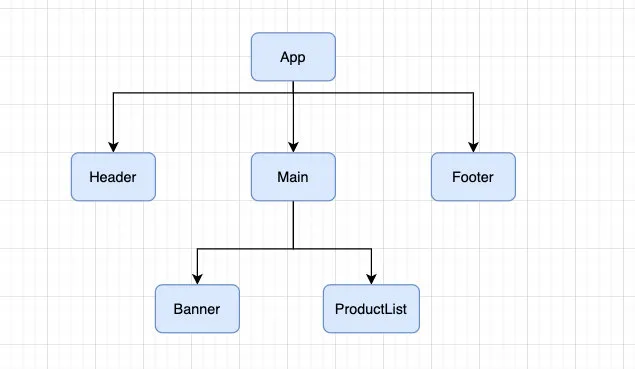
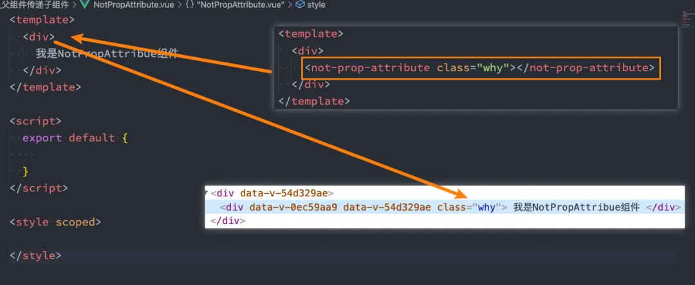
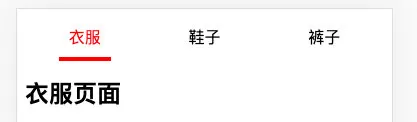
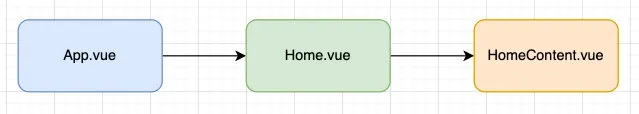
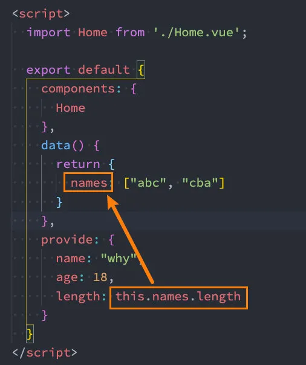
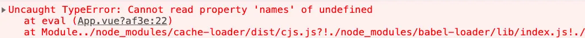
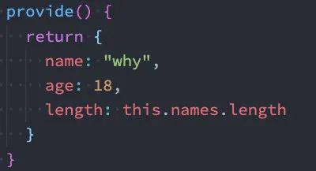
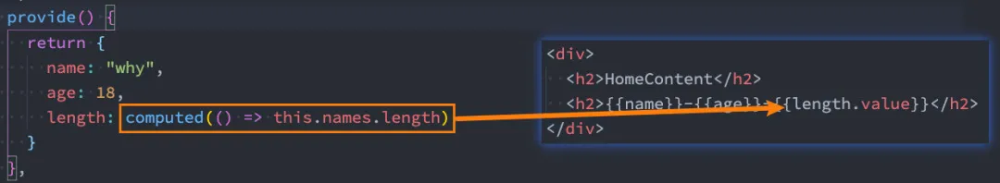

# 组件化之间通信

## 1. 认识组件的嵌套

### 1.1. App 单独开发

前面我们是将所有的逻辑放到一个 App.vue 中：

- 在之前的案例中，我们只是创建了一个组件 App；
- 如果我们一个应用程序将所有的逻辑都放在一个组件中，那么这个组件就会变成非常的臃肿和难以维护；
- 所以组件化的核心思想应该是对组件进行拆分，拆分成一个个小的组件；
- 再将这些组件组合嵌套在一起，最终形成我们的应用程序；

我们来分析一下下面代码的嵌套逻辑，假如我们将所有的代码逻辑都放到一个 App.vue 组件中：

```vue
<template>
  <div>
    <h2>Header</h2>
    <h2>NavBar</h2>
  </div>
  <div>
    <h2>Banner</h2>
    <ul>
      <li>商品列表1</li>
      <li>商品列表2</li>
      <li>商品列表3</li>
      <li>商品列表4</li>
      <li>商品列表5</li>
    </ul>
  </div>
  <div>
    <h2>Footer</h2>
    <h2>免责声明</h2>
  </div>
</template>

<script>
export default {};
</script>

<style scoped></style>
```

我们会发现，将所有的代码逻辑全部放到一个组件中，代码是非常的臃肿和难以维护的。并且在真实开发中，我们会有更多的内容和代码逻辑，对于扩展性和可维护性来说都是非常差的。

所有，在真实的开发中，我们会对组件进行拆分，拆分成一个个功能的小组件。

### 1.2. 组件的拆分

我们可以按照如下的方式进行拆分：



Header.vue 组件

```vue
<template>
  <div>
    <h2>Header</h2>
    <h2>NavBar</h2>
  </div>
</template>
```

Main.vue 组件：

```vue
<template>
  <div>
    <banner></banner>
    <product-list></product-list>
  </div>
</template>
```

Banner.vue 组件：

```vue
<template>
  <h2>Banner</h2>
</template>
```

ProductList 组件：

```vue
<template>
  <ul>
    <li>商品列表1</li>
    <li>商品列表2</li>
    <li>商品列表3</li>
    <li>商品列表4</li>
    <li>商品列表5</li>
  </ul>
</template>
```

Footer.vue 组件：

```vue
<template>
  <div>
    <h2>Footer</h2>
    <h2>免责声明</h2>
  </div>
</template>
```

按照如上的拆分方式后，我们开发对应的逻辑只需要去对应的组件编写就可。

### 1.3. 组件的通信

上面的嵌套逻辑如下，它们存在如下关系：

- App 组件是 Header、Main、Footer 组件的父组件；
- Main 组件是 Banner、ProductList 组件的父组件；

在开发过程中，我们会经常遇到需要组件之间相互进行通信：

- 比如 App 可能使用了多个 Header，每个地方的 Header 展示的内容不同，那么我们就需要使用者传递给 Header 一些数据，让其进行展示；
- 又比如我们在 Main 中一次性请求了 Banner 数据和 ProductList 数据，那么就需要传递给他们来进行展示；
- 也可能是子组件中发生了事件，需要有父组件来完成某些操作，那就需要 子组件向父组件 传递事件；

总之，在一个 Vue 项目中，组件之间的通信是非常重要的环节，所以接下来我们就具体学习一下组件之间是如何相互之间传递数据的；

## 2. 父子组件的相互通信

### 2.1. 父组件传递给子组件

在开发中很常见的就是父子组件之间通信，比如父组件有一些数据，需要子组件来进行展示：

- 这个时候我们可以通过 props 来完成组件之间的通信；

什么是 Props 呢？

- Props 是你可以在组件上注册一些自定义的 attribute；
- 父组件给这些 attribute 赋值，子组件通过 attribute 的名称获取到对应的值；

Props 有两种常见的用法：

- 方式一：字符串数组，数组中的字符串就是 attribute 的名称；
- 方式二：对象类型，对象类型我们可以在指定 attribute 名称的同时，指定它需要传递的 类型、是否是必须的、默认值等等；

#### 2.1.1. props 的数组用法

封装 ShowMessage.vue 组件：

```vue
<template>
  <div>
    <h2>组件展示的title:{{ title }}</h2>
    <p>组件展示的content: {{ content }}</p>
  </div>
</template>

<script>
export default {
  props: ["title", "content"],
};
</script>
```

通过 App.vue 传递给组件数据：

```vue
<template>
  <div>
    <show-message title="哈哈哈" content="我是哈哈哈"></show-message>
    <show-message title="呵呵呵" content="我是呵呵呵"></show-message>
  </div>
</template>

<script>
import ShowMessage from "./ShowMessage.vue";

export default {
  components: {
    ShowMessage,
  },
};
</script>
```

当然，我们也可以将 data 中的数据传递给子组件：

```vue
<template>
  <div>
    <show-message :title="title1" :content="content1"></show-message>
    <show-message :title="title2" :content="content2"></show-message>
  </div>
</template>

<script>
import ShowMessage from "./ShowMessage.vue";

export default {
  components: {
    ShowMessage,
  },
  data() {
    return {
      title1: "哈哈哈",
      content1: "我是哈哈哈",
      title2: "呵呵呵",
      content2: "我是呵呵呵",
    };
  },
};
</script>
```

当然，我们也可以直接传递一个对象：

```vue
<template>
  <div>
    <show-message
      :title="message.title"
      :content="message.content"
    ></show-message>
    <show-message v-bind="message"></show-message>
  </div>
</template>

<script>
import ShowMessage from "./ShowMessage.vue";

export default {
  components: {
    ShowMessage,
  },
  data() {
    return {
      message: {
        title: "嘿嘿嘿",
        content: "我是嘿嘿嘿",
      },
    };
  },
};
</script>
```

#### 2.1.2. props 的对象用法

数组用法中我们只能说明传入的 attribute 的名称，并不能对其进行任何形式的限制，接下来我们来看一下对象的写法是如何让我们的 props 变得更加完善的。

ShowMessage.vue 的 props 对象写法：

```vue
<template>
  <div>
    <h2>组件展示的title:{{ title }}</h2>
    <p>组件展示的content: {{ content }}</p>
  </div>
</template>

<script>
export default {
  props: {
    // 指定类型
    title: String,
    // 指定类型，同时指定是否必选、默认值
    content: { type: String, require: true, default: "哈哈哈" },
  },
};
</script>
```

**细节一：那么 type 的类型都可以是哪些呢？**

- String
- Number
- Boolean
- Array
- Object
- Date
- Function
- Symbol

**细节二：对象类型的其他写法**

```vue
<script>
export default {
  props: {
    // 基础的类型检查 (`null` 和 `undefined` 会通过任何类型验证)
    propA: Number,
    // 多个可能的类型
    propB: [String, Number],
    // 必填的字符串
    propC: { type: String, required: true },
    // 带有默认值的数字
    propD: { type: Number, default: 100 },
    // 带有默认值的对象
    propE: {
      type: Object,
      // 对象或数组默认值必须从一个工厂函数获取
      default() {
        return { message: "hello" };
      },
    },
    // 自定义验证函数
    propF: {
      validator(value) {
        // 这个值必须匹配下列字符串中的一个
        return ["success", "warning", "danger"].includes(value);
      },
    },
    // 具有默认值的函数
    propG: {
      type: Function,
      // 与对象或数组默认值不同，这不是一个工厂函数 ——> 这是一个用作默认值的函数
      default() {
        return "Default function";
      },
    },
  },
};
</script>
```

**细节三：Prop 的大小写命名(camelCase vs kebab-case)**

- HTML 中的 attribute 名是大小写不敏感的，所以浏览器会把所有大写字符解释为小写字符；
- 这意味着当你使用 DOM 中的模板时，camelCase (驼峰命名法) 的 prop 名需要使用其等价的 kebab-case (短横线分隔命名) 命名；

ShowMessage.vue 组件：

```vue
<template>
  <div>
    <p>{{ messageInfo }}</p>
  </div>
</template>

<script>
export default {
  props: {
    messageInfo: String,
  },
};
</script>
```

App.vue 组件中传入：

```vue
<template>
  <div>
    <show-message messageInfo="哈哈哈"></show-message>
    <show-message message-info="哈哈哈"></show-message>
  </div>
</template>
```

重申一次，如果你使用字符串模板，那么这个限制就不存在了。

#### 2.1.3. 非 Props 的 Attribute

什么是非 Prop 的 Attribute 呢？

- 当我们传递给一个组件某个属性，但是该属性并没有定义对应的 props 或者 emits 时，就称之为 `非Props的Attribute`；
- 常见的包括 class、style、id 属性等；

**Attribute 继承**

当组件有单个根节点时，非 Prop 的 Attribute 将自动添加到**根节点**的 Attribute 中：



**禁用 Attribute 继承**

如果我们不希望组件的根元素继承 attribute，可以在组件中设置 `inheritAttrs: false`：

- 禁用 attribute 继承 的常见情况是需要将 attribute 应用于根元素之外的其他元素；
- 我们可以通过 `$attrs` 来访问所有的 `非props的attribute`；

```vue
<template>
  <div>
    我是NotPropAttribue组件
    <h2 :class="$attrs.class"></h2>
  </div>
</template>
<script>
export default {
  inheritAttrs: false,
};
</script>
```

**多个根节点的 attribute**

多个根节点的 attribute 如果没有显示的绑定，那么会报警告，我们必须**手动的指定**要绑定到哪一个属性上：

```vue
<template>
  <div :class="$attrs.class">我是NotPropAttribue组件1</div>
  <div>我是NotPropAttribue组件2</div>
  <div>我是NotPropAttribue组件3</div>
</template>
```

### 2.2. 子组件传递给父组件

什么情况下 子组件 需要传递内容到 父组件 呢？

- 当子组件有一些事件发生的时候，比如在组件中发生了点击，父组件需要切换内容；
- 子组件有一些内容想要传递给父组件的时候；

我们如何完成上面的操作呢？

- 首先，我们需要在子组件中定义好在某些情况下触发的事件名称；
- 其次，在父组件中以 v-on 的方式传入要监听的事件名称，并且绑定到对应的方法中；
- 最后，在子组件中发生某个事件的时候，根据事件名称触发对应的事件；

#### 2.2.1. 自定义事件的流程

我们封装一个 CounterOperation.vue 的组件：

- 内部其实是监听两个按钮的点击，点击之后通过 `this.$emit` 的方式发出去事件；

```vue
<template>
  <div>
    <button @click="increment">+1</button>
    <button @click="decrement">-1</button>
  </div>
</template>

<script>
export default {
  emits: ["addOne", "subOne"],
  methods: {
    increment() {
      this.$emit("addOne");
    },
    decrement() {
      this.$emit("subOne");
    },
  },
};
</script>
```

我们可以在 App.vue 中来监听自定义组件发出的事件：

```vue
<template>
  <div>
    <h2>当前计数: {{ counter }}</h2>
    <counter-operation @addOne="add" @subOne="sub"></counter-operation>
  </div>
</template>
<script>
import CounterOperation from "./CounterOperation.vue";
export default {
  components: { CounterOperation },
  data() {
    return { counter: 0 };
  },
  methods: {
    add() {
      this.counter++;
    },
    sub() {
      this.counter--;
    },
  },
};
</script>
```

#### 2.2.2. 自定义事件的参数

自定义事件的时候，我们也可以传递一些参数给父组件：

```vue
<template>
  <div>
    <button @click="increment">+1</button>
    <button @click="incrementTen">+10</button>
    <button @click="decrement">-1</button>
  </div>
</template>
<script>
export default {
  emits: ["increment", "decrement", "incrementTen"],
  methods: {
    incrementTen() {
      this.$emit("incrementTen", 10);
    },
  },
};
</script>
<style scoped></style>
```

#### 2.2.2. 自定义事件的验证

在 vue3 当中，我们可以对传递的参数进行验证：

```vue
<template>
  <div>
    <button @click="addTen">+10</button>
  </div>
</template>
<script>
export default {
  emits: {
    addTen: function (payload) {
      if (payload === 10) {
        return true;
      }
      return false;
    },
  },
  methods: {
    incrementTen() {
      this.$emit("addTen", 10);
    },
  },
};
</script>
```

### 2.3. 组件间通信案例练习

我们来做一个相对综合的练习：



#### 2.3.1. TabControl 实现

TabControl.vue 的实现代码：

```vue
<template>
  <div class="tab-control">
    <template v-for="(item, index) in titles" :key="item">
      <div
        class="tab-control-item"
        @click="itemClick(index)"
        :class="{ active: index === currentIndex }"
      >
        <span class="underline">{{ item }}</span>
      </div>
    </template>
  </div>
</template>
<script>
export default {
  props: {
    titles: {
      type: Array,
      default() {
        return [];
      },
    },
  },
  emits: ["titleClick"],
  data() {
    return { currentIndex: 0 };
  },
  methods: {
    itemClick(index) {
      this.currentIndex = index;
      this.$emit("titleClick", index);
    },
  },
};
</script>
<style scoped>
.tab-control {
  display: flex;
  justify-content: space-between;
}
.tab-control-item {
  flex: 1;
  text-align: center;
  height: 40px;
  line-height: 40px;
}
.tab-control-item.active {
  color: red;
}
.tab-control-item.active span {
  display: inline-block;
  border-bottom: 4px solid red;
  padding: 0 10px;
}
</style>
```

#### 2.3.2. App 中的使用

我们在 App 中的使用过程如下：

```vue
<template>
  <div>
    <tab-control :titles="titles" @titleClick="titleClick"></tab-control>
    <h2>{{ contents[currentIndex] }}</h2>
  </div>
</template>
<script>
import TabControl from "./TabControl.vue";
export default {
  components: { TabControl },
  data() {
    return {
      titles: ["衣服", "鞋子", "裤子"],
      contents: ["衣服页面", "鞋子页面", "裤子页面"],
      currentIndex: 0,
    };
  },
  methods: {
    titleClick(index) {
      this.currentIndex = index;
    },
  },
};
</script>
```

## 3. 非父子组件的相互通信

在开发中，我们构建了组件树之后，除了父子组件之间的通信之外，还会有非父子组件之间的通信。

这里我们主要讲两种方式：

- Provide / Inject
- Mitt 全局事件总线；

### 3.1. Provide/Inject

Provide/Inject 用于非父子组件之间共享数据：

- 比如有一些深度嵌套的组件，子组件想要获取父组件的部分内容；
- 在这种情况下，如果我们仍然将 props 沿着组件链逐级传递下去，就会非常的麻烦；

对于这种情况下，我们可以使用 `Provide` 和 `Inject` ：

- 无论层级结构有多深，父组件都可以作为其所有子组件的依赖提供者；
- 父组件有一个 `provide` 选项来提供数据；
- 子组件有一个 `inject` 选项来开始使用这些数据；

实际上，你可以将依赖注入看作是“long range props”，除了：

- 父组件不需要知道哪些子组件使用它 provide 的 property
- 子组件不需要知道 inject 的 property 来自哪里

#### 3.1.1. 基本使用

我们开发一个这样的结构：



App.vue 组件提供数据：

```vue
<template>
  <div>
    <home></home>
  </div>
</template>

<script>
import Home from "./Home.vue";
export default { components: { Home }, provide: { name: "why", age: 18 } };
</script>
```

Home.vue 是中间的组件：

```vue
<template>
  <div>
    <home-content></home-content>
  </div>
</template>

<script>
import HomeContent from "./HomeContent.vue";
export default {
  components: { HomeContent },
};
</script>
```

HomeContent.vue 是获取数据的组件：

```vue
<template>
  <div>
    <h2>HomeContent</h2>
    <h2>{{ name }}-{{ age }}</h2>
  </div>
</template>

<script>
export default {
  inject: ["name", "age"],
};
</script>
```

#### 3.1.2. 函数写法

如果 Provide 中提供的一些数据是来自 data，那么我们可能会想要通过 this 来获取：



这个时候会报错：

- 这里给大家留一个思考题，我们的 this 使用的是哪里的 this？



如何解决这个问题呢？

- 我们需要将 provide 转成为返回对象的函数；这时 this 指向 vue 实例，所以可以调用组件 data 里的值。



#### 3.1.3. 处理响应式

我们先来验证一个结果：如果我们修改了 this.names 的内容，那么使用 length 的子组件会不会是响应式的？

```vue
<template>
  <div>
    <home></home>
    <button @click="addName">添加name</button>
  </div>
</template>
<script>
import Home from "./Home.vue";
export default {
  components: { Home },
  data() {
    return {
      names: ["abc", "cba"],
    };
  },
  provide() {
    return {
      name: "why",
      age: 18,
      length: this.names.length,
    };
  },
  methods: {
    addName() {
      this.names.push("why");
    },
  },
};
</script>
```

我们会发现对应的子组件中是没有反应的：

- 这是因为当我们修改了 names 之后，之前在 provide 中引入的 `this.names.length` 本身并不是响应式的；

那么怎么样可以让我们的数据变成响应式的呢？

- 非常的简单，我们可以使用响应式的一些 API 来完成这些功能，比如说 computed 函数；
- 当然，这个 computed 是 vue3 的新特性，在后面我会专门讲解，这里大家可以先直接使用一下；

注意：我们在使用 length 的时候需要获取其中的 value

- 这是因为 computed 返回的是一个 ref 对象，需要取出其中的 value 来使用；



Provide 和 Inject 也可以在 Composition API 中使用，后续我们会讲到的。

`app.vue 根组件`

```vue
<template>
  <div>
    我是根组件
    <button @click="addName">添加name</button>
  </div>
  <hr />
  <Father></Father>
</template>

<script>
import Father from "@/components/Father.vue";
import { computed } from "vue"; //在vue3 要导入一下 computed 函数
export default {
  name: "App",
  components: { Father },
  data() {
    return {
      message: "999",
      names: ["abc", "cba"],
    };
  },
  // 提供出去的值
  provide() {
    return {
      lengths: computed(() => this.names.length), //这样提供出去的值才是响应式的.
      message: computed(() => this.message),
    };
  },

  methods: {
    addName() {
      this.names.push("why");
      this.message = "666";
    },
  },
};
</script>
```

`son孙子组件.vue`

```vue
<template>
  <!-- 在vue3的代码中 记得加上 .value -->
  <div class="">我是自组件-{{ lengths.value }}----{{ message.value }}</div>
  <button @click="btnClick">按钮</button>
</template>

<script>
export default {
  name: "Soner",
  inject: ["message", "lengths"],
  data() {
    return {};
  },
  methods: {
    btnClick() {
      this.message = "hahahaha "; //这里修改的message,不会影响父组件中的message
      console.log(this.message);
    },
  },
};
</script>

<style lang="less" scoped></style>
```

#### 3.1.4.对象里面属性是响应式

provide 和 inject 绑定并不是可响应的。这是刻意为之的。然而，如果你传入了一个可 监听 的对象，那么其对象的属性还是可响应的。

这意味着，出于某种考虑，vue 故意将 provide/inject 设定为不可响应的。也就是说如果你的 provide 的数据改变，inject 是不会接受到这个改变，然而如果你 provide 的内容是一个可响应的数据，比如一个对象引用，那么这个对象的属性是可以检测到变化的。举例来说：

```js
provide(){
  return{
    foo:this.msg
  }
},
data() {
  return {
    msg: "hello",
  }
},
mounted(){
  setTimeout(()=>{
    this.msg = "world";
  },3000)
}
```

而此时你在子组件中去监测：

```js
inject:{
    foo: { default: {} }
}
```

就会发现不管父组件的 foo 怎么更改，子组件的 foo 都不会改变。
而如果你改变的不是对象，而是对象的属性，那么这个改变就可以被监测，举例来说：

```js
provide(){
  return{
    foo: this.msg
  }
},
data() {
  return {
    msg: {
        bar: 'hello'
    }
  }
},
mounted(){
  setTimeout(()=>{
    this.msg.bar = "world";
  },3000)
}
```

那么此时子组件就可以监听到属性的变动。
这里有一个重点，这个属性更改是以引用不变前提下的属性更改，如果引用变动了，那就是对象改变而不是对象的属性改变了。举个例子：

```js
mounted(){
  setTimeout(()=>{
      // 这种情况下叫改变了属性，属性的更改是可以响应的
    this.msg.bar = "world";
    // 这种情况就是对对象的重新赋值，也就是把对象引用都改了，这种是不可响应的
    this.msg = {
        bar: 'world'
    }
  },3000)
}
```

### 3.2. 全局事件总线

Vue3 从实例中移除了 `$on`、`$off` 和 `$once` 方法，所以我们如果希望继续使用全局事件总线，要通过第三方的库：

- Vue3 官方有推荐一些库，例如 mitt 或 tiny-emitter；
- 这里我们主要讲解一下 mitt 库的使用；

首先，我们需要先安装这个库：

```javascript
npm install mitt
```

其次，我们可以封装一个工具 `eventbus.js`：

```javascript
import mitt from "mitt"; // 可以创建很多个emitter对象

const emitter = mitt();
export default emitter;
```

在项目中可以使用它们：

- 我们在 Home.vue 中监听事件；
- 我们在 App.vue 中触发事件；

Home.vue 组件中监听事件：

```vue
<template>
  <div>展示根组件传递过来的值: {{ name }}</div>
</template>

<script>
import emitter from "./eventBus";
export default {
  data() {
    return {
      name: {},
    };
  },
  created() {
    emitter.on("why", (info) => {
      console.log("why event:", info);
      this.name = info;
    });
    //所有的事件,都会执行
    emitter.on("*", (type, e) => {
      console.log("* event:", type, e);
    });
  },
};
</script>
```

App.vue 中触发事件：

```vue
<template>
  <div>
    <home />
    <button @click="triggerEvent">触发事件</button>
    <button @click="btnClick">添加元素</button>
  </div>
</template>

<script>
import Home from "./Home.vue";
import emitter from "./eventBus";
export default {
  components: { Home },
  data() {
    return {
      names: ["abc", "cba"],
    };
  },
  methods: {
    triggerEvent() {
      emitter.emit("why", { name: this.names, age: 18 }); //响应式的数据
    },
    btnClick() {
      this.names.push("why"); //添加元素也是响应式的
    },
  },
};
</script>
```

其他 API 的补充，如果在某些情况下我们想要取消事件，可以使用下面的 API：

```javascript
// 取消emitter中所有的监听emitter.all.clear()
// 定义一个函数function onFoo() {} emitter.on('foo', onFoo)
// 监听emitter.off('foo', onFoo)
// 取消监听
```
