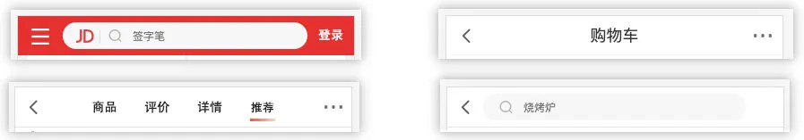
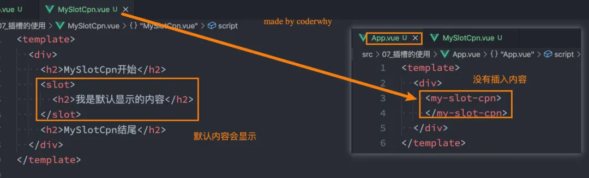
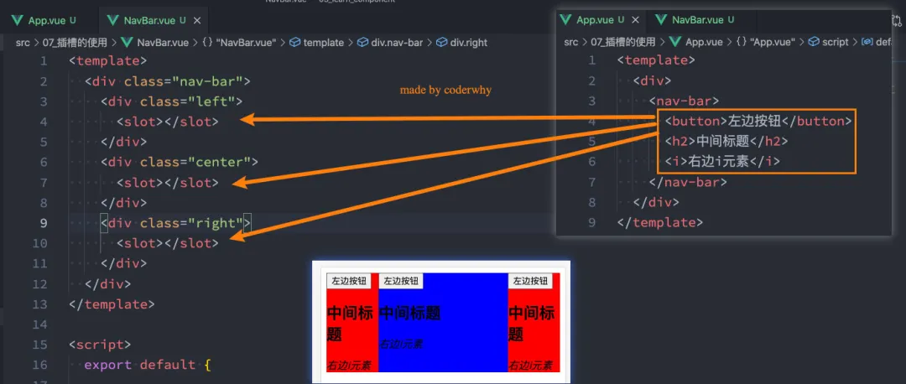
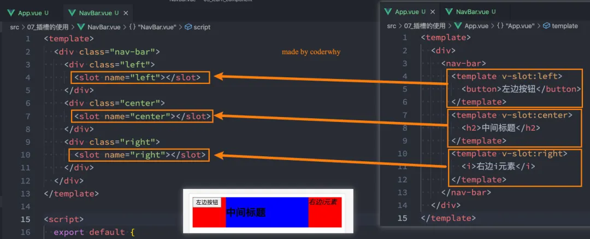
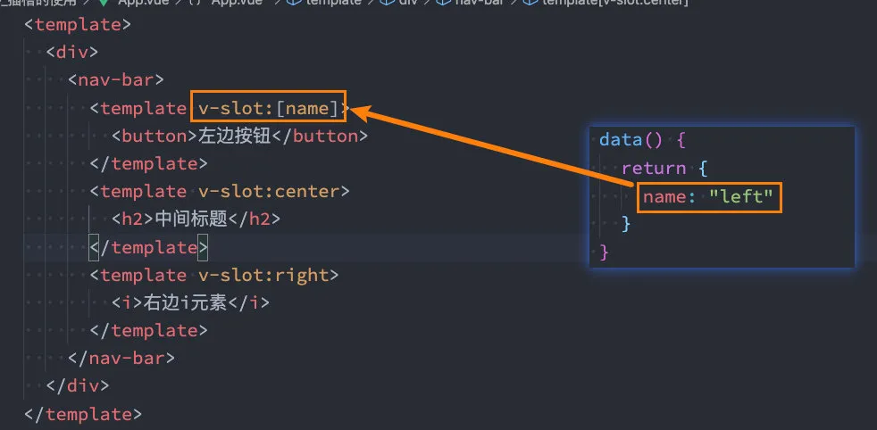
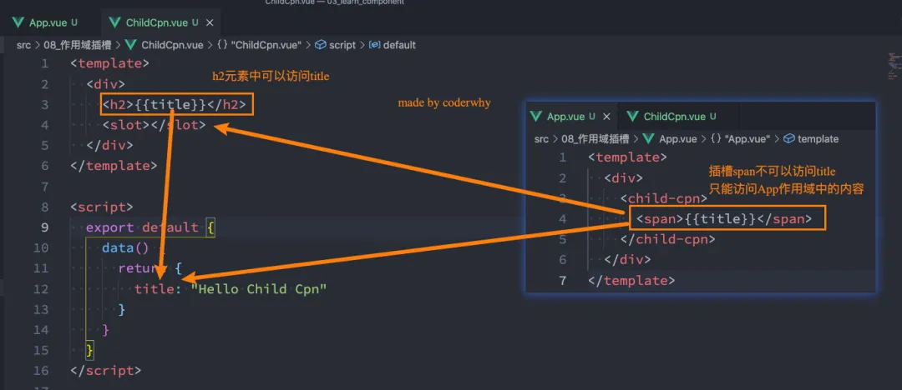
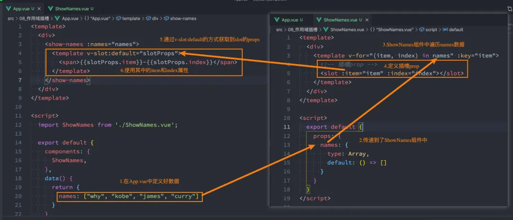
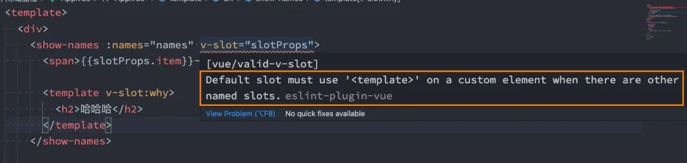
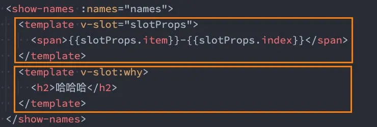

# 组件的插槽使用

## 1. 插槽的使用

### 1.1. 认识插槽 slot

在开发中，我们会经常封装一个个可复用的组件：

- 前面我们会通过 props 传递给组件一些数据，让组件来进行展示；
- 但是为了让这个组件具备更强的通用性，我们不能将组件中的内容限制为固定的 div、span 等等这些元素；
- 比如某种情况下我们使用组件希望组件显示的是一个按钮，某种情况下我们使用组件希望显示的是一张图片；
- 我们应该让使用者可以决定某一块区域到底存放什么内容；

举个栗子：假如我们定制一个通用的导航组件 - NavBar

- 这个组件分成三块区域：左边-中间-右边，每块区域的内容是不固定；
- 左边区域可能显示一个菜单图标，也可能显示一个返回按钮，可能什么都不显示；
- 中间区域可能显示一个搜索框，也可能是一个列表，也可能是一个标题，等等；
- 右边可能是一个文字，也可能是一个图标，也可能什么都不显示；



这个时候我们就可以来定义插槽 slot：

- 插槽的使用过程其实是**抽取共性、保留不同**；
- 我们会将共同的元素、内容依然在组件内进行封装；
- 同时会将不同的元素使用 slot 作为占位，让外部决定到底显示什么样的元素；

如何使用 slot 呢？

- Vue 中将 `<slot>` 元素作为承载分发内容的出口；
- 在封装组件中，使用特殊的元素`<slot>`就可以为封装组件开启一个插槽；
- 该插槽插入什么内容取决于父组件如何使用；

### 1.2. 插槽的使用

#### 1.2.1. 插槽的基本使用

我们一个组件 MySlotCpn.vue ：

- 该组件中有一个插槽，我们可以在插槽中放入需要显示的内容；

```vue
<template>
  <div>
    <h2>MySlotCpn开始</h2>
    <slot></slot>
    <h2>MySlotCpn结尾</h2>
  </div>
</template>
```

我们在 App.vue 中使用它们：

- 我们可以插入普通的内容、html 元素、组件元素，都可以是可以的；

```vue
<template>
  <div>
    <my-slot-cpn>
      <!-- 1.普通的内容 -->
      Hello World
      <!-- 2.html元素 -->
      <button>我是按钮</button>
      <!-- 3.组件元素 -->
      <my-button></my-button>
    </my-slot-cpn>
  </div>
</template>
```

#### 1.2.2. 插槽的默认内容

有时候我们希望在使用插槽时，如果没有插入对应的内容，那么我们需要显示一个默认的内容：

- 当然这个默认的内容只会在没有提供插入的内容时，才会显示；



#### 1.2.3. 具名插槽的使用

我们先测试一个知识点：如果一个组件中含有多个插槽，我们插入多个内容时是什么效果？

- 我们会发现默认情况下 每个插槽 都会获取到我们插入的内容来显示；



事实上，我们希望达到的效果是插槽对应的显示，这个时候我们就可以使用 **具名插槽**：

- 具名插槽顾名思义就是给插槽起一个名字，`<slot>` 元素有一个特殊的 attribute：name；
- 一个不带 name 的 slot，会带有隐含的名字 `default`；

```vue
<template>
  <div class="nav-bar">
    <div class="left">
      <slot></slot>
    </div>
    <div class="center">
      <slot></slot>
    </div>
    <div class="right">
      <slot></slot>
    </div>
  </div>
</template>
```

在向具名插槽提供内容的时候，我们可以在一个 `<template>` 元素上使用 `v-slot` 指令，并以 `v-slot` 的参数的形式提供其名称：

```vue
<!-- 根组件 -->
<template>
  <div>
    <nav-bar>
      <template v-slot:left>
        <button>左边按钮</button>
      </template>
      <template v-slot:center>
        <h2>中间标题</h2>
      </template>
      <template v-slot:right>
        <i>右边i元素</i>
      </template>
    </nav-bar>
  </div>
</template>
```

插槽的使用过程如下：



动态插槽名：

- 目前我们使用的插槽名称都是固定的；
- 比如 `v-slot:left`、`v-slot:center`等等；
- 我们可以通过 `v-slot:[dynamicSlotName]`方式动态绑定一个名称；



具名插槽使用的时候缩写：

- 跟 `v-on` 和 `v-bind` 一样，`v-slot` 也有缩写；
- 即把参数之前的所有内容 (`v-slot:`) 替换为字符 `#`；

```vue
<template>
  <div>
    <nav-bar>
      <template #left>
        <button>左边按钮</button>
      </template>
      <template #center>
        <h2>中间标题</h2>
      </template>
      <template #right>
        <i>右边i元素</i>
      </template>
    </nav-bar>
  </div>
</template>
```

## 2. 作用域插槽

### 2.1. 渲染作用域

在 Vue 中有渲染作用域的概念：

- 父级模板里的所有内容都是在父级作用域中编译的；
- 子模板里的所有内容都是在子作用域中编译的；

如何理解这句话呢？我们来看一个案例：

- 在我们的案例中 ChildCpn 自然是可以让问自己作用域中的 title 内容的；
- 但是在 App 中，是访问不了 ChildCpn 中的内容的，因为它们是跨作用域的访问；



### 2.2. 作用域插槽

但是有时候我们希望插槽 可以访问到子组件 中的内容是非常重要的：

- 当一个组件被用来渲染一个数组元素时，我们使用插槽，并且希望插槽中显示每项的内容；
- 这个 Vue 给我们提供了作用域插槽；

我们来看下面的一个案例：

- 1.在 App.vue 中定义好数据
- 2.传递给 ShowNames 组件中
- 3.ShowNames 组件中遍历 names 数据
- 4.定义插槽的 prop
- 5.通过 v-slot:default 的方式获取到 slot 的 props
- 6.使用 slotProps 中的 item 和 index



**具体的代码如下：**

App.vue 代码：

```vue
<template>
  <div>
    <show-names :names="names">
      <template v-slot:default="slotProps">
        <span>{{ slotProps.item }}-{{ slotProps.index }}</span>
      </template>
    </show-names>
  </div>
</template>

<script>
import ShowNames from "./ShowNames.vue";

export default {
  components: {
    ShowNames,
  },
  data() {
    return {
      names: ["why", "kobe", "james", "curry"],
    };
  },
};
</script>
```

ShowNames.vue 代码：

```vue
<template>
  <div>
    <template v-for="(item, index) in names" :key="item">
      <!-- 插槽prop -->
      <slot :item="item" :index="index"></slot>
    </template>
  </div>
</template>

<script>
export default {
  props: {
    names: {
      type: Array,
      default: () => [],
    },
  },
};
</script>
```

==自己的理解 :==

作用域插槽 就是把子组件中的 data 的属性值 传递 给父组件来展示。

`子组件.vue`

```vue
<template>
  <div>
    <h2>-------MySlotCpn开始-------</h2>

    <template v-for="(item, index) in names" :key="item">
      <slot :item="item" :index="index" :count="count"> content的默认值 </slot>
    </template>

    <h2>-------MySlotCpn结尾-------</h2>
  </div>
</template>

<script>
export default {
  name: "",
  props: {},
  data() {
    return {
      names: ["a", "b", "c", "d"],
      count: 99,
    };
  },
};
</script>

<style lang="less" scoped></style>
```

`父组件.vue`

```vue
<template>
  <h2>{{ message }}</h2>
  <MySlotCpn>
    <template v-slot:default="slotProps">
      <div>
        <button>{{ slotProps.item }}</button>
        <button>{{ slotProps.index }}</button>
        <button>{{ slotProps.count }}</button>
      </div>
    </template>
  </MySlotCpn>
</template>

<script>
import MySlotCpn from "./components/MySlotCpn.vue";
import MyBtn from "./components/MyBtn.vue";

export default {
  name: "App",
  components: {
    MySlotCpn,
    MyBtn,
  },
  data() {
    return {};
  },
};
</script>

<style></style>
```

### 2.3. 独占默认插槽

如果我们的插槽是默认插槽 default，那么在使用的时候 `v-slot:default="slotProps"`可以简写为`v-slot="slotProps"`：

```vue
<show-names :names="names">
  <template v-slot="slotProps">
		<span>{{slotProps.item}}-{{slotProps.index}}</span>
  </template>
</show-names>
```

并且如果我们的插槽只有默认插槽时，组件的标签可以被当做插槽的模板来使用，这样，我们就可以将 `v-slot` 直接用在组件上：

```vue
<show-names :names="names" v-slot="slotProps">
  <span>{{slotProps.item}}-{{slotProps.index}}</span>
</show-names>
```

但是，如果我们有默认插槽和具名插槽，那么按照完整的 template 来编写。



只要出现多个插槽，请始终为所有的插槽使用完整的基于 `<template>` 的语法：


