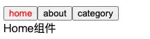
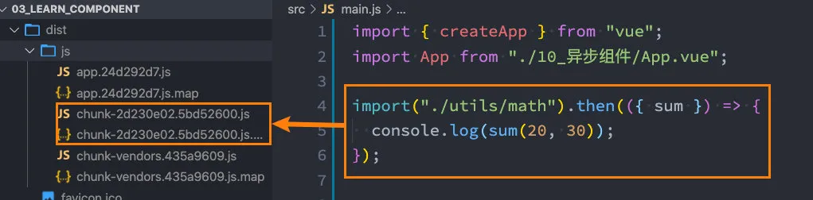
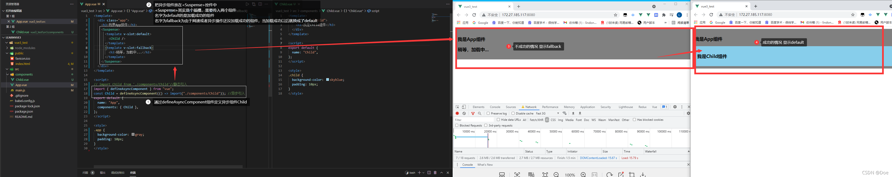
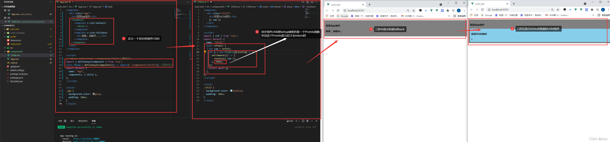
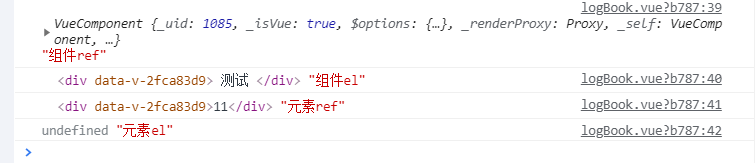
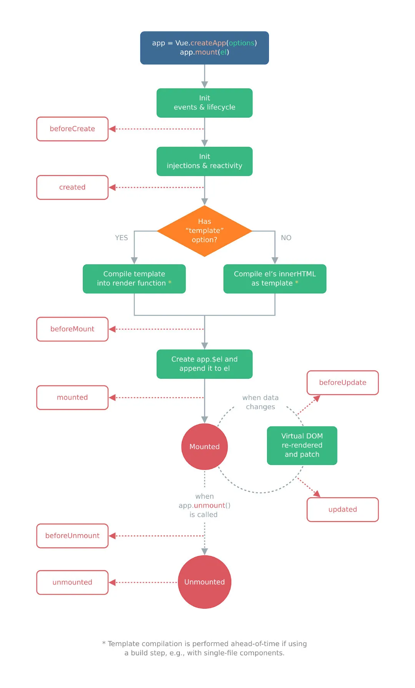
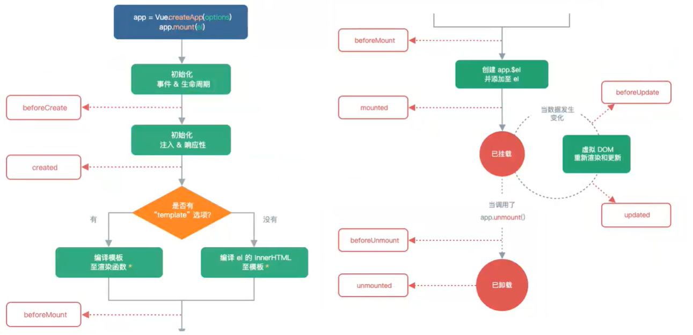
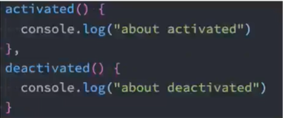
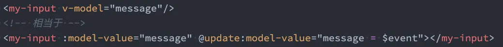

# 组件化知识补充

## 1. 动态组件

比如我们现在想要实现了一个功能：

- 点击一个 tab-bar，切换不同的组件显示；



这个案例我们可以通过两种不同的实现思路来实现：

- 方式一：通过 v-if 来判断，显示不同的组件；
- 方式二：动态组件的方式；

### 1.1. v-if 显示不同组件

我们可以先通过 v-if 来判断显示不同的组件，这个可以使用我们之前讲过的知识来实现：

```vue
<template>
  <div>
    <button
      v-for="tab in tabs"
      :key="tab"
      :class="{ active: currentTab === tab }"
      @click="tabClick(tab)"
    >
      {{ tab }}
    </button>

    <template v-if="currentTab === 'home'">
      <home></home>
    </template>
    <template v-else-if="currentTab === 'about'">
      <about></about>
    </template>
    <template v-else>
      <category></category>
    </template>
  </div>
</template>

<script>
import Home from "./pages/Home.vue";
import About from "./pages/About.vue";
import Category from "./pages/Category.vue";

export default {
  components: {
    Home,
    About,
    Category,
  },
  data() {
    return {
      tabs: ["home", "about", "category"],
      currentTab: "home",
    };
  },
  methods: {
    tabClick(tab) {
      this.currentTab = tab;
    },
  },
};
</script>

<style scoped>
.active {
  color: red;
}
</style>
```

这里不再给出过多解释，都是之前讲过的内容。

### 1.2. 动态组件的实现

动态组件是使用 `component` 组件，通过一个特殊的 attribute 通过 is 来实现：

```vue
<template>
  <div>
    <button
      v-for="tab in tabs"
      :key="tab"
      :class="{ active: currentTab === tab }"
      @click="tabClick(tab)"
    >
      {{ tab }}
    </button>

    <component :is="currentTab"></component>
  </div>
</template>
```

这个 currentTab 的值需要是什么内容呢？

- 可以是通过 component 函数注册的组件；
- 在一个组件对象的 component 对象中**注册的组件**；

### 1.3. 动态组件的传值

如果是动态组件我们可以给它们传值和监听事件吗？

- 也是一样的；
- 只是我们需要将属性和监听事件放到 component 上来使用；

App.vue 的代码如下：

```vue
<template>
  <div>
    <button
      v-for="tab in tabs"
      :key="tab"
      :class="{ active: currentTab === tab }"
      @click="tabClick(tab)"
    >
      {{ tab }}
    </button>

    <component name="why" :age="18" @pageClick="pageClick" :is="currentTab" />
  </div>
</template>

<script>
import Home from "./pages/Home.vue";
import About from "./pages/About.vue";
import Category from "./pages/Category.vue";

export default {
  components: {
    Home,
    About,
    Category,
  },
  data() {
    return {
      tabs: ["home", "about", "category"],
      currentTab: "home",
    };
  },
  methods: {
    tabClick(tab) {
      this.currentTab = tab;
    },
    pageClick(payload) {
      console.log("pageClick", payload);
    },
  },
};
</script>

<style scoped>
.active {
  color: red;
}
</style>
```

Home.vue 中的代码如下：

```vue
<template>
  <div @click="pageClick">Home组件: {{ name }}-{{ age }}</div>
</template>

<script>
export default {
  /*props: {
      name: String,
      age: Number
    },*/
  props: {
    name: {
      type: String,
      default: "",
    },
    age: {
      type: Number,
      default: 0,
    },
  },
  emits: ["pageClick"],
  methods: {
    pageClick() {
      this.$emit("pageClick", "Home组件");
    },
  },
};
</script>
```

### 1.4. keep-alive 使用

#### 1.4.1. 认识 keep-alive

我们先对之前的案例中 About 组件进行改造：

- 在其中增加了一个按钮，点击可以递增的功能；

```vue
<template>
  <div>
    About组件
    <button @click="counter++">{{ counter }}</button>
  </div>
</template>

<script>
export default {
  data() {
    return {
      counter: 0,
    };
  },
};
</script>
```

比如我们将 counter 点到 10，那么在切换到 home 再切换回来 about 时，状态是否可以保持呢？

- 答案是否定的；
- 这是因为默认情况下，我们在切换组件后，about 组件会被销毁掉，再次回来时会重新创建组件；

但是，在开发中某些情况我们希望继续保持组件的状态，而不是销毁掉，这个时候我们就可以使用一个内置组件：keep-alive。

```vue
<keep-alive>
  <component name="why" 
             :age="18" 
             @pageClick="pageClick" 
             :is="currentTab"/>
</keep-alive>
```

#### 1.4.2. keep-alive 属性

keep-alive 有一些属性

- `include` - `string | RegExp | Array`。只有名称匹配的组件会被缓存；
- `exclude` - `string | RegExp | Array`。任何名称匹配的组件都不会被缓存；
- `max` - `number | string`。最多可以缓存多少组件实例，一旦达到这个数字，那么缓存组件中**最近没有被访问**的实例会被销毁；

`include` 和 `exclude` prop 允许组件有条件地缓存：

- 二者都可以用逗号分隔字符串、正则表达式或一个数组来表示；

- 匹配首先检查组件自身的 `name` 选项；

- - 如果 `name` 选项不可用，则匹配它的局部注册名称 (父组件 `components` 选项的键值)；

```vue
<!-- 逗号分隔字符串 -->
<keep-alive include="a,b">
  <component :is="view"></component>
</keep-alive>

<!-- regex (使用 v-bind) -->
<keep-alive :include="/a|b/">
  <component :is="view"></component>
</keep-alive>

<!-- Array (使用 v-bind) -->
<keep-alive :include="['a', 'b']">
  <component :is="view"></component>
</keep-alive>
```

#### 1.4.3. 缓存的生命周期

> 对于生命周期的知识下面的四有讲解，因为这部分知识和 keep-alive 联系紧密，所以放到了这里。
>
> 大家可以等学习了生命周期后，再回头看这部分的内容。

对于缓存的组件来说，再次进入时，我们是不会执行 created 或者 mounted 等生命周期函数的：

- 但是有时候我们确实希望监听到何时重新进入到了组件，何时离开了组件；
- 这个时候我们可以使用`activated` 和 `deactivated` 这两个生命周期钩子函数来监听；

```vue
<template>
  <div>
    About组件
    <button @click="counter++">{{ counter }}</button>
  </div>
</template>

<script>
export default {
  name: "about",
  data() {
    return {
      counter: 0,
    };
  },
  // 当重新进入活跃状态时会回调
  activated() {
    console.log("about activated");
  },
  // 当离开活跃状态时会回调
  deactivated() {
    console.log("about deactivated");
  },
};
</script>
```

## 2. 异步组件

### 2.1. webpack 的代码分包

默认的打包过程：

- 默认情况下，在构建整个组件树的过程中，因为组件和组件之间是通过模块化直接依赖的，那么 webpack 在打包时就会将`组件模块`打包到一起（比如一个 app.js 文件中）；
- 这个时候随着项目的不断庞大，app.js 文件的内容过大，会造成**首屏的渲染速度变慢**；

打包时，代码的分包：

- 所以，对于一些不需要立即使用的组件，我们可以单独对它们进行拆分，拆分成一些小的代码块 chunk.js；
- 这些 chunk.js 会在需要时从服务器加载下来，并且运行代码，显示对应的内容；

**那么 webpack 中如何可以对代码进行分包呢？**

默认情况下，我们直接使用 import 来依赖一个模块时，是不会进行分包的：

```javascript
import { sum } from "./utils/math";

console.log(sum(20, 30));
```

如果我们希望进行分包，那么可以使用 import 函数：

```javascript
import("./utils/math").then(({ sum }) => {
  console.log(sum(20, 30));
});
```



### 2.2. vue 中实现异步组件

如果我们的项目过大了，对于某些组件我们希望通过异步的方式来进行加载（目的是可以对其进行分包处理），那么 Vue 中给我们提供了一个函数：`defineAsyncComponent`。

defineAsyncComponent 接受**两种类型的参数**：

- 类型一：工厂函数，该工厂函数需要返回一个 Promise 对象；
- 类型二：接受一个对象类型，对异步函数进行配置；

工厂函数类型一的写法：

```vue
<script>
import { defineAsyncComponent } from "vue";
const AsyncHome = defineAsyncComponent(() => import("./AsyncHome.vue"));

export default {
  components: {
    AsyncHome,
  },
};
</script>
```

对象类型类型二的写法：

```vue
<script>
import { defineAsyncComponent } from "vue";
// const AsyncHome = defineAsyncComponent(() => import("./AsyncHome.vue"));

import Loading from "./Loading.vue";
import Error from "./Error.vue";
const AsyncHome = defineAsyncComponent({
  // 工厂函数
  loader: () => import("./AsyncHome.vue"),
  // 加载过程中显示的组件
  loadingComponent: Loading,
  // 加载失败时显示的组件
  errorComponent: Error,
  // 在显示 loadingComponent 之前的延迟 | 默认值：200（单位 ms）
  delay: 200,
  // 如果提供了 timeout ，并且加载组件的时间超过了设定值，将显示错误组件
  // 默认值：Infinity（即永不超时，单位 ms）
  timeout: 3000,
  // 定义组件是否可挂起 | 默认值：true
  suspensible: false,
  /**
   *
   * @param {*} error 错误信息对象
   * @param {*} retry 一个函数，用于指示当 promise 加载器 reject 时，加载器是否应该重试
   * @param {*} fail  一个函数，指示加载程序结束退出
   * @param {*} attempts 允许的最大重试次数
   */
  onError(error, retry, fail, attempts) {
    if (error.message.match(/fetch/) && attempts <= 3) {
      // 请求发生错误时重试，最多可尝试 3 次
      retry();
    } else {
      // 注意，retry/fail 就像 promise 的 resolve/reject 一样：
      // 必须调用其中一个才能继续错误处理。
      fail();
    }
  },
});

export default {
  components: {
    AsyncHome,
  },
};
</script>
```

### 2.3. 异步组件和 Suspense

Suspense 作用

等待异步组件时渲染一些额外内容，让应用有更好的用户体验

使用步骤：

- 异步引入组件

  ```javascript
  import { defineAsyncComponent } from "vue";
  const Child = defineAsyncComponent(() => import("./components/Child.vue"));
  ```

- 使用`Suspense`包裹组件，并配置好`default` 与 `fallback`

```vue
<template>
  <div class="app">
    <h3>我是App组件</h3>
    <Suspense>
      <template v-slot:default>
        <Child />
      </template>
      <template v-slot:fallback>
        <h3>加载中.....</h3>
      </template>
    </Suspense>
  </div>
</template>
```

- 其中 `fallback`是由于网速或者其他原因没有加载成功时显示的组件，当加载成功后显示`default（default` 与 `fallback` 不可改名，因为 Suspense 相当于定义好的 slot 具名插槽`）`



Suspense 是一个 内置的全局组件，该组件**有两个插槽**：

- default：如果 default 可以显示，那么显示 default 的内容；
- fallback：如果 default 无法显示，那么会显示 fallback 插槽的内容；

```vue
<template>
  <div>
    <suspense>
      <template #default>
        <async-home></async-home>
      </template>
      <template #fallback>
        <loading />
      </template>
    </suspense>
  </div>
</template>
```

**Suspense 搭配 async 函数的 setup**

`App.vue（异步加载组件的父组件）`

```vue
<template>
  <div class="app">
    <h3>我是App组件</h3>
    <Suspense>
      <template v-slot:default>
        <Child />
      </template>
      <template v-slot:fallback>
        <h3>稍等，加载中...</h3>
      </template>
    </Suspense>
  </div>
</template>

<script>
// import Child from './components/Child'//静态引入
import { defineAsyncComponent } from "vue";
const Child = defineAsyncComponent(() => import("./components/Child")); //异步引入
export default {
  name: "App",
  components: { Child },
};
</script>

<style>
.app {
  background-color: gray;
  padding: 10px;
}
</style>
```

`定义setup为async的组件Child.vue`

```vue
<template>
  <div class="child">
    <h3>我是Child组件</h3>
    {{ sum }}
  </div>
</template>

<script>
import { ref } from "vue";
export default {
  name: "Child",
  async setup() {
    let sum = ref(0);
    let p = new Promise((resolve) => {
      setTimeout(() => {
        resolve({ sum });
      }, 3000);
    });
    return await p;
  },
};
</script>

<style>
.child {
  background-color: skyblue;
  padding: 10px;
}
</style>
```



## 3. 模块引用

### 3.1. $refs

某些情况下，我们在组件中想要直接获取到 **元素对象** 或者 **子组件** 实例：

- 在 Vue 开发中我们是不推荐进行 DOM 操作的；
- 这个时候，我们可以给元素或者组件绑定一个 ref 的 attribute 属性；

组件实例有一个$refs 属性：

- 它是一个对象 Object，持有注册过 `ref` attribute 的所有 DOM 元素和组件实例。

App.vue 的实现：

```vue
<template>
  <div>
    <h2 ref="title">哈哈哈</h2>
    <hello-world ref="helloCpn"></hello-world>

    <button @click="visitElement">访问元素或者组件</button>
  </div>
</template>

<script>
import HelloWorld from "./HelloWorld.vue";

export default {
  components: {
    HelloWorld,
  },
  methods: {
    visitElement() {
      // 访问元素
      console.log(this.$refs.title);
      // 访问组件实例
      this.$refs.helloCpn.showMessage();
    },
  },
};
</script>
```

HelloWorld.vue 实现：

```vue
<template>
  <div></div>
</template>

<script>
export default {
  methods: {
    showMessage() {
      console.log("我是HelloWorld组件的showMessage方法");
    },
  },
};
</script>
```

### 3.2. $parent

我们可以通过 $parent 来访问父元素。

`HelloWorld.vue`的实现：

- 这里我们也可以通过`$root`来实现，因为 App 是我们的根组件；

```vue
<template>
  <div>
    <button @click="visitParent">访问父组件</button>
  </div>
</template>

<script>
export default {
  methods: {
    showMessage() {
      console.log("我是HelloWorld组件的showMessage方法");
    },
    visitParent() {
      console.log(this.$parent.message);
    },
  },
};
</script>
```

- $el 获取到当前元素的父节点==> ` console.log(this.$refs.navBar.$el)`

案例

```vue
// 子组件
<template>
  <div>测试</div>
</template>

<script>
export default {
  name: "Test",
};
</script>
```

```vue
// 父组件
<Test ref="testCom" />
<!--组件-->
<div ref="test">11</div>
<!--普通dom元素-->
mounted() { console.log(this.$refs.testCom, '组件ref'); // 获取组件实例
console.log(this.$refs.testCom.$el, '组件el'); // 获取组件实例的dom元素
console.log(this.$refs.test, '元素ref'); // 获取dom元素
console.log(this.$refs.test.$el, '元素el'); // $el用于vue组件，普通dom元素不能用
}
```

结果如下图：



注意：在 Vue3 中已经移除了$children 的属性，所以不可以使用了。

## 4. 生命周期

### 4.1. 生命周期图片

什么是生命周期呢？

- 每个组件都会经历从 创建、挂载、更新、卸载 等一系列的过程；
- 在这个过程中的某一个阶段，用于可能会想要添加一些属于自己的代码逻辑（比如组件创建完后就请求一些服务器数据）；
- 但是我们如何可以知道目前组件正在哪一个过程呢？Vue 给我们提供了组件的生命周期函数；

生命周期函数：

- 生命周期函数是**一些钩子函数**，在**某个时间会被 Vue 源码内部进行回调**；
- 通过对生命周期函数的回调，我们可以**知道目前组件正在经历什么阶段**；
- 那么我们就可以在**该生命周期中编写属于自己的逻辑代码**了；





### 4.2. 生命周期演练

我们通过一个 App 和 Home 来演练所有的生命周期函数。

App.vue 组件对象：

```vue
<template>
  <div>
    <button @click="toggle">切换</button>
    <div v-if="isShow">
      <home></home>
    </div>
  </div>
</template>

<script>
import Home from "./Home.vue";

export default {
  components: {
    Home,
  },
  data() {
    return {
      isShow: true,
    };
  },
  methods: {
    toggle() {
      this.isShow = !this.isShow;
      console.log(this.isShow);
    },
  },
};
</script>
```

Home.vue 组件对象：

```vue
<template>
  <div>
    <button @click="changeMessage">修改message</button>
    <h2 ref="titleRef">{{ message }}</h2>
  </div>
</template>

<script>
export default {
  data() {
    return {
      message: "Hello World",
    };
  },
  methods: {
    changeMessage() {
      this.message = "你好啊,李银河";
    },
  },
  beforeUpdate() {
    console.log("beforeUpdate");
    console.log(this.$refs.titleRef.innerHTML);
  },
  updated() {
    console.log("updated");
    console.log(this.$refs.titleRef.innerHTML);
  },
  beforeCreate() {
    console.log("beforeCreate");
  },
  created() {
    console.log("created");
  },
  beforeMount() {
    console.log("beforeMount");
  },
  mounted() {
    console.log("mounted");
  },
  beforeUnmount() {
    console.log("beforeUnmount");
  },
  unmounted() {
    console.log("unmounted");
  },
};
</script>
```

经过测试，在某一个组件里面 data 属性值改变了。我们在 beforeUpdate 中获取的 data 的属性值是已经修改后的，在 updated 中获取的 data 属性值也是已经修改后的。

```vue
<template>
  <div class="hello">
    <hr />
    <div>Home页面</div>
    <button @click="changeMessage">修改message</button>
    <h2 ref="titleRef">{{ message }}</h2>
  </div>
</template>

<script>
export default {
  name: "HelloWorld",
  data() {
    return {
      message: "Hello World",
    };
  },
  methods: {
    // 按钮点击事件
    changeMessage() {
      this.message = "你好啊,李银河";
    },
  },
  beforeUpdate() {
    console.log("beforeUpdate");
    console.log(this.$refs.titleRef.innerHTML); //这个地方打印: Hello World
    console.log("修改前的值: ", this.message); //这个地方打印的message值: 你好啊,李银河
  },
  updated() {
    console.log("updated");
    console.log(this.$refs.titleRef.innerHTML); //这个地方打印: 你好啊,李银河
    console.log("修改后的值: ", this.message); //这个地方打印的message值: 你好啊,李银河
  },
  beforeCreate() {
    console.log("beforeCreate");
  },
  created() {
    console.log("created");
  },
  beforeMount() {
    console.log("beforeMount");
  },
  mounted() {
    console.log("mounted");
  },
  beforeUnmount() {
    console.log("beforeUnmount");
  },
  unmounted() {
    console.log("unmounted");
  },
};
</script>

<style scoped></style>
```

### 4.3 缓存组件的生命周期

对于缓存的组件来说，再次进入时，我们是**不会执行 created 或者 mounted 等生命周期函数**的：

- 但是有时候我们确实希望监听到何时重新进入到了组件，何时离开了组件；
- 这个时候我们可以使用**activated** 和**deactivated**这两个生命周期钩子函数来监听；



## 5. 组件的 v-model

### 5.1. 组件的 v-model

前面我们在 input 中可以使用 v-model 来完成双向绑定：

- 这个时候往往会非常方便，因为 v-model 默认帮助我们完成了两件事；
- `v-bind:value`的数据绑定和`@input`的事件监听；

如果我们现在封装了一个组件，其他地方在使用这个组件时，是否也可以使用 v-model 来同时完成这两个功能呢？

- 也是可以的，vue 也支持在组件上使用 v-model；

当我们在组件上使用的时候，等价于如下的操作：

- 我们会发现和 input 元素不同的，只是属性的名称和事件触发的名称而已；



那么，为了我们的 MyInput 组件可以正常的工作，这个组件内的 `<input>` 必须：

- 将其 `value` attribute 绑定到一个名叫 `modelValue` 的 prop 上；
- 在将其 `input` 事件被触发时，将新的值通过自定义的 `update:modelValue` 事件抛出；

MyInput.vue 的组件代码如下：

```vue
<template>
  <div>
    <input :value="modelValue" @input="inputChange" />
  </div>
</template>

<script>
export default {
  props: ["modelValue"],
  emits: ["update:modelValue"],
  methods: {
    inputChange(event) {
      this.$emit("update:modelValue", event.target.value);
    },
  },
};
</script>
```

在 App.vue 中，我们在使用 MyInput 可以直接使用 v-model：

```vue
<template>
  <div>
    <my-input v-model="message" />
    <button @click="changeMessage">修改message</button>
  </div>
</template>

<script>
import MyInput from "./MyInput.vue";

export default {
  components: {
    MyInput,
  },
  data() {
    return {
      message: "",
    };
  },
  methods: {
    changeMessage() {
      this.message = "Hello World";
    },
  },
};
</script>
```

### 5.2. computed 实现

在上面的案例中，我们可能会想到一种实现方法：直接将 Props 中的属性双向绑定到 input 上

```vue
<template>
  <div>
    <input v-model="Value" />
  </div>
</template>

<script>
export default {
  props: ["modelValue"],
  emits: ["update:modelValue"],
};
</script>
```

上面这种方式可以实现组件的双向绑定吗？答案是不可以

- 因为我们在内部修改了 props 之后，外界并不知道我们对 props 的修改，所以并不会将事件传递出去；
- 另外，在开发中直接修改 props 中的属性不是一个好的习惯，不要这样去做；

那么，我们依然希望在组件内部按照双向绑定的做法去完成，应该如何操作呢？我们可以使用计算属性的`setter`和`getter`来完成。

```vue
<template>
  <div>
    <input v-model="value" />
  </div>
</template>

<script>
export default {
  props: ["modelValue"],
  emits: ["update:modelValue"],
  computed: {
    value: {
      get() {
        return this.modelValue;
      },
      set(value) {
        this.$emit("update:modelValue", value);
      },
    },
  },
};
</script>
```

### 5.3. 绑定多个属性

我们现在通过 v-model 是直接绑定了一个属性，如果我们希望**绑定多个属性**呢？也就是我们希望在一个组件上使用多个 v-model 是否可以实现呢？

- 我们知道，默认情况下的 v-model 其实是绑定了 `modelValue` 属性和 `@update:modelValue`的事件；
- 如果我们希望绑定更多，可以给 v-model 传入一个参数，那么这个参数的名称就是我们绑定属性的名称；

我们先看一下在 App.vue 中我是如何使用的：

```vue
<template>
  <div>
    <!-- 绑定两个v-model -->
    <my-input v-model="message" v-model:title="title"></my-input>

    <h2>{{ message }}</h2>
    <h2>{{ title }}</h2>
  </div>
</template>

<script>
import MyInput from "./MyInput.vue";

export default {
  components: {
    MyInput,
  },
  data() {
    return {
      message: "Hello World",
      title: "哈哈哈",
    };
  },
};
</script>
```

注意：这里我是绑定了两个属性的

```vue
<my-input v-model="message" v-model:title="title" />
```

`v-model:title`相当于做了两件事：

- 绑定了`title`属性；
- 监听了 `@update:title`的事件；

所以，我们 MyInput 中的实现如下：

```vue
<template>
  <div>
    <input :value="modelValue" @input="input1Change" />
    <input :value="title" @input="input2Change" />
  </div>
</template>

<script>
export default {
  props: ["modelValue", "title"],
  emits: ["update:modelValue", "update:title"],
  methods: {
    input1Change(event) {
      this.$emit("update:modelValue", event.target.value);
    },
    input2Change(event) {
      this.$emit("update:title", event.target.value);
    },
  },
};
</script>
```

我们使用` v-modle` MyInput 组件的实现方式如下:

```vue
<template>
  <div>
    <input v-model="value" />
    <input v-model="why" />
  </div>
</template>

<script>
export default {
  props: {
    modelValue: String,
    title: String,
  },
  emits: ["update:modelValue", "update:title"],
  computed: {
    value: {
      set(value) {
        this.$emit("update:modelValue", value);
      },
      get() {
        return this.modelValue;
      },
    },
    why: {
      set(why) {
        this.$emit("update:title", why);
      },
      get() {
        return this.title;
      },
    },
  },
};
</script>

<style scoped></style>
```
