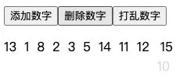

# Vue3 实现过渡动画

## 1. 基本过渡动画

### 1.1. 认识过渡动画

在开发中，我们想要给一个组件的 显示 和 消失 添加某种过渡动画，可以很好的增加用户体验：

- React 框架本身并没有提供任何动画相关的 API，所以在 React 中使用过渡动画我们需要使用一个第三方库 `react-transition-group`；
- Vue 中为我们提供一些内置组件和对应的 API 来完成动画，利用它们我们可以方便的实现过渡动画效果；

我们来看一个案例：

- Hello World 的显示和隐藏；
- 通过下面的代码实现，是不会有任何动画效果的；

```vue
<template>
  <div>
    <button @click="show = !show">Toogle</button>

    <h2 v-if="show">Hello World</h2>
  </div>
</template>

<script>
export default {
  data() {
    return {
      show: true,
    };
  },
};
</script>
```

没有动画的情况下，整个内容的显示和隐藏会非常的生硬：

- 如果我们希望给单元素或者组件实现过渡动画，可以使用 `transition` 内置组件来完成动画；

Vue 提供了 `transition` 的封装组件，在下列情形中，可以给任何元素和组件添加 进入/离开 过渡：

- 条件渲染 (使用 `v-if`)
- 条件展示 (使用 `v-show`)
- 动态组件
- 组件根节点

```vue
<template>
  <div>
    <button @click="show = !show">Toogle</button>

    <transition name="fade">
      <h2 v-if="show">Hello World</h2>
    </transition>
  </div>
</template>

<script>
export default {
  data() {
    return {
      show: true,
    };
  },
};
</script>

<style scoped>
.fade-enter-from,
.fade-leave-to {
  opacity: 0;
}

.fade-enter-to,
.fade-leave-from {
  opacity: 1;
}

.fade-enter-active,
.fade-leave-active {
  transition: opacity 1s ease;
}
</style>
```

我们会发现，Vue 自动给 h2 元素添加了动画，这是什么原因呢？

当插入或删除包含在 `transition` 组件中的元素时，Vue 将会做以下处理：

- 1.自动嗅探**目标元素是否应用了 CSS 过渡或者动画**，如果是**在恰当的时机添加/删除 CSS 类名**；
- 2.如果 `transition` 组件提供了 JavaScript 钩子函数，这些钩子函数将在恰当的时机被调用；
- 3.如果没有找到 JavaScript 钩子 并且也没有检测到 CSS 过渡/动画，DOM 插入、删除操作将会立即执行；

### 1.2. 过渡动画的 class

我们会发现上面提到了很多个 class，事实上 Vue 就是帮助我们在这些 class 之间来回切换完成的动画：

1. `v-enter-from`：定义进入过渡的开始状态。在元素被插入之前生效，在元素被插入之后的下一帧移除。(定义进入动画初始化状态)
2. `v-enter-active`：定义进入过渡生效时的状态。在整个进入过渡的阶段中应用，在元素被插入之前生效，在过渡/动画完成之后移除。这个类可以被用来定义进入过渡的过程时间，延迟和曲线函数。
3. `v-enter-to`：定义进入过渡的结束状态。在元素被插入之后下一帧生效 (与此同时 `v-enter-from` 被移除)，在过渡/动画完成之后移除。
4. `v-leave-from`：定义离开过渡的开始状态。在离开过渡被触发时立刻生效，下一帧被移除。
5. `v-leave-active`：定义离开过渡生效时的状态。在整个离开过渡的阶段中应用，在离开过渡被触发时立刻生效，在过渡/动画完成之后移除。这个类可以被用来定义离开过渡的过程时间，延迟和曲线函数。
6. `v-leave-to`：离开过渡的结束状态。在离开过渡被触发之后下一帧生效 (与此同时 `v-leave-from` 被删除)，在过渡/动画完成之后移除。


class 的 name 命名规则如下：

- 如果我们使用的是一个没有 name 的 transition，那么所有的 class 是以 `v-` 作为默认前缀；
- 如果我们添加了一个 name 属性，比如 `<transtion name="why">`，那么所有的 class 会以 `why-` 开头；

我们可以在上面的案例中增加位移的动画：

```css
.fade-enter-from {
  transform: translateX(-60px);
}

.fade-leave-to {
  transform: translateX(60px);
}
```

### 1.3. css 动画的实现

前面我们是通过 transition 来实现的动画效果，另外我们也可以通过 animation 来实现。

```vue
<template>
  <div class="app">
    <button @click="show = !show">Toogle</button>

    <transition name="bounce">
      <h2 v-if="show">
        但是太阳，他每时每刻都是夕阳也都是旭日。当他熄灭着走下山去收尽苍凉残照之际，正是他在另一面燃烧着爬上山巅布散烈烈朝辉之时。那一天，我也将沉静着走下山去，扶着我的拐杖。有一天，在某一处山洼里，势必会跑上来一个欢蹦的孩子，抱着他的玩具。
      </h2>
    </transition>
  </div>
</template>

<script>
export default {
  data() {
    return {
      show: true,
    };
  },
};
</script>

<style scoped>
.app {
  width: 500px;
  margin: 0 auto;
}

.bounce-enter-active {
  animation: bounce-in 0.5s;
}

.bounce-leave-active {
  animation: bounce-in 0.5s reverse;
}

@keyframes bounce-in {
  0% {
    transform: scale(0);
  }
  50% {
    transform: scale(1.25);
  }
  100% {
    transform: scale(1);
  }
}
</style>
```

### 1.4. transition 常见属性

#### 1.4.1. 同时使用过渡和动画

Vue 为了知道过渡的完成，内部是在监听 `transition` 或 `animation`，到底使用哪一个取决于元素应用的 CSS 规则：

- 如果我们只是使用了其中的一个，那么 Vue 能自动识别类型并设置监听；

但是如果我们同时使用了过渡和动画呢？

- 并且在这个情况下可能某一个动画执行结束时，另外一个动画还没有结束；
- 在这种情况下，我们可以设置 `type` 属性为 `animation` 或者 `transition` 来明确的告知 Vue 监听的类型；

```vue
<template>
  <div>
    <div>
      <button @click="show = !show">Toogle</button>
    </div>

    <transition name="why" type="transition" @after-enter="afterEnter">
      <h2 v-if="show">Hello World</h2>
    </transition>
  </div>
</template>

<script>
export default {
  data() {
    return {
      show: true,
    };
  },
  methods: {
    afterEnter() {
      console.log("进入完成");
    },
  },
};
</script>

<style scoped>
h2 {
  display: inline-block;
}

.why-enter-from,
.why-leave-to {
  opacity: 0;
}

.why-enter-to,
.why-leave-from {
  opacity: 1;
}

.why-enter-active,
.why-leave-active {
  transition: opacity 1s ease;
}

.why-enter-active {
  animation: move 5s ease;
}

@keyframes move {
  0% {
    transform: scale(0);
  }

  50% {
    transform: scale(1.25);
  }

  100% {
    transform: scale(1);
  }
}
</style>
```

#### 1.4.2. 显示的指定过渡时间

我们也可以显示的来指定过渡的时间，通过 `duration` 属性。

duration 可以设置两种类型的值：

- number 类型：同时设置进入和离开的过渡时间；
- object 类型：分别设置进入和离开的过渡时间；

number 类型的值：

```vue
<transition
  name="why"
  type="transition"
  @after-enter="afterEnter"
  :duration="3000"
>
  <h2 v-if="show">Hello World</h2>
</transition>
```

object 类型的值：

```vue
<transition
  name="why"
  type="transition"
  @after-enter="afterEnter"
  :duration="{ enter: 800, leave: 1000 }"
>
  <h2 v-if="show">Hello World</h2>
</transition>
```

#### 1.4.3. 过渡的模式 mode

我们来看当前的动画在 两个元素之间 切换的时候存在的问题：

```vue
<template>
  <div>
    <div>
      <button @click="show = !show">Toogle</button>
    </div>

    <transition name="why">
      <h2 v-if="show">Hello World</h2>
      <h2 v-else>你好啊,李银河</h2>
    </transition>
  </div>
</template>
```

我们会发现 `Hello World` 和 `你好啊，李银河`是同时存在的：

- 这是因为默认情况下进入和离开动画是**同时发生的**；
- 如果确实我们希望达到这个的效果，那么是没有问题；

但是如果我们不希望同时执行进入和离开动画，那么我们需要设置 transition 的**过渡模式**：

- `in-out`: 新元素先进行过渡，完成之后当前元素过渡离开；
- `out-in`: 当前元素先进行过渡，完成之后新元素过渡进入；

```vue
<template>
  <div class="app">
    <div><button @click="isShow = !isShow">显示/隐藏</button></div>

    <transition name="why" mode="out-in">
      <h2 class="title" v-if="isShow">Hello World</h2>
      <h2 class="title" v-else>你好啊,李银河</h2>
    </transition>
  </div>
</template>

<script>
export default {
  data() {
    return {
      isShow: true,
    };
  },
};
</script>

<style scoped>
.app {
  width: 200px;
  margin: 0 auto;
}

.title {
  display: inline-block;
}

.why-enter-from,
.why-leave-to {
  opacity: 0;
}

.why-enter-active,
.why-leave-active {
  transition: opacity 1s ease;
}

.why-enter-active {
  animation: bounce 1s ease;
}

.why-leave-active {
  animation: bounce 1s ease reverse;
}

@keyframes bounce {
  0% {
    transform: scale(0);
  }

  50% {
    transform: scale(1.2);
  }

  100% {
    transform: scale(1);
  }
}
</style>
```

#### 1.4.4. 动态组件的切换

上面的示例同样适用于我们的动态组件：

```vue
<template>
  <div>
    <div>
      <button @click="show = !show">Toogle</button>
    </div>
    <!-- 通过动态组件的方式,可以实现不同组件之间动画效果的切换 -->
    <transition name="why">
      <component :is="show ? 'home' : 'about'"></component>
    </transition>
  </div>
</template>
```

#### 1.4.5. appear 初次渲染

默认情况下，首次渲染的时候是没有动画的，如果我们希望给他添加上去动画，那么就可以增加另外一个属性 `appear` ：

```vue
<transition name="why" appear>
      <component :is="show ? 'home': 'about'"></component>
  </transition>
```

## 2. 结合第三方库

### 2.1. 结合 animate 库

#### 2.1.1. 认识 animate.css

如果我们手动一个个来编写这些动画，那么效率是比较低的，所以在开发中我们可能会引用一些第三方库的动画库，比如 animate.css。

什么是 animate.css 呢？

- **Animate.css** is a library of ready-to-use, cross-browser animations for use in your web projects. Great for emphasis, home pages, sliders, and attention-guiding hints.
- **Anmate.css**是一个已经准备好的、跨平台的动画库为我们的 web 项目，对于强调、主页、滑动、注意力引导非常有用；

如何使用 Animate 库呢？

- 第一步：需要安装 animate.css 库；
- 第二步：导入 animate.css 库的样式；
- 第三步：使用 animation 动画或者 animate 提供的类；

安装 animate.css：

```javascript
npm install animate.css
```

在 main.js 中导入 animate.css：

```javascript
import "animate.css";
```

#### 2.1.2. 自定义过渡类名

我们可以通过以下 attribute 来自定义过渡类名：

- `enter-from-class`
- `enter-active-class`
- `enter-to-class`
- `leave-from-class`
- `leave-active-class`
- `leave-to-class`

他们的优先级高于普通的类名，这对于 Vue 的过渡系统和其他第三方 CSS 动画库，如 Animate.css. 结合使用十分有用。

#### 2.1.3. animate.css 使用

animate.css 的原理非常简单，就是帮我们提前写好了很多的动画而已：

- 可以查看 animate.css 的源代码；

```css
@keyframes bounce {
  from,
  20%,
  53%,
  to {
    -webkit-animation-timing-function: cubic-bezier(0.215, 0.61, 0.355, 1);
    animation-timing-function: cubic-bezier(0.215, 0.61, 0.355, 1);
    -webkit-transform: translate3d(0, 0, 0);
    transform: translate3d(0, 0, 0);
  }

  40%,
  43% {
    -webkit-animation-timing-function: cubic-bezier(0.755, 0.05, 0.855, 0.06);
    animation-timing-function: cubic-bezier(0.755, 0.05, 0.855, 0.06);
    -webkit-transform: translate3d(0, -30px, 0) scaleY(1.1);
    transform: translate3d(0, -30px, 0) scaleY(1.1);
  }

  70% {
    -webkit-animation-timing-function: cubic-bezier(0.755, 0.05, 0.855, 0.06);
    animation-timing-function: cubic-bezier(0.755, 0.05, 0.855, 0.06);
    -webkit-transform: translate3d(0, -15px, 0) scaleY(1.05);
    transform: translate3d(0, -15px, 0) scaleY(1.05);
  }

  80% {
    -webkit-transition-timing-function: cubic-bezier(0.215, 0.61, 0.355, 1);
    transition-timing-function: cubic-bezier(0.215, 0.61, 0.355, 1);
    -webkit-transform: translate3d(0, 0, 0) scaleY(0.95);
    transform: translate3d(0, 0, 0) scaleY(0.95);
  }

  90% {
    -webkit-transform: translate3d(0, -4px, 0) scaleY(1.02);
    transform: translate3d(0, -4px, 0) scaleY(1.02);
  }
}
.animate__bounce {
  -webkit-animation-name: bounce;
  animation-name: bounce;
  -webkit-transform-origin: center bottom;
  transform-origin: center bottom;
}
```

接下来在使用的时候我们有两种用法：

- 用法一：直接使用 animate 库中定义的 keyframes 动画；
- 用法二：直接使用 animate 库提供给我们的类；

方式一：直接使用动画名称

```vue
<template>
  <div>
    <div>
      <button @click="show = !show">Toogle</button>
    </div>

    <transition name="why">
      <h2 v-if="show">Hello World</h2>
    </transition>
  </div>
</template>

<script>
export default {
  data() {
    return {
      show: true,
    };
  },
};
</script>

<style scoped>
h2 {
  display: inline-block;
}

.why-enter-active {
  animation: flip 1s; /*这里直接使用动画名称*/
}

.why-leave-active {
  animation: flip 1s reverse;
}
</style>
```


方式二：使用动画的类名

```vue
<template>
  <div>
    <div>
      <button @click="show = !show">Toogle</button>
    </div>

    <transition
      name="why"
      enter-active-class="animate__animated animate__lightSpeedInRight"
      leave-active-class="animate__animated animate__lightSpeedOutRight"
    >
      <h2 v-if="show">Hello World</h2>
    </transition>
  </div>
</template>
```

### 2.2. 结合 gsap 库

#### 2.2.1. 认识 gsap 库

某些情况下我们希望通过 JavaScript 来实现一些动画的效果，这个时候我们可以选择使用 gsap 库来完成。

什么是 gsap 呢？

- GSAP 是 The GreenSock Animation Platform（GreenSock 动画平台）的缩写；
- 它可以**通过 JavaScript 为 CSS 属性、SVG、Canvas 等设置动画**，并且是浏览器兼容的；

这个库应该如何使用呢？

- 第一步：需要安装 gsap 库；
- 第二步：导入 gsap 库；
- 第三步：使用对应的 api 即可；

我们先对库来进行一个安装：

```javascript
npm install gsap
```

#### 2.2.2. JavaScript 钩子

在使用动画之前，我们先来看一下 transition 组件 给我们提供的 JavaScript 钩子，这些钩子可以帮助我们监听动画执行到什么阶段了。

```vue
<transition
  @before-enter="beforeEnter"
  @enter="enter"
  @after-enter="afterEnter"
  @enter-cancelled="enterCancelled"
  @before-leave="beforeLeave"
  @leave="leave"
  @after-leave="afterLeave"
  @leave-cancelled="leaveCancelled"
  :css="false"
>
  <!-- ... -->
</transition>
```

```vue
<script>
export default {
  data() {
    return {
      show: true,
    };
  },
  methods: {
    beforeEnter() {
      console.log("beforeEnter");
    },
    enter(el, done) {
      console.log("enter");
      done();
    },
    afterEnter() {
      console.log("afterEnter");
    },
    enterCancelled() {
      console.log("enterCancelled");
    },

    beforeLeave() {
      console.log("beforeLeave");
    },
    leave(el, done) {
      console.log("leave");
      done();
    },
    afterLeave() {
      console.log("afterLeave");
    },
    leaveCancelled() {
      console.log("leaveCancelled");
    },
  },
};
</script>
```

当我们使用 JavaScript 来执行过渡动画时，需要进行 `done` 回调，否则它们将会被同步调用，过渡会立即完成。

添加 `:css="false"`，也会让 Vue 会跳过 CSS 的检测，除了性能略高之外，这可以避免过渡过程中 CSS 规则的影响。一旦加上了这个属性,后续在上面写的 css 动画就不在生效了。

#### 2.2.3. gsap 库使用

那么接下来我们就可以结合 gsap 库来完成动画效果：

```vue
<template>
  <div>
    <div>
      <button @click="show = !show">Toogle</button>
    </div>

    <transition name="why" @enter="enter" @leave="leave">
      <h2 v-if="show">Hello World</h2>
    </transition>
  </div>
</template>

<script>
import gsap from "gsap";

export default {
  data() {
    return {
      show: true,
    };
  },
  methods: {
    enter(el, done) {
      gsap.from(el, {
        //产生从目标位置（或状态）到初始位置（或状态）的动画
        scale: 0,
        x: 200,
        onComplete: done, //当前该动画执行完成时,就会执行这个done回调函数,不会影响我们后面代码的执行
      });
    },

    leave(el, done) {
      gsap.to(el, {
        //产生从初始位置（或状态）到目标位置（或状态）的动画
        scale: 0,
        x: 200,
        onComplete: done,
      });
    },
  },
};
</script>

<style scoped>
h2 {
  display: inline-block;
}
</style>
```

#### 2.2.4. gsap 数字变化

在一些项目中，我们会见到数字快速变化的动画效果，这个动画可以很容易通过 gsap 来实现：


```vue
<template>
  <div>
    <!-- 表示步进器是100 step="100"-->
    <input type="number" v-model.number="counter" step="100" />
    <h2>{{ animatedNumber }}</h2>
    <!-- 下面的写法也是可以的 -->
    <h2>{{ showNumber.toFixed(0) }}</h2>
  </div>
</template>

<script>
import gsap from "gsap";

export default {
  data() {
    return {
      counter: 0,
      showNumber: 0,
    };
  },
  //这个计算属性其实没有必要使用.
  computed: {
    animatedNumber() {
      return this.showNumber.toFixed(0);
    },
  },
  watch: {
    counter(newValue) {
      gsap.to(this, { duration: 1, showNumber: newValue });
    },
  },
};
</script>
```

## 3. 列表的过渡

目前为止，过渡动画我们只要是针对单个元素或者组件的：

- 要么是单个节点；
- 要么是统一时间渲染多个节点中的一个；

那么如果希望渲染的是一个列表，并且该列表中添加删除数据也希望有动画执行呢？

- 这个时候我们要使用 `<transition-group>` 组件来完成；

使用`<transition-group>` 有如下的特点：

- 默认情况下，它不会渲染一个元素的包裹器，但是你可以指定一个元素并以 `tag` 的属性值作为标签包裹进行渲染；
- 过渡模式 mode 这个属性值 不可用，因为我们不再相互切换特有的元素；
- 内部元素 总是需要 提供唯一的 `key` 属性值；
- CSS 过渡的类将会应用在**内部的元素**中，而不是这个组/容器本身；

### 3.1. 列表过渡的基本使用

我们来做一个案例：

- 案例是一列数字，可以继续添加或者删除数字；
- 在添加和删除数字的过程中，对添加的或者移除的数字添加动画；


```vue
<template>
  <div>
    <button @click="addNum">添加数字</button>
    <button @click="removeNum">删除数字</button>

    <transition-group name="list" tag="p">
      <span v-for="item in numbers" :key="item" class="item">{{ item }}</span>
    </transition-group>
  </div>
</template>

<script>
export default {
  data() {
    return {
      numbers: [1, 2, 3, 4, 5, 6, 7, 8],
      nextNum: 10,
    };
  },
  methods: {
    randomIndex() {
      return Math.floor(Math.random() * this.numbers.length);
    },

    addNum() {
      this.numbers.splice(this.randomIndex(), 0, this.nextNum++);
    },
    removeNum() {
      this.numbers.splice(this.randomIndex(), 1);
    },
  },
};
</script>

<style scoped>
.item {
  display: inline-block;
  margin-right: 10px;
}

.list-enter-active,
.list-leave-active {
  transition: all 1s ease;
}

.list-enter-from,
.list-leave-to {
  opacity: 0;
  transform: translateY(30px);
}
</style>
```

### 3.2. 列表过渡的移动动画

在上面的案例中虽然新增的或者删除的节点是有动画的，但是对于哪些其他需要移动的节点是没有动画的：

- 我们可以通过使用一个新增的 `v-move` 的 class 来完成动画；
- 它会在元素改变位置的过程中应用；
- 像之前的名字一样，我们可以通过 name 来自定义前缀；



```vue
<template>
  <div>
    <button @click="addNum">添加数字</button>
    <button @click="removeNum">删除数字</button>
    <button @click="shuffleNum">打乱数字</button>

    <transition-group name="list" tag="p">
      <span v-for="item in numbers" :key="item" class="item">{{ item }}</span>
    </transition-group>
  </div>
</template>

<script>
import _ from "lodash";

export default {
  data() {
    return {
      numbers: [1, 2, 3, 4, 5, 6, 7, 8],
      nextNum: 10,
    };
  },
  methods: {
    randomIndex() {
      return Math.floor(Math.random() * this.numbers.length);
    },

    addNum() {
      this.numbers.splice(this.randomIndex(), 0, this.nextNum++);
    },
    removeNum() {
      this.numbers.splice(this.randomIndex(), 1);
    },
    shuffleNum() {
      this.numbers = _.shuffle(this.numbers);
    },
  },
};
</script>

<style scoped>
.item {
  display: inline-block;
  margin-right: 10px;
}

.list-enter-active,
.list-leave-active {
  transition: all 1s ease;
}

/* 这里的 position: absolute; 主要的作用是 删除列表元素,让他不占位置,脱离标准流,好进行位移动画 */
.list-leave-active {
  position: absolute;
}

.list-enter-from,
.list-leave-to {
  opacity: 0;
  transform: translateY(30px);
}
/* v-move 这里使用 class 新增移动动画 */
.list-move {
  transition: transform 1s ease;
}
</style>
```

### 3.3. 列表的交错过渡案例

我们来通过 gsap 的延迟 delay 属性，做一个交替消失的动画：


```vue
<template>
  <div>
    <input v-model="query" />
    <transition-group
      name="list"
      tag="ul"
      @beforeEnter="beforeEnter"
      @enter="enter"
      @leave="leave"
    >
      <!-- 这里的data-index 主要使用的是自定义属性值 -->
      <li v-for="(item, index) in showNames" :key="item" :data-index="index">
        {{ item }}
      </li>
    </transition-group>
  </div>
</template>

<script>
import gsap from "gsap";

export default {
  data() {
    return {
      query: "",
      names: ["abc", "cba", "nba", "dna", "why", "kobe", "james", "curry"],
    };
  },
  computed: {
    showNames() {
      return this.names.filter((item) => {
        return item.toLowerCase().indexOf(this.query.toLowerCase()) !== -1;
      });
    },
  },
  methods: {
    beforeEnter(el) {
      el.style.opacity = 0;
      el.style.height = 0;
    },
    enter(el, done) {
      gsap.to(el, {
        opacity: 1,
        height: "1.6em",
        delay: el.dataset.index * 0.5,
        onComplete: done,
      });
    },
    leave(el, done) {
      gsap.to(el, {
        opacity: 0,
        height: 0,
        delay: el.dataset.index * 0.5,
        onComplete: done,
      });
    },
  },
};
</script>
```
