## 一. JavaScript如何运行

### 1.1. Atwood定律

我们先看一下官方对Node.js的定义：

- Node.js是一个基于V8 JavaScript引擎的JavaScript运行时环境。

但是这句话对于很多同学来说，非常笼统：

- 什么是JavaScript运行环境？
- 为什么JavaScript需要特别的运行环境呢？
- 什么又是JavaScript引擎？
- 什么是V8？

我们先来把这些概念搞清楚，再去看Node到底是什么？

Stack Overflow的创立者之一的 Jeff Atwood 在2007年提出了著名的 Atwood定律：

- Any application that can be written in JavaScript, will eventually be written in JavaScript.
- 任何可以使用JavaScript来实现的应用都最终都会使用JavaScript实现。

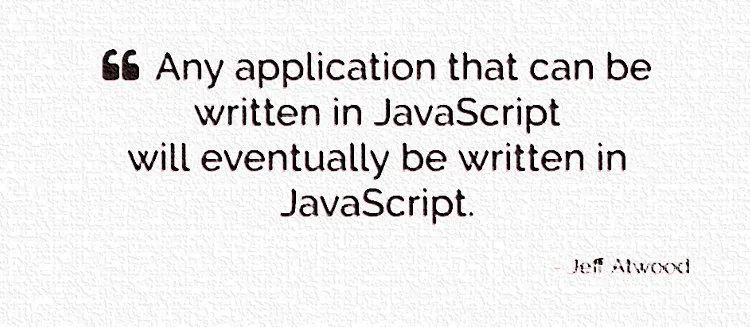

但是在发明之初，JavaScript的目的是应用于在浏览器执行简单的脚本任务，对浏览器以及其中的DOM进行各种操作，所以JavaScript的应用场景非常受限。

- Atwood定律更像是一种美好的远景，在当时看来还没有实现的可能性。
- 但是随着Node的出现，Atwood定律已经越来越多的被证实是正确的。

但是为了可以理解Node.js到底是如何帮助我们做到这一点的，我们必须了解JavaScript是如何被运行的。

### 1.2. 浏览器内核

我们经常会说：不同的浏览器有不同的内核组成

- Gecko：早期被Netscape和Mozilla Firefox浏览器浏览器使用；
- Trident：微软开发，被IE4~IE11浏览器使用，但是Edge浏览器已经转向Blink；
- Webkit：苹果基于KHTML开发、开源的，用于Safari，Google Chrome之前也在使用；
- Blink：是Webkit的一个分支，Google开发，目前应用于Google Chrome、Edge、Opera等；
- 等等...

事实上，我们经常说的浏览器内核指的是浏览器的排版引擎：

- **排版引擎**（layout engine），也称为**浏览器引擎**（browser engine）、**页面渲染引擎**（rendering engine）或**样版引擎**。

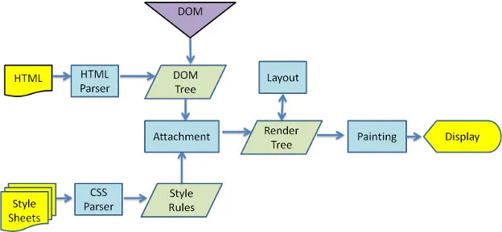

但是在这个执行过程中，HTML解析的时候遇到了JavaScript标签，应该怎么办呢？

- 会停止解析HTML，而去加载和执行JavaScript代码；

当然，为什么不直接异步去加载执行JavaScript代码，而要在这里停止掉呢？

- 这是因为JavaScript代码可以操作我们的DOM；
- 所以浏览器希望将HTML解析的DOM和JavaScript操作之后的DOM放到一起来生成最终的DOM树，而不是频繁的去生成新的DOM树；

那么，JavaScript代码由谁来执行呢？

- JavaScript引擎

### 1.3. JavaScript引擎

为什么需要JavaScript引擎呢？

- 事实上我们编写的JavaScript无论你交给浏览器或者Node执行，最后都是需要被CPU执行的；
- 但是CPU只认识自己的指令集，实际上是机器语言，才能被CPU所执行；
- 所以我们需要JavaScript引擎帮助我们将JavaScript代码翻译成CPU指令来执行；

比较常见的JavaScript引擎有哪些呢？

- **SpiderMonkey**：第一款JavaScript引擎，由Brendan Eich开发（也就是JavaScript作者）；
- **Chakra**：微软开发，用于IT浏览器；
- **JavaScriptCore**：WebKit中的JavaScript引擎，Apple公司开发；
- **V8**：Google开发的强大JavaScript引擎，也帮助Chrome从众多浏览器中脱颖而出；

这里我们先以WebKit为例，WebKit事实上由两部分组成的：

- WebCore：负责HTML解析、布局、渲染等等相关的工作；
- JavaScriptCore：解析、执行JavaScript代码；

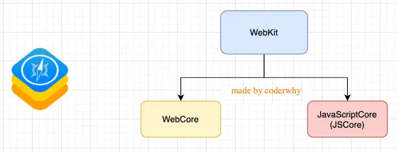

看到这里，学过小程序的同学有没有感觉非常的熟悉呢？

- 在小程序中编写的JavaScript代码就是被JSCore执行的；

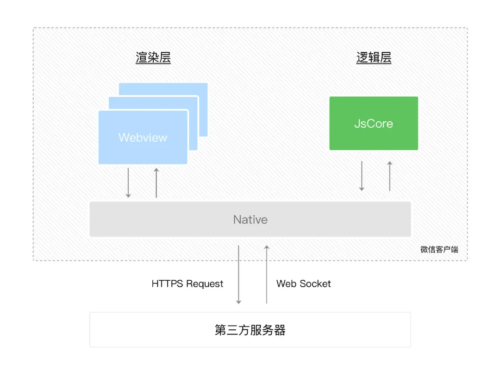

另外一个强大的JavaScript引擎就是V8引擎。

### 1.4. V8引擎

我们来看一下官方对V8引擎的定义：

- V8是用C ++编写的Google开源高性能JavaScript和WebAssembly引擎，它用于Chrome和Node.js等。
- 它实现ECMAScript和WebAssembly，并在Windows 7或更高版本，macOS 10.12+和使用x64，IA-32，ARM或MIPS处理器的Linux系统上运行。
- V8可以独立运行，也可以嵌入到任何C ++应用程序中。

V8引擎本身的源码非常复杂，大概有超过100w行C++代码，但是我们可以简单了解一下它执行JavaScript代码的原理：

- Parse模块会将JavaScript代码转换成AST（抽象语法树），这是因为解释器并不直接认识JavaScript代码；

- - 如果函数没有被调用，那么是不会被转换成AST的；
  - Parse的V8官方文档：https://v8.dev/blog/scanner

- Ignition是一个解释器，会将AST转换成ByteCode（字节码）

- - 同时会收集TurboFan优化所需要的信息（比如函数参数的类型信息，有了类型才能进行真实的运算）；
  - 如果函数只调用一次，Ignition会执行解释执行ByteCode；
  - Ignition的V8官方文档：https://v8.dev/blog/ignition-interpreter

- TurboFan是一个编译器，可以将字节码编译为CPU可以直接执行的机器码；

- - 如果一个函数被多次调用，那么就会被标记为热点函数，那么就会经过TurboFan转换成优化的机器码，提高代码的执行性能；
  - 但是，机器码实际上也会被还原为ByteCode，这是因为如果后续执行函数的过程中，类型发生了变化（比如sum函数原来执行的是number类型，后来执行变成了string类型），之前优化的机器码并不能正确的处理运算，就会逆向的转换成字节码；
  - TurboFan的V8官方文档：https://v8.dev/blog/turbofan-jit

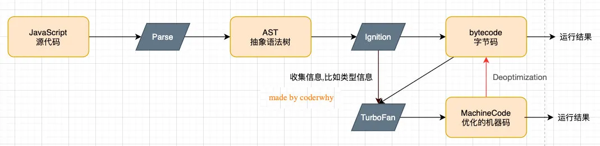image-20200924165143332

上面是JavaScript代码的执行过程，事实上V8的内存回收也是其强大的另外一个原因，这里暂时先不展开讨论：

- Orinoco模块，负责垃圾回收，将程序中不需要的内存回收；
- Orinoco的V8官方文档：https://v8.dev/blog/trash-talk

## **二. 邂逅Node.js**  

### 2.1. Node.js是什么？

回顾：官方对Node.js的定义：

- Node.js是一个基于V8 JavaScript引擎的JavaScript运行时环境。

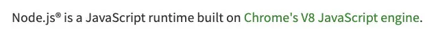

也就是说Node.js基于V8引擎来执行JavaScript的代码，但是不仅仅只有V8引擎：

- 前面我们知道Node.js可以嵌入到任何C ++应用程序中，无论是Chrome还是Node.js，事实上都是嵌入了V8引擎来执行JavaScript代码；
- 但是在Chrome浏览器中，还需要解析、渲染HTML、CSS等相关渲染引擎，另外还需要提供支持浏览器操作的API、浏览器自己的事件循环等；
- 另外，在Node.js中我们也需要进行一些额外的操作，比如文件系统读/写、网络IO、加密、压缩解压文件等操作；

所以，我们可以简单理解规划出Node.js和浏览器的差异：

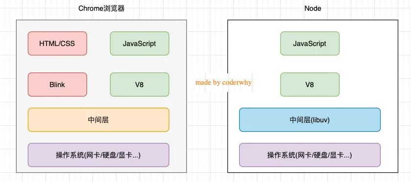

这里也有一份单独的Node.js的架构图：

- 我们编写的JavaScript代码会经过V8引擎，再通过Node.js的Bindings，将任务放到Libuv的事件循环中；
- **libuv**（Unicorn Velociraptor—独角伶盗龙）是使用C语言编写的库；
- libuv提供了事件循环、文件系统读写、网络IO、线程池等等内容；
- 具体内部代码的执行流程，我会在后续专门讲解事件和异步IO的原理中详细讲解；

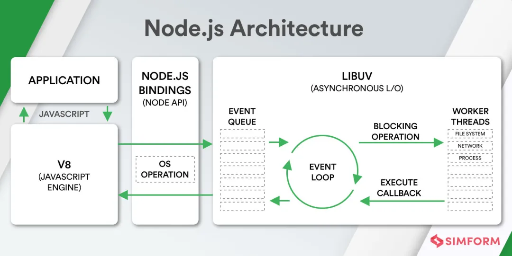

### 2.2. Node.js可以做什么？

了解了Node.js的架构，那么使用它我们可以做什么呢？

- 前面我们提到，Node.js的出现，真正让Atwood定律变成了现实，Node.js的应用场景也越来越多。

我们可以使用基于Node.js的Electron开发出类似于VSCode这种强大的桌面应用程序。另外前端自动化、模块化打包工具gulp、webpack也是基于Node.js开发和使用的。

Node.js的快速发展也让企业对Node.js技术越来越重视，在前端招聘中通常会对Node.js有一定的要求，特别对于高级前端开发工程师，Node.js更是必不可少的技能：

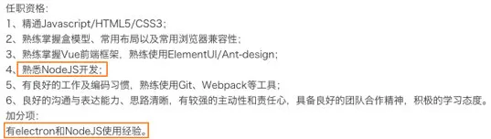

目前前端开发的库都是以node包的形式进行管理；

- npm、yarn工具成为前端开发使用最多的工具；
- 越来越多的公司使用Node.js作为web服务器开发；
- 大量项目需要借助Node.js完成前后端渲染的同构应用；
- 资深前端工程师需要为项目编写脚本工具（前端工程师编写脚本通常会使用JavaScript，而不是Python或者shell）；
- 很多企业在使用Electron来开发桌面应用程序；

总结一下，目前Node.js到底有哪些应用场景呢？

- 前后端页面渲染

- - 支持项目同构开发
  - 对于需要进行首屏优化、SEO的页面进行后端渲染

- 开发命令行工具

- - webpack、gulp等都是基于Node
  - 开发自己独立的命令行工具（类似于shell、Python做的事情，对于前端更加友好）

- 桌面应用的开发

- - 类似于VSCode这种强大的桌面应用
  - 甚至开发桌面端类似于wayward大型游戏

- 进行服务器开发

- - 拥有类似express、koa等强大的web框架
  - 开发Web Socket等服务器

所以，作为前端开发工程师，Node.js已经是我们必须掌握的核心技术。

### 2.3. Node.js的安装

#### 2.3.1. Node.js下载安装

Node.js是在2009年诞生的，目前最新的版本是分别是12.18.4以及14.12.0：

- LTS版本：相对稳定一些，推荐线上环境使用该版本；
- Current版本：最新的Node版本，包含很多新特性；


这些我们选择什么版本呢？

- 如果你是学习使用，可以选择current版本；
- 如果你是公司开发，建议选择LTS版本；

Node的安装方式有很多：

- 可以借助于一些操作系统上的软件管理工具，比如Mac上的homebrew，Linux上的yum、dnf等；
- 也可以直接下载对应的安装包下载安装；

我们选择下载安装，下载自己操作系统的安装包直接安装就可以了：

- window选择.msi安装包，Mac选择.pkg安装包，Linux会在后续部署中讲解；
- 安装过程中会配置环境变量；
- 并且安装node过程中会安装npm（*Node Package Manager*）工具；

我当前电脑上的版本：

- node版本是12.16.1；
- npm版本是6.14.8；

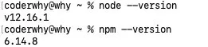

你应该已经发现，我这里使用的版本并不是Node的最新版本，无论是LTS或者Current：

- 正好借助这里，和大家讲一下node的版本升级；

#### 2.3.2. Node.js版本管理

在实际开发学习中，我们只需要使用一个Node版本来开发或者学习即可。

但是，如果你希望通过可以快速更新或切换多个版本时，可以借助于一些工具：

- nvm：Node Version Manager；
- n：Interactively Manage Your Node.js Versions（交互式管理你的Node.js版本）

这里我演示管理工具：n

- n是TJ方便node的版本管理，专门开发的；
- 官方介绍是：n -  Interactively Manage Your Node.js Versions（交互式管理你的Node.js版本）

安装n：直接使用npm安装即可

```javascript
# 安装工具n
npm install -g n
# 查看安装的版本
n --version
```

安装最新的lts版本：

- 前面添加的sudo是权限问题；
- 可以两个版本都安装，之后我们可以通过n快速在两个版本间切换；

```javascript
# 安装最新的lts版本
n lts

# 安装最新的版本
n latest
```

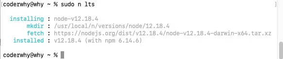

查看所有的版本，并且选择要使用的版本：

- 可以上下选择想使用的版本

```javascript
# 查看所有的版本
n
```

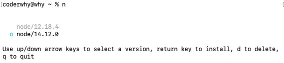

查看当前Node的版本：


问题：这两个工具都不支持window

- n：n is not supported natively on Windows.
- nvm：nvm does not support Windows

Window的同学怎么办？

- 1.并不是每个人都需要安装多个版本，在课堂上我会以最新的Current版本讲解几乎所有内容；
- 2.接下来我会在Mac上面演练n工具的使用，windows上可以使用nvm-window来完成；