## 一.  Node执行代码

### 1.1. JavaScript文件执行

如果我们编写一个js文件，里面存放JavaScript代码，如何来执行它呢？

```javascript
// 1.直接打印一段文字
console.log("我是一段JavaScript代码");

// 2.定义一个函数, 调用这个函数
function sum(num1, num2) {
  return num1 + num2;
}

const result = sum(20, 30);
console.log("计算结果:", result);

// 3.执行定时器代码
setTimeout(() => {
  console.log("2s后执行的代码");
}, 2000);
```

目前我们知道有两种方式可以执行：

- 将代码交给浏览器执行；
- 将代码载入到node环境中执行；

**演练一：浏览器执行**

如果我们希望把代码交给浏览器执行：

- 需要通过让浏览器加载、解析html代码，所以我们需要创建一个html文件；
- 在html中通过script标签，引入js文件；
- 当浏览器遇到script标签时，就会根据src加载、执行JavaScript代码；

index.html文件：

```javascript
<!DOCTYPE html>
<html lang="en">
<head>
  <meta charset="UTF-8">
  <meta name="viewport" content="width=device-width, initial-scale=1.0">
  <title>Document</title>
</head>
<body>
  
  <script src="./index.js"></script>
</body>
</html>
```

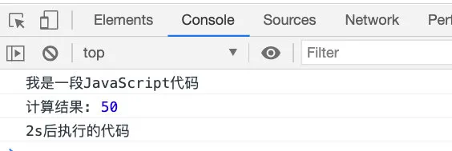

**演练二：Node执行**

如果我们希望把js文件交给node执行：

- 首先电脑上需要安装Node.js环境，安装过程中会自动配置环境变量；
- 可以通过终端命令`node js文件`的方式来载入和执行对应的js文件；

```javascript
node index.js
```

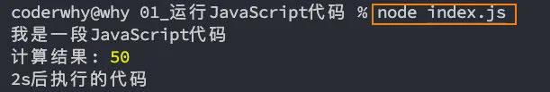

### 1.2. Node的REPL

什么是REPL呢？感觉挺高大上

- **REPL**是**Read-Eval-Print Loop**的简称，翻译为**“读取-求值-输出”循环**；
- REPL是一个简单的，交互式的编程环境；

事实上，我们浏览器的console就可以看成一个REPL：

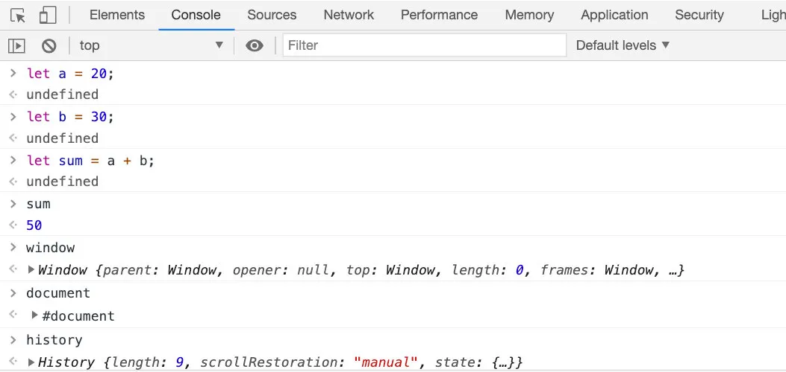

Node也给我们提供了一个REPL环境，我们可以在其中演练简单的代码：

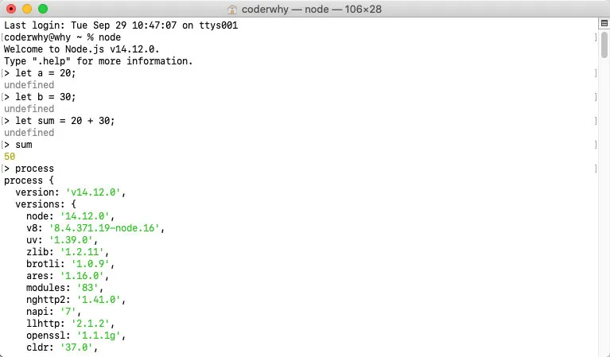

## 二. Node输入输出

### 2.1. 给node程序传递参数

正常情况下执行一个node程序，直接跟上我们对应的文件即可：

```javascript
node index.js
```

但是，在某些情况下执行node程序的过程中，我们可能希望给node传递一些参数：

```javascript
node index.js env=development coderwhy
```

如果我们这样来使用程序，就意味着我们需要在程序中获取到传递的参数：

- 获取参数其实是在`process`的内置对象中的；

如果我们直接打印这个内置对象，它里面包含特别的信息：

- 其他的一些信息，比如版本、操作系统等大家可以自行查看，后面用到一些其他的我们还会提到；

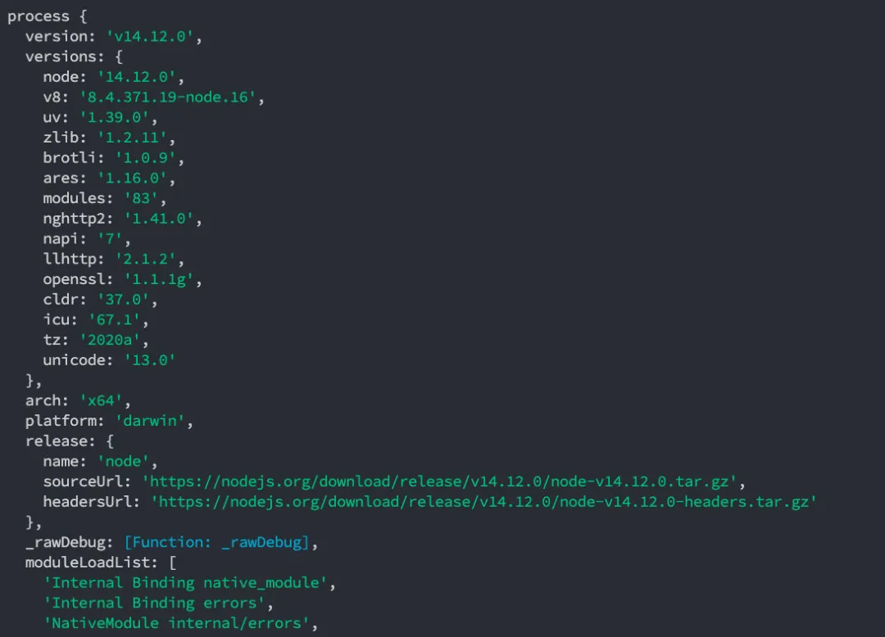

现在，我们先找到其中的argv属性：

- 我们发现它是一个数组，里面包含了我们需要的参数；
- 你可能有个疑问，为什么叫argv呢？

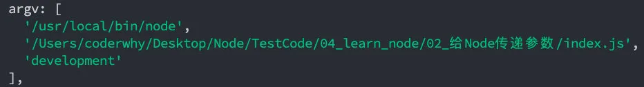

在C/C++程序中的main函数中，实际上可以获取到两个参数：

- argc：argument counter的缩写，传递参数的个数；

- argv：argument vector的缩写，传入的具体参数。

- - vector翻译过来是矢量的意思，在程序中表示的是一种数据结构。
  - 在C++、Java中都有这种数据结构，是一种数组结构；
  - 在JavaScript中也是一个数组，里面存储一些参数信息；

我们可以在代码中，将这些参数信息遍历出来，使用：

```javascript
// 获取参数
console.log(process.argv);
process.argv.forEach(item => {
  console.log(item);
});

// 结果如下：
// /usr/local/bin/node
// /Users/coderwhy/Desktop/Node/TestCode/04_learn_node/02_给Node传递参数/index.js
// ENV=dev
// coderwhy
```

### 2.2. node程序输出内容

**console.log**

最常用的输入内容的方式：console.log

```javascript
console.log("hello coderwhy");
```

**console.clear**

清空控制台：console.clear

```javascript
console.clear
```

**console.trace**

打印函数的调用栈：console.trace

```javascript
function test() {
  demo();
}

function demo() {
  foo();
}

function foo() {
  console.trace();
}

test();
```

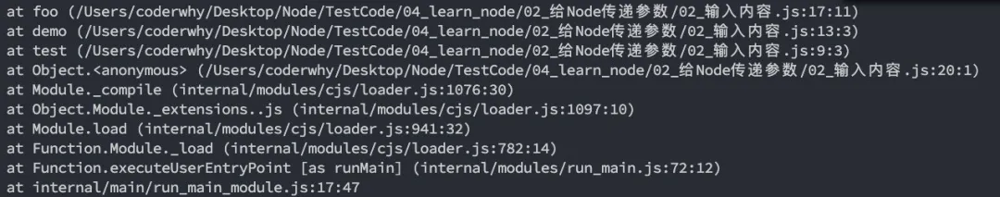

还有一些其他的方法，其他的一些console方法，可以自己在下面学习研究一下。

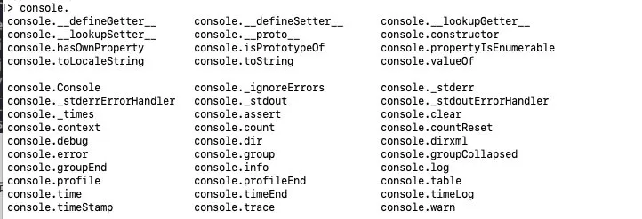

## 三. 常见全局对象

### 3.1. 常见的全局对象

Node中给我们提供了一些全局对象，方便我们进行一些操作：

- 这些全局对象，我们并不需要从一开始全部一个个学习；
- 某些全局对象并不常用，某些全局对象我们会在后续学习中讲到；
- 比如module、exports、require()会在模块化中讲到；
- 比如Buffer后续会专门讲到；

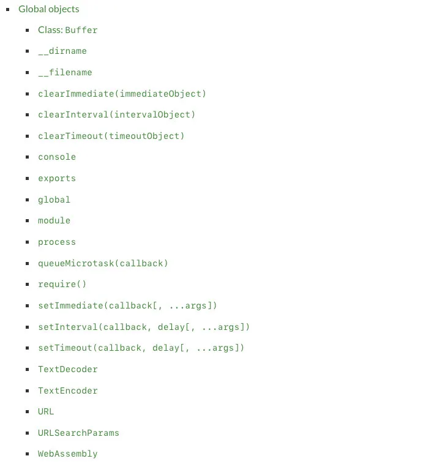

### 3.2. 特殊的全局对象

为什么我称之为特殊的全局对象呢？

- 这些全局对象可以在模块中任意使用，但是在命令行交互中是不可以使用的；
- 包括：__dirname、__filename、exports、module、require()

**__dirname**

获取当前文件所在的路径：

- 注意：不包括后面的文件名

```javascript
console.log(__dirname);

// /Users/coderwhy/Desktop/Node/TestCode/04_learn_node/03_常见的全局变量
```

**__filename**

获取当前文件所在的路径和文件名称：

- 注意：包括后面的文件名称

```javascript
console.log(__filename);
// /Users/coderwhy/Desktop/Node/TestCode/04_learn_node/03_常见的全局变量/global对象.js
```

### 3.3. 常见的全局对象

**process对象**

process提供了Node进程中相关的信息：

- 比如Node的运行环境、参数信息等；
- 后面在项目中，我也会讲解，如何将一些环境变量读取到 `process` 的 `env` 中；

```javascript
console.log(process);
```

**console对象**

提供了简单的调试控制台，在前面讲解输入内容时已经学习过了。

- 更加详细的查看官网文档：https://nodejs.org/api/console.html

**定时器函数**

在Node中使用定时器有好几种方式：

- `setTimeout(callback, delay[, ...args])`：`callback`在`delay`毫秒后执行一次；

- `setInterval(callback, delay[, ...args])`：`callback`每`delay`毫秒重复执行一次；

- `setImmediate(callback[, ...args])`：`callback`I / O事件后的回调的“立即”执行；

- - 这里先不展开讨论它和`setTimeout(callback, 0)`之间的区别；
  - 因为它涉及到事件循环的阶段问题，我会在后续详细讲解事件循环相关的知识；

- `process.nextTick(callback[, ...args])`：添加到下一次tick队列中；

- - 具体的讲解，也放到事件循环中说明；

代码演练：

- 暂时不用关心执行顺序问题，在后续事件循环中我会讲到；

```javascript
setTimeout(() => {
  console.log("setTimtout");
}, 1000);

setInterval(() => {
  console.log('setInterval');
}, 1000);

setImmediate(() => {
  console.log("setImmediate");
});

process.nextTick(() => {
  console.log("process.nextTick");
});
```

当然，它们有对应的取消定时器的方法：

- clearTimeout(timeoutObject);
- clearInterval(intervalObject);
- clearImmediate(immediateObject)

**global对象**

global是一个全局对象，事实上前端我们提到的process、console、setTimeout等都有被放到global中：

```javascript
console.log(process);
console.log(global.process);
```

为什么结果是一样的呢？

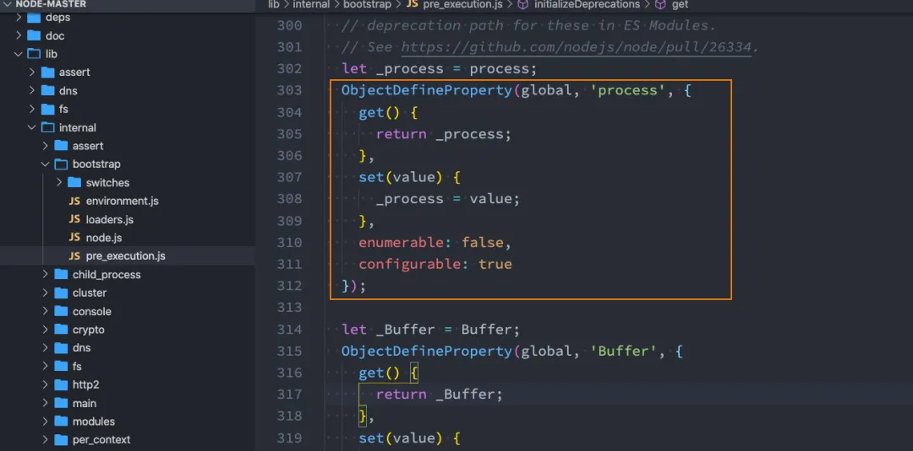

global中还有哪些属性呢？

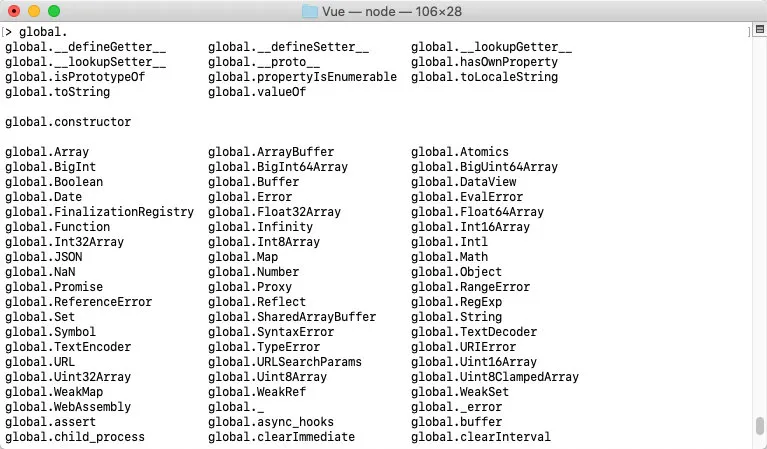

**window和global的区别是什么？**

在浏览器中，全局变量都是在window上的，比如有document、setInterval、setTimeout、alert、console等等

在Node中，我们也有一个global属性，并且看起来它里面有很多其他对象。

但是在浏览器中执行的JavaScript代码，如果我们在顶级范围内通过var定义的一个属性，默认会被添加到window对象上：

```javascript
var name = 'coderwhy';
console.log(window.name); // coderwhy
```

但是在node中，我们通过var定义一个变量，它只是在当前模块中有一个变量，不会放到全局中：

```javascript
var name = 'coderwhy';
console.log(global.name); // undefined
```

更多的全局对象，我们后面用到的时候再详细讲解。