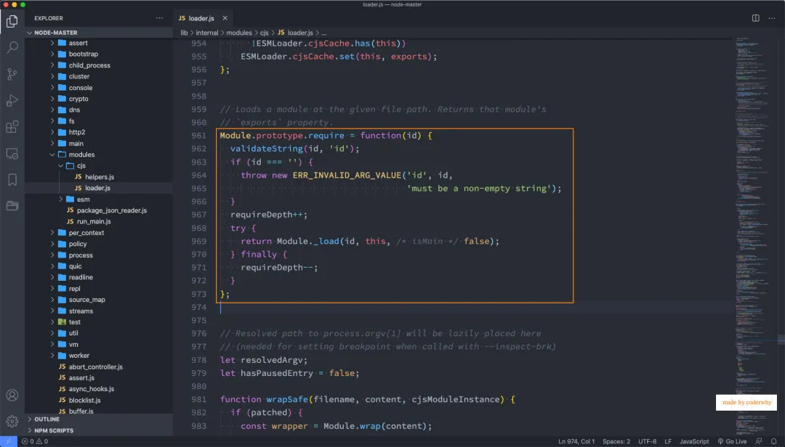

## 一. 什么是模块化开发

### 1.1. JavaScript 设计缺陷

那么，到底什么是模块化开发呢？

- 事实上模块化开发最终的目的是将程序划分成一个个小的结构；
- 这个结构中编写属于自己的逻辑代码，有自己的作用域，不会影响到其他的结构；
- 这个结构可以将自己希望暴露的变量、函数、对象等导出给其结构使用；
- 也可以通过某种方式，导入另外结构中的变量、函数、对象等；

**上面说提到的结构，就是模块；**

**按照这种结构划分开发程序的过程，就是模块化开发的过程；**

无论你多么喜欢 JavaScript，以及它现在发展的有多好，我们都需要承认在*Brendan Eich*用了 10 天写出 JavaScript 的时候，它都有很多的缺陷：

- 比如 var 定义的变量作用域问题；
- 比如 JavaScript 的面向对象并不能像常规面向对象语言一样使用 class；
- 比如 JavaScript 没有模块化的问题；

*Brendan Eich*本人也多次承认过 JavaScript 设计之初的缺陷，但是随着 JavaScript 的发展以及标准化，存在的缺陷问题基本都得到了完善。

- JavaScript 目前已经得到了快速的发展，无论是 web、移动端、小程序端、服务器端、桌面应用都被广泛的使用；

在网页开发的早期，*Brendan Eich*开发 JavaScript 仅仅作为一种脚本语言，做一些简单的表单验证或动画实现等，那个时候代码还是很少的：

```js
- 这个时候我们只需要讲 JavaScript 代码写到<script>标签中即可；
- 并没有必要放到多个文件中来编写；
```

```javascript
<button id="btn">按钮</button>

<script>
  document.getElementById("btn").onclick = function() {
    console.log("按钮被点击了");
  }
</script>
```

但是随着前端和 JavaScript 的快速发展，JavaScript 代码变得越来越复杂了：

- ajax 的出现，前后端开发分离，意味着后端返回数据后，我们需要通过 JavaScript 进行前端页面的渲染；
- SPA 的出现，前端页面变得更加复杂：包括前端路由、状态管理等等一系列复杂的需求需要通过 JavaScript 来实现；
- 包括 Node 的实现，JavaScript 编写复杂的后端程序，没有模块化是致命的硬伤；

所以，模块化已经是 JavaScript 一个非常迫切的需求：

- 但是 JavaScript 本身，直到 ES6（2015）才推出了自己的模块化方案；
- 在此之前，为了让 JavaScript 支持模块化，涌现出了很多不同的模块化规范：AMD、CMD、CommonJS 等；

在这个章节，我们将详细学习 JavaScript 的模块化，尤其是 CommonJS 和 ES6 的模块化。

### 1.2. 没有模块化的问题

我们先来简单体会一下没有模块化代码的问题。

我们知道，对于一个大型的前端项目，通常是多人开发的（即使一个人开发，也会将代码划分到多个文件夹中）：

- 我们假设有两个人：小明和小丽同时在开发一个项目，并且会将自己的 JavaScript 代码放在一个单独的 js 文件中。

小明开发了 aaa.js 文件，代码如下（当然真实代码会复杂的多）：

```javascript
var flag = true;

if (flag) {
  console.log("aaa的flag为true");
}
```

小丽开发了 bbb.js 文件，代码如下：

```javascript
var flag = false;

if (!flag) {
  console.log("bbb使用了flag为false");
}
```

很明显出现了一个问题：

- 大家都喜欢使用 flag 来存储一个 boolean 类型的值；
- 但是一个人赋值了 true，一个人赋值了 false；
- 如果之后都不再使用，那么也没有关系；

但是，小明又开发了 ccc.js 文件：

```javascript
if (flag) {
  console.log("使用了aaa的flag");
}
```

问题来了：小明发现 ccc 中的 flag 值不对

- 对于聪明的你，当然一眼就看出来，是小丽将 flag 赋值为了 false；
- 但是如果每个文件都有上千甚至更多的代码，而且有上百个文件，你可以一眼看出来 flag 在哪个地方被修改了吗？

备注：引用路径如下：

```javascript
<script src="./aaa.js"></script>
<script src="./bbb.js"></script>
<script src="./ccc.js"></script>
```

所以，没有模块化对于一个大型项目来说是灾难性的。

**当然，我们有办法可以解决上面的问题：立即函数调用表达式（IIFE）**

- **IIFE** (Immediately Invoked Function Expression)

aaa.js

```javascript
const moduleA = (function () {
  var flag = true;

  if (flag) {
    console.log("aaa的flag为true");
  }

  return {
    flag: flag,
  };
})();
```

bbb.js

```javascript
const moduleB = (function () {
  var flag = false;

  if (!flag) {
    console.log("bbb使用了flag为false");
  }
})();
```

ccc.js

```javascript
const moduleC = (function () {
  const flag = moduleA.flag;
  if (flag) {
    console.log("使用了aaa的flag");
  }
})();
```

命名冲突的问题，有没有解决呢？解决了。

但是，我们其实带来了新的问题：

- 第一，我必须记得每一个模块中返回对象的命名，才能在其他模块使用过程中正确的使用；
- 第二，代码写起来混乱不堪，每个文件中的代码都需要包裹在一个匿名函数中来编写；
- 第三，在没有合适的规范情况下，每个人、每个公司都可能会任意命名、甚至出现模块名称相同的情况；

**所以，我们会发现，虽然实现了模块化，但是我们的实现过于简单，并且是没有规范的。**

- 我们需要制定一定的规范来约束每个人都按照这个规范去编写模块化的代码；
- 这个规范中应该包括核心功能：模块本身可以导出暴露的属性，模块又可以导入自己需要的属性；

JavaScript 社区为了解决上面的问题，涌现出一系列好用的规范，接下来我们就学习具有代表性的一些规范。

## 二. CommonJS 规范

### 2.1. CommonJS 和 Node

我们需要知道 CommonJS 是一个规范，最初提出来是在浏览器意外的地方使用，并且当时被命名为**ServerJS**，后来为了体现它的广泛性，修改为**CommonJS**，平时我们也会简称为 CJS。

- Node 是 CommonJS 在服务器端一个具有代表性的实现；
- Browserify 是 CommonJS 在浏览器中的一种实现；
- webpack 打包工具具备对 CommonJS 的支持和转换（后面我会讲到）；

所以，Node 中对 CommonJS 进行了支持和实现，让我们在开发 node 的过程中可以方便的进行模块化开发：

- 在 Node 中每一个 js 文件都是一个单独的模块；
- 这个模块中包括 CommonJS 规范的核心变量：exports、module.exports、require；
- 我们可以使用这些变量来方便的进行模块化开发；

前面我们提到过模块化的核心是导出和导入，Node 中对其进行了实现：

- exports 和 module.exports 可以负责对模块中的内容进行导出；
- require 函数可以帮助我们导入其他模块（自定义模块、系统模块、第三方库模块）中的内容；

### 2.2. Node 模块化开发

我们来看一下两个文件：

bar.js

```javascript
const name = "coderwhy";
const age = 18;

function sayHello(name) {
  console.log("Hello " + name);
}
```

main.js

```javascript
console.log(name);
console.log(age);

sayHello("kobe");
```

上面的代码会报错：

- 在 node 中每一个文件都是一个独立的模块，有自己的作用域；
- 那么，就意味着别的模块 main 中不能随便访问另外一个模块 bar 中的内容；
- bar 需要导出自己想要暴露的变量、函数、对象等等；
- main 从 bar 中导入自己想要使用的变量、函数、对象等等；


#### 2.2.1. exports 导出

**强调：exports 是一个对象，我们可以在这个对象中添加很多个属性，添加的属性会导出**

bar.js 中导出内容：

```javascript
exports.name = name;
exports.age = age;
exports.sayHello = sayHello;
```

main.js 中导入内容：

```javascript
const bar = require("./bar");
```

上面这行代码意味着什么呢？

- 意味着 main 中的 bar 变量等于 exports 对象；

```javascript
main中的bar = bar中的exports;
```

所以，我可以编写下面的代码：

```javascript
const bar = require("./bar");

const name = bar.name;
const age = bar.age;
const sayHello = bar.sayHello;

console.log(name);
console.log(age);

sayHello("kobe");
```


为了进一步论证，bar 和 exports 是同一个对象：

- 所以，bar 对象是 exports 对象的浅拷贝；
- 浅拷贝的本质就是一种引用的赋值而已；


#### 2.2.2. module.exports

但是 Node 中我们经常导出东西的时候，又是通过 module.exports 导出的：

- module.exports 和 exports 有什么关系或者区别呢？

我们追根溯源，通过维基百科中对 CommonJS 规范的解析：

- CommonJS 中是没有 module.exports 的概念的；
- 但是为了实现模块的导出，Node 中使用的是 Module 的类，每一个模块都是 Module 的一个实例，也就是 module；
- 所以在 Node 中真正用于导出的其实根本不是 exports，而是 module.exports；
- 因为 module 才是导出的真正实现者；

但是，为什么 exports 也可以导出呢？

- 这是因为 module 对象的 exports 属性是 exports 对象的一个引用；
- 也就是说 `module.exports = exports = main中的bar`；


注意：真正导出的模块内容的核心其实是 module.exports，只是为了实现 CommonJS 的规范，刚好 module.exports 对 exports 对象有一个引用而已；

那么，如果我的代码这样修改了：


你能猜到内存中会有怎么样的表现吗？

- 结论：和 exports 对象没有任何关系了，exports 你随便玩自己的吧；
- module.exports 我现在导出一个自己的对象，不带着你玩了；
- 新的对象取代了 exports 对象的导出，那么就意味着 require 导入的对象是新的对象；


#### 2.2.3. require 细节

我们现在已经知道，require 是一个函数，可以帮助我们引入一个文件（模块）中导入的对象。

那么，require 的查找规则是怎么样的呢？

- https://nodejs.org/dist/latest-v14.x/docs/api/modules.html#modules_all_together

**这里我总结比较常见的查找规则：**

导入格式如下：require(X)

- 情况一：X 是一个核心模块，比如 path、http

- - 直接返回核心模块，并且停止查找

- 情况二：X 是以 `./` 或 `../` 或 `/`（根目录）开头的

- - 查找目录下面的 index 文件
  - 1> 查找 X/index.js 文件
  - 2> 查找 X/index.json 文件
  - 3> 查找 X/index.node 文件
  - 1.如果有后缀名，按照后缀名的格式查找对应的文件
  - 2.如果没有后缀名，会按照如下顺序：
  - 1> 直接查找文件 X
  - 2> 查找 X.js 文件
  - 3> 查找 X.json 文件
  - 4> 查找 X.node 文件
  - 第一步：将 X 当做一个文件在对应的目录下查找；
  - 第二步：没有找到对应的文件，将 X 作为一个目录
  - 如果没有找到，那么报错：`not found`

- 情况三：直接是一个 X（没有路径），并且 X 不是一个核心模块

- - 比如 `/Users/coderwhy/Desktop/Node/TestCode/04_learn_node/05_javascript-module/02_commonjs/main.js`中编写 `require('why')`
  - 

- - 如果上面的路径中都没有找到，那么报错：`not found`

#### 2.2.4. 模块加载顺序

这里我们研究一下模块的加载顺序问题。

**结论一：模块在被第一次引入时，模块中的 js 代码会被运行一次**

aaa.js

```javascript
const name = "coderwhy";

console.log("Hello aaa");

setTimeout(() => {
  console.log("setTimeout");
}, 1000);
```

main.js

```javascript
const aaa = require("./aaa");
```

aaa.js 中的代码在引入时会被运行一次

**结论二：模块被多次引入时，会缓存，最终只加载（运行）一次**

main.js

```javascript
const aaa = require("./aaa");
const bbb = require("./bbb");
```

aaa.js

```javascript
const ccc = require("./ccc");
```

bbb.js

```javascript
const ccc = require("./ccc");
```

ccc.js

```javascript
console.log("ccc被加载");
```

ccc 中的代码只会运行一次。

**为什么只会加载运行一次呢？**

- 这是因为每个模块对象 module 都有一个属性：loaded。
- 为 false 表示还没有加载，为 true 表示已经加载；

**结论三：如果有循环引入，那么加载顺序是什么？**

如果出现下面模块的引用关系，那么加载顺序是什么呢？

- 这个其实是一种数据结构：图结构；
- 图结构在遍历的过程中，有深度优先搜索（DFS, depth first search）和广度优先搜索（BFS, breadth first search）；
- Node 采用的是深度优先算法：main -> aaa -> ccc -> ddd -> eee ->bbb


### 2.3. Node 的源码解析

Module 类


Module.prototype.require 函数



Module.\_load 函数


## 三. AMD 和 CMD 规范

### 3.1. CommonJS 规范缺点

CommonJS 加载模块是同步的：

- 同步的意味着只有等到对应的模块加载完毕，当前模块中的内容才能被运行；
- 这个在服务器不会有什么问题，因为服务器加载的 js 文件都是本地文件，加载速度非常快；

如果将它应用于浏览器呢？

- 浏览器加载 js 文件需要先从服务器将文件下载下来，之后在加载运行；
- 那么采用同步的就意味着后续的 js 代码都无法正常运行，即使是一些简单的 DOM 操作；

所以在浏览器中，我们通常不使用 CommonJS 规范：

- 当然在 webpack 中使用 CommonJS 是另外一回事；
- 因为它会将我们的代码转成浏览器可以直接执行的代码；

在早期为了可以在浏览器中使用模块化，通常会采用 AMD 或 CMD：

- 但是目前一方面现代的浏览器已经支持 ES Modules，另一方面借助于 webpack 等工具可以实现对 CommonJS 或者 ES Module 代码的转换；
- AMD 和 CMD 已经使用非常少了，所以这里我们进行简单的演练；

### 3.2. AMD 规范

AMD 主要是应用于浏览器的一种模块化规范：

- AMD 是 Asynchronous Module Definition（异步模块定义）的缩写；
- 它采用的是异步加载模块；
- 事实上 AMD 的规范还要早于 CommonJS，但是 CommonJS 目前依然在被使用，而 AMD 使用的较少了；

我们提到过，规范只是定义代码的应该如何去编写，只有有了具体的实现才能被应用：

- AMD 实现的比较常用的库是 require.js 和 curl.js；

**这里我们以 require.js 为例讲解：**

第一步：下载 require.js

- 下载地址：https://github.com/requirejs/requirejs
- 找到其中的 require.js 文件；

第二步：定义 HTML 的 script 标签引入 require.js 和定义入口文件：

- data-main 属性的作用是在加载完 src 的文件后会加载执行该文件

```javascript
<script src="./lib/require.js" data-main="./index.js"></script>
```

第三步：编写如下目录和代码

```javascript
├── index.html
├── index.js
├── lib
│   └── require.js
└── modules
    ├── bar.js
    └── foo.js
```

index.js

```javascript
(function () {
  require.config({
    baseUrl: "",
    paths: {
      foo: "./modules/foo",
      bar: "./modules/bar",
    },
  });

  // 开始加载执行foo模块的代码
  require(["foo"], function (foo) {});
})();
```

modules/bar.js

- 如果一个模块不依赖其他，那么直接使用 define(function)即可

```javascript
define(function () {
  const name = "coderwhy";
  const age = 18;
  const sayHello = function (name) {
    console.log("Hello " + name);
  };

  return {
    name,
    age,
    sayHello,
  };
});
```

modules/foo.js

```javascript
define(["bar"], function (bar) {
  console.log(bar.name);
  console.log(bar.age);
  bar.sayHello("kobe");
});
```

### 3.3. CMD 规范

CMD 规范也是应用于浏览器的一种模块化规范：

- CMD 是 Common Module Definition（通用模块定义）的缩写；
- 它也采用了异步加载模块，但是它将 CommonJS 的优点吸收了过来；
- 但是目前 CMD 使用也非常少了；

CMD 也有自己比较优秀的实现方案：

- SeaJS

**我们一起看一下 SeaJS 如何使用：**

第一步：下载 SeaJS

- 下载地址：https://github.com/seajs/seajs
- 找到 dist 文件夹下的 sea.js

第二步：引入 sea.js 和使用主入口文件

- `seajs`是指定主入口文件的

```javascript
<script src="./lib/sea.js"></script>
<script>
  seajs.use('./index.js');
</script>
```

第三步：编写如下目录和代码

```javascript
├── index.html
├── index.js
├── lib
│   └── sea.js
└── modules
    ├── bar.js
    └── foo.js
```

index.js

```javascript
define(function (require, exports, module) {
  const foo = require("./modules/foo");
});
```

bar.js

```javascript
define(function (require, exports, module) {
  const name = "lilei";
  const age = 20;
  const sayHello = function (name) {
    console.log("你好 " + name);
  };

  module.exports = {
    name,
    age,
    sayHello,
  };
});
```

foo.js

```javascript
define(function (require, exports, module) {
  const bar = require("./bar");

  console.log(bar.name);
  console.log(bar.age);
  bar.sayHello("韩梅梅");
});
```

## 四. ES Module

### 4.1. 认识 ES Module

JavaScript 没有模块化一直是它的痛点，所以才会产生我们前面学习的社区规范：CommonJS、AMD、CMD 等，所以在 ES 推出自己的模块化系统时，大家也是兴奋异常。

ES Module 和 CommonJS 的模块化有一些不同之处：

- 一方面它使用了 import 和 export 关键字；
- 另一方面它采用编译期静态类型检测，并且动态引用的方式；

ES Module 模块采用 export 和 import 关键字来实现模块化：

- export 负责将模块内的内容导出；
- import 负责从其他模块导入内容；

了解：采用 ES Module 将自动采用严格模式：`use strict`

- 如果你不熟悉严格模式可以简单看一下 MDN 上的解析；
- https://developer.mozilla.org/zh-CN/docs/Web/JavaScript/Reference/Strict_mode

### 4.2. ES Module 的使用

#### 4.2.1. 代码结构组件

这里我在浏览器中演示 ES6 的模块化开发：

代码结构如下：

```javascript
├── index.html
├── main.js
└── modules
    └── foo.js
```

index.html 中引入两个 js 文件作为模块：

```javascript
<script src="./modules/foo.js" type="module"></script>
<script src="main.js" type="module"></script>
```

如果直接在浏览器中运行代码，会报如下错误：


这个在 MDN 上面有给出解释：

- https://developer.mozilla.org/zh-CN/docs/Web/JavaScript/Guide/Modules
- 你需要注意本地测试 — 如果你通过本地加载 Html 文件 (比如一个 `file://` 路径的文件), 你将会遇到 CORS 错误，因为 Javascript 模块安全性需要。
- 你需要通过一个服务器来测试。

我这里使用的 VSCode，VSCode 中有一个插件：Live Server

- 通过插件运行，可以将我们的代码运行在一个本地服务中；


#### 4.2.2. export 关键字

export 关键字将一个模块中的变量、函数、类等导出；

foo.js 文件中默认代码如下：

```javascript
const name = "coderwhy";
const age = 18;
let message = "my name is why";

function sayHello(name) {
  console.log("Hello " + name);
}
```

**我们希望将其他中内容全部导出，它可以有如下的方式：**

方式一：在语句声明的前面直接加上 export 关键字

```javascript
export const name = "coderwhy";
export const age = 18;
export let message = "my name is why";

export function sayHello(name) {
  console.log("Hello " + name);
}
```

方式二：将所有需要导出的标识符，放到 export 后面的 `{}`中

- 注意：这里的 `{}`里面不是 ES6 的对象字面量的增强写法，`{}`也不是表示一个对象的；
- 所以：`export {name: name}`，是错误的写法；

```javascript
const name = "coderwhy";
const age = 18;
let message = "my name is why";

function sayHello(name) {
  console.log("Hello " + name);
}

export { name, age, message, sayHello };
```

方式三：导出时给`标识符`起一个别名

```javascript
export {
  name as fName,
  age as fAge,
  message as fMessage,
  sayHello as fSayHello,
};
```

#### 4.2.3. import 关键字

import 关键字负责从另外一个模块中导入内容

**导入内容的方式也有多种：**

方式一：`import {标识符列表} from '模块'`；

- 注意：这里的`{}`也不是一个对象，里面只是存放导入的标识符列表内容；

```javascript
import { name, age, message, sayHello } from "./modules/foo.js";

console.log(name);
console.log(message);
console.log(age);
sayHello("Kobe");
```

方式二：导入时给标识符起别名

```javascript
import {
  name as wName,
  age as wAge,
  message as wMessage,
  sayHello as wSayHello,
} from "./modules/foo.js";
```

方式三：将模块功能放到一个模块功能对象（a module object）上

```javascript
import * as foo from "./modules/foo.js";

console.log(foo.name);
console.log(foo.message);
console.log(foo.age);
foo.sayHello("Kobe");
```

#### 4.2.4. export 和 import 结合

如果从一个模块中导入的内容，我们希望再直接导出出去，这个时候可以直接使用 export 来导出。

bar.js 中导出一个 sum 函数：

```javascript
export const sum = function (num1, num2) {
  return num1 + num2;
};
```

foo.js 中导入，但是只是做一个中转：

```javascript
export { sum } from "./bar.js";
```

main.js 直接从 foo 中导入：

```javascript
import { sum } from "./modules/foo.js";
console.log(sum(20, 30));
```

甚至在 foo.js 中导出时，我们可以变化它的名字

```javascript
export { sum as barSum } from "./bar.js";
```

为什么要这样做呢？

- 在开发和封装一个功能库时，通常我们希望将暴露的所有接口放到一个文件中；
- 这样方便指定统一的接口规范，也方便阅读；
- 这个时候，我们就可以使用 export 和 import 结合使用；

#### 4.2.4. default 用法

前面我们学习的导出功能都是有名字的导出（named exports）：

- 在导出 export 时指定了名字；
- 在导入 import 时需要知道具体的名字；

还有一种导出叫做默认导出（default export）

- 默认导出 export 时可以不需要指定名字；
- 在导入时不需要使用 `{}`，并且可以自己来指定名字；
- 它也方便我们和现有的 CommonJS 等规范相互操作；

导出格式如下：

```javascript
export default function sub(num1, num2) {
  return num1 - num2;
}
```

导入格式如下：

```javascript
import sub from "./modules/foo.js";

console.log(sub(20, 30));
```

注意：在一个模块中，只能有一个默认导出（default export）；

#### 4.2.5. import()

通过 import 加载一个模块，是不可以在其放到逻辑代码中的，比如：

```javascript
if (true) {
  import sub from "./modules/foo.js";
}
```

为什么会出现这个情况呢？

- 这是因为 ES Module 在被 JS 引擎解析时，就必须知道它的依赖关系；
- 由于这个时候 js 代码没有任何的运行，所以无法在进行类似于 if 判断中根据代码的执行情况；
- 甚至下面的这种写法也是错误的：因为我们必须到运行时能确定 path 的值；

```javascript
const path = './modules/foo.js';

import sub from path;
```

但是某些情况下，我们确确实实希望动态的来加载某一个模块：

- 如果根据不懂的条件，动态来选择加载模块的路径；
- 这个时候我们需要使用 `import()` 函数来动态加载；

aaa.js 模块：

```javascript
export function aaa() {
  console.log("aaa被打印");
}
```

bbb.js 模块：

```javascript
export function bbb() {
  console.log("bbb被执行");
}
```

main.js 模块：

```javascript
let flag = true;
if (flag) {
  import("./modules/aaa.js").then((aaa) => {
    aaa.aaa();
  });
} else {
  import("./modules/bbb.js").then((bbb) => {
    bbb.bbb();
  });
}
```

### 4.3. ES Module 的原理

#### 4.3.1. ES Module 和 CommonJS 的区别

**CommonJS 模块加载 js 文件的过程是运行时加载的，并且是同步的：**

- 运行时加载意味着是 js 引擎在执行 js 代码的过程中加载 模块；
- 同步的就意味着一个文件没有加载结束之前，后面的代码都不会执行；

```javascript
console.log("main代码执行");

const flag = true;
if (flag) {
  // 同步加载foo文件，并且执行一次内部的代码
  const foo = require("./foo");
  console.log("if语句继续执行");
}
```

**CommonJS 通过 module.exports 导出的是一个对象：**

- 导出的是一个对象意味着可以将这个对象的引用在其他模块中赋值给其他变量；
- 但是最终他们指向的都是同一个对象，那么一个变量修改了对象的属性，所有的地方都会被修改；

**ES Module 加载 js 文件的过程是编译（解析）时加载的，并且是异步的：**

- 编译时（解析）时加载，意味着 import 不能和运行时相关的内容放在一起使用：

- - 比如 from 后面的路径需要动态获取；
  - 比如不能将 import 放到 if 等语句的代码块中；
  - 所以我们有时候也称 ES Module 是静态解析的，而不是动态或者运行时解析的；

- 异步的意味着：JS 引擎在遇到`import`时会去获取这个 js 文件，但是这个获取的过程是异步的，并不会阻塞主线程继续执行；

- - 也就是说设置了 `type=module` 的代码，相当于在 script 标签上也加上了 `async` 属性；
  - 如果我们后面有普通的 script 标签以及对应的代码，那么 ES Module 对应的 js 文件和代码不会阻塞它们的执行；

```javascript
<script src="main.js" type="module"></script>
<!-- 这个js文件的代码不会被阻塞执行 -->
<script src="index.js"></script>
```

**ES Module 通过 export 导出的是变量本身的引用：**

- export 在导出一个变量时，js 引擎会解析这个语法，并且创建**模块环境记录**（module environment record）；
- **模块环境记录**会和变量进行 `绑定`（binding），并且这个绑定是实时的；
- 而在导入的地方，我们是可以实时的获取到绑定的最新值的；


**所以我们下面的代码是成立的：**

bar.js 文件中修改

```javascript
let name = "coderwhy";

setTimeout(() => {
  name = "湖人总冠军";
}, 1000);

setTimeout(() => {
  console.log(name);
}, 2000);

export { name };
```

main.js 文件中获取

```javascript
import { name } from "./modules/bar.js";

console.log(name);

// bar中修改, main中验证
setTimeout(() => {
  console.log(name);
}, 2000);
```

但是，下面的代码是不成立的：main.js 中修改

```javascript
import { name } from "./modules/bar.js";

console.log(name);

// main中修改, bar中验证
setTimeout(() => {
  name = "kobe";
}, 1000);
```


思考：如果 bar.js 中导出的是一个对象，那么 main.js 中是否可以修改对象中的属性呢？

- 答案是可以的，因为他们指向同一块内存空间；（自己编写代码验证，这里不再给出）

#### 4.3.2. Node 中支持 ES Module

**在 Current 版本中**

在最新的 Current 版本（v14.13.1）中，支持 es module 我们需要进行如下操作：

- 方式一：在 package.json 中配置 `type: module`（后续再学习，我们现在还没有讲到 package.json 文件的作用）
- 方式二：文件以 `.mjs` 结尾，表示使用的是 ES Module；

这里我们暂时选择以 `.mjs` 结尾的方式来演练：

bar.mjs

```javascript
const name = "coderwhy";

export { name };
```

main.mjs

```javascript
import { name } from "./modules/bar.mjs";

console.log(name);
```

**在 LTS 版本中**

在最新的 LST 版本（v12.19.0）中，我们也是可以正常运行的，但是会报一个警告：


#### 4.3.3. ES Module 和 CommonJS 的交互

**CommonJS 加载 ES Module**

结论：通常情况下，CommonJS 不能加载 ES Module

- 因为 CommonJS 是同步加载的，但是 ES Module 必须经过静态分析等，无法在这个时候执行 JavaScript 代码；
- 但是这个并非绝对的，某些平台在实现的时候可以对代码进行针对性的解析，也可能会支持；
- Node 当中是不支持的；

**ES Module 加载 CommonJS**

结论：多数情况下，ES Module 可以加载 CommonJS

- ES Module 在加载 CommonJS 时，会将其 module.exports 导出的内容作为 default 导出方式来使用；
- 这个依然需要看具体的实现，比如 webpack 中是支持的、Node 最新的 Current 版本也是支持的；
- 但是在最新的 LTS 版本中就不支持；

foo.js

```javascript
const address = "foo的address";

module.exports = {
  address,
};
```

main.js

```javascript
import foo from "./modules/foo.js";
console.log(foo.address);
```
