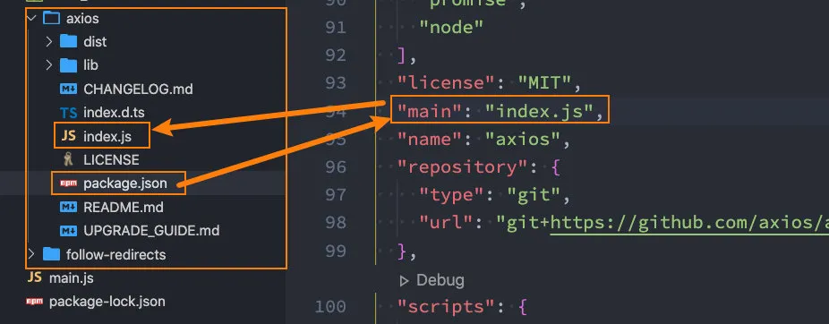
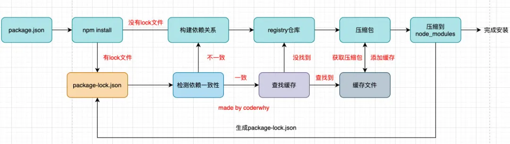
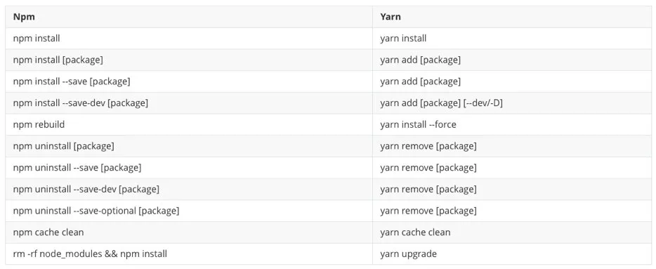

## 一. 包管理工具

### 1.1. 认识 npm

我们已经学习了在 JavaScript 中可以通过模块化的方式将代码划分成一个个小的结构：

- 在以后的开发中我们就可以通过模块化的方式来封装自己的代码，并且封装成一个工具；
- 这个工具我们可以让同事通过导入的方式来使用，甚至你可以分享给世界各地的程序员来使用；

**如果我们分享给世界上所有的程序员使用，有哪些方式呢？**

方式一：上传到 GitHub 上、其他程序员通过 GitHub 下载我们的代码手动的引用；

- 缺点是大家必须知道你的代码 GitHub 的地址，并且从 GitHub 上手动下载；
- 需要在自己的项目中手动的引用，并且管理相关的依赖；
- 不需要使用的时候，需要手动来删除相关的依赖；
- 当遇到版本升级或者切换时，需要重复上面的操作；

显然，上面的方式是有效的，但是这种传统的方式非常麻烦，并且容易出错；

方式二：使用一个专业的工具来管理我们的代码

- 我们通过工具将代码发布到特定的位置；
- 其他程序员直接通过工具来安装、升级、删除我们的工具代码；

显然，通过第二种方式我们可以更好的管理自己的工具包，其他人也可以更好的使用我们的工具包。

包管理工具 npm：

- Node Package Manager，也就是 Node 包管理器；
- 但是目前已经不仅仅是 Node 包管理器了，在前端项目中我们也在使用它来管理依赖的包；
- 比如 express、koa、react、react-dom、axios、babel、webpack 等等；

npm 管理的包可以在哪里查看、搜索呢？

- https://www.npmjs.com/
- 这是我们安装相关的 npm 包的官网；

npm 管理的包存放在哪里呢？

- 我们发布自己的包其实是发布到 registry 上面的；
- 当我们安装一个包时其实是从 registry 上面下载的包；

### 1.2. 项目配置文件

事实上，我们每一个项目都会有一个对应的配置文件，无论是前端项目还是后端项目：

- 这个配置文件会记录着你项目的名称、版本号、项目描述等；
- 也会记录着你项目所依赖的其他库的信息和依赖库的版本号；

这个配置文件在 Node 环境下面（无论是前端还是后端）就是 package.json。

我们以 vue cli4 脚手架创建的项目为例：

```javascript
{
  "name": "my-vue",
  "version": "0.1.0",
  "private": true,
  "scripts": {
    "serve": "vue-cli-service serve",
    "build": "vue-cli-service build",
    "lint": "vue-cli-service lint"
  },
  "dependencies": {
    "core-js": "^3.6.5",
    "vue": "^2.6.11"
  },
  "devDependencies": {
    "@vue/cli-plugin-babel": "~4.5.0",
    "@vue/cli-plugin-eslint": "~4.5.0",
    "@vue/cli-service": "~4.5.0",
    "babel-eslint": "^10.1.0",
    "eslint": "^6.7.2",
    "eslint-plugin-vue": "^6.2.2",
    "vue-template-compiler": "^2.6.11"
  },
  "browserslist": [
    "> 1%",
    "last 2 versions",
    "not dead"
  ]
}
```

事实上 Vue ClI4 脚手架创建的项目相对进行了简化，我们来看一下 CLI2 创建的项目：

```javascript
{
  "name": "vuerouterbasic",
  "version": "1.0.0",
  "description": "A Vue.js project",
  "author": "'coderwhy' <'coderwhy@gmail.com'>",
  "private": true,
  "scripts": {
    "dev": "webpack-dev-server --inline --progress --config build/webpack.dev.conf.js",
    "start": "npm run dev",
    "build": "node build/build.js"
  },
  "dependencies": {
    "vue": "^2.5.2",
    "vue-router": "^3.0.1"
  },
  "devDependencies": {
    "autoprefixer": "^7.1.2",
    "babel-core": "^6.22.1",
    "babel-helper-vue-jsx-merge-props": "^2.0.3",
    "babel-loader": "^7.1.1",
    "babel-plugin-syntax-jsx": "^6.18.0",
    "babel-plugin-transform-runtime": "^6.22.0",
    "babel-plugin-transform-vue-jsx": "^3.5.0",
    "babel-preset-env": "^1.3.2",
    "babel-preset-stage-2": "^6.22.0",
    "chalk": "^2.0.1",
    "copy-webpack-plugin": "^4.0.1",
    "css-loader": "^0.28.0",
    "extract-text-webpack-plugin": "^3.0.0",
    "file-loader": "^1.1.4",
    "friendly-errors-webpack-plugin": "^1.6.1",
    "html-webpack-plugin": "^2.30.1",
    "node-notifier": "^5.1.2",
    "optimize-css-assets-webpack-plugin": "^3.2.0",
    "ora": "^1.2.0",
    "portfinder": "^1.0.13",
    "postcss-import": "^11.0.0",
    "postcss-loader": "^2.0.8",
    "postcss-url": "^7.2.1",
    "rimraf": "^2.6.0",
    "semver": "^5.3.0",
    "shelljs": "^0.7.6",
    "uglifyjs-webpack-plugin": "^1.1.1",
    "url-loader": "^0.5.8",
    "vue-loader": "^13.3.0",
    "vue-style-loader": "^3.0.1",
    "vue-template-compiler": "^2.5.2",
    "webpack": "^3.6.0",
    "webpack-bundle-analyzer": "^2.9.0",
    "webpack-dev-server": "^2.9.1",
    "webpack-merge": "^4.1.0"
  },
  "engines": {
    "node": ">= 6.0.0",
    "npm": ">= 3.0.0"
  },
  "browserslist": [
    "> 1%",
    "last 2 versions",
    "not ie <= 8"
  ]
}
```

我们也可以手动创建一个 package.json 文件：

```javascript
npm init #创建时填写信息
npm init -y # 所有信息使用默认的
```

`npm init -y`生成文件的效果：

```javascript
{
  "name": "learn-npm",
  "version": "1.0.0",
  "description": "",
  "main": "main.js",
  "scripts": {
    "test": "echo \"Error: no test specified\" && exit 1"
  },
  "author": "",
  "license": "ISC"
}
```

我们会发现属性非常的多，我们这里对一些常见属性进行一些解析。

**必须填写的属性：name、version**

- name 是项目的名称；
- version 是当前项目的版本号；
- description 是描述信息，很多时候是作为项目的基本描述；
- author 是作者相关信息（发布时用到）；
- license 是开源协议（发布时用到）；

**private 属性：**

- private 属性记录当前的项目是否是私有的；
- 当值为 true 时，npm 是不能发布它的，这是防止私有项目或模块发布出去的方式；

**main 属性：**

- 设置程序的入口。

- 很多人会有疑惑，webpack 不是会自动找到程序的入口吗？

- - 这个入口和 webpack 打包的入口并不冲突；
  - 它是在你发布一个模块的时候会用到的；
  - 比如我们使用 axios 模块 `const axios = require('axios');`
  - 实际上是找到对应的 main 属性查找文件的；



**scripts 属性**

- scripts 属性用于配置一些脚本命令，以键值对的形式存在；

- 配置后我们可以通过 `npm run 命令的key`来执行这个命令；

- `npm start`和`npm run start`的区别是什么？

- - 它们是等价的；
  - 对于常用的 start、 test、stop、restart 可以省略掉 run 直接通过 `npm start`等方式运行；

**dependencies 属性**

- dependencies 属性是指定无论开发环境还是生成环境都需要依赖的包；
- 通常是我们项目实际开发用到的一些库模块；
- 与之对应的是 devDependencies；

**devDependencies 属性**

- 一些包在生成环境是不需要的，比如 webpack、babel 等；
- 这个时候我们会通过 `npm install webpack --save-dev`，将它安装到 devDependencies 属性中；

疑问：那么在生成环境如何保证不安装这些包呢？

- 生成环境不需要安装时，我们需要通过 `npm install --production` 来安装文件的依赖；

**版本管理的问题**

我们会发现安装的依赖版本出现：`^2.0.3`或`~2.0.3`，这是什么意思呢？

npm 的包通常需要遵从 semver 版本规范：

- semver：https://semver.org/lang/zh-CN/
- npm semver：https://docs.npmjs.com/misc/semver

semver 版本规范是 X.Y.Z：

- X 主版本号（major）：当你做了不兼容的 API 修改（可能不兼容之前的版本）；
- Y 次版本号（minor）：当你做了向下兼容的功能性新增（新功能增加，但是兼容之前的版本）；
- Z 修订号（patch）：当你做了向下兼容的问题修正（没有新功能，修复了之前版本的 bug）；

我们这里解释一下 ^和~的区别：

- `^x.y.z`：表示 x 是保持不变的，y 和 z 永远安装最新的版本；
- `~x.y.z`：表示 x 和 y 保持不变的，z 永远安装最新的版本；

**engines 属性**

- engines 属性用于指定 Node 和 NPM 的版本号；
- 在安装的过程中，会先检查对应的引擎版本，如果不符合就会报错；
- 事实上也可以指定所在的操作系统 `"os" : [ "darwin", "linux" ]`，只是很少用到；

**browserslist 属性**

- 用于配置打包后的 JavaScript 浏览器的兼容情况，参考；
- 否则我们需要手动的添加 polyfills 来让支持某些语法；
- 也就是说它是为 webpack 等打包工具服务的一个属性（这里不是详细讲解 webpack 等工具的工作原理，所以不再给出详情）；

## 二. npm 工具解析

### 2.1. npm install 命令

安装 npm 包分两种情况：

- 全局安装（global install）：`npm install yarn -g`;
- 项目（局部）安装（local install）：`npm install`

**全局安装**

全局安装是直接将某个包安装到全局：

比如 yarn 的全局安装：

```javascript
npm install yarn -g
```

但是很多人对全局安装有一些误会：

- 通常使用 npm 全局安装的包都是一些工具包：yarn、webpack 等；
- 并不是类似于 axios、express、koa 等库文件；
- 所以全局安装了之后并不能让我们在所有的项目中使用 axios 等库；

**项目安装**

项目安装会在当前目录下生产一个 `node_modules` 文件夹，我们之前讲解 require 查找顺序时有讲解过这个包在什么情况下被查找；

局部安装分为开发时依赖和生产时依赖：

```javascript
# 安装开发和生产依赖
npm install axios --save
npm install axios -S
npm install axios
npm i axios

# 开发者
npm install axios --save-dev
npm install axios -D
npm i axios -D
```

### 2.2. npm install 原理

很多同学之情应该已经会了 `npm install <package>`，但是你是否思考过它的内部原理呢？

- 执行 `npm install`它背后帮助我们完成了什么操作？
- 我们会发现还有一个成为 package-lock.json 的文件，它的作用是什么？
- 从 npm5 开始，npm 支持缓存策略（来自 yarn 的压力），缓存有什么作用呢？

这是一幅我画出的根据 `npm install` 的原理图：

- npm install 会检测是有 package-lock.json 文件：

- - 检测 lock 中包的版本是否和 package.json 中一致（会按照 semver 版本规范检测）；
  - 一致的情况下，会去优先查找缓存
  - 查找到，会获取缓存中的压缩文件，并且将压缩文件解压到 node_modules 文件夹中；
  - 不一致，那么会重新构建依赖关系，直接会走顶层的流程；
  - 没有找到，会从 registry 仓库下载，直接走顶层流程；
  - 分析依赖关系，这是因为我们可能包会依赖其他的包，并且多个包之间会产生相同依赖的情况；
  - 从 registry 仓库中下载压缩包（如果我们设置了镜像，那么会从镜像服务器下载压缩包）；
  - 获取到压缩包后会对压缩包进行缓存（从 npm5 开始有的）；
  - 将压缩包解压到项目的 node_modules 文件夹中（前面我们讲过，require 的查找顺序会在该包下面查找）
  - 没有 lock 文件
  - 有 lock 文件



package-lock.json 文件：

```javascript
{
  "name": "learn-npm",
  "version": "1.0.0",
  "lockfileVersion": 1,
  "requires": true,
  "dependencies": {
    "axios": {
      "version": "0.20.0",
      "resolved": "https://registry.npmjs.org/axios/-/axios-0.20.0.tgz",
      "integrity": "sha512-ANA4rr2BDcmmAQLOKft2fufrtuvlqR+cXNNinUmvfeSNCOF98PZL+7M/v1zIdGo7OLjEA9J2gXJL+j4zGsl0bA==",
      "requires": {
        "follow-redirects": "^1.10.0"
      }
    },
    "follow-redirects": {
      "version": "1.13.0",
      "resolved": "https://registry.npmjs.org/follow-redirects/-/follow-redirects-1.13.0.tgz",
      "integrity": "sha512-aq6gF1BEKje4a9i9+5jimNFIpq4Q1WiwBToeRK5NvZBd/TRsmW8BsJfOEGkr76TbOyPVD3OVDN910EcUNtRYEA=="
    }
  }
}
```

package-lock.json 文件解析：

- name：项目的名称；

- version：项目的版本；

- lockfileVersion：lock 文件的版本；

- requires：使用 requires 来跟着模块的依赖关系；

- dependencies：项目的依赖

- - version 表示实际安装的 axios 的版本；
  - resolved 用来记录下载的地址，registry 仓库中的位置；
  - requires 记录当前模块的依赖；
  - integrity 用来从缓存中获取索引，再通过索引去获取压缩包文件；
  - 当前项目依赖 axios，但是 axios 依赖 follow-redireacts；
  - axios 中的属性如下：

### 2.3. 其他 npm 命令

我们这里再介绍几个比较常用的：

卸载某个依赖包：

```javascript
npm uninstall package
npm uninstall package --save-dev
npm uninstall package -D
```

强制重新 build

```javascript
npm rebuild
```

清除缓存

```javascript
npm cache clean
```

npm 的命令其实是非常多的：

- https://docs.npmjs.com/cli-documentation/cli
- 更多的命令，可以根据需要查阅官方文档

### 2.4. yarn 和 cnpm

另一个 node 包管理工具 yarn：

- yarn 是由 Facebook、Google、Exponent 和 Tilde 联合推出了一个新的 JS 包管理工具；
- yarn 是为了弥补 npm 的一些缺陷而出现的；
- 早期的 npm 存在很多的缺陷，比如安装依赖速度很慢、版本依赖混乱等等一系列的问题；
- 虽然从 npm5 版本开始，进行了很多的升级和改进，但是依然很多人喜欢使用 yarn；

这里给出一张常用命令的对比



**补充：cnpm**

由于一些特殊的原因，某些情况下我们没办法很好的从 `https://registry.npmjs.org`下载下来一些需要的包。

查看 npm 镜像：

```javascript
npm config get registry # npm config get registry
```

我们可以直接设置 npm 的镜像：

```javascript
npm config set registry https://registry.npm.taobao.org
```

但是对于大多数人来说（比如我），并不希望将 npm 镜像修改了：

- 第一，不太希望随意修改 npm 原本从官方下来包的渠道；
- 第二，担心某天淘宝的镜像挂了或者不维护了，又要改来改去；

这个时候，我们可以使用 cnpm，并且将 cnpm 设置为淘宝的镜像：

```javascript
npm install -g cnpm --registry=https://registry.npm.taobao.org
cnpm config get registry # https://r.npm.taobao.org/
```

**补充：npx**

npx 是 npm5.2 之后自带的一个命令。

npx 的作用非常多，但是比较常见的是使用它来调用项目中的某个模块的指令。

我们以 webpack 为例：

- 全局安装的是 webpack5.1.3
- 项目安装的是 webpack3.6.0

如果我在终端执行 `webpack --version`使用的是哪一个命令呢？

- 显示结果会是 `webpack 5.1.3`，事实上使用的是全局的，为什么呢？
- 原因非常简单，在当前目录下找不到 webpack 时，就会去全局找，并且执行命令；

那么如何使用项目（局部）的 webpack，常见的是两种方式：

- 方式一：明确查找到 node_module 下面的 webpack
- 方式二：在 `scripts`定义脚本，来执行 webpack；

方式一：在终端中使用如下命令（在项目根目录下）

```javascript
./node_modules/.bin/webpack --version
```

方式二：修改 package.json 中的 scripts

```javascript
 "scripts": {
    "test": "echo \"Error: no test specified\" && exit 1",
    "webpack": "webpack --version"
  },
```

终端中执行：

```javascript
npm run webpack
```

但是这两种方式都有一点点麻烦，更好的办法是直接使用 npx：

```javascript
npx webpack --version
```

npx 的原理非常简单，它会到当前目录的 node_modules/.bin 目录下查找对应的命令；
