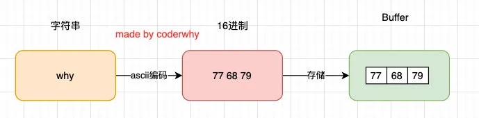
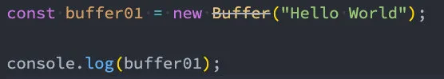
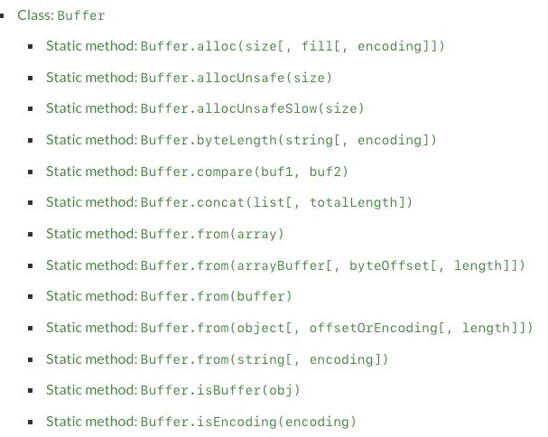
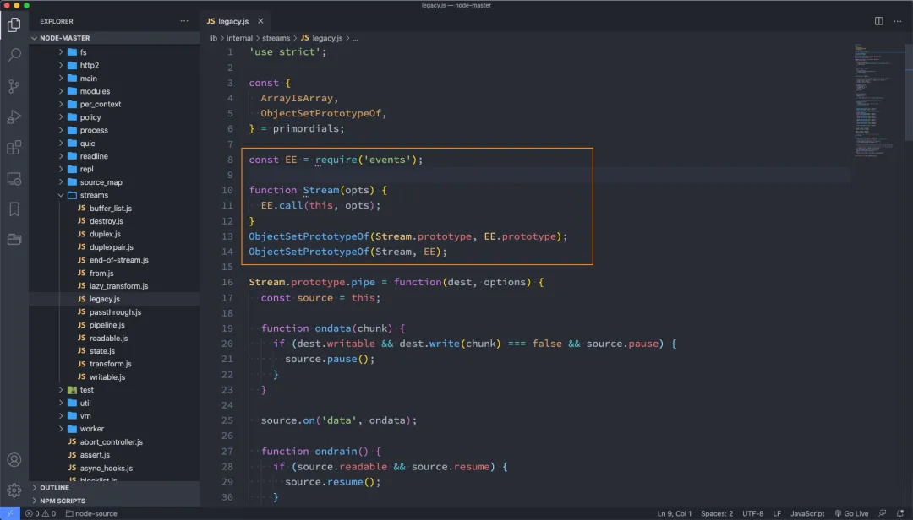

## 一. 认识Buffer

### 1.1. 数据的二进制

计算机中所有的内容：文字、数字、图片、音频、视频最终都会使用二进制来表示。

JavaScript可以直接去处理非常直观的数据：比如字符串，我们通常展示给用户的也是这些内容。

不对啊，JavaScript不是也可以处理图片吗？

- 事实上在网页端，图片我们一直是交给浏览器来处理的；
- JavaScript或者HTML，只是负责告诉浏览器一个图片的地址；
- 浏览器负责获取这个图片，并且最终将这个图片渲染出来；

但是对于服务器来说是不一样的：

- 服务器要处理的本地文件类型相对较多;
- 比如某一个保存文本的文件并不是使用 `utf-8`进行编码的，而是用 `GBK`，那么我们必须读取到他们的二进制数据，再通过GKB转换成对应的文字；
- 比如我们需要读取的是一张图片数据（二进制），再通过某些手段对图片数据进行二次的处理（裁剪、格式转换、旋转、添加滤镜），Node中有一个Sharp的库，就是读取图片或者传入图片的Buffer对其再进行处理；
- 比如在Node中通过TCP建立长连接，TCP传输的是字节流，我们需要将数据转成字节再进行传入，并且需要知道传输字节的大小（客服端需要根据大小来判断读取多少内容）；

我们会发现，对于前端开发来说，通常很少会和二进制打交道，但是对于服务器端为了做很多的功能，我们必须直接去操作其二进制的数据；

所以Node为了可以方便开发者完成更多功能，提供给了我们一个类Buffer，并且它是全局的。

### 1.2. Buffer和二进制

我们前面说过，Buffer中存储的是二进制数据，那么到底是如何存储呢？

- 我们可以将Buffer看成是一个存储二进制的数组；
- 这个数组中的每一项，可以保存8位二进制：`00000000`

为什么是8位呢？

- 在计算机中，很少的情况我们会直接操作一位二进制，因为一位二进制存储的数据是非常有限的；
- 所以通常会将8位合在一起作为一个单元，这个单元称之为一个字节（byte）；
- 也就是说 `1byte = 8bit`，`1kb=1024byte`，`1M=1024kb`;
- 比如很多编程语言中的int类型是4个字节，long类型是8个字节；
- 比如TCP传输的是字节流，在写入和读取时都需要说明字节的个数；
- 比如RGB的值分别都是255，所以本质上在计算机中都是用一个字节存储的；

也就是说，Buffer相当于是一个字节的数组，数组中的每一项对于一个字节的大小：

如果我们希望将一个字符串放入到Buffer中，是怎么样的过程呢？

```javascript
const buffer01 = new Buffer("why");

console.log(buffer01);
```



当然目前已经不希望我们这样来做了：



那么我们可以通过另外一个创建方法：

```javascript
const buffer2 = Buffer.from("why");
console.log(buffer2);
```

如果是中文呢？

```javascript
const buffer3 = Buffer.from("王红元");
console.log(buffer3);
// <Buffer e7 8e 8b e7 ba a2 e5 85 83>
const str = buffer3.toString();
console.log(str);
// 王红元
```

如果编码和解码不同：

```javascript
const buffer3 = Buffer.from("王红元", 'utf16le');
console.log(buffer3);

const str = buffer3.toString('utf8');
console.log(str); // �s�~CQ
```

## 二. Buffer其他用法

### 2.1. Buffer的其他创建

Buffer的创建方式有很多：



来看一下`Buffer.alloc`:

- 我们会发现创建了一个8位长度的Buffer，里面所有的数据默认为00；

```javascript
const buffer01 = Buffer.alloc(8);

console.log(buffer01); // <Buffer 00 00 00 00 00 00 00 00>
```

我们也可以对其进行操作：

```javascript
buffer01[0] = 'w'.charCodeAt();
buffer01[1] = 100;
buffer01[2] = 0x66;
console.log(buffer01);
```

也可以使用相同的方式来获取：

```javascript
console.log(buffer01[0]);
console.log(buffer01[0].toString(16));
```

### 2.2. Buffer和文件读取

文本文件的读取：

```javascript
const fs = require('fs');

fs.readFile('./test.txt', (err, data) => {
  console.log(data); // <Buffer 48 65 6c 6c 6f 20 57 6f 72 6c 64>
  console.log(data.toString()); // Hello World
})
```

图片文件的读取：

```javascript
fs.readFile('./zznh.jpg', (err, data) => {
  console.log(data); // <Buffer ff d8 ff e0 ... 40418 more bytes>
});
```

图片文件的读取和转换：

- 将读取的某一张图片，转换成一张200x200的图片；
- 这里我们可以借助于 `sharp` 库来完成；

```javascript
const sharp = require('sharp');
const fs = require('fs');

sharp('./test.png')
  .resize(1000, 1000)
  .toBuffer()
  .then(data => {
    fs.writeFileSync('./test_copy.png', data);
  })
```

## 三. Buffer的内存分配

事实上我们创建Buffer时，并不会频繁的向操作系统申请内存，它会默认先申请一个8 * 1024个字节大小的内存，也就是8kb

- node/lib/buffer.js：135行

```javascript
Buffer.poolSize = 8 * 1024;
let poolSize, poolOffset, allocPool;

const encodingsMap = ObjectCreate(null);
for (let i = 0; i < encodings.length; ++i)
  encodingsMap[encodings[i]] = i;

function createPool() {
  poolSize = Buffer.poolSize;
  allocPool = createUnsafeBuffer(poolSize).buffer;
  markAsUntransferable(allocPool);
  poolOffset = 0;
}
createPool();
```

假如我们调用Buffer.from申请Buffer：

- 这里我们以从字符串创建为例
- node/lib/buffer.js：290行

```javascript
Buffer.from = function from(value, encodingOrOffset, length) {
  if (typeof value === 'string')
    return fromString(value, encodingOrOffset);
 
 // 如果是对象，另外一种处理情况
  // ...
};
```

我们查看fromString的调用：

- node/lib/buffer.js：428行

```javascript
function fromString(string, encoding) {
  let ops;
  if (typeof encoding !== 'string' || encoding.length === 0) {
    if (string.length === 0)
      return new FastBuffer();
    ops = encodingOps.utf8;
    encoding = undefined;
  } else {
    ops = getEncodingOps(encoding);
    if (ops === undefined)
      throw new ERR_UNKNOWN_ENCODING(encoding);
    if (string.length === 0)
      return new FastBuffer();
  }
  return fromStringFast(string, ops);
}
```

接着我们查看fromStringFast：

- 这里做的事情是判断剩余的长度是否还足够填充这个字符串；
- 如果不足够，那么就要通过 `createPool` 创建新的空间；
- 如果够就直接使用，但是之后要进行 `poolOffset`的偏移变化；
- node/lib/buffer.js：428行

```javascript
function fromStringFast(string, ops) {
  const length = ops.byteLength(string);

  if (length >= (Buffer.poolSize >>> 1))
    return createFromString(string, ops.encodingVal);

  if (length > (poolSize - poolOffset))
    createPool();
  let b = new FastBuffer(allocPool, poolOffset, length);
  const actual = ops.write(b, string, 0, length);
  if (actual !== length) {
    // byteLength() may overestimate. That's a rare case, though.
    b = new FastBuffer(allocPool, poolOffset, actual);
  }
  poolOffset += actual;
  alignPool();
  return b;
}
```

## 四. Stream

### 4.1. 认识Stream

什么是流呢？

- 我们的第一反应应该是流水，源源不断的流动；
- 程序中的流也是类似的含义，我们可以想象当我们从一个文件中读取数据时，文件的二进制（字节）数据会源源不断的被读取到我们程序中；
- 而这个一连串的字节，就是我们程序中的流；

所以，我们可以这样理解流：

- 是连续字节的一种表现形式和抽象概念；
- 流应该是可读的，也是可写的；

在之前学习文件的读写时，我们可以直接通过 `readFile`或者 `writeFile`方式读写文件，为什么还需要流呢？

- 直接读写文件的方式，虽然简单，但是无法控制一些细节的操作；
- 比如从什么位置开始读、读到什么位置、一次性读取多少个字节；
- 读到某个位置后，暂停读取，某个时刻恢复读取等等；
- 或者这个文件非常大，比如一个视频文件，一次性全部读取并不合适；

事实上Node中很多对象是基于流实现的：

- http模块的Request和Response对象；
- process.stdout对象；

官方：另外所有的流都是EventEmitter的实例：

我们可以看一下Node源码中有这样的操作：



流（Stream）的分类：

- `Writable`：可以向其写入数据的流（例如 `fs.createWriteStream()`）。
- `Readable`：可以从中读取数据的流（例如 `fs.createReadStream()`）。
- `Duplex`：同时为`Readable`和的流`Writable`（例如 `net.Socket`）。
- `Transform`：`Duplex`可以在写入和读取数据时修改或转换数据的流（例如`zlib.createDeflate()`）。

这里我们通过fs的操作，讲解一下Writable、Readable，另外两个大家可以自行学习一下。

### 4.2. Readable

之前我们读取一个文件的信息：

```javascript
fs.readFile('./foo.txt', (err, data) => {
  console.log(data);
})
```

这种方式是一次性将一个文件中所有的内容都读取到程序（内存）中，但是这种读取方式就会出现我们之前提到的很多问题：

- 文件过大、读取的位置、结束的位置、一次读取的大小；

这个时候，我们可以使用 `createReadStream`，我们来看几个参数，更多参数可以参考官网：

- start：文件读取开始的位置；
- end：文件读取结束的位置；
- highWaterMark：一次性读取字节的长度，默认是64kb；

```javascript
const read = fs.createReadStream("./foo.txt", {
  start: 3,
  end: 8,
  highWaterMark: 4
});
```

我们如何获取到数据呢？

- 可以通过监听data事件，获取读取到的数据；

```javascript
read.on("data", (data) => {
  console.log(data);
});
```

我们也可以监听其他的事件：

```javascript
read.on('open', (fd) => {
  console.log("文件被打开");
})

read.on('end', () => {
  console.log("文件读取结束");
})

read.on('close', () => {
  console.log("文件被关闭");
})
```

甚至我们可以在某一个时刻暂停和恢复读取：

```javascript
read.on("data", (data) => {
  console.log(data);

  read.pause();

  setTimeout(() => {
    read.resume();
  }, 2000);
});
```

### 4.3. Writable

之前我们写入一个文件的方式是这样的：

```javascript
fs.writeFile('./foo.txt', "内容", (err) => {
  
});
```

这种方式相当于一次性将所有的内容写入到文件中，但是这种方式也有很多问题：

- 比如我们希望一点点写入内容，精确每次写入的位置等；

这个时候，我们可以使用 `createWriteStream`，我们来看几个参数，更多参数可以参考官网：

- flags：默认是`w`，如果我们希望是追加写入，可以使用 `a`或者 `a+`；
- start：写入的位置；

我们进行一次简单的写入

```javascript
const writer = fs.createWriteStream("./foo.txt", {
  flags: "a+",
  start: 8
});

writer.write("你好啊", err => {
  console.log("写入成功");
});
```

如果我们希望监听一些事件：

```javascript
writer.on("open", () => {
  console.log("文件打开");
})

writer.on("finish", () => {
  console.log("文件写入结束");
})

writer.on("close", () => {
  console.log("文件关闭");
})
```

我们会发现，我们并不能监听到 `close` 事件：

- 这是因为写入流在打开后是不会自动关闭的；
- 我们必须手动关闭，来告诉Node已经写入结束了；
- 并且会发出一个 `finish` 事件的；

```javascript
writer.close();

writer.on("finish", () => {
  console.log("文件写入结束");
})

writer.on("close", () => {
  console.log("文件关闭");
})
```

另外一个非常常用的方法是 `end`：

- `end`方法相当于做了两步操作：`write`传入的数据和调用`close`方法；

```javascript
writer.end("Hello World");
```

### 4.4. pipe方法

正常情况下，我们可以将读取到的 `输入流`，手动的放到 `输出流`中进行写入：

```javascript
const fs = require('fs');
const { read } = require('fs/promises');

const reader = fs.createReadStream('./foo.txt');
const writer = fs.createWriteStream('./bar.txt');

reader.on("data", (data) => {
  console.log(data);
  writer.write(data, (err) => {
    console.log(err);
  });
});
```

我们也可以通过pipe来完成这样的操作：

```javascript
reader.pipe(writer);

writer.on('close', () => {
  console.log("输出流关闭");
})
```