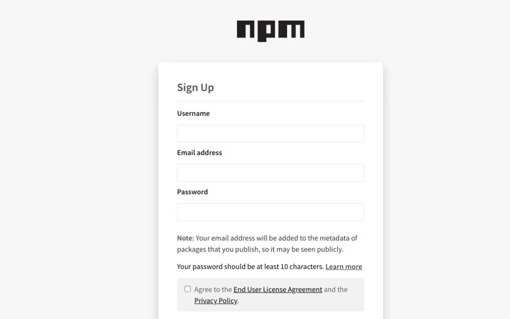

> 目前前端工程化开发过程中，我们会使用各种各样的脚手架，vue-cli、create-react-app，当然也包括webpack、gulp、rollup、vite等工具。
>
> 这些工具是怎么开发出来的呢？当我们执行一个命令时，它们做了什么事情？是怎么样完成的一系列操作？
>
> 这里我开发了一个coderwhy的脚手架：一个帮助你快速搭建和开发前端项目的CLI。
>
> 文档内容分成两部分：
>
> > 第一部分：coderwhy使用说明；
> >
> > 第二部分：coderwhy脚手架开发过程；
>
> 欢迎下载学习，如果对你有帮助，可以点一个star~
>
> > 脚手架地址：https://github.com/coderwhy/coderwhy
>
> > Vue项目模板：https://github.com/coderwhy/hy-vue-temp

## 说明文档

### `coderwhy`: 一个帮助你快速搭建和开发前端项目的CLI

> 想不起来其他名字，以这个命名吧~

如何安装？

```javascript
npm install coderwhy -g
```

### 一. 创建项目

目前支持Vue，后期会支持React，Angular考虑中~

vue项目模块已经帮你配置：

- 常用的目录结构（你可以在此基础上修改）
- vue.config.js（其中配置了别名，你可以自行修改和配置更多）
- axios（网络请求axios的安装以及二次封装）
- vue-router（router的安装和配置，另外有路由的动态加载，后面详细说明）
- vuex（vuex的安装和配置，另外有动态加载子模块，后面详细说明）

创建项目

```javascript
coderwhy create your_project_name
```

自动拉取项目模板、安装项目依赖、打开浏览器 `http://localhost:8080/`、自动启动项目

### 二. 项目开发

项目开发目前提供三个功能：

- 创建Vue组件
- 创建Vue页面，并配置路由
- 创建Vuex子模块

#### 2.1. 创建Vue组件：

```javascript
coderwhy addcpn YourComponentName # 例如coderwhy add NavBar，默认会存放到src/components文件夹中
coderwhy addcpn YourComponentName -d src/pages/home # 也可以指定存放的具体文件夹
```

#### 2.2. 创建Vue页面，并配置路由

```javascript
coderwhy addpage YourPageName # 例如coderwhy addpage Home，默认会放到src/pages/home/Home.vue中，并且会创建src/page/home/router.js
coderwhy addpage YourPageName -d src/views # 也可以指定文件夹，但需要手动集成路由
```

为什么会创建router.js文件：

- `router.js`文件是路由的其中一个配置；
- 创建该文件中 `src/router/index.js`中会自动加载到路由的 `routes`配置中，不需要手动配置了（如果是自己配置的文件夹需要手动配置）

`src/router/index.js`中已经完成如下操作：

```javascript
// 动态加载pages中所有的路由文件
const files = require.context('@/pages', true, /router\.js$/);
const routes = files.keys().map(key => {
  const page = require('@/pages' + key.replace('.', ''));
  return page.default;
})
```

#### 2.3. 创建Vuex子模块

```javascript
coderwhy addstore YourVuexChildModuleName # 例如coderwhy addstore home，默认会放到src/store/modules/home/index.js和types.js
coderwhy addstore YourVuexChildModuleName -d src/vuex/modules # 也可以指定文件夹
```

创建完成后，不需要手动配置，已经动态将所有子模块集成进去：

```javascript
// 动态加载modules
const modules = {}
const files = require.context('./', true, /index\.js$/);
files.keys().filter(key => {
  if (key === './index.js') return false;
  return true
}).map(key => {  
  // 获取名字
  const modulePath = key.replace('./modules/', '');
  const moduleName = modulePath.replace('/index.js', '');
  const module = require(`${key}`);

  modules[`${moduleName}`] = module.default;
})
```

## 开发过程

### 一. 项目开始

创建index.js

```javascript
console.log("Hello Coderwhy")
```

创建package.json

```javascript
{
  "name": "coderwhy",
  "version": "1.1.0",
  "description": "CLI front-end development tools",
  "main": "index.js",
  "bin": {
    "coderwhy": "index.js"
  },
  "scripts": {
    "test": "echo \"Error: no test specified\" && exit 1"
  },
  "keywords": [
    "vue",
    "react",
    "CLI",
    "component"
  ],
  "author": "coderwhy",
  "license": "MIT",
  "homepage": "https://github.com/coderwhy/coderwhy",
  "repository": {
    "type": "git",
    "url": "https://github.com/coderwhy/coderwhy"
  },
  "dependencies": {
    "chalk": "^4.1.0",
    "commander": "^6.1.0",
    "download-git-repo": "^3.0.2",
    "ejs": "^3.1.5",
    "open": "^7.3.0"
  }
}
```

最终的目录结构：

```javascript
├── LICENSE
├── index.js
├── lib
│   ├── config
│   │   └── repo_config.js
│   ├── core
│   │   ├── actions.js
│   │   ├── create.js
│   │   └── help.js
│   ├── template
│   │   ├── component.vue.ejs
│   │   ├── vue-router.js.ejs
│   │   ├── vue-store.js.ejs
│   │   └── vue-types.js.ejs
│   └── utils
│       ├── file.js
│       ├── log.js
│       └── terminal.js
├── package-lock.json
├── package.json
└── readme.md
```

### 二. 创建coderwhy的命令

自动在你的环境变量中查找node

注意：必须放在第一行

```javascript
#!/usr/bin/env node
```

修改package.json

```javascript
  "bin": {
    "coderwhy": "index.js"
  }
```

执行npm link

### 三. commander用法

#### 3.1. 定义版本号

```javascript
#!/usr/bin/env node
const cmd = require('commander');
// 定义显示模块的版本号
cmd.version(require('./package.json').version);
// 解析终端指令
cmd.parse(process.argv);
```

#### 3.2. 给help增加其他选项

添加单个选项

```javascript
program.option('-s --src <src>', 'a source folder');
program.option('-d --dest <dest>', 'a destination folder');
program.option('-f --framework <framework>', 'your framework name');
```

监听help指令

```javascript
program.on('--help', function() {
  console.log("");
  console.log("usage");
  console.log("   coderwhy -v");
  console.log("   coderwhy -version");
})
```

### 四. 创建项目指令

```javascript
// 创建命令
program
  .command('create <project> [otherArgs...]')
  .description('clone a repository into a newly created directory')
  .action((project, otherArgs) => {
    console.log(project);
    console.log(otherArgs);
   // 调用封装的函数
   createProject(project, otherArgs)
  })
```

在actions中封装创建过程：

```javascript
const downloadRepo = promisify(require('download-git-repo'));

const createProject = async (project, otherArg) => {
  // 1.提示信息
  console.log('coderwhy helps you create your project, please wait a moment~');

  // 2.clone项目从仓库
  await downloadRepo(repoConfig.vueGitRepo, project, { clone: true });

  // 3.执行终端命令npm install
  // terminal.exec('npm install', {cwd: `./${project}`});
  const npm = process.platform === 'win32' ? 'npm.cmd' : 'npm';
  await terminal.spawn(npm, ['install'], { cwd: `./${project}` });

  // 4.打开浏览器
  open('http://localhost:8080/');

  // 5.运行项目
  await terminal.spawn(npm, ['run', 'serve'], { cwd: `./${project}` });
}
```

配置的Git地址如下：

- 后续会开发一个设置自己地址的指令

```javascript
const vueGitRepo = "direct:https://github.com/coderwhy/hy-vue-temp.git";

module.exports = {
  vueGitRepo
}
```

封装执行终端命令的过程：

```javascript
const { spawn, exec } = require('child_process');

const spawnCommand = (...args) => {
  return new Promise((resole, reject) => {
    const childProcess = spawn(...args);
    childProcess.stdout.pipe(process.stdout);
    childProcess.stderr.pipe(process.stderr);
    childProcess.on('close', () => {
      resole();
    });
  })
}
```

### 五. 添加组件指令

#### 5.1. 封装ejs模板

组件模块如下：

```javascript
<%_ if(data) { _%>
<template>
  <div class="<%= data.lowerName %>">
    <h2>{{ message }}</h2>
  </div>
</template>

<script>
  export default {
    name: "<%= data.name %>",
    components: {

    },
    mixins: [],
    props: {

    },
    data: function() {
      return {
        message: "Hello <%= data.name %>"
      }
    },
    created: function() {

    },
    mounted: function() {

    },
    computed: {

    },
    methods: {

    }
  }
</script>

<style scoped>
  .<%= data.lowerName %> {
    
  }
</style>

<%_ } _%>
```

路由模板：

- 组件模板，直接使用上面的即可
- router.js模板

```javascript
<%_ if (data) { _%>
// 普通加载路由
// import <%= data.name %> from './<%= data.name %>.vue'
// 懒加载路由
const <%= data.name %> = () => import('./<%= data.name %>.vue')
export default {
  path: '/<%= data.lowerName %>',
  name: '<%= data.name %>',
  component: <%= data.name %>,
  children: [
  ]
}
<%_ } _%>
```

vuex模块的模板

- index.js模板
- types.js模板

index.js模块

```javascript
import * as types from './types.js'
export default {
  namespaced: true,
  state: {
  },
  mutations: {
  },
  actions: {
  },
  getters: {
  }
}
```

types.js模块

```javascript
export {
  
}
```

#### 5.2. 封装ejs解析

封装ejs的编译过程：

```javascript
const ejsCompile = (templatePath, data={}, options = {}) => {
  return new Promise((resolve, reject) => {
    ejs.renderFile(templatePath, {data}, options, (err, str) => {
      if (err) {
        reject(err);
        return;
      }
      resolve(str);
    })
  })
}
```

封装创建文件夹的过程：

```javascript
const mkdirSync = (dirname) => {
  if (fs.existsSync(dirname)) {
    return true
  } else {
    // 不存在,判断父亲文件夹是否存在？
    if (mkdirSync(path.dirname(dirname))) {
      // 存在父亲文件，就直接新建该文件
      fs.mkdirSync(dirname)
      return true
    }
  }
}
```

封装写入文件的过程：

```javascript
const writeFile = (path, content) => {
  if (fs.existsSync(path)) {
    log.error("the file already exists~")
    return;
  }
  return fs.promises.writeFile(path, content);
}
```

封装ejs到文件的转化过程：

```javascript
const handleEjsToFile = async (name, dest, template, filename) => {
  // 1.获取模块引擎的路径
  const templatePath = path.resolve(__dirname, template);
  const result = await ejsCompile(templatePath, {name, lowerName: name.toLowerCase()});

  // 2.写入文件中
  // 判断文件不存在,那么就创建文件
  mkdirSync(dest);
  const targetPath = path.resolve(dest, filename);
  writeFile(targetPath, result);
}
```

#### 5.3. 创建添加指令

添加指令

```javascript
program
  .command('addcpn <name>')
  .description('add vue component, 例如: coderwhy addcpn NavBar [-d src/components]')
  .action(name => addComponent(name, program.dest || 'src/components'))

program
  .command('addpage <name>')
  .description('add vue page, 例如: coderwhy addpage Home [-d dest]')
  .action(name => {
  addPage(name, program.dest || `src/pages/${name.toLowerCase()}`)
})

program
  .command('addstore <name>')
  .description('add vue store, 例如: coderwhy addstore favor [-d dest]')
  .action(name => {
  addStore(name, program.dest || `src/store/modules/${name.toLowerCase()}`)
})
```

封装对应的action

```javascript
const addComponent = async (name, dest) => {
  handleEjsToFile(name, dest, '../template/component.vue.ejs', `${name}.vue`);
}

const addPage = async (name, dest) => {
  addComponent(name, dest);
  handleEjsToFile(name, dest, '../template/vue-router.js.ejs', 'router.js')
}

const addStore = async (name, dest) => {
  handleEjsToFile(name, dest, '../template/vue-store.js.ejs', 'index.js')
  handleEjsToFile(name, dest, '../template/vue-types.js.ejs', 'types.js')
}
```

### 六. 发布工具

注册npm账号：

- https://www.npmjs.com/
- 选择sign up



在命令行登录：

```javascript
npm login
# 输入账号、密码、邮箱
```

修改好package.json文件：

```javascript
"keywords": [
    "vue",
    "react",
    "CLI",
    "component"
  ],
  "author": "coderwhy",
  "license": "MIT",
  "homepage": "https://github.com/coderwhy/coderwhy",
  "repository": {
    "type": "git",
    "url": "https://github.com/coderwhy/coderwhy"
  },
```

发布到npm registry中

```javascript
npm publish
```

更新registry

```javascript
# 1.修改版本号(最好符合semver规范)
# 2.重新发布
```

删除发布的包：

```javascript
npm unpublish
```

过期发布的包：

```javascript
npm deprecate
```