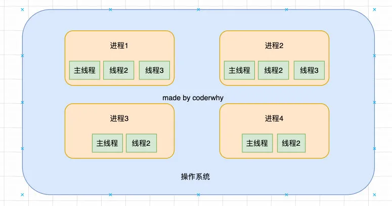
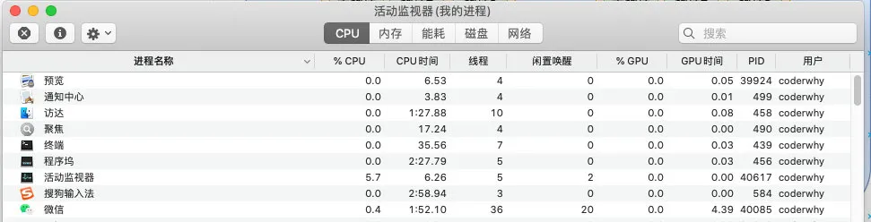
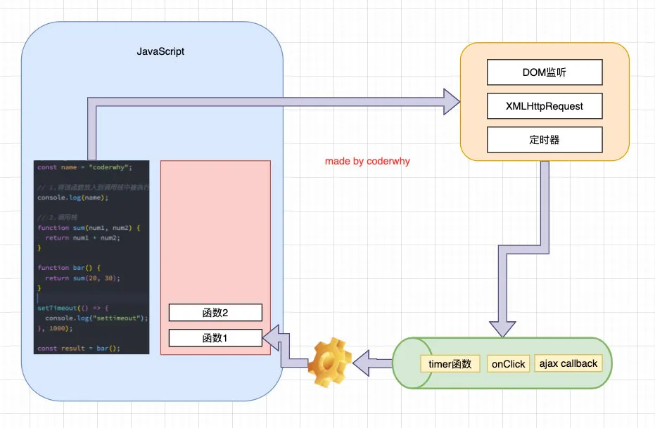
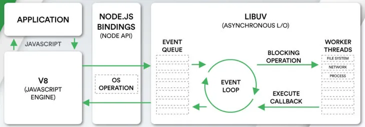
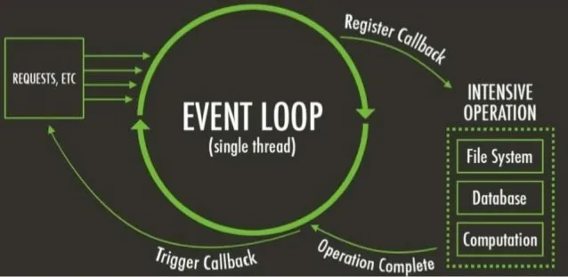
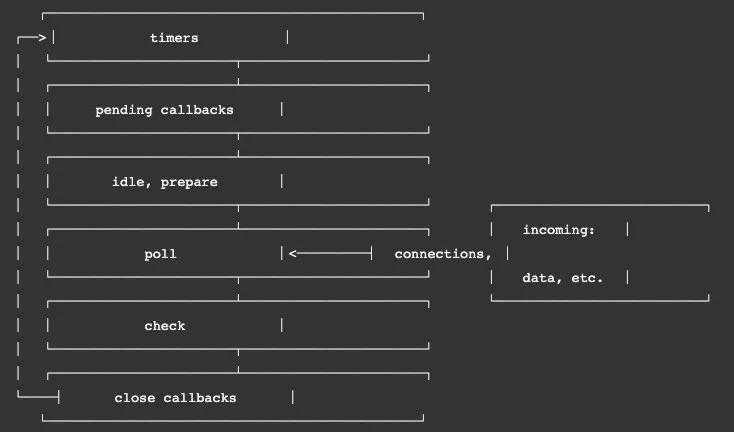

> 事件循环是什么？事实上我把事件循环理解成我们编写的JavaScript和浏览器或者Node之间的一个桥梁。
>
> 浏览器的事件循环是一个我们编写的JavaScript代码和浏览器API调用(setTimeout/AJAX/监听事件等)的一个桥梁, 桥梁之间他们通过回调函数进行沟通。
>
> Node的事件循环是一个我们编写的JavaScript代码和系统调用（file system、network等）之间的一个桥梁, 桥梁之间他们通过回调函数进行沟通的.

## 一. 浏览器的事件循环

### 1.1. 进程和线程

线程和进程是操作系统中的两个概念：

- 进程（process）：计算机已经运行的程序；
- 线程（thread）：操作系统能够运行运算调度的最小单位；

听起来很抽象，我们直观一点解释：

- 进程：我们可以认为，启动一个应用程序，就会默认启动一个进程（也可能是多个进程）；
- 线程：每一个进程中，都会启动一个线程用来执行程序中的代码，这个线程被称之为主线程；
- 所以我们也可以说进程是线程的容器；

再用一个形象的例子解释：

- 操作系统类似于一个工厂；
- 工厂中里有很多车间，这个车间就是进程；
- 每个车间可能有一个以上的工人在工厂，这个工人就是线程；



操作系统是如何做到同时让多个进程（边听歌、边写代码、边查阅资料）同时工作呢？

- 这是因为CPU的运算速度非常快，它可以快速的在多个进程之间迅速的切换；
- 当我们的进程中的线程获取获取到时间片时，就可以快速执行我们编写的代码；
- 对于用于来说是感受不到这种快速的切换的；

你可以在Mac的活动监视器或者Windows的资源管理器中查看到很多进程：



### 1.2. 浏览器和JavaScript

我们经常会说JavaScript是单线程的，但是JavaScript的线程应该有自己的容器进程：浏览器或者Node。

浏览器是一个进程吗，它里面只有一个线程吗？

- 目前多数的浏览器其实都是多进程的，当我们打开一个tab页面时就会开启一个新的进程，这是为了防止一个页面卡死而造成所有页面无法响应，整个浏览器需要强制退出；
- 每个进程中又有很多的线程，其中包括执行JavaScript代码的线程；

但是JavaScript的代码执行是在一个单独的线程中执行的：

- 这就意味着JavaScript的代码，在同一个时刻只能做一件事；
- 如果这件事是非常耗时的，就意味着当前的线程就会被阻塞；

分析下面代码的执行过程：

- 定义变量name；
- 执行log函数，函数会被放入到调用栈中执行；
- 调用bar()函数，被压入到调用栈中，但是执行未结束；
- bar因为调用了sum，sum函数被压入到调用栈中，获取到结果后出栈；
- bar获取到结果后出栈，获取到结果result；
- 将log函数压入到调用栈，log被执行，并且出栈；

```javascript
const name = "coderwhy";

// 1.将该函数放入到调用栈中被执行
console.log(name);

// 2. 调用栈
function sum(num1, num2) {
  return num1 + num2;
}

function bar() {
  return sum(20, 30);
}

console.log(bar());
```

### 1.3. 浏览器的事件循环

如果在执行JavaScript代码的过程中，有异步操作呢？

- 中间我们插入了一个setTimeout的函数调用；
- 这个函数被放到入调用栈中，执行会立即结束，并不会阻塞后续代码的执行；

```javascript
const name = "coderwhy";

// 1.将该函数放入到调用栈中被执行
console.log(name);

// 2.调用栈
function sum(num1, num2) {
  return num1 + num2;
}

function bar() {
  return sum(20, 30);
}

setTimeout(() => {
  console.log("settimeout");
}, 1000);

const result = bar();

console.log(result);
```

那么，传入的一个函数（比如我们称之为timer函数），会在什么时候被执行呢？

- 事实上，setTimeout是调用了web api，在合适的时机，会将timer函数加入到一个事件队列中；
- 事件队列中的函数，会被放入到调用栈中，在调用栈中被执行；



### 1.4. 宏任务和微任务

但是事件循环中并非只维护着一个队列，事实上是有两个队列：

- 宏任务队列（macrotask queue）：ajax、setTimeout、setInterval、DOM监听、UI Rendering等
- 微任务队列（microtask queue）：Promise的then回调、 Mutation Observer API、queueMicrotask()等

那么事件循环对于两个队列的优先级是怎么样的呢？

- 1.main script中的代码优先执行（编写的顶层script代码）；

- 2.在执行任何一个宏任务之前（不是队列，是一个宏任务），都会先查看微任务队列中是否有任务需要执行

- - 也就是宏任务执行之前，必须保证微任务队列是空的；
  - 如果不为空，那么就优先执行微任务队列中的任务（回调）；

我们来看一个面试题：执行结果如何？

```javascript
setTimeout(function () {
  console.log("set1");

  new Promise(function (resolve) {
    resolve();
  }).then(function () {
    new Promise(function (resolve) {
      resolve();
    }).then(function () {
      console.log("then4");
    });
    console.log("then2");
  });
});

new Promise(function (resolve) {
  console.log("pr1");
  resolve();
}).then(function () {
  console.log("then1");
});

setTimeout(function () {
  console.log("set2");
});

console.log(2);

queueMicrotask(() => {
  console.log("queueMicrotask1")
});

new Promise(function (resolve) {
  resolve();
}).then(function () {
  console.log("then3");
});
```

执行结果：

```javascript
pr1
2
then1
queueMicrotask1
then3
set1
then2
then4
set2
```

async、await是Promise的一个语法糖：

- 我们可以将await关键字后面执行的代码，看做是包裹在`(resolve, reject) => {函数执行}`中的代码；
- await的下一条语句，可以看做是`then(res => {函数执行})`中的代码；

今日头条的面试题：

```javascript
async function async1 () {
  console.log('async1 start')
  await async2();
  console.log('async1 end')
}
 
async function async2 () {
  console.log('async2')
}

console.log('script start')
 
setTimeout(function () {
  console.log('setTimeout')
}, 0)
 
async1();
 
new Promise (function (resolve) {
  console.log('promise1')
  resolve();
}).then (function () {
  console.log('promise2')
})

console.log('script end')
```

执行结果如下：

```javascript
script start
async1 start
async2
promise1
script end
async1 end
promise2
setTimeout
```

## 二. Node的事件循环

### 2.1. Node的事件循环

浏览器中的EventLoop是根据HTML5定义的规范来实现的，不同的浏览器可能会有不同的实现，而Node中是由libuv实现的。

我们来看在很早就给大家展示的Node架构图：

- 我们会发现libuv中主要维护了一个EventLoop和worker threads（线程池）；
- EventLoop负责调用系统的一些其他操作：文件的IO、Network、child-processes等



libuv到底是什么呢？

- libuv is a multi-platform support library with a focus on asynchronous I/O. It was primarily developed for use by Node.js, but it's also used by Luvit, Julia, pyuv, and others.
- libuv是一个多平台的专注于异步IO的库，它最初是为Node开发的，但是现在也被使用到Luvit、Julia、pyuv等其他地方；

libuv到底帮助我们做了什么事情呢？

- 我们以文件操作为例，来讲解一下它内部的结构；

### 2.2. 阻塞IO和非阻塞IO

如果我们希望在程序中对一个文件进行操作，那么我们就需要打开这个文件：通过文件描述符。

- 我们思考：JavaScript可以直接对一个文件进行操作吗？
- 看起来是可以的，但是事实上我们任何程序中的文件操作都是需要进行系统调用（操作系统封装了文件系统）；
- 事实上对文件的操作，是一个操作系统的IO操作（输入、输出）；

操作系统为我们提供了`阻塞式调用`和`非阻塞式调用`：

- **阻塞式调用：** 调用结果返回之前，当前线程处于阻塞态（阻塞态CPU是不会分配时间片的），调用线程只有在得到调用结果之后才会继续执行。
- **非阻塞式调用：** 调用执行之后，当前线程不会停止执行，只需要过一段时间来检查一下有没有结果返回即可。

所以我们开发中的很多耗时操作，都可以基于这样的 `非阻塞式调用`：

- 比如网络请求本身使用了Socket通信，而Socket本身提供了select模型，可以进行`非阻塞方式的工作`；
- 比如文件读写的IO操作，我们可以使用操作系统提供的`基于事件的回调机制`；

但是非阻塞IO也会存在一定的问题：我们并没有获取到需要读取（我们以读取为例）的结果

- 那么就意味着为了可以知道是否读取到了完整的数据，我们需要频繁的去确定读取到的数据是否是完整的；
- 这个过程我们称之为轮训操作；

那么这个轮训的工作由谁来完成呢？

- 如果我们的主线程频繁的去进行轮训的工作，那么必然会大大降低性能；
- 并且开发中我们可能不只是一个文件的读写，可能是多个文件；
- 而且可能是多个功能：网络的IO、数据库的IO、子进程调用；

libuv提供了一个线程池（Thread Pool）：

- 线程池会负责所有相关的操作，并且会通过轮训等方式等待结果；
- 当获取到结果时，就可以将对应的回调放到事件循环（某一个事件队列）中；
- 事件循环就可以负责接管后续的回调工作，告知JavaScript应用程序执行对应的回调函数；



阻塞和非阻塞，同步和异步有什么区别？

- 阻塞和非阻塞是对于被调用者来说的；

- - 在我们这里就是系统调用，操作系统为我们提供了阻塞调用和非阻塞调用；

- 同步和异步是对于调用者来说的；

- - 在我们这里就是自己的程序；
  - 如果我们在发起调用之后，不会进行其他任何的操作，只是等待结果，这个过程就称之为同步调用；
  - 如果我们再发起调用之后，并不会等待结果，继续完成其他的工作，等到有回调时再去执行，这个过程就是异步调用；

### 2.3. Node事件循环的阶段

我们最前面就强调过，事件循环像是一个桥梁，是连接着应用程序的JavaScript和系统调用之间的通道：

- 无论是我们的文件IO、数据库、网络IO、定时器、子进程，在完成对应的操作后，都会将对应的结果和回调函数放到事件循环（任务队列）中；
- 事件循环会不断的从任务队列中取出对应的事件（回调函数）来执行；

但是一次完整的事件循环Tick分成很多个阶段：

- **定时器（Timers）**：本阶段执行已经被 `setTimeout()` 和 `setInterval()` 的调度回调函数。
- **待定回调（Pending Callback）**：对某些系统操作（如TCP错误类型）执行回调，比如TCP连接时接收到ECONNREFUSED。
- **idle, prepare**：仅系统内部使用。
- **轮询（Poll）**：检索新的 I/O 事件；执行与 I/O 相关的回调；
- **检测**：`setImmediate()` 回调函数在这里执行。
- **关闭的回调函数**：一些关闭的回调函数，如：`socket.on('close', ...)`。



我们会发现从一次事件循环的Tick来说，Node的事件循环更复杂，它也分为微任务和宏任务：

- 宏任务（macrotask）：setTimeout、setInterval、IO事件、setImmediate、close事件；
- 微任务（microtask）：Promise的then回调、process.nextTick、queueMicrotask；

但是，Node中的事件循环不只是 `微任务队列`和 `宏任务队列`：

- 微任务队列：

- - next tick queue：process.nextTick；
  - other queue：Promise的then回调、queueMicrotask；

- 宏任务队列：

- - timer queue：setTimeout、setInterval；
  - poll queue：IO事件；
  - check queue：setImmediate；
  - close queue：close事件；

所以，在每一次事件循环的tick中，会按照如下顺序来执行代码：

- next tick microtask queue；
- other microtask queue；
- timer queue；
- poll queue；
- check queue；
- close queue；

### 2.4. Node代码执行面试

面试题一：

```javascript
async function async1() {
  console.log('async1 start')
  await async2()
  console.log('async1 end')
}

async function async2() {
  console.log('async2')
}

console.log('script start')

setTimeout(function () {
  console.log('setTimeout0')
}, 0)

setTimeout(function () {
  console.log('setTimeout2')
}, 300)

setImmediate(() => console.log('setImmediate'));

process.nextTick(() => console.log('nextTick1'));

async1();

process.nextTick(() => console.log('nextTick2'));

new Promise(function (resolve) {
  console.log('promise1')
  resolve();
  console.log('promise2')
}).then(function () {
  console.log('promise3')
})

console.log('script end')
```

执行结果如下：

```javascript
script start
async1 start
async2
promise1
promise2
script end
nextTick
async1 end
promise3

setTimeout0
setImmediate
setTimeout2
```

面试题二：

```javascript
setTimeout(() => {
  console.log("setTimeout");
}, 0);

setImmediate(() => {
  console.log("setImmediate");
});
```

执行结果：

```javascript
情况一：
setTimeout
setImmediate

情况二：
setImmediate
setTimeout
```

为什么会出现不同的情况呢？

- 在Node源码的deps/uv/src/timer.c中141行，有一个 `uv__next_timeout`的函数；
- 这个函数决定了，poll阶段要不要阻塞在这里；
- 阻塞在这里的目的是当有异步IO被处理时，尽可能快的让代码被执行；

```javascript
int uv__next_timeout(const uv_loop_t* loop) {
  const struct heap_node* heap_node;
  const uv_timer_t* handle;
  uint64_t diff;

  // 计算距离当前时间节点最小的计时器
  heap_node = heap_min(timer_heap(loop));
  // 如果为空, 那么返回-1,表示为阻塞状态
  if (heap_node == NULL)
    return -1; /* block indefinitely */

  // 如果计时器的时间小于当前loop的开始时间, 那么返回0
  // 继续执行后续阶段, 并且开启下一次tick
  handle = container_of(heap_node, uv_timer_t, heap_node);
  if (handle->timeout <= loop->time)
    return 0;

  // 如果不大于loop的开始时间, 那么会返回时间差
  diff = handle->timeout - loop->time;
  if (diff > INT_MAX)
    diff = INT_MAX;

  return (int) diff;
}
```

和上面有什么关系呢？

- 情况一：如果事件循环开启的时间(ms)是小于 `setTimeout`函数的执行时间的；

- - 也就意味着先开启了event-loop，但是这个时候执行到timer阶段，并没有定时器的回调被放到入 timer queue中；
  - 所以没有被执行，后续开启定时器和检测到有setImmediate时，就会跳过poll阶段，向后继续执行；
  - 这个时候是先检测 `setImmediate`，第二次的tick中执行了timer中的 `setTimeout`；

- 情况二：如果事件循环开启的时间(ms)是大于 `setTimeout`函数的执行时间的；

- - 这就意味着在第一次 tick中，已经准备好了timer queue；
  - 所以会直接按照顺序执行即可；