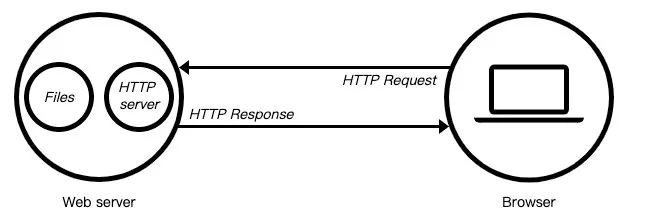
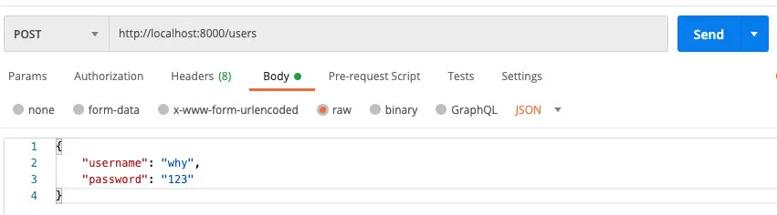
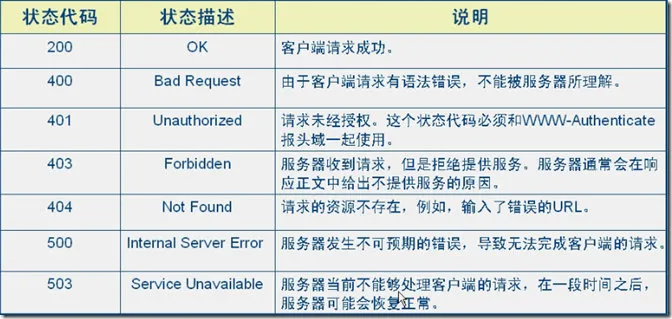

> 什么是Web服务器？
>
> 当应用程序（客户端）需要某一个资源时，可以向一个台服务器，通过Http请求获取到这个资源；提供服务器的这个服务器，就是一个Web服务器；



目前有很多开源的Web服务器：Nginx、Apache（静态）、Apache Tomcat（静态、动态）、Node.js

## 一. Http模板基本使用

### 1.1. 如何创建服务

#### 1.1.1. Web服务器初体验

创建一个Web服务器的初体验：

```javascript
const http = require('http');

const HTTP_PORT = 8000;

const server = http.createServer((req, res) => {
  res.end("Hello World");
});

server.listen(8000, () => {
  console.log(`🚀服务器在${HTTP_PORT}启动~`)
})
```

#### 1.1.2. 创建服务器

创建服务器对象，我们是通过 `createServer` 来完成的

- `http.createServer`会返回服务器的对象；
- 底层其实使用直接 new Server 对象。

```javascript
function createServer(opts, requestListener) {
  return new Server(opts, requestListener);
}
```

那么，当然，我们也可以自己来创建这个对象：

```javascript
const server2 = new http.Server((req, res) => {
  res.end("Hello Server2");
});

server2.listen(9000, () => {
  console.log("服务器启动成功~");
})
```

上面我们已经看到，创建Server时会传入一个回调函数，这个回调函数在被调用时会传入两个参数：

- req：request请求对象，包含请求相关的信息；
- res：response响应对象，包含我们要发送给客户端的信息；

#### 1.1.3. 监听端口和主机

**Server**通过listen方法来开启服务器，并且在某一个主机和端口上监听网络请求：

- 也就是当我们通过 `ip:port`的方式发送到我们监听的Web服务器上时；
- 我们就可以对其进行相关的处理；

`listen`函数有三个参数：

- 端口port: 可以不传, 系统会默认分配端, 后续项目中我们会写入到环境变量中；

- 主机host: 通常可以传入localhost、ip地址127.0.0.1、或者ip地址0.0.0.0，默认是0.0.0.0；

- - 监听IPV4上所有的地址，再根据端口找到不同的应用程序；
  - 比如我们监听 `0.0.0.0`时，在同一个网段下的主机中，通过ip地址是可以访问的；
  - 正常的数据库包经常 应用层 - 传输层 - 网络层 - 数据链路层 - 物理层 ；
  - 而回环地址，是在网络层直接就被获取到了，是不会经常数据链路层和物理层的；
  - 比如我们监听 `127.0.0.1`时，在同一个网段下的主机中，通过ip地址是不能访问的；
  - localhost：本质上是一个域名，通常情况下会被解析成127.0.0.1；
  - 127.0.0.1：回环地址（Loop Back Address），表达的意思其实是我们主机自己发出去的包，直接被自己接收；
  - 0.0.0.0：

- 回调函数：服务器启动成功时的回调函数；

```javascript
server.listen(() => {
  console.log("服务器启动~🚀");
})
```

### 1.2. request请求对象

在向服务器发送请求时，我们会携带很多信息，比如：

- 本次请求的URL，服务器需要根据不同的URL进行不同的处理；
- 本次请求的请求方式，比如GET、POST请求传入的参数和处理的方式是不同的；
- 本次请求的headers中也会携带一些信息，比如客户端信息、接受数据的格式、支持的编码格式等；
- 等等...

这些信息，Node会帮助我们封装到一个request的对象中，我们可以直接来处理这个request对象：

```javascript
const server = http.createServer((req, res) => {
  // request对象
  console.log(req.url);
  console.log(req.method);
  console.log(req.headers);

  res.end("Hello World");
});
```

#### 1.2.1. URL的处理

客户端在发送请求时，会请求不同的数据，那么会传入不同的请求地址：

- 比如 `http://localhost:8000/login`；
- 比如 `http://localhost:8000/products`;

服务器端需要根据不同的请求地址，作出不同的响应：

```javascript
const server = http.createServer((req, res) => {
  const url = req.url;
  console.log(url);

  if (url === '/login') {
    res.end("welcome Back~");
  } else if (url === '/products') {
    res.end("products");
  } else {
    res.end("error message");
  }
});
```

那么如果用户发送的地址中还携带一些额外的参数呢？

- `http://localhost:8000/login?name=why&password=123`;
- 这个时候，url的值是 `/login?name=why&password=123`；

我们如何对它进行解析呢？

- 使用内置模块url；

```javascript
const url = require('url');

// 解析请求
const parseInfo = url.parse(req.url);
console.log(parseInfo);
```

解析结果：

```javascript
Url {
  protocol: null,
  slashes: null,
  auth: null,
  host: null,
  port: null,
  hostname: null,
  hash: null,
  search: '?name=why&password=123',
  query: 'name=why&password=123',
  pathname: '/login',
  path: '/login?name=why&password=123',
  href: '/login?name=why&password=123'
}
```

我们会发现 `pathname`就是我们想要的结果。

但是 `query` 信息如何可以获取呢？

- 方式一：截取字符串；
- 方式二：使用querystring内置模块；

```javascript
const { pathname, query } = url.parse(req.url);
const queryObj = qs.parse(query);
console.log(queryObj.name);
console.log(queryObj.password);
```

#### 1.2.2. Method的处理

在Restful规范（设计风格）中，我们对于数据的增删改查应该通过不同的请求方式：

- GET：查询数据；
- POST：新建数据；
- PATCH：更新数据；
- DELETE：删除数据；

所以，我们可以通过判断不同的请求方式进行不同的处理。

比如创建一个用户：

- 请求接口为 `/users`；
- 请求方式为 `POST`请求；
- 携带数据 `username`和`password`；



在我们程序中如何进行判断以及获取对应的数据呢？

- 这里我们需要判断接口是 `/users`，并且请求方式是POST方法去获取传入的数据；
- 获取这种body携带的数据，我们需要通过监听req的 `data`事件来获取；

```javascript
if (req.url.indexOf('/users') !== -1) {
  if (req.method === 'POST') {
  
    // 可以设置编码，也可以在下方通过 data.toString() 获取字符串格式
    req.setEncoding('utf-8');

    req.on('data', (data) => {
      const {username, password} = JSON.parse(data);
      console.log(username, password);
    });

    res.end("create user success");
  } else {
    res.end("users list");
  }
} else {
  res.end("error message");
}
```

将JSON字符串格式转成对象类型，通过`JSON.parse`方法即可。

#### 1.2.3. header属性

在request对象的header中也包含很多有用的信息：

```javascript
const server = http.createServer((req, res) => {
  console.log(req.headers);

  res.end("Hello Header");
});
```

浏览器会默认传递过来一些信息：

```javascript
{
  'content-type': 'application/json',
  'user-agent': 'PostmanRuntime/7.26.5',
  accept: '*/*',
  'postman-token': 'afe4b8fe-67e3-49cc-bd6f-f61c95c4367b',
  host: 'localhost:8000',
  'accept-encoding': 'gzip, deflate, br',
  connection: 'keep-alive',
  'content-length': '48'
}
```

`content-type`是这次请求携带的数据的类型：

- `application/json`表示是一个json类型；
- `text/plain`表示是文本类型；
- `application/xml`表示是xml类型；
- `multipart/form-data`表示是上传文件；

`content-length`：

- 文件的大小和长度

`keep-alive`：

- http是基于TCP协议的，但是通常在进行一次请求和响应结束后会立刻中断；

- 在http1.0中，如果想要继续保持连接：

- - 浏览器需要在请求头中添加 `connection: keep-alive`；
  - 服务器需要在响应头中添加 `connection:keey-alive`；
  - 当客户端再次放请求时，就会使用同一个连接，直接一方中断连接；

- 在http1.1中，所有连接默认是 `connection: keep-alive`的；

- - 不同的Web服务器会有不同的保持 `keep-alive`的时间；
  - Node中默认是5s中；

`accept-encoding`：

- 告知服务器，客户端支持的文件压缩格式，比如js文件可以使用gzip编码，对应 `.gz`文件；

`accept`：

- 告知服务器，客户端可接受文件的格式类型；

`user-agent`：

- 客户端相关的信息；

### 1.3. 响应对象response

#### 1.3.1. 返回响应结果

如果我们希望给客户端响应的结果数据，可以通过两种方式：

- Write方法：这种方式是直接写出数据，但是并没有关闭流；
- end方法：这种方式是写出最后的数据，并且写出后会关闭流；

```javascript
const http = require('http');

const server = http.createServer((req, res) => {

  // 响应数据的方式有两个:
  res.write("Hello World");
  res.write("Hello Response");
  res.end("message end");
});

server.listen(8000, () => {
  console.log("服务器启动🚀~")
});
```

如果我们没有调用 `end`和`close`，客户端将会一直等待结果，所以客户端在发送网络请求时，都会设置超时时间。

#### 1.3.2. 返回状态码

Http状态码（Http Status Code）是用来表示Http响应状态的数字代码：

- Http状态码非常多，可以根据不同的情况，给客户端返回不同的状态码；
- 常见的状态码是下面这些（后续项目中，也会用到其中的状态码）；



设置状态码常见的有两种方式：

```javascript
res.statusCode = 400;
res.writeHead(200);
```

#### 1.3.3. 响应头文件

返回头部信息，主要有两种方式：

- `res.setHeader`：一次写入一个头部信息；
- `res.writeHead`：同时写入header和status；

```javascript
res.setHeader("Content-Type", "application/json;charset=utf8");

res.writeHead(200, {
  "Content-Type": "application/json;charset=utf8"
})
```

Header设置 `Content-Type`有什么作用呢？

- 默认客户端接收到的是字符串，客户端会按照自己默认的方式进行处理；

比如，我们返回的是一段HTML，但是没有指定格式：

```javascript
res.end('<h2>Hello World</h2>')
```

但是，如果我们指定了格式：

```javascript
res.setHeader("Content-Type", "text/html;charset=utf8");
res.end('<h2>Hello World</h2>')
```


如果我们希望返回一段JSON数据，应该怎么做呢？

```javascript
res.writeHead(200, {
  "Content-Type": "application/json;charset=utf8"
})

const data = {
  name: "王红元",
  age: 18,
  height: 1.88
};

res.end(JSON.stringify(data));
```

## 二. Web其他补充

### 2.1. 文件上传的使用

如果是一个很大的文件需要上传到服务器端，服务器端进行保存应该如何操作呢？

```javascript
const server = http.createServer((req, res) => {
  if (req.url === '/upload') {
    if (req.method === 'POST') {
      const fileWriter = fs.createWriteStream('./foo.png');
      req.pipe(fileWriter);

      const fileSize = req.headers['content-length'];
      let curSize = 0;
      console.log(fileSize);

      req.on("data", (data) => {
        curSize += data.length;
        console.log(curSize);
        res.write(`文件上传进度: ${curSize/fileSize * 100}%\n`);
      });

      req.on('end', () => {
        res.end("文件上传完成~");
      })
    }
  } else {
    res.end("error message");
  }
});
```

这个时候我们发现文件上传成功了，但是文件却打不开：

- 这是因为我们写入的数据，里面包含一些特殊的信息；
- 这些信息打开的软件并不能很好的解析；

```javascript
const server = http.createServer((req, res) => {
  if (req.url === '/upload') {
    if (req.method === 'POST') {
      // 图片文件必须设置为二进制的
      req.setEncoding('binary');

      // 获取content-type中的boundary的值
      var boundary = req.headers['content-type'].split('; ')[1].replace('boundary=','');
      
      // 记录当前数据的信息
      const fileSize = req.headers['content-length'];
      let curSize = 0;
      let body = '';

      // 监听当前的数据
      req.on("data", (data) => {
        curSize += data.length;
        res.write(`文件上传进度: ${curSize/fileSize * 100}%\n`);
        body += data;
      });

      // 数据结构
      req.on('end', () => {
        // 切割数据
        const payload = qs.parse(body, "\r\n", ":");
        // 获取最后的类型(image/png)
        const fileType = payload["Content-Type"].substring(1);
        // 获取要截取的长度
        const fileTypePosition = body.indexOf(fileType) + fileType.length;
        let binaryData = body.substring(fileTypePosition);
        binaryData = binaryData.replace(/^\s\s*/, '');

        // binaryData = binaryData.replaceAll('\r\n', '');
        const finalData = binaryData.substring(0, binaryData.indexOf('--'+boundary+'--'));

        fs.writeFile('./boo.png', finalData, 'binary', (err) => {
          console.log(err);
          res.end("文件上传完成~");
        })
      })
    }
  } else {
    res.end("error message");
  }
});
```

### 2.2. http发送网络请求

axios库可以在浏览器中使用，也可以在Node中使用：

- 在浏览器中，axios使用的是封装xhr；
- 在Node中，使用的是http内置模块；

所以http模块是可以在Node中直接发送网络请求的。

发送get请求：

```javascript
http.get("http://localhost:8000", (res) => {
  res.on('data', data => {
    console.log(data.toString());
    console.log(JSON.parse(data.toString()));
  })
});
```

发送post请求：

```javascript
const req = http.request({
  method: 'POST',
  hostname: "localhost",
  port: 8000
}, (res) => {
  res.on('data', data => {
    console.log(data.toString());
    console.log(JSON.parse(data.toString()));
  })
})

req.on('error', err => {
  console.log(err);
})

req.end();
```