## 一. Express初体验

### 1.1. 认识Web框架

前面我们已经学习了使用http内置模块来搭建Web服务器，为什么还要使用框架？

- 原生http在进行很多处理时，会较为复杂；
- 有URL判断、Method判断、参数处理、逻辑代码处理等，都需要我们自己来处理和封装；
- 并且所有的内容都放在一起，会非常的混乱；

目前在Node中比较流行的Web服务器框架是express、koa；

- 我们先来学习express，后面再学习koa，并且对他们进行对比；

express早于koa出现，并且在Node社区中迅速流行起来：

- 我们可以基于express快速、方便的开发自己的Web服务器；
- 并且可以通过一些实用工具和中间件来扩展自己功能；

### 1.2. express的安装

express的使用过程有两种方式：

- 方式一：通过express提供的脚手架，直接创建一个应用的骨架；
- 方式二：从零搭建自己的express应用结构；

**方式一：安装express-generator**

```javascript
npm install -g express-generator
```

创建项目：

```javascript
express express-demo
```

项目目录如下：

```javascript
├── app.js
├── bin
│   └── www
├── package-lock.json
├── package.json
├── public
│   ├── images
│   ├── javascripts
│   └── stylesheets
│       └── style.css
├── routes
│   ├── index.js
│   └── users.js
└── views
    ├── error.jade
    ├── index.jade
    └── layout.jade
```

我们可以安装依赖，将程序跑起来：

```javascript
npm install
node bin/www
```

**方式二：从零学习搭建**

刚才创建的项目express项目，很多内容可能我们并不认识，所以刚开始我们最好从零来学习。

初始化一个新的项目

```javascript
npm init -y
```

express的安装：

- 目前最新的 `release` 版本是4.17.1，我们使用该版本；

```javascript
npm install express
```

### 1.3. express初体验

我们来创建自己的第一个express程序：

```javascript
const express = require('express');

// 创建服务器
const app = express();

// /home的get请求处理
app.get("/home", (req, res) => {
  res.end("Hello Home");
});

// /login的post请求处理
app.post("/login", (req, res) => {
  res.end("Hello Login");
});

// 开启监听
app.listen(8000, () => {
  console.log("服务器启动成功~");
})
```

我们会发现，之后的开发过程中，可以方便的将请求进行分离：

- 无论是不同的URL，还是get、post等请求方式；
- 这样的方式非常方便我们已经进行维护、扩展；

当然，这只是初体验，接下来我们来探索更多的用法；

### 1.4. 请求和响应

请求的路径中如果有一些参数，可以这样表达：

- `/users/:userId`；
- 在`request`对象中要获取可以通过 `req.params.userId`;

返回数据，我们可以方便的使用json：

- `res.json(数据)`方式；
- 可以支持其他的方式，可以自行查看文档；
- https://www.expressjs.com.cn/guide/routing.html

```javascript
const express = require('express');

const app = express();

app.get('/users/:userId', (req, res, next) => {
  console.log(req.params.userId);
  res.json({username: "coderwhy", level: 99});
});

app.listen(8000, () => {
  console.log("静态服务器启动成功~");
})
```

## 二. Express中间件

### 2.1. 认识中间件

Express是一个路由和中间件的Web框架，它本身的功能非常少：

- Express应用程序本质上是一系列中间件函数的调用；

中间件是什么呢？

- 中间件的本质就是一个回调函数；

- 这个回调函数接受三个参数：

- - 请求对象（request对象）；
  - 响应对象（response对象）；
  - next函数（在express中定义的用于执行下一个中间件的函数）；

中间件中可以执行哪些任务呢？

- 执行任何代码；
- 更改请求（request）和响应（response）对象；
- 结束`请求-响应周期`（返回数据）；
- 调用栈中的下一个中间件；

如果当前中间件功能没有结束`请求-响应周期`，则必须调用next()将控制权传递给下一个中间件功能，否则，请求将被挂起。

中间件函数调用的元素：

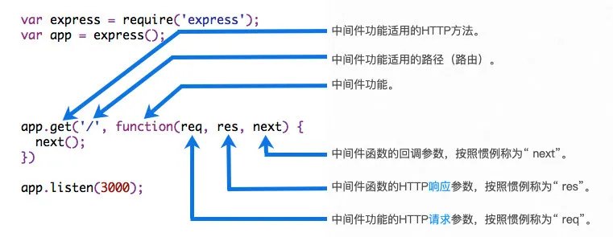

### 2.2. 应用中间件

那么，如何将一个中间件应用到我们的应用程序中呢？

- express主要提供了两种方式：`app/router.use`和`app/router.methods`；
- 可以是 app，也可以是router，router我们后续再学习:
- methods指的是常用的请求方式，比如：`app.get或app.post`等；

我们先来学习use的用法，因为methods的方式本质是use的特殊情况；

**案例一：最普通的中间件**

之所以称之为最普通的中间件，是因为无论是什么path、methods都会应用该中间件；

```javascript
const express = require('express');

const app = express();

app.use((req, res, next) => {
  console.log("common middleware 01");
  next();
})

app.use((req, res, next) => {
  console.log("common middleware 02");
  res.end("Hello Common Middleware~");
})

app.listen(8000, () => {
  console.log("中间件服务器启动成功~");
})
```

中间件的执行顺序：

- 在匹配上的情况下，中间件按照注册的顺序执行；

**案例二：path匹配中间件**

如果我们希望匹配一个明确的路径，也可以使用use方法：

```javascript
// 案例二: 路径匹配中间件
app.use('/home', (req, res, next) => {
  console.log("home middleware 01");
  next();
});

app.use('/home', (req, res, next) => {
  console.log("home middleware 02");
  next();
  res.end("Hello Home middleware");
});

app.use((req, res, next) => {
  console.log("common middleware");
});
```

**案例三：path和method匹配中间件**

```javascript
// 案例三: method匹配中间件
app.get('/home', (req, res, next) => {
  console.log("home get middleware");
  next();
})

app.post('/login', (req, res, next) => {
  console.log("login post middleware");
  next();
});

app.use((req, res, next) => {
  console.log("common middleware");
});
```

**案例四：注册多个中间件**

```javascript
// 案例四: 注册多个中间件
const homeMiddleware1 = (req, res, next) => {
  console.log('home middleware 01');
  next();
}

const homeMiddleware2 = (req, res, next) => {
  console.log('home middleware 02');
  next();
}

const homeHandle = (req, res, next) => {
  res.end("Hello Home~");
}

app.get('/home', homeMiddleware1, homeMiddleware2, homeHandle);
```

### 2.3. 应用其他中间件

并非所有的中间件都需要我们从零去编写：

- express有内置一些帮助我们完成对request解析的中间件；
- registry仓库中也有很多可以辅助我们开发的中间件；

#### 2.3.1. request解析中间件

在客户端发送post请求时，会将数据放到body中：

- 客户端可以通过json的方式传递；
- 也可以通过form表单的方式传递；

我们这里先使用json传递给服务器body：

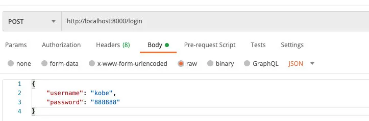

不进行解析时的操作：

```javascript
app.post('/login', (req, res, next) => {
  req.on('data', (data) => {
    console.log(data.toString());
  })
  req.on('end', () => {
    res.end("登录成功~");
  });
});
```

我们也可以自己编写中间件来解析JSON：

```javascript
app.use((req, res, next) => {
  if (req.headers['content-type'] === 'application/json') {
    req.on('data', (data) => {
      const userInfo = JSON.parse(data.toString());
      req.body = userInfo;
    })
    req.on('end', () => {
      next();
    })
  } else {
    next();
  }
})

app.post('/login', (req, res, next) => {
  console.log(req.body);
  res.end("登录成功~");
});
```

但是，事实上我们可以使用expres内置的中间件或者使用`body-parser`来完成：

```javascript
app.use(express.json());

app.post('/login', (req, res, next) => {
  console.log(req.body);
  res.end("登录成功~");
});
```

如果我们解析的是 `application/x-www-form-urlencoded`：

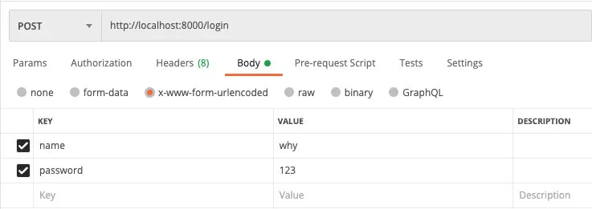

我们可以使用express自带的 `urlencoded`函数来作为中间件：

- 传入的extended用于表示使用哪一种解析方式：

- - true：使用qs第三方模块；
  - false：使用querystring内置模块；
  - 备注：它们之间的区别这里不展开讲解；

```javascript
app.use(express.json());
app.use(express.urlencoded({extended: true}));

app.post('/login', (req, res, next) => {
  console.log(req.body);
  res.end("登录成功~");
});
```

#### 2.3.2. 日志记录中间件

如果我们希望将请求日志记录下来，那么可以使用express官网开发的第三方库：morgan

安装morgan：

```javascript
npm install morgan
```

直接作为中间件使用即可：

```javascript
const loggerWriter = fs.createWriteStream('./log/access.log', {
  flags: 'a+'
})
app.use(morgan('combined', {stream: loggerWriter}));
```

#### 2.3.3. 上传文件中间件

图片上传我们可以使用express官方开发的第三方库：multer

```javascript
npm install multer
```

上传文件，并且默认文件名：

```javascript
const upload = multer({
  dest: "uploads/"
})

app.post('/upload', upload.single('file'), (req, res, next) => {
  console.log(req.file.buffer);
  res.end("文件上传成功~");
})
```

添加文件名后缀：

```javascript
const storage = multer.diskStorage({
  destination: (req, file, cb) => {
    cb(null, "uploads/")
  },
  filename: (req, file, cb) => {
    cb(null, Date.now() + path.extname(file.originalname));
  }
})

const upload = multer({
  storage
})

app.post('/upload', upload.single('file'), (req, res, next) => {
  console.log(req.file.buffer);
  res.end("文件上传成功~");
})
```

我们也可以上传多张图片：

```javascript
app.use('/upload', upload.array('files'), (req, res, next) => {
  console.log(req.files);
});
```

如果我们希望借助于multer帮助我们解析一些form-data中的普通数据，那么我们可以使用any：

- 请求如下：

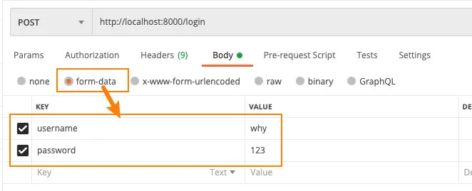

```javascript
app.use(upload.any());

app.use('/login', (req, res, next) => {
  console.log(req.body);
});
```

### 2.4. 请求和响应

客户端传递到服务器参数的方法常见的是5种：

- 方式一：通过get请求中的URL的params；
- 方式二：通过get请求中的URL的query；
- 方式三：通过post请求中的body的json格式（中间件中已经使用过）；
- 方式四：通过post请求中的body的x-www-form-urlencoded格式（中间件使用过）；
- 方式五：通过post请求中的form-data格式（中间件中使用过）；

#### 2.4.1. 请求解析

**方式一：params**

请求地址：http://localhost:8000/login/abc/why

获取参数：

```javascript
app.use('/login/:id/:name', (req, res, next) => {
  console.log(req.params);
  res.json("请求成功~");
})
```

**方式二：query**

请求地址：http://localhost:8000/login?username=why&password=123

获取参数：

```javascript
app.use('/login', (req, res, next) => {
  console.log(req.query);

  res.json("请求成功~");
})
```

#### 2.4.2. 响应方式

**end方法**

类似于http中的`response.end`方法，用法是一致的

```javascript
res.end("Hello World");
```

**json方法**

json方法中可以传入很多的类型：object、array、string、boolean、number、null等，它们会被转换成json格式返回；

```javascript
res.json({name: "why", age: 18});
```

**status方法**

用于设置状态码：

```javascript
res.status(204);
```

## 三. 其他支持补充

### 3.1. 路由的使用

如果我们将所有的代码逻辑都写在app中，那么app会变得越来越复杂：

- 一方面完整的Web服务器包含非常多的处理逻辑；

- 另一方面有些处理逻辑其实是一个整体，我们应该将它们放在一起：比如对users相关的处理

- - 获取用户列表；
  - 获取某一个用户信息；
  - 创建一个新的用户；
  - 删除一个用户；
  - 更新一个用户；

我们可以使用 `express.Router`来创建一个路由处理程序：

- 一个Router实例拥有完整的中间件和路由系统；
- 因此，它也被称为 `迷你应用程序`（mini-app）；

```javascript
// 用户相关的处理
const userRouter = express.Router();

userRouter.get('/', (req, res, next) => {
  res.end("用户列表");
});

userRouter.post('/', (req, res, next) => {
  res.end("创建用户");
});

userRouter.delete('/', (req, res, next) => {
  res.end("删除用户");
});

app.use('/users', userRouter);
```

当然，我们可以配置更多的路由，并且将所有的逻辑放到一个单独的文件中。

### 3.2. 静态资源服务器

部署静态资源我们可以选择很多方式：

- Node也可以作为静态资源服务器，并且express给我们提供了方便部署静态资源的方法；

```javascript
const express = require('express');

const app = express();

app.use(express.static('./build'));

app.listen(8000, () => {
  console.log("静态服务器启动成功~");
})
```

### 3.3. 错误处理方式

```javascript
app.use((req, res, next) => {
  next(new Error("USER DOES NOT EXISTS"));
});

app.use((err, req, res, next) => {
  const message = err.message;

  switch (message) {
    case "USER DOES NOT EXISTS":
      res.status(400).json({message})
  }

  res.status(500)
})
```

### 3.4. 源码分析

#### 3.4.1. 创建app的过程

`express`函数的本质其实是`createApplication`：

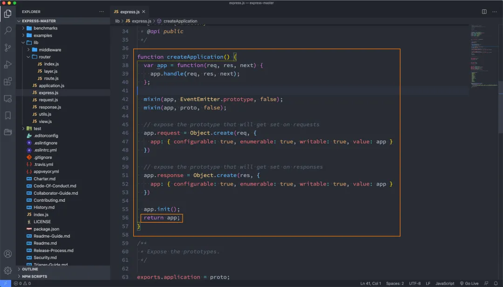

当我们调用app.listen的时候，本质上是调用proto中的listen

- 因为上面有进行 mixin 的操作；

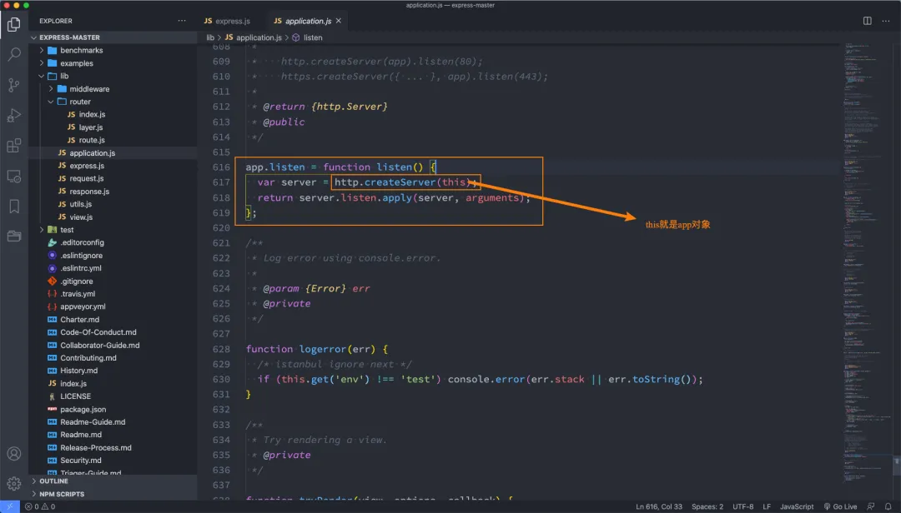

#### 3.4.2. 注册中间件

比如我们通过use来注册一个中间件，源码中发生了什么？

- 我们会发现无论是app.use还是app.methods都会注册一个主路由；
- 我们会发现app本质上会将所有的函数，交给这个主路由去处理的；

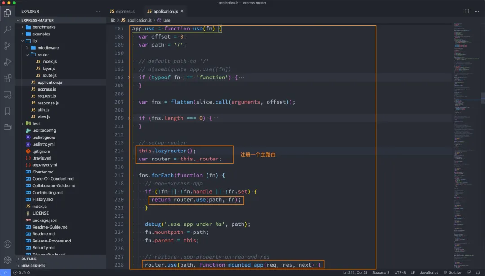

我们来看一下router.use中又做了什么事情？

- 本质上一个函数会创建一个layer，并且会被放入到stack中；

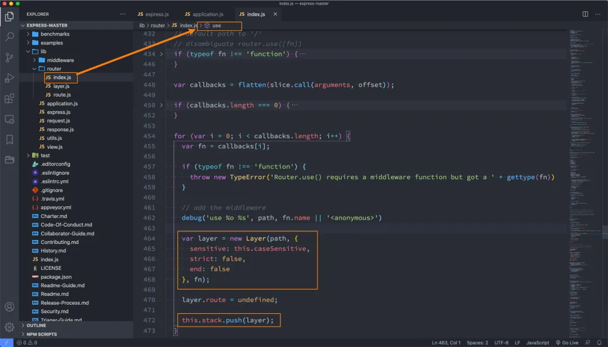

#### 3.4.3. 请求的处理过程

如果有一个请求过来，那么从哪里开始呢？

- app函数被调用开始的；

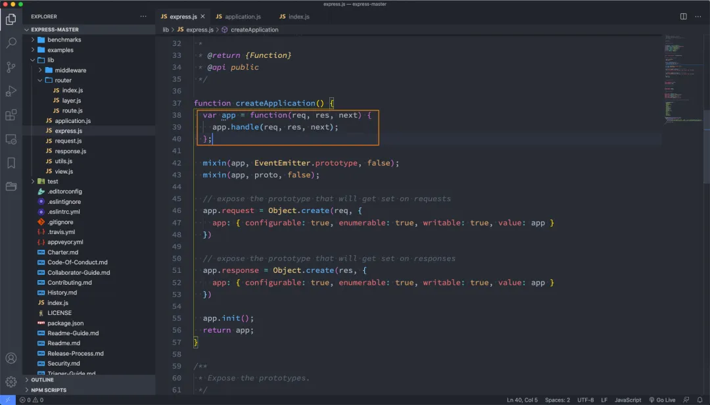

app.handle本质上会去调用router.handle：

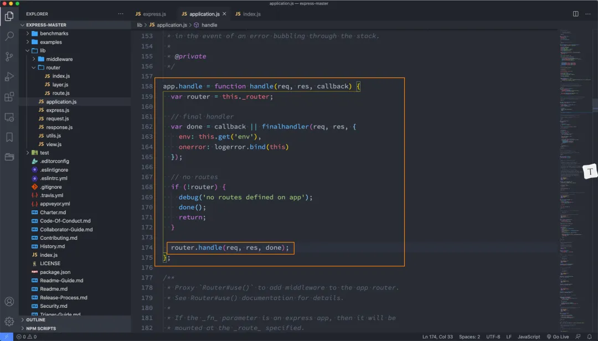

router.handle中做的什么事情呢？

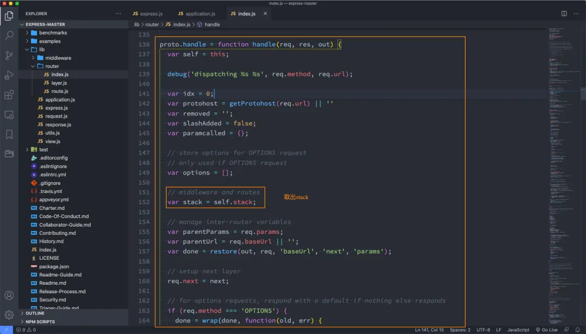

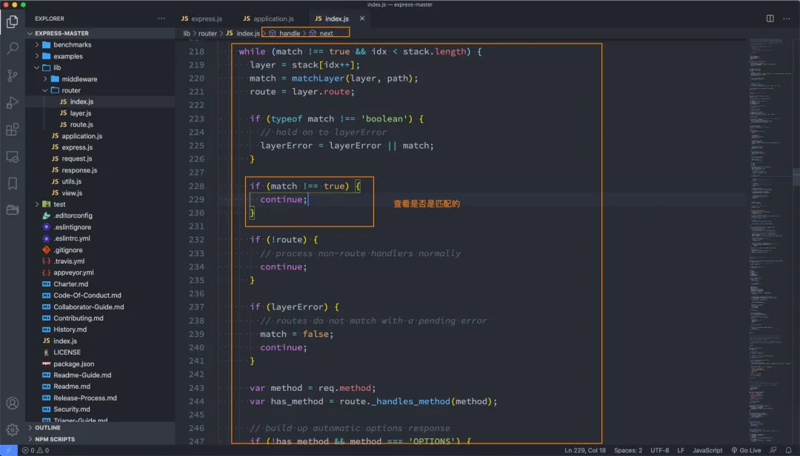