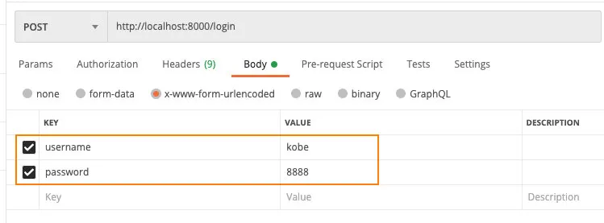
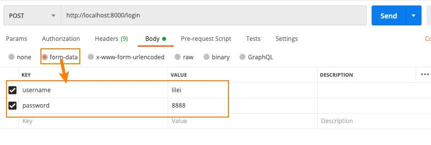
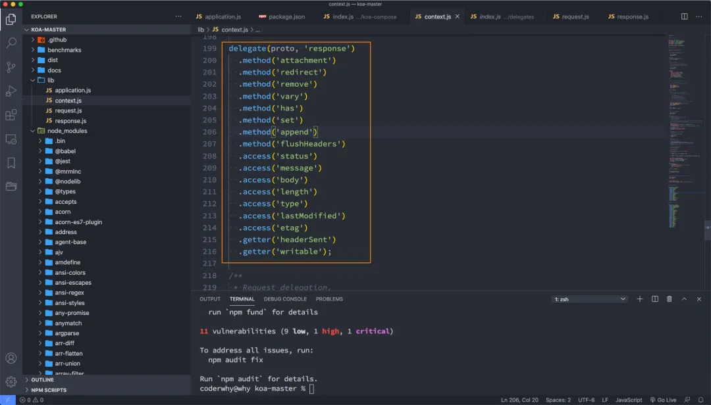
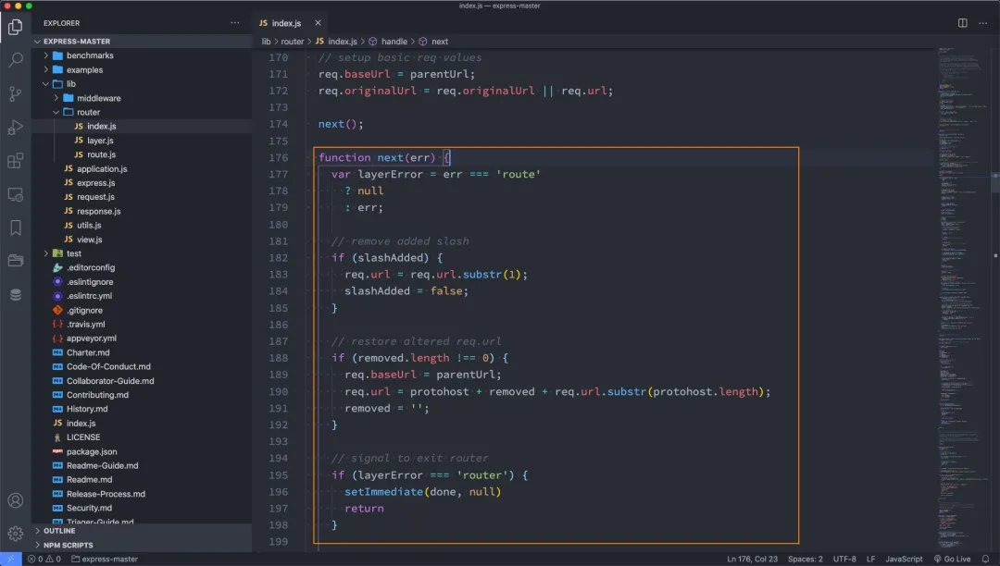

## 一. Koa初体验

### 1.1. 认识Koa

前面我们已经学习了express，另外一个非常流行的Node Web服务器框架就是Koa。

Koa官方的介绍：

- koa：next generation web framework for node.js；
- koa：node.js的下一代web框架；

事实上，koa是express同一个团队开发的一个新的Web框架：

- 目前团队的核心开发者TJ的主要精力也在维护Koa，express已经交给团队维护了；
- Koa旨在为Web应用程序和API提供更小、更丰富和更强大的能力；
- 相对于express具有更强的异步处理能力（后续我们再对比）；
- Koa的核心代码只有1600+行，是一个更加轻量级的框架，我们可以根据需要安装和使用中间件；

### 1.2. koa初体验

因为学习过了express，它们的基本开发模式是比较相似的。

我们来体验一下koa的Web服务器：

```javascript
const Koa = require('koa');

const app = new Koa();

app.use((ctx, next) => {
  console.log("middleware 01");
  next();
})

app.use((ctx, next) => {
  console.log("middleware 02");
  ctx.response.body = "Hello World";
})


app.listen(8000, () => {
  console.log("服务器启动成功~");
});
```

koa注册的中间件提供了两个参数：

- ctx：上下文（Context）对象；

- - koa并没有像express一样，将req和res分开，而是将它们作为ctx的属性；
  - ctx代表依次请求的上下文对象；
  - `ctx.request`：获取请求对象；
  - `ctx.response`：获取响应对象；

- next：本质上是一个dispatch，类似于之前的next；

- - 后续我们学习Koa的源码，来看一下它是一个怎么样的函数；

koa通过创建的app对象，注册中间件只能通过use方法：

- Koa并没有提供methods的方式来注册中间件；
- 也没有提供path中间件来匹配路径；

但是真实开发中我们如何将路径和method分离呢？

- 方式一：根据request自己来判断；
- 方式二：使用第三方路由中间件；

方式一：根据request自己判断

```javascript
app.use((ctx, next) => {
  if (ctx.request.path === '/users') {
    if (ctx.request.method === 'POST') {
      ctx.response.body = "Create User Success~";
    } else {
      ctx.response.body = "Users List~";
    }
  } else {
    ctx.response.body = "Other Request Response";
  }
})
```

整个代码的逻辑是非常复杂和混乱的，真实开发中我们会使用路由。

### 1.3. 路由的使用

koa官方并没有给我们提供路由的库，我们可以选择第三方库：koa-router

#### 1.3.1. 安装koa-router

因为是第三方的库，所以我们需要单独下项目中安装：

```javascript
npm install koa-router
```

#### 1.3.2. koa-router基本使用

我们可以先封装一个 `user.router.js` 的文件：

```javascript
const Router = require('koa-router');

const userRouter = new Router();

userRouter.get('/users', (ctx, next) => {
  ctx.response.body = "user list~";
});

userRouter.post('/users', (ctx, next) => {
  ctx.response.body = "create user info~";
});

module.exports = userRouter;
```

在app中将`router.routes()`注册为中间件：

```javascript
app.use(userRouter.routes());
app.use(userRouter.allowedMethods());
```

注意：`allowedMethods`用于判断`某一个method`是否支持：

- 如果我们请求 get，那么是正常的请求，因为我们有实现get；
- 如果我们请求 put、delete、patch，那么就自动报错：`Method Not Allowed`，状态码：405；
- 如果我们请求 link、copy、lock，那么就自动报错：`Not Implemented`，状态码：501；

#### 1.3.3. router的前缀

通常一个路由对象是对一组相似路径的封装，那么路径的前缀都是一直的，所以我们可以直接在创建Router时，添加前缀：

```javascript
const userRouter = new Router({prefix: '/users'});

userRouter.get('/', (ctx, next) => {
  ctx.response.body = "user list~";
});

userRouter.post('/', (ctx, next) => {
  ctx.response.body = "create user info~";
});

module.exports = userRouter;
```

### 1.4. 请求解析

客户端传递到服务器参数的方法常见的是5种：

- 方式一：通过get请求中的URL的params；
- 方式二：通过get请求中的URL的query；
- 方式三：通过post请求中的body的json格式；
- 方式四：通过post请求中的body的x-www-form-urlencoded格式；
- 方式五：通过post请求中的form-data格式；

#### 1.4.1. 方式一：params

请求地址：http://localhost:8000/users/123

获取params：

```javascript
const userRouter = new Router({prefix: "/users"})

userRouter.get("/:id", (ctx, next) => {
  console.log(ctx.params.id);
  ctx.body = "Hello World";
})
```

#### 1.4.2. 方式二：query

请求地址：http://localhost:8000/login?username=why&password=123

获取query：

```javascript
app.use((ctx, next) => {
  console.log(ctx.request.query);
  ctx.body = "Hello World";
})
```

#### 1.4.3. 方式三：json

请求地址：http://localhost:8000/login

body是json格式：

```javascript
{
    "username": "coderwhy",
    "password": "123"
}
```

获取json数据：

- 安装依赖：`npm install koa-bodyparser`;
- 使用 `koa-bodyparser`的中间件；

```javascript
app.use(bodyParser());

app.use((ctx, next) => {
  console.log(ctx.request.body);
  ctx.body = "Hello World";
})
```

#### 1.4.4. 方式四：x-www-form-urlencoded

请求地址：http://localhost:8000/login

body是x-www-form-urlencoded格式：



获取json数据：(和json是一致的)

- 安装依赖：`npm install koa-bodyparser`;
- 使用 `koa-bodyparser`的中间件；

```javascript
app.use(bodyParser());

app.use((ctx, next) => {
  console.log(ctx.request.body);
  ctx.body = "Hello World";
})
```

#### 1.4.5. 方式五：form-data

请求地址：http://localhost:8000/login

body是form-data格式：



解析body中的数据，我们需要使用multer

- 安装依赖：`npm install koa-multer`;
- 使用 `multer`中间件；

```javascript
const upload = multer({
});

app.use(upload.any());

app.use((ctx, next) => {
  console.log(ctx.req.body);
  ctx.body = "Hello World";
});
```

我们知道multer还可以实现文件的上传：

```javascript
const storage = multer.diskStorage({
  destination: (req, file, cb) => {
    cb(null, "./uploads/")
  },
  filename: (req, file, cb) => {
    cb(null, Date.now() + path.extname(file.originalname))
  }
})

const upload = multer({
  storage
});

const fileRouter = new Router();

fileRouter.post("/upload", upload.single('avatar'), (ctx, next) => {
  console.log(ctx.req.file);
})

app.use(fileRouter.routes());
```

### 1.5. 响应方式

**输出结果：body**

将响应主体设置为以下之一：

- `string` ：字符串数据
- `Buffer` ：Buffer数据
- `Stream` ：流数据
- `Object`|| `Array`：对象或者数组
- `null` ：不输出任何内容

如果`response.status`尚未设置，Koa会自动将状态设置为`200`或`204`。

比较常见的输出方式：

```javascript
ctx.response.body = "Hello World";
ctx.body = {
  name: "why",
  age: 18,
  height: 1.88
};
ctx.body = ["abc", "cba", "nba"];
```

疑惑：`ctx.response.body`和`ctx.body`之间的区别：

- 事实上，我们访问ctx.body时，本质上是访问ctx.response.body；
- 我们可以看到源码中，我们访问 proto（这里就是ctx），其实是访问proto中的response的属性；



**请求状态：status**

请求状态我们可以直接给ctx设置，或者给ctx.response设置也是一样的效果：

```javascript
ctx.status = 201;
ctx.response.status = 204;
```

### 1.6. 错误处理

```javascript
const Koa = require('koa');

const app = new Koa();

app.use((ctx, next) => {
  ctx.app.emit('error', new Error("哈哈哈"), ctx);
})

app.on('error', (err, ctx) => {
  console.log(err.message);
  ctx.response.body = "哈哈哈";
})

app.listen(8000, () => {
  console.log("错误处理服务启动成功~");
})
```

### 1.7. 静态服务器

koa并没有内置部署相关的功能，所以我们需要使用第三方库：

```javascript
npm install koa-static
```

部署的过程类似于express：

```javascript
const Koa = require('koa');
const static = require('koa-static');

const app = new Koa();

app.use(static('./build'));

app.listen(8000, () => {
  console.log("静态服务器启动成功~");
});
```

### 1.8. 源码解析

视频里面有讲解，这里不再截图

## 二. 和express对比

在学习了两个框架之后，我们应该已经可以发现koa和express的区别：

从架构设计上来说：

- express是完整和强大的，其中帮助我们内置了非常多好用的功能；

- koa是简洁和自由的，它只包含最新的功能，并不会对我们使用其他中间件进行任何的限制。

- - 甚至是在app中连最基本的get、post都没有给我们提供；
  - 我们需要通过自己或者路由来判断请求方式或者其他功能；

因为express和koa框架他们的核心其实都是中间件：

- 但是他们的中间件事实上，它们的中间件的执行机制是不同的，特别是针对某个中间件中包含异步操作时；
- 所以，接下来，我们再来研究一下express和koa中间件的执行顺序问题；

我通过一个需求来演示所有的过程：

- 假如有三个中间件会在一次请求中匹配到，并且按照顺序执行；

- 我希望最终实现的方案是：

- - 注意：是middleware1中；
  - 在middleware1中，在req.message中添加一个字符串 `aaa`；
  - 在middleware2中，在req.message中添加一个 字符串`bbb`；
  - 在middleware3中，在req.message中添加一个 字符串`ccc`；
  - 当所有内容添加结束后，在middleware1中，通过res返回最终的结果；

### 2.1. 同步执行顺序

假如我们获取的所有数据，是可以同步获取的；

**我们先通过express实现这个过程：**

```javascript
const express = require('express');

const app = express();


const middleware1 = (req, res, next) => {
  req.message = "aaa";
  next();
  res.end(req.message);
}

const middleware2 = (req, res, next) => {
  req.message = req.message + 'bbb';
  next();
}

const middleware3 = (req, res, next) => {
  req.message = req.message + 'ccc';
}

app.use(middleware1, middleware2, middleware3);

app.listen(8000, () => {
  console.log("启动成功~");
})
```

最终的结果是：`aaabbbccc`，没问题；

**我们再通过koa实现这个过程：**

```javascript
const Koa = require('koa');

const app = new Koa();

const middleware1 = (ctx, next) => {
  ctx.message = "aaa";
  next();
  console.log("aaaa");
  ctx.body = ctx.message;
}

const middleware2 = (ctx, next) => {
  ctx.message = ctx.message + 'bbb';
  console.log("bbbb");
  next();
}

const middleware3 = (ctx, next) => {
  ctx.message = ctx.message + 'ccc';
}

app.use(middleware1);
app.use(middleware2);
app.use(middleware3);

app.listen(8000, () => {
  console.log("启动成功~");
})
```

最终的结果也是：`aaabbbccc`，也没问题；

### 2.2. 异步执行顺序

但是，如果我们最后的ccc中的结果，是需要异步操作才能获取到的，是否会产生问题呢？

#### 2.2.1. express中遇到异步操作

**express有异步操作（没有在next前，加async、await）：**

```javascript
const middleware1 = (req, res, next) => {
  req.message = "aaa";
  next();
  res.end(req.message);
}

const middleware2 = (req, res, next) => {
  req.message = req.message + 'bbb';
  next();
}

const middleware3 = async (req, res, next) => {
  const result = await axios.get('http://123.207.32.32:9001/lyric?id=167876');
  req.message = req.message + result.data.lrc.lyric;
  console.log(req.message);
}
```

最终的结果`aaabbb`，是不正确。

**express有异步操作（有在next前，加async、await）：**

```javascript
const middleware1 = async (req, res, next) => {
  req.message = "aaa";
  await next();
  res.end(req.message);
}

const middleware2 = async (req, res, next) => {
  req.message = req.message + 'bbb';
  await next();
}

const middleware3 = async (req, res, next) => {
  const result = await axios.get('http://123.207.32.32:9001/lyric?id=167876');
  req.message = req.message + result.data.lrc.lyric;
  console.log(req.message);
}
```

最终的结果也是`aaabbb`，也是不正确。

为什么呢？

- 原因是本质上的next()和异步没有任何关系；
- 它本身就是一个同步函数的调用，所以它不会等到你异步有结果之后，再继续执行后续的操作；



#### 2.2.2. koa中遇到异步操作

**koa有异步操作（没有在next前，加async、await）：**

```javascript
const middleware1 = async (ctx, next) => {
  ctx.message = "aaa";
  next();
  ctx.body = ctx.message;
}

const middleware2 = async (ctx, next) => {
  ctx.message = ctx.message + 'bbb';
  next();
}

const middleware3 = async (ctx, next) => {
  const result = await axios.get('http://123.207.32.32:9001/lyric?id=167876');
  ctx.message = ctx.message + result.data.lrc.lyric;
}
```

最终的结果也是`aaabbb`，也是不正确。

- 这是因为虽然next函数是一个返回promise的异步操作，但是在前面不加await的情况，是不同等待结果的返回，就会继续向后执行了；

**koa有异步操作（有在next前，加async、await）：**

```javascript
const middleware1 = async (ctx, next) => {
  ctx.message = "aaa";
  await next();
  ctx.body = ctx.message;
}

const middleware2 = async (ctx, next) => {
  ctx.message = ctx.message + 'bbb';
  await next();
}

const middleware3 = async (ctx, next) => {
  const result = await axios.get('http://123.207.32.32:9001/lyric?id=167876');
  ctx.message = ctx.message + result.data.lrc.lyric;
}
```

最终的结果是`aaabbb+歌词信息`，是正确。

- 这是因为，当我们在koa中的next前面加await时，它会等到后续有一个确定结果时，在执行后续的代码；