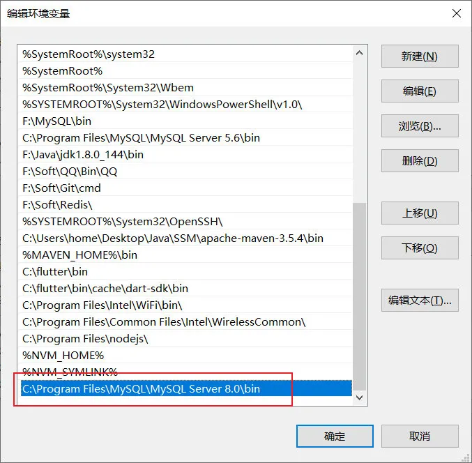
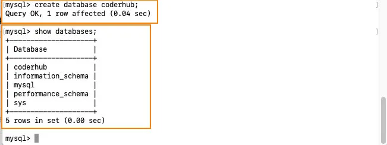
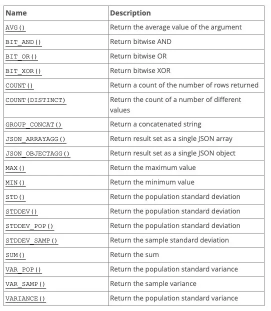
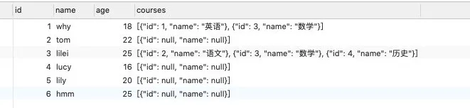

## 一. 认识数据库

### 1.1. 为什么要使用数据库

任何的软件系统都需要存放大量的数据，这些数据通常是非常复杂和庞大的：

- 比如用户信息包括姓名、年龄、性别、地址、身份证号、出生日期等等；
- 比如商品信息包括商品的名称、描述、价格（原价）、分类标签、商品图片等等；
- 比如歌曲信息包括歌曲的名称、歌手、专辑、歌曲时长、歌词信息、封面图片等等；

那么这些信息不能直接存储到文件中吗？可以，但是文件系统有很多的缺点：

- 很难以合适的方式组织数据（多张表之前的关系合理组织）；
- 并且对数据进行增删改查中的复杂操作（虽然一些简单确实可以），并且保证单操作的原子性；
- 很难进行数据共享，比如一个数据库需要为多个程序服务，如何进行很好的数据共享；
- 需要考虑如何进行数据的高效备份、迁移、恢复；
- 等等...

数据库通俗来讲就是一个存储数据的仓库，数据库本质上就是一个软件、一个程序。

### 1.2. 常见的数据库有哪些？

通常我们将数据划分成两类：

- 关系型数据库：MySQL、Oracle、DB2、SQL Server、Postgre SQL 等；

- - 关系型数据库通常我们会创建很多个二维数据表；
  - 数据表之间相互关联起来，形成一对一、一对多、多对对等关系；
  - 之后可以利用 SQL 语句在多张表中查询我们所需的数据；
  - 支持事物，对数据的访问更加的安全；

- 非关系型数据库：MongoDB、Redis、Memcached、HBse 等；

- - 非关系型数据库的英文其实是 Not only SQL，也简称为 NoSQL；
  - 相当而已非关系型数据库比较简单一些，存储数据也会更加自由（甚至我们可以直接将一个复杂的 json 对象直接塞入到数据库中）；
  - NoSQL 是基于 Key-Value 的对应关系，并且查询的过程中不需要经过 SQL 解析，所以性能更高；
  - NoSQL 通常不支持事物，需要在自己的程序中来保证一些原子性的操作；

如何在开发中选择他们呢？具体的选择会根据不同的项目进行综合的分析，我这里给一点点建议：

- 目前在公司进行后端开发（Node、Java、Go 等），还是以关系型数据库为主；
- 比较常用的用到非关系型数据库的，在爬取大量的数据进行存储时，会比较常见；

我们的课程是开发自己的后端项目，所以我们以关系型数据库 MySQL 作为主要内容。

MySQL 的介绍：

- MySQL 原本是一个开源的数据库，原开发者为瑞典的 MySQL AB 公司；
- 在 2008 年被 Sun 公司收购；在 2009 年，Sun 被 Oracle 收购；
- 所以目前 MySQL 归属于 Oracle；

MySQL 是一个关系型数据库，其实本质上就是一款软件、一个程序：

- 这个程序中管理着多个数据库；
- 每个数据库中可以有多张表；
- 每个表中可以有多条数据；


### 1.3. MySQL 的下载和安装

**第一步：下载 MySQL 软件**

下载地址：https://dev.mysql.com/downloads/mysql/

- 根据自己的操作系统下载即可；

- 推荐大家直接下载安装版本，在安装过程中会配置一些环境变量；

- - Windows 推荐下载 MSI 的版本；
  - Mac 推荐下载 DMG 的版本；

- 这里我安装的是 MySQL 最新的版本：8.0.22（不再使用旧的 MySQL5.x 的版本）

Windows：

- 下载下面的，不需要联网安装；


Mac：


**第二步：安装的过程**

安装的过程，基本没有太复杂的操作。

有一个需要着重说明的是 MySQL8，可以采用一种更新的、安全性更高的密码和加密方式：

- 最新的加密方式有可能会被一些比较老的软件驱动不支持；
- 所以要根据情况来选择，但是我这里选择最新的加密方式了；

Windows 的安装过程：


**第三步：启动 mysql**

在 Windows 启动 MySQL：


在 Mac 中启动 MySQL 是在系统偏好设置中：


### 1.4. mysql 的连接和操作

打开终端，查看 MySQL 的安装：

- 这里会显示找不到命令；

```sql
mysql --version
```

在 Windows 上配置环境变量：



在 Mac 上配置环境变量：

手动执行下面的终端命令，将 MySQL 配置到环境变量中：

```sql
# 添加环境变量
export PATH=$PATH:/usr/local/mysql/bin
# 再次执行mysql版本
mysql --version
```

#### 1.4.1. 终端连接数据库

我们如果想要操作数据，需要先和数据建立一个连接，最直接的方式就是通过终端来连接；

有两种方式来连接：

- 两种方式的区别在于输入密码是直接输入，还是另起一行以密文的形式输入；

```javascript
# 方式一：
mysql -uroot -pCoderwhy888.
# 方式二：
mysql -uroot -p
Enter password: your password
```

输入成功后，会进入到 mysql 的 REPL（交互式的编程环境）：


我们可以直接在 REPL 中对数据库进行操作。

#### 1.4.2. 终端操作数据库

我们说过，一个数据库软件中，可以包含很多个数据库：

- infomation_schema：信息数据库，其中包括 MySQL 在维护的其他数据库、表、列、访问权限等信息；
- performance_schema：性能数据库，记录着 MySQL Server 数据库引擎在运行过程中的一些资源消耗相关的信息；
- mysql：用于存储数据库管理者的用户信息、权限信息以及一些日志信息等；
- sys：相当于是一个简易版的 performance_schema，将数据汇总成更容易理解的形式；

注意：这里我只是在终端简单演练数据库，并没有详细讲解每一个命令，也没有完全按照 SQL 格式规范；

- 这些在后面会详细讲解的；

查看所有的数据库：

```sql
show databases;
```


在终端直接创建一个属于自己的新的数据库 coderhub（一般情况下一个新的项目会对应一个新的数据库）。

```sql
create database coderhub;
```



使用我们创建的数据库 coderhub：

```javascript
use coderhub;
```

在数据库中创建自己的表：

```javascript
create table user(
	name varchar(20),
	age int,
	height double
);
```


在 user 表中插入自己的数据：

```javascript
insert into user (name, age, height) values ('why', 18, 1.88);
insert into user (name, age, height) values ('kobe', 40, 1.98);
```


查看 user 表中所有的数据：

```javascript
select * from user;
```


### 1.5. GUI 工具操作数据库

我们会发现在终端操作数据库有很多不方便的地方：

- 语句写出来没有高亮，并且不会有任何的提示；
- 复杂的语句分成多行，格式看起来并不美观，很冗余出现错误；
- 终端中查看所有的数据库或者表非常的不直观和不方便；
- 等等...

所以在开发中，我们可以借助于一些 GUI 工具来帮助我们连接上数据库，之后直接在 GUI 工具中操作就会非常方便。

常见的 MySQL 的 GUI 工具有很多，这里推荐几款：

- Navicat：个人最喜欢的一款工作，但是是收费的（有免费的试用时间，或者各显神通）；
- SQLYog：一款免费的 SQL 工具；
- TablePlus：常用功能都可以使用，但是会多一些限制（比如只能开两个标签页）；

这里我选择使用 Navicat。


查看所有的数据库、表、表中的数据：


编写 SQL 语句，并且执行；


## 二. SQL 语句

### 2.1. 认识 SQL 语句

我们希望操作数据库（特别是在程序中），就需要有和数据库沟通的语言，这个语言就是 SQL：

- SQL 是 Structured Query Language，称之为结构化查询语言，简称 SQL；
- 使用 SQL 编写出来的语句，就称之为 SQL 语句；
- SQL 语句可以用于对数据库进行操作；

事实上，常见的关系型数据库 SQL 语句都是比较相似的，所以你学会了 MySQL 中的 SQL 语句，之后去操作比如 Oracle 或者其他关系型数据库，也是非常方便的。

SQL 语句的常用规范：

- 通常关键字是大写的，比如 CREATE、TABLE、SHOW 等等；
- 一条语句结束后，需要以 `;` 结尾；
- 如果遇到关键字作为表明或者字段名称，可以使用``包裹;

常见的 SQL 语句我们可以分成四类：

- DDL（Data Definition Language）：数据定义语言；

- - 可以通过 DDL 语句对数据库或者表进行：创建、删除、修改等操作；

- DML（Data Manipulation Language）：数据操作语言；

- - 可以通过 DML 语句对表进行：添加、删除、修改等操作；

- DQL（Data Query Language）：数据查询语言；

- - 可以通过 DQL 从数据库中查询记录；（重点）

- DCL（Data Control Language）：数据控制语言；

- - 对数据库、表格的权限进行相关访问控制操作；

接下来我们对他们进行一个个的学习和掌握。

### 2.2. DDL 语句

#### 2.2.1. 数据库的操作

**查看当前的数据库：**

```sql
# 查看所有的数据SHOW DATABASES;
# 使用某一个数据USE coderhub;
# 查看当前正在使用的数据库SELECT DATABASE();
```

**创建新的数据：**

```sql
# 创建数据库语句CREATE DATABASE bilibili;
CREATE DATABASE IF NOT EXISTS bilibili;
CREATE DATABASE IF NOT EXISTS bilibili DEFAULT CHARACTER SET utf8mb4 COLLATE utf8mb4_0900_ai_ci;
```

创建数据库时，可以设置字符串和字符排序（我们可以直接使用默认的）：

- 字符集：utf8mb4 在我们需要插入 emoji 表情时要用到；
- 排序规则：ai 表示不区分重音；ci 表示不区分大小写；


**删除数据库：**

```sql
# 删除数据库DROP DATABASE bilibili;
DROP DATABASE IF EXIT bilibili;
```

**修改数据库：**

```
# 修改数据库的字符集和排序规则ALTER DATABASE bilibili CHARACTER SET = utf8 COLLATE = utf8_unicode_ci;
```

#### 2.2.2. 数据表的操作

**查看数据表**

```sql
# 查看所有的数据表SHOW TABLES;
# 查看某一个表结构DESC user;
```

**创建数据表**

```sql
CREATE TABLE IF NOT EXISTS `users`(	name VARCHAR(20),	age INT,	height DOUBLE);
```

### 2.3. 创建表细节

#### 2.3.1. SQL 数据类型

我们知道不同的数据会划分为不同的数据类型，在数据库中也是一样：

- MySQL 支持的数据类型有：数字类型，日期和时间类型，字符串（字符和字节）类型，空间类型和 JSON 数据类型。

**数字类型**

MySQL 的数字类型有很多：

- 整数数字类型：INTEGER，INT，SMALLINT，TINYINT，MEDIUMINT，BIGINT；


- 精确数字类型：DECIMAL，NUMERIC（DECIMAL 是 NUMERIC 的实现形式）；

```sql
salary DECIMAL(5,2)
```

- 浮点数字类型：FLOAT，DOUBLE

- - FLOAT 是 4 个字节，DOUBLE 是 8 个字节；

**日期类型**

MySQL 的日期类型也很多：

- `YEAR`以*`YYYY`*格式显示值

- - 范围 `1901`到`2155`，和 `0000`。

- `DATE`类型用于具有日期部分但没有时间部分的值：

- - `DATE`以格式*`YYYY-MM-DD`*显示值 ；
  - 支持的范围是 `'1000-01-01'` 到 `'9999-12-31'`；

- `DATETIME`类型用于包含日期和时间部分的值：

- - `DATETIME`以格式'_YYYY-MM-DD hh:mm:ss_'显示值；
  - 支持的范围是`1000-01-01 00:00:00`到`9999-12-31 23:59:59`;

- `TIMESTAMP`数据类型被用于同时包含日期和时间部分的值：

- - `TIMESTAMP`以格式'_YYYY-MM-DD hh:mm:ss_'显示值；
  - 但是它的范围是 UTC 的时间范围：`'1970-01-01 00:00:01'`到`'2038-01-19 03:14:07'`;

- 另外：`DATETIME`或`TIMESTAMP` 值可以包括在高达微秒（6 位）精度的后小数秒一部分

- - 比如 DATETIME 表示的范围可以是`'1000-01-01 00:00:00.000000'`到`'9999-12-31 23:59:59.999999'`;

**字符串类型**

MySQL 的字符串类型表示方式如下：

- `CHAR`类型在创建表时为固定长度，长度可以是 0 到 255 之间的任何值；

- - 在被查询时，会删除后面的空格；

- `VARCHAR`类型的值是可变长度的字符串，长度可以指定为 0 到 65535 之间的值；

- - 在被查询时，不会删除后面的空格；

- `BINARY`和`VARBINARY` 类型用于存储二进制字符串，存储的是字节字符串；

- - https://dev.mysql.com/doc/refman/8.0/en/binary-varbinary.html

- `BLOB`用于存储大的二进制类型；

- `TEXT`用于存储大的字符串类型；

#### 2.3.2. 表的约束

**主键：PRIMARY KEY**

一张表中，我们为了区分每一条记录的唯一性，必须有一个字段是永远不会重复，并且不会为空的，这个字段我们通常会将它设置为主键：

- 主键是表中唯一的索引；
- 并且必须是 NOT NULL 的，如果没有设置 NOT NULL，那么 MySQL 也会隐式的设置为 NOT NULL；
- 主键也可以是多列索引，PRIMARY KEY(_key_part_, ...)，我们一般称之为联合主键；
- 建议：开发中主键字段应该是和业务无关的，尽量不要使用业务字段来作为主键；

**唯一：UNIQUE**

某些字段在开发中我们希望是唯一的，不会重复的，比如手机号码、身份证号码等，这个字段我们可以使用 UNIQUE 来约束：

- 使用 UNIQUE 约束的字段在表中必须是不同的；
- 对于所有引擎，`UNIQUE` 索引允许`NULL`包含的列具有多个值`NULL`。

**不能为空：NOT NULL**

某些字段我们要求用户必须插入值，不可以为空，这个时候我们可以使用 NOT NULL 来约束；

**默认值：DEFAULT**

某些字段我们希望在没有设置值时给予一个默认值，这个时候我们可以使用 DEFAULT 来完成；

**自动递增：AUTO_INCREMENT**

某些字段我们希望不设置值时可以进行递增，比如用户的 id，这个时候可以使用 AUTO_INCREMENT 来完成；

外键约束也是最常用的一种约束手段，我们再讲到多表关系时，再进行讲解；

```sql
# 创建表CREATE TABLE IF NOT EXISTS `users`
(	 id INT PRIMARY KEY AUTO_INCREMENT,
     name VARCHAR(20) NOT NULL,
     age INT DEFAULT 0,
     telPhone VARCHAR(20) DEFAULT '' UNIQUE NOT NULL,
     createTime TIMESTAMP DEFAULT CURRENT_TIMESTAMP);
```

**删除数据表**

```sql
# 删除表DROP TABLE `moment`;
DROP TABLE IF EXISTS `moment`;
```

**修改数据表**

```sql
# 1.修改表名ALTER TABLE `moments` RENAME TO `moment`;
# 2.添加一个新的列ALTER TABLE `moment` ADD `publishTime` DATETIME;
ALTER TABLE `moment` ADD `updateTime` DATETIME;
# 3.删除一列数据ALTER TABLE `moment` DROP `updateTime`;
# 4.修改列的名称ALTER TABLE `moment` CHANGE `publishTime` `publishDate` DATE;
# 5.修改列的数据类型ALTER TABLE `moment` MODIFY `id` INT;
```

### 2.3. DML 语句

新建一张商品表：

```sql
CREATE TABLE IF NOT EXISTS `products`(
    `id` INT PRIMARY KEY AUTO_INCREMENT,
    `title` VARCHAR(20),
    `description` VARCHAR(200),
    `price` DOUBLE,	`publishTime` DATETIME);
```

#### 2.3.1. 插入数据

```sql
INSERT INTO `products` (`title`, `description`, `price`, `publishTime`)
```

#### 2.3.2. 删除数据

```sql
# 删除数据
# 会删除表中所有的数据DELETE FROM `products`;
# 会删除符合条件的数据DELETE FROM `products` WHERE `title` = 'iPhone';
```

#### 2.3.3. 修改数据

```sql
# 修改数据
# 会修改表中所有的数据UPDATE `products`  SET `title` = 'iPhone12', `price` = 1299.88;
# 会修改符合条件的数据UPDATE `products`  SET `title` = 'iPhone12', `price` = 1299.88 WHERE `title` = 'iPhone';
```

如果我们希望修改完数据后，直接可以显示最新的更新时间：

```sql
ALTER TABLE `products` ADD `updateTime` TIMESTAMP DEFAULT CURRENT_TIMESTAMP ON UPDATE CURRENT_TIMESTAMP;
```

### 2.4. DQL 语句

SELECT 用于从一个或者多个表中检索选中的行（Record）。

```sql
SELECT select_expr [, select_expr]...	[FROM table_references]	[WHERE where_condition]	[ORDER expr [ASC | DESC]]	[LIMIT {[offset,] row_count | row_count OFFSET offset}]	[GROUP BY expr]	[HAVING where_condition]
```

我们先准备一张表：

```sql
CREATE TABLE IF NOT EXISTS `products` (
    id INT PRIMARY KEY AUTO_INCREMENT,
    brand VARCHAR(20),
    title VARCHAR(100) NOT NULL,
    price DOUBLE NOT NULL,
    score DECIMAL(2,1),	voteCnt INT,
    url VARCHAR(100),
    pid INT);
```

我们在其中插入一些数据：

```javascript
const mysql = require("mysql2");
const connection = mysql.createConnection({
  host: "localhost",
  port: 3306,
  user: "root",
  password: "Coderwhy888.",
  database: "coderhub",
});
const statement = `INSERT INTO products SET ?;`;
const phoneJson = require("./phone.json");

for (let phone of phoneJson) {
  connection.query(statement, phone);
}
```


#### 2.4.1. 基本查询

查询所有的数据并且显示所有的字段：

```sql
SELECT * FROM `products`;
```

查询 title、brand、price：

```sql
SELECT title, brand, price FROM `products`;
```

我们也可以给字段起别名：

- 别名一般在多张表或者给客户端返回对应的 key 时会使用到；

```sql
SELECT title as t, brand as b, price as p FROM `products`;
```

#### 2.4.2. 条件查询

在开发中，我们希望根据条件来筛选我们的数据，这个时候我们要使用条件查询：

- 条件查询会使用 WEHRE 查询子句；

**WHERE 的比较运算符**

```sql
# 查询价格小于1000的手机
SELECT * FROM `products` WHERE price < 1000;
# 查询价格大于等于2000的手机
SELECT * FROM `products` WHERE price >= 2000;
# 价格等于3399的手机
SELECT * FROM `products` WHERE price = 3399;
# 价格不等于3399的手机
SELECT * FROM `products` WHERE price = 3399;
# 查询华为品牌的手机
SELECT * FROM `products` WHERE `brand` = '华为';
```

**WHERE 的逻辑运算符**

```sql
# 查询品牌是华为，并且小于2000元的手机
SELECT * FROM `products` WHERE `brand` = '华为' and `price` < 2000;
SELECT * FROM `products` WHERE `brand` = '华为' && `price` < 2000;
# 查询1000到2000的手机（不包含1000和2000）
SELECT * FROM `products` WHERE price > 1000 and price < 2000;
# OR: 符合一个条件即可
# 查询所有的华为手机或者价格小于1000的手机
SELECT * FROM `products` WHERE brand = '华为' or price < 1000;
# 查询1000到2000的手机（包含1000和2000）
SELECT * FROM `products` WHERE price BETWEEN 1000 and 2000;
# 查看多个结果中的一个
SELECT * FROM `products` WHERE brand in ('华为', '小米');
```

**WHERE 的模糊查询**

模糊查询使用`LIKE`关键字，结合两个特殊的符号：

- `%`表示匹配任意个的任意字符；
- `_`表示匹配一个的任意字符；

```sql
# 查询所有以v开头的title
SELECT * FROM `products` WHERE title LIKE 'v%';
# 查询带M的title
SELECT * FROM `products` WHERE title LIKE '%M%';
# 查询带M的title必须是第三个字符
SELECT * FROM `products` WHERE title LIKE '__M%';
```

#### 2.4.3. 查询排序

当我们查询到结果的时候，我们希望讲结果按照某种方式进行排序，这个时候使用的是`ORDER BY`；

`ORDER BY`有两个常用的值：

- `ASC`：升序排列；
- `DESC`：降序排列；

```sql
SELECT * FROM `products` WHERE brand = '华为' or price < 1000 ORDER BY price ASC;
```

#### 2.4.4. 分页偏移

当数据库中的数据非常多时，一次性查询到所有的结果进行显示是不太现实的：

- 在真实开发中，我们都会要求用户传入 offset、limit 或者 page 等字段；
- 它们的目的是让我们可以在数据库中进行分页查询；
- 它的用法有[LIMIT[offset,] row_count]

```sql
SELECT * FROM `products` LIMIT 30 OFFSET 0;
SELECT * FROM `products` LIMIT 30 OFFSET 30;
SELECT * FROM `products` LIMIT 30 OFFSET 60;
# 另外一种写法：offset, row_count
SELECT * FROM `products` LIMIT 90, 30;
```

#### 2.4.5. 聚合函数

聚合函数表示对`值集合`进行操作的组（集合）函数。



我们这里学习最常用的一些聚合函数：

```sql
# 华为手机价格的平均值
SELECT AVG(price) FROM `products` WHERE brand = '华为';
# 计算所有手机的平均分
SELECT AVG(score) FROM `products`;
# 手机中最低和最高分数
SELECT MAX(score) FROM `products`;SELECT MIN(score) FROM `products`;
# 计算总投票人数
SELECT SUM(voteCnt) FROM `products`;
# 计算所有条目的数量
SELECT COUNT(*) FROM `products`;
# 华为手机的个数
SELECT COUNT(*) FROM `products` WHERE brand = '华为';
```

事实上聚合函数相当于默认将所有的数据分成了一组：

- 我们前面使用 avg 还是 max 等，都是将所有的结果看成一组来计算的；
- 那么如果我们希望划分多个组：比如华为、苹果、小米等手机分别的平均价格，应该怎么来做呢？
- 这个时候我们可以使用 `GROUP BY`；

`GROUP BY`通常和聚合函数一起使用：

- 表示我们先对数据进行分组，再对每一组数据，进行聚合函数的计算；

我们现在来提一个需求：

- 根据品牌进行分组；
- 计算各个品牌中商品的个数、平均价格、最高价格、最低价格、平均评分；

```sql
SELECT brand,
COUNT(*) as count,
ROUND(AVG(price),2) as avgPrice,
MAX(price) as maxPrice,
MIN(price) as minPrice,
AVG(score) as avgScoreFROM `products` GROUP BY brand;
```

如果我们还希望筛选出平均价格在 4000 以下，并且平均分在 7 以上的品牌：

```sql
SELECT brand,
COUNT(*) as count,
ROUND(AVG(price),2) as avgPrice,
MAX(price) as maxPrice,
MIN(price) as minPrice,
AVG(score) as avgScoreFROM `products` GROUP BY brand HAVING avgPrice < 4000 and avgScore > 7;
```

### 2.5. 外键约束

#### 2.5.1. 创建多张表

假如我们的上面的商品表中，对应的品牌还需要包含其他的信息：

- 比如品牌的官网，品牌的世界排名，品牌的市值等等；

如果我们直接在商品中去体现品牌相关的信息，会存在一些问题：

- 一方面，products 表中应该表示的都是商品相关的数据，应该有另外一张表来表示 brand 的数据；
- 另一方面，多个商品使用的品牌是一致时，会存在大量的冗余数据；

所以，我们可以将所有的批评数据，单独放到一张表中，创建一张品牌的表：

```sql
CREATE TABLE IF NOT EXISTS `brand`(
    id INT PRIMARY KEY AUTO_INCREMENT,
    name VARCHAR(20) NOT NULL,
    website VARCHAR(100),
    worldRank INT);
```

插入模拟的数据：

- 这里我是刻意有一些商品数据的品牌是没有添加的；
- 并且也可以添加了一些不存在的手机品牌；

```sql
INSERT INTO `brand` (name, website, worldRank) VALUES ('华为', 'www.huawei.com', 1);
INSERT INTO `brand` (name, website, worldRank) VALUES ('小米', 'www.mi.com', 10);
INSERT INTO `brand` (name, website, worldRank) VALUES ('苹果', 'www.apple.com', 5);
INSERT INTO `brand` (name, website, worldRank) VALUES ('oppo', 'www.oppo.com', 15);
INSERT INTO `brand` (name, website, worldRank) VALUES ('京东', 'www.jd.com', 3);
INSERT INTO `brand` (name, website, worldRank) VALUES ('Google', 'www.google.com', 8);
```

#### 2.5.2. 创建外键

我们先给`products`添加一个`brand_id`字段：

将两张表联系起来，我们可以将`products`中的`brand_id`关联到`brand`中的`id`：

- 如果是创建表添加外键约束：

```sql
FOREIGN KEY (brand_id) REFERENCES brand(id)
```

- 如果是表已经创建好，额外添加外键：

```sql
ALTER TABLE `products` ADD FOREIGN KEY (brand_id) REFERENCES brand(id);
```

现在我们可以将`products`中的`brand_id`关联到`brand`中的`id`的值：

```sql
UPDATE `products` SET `brand_id` = 1 WHERE `brand` = '华为';
UPDATE `products` SET `brand_id` = 4 WHERE `brand` = 'OPPO';
UPDATE `products` SET `brand_id` = 3 WHERE `brand` = '苹果';
UPDATE `products` SET `brand_id` = 2 WHERE `brand` = '小米';
```

#### 2.5.3. 删除和更新

我们来思考一个问题：

- 如果`products`中引用的外键被更新了或者删除了，这个时候会出现什么情况呢？

我们来进行一个更新操作：比如将华为的 id 更新为 100

```sql
UPDATE `brand` SET id = 100 WHERE id = 1;
```

这个时候执行代码是报错的：


如果我希望可以更新呢？我们可以给更新时设置几个值：

- RESTRICT（默认属性）：当更新或删除某个记录时，会检查该记录是否有关联的外键记录，有的话会报错的，不允许更新或删除；

- NO ACTION：和 RESTRICT 是一致的，是在 SQL 标准中定义的；

- CASCADE：当更新或删除某个记录时，会检查该记录是否有关联的外键记录，有的话：

- - 更新：那么会更新对应的记录；
  - 删除：那么关联的记录会被一起删除掉；

- SET NULL：当更新或删除某个记录时，会检查该记录是否有关联的外键记录，有的话，将对应的值设置为 NULL；

**如果修改外键的更新时的动作呢？**

第一步：查看表结构：

```sql
# 执行命令
SHOW CREATE TABLE `products`;
# 结果如下：
CREATE TABLE `products` (
    `id` int NOT NULL AUTO_INCREMENT,
    `brand` varchar(20) DEFAULT NULL,
    `title` varchar(100) NOT NULL,
    `price` double NOT NULL,
    `score` decimal(2,1) DEFAULT NULL,
    `voteCnt` int DEFAULT NULL,
    `url` varchar(100) DEFAULT NULL,
    `pid` int DEFAULT NULL,
    `brand_id` int DEFAULT NULL,
    PRIMARY KEY (`id`),  KEY `brand_id` (`brand_id`),
    CONSTRAINT `products_ibfk_1` FOREIGN KEY (`brand_id`) REFERENCES `brand` (`id`)) ENGINE=InnoDB AUTO_INCREMENT=109 DEFAULT CHARSET=utf8mb4 COLLATE=utf8mb4_0900_ai_ci
```

这个时候，我们可以知道外键的名称是`products_ibfk_1`。

第二步：删除之前的外键

```sql
ALTER TABLE `products` DROP FOREIGN KEY products_ibfk_1;
```

第三步：添加新的外键，并且设置新的 action

```sql
ALTER TABLE `products` ADD FOREIGN KEY (brand_id) REFERENCES brand(id) ON UPDATE CASCADE ON DELETE CASCADE;
```

### 2.6. 多表查询

#### 2.6.1. 多表查询

如果我们希望查询到产品的同时，显示对应的品牌相关的信息，因为数据是存放在两张表中，所以这个时候就需要进行多表查询。

如果我们直接通过查询语句希望在多张表中查询到数据，这个时候是什么效果呢？

```sql
SELECT * FROM `products`, `brand`;
```


我们会发现一共有 648 条数据，这个数据量是如何得到的呢？

- 第一张表的 108 条 \* 第二张表的 6 条数据；
- 也就是说第一张表中每一个条数据，都会和第二张表中的每一条数据结合一次；
- 这个结果我们称之为 `笛卡尔乘积`，也称之为`直积`，表示为 X\*Y；

但是事实上很多的数据是没有意义的，比如华为和苹果、小米的品牌结合起来的数据就是没有意义的，我们可不可以进行筛选呢？

- 使用 where 来进行筛选；
- 这个表示查询到笛卡尔乘积后的结果中，符合`products.brand_id = brand.id`条件的数据过滤出来；

```sql
SELECT * FROM `products`, `brand` WHERE `products`.brand_id = `brand`.id;
```

事实上我们想要的效果并不是这样的，而且表中的某些特定的数据，这个时候我们可以使用 SQL JOIN 操作：

- 左连接
- 右连接
- 内连接
- 全连接


#### 2.6.2. 左连接

如果我们希望获取到的是左边所有的数据（以左表为主）：

- 这个时候就表示无论左边的表是否有对应的`brand_id`的值对应右边表的`id`，左边的数据都会被查询出来；
- 这个也是开发中使用最多的情况，它的完整写法是`LEFT [OUTER] JOIN`，但是 OUTER 可以省略的；


```sql
SELECT * FROM `products` LEFT JOIN `brand` ON `products`.brand_id = `brand`.id;
```

如果我们查询的是左连接部分中，和右表无关的数据：

- 也非常简单，只需要加上一个条件即可：B 表中的数据为空


```sql
SELECT * FROM `products` LEFT JOIN `brand` ON `products`.brand_id = `brand`.id WHERE brand.id IS NULL;
```

#### 2.6.3. 右连接

如果我们希望获取到的是右边所有的数据（以由表为主）：


- 这个时候就表示无论左边的表中的`brand_id`是否有和右边表中的`id`对应，右边的数据都会被查询出来；
- 右连接在开发中没有左连接常用，它的完整写法是`RIGHT [OUTER] JOIN`，但是 OUTER 可以省略的；

```sql
SELECT * FROM `products` RIGHT JOIN `brand` ON `products`.brand_id = `brand`.id;
```

如果我们查询的是右连接部分中，和左表无关的数据：

- 也非常简单，只需要加上一个条件即可：A 表中的数据为空；


```sql
SELECT * FROM `products` RIGHT JOIN `brand` ON `products`.brand_id = `brand`.id WHERE products.id IS NULL;
```

#### 2.6.4. 内连接

事实上内连接是表示左边的表和右边的表都有对应的数据关联：

```sql
SELECT * FROM `products` INNER JOIN `brand` ON `products`.brand_id = `brand`.id;
```

我们会发现它和之前的下面写法是一样的效果：

```sql
SELECT * FROM `products`, `brand` WHERE `products`.brand_id = `brand`.id;
```

但是他们代表的含义并不相同：

- SQL 语句一：内连接，代表的是在两张表连接时就会约束数据之间的关系，来决定之后查询的结果；
- SQL 语句二：where 条件，代表的是先计算出笛卡尔乘积，在笛卡尔乘积的数据基础之上进行 where 条件的筛选；

内连接在开发中偶尔也会常见使用，看自己的场景。

内连接有其他的写法：`CROSS JOIN`或者 `JOIN`都可以；

#### 2.6.5. 全连接

SQL 规范中全连接是使用 FULL JOIN，但是 MySQL 中并没有对它的支持，我们需要使用 UNION 来实现：


```sql
(SELECT * FROM `products` LEFT JOIN `brand` ON `products`.brand_id = `brand`.id)UNION(SELECT * FROM `products` RIGHT JOIN `brand` ON `products`.brand_id = `brand`.id);
```

如果我们希望查询的是下面的结果：


```sql
(SELECT * FROM `products` LEFT JOIN `brand` ON `products`.brand_id = `brand`.id WHERE `brand`.id IS NULL)UNION(SELECT * FROM `products` RIGHT JOIN `brand` ON `products`.brand_id = `brand`.id WHERE `products`.id IS NULL);
```

### 2.7. 多对多关系

#### 2.7.1. 准备多张表

在开发中我们还会遇到多对多的关系：

- 比如学生可以选择多门课程，一个课程可以被多个学生选择；
- 这种情况我们应该在开发中如何处理呢？

这个时候我们通常是会建三张表来建立它们之间的关系的：

```sql
# 创建学生表
CREATE TABLE IF NOT EXISTS `students`(
    id INT PRIMARY KEY AUTO_INCREMENT,
    name VARCHAR(20) NOT NULL,	age INT);
# 创建课程表
CREATE TABLE IF NOT EXISTS `courses`(
    id INT PRIMARY KEY AUTO_INCREMENT,
    name VARCHAR(20) NOT NULL,
    price DOUBLE NOT NULL);
```

我们在两张表中插入一些数据：

```sql
INSERT INTO `students` (name, age) VALUES('why', 18);
INSERT INTO `students` (name, age) VALUES('tom', 22);
INSERT INTO `students` (name, age) VALUES('lilei', 25);
INSERT INTO `students` (name, age) VALUES('lucy', 16);
INSERT INTO `students` (name, age) VALUES('lily', 20);
INSERT INTO `courses` (name, price) VALUES ('英语', 100);
INSERT INTO `courses` (name, price) VALUES ('语文', 666);
INSERT INTO `courses` (name, price) VALUES ('数学', 888);
INSERT INTO `courses` (name, price) VALUES ('历史', 80);
```

#### 2.7.2. 创建关系表

我们需要一个关系表来记录两张表中的数据关系：

```sql
# 创建关系表
CREATE TABLE IF NOT EXISTS `students_select_courses`(
    id INT PRIMARY KEY AUTO_INCREMENT,
    student_id INT NOT NULL,
    course_id INT NOT NULL,
    FOREIGN KEY (student_id) REFERENCES students(id) ON UPDATE CASCADE,	FOREIGN KEY (course_id) REFERENCES courses(id) ON UPDATE CASCADE);
```

我们插入一些数据：

```sql
# why 选修了 英文和数学
INSERT INTO `students_select_courses` (student_id, course_id) VALUES (1, 1);
INSERT INTO `students_select_courses` (student_id, course_id) VALUES (1, 3);
# lilei选修了 语文和数学和历史
INSERT INTO `students_select_courses` (student_id, course_id) VALUES (3, 2);
INSERT INTO `students_select_courses` (student_id, course_id) VALUES (3, 3);
INSERT INTO `students_select_courses` (student_id, course_id) VALUES (3, 4);
```

#### 2.7.3. 多表数据查询

查询多条数据：

```sql
# 查询所有的学生选择的所有课程
SELECT 	stu.id studentId, stu.name studentName, cs.id courseId, cs.name courseName, cs.price coursePrice FROM `students` stu JOIN `students_select_courses` ssc 	ON stu.id = ssc.student_id JOIN `courses` cs 	ON ssc.course_id = cs.id;
# 查询所有的选手选课情况
SELECT 	stu.id studentId, stu.name studentName, cs.id courseId, cs.name courseName, cs.price coursePrice FROM `students` stu LEFT JOIN `students_select_courses` ssc 	ON stu.id = ssc.student_id LEFT JOIN `courses` cs 	ON ssc.course_id = cs.id;
```

查询单个学生的课程：

```sql
# why同学选择了哪些课程
SELECT 	stu.id studentId, stu.name studentName, cs.id courseId, cs.name courseName, cs.price coursePrice FROM `students` stu JOIN `students_select_courses` ssc 	ON stu.id = ssc.student_id JOIN `courses` cs 	ON ssc.course_id = cs.id 	WHERE stu.id = 1;
# lily同学选择了哪些课程
SELECT 	stu.id studentId, stu.name studentName, cs.id courseId, cs.name courseName, cs.price coursePrice FROM `students` stu LEFT JOIN `students_select_courses` ssc 	ON stu.id = ssc.student_id LEFT JOIN `courses` cs 	ON ssc.course_id = cs.id 	WHERE stu.id = 5;
```

查询哪些学生没有选择和哪些课程没有被选择：

```sql
# 哪些学生是没有选课的
SELECT 	stu.id studentId, stu.name studentName, cs.id courseId, cs.name courseName, cs.price coursePrice FROM `students` stuLEFT JOIN `students_select_courses` ssc	ON stu.id = ssc.student_idLEFT JOIN `courses` cs	ON ssc.course_id = cs.id	WHERE cs.id IS NULL;
# 查询哪些课程没有被学生选择
SELECT 	stu.id studentId, stu.name studentName, cs.id courseId, cs.name courseName, cs.price coursePrice FROM `students` stuRIGHT JOIN `students_select_courses` ssc	ON stu.id = ssc.student_idRIGHT JOIN `courses` cs	ON ssc.course_id = cs.id	WHERE stu.id IS NULL;
```

## 三. Node 操作 MySQL

### 3.1.对象和数组

#### 3.1.1. 一对多 - 对象

前面我们学习的查询语句，查询到的结果通常是一张表，比如查询手机+品牌信息：

```sql
SELECT * FROM products LEFT JOIN brand ON products.brand_id = brand.id;
```


但是在真实开发中，实际上红色圈起来的部分应该放入到一个对象中，那么我们可以使用下面的查询方式：

- 这个时候我们要用 `JSON_OBJECT`;

```sql
SELECT products.id as id, products.title as title, products.price as price, products.score as score, JSON_OBJECT('id', brand.id, 'name', brand.name, 'rank', brand.phoneRank, 'website', brand.website) as brandFROM products LEFT JOIN brand ON products.brand_id = brand.id;
```


#### 3.1.2. 多对多 - 数组

在多对多关系中，我们希望查询到的是一个数组：

- 比如一个学生的多门课程信息，应该是放到一个数组中的；
- 数组中存放的是课程信息的一个个对象；
- 这个时候我们要 `JSON_ARRAYAGG`和`JSON_OBJECT`结合来使用；

```sql
SELECT stu.id, stu.name, stu.age,
JSON_ARRAYAGG(JSON_OBJECT('id', cs.id, 'name', cs.name)) as courses FROM students stuLEFT
JOIN students_select_courses ssc ON stu.id = ssc.student_idLEFT
JOIN courses cs ON ssc.course_id = cs.idGROUP BY stu.id;
```



### 3.2. mysql2 的使用

#### 3.2.1. 认识 mysql2

前面我们所有的操作都是在 GUI 工具中，通过执行 SQL 语句来获取结果的，那真实开发中肯定是通过代码来完成所有的操作的。

那么如何可以在 Node 的代码中执行 SQL 语句来，这里我们可以借助于两个库：

- mysql：最早的 Node 连接 MySQL 的数据库驱动；
- mysql2：在 mysql 的基础之上，进行了很多的优化、改进；

目前相对来说，我更偏向于使用 mysql2，mysql2 兼容 mysql 的 API，并且提供了一些附加功能

- 更快/更好的性能；

- Prepared Statement（预编译语句）：

- - 提高性能：将创建的语句模块发送给 MySQL，然后 MySQL 编译（解析、优化、转换）语句模块，并且存储它但是不执行，之后我们在真正执行时会给`?`提供实际的参数才会执行；就算多次执行，也只会编译一次，所以性能是更高的；
  - 防止 SQL 注入：之后传入的值不会像模块引擎那样就编译，那么一些 SQL 注入的内容不会被执行；`or 1 = 1`不会被执行；

- 支持 Promise，所以我们可以使用 async 和 await 语法

- 等等....

所以后续的学习中我会选择 mysql2 在 node 中操作数据。

**安装**

```javascript
npm install mysql2
```

#### 3.2.2. mysql2 基本使用

mysql2 的使用过程如下：

- 第一步：创建连接（通过 createConnection），并且获取连接对象；
- 第二步：执行 SQL 语句即可（通过 query）；

```javascript
const mysql = require("mysql2");
// 创建连接const connection = mysql.createConnection({  host: 'localhost',  database: 'coderhub',  user: 'root',  password: 'Coderwhy888.'});// 执行SQL语句connection.query('SELECT title, price FROM products WHERE price > 9000;', (err, results, fields) => {  console.log(err);  console.log('----------');  console.log(results);  console.log('----------');  console.log(fields);})
```

通常我们的连接建立之后是不会轻易断开的，因为我们需要这个连接持续帮助我们查询客户端过来的请求。

但是如果我们确实希望断开连接，可以使用 `end` 方法：

```javascript
connection.end();
```

#### 3.2.3. 预编译语句

Prepared Statement（预编译语句）：

- 提高性能：将创建的语句模块发送给 MySQL，然后 MySQL 编译（解析、优化、转换）语句模块，并且存储它但是不执行，之后我们在真正执行时会给`?`提供实际的参数才会执行；就算多次执行，也只会编译一次，所以性能是更高的；
- 防止 SQL 注入：之后传入的值不会像模块引擎那样就编译，那么一些 SQL 注入的内容不会被执行；`or 1 = 1`不会被执行；

```javascript
const statement = "SELECT * FROM products WHERE price > ? and brand = ?;";
connection.execute(statement, [1000, "华为"], (err, results) => {
  console.log(results);
});
```

强调：如果再次执行该语句，它将会从 LRU（Least Recently Used） Cache 中获取获取，省略了编译 statement 的时间来提高性能。

#### 3.2.4. 连接池

前面我们是创建了一个连接（connection），但是如果我们有多个请求的话，该连接很有可能正在被占用，那么我们是否需要每次一个请求都去创建一个新的连接呢？

- 事实上，mysql2 给我们提供了连接池（connection pools）；
- 连接池可以在需要的时候自动创建连接，并且创建的连接不会被销毁，会放到连接池中，后续可以继续使用；
- 我们可以在创建连接池的时候设置 LIMIT，也就是最大创建个数；

```javascript
const mysql = require("mysql2");
const pool = mysql.createPool({
  host: "localhost",
  database: "coderhub",
  user: "root",
  password: "Coderwhy888.",
  connectionLimit: 10,
});
const statement = "SELECT * FROM products WHERE price > ? and brand = ?;";
pool.execute(statement, [1000, "华为"], (err, results) => {
  console.log(results);
});
```

为什么 Node 执行 JavaScript 时单线程的，还需要连接池呢？

- 这是因为 Node 中操作数据库，本质上是通过 Libuv 进行了的数据库操作；
- 而在 libuv 中是可以有多个线程的，多个线程也是可以同时去建立连接来操作数据库的；

#### 3.2.5. promises

目前在 JavaScript 开发中我们更习惯 Promise 和 await、async 的方式，mysql2 同样是支持的：

```javascript
const mysql = require("mysql2");
const pool = mysql.createPool({
  host: "localhost",
  database: "coderhub",
  user: "root",
  password: "Coderwhy888.",
  connectionLimit: 5,
});
const statement = "SELECT * FROM products WHERE price > ? and brand = ?;";
pool
  .promise()
  .execute(statement, [1000, "华为"])
  .then(([results]) => {
    console.log(results);
  });
```

### 3.3. ORM 的 sequelize

#### 3.3.1. 认识 ORM

**对象关系映射**（英语：**Object Relational Mapping**，简称**ORM**，或**O/RM**，或**O/R mapping**），是一种程序设计的方案：

- 从效果上来讲，它提供了一个可在编程语言中，使用 `虚拟对象数据库` 的效果；
- 比如在 Java 开发中经常使用的 ORM 包括：Hibernate、MyBatis；

Node 当中的 ORM 我们通常使用的是 `sequelize`;

- Sequelize 是用于 Postgres，MySQL，MariaDB，SQLite 和 Microsoft SQL Server 的基于 Node.js 的 ORM；
- 它支持非常多的功能；

如果我们希望将 Sequelize 和 MySQL 一起使用，那么我们需要先安装两个东西：

- mysql2：sequelize 在操作 mysql 时使用的是 mysql2；
- sequelize：使用它来让对象映射到表中；

```javascript
npm install sequelize mysql2
```

#### 3.3.2. Sequelize 的使用

Sequelize 的连接数据库：

- 第一步：创建一个 Sequelize 的对象，并且制定数据库、用户名、密码、数据库类型、主机地址等；
- 第二步：测试连接是否成功；

```javascript
const { Sequelize, DataTypes, Model, Op } = require("sequelize");
const sequelize = new Sequelize("coderhub", "root", "Coderwhy888.", {
  host: "localhost",
  dialect: "mysql",
});
sequelize
  .authenticate()
  .then(() => {
    console.log("sequelize连接成功~");
  })
  .catch((err) => {
    console.log("sequlize连接失败~", err);
  });
```

Sequelize 映射关系表：

```javascript
class Student extends Model {}
Student.init(
  {
    id: {
      type: DataTypes.INTEGER,
      primaryKey: true,
      autoIncrement: true,
    },
    name: { type: DataTypes.STRING, allowNull: false },
    age: DataTypes.INTEGER,
  },
  { sequelize, createdAt: false, updatedAt: false }
);
```

测试增删改查的操作：

```javascript
async function queryStudent() {
  // 1.查询所有的学生
  const result1 = await Student.findAll({});
  console.log(result1);
  // 2.查询年龄大于等于20岁的学生
  const result2 = await Student.findAll({ where: { age: { [Op.gte]: 20 } } });
  console.log(result2);
  // 3.创建用户
  const result3 = await Student.create({ name: "hmm", age: 22 });
  console.log(result3);
  // 4.更新用户
  const result4 = await Student.update({ age: 25 }, { where: { id: 6 } });
  console.log(result4);
}
queryStudent();
```

#### 3.3.3. 多对多关系

第一步：连接数据库

```javascript
const { Sequelize, DataTypes, Model, Op } = require("sequelize");
const sequelize = new Sequelize("coderhub", "root", "Coderwhy888.", {
  host: "localhost",
  dialect: "mysql",
});
```

第二步：创建映射关系

```javascript
class Student extends Model {}
Student.init(
  {
    id: { type: DataTypes.INTEGER, primaryKey: true, autoIncrement: true },
    name: { type: DataTypes.STRING, allowNull: false },
    age: DataTypes.INTEGER,
  },
  { sequelize, createdAt: false, updatedAt: false }
);

class Course extends Model {}
Course.init(
  {
    id: { type: DataTypes.INTEGER, primaryKey: true, autoIncrement: true },
    name: { type: DataTypes.STRING(20), allowNull: false },
    price: { type: DataTypes.DOUBLE, allowNull: false },
  },
  { sequelize, createdAt: false, updatedAt: false }
);

class StudentCourse extends Model {}
StudentCourse.init(
  {
    id: { type: DataTypes.INTEGER, primaryKey: true, autoIncrement: true },
    studentId: {
      type: DataTypes.INTEGER,
      references: { model: Student, key: "id" },
      field: "student_id",
    },
    courseId: {
      type: DataTypes.INTEGER,
      references: { model: Course, key: "id" },
      field: "course_id",
    },
  },
  {
    sequelize,
    createdAt: false,
    updatedAt: false,
    tableName: "students_select_courses",
  }
);
```

第三步：建立多对多的联系

```javascript
Student.belongsToMany(Course, {
  through: StudentCourse,
  foreignKey: "student_id",
  otherKey: "course_id",
});
Course.belongsToMany(Student, {
  through: StudentCourse,
  foreignKey: "course_id",
  otherKey: "student_id",
});
```

第四步：执行多对多查询操作：

```javascript
async function queryStudent() {
  // 查询结果
  const result = await Student.findAll({ include: { model: Course } });
  console.log(result);
}
queryStudent();
```
